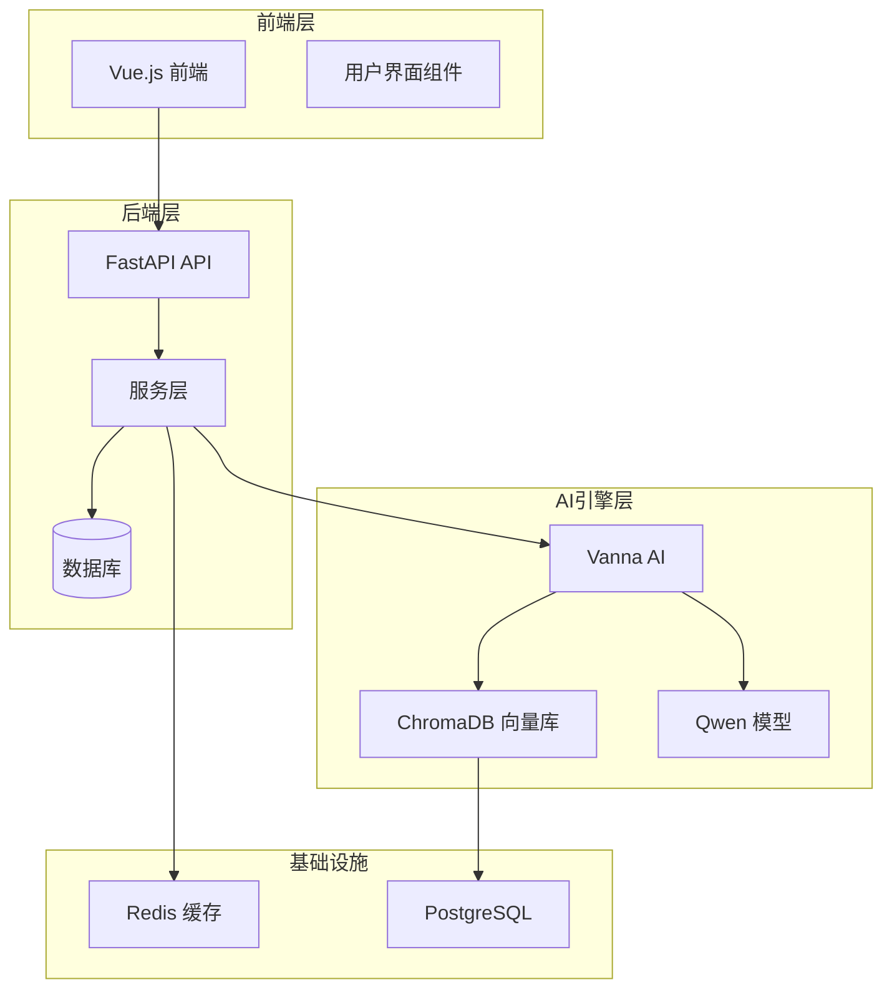
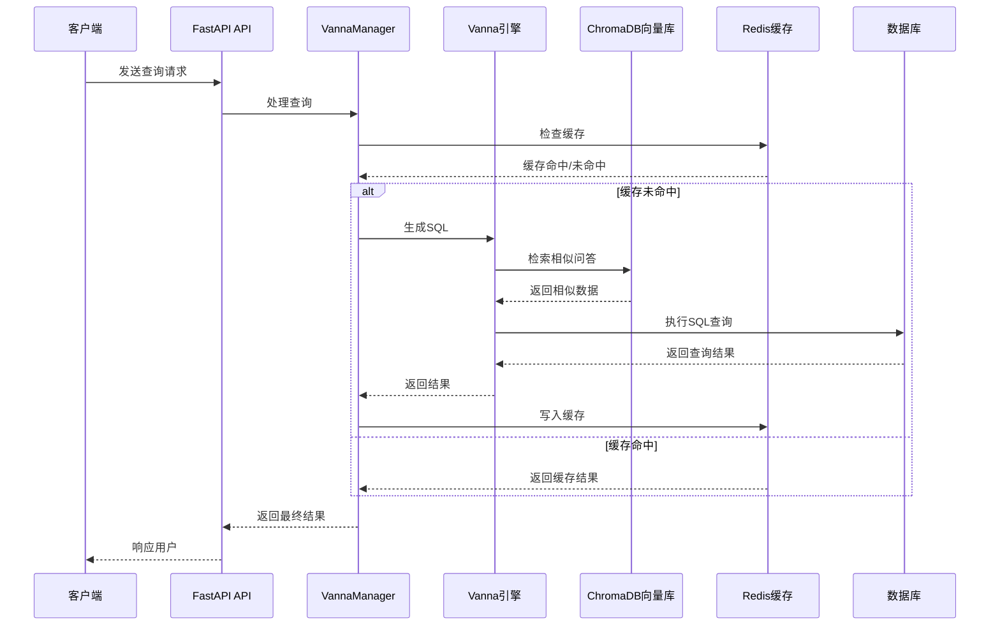
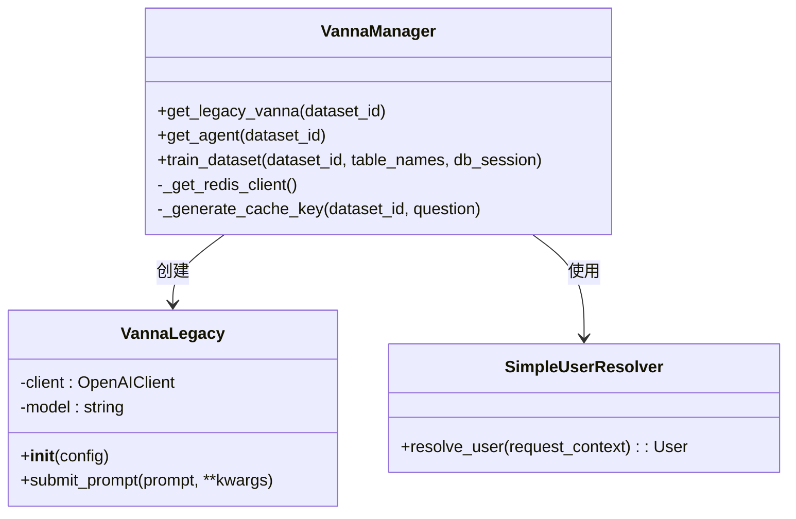
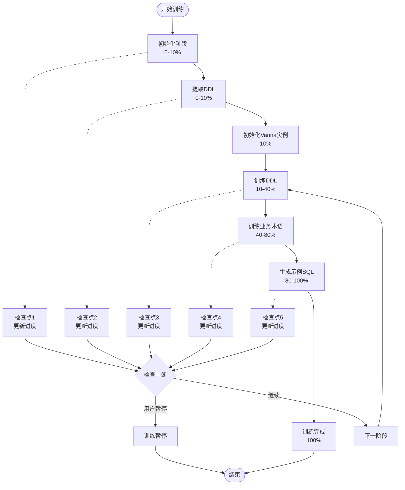
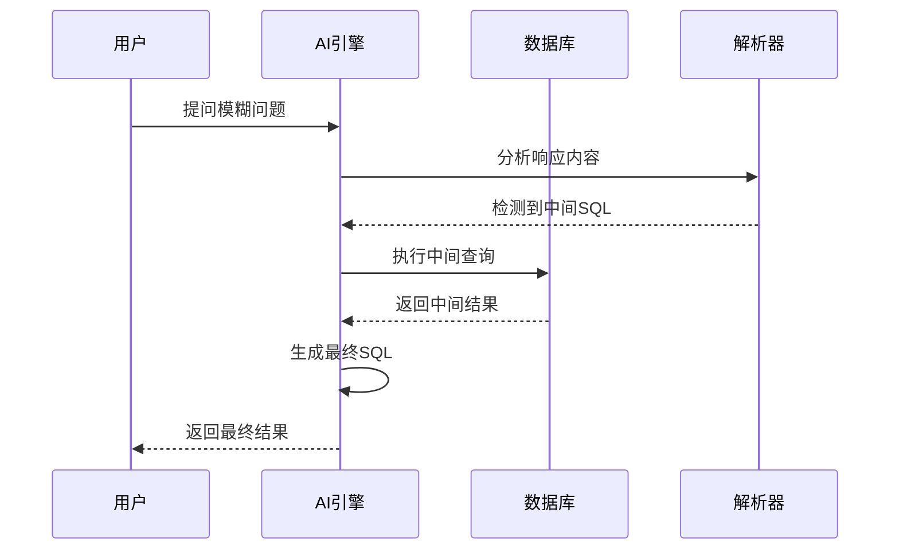
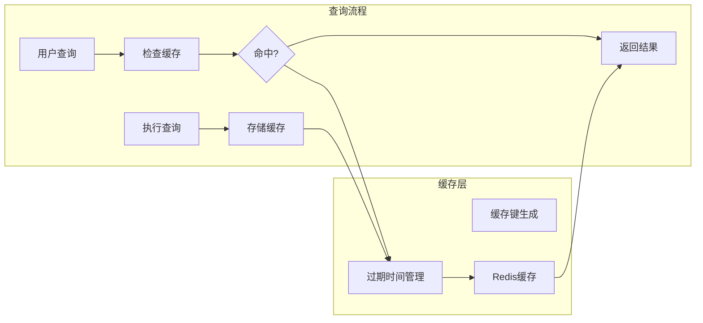
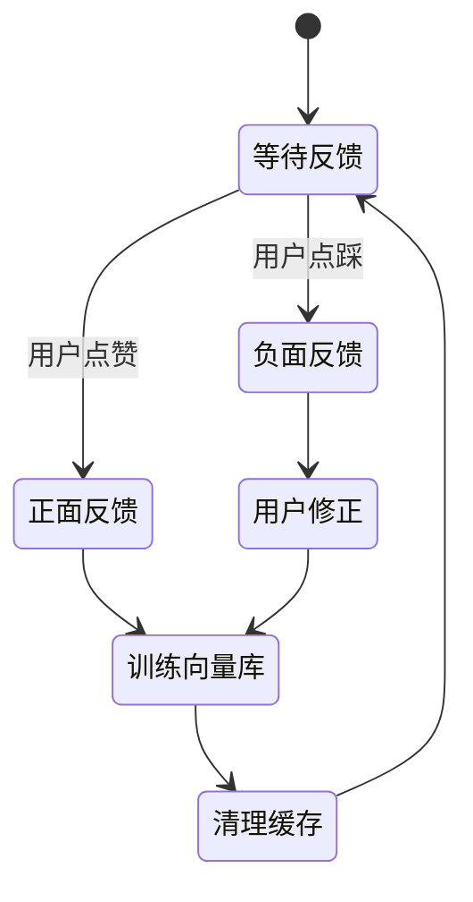
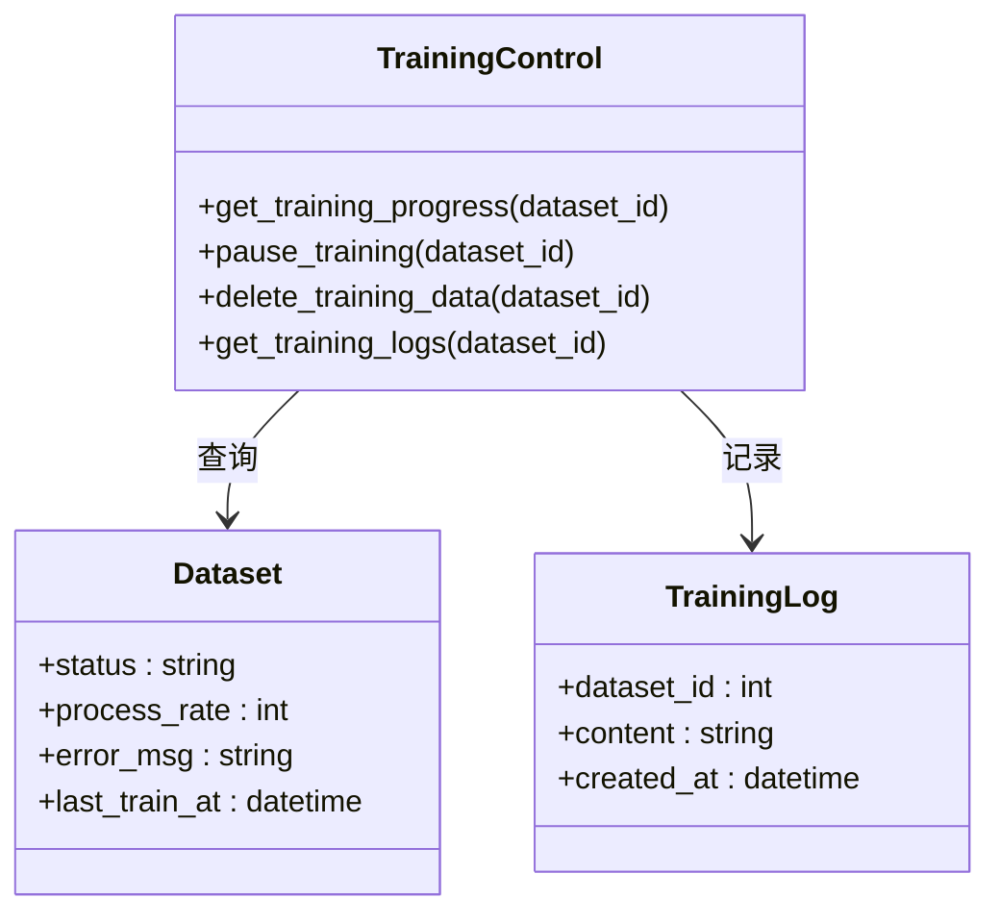
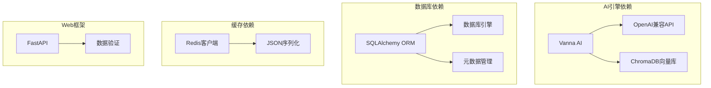
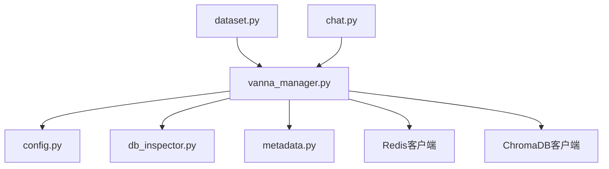

# AI引擎与训练机制

<cite>
**本文档引用的文件**
- [vanna_manager.py](file://backend/app/services/vanna_manager.py)
- [MULTI_ROUND_REASONING.md](file://docs/backend/MULTI_ROUND_REASONING.md)
- [REDIS_CACHE.md](file://docs/backend/REDIS_CACHE.md)
- [FEEDBACK_RLHF.md](file://docs/backend/FEEDBACK_RLHF.md)
- [TRAINING_CONTROL_GUIDE.md](file://backend/TRAINING_CONTROL_GUIDE.md)
- [metadata.py](file://backend/app/models/metadata.py)
- [dataset.py](file://backend/app/api/v1/endpoints/dataset.py)
- [chat.py](file://backend/app/api/v1/endpoints/chat.py)
- [config.py](file://backend/app/core/config.py)
- [db_inspector.py](file://backend/app/services/db_inspector.py)
- [test_training_flow.py](file://backend/tests/test_training_flow.py)
- [test_feedback_rlhf.py](file://backend/tests/test_feedback_rlhf.py)
- [chat.py](file://backend/app/schemas/chat.py)
- [dataset.py](file://backend/app/schemas/dataset.py)
</cite>

## 目录
1. [简介](#简介)
2. [项目结构](#项目结构)
3. [核心组件](#核心组件)
4. [架构概览](#架构概览)
5. [详细组件分析](#详细组件分析)
6. [依赖关系分析](#依赖关系分析)
7. [性能考量](#性能考量)
8. [故障排除指南](#故障排除指南)
9. [结论](#结论)

## 简介

Universal-BI 是一个基于Vanna AI的智能数据分析平台，专注于为企业用户提供自然语言到SQL的转换能力。本文档深入解析AI引擎的集成与训练流程，涵盖从初始化Vanna实例、配置Qwen等LLM模型、连接ChromaDB向量库，到完整的数据集训练过程。

系统采用现代化的架构设计，集成了多轮对话推理、查询结果缓存、反馈闭环学习等多个先进功能，为用户提供高效、准确的智能查询体验。

## 项目结构

该项目采用分层架构设计，主要包含以下核心模块：

**图表来源**
- [vanna_manager.py](file://backend/app/services/vanna_manager.py#L101-L340)
- [config.py](file://backend/app/core/config.py#L21-L42)

**章节来源**
- [vanna_manager.py](file://backend/app/services/vanna_manager.py#L1-L100)
- [config.py](file://backend/app/core/config.py#L1-L51)

## 核心组件

### VannaManager - AI引擎核心控制器

VannaManager是系统的核心组件，负责管理Vanna AI实例的生命周期、训练流程和查询执行。

#### 主要职责
- **实例管理**: 初始化和缓存Vanna实例，避免重复创建
- **训练协调**: 管理数据集训练的完整流程
- **查询执行**: 处理用户查询，集成多轮推理和缓存机制
- **缓存管理**: 实现智能查询结果缓存
- **权限控制**: 集成数据访问权限验证

#### 关键特性
- **异步训练**: 支持长时间训练任务的异步执行
- **进度跟踪**: 实时更新训练进度和状态
- **中断控制**: 支持用户中断训练任务
- **错误处理**: 完善的异常处理和日志记录

**章节来源**
- [vanna_manager.py](file://backend/app/services/vanna_manager.py#L101-L340)
- [metadata.py](file://backend/app/models/metadata.py#L35-L54)

### 数据库连接与元数据管理

系统通过DBInspector类管理数据库连接，支持多种数据库类型（MySQL、PostgreSQL、SQLite）。

#### 连接特性
- **动态URL构建**: 根据数据库类型生成连接字符串
- **密码解密**: 安全处理加密的数据库密码
- **连接池配置**: 优化连接性能和资源管理
- **DDL生成**: 自动生成数据库表结构定义

**章节来源**
- [db_inspector.py](file://backend/app/services/db_inspector.py#L13-L152)

## 架构概览

系统采用分层架构，各层职责清晰分离：

**图表来源**
- [vanna_manager.py](file://backend/app/services/vanna_manager.py#L142-L173)
- [chat.py](file://backend/app/api/v1/endpoints/chat.py#L13-L43)

## 详细组件分析

### Vanna实例初始化与配置

#### Qwen模型配置

系统使用阿里云通义千问作为主要的大语言模型：

**图表来源**
- [vanna_manager.py](file://backend/app/services/vanna_manager.py#L42-L95)
- [vanna_manager.py](file://backend/app/services/vanna_manager.py#L97-L99)

#### ChromaDB向量库集成

系统使用ChromaDB作为向量存储，支持语义检索和相似性匹配：

**章节来源**
- [vanna_manager.py](file://backend/app/services/vanna_manager.py#L222-L290)
- [config.py](file://backend/app/core/config.py#L39-L42)

### 数据集训练流程

#### 训练阶段分解

训练过程分为四个主要阶段，每个阶段都有明确的目标和进度范围：

**图表来源**
- [vanna_manager.py](file://backend/app/services/vanna_manager.py#L586-L763)

#### 训练数据类型

系统支持三种类型的训练数据：

1. **DDL训练**: 数据库表结构定义
2. **业务术语训练**: 企业特定的业务词汇和定义
3. **示例SQL训练**: 常见查询模式和示例

**章节来源**
- [vanna_manager.py](file://backend/app/services/vanna_manager.py#L648-L718)

### 多轮对话推理机制

#### 中间SQL自动检测

系统实现了智能的中间SQL检测和执行机制：

**图表来源**
- [MULTI_ROUND_REASONING.md](file://docs/backend/MULTI_ROUND_REASONING.md#L104-L155)

#### 澄清对话处理

当问题过于模糊时，系统会主动请求用户澄清：

**章节来源**
- [MULTI_ROUND_REASONING.md](file://docs/backend/MULTI_ROUND_REASONING.md#L26-L46)

### 查询结果缓存策略

#### 缓存架构设计

系统采用Redis实现智能查询结果缓存：

**图表来源**
- [vanna_manager.py](file://backend/app/services/vanna_manager.py#L142-L173)

#### 缓存键设计

缓存键采用统一格式：`bi:cache:{dataset_id}:{hash(question)}`

**章节来源**
- [REDIS_CACHE.md](file://docs/backend/REDIS_CACHE.md#L106-L115)

### 反馈闭环学习机制

#### RLHF架构

系统实现了完整的强化学习框架（RLHF）：

**图表来源**
- [FEEDBACK_RLHF.md](file://docs/backend/FEEDBACK_RLHF.md#L14-L14)

#### 训练接口

系统提供专门的训练接口来处理用户反馈：

**章节来源**
- [FEEDBACK_RLHF.md](file://docs/backend/FEEDBACK_RLHF.md#L221-L242)

### 训练控制接口

#### 进度管理

系统提供了完整的训练进度管理功能：

**图表来源**
- [dataset.py](file://backend/app/api/v1/endpoints/dataset.py#L602-L750)

**章节来源**
- [TRAINING_CONTROL_GUIDE.md](file://backend/TRAINING_CONTROL_GUIDE.md#L1-L312)

## 依赖关系分析

### 外部依赖

系统依赖多个外部库和服务：

**图表来源**
- [vanna_manager.py](file://backend/app/services/vanna_manager.py#L15-L28)

### 内部模块依赖

**图表来源**
- [vanna_manager.py](file://backend/app/services/vanna_manager.py#L1-L15)
- [dataset.py](file://backend/app/api/v1/endpoints/dataset.py#L15)
- [chat.py](file://backend/app/api/v1/endpoints/chat.py#L9)

**章节来源**
- [vanna_manager.py](file://backend/app/services/vanna_manager.py#L1-L33)

## 性能考量

### 缓存策略优化

系统采用多层次的缓存策略来提升性能：

1. **智能缓存键**: 使用MD5哈希确保唯一性
2. **TTL管理**: 默认5分钟过期时间平衡准确性与时效性
3. **自动清理**: 训练完成后自动清理相关缓存
4. **异常降级**: Redis不可用时自动降级为无缓存模式

### 训练性能优化

1. **异步训练**: 支持长时间训练任务的后台执行
2. **进度分段**: 将训练过程分为多个阶段，便于监控和中断
3. **检查点机制**: 每个阶段结束后创建检查点，支持中断恢复
4. **资源缓存**: 缓存Vanna实例和ChromaDB客户端，避免重复创建

### 查询性能优化

1. **向量检索**: 使用ChromaDB进行高效的语义检索
2. **中间SQL优化**: 通过中间查询减少不必要的复杂查询
3. **缓存命中**: 高命中率的查询结果缓存
4. **连接池管理**: 优化数据库连接性能

## 故障排除指南

### 常见问题及解决方案

#### Redis连接问题

**症状**: 缓存功能异常，查询响应缓慢

**解决方案**:
1. 检查Redis服务状态
2. 验证REDIS_URL配置
3. 确认网络连接正常
4. 查看Redis连接超时设置

#### ChromaDB实例冲突

**症状**: 训练过程中出现实例冲突错误

**解决方案**:
1. 清理缓存的Vanna实例
2. 重启应用服务
3. 检查ChromaDB持久化目录权限
4. 验证集合名称唯一性

#### 训练中断问题

**症状**: 训练任务无法正常完成

**解决方案**:
1. 检查数据集状态是否为"training"
2. 验证用户权限
3. 查看训练日志获取详细错误信息
4. 确认数据库连接正常

### 调试工具

系统提供了完善的调试和监控工具：

1. **训练日志**: 详细的训练过程记录
2. **进度监控**: 实时训练进度跟踪
3. **缓存监控**: 缓存命中率和性能统计
4. **错误日志**: 完整的错误堆栈信息

**章节来源**
- [vanna_manager.py](file://backend/app/services/vanna_manager.py#L366-L401)
- [TRAINING_CONTROL_GUIDE.md](file://backend/TRAINING_CONTROL_GUIDE.md#L202-L208)

## 结论

Universal-BI的AI引擎系统展现了现代智能数据分析平台的技术实力。通过精心设计的架构和丰富的功能特性，系统在以下几个方面表现出色：

### 技术优势

1. **模块化设计**: 清晰的分层架构便于维护和扩展
2. **智能化功能**: 多轮对话推理、自动缓存、反馈学习等先进特性
3. **高性能架构**: 异步处理、缓存优化、连接池管理
4. **完善的监控**: 详细的日志记录和状态跟踪

### 应用价值

1. **用户体验**: 简洁直观的界面和强大的查询能力
2. **业务价值**: 提升数据分析效率，降低技术门槛
3. **学习能力**: 通过用户反馈持续改进AI性能
4. **可扩展性**: 支持多种数据库和模型配置

### 未来发展

系统具备良好的扩展基础，未来可以在以下方向进一步发展：
- 支持更多类型的数据库和AI模型
- 增强多语言支持和国际化功能
- 优化大规模数据集的处理能力
- 集成更多高级分析功能

通过本文档的深入分析，开发者可以更好地理解和使用这个AI引擎系统，为构建更智能的数据分析平台奠定坚实基础。