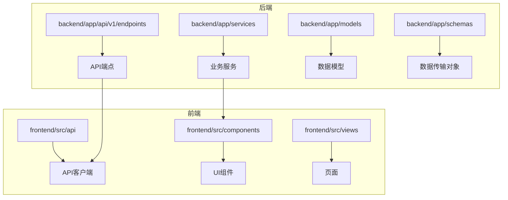
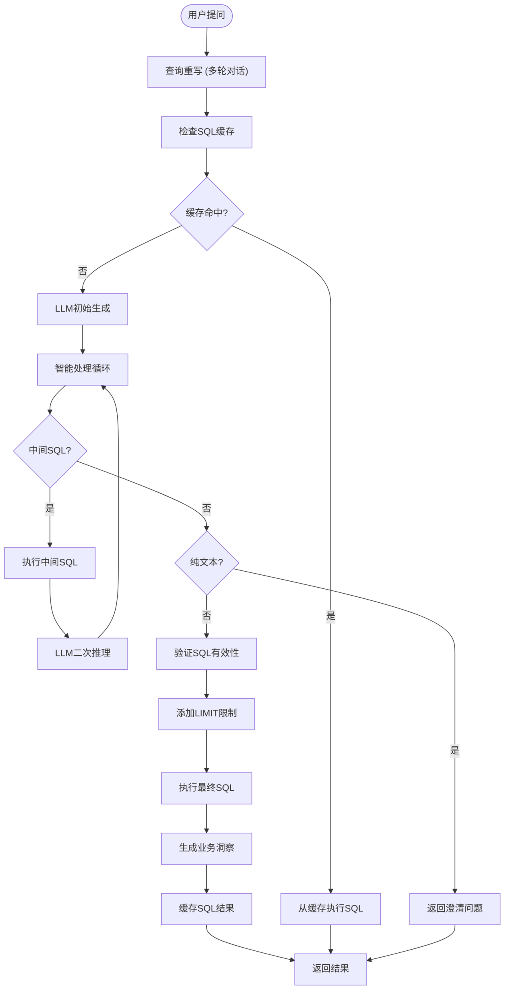
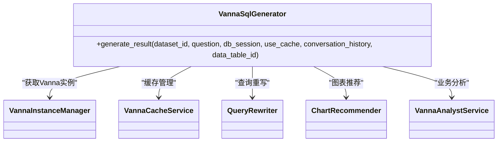
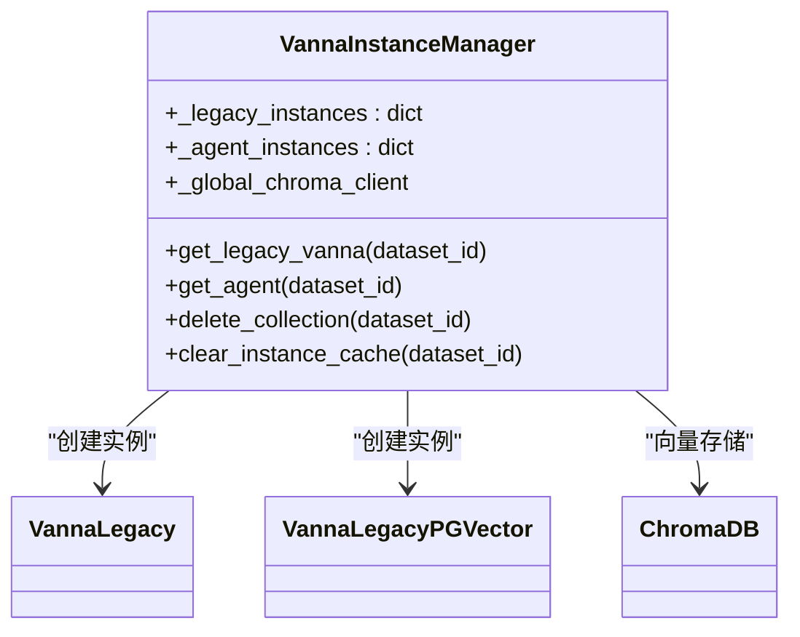
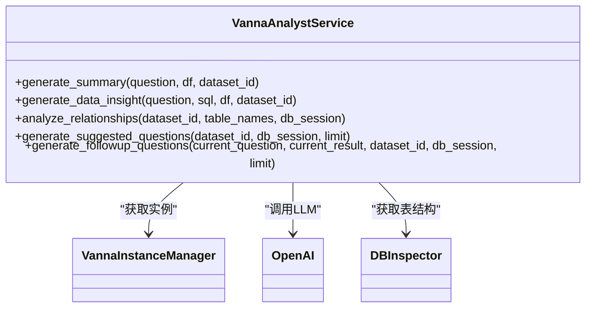
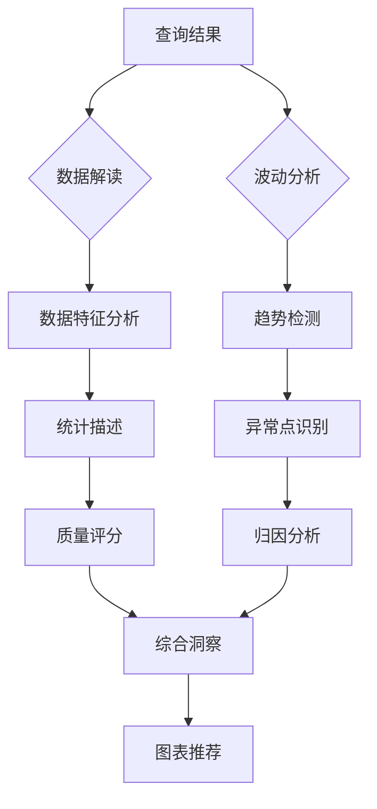
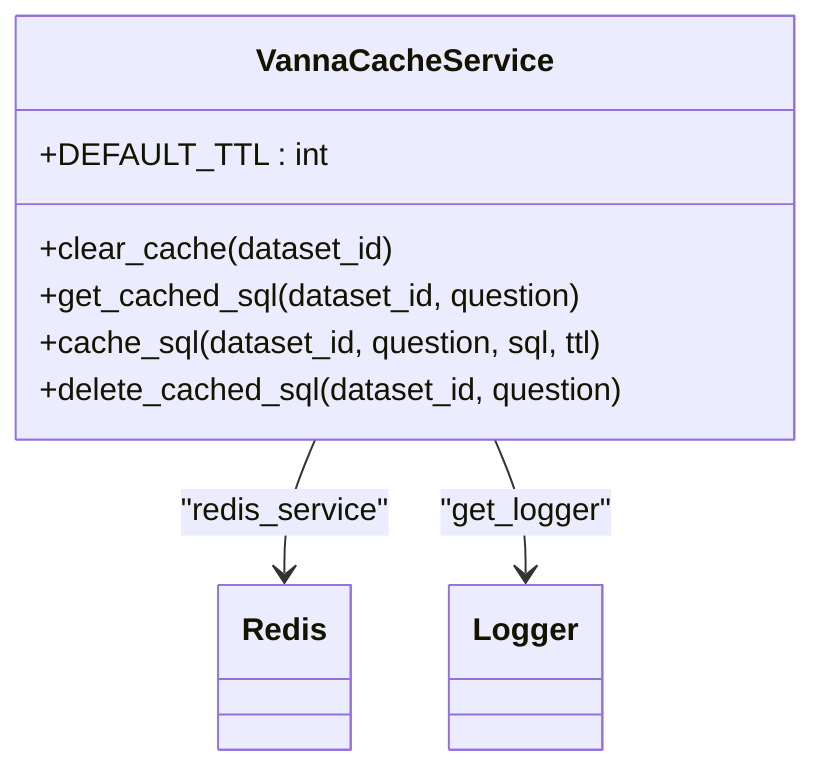
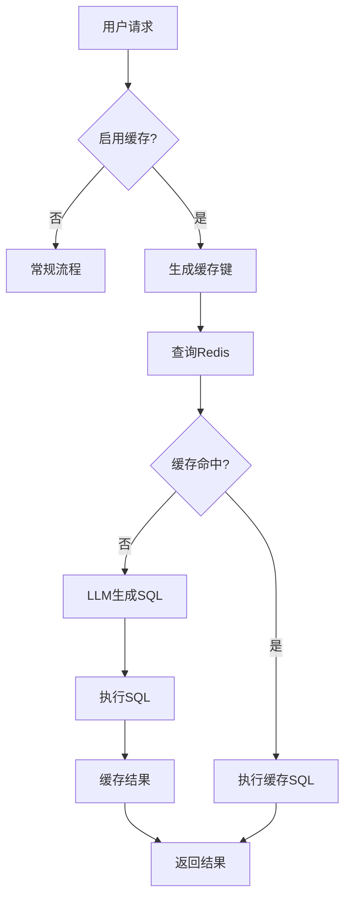
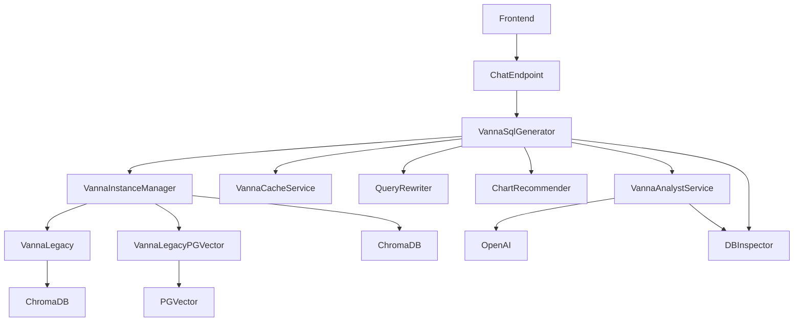
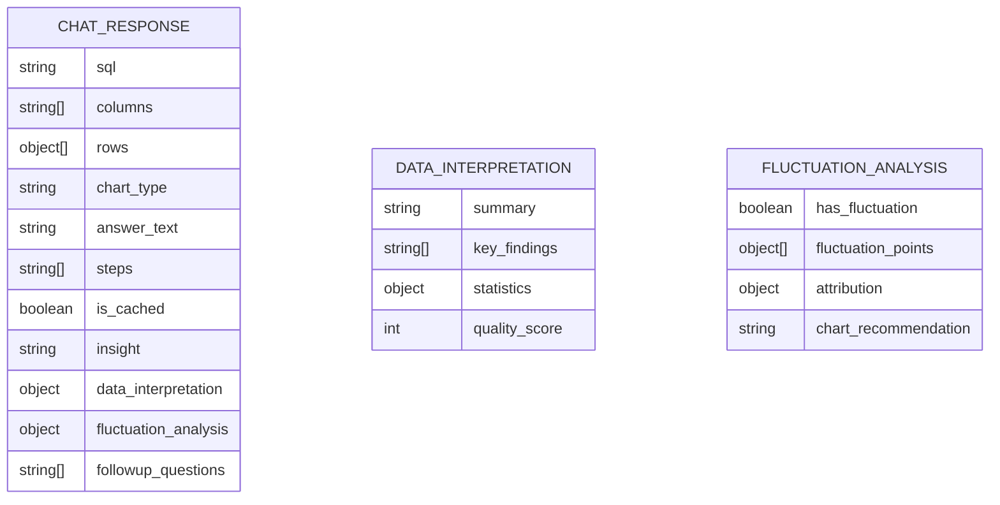

# SQL生成与分析增强

<cite>
**本文档引用的文件**   
- [sql_generator.py](file://backend/app/services/vanna/sql_generator.py)
- [facade.py](file://backend/app/services/vanna/facade.py)
- [base.py](file://backend/app/services/vanna/base.py)
- [instance_manager.py](file://backend/app/services/vanna/instance_manager.py)
- [cache_service.py](file://backend/app/services/vanna/cache_service.py)
- [utils.py](file://backend/app/services/vanna/utils.py)
- [analyst_service.py](file://backend/app/services/vanna/analyst_service.py)
- [training_service.py](file://backend/app/services/vanna/training_service.py)
- [training_data_service.py](file://backend/app/services/vanna/training_data_service.py)
- [chat.py](file://backend/app/api/v1/endpoints/chat.py)
- [chat.ts](file://frontend/src/api/chat.ts)
- [data_table.py](file://backend/app/models/data_table.py)
- [main.py](file://backend/app/main.py)
- [config.py](file://backend/app/core/config.py)
</cite>

## 目录
1. [项目结构](#项目结构)
2. [SQL生成与执行流程](#sql生成与执行流程)
3. [核心组件分析](#核心组件分析)
4. [智能分析与增强功能](#智能分析与增强功能)
5. [缓存与性能优化](#缓存与性能优化)
6. [架构与依赖关系](#架构与依赖关系)
7. [前端集成](#前端集成)
8. [配置与部署](#配置与部署)

## 项目结构

项目采用分层架构，主要分为后端和前端两大模块。后端基于FastAPI框架，实现了数据访问、业务逻辑和API接口。前端使用Vue3和TypeScript构建用户界面。

**架构来源**
- [main.py](file://backend/app/main.py#L71-L166)
- [chat.py](file://backend/app/api/v1/endpoints/chat.py#L28-L800)
- [chat.ts](file://frontend/src/api/chat.ts#L64-L180)

## SQL生成与执行流程

系统通过Vanna框架实现自然语言到SQL的转换，整个流程包含多个智能处理环节。

**流程来源**
- [sql_generator.py](file://backend/app/services/vanna/sql_generator.py#L35-L763)
- [utils.py](file://backend/app/services/vanna/utils.py#L156-L222)

## 核心组件分析

### SQL生成器服务

`VannaSqlGenerator`类是SQL生成的核心组件，负责将自然语言问题转换为可执行的SQL语句。

**组件来源**
- [sql_generator.py](file://backend/app/services/vanna/sql_generator.py#L27-L763)
- [facade.py](file://backend/app/services/vanna/facade.py#L114-L118)

### 实例管理器

`VannaInstanceManager`负责管理Vanna实例的生命周期，确保实例的复用和缓存。

**组件来源**
- [instance_manager.py](file://backend/app/services/vanna/instance_manager.py#L19-L294)
- [base.py](file://backend/app/services/vanna/base.py#L35-L370)

## 智能分析与增强功能

系统提供多种智能分析功能，增强数据分析的深度和广度。

### 业务分析服务

`VannaAnalystService`提供高级数据分析功能，包括摘要生成、洞察分析和关系分析。

**服务来源**
- [analyst_service.py](file://backend/app/services/vanna/analyst_service.py#L24-L667)
- [chat.py](file://backend/app/api/v1/endpoints/chat.py#L278-L323)

### 数据解读与波动分析

系统集成了数据解读和波动分析功能，帮助用户理解数据特征。

**分析来源**
- [analyst_service.py](file://backend/app/services/vanna/analyst_service.py#L97-L179)
- [fluctuation_analyzer.py](file://backend/app/services/fluctuation_analyzer.py)
- [data_insight.py](file://backend/app/services/data_insight.py)

## 缓存与性能优化

系统通过多层缓存机制提升性能和响应速度。

### 缓存服务

`VannaCacheService`提供异步Redis缓存服务，支持SQL查询结果的缓存。

**缓存来源**
- [cache_service.py](file://backend/app/services/vanna/cache_service.py#L14-L126)
- [redis.py](file://backend/app/core/redis.py)

### 缓存流程

**流程来源**
- [sql_generator.py](file://backend/app/services/vanna/sql_generator.py#L124-L282)
- [cache_service.py](file://backend/app/services/vanna/cache_service.py#L62-L105)

## 架构与依赖关系

系统采用模块化设计，各组件之间有清晰的依赖关系。

**架构来源**
- [facade.py](file://backend/app/services/vanna/facade.py)
- [sql_generator.py](file://backend/app/services/vanna/sql_generator.py)
- [main.py](file://backend/app/main.py)

## 前端集成

前端通过API与后端服务进行交互，实现完整的用户界面。

### API响应结构

**集成来源**
- [chat.ts](file://frontend/src/api/chat.ts#L20-L33)
- [chat.py](file://backend/app/api/v1/endpoints/chat.py#L28-L800)
- [schemas/chat.py](file://backend/app/schemas/chat.py)

## 配置与部署

系统通过配置文件管理各种运行时参数。

### 配置项

| 配置项 | 描述 | 默认值 |
|-------|------|-------|
| `DEV` | 开发环境标志 | `True` |
| `SECRET_KEY` | JWT密钥 | "change_this_to_a_secure_random_key_in_production" |
| `CORS_ORIGINS` | 跨域来源 | "*" |
| `SQLALCHEMY_DATABASE_URI` | 主数据库连接 | "mysql+pymysql://root@localhost:3306/universal_bi" |
| `DASHSCOPE_API_KEY` | 通义千问API密钥 | "" |
| `QWEN_MODEL` | 使用的模型 | "qwen-max" |
| `REDIS_URL` | Redis连接 | "redis://localhost:6379/0" |
| `VECTOR_STORE_TYPE` | 向量数据库类型 | "chromadb" |
| `CHROMA_PERSIST_DIR` | ChromaDB持久化目录 | "./chroma_db" |

**配置来源**
- [config.py](file://backend/app/core/config.py#L5-L73)
- [.env.example](file://.env.example)