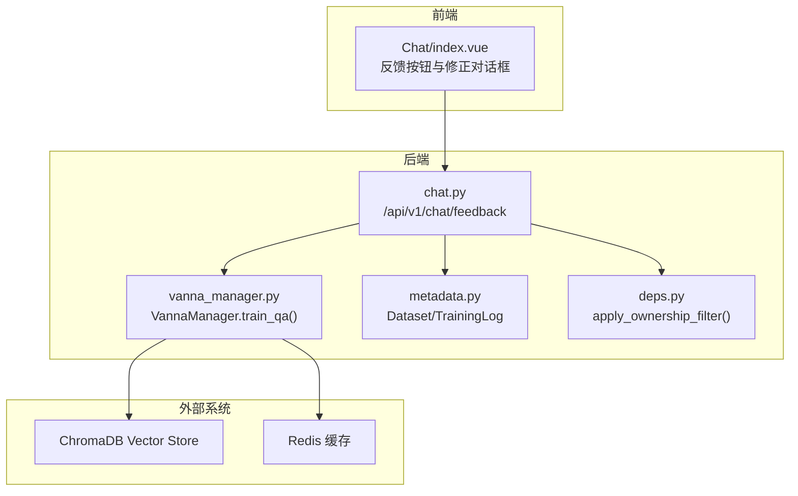
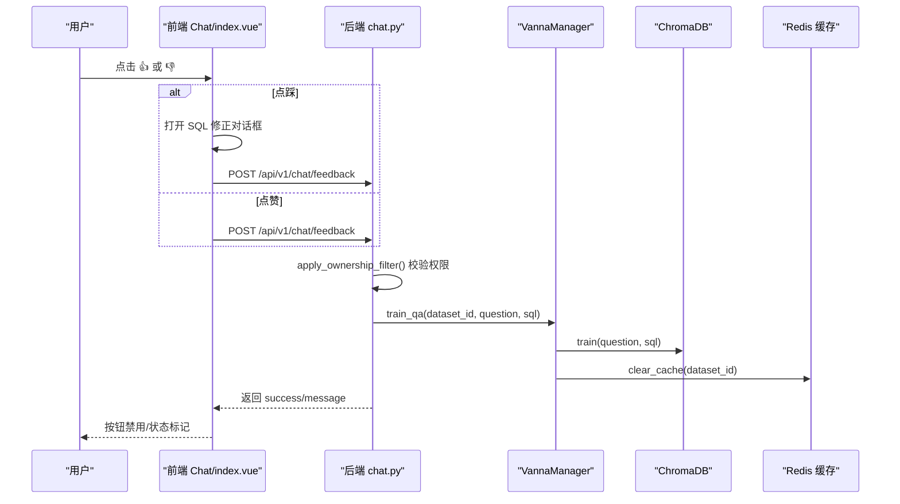
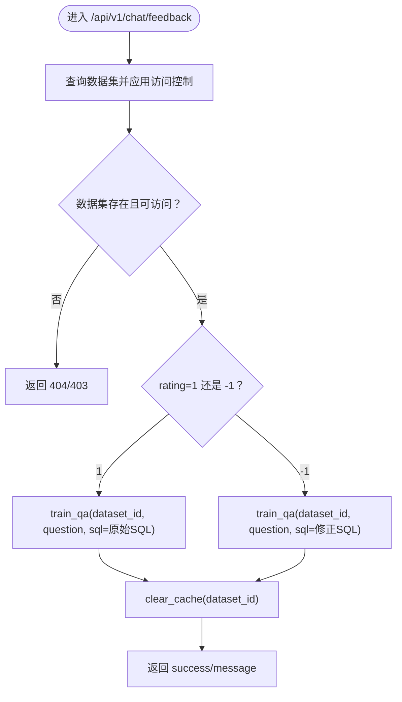
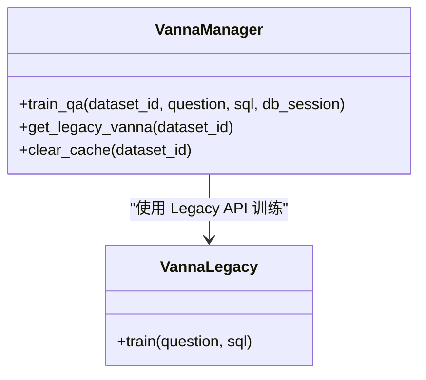
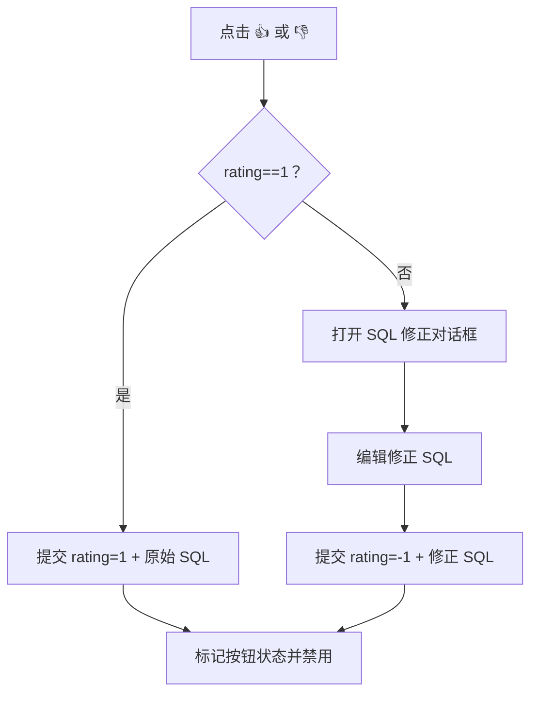
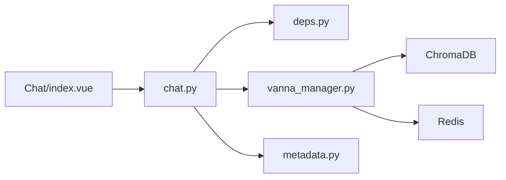

# 反馈闭环与强化学习

<cite>
**本文引用的文件**
- [FEEDBACK_RLHF.md](file://docs/backend/FEEDBACK_RLHF.md)
- [CHANGELOG_FEEDBACK.md](file://docs/backend/CHANGELOG_FEEDBACK.md)
- [train_qa_fix.py](file://backend/scripts/train_qa_fix.py)
- [test_feedback_rlhf.py](file://backend/tests/test_feedback_rlhf.py)
- [chat.py](file://backend/app/api/v1/endpoints/chat.py)
- [vanna_manager.py](file://backend/app/services/vanna_manager.py)
- [chat.py（schema）](file://backend/app/schemas/chat.py)
- [index.vue](file://frontend/src/views/Chat/index.vue)
- [FEEDBACK_USER_GUIDE.md](file://docs/frontend/FEEDBACK_USER_GUIDE.md)
- [metadata.py](file://backend/app/models/metadata.py)
- [deps.py](file://backend/app/api/deps.py)
</cite>

## 目录
1. [简介](#简介)
2. [项目结构](#项目结构)
3. [核心组件](#核心组件)
4. [架构总览](#架构总览)
5. [详细组件分析](#详细组件分析)
6. [依赖关系分析](#依赖关系分析)
7. [性能考量](#性能考量)
8. [故障排查指南](#故障排查指南)
9. [结论](#结论)
10. [附录](#附录)

## 简介
本文件系统化阐述 ChatBI 的用户反馈驱动强化学习机制（RLHF）。该机制通过“点赞/点踩”交互，将用户修正 SQL 的行为转化为高质量训练样本，注入向量库（ChromaDB）以提升 SQL 生成准确率。文档覆盖反馈数据的采集、清洗与去重策略、训练注入流程、缓存清理与生效机制、权限控制、版本回溯与历史追踪、以及企业级审批流程集成建议。同时给出通过 API 触发模型再训练与评估新模型性能的方法。

## 项目结构
围绕 RLHF 的关键目录与文件如下：
- 后端 API：/backend/app/api/v1/endpoints/chat.py
- 训练服务：/backend/app/services/vanna_manager.py
- 前端交互：/frontend/src/views/Chat/index.vue
- 反馈脚本：/backend/scripts/train_qa_fix.py
- 测试脚本：/backend/tests/test_feedback_rlhf.py
- 文档：docs/backend/FEEDBACK_RLHF.md、docs/backend/CHANGELOG_FEEDBACK.md、docs/frontend/FEEDBACK_USER_GUIDE.md
- 数据模型：backend/app/models/metadata.py
- 依赖与权限：backend/app/api/deps.py
- Schema 定义：backend/app/schemas/chat.py

图示来源
- [chat.py](file://backend/app/api/v1/endpoints/chat.py#L44-L112)
- [vanna_manager.py](file://backend/app/services/vanna_manager.py#L101-L270)
- [metadata.py](file://backend/app/models/metadata.py#L35-L80)
- [deps.py](file://backend/app/api/deps.py#L97-L124)
- [index.vue](file://frontend/src/views/Chat/index.vue#L238-L265)

章节来源
- [chat.py](file://backend/app/api/v1/endpoints/chat.py#L1-L156)
- [vanna_manager.py](file://backend/app/services/vanna_manager.py#L101-L270)
- [index.vue](file://frontend/src/views/Chat/index.vue#L1-L800)

## 核心组件
- 反馈 API：接收 rating=1（点赞）或 rating=-1（点踩）的反馈，调用训练服务注入向量库，并清理缓存。
- 训练服务：封装 Vanna 训练入口，统一训练问答对、术语、文档与 DDL，并提供缓存清理与集合删除能力。
- 前端交互：提供点赞/点踩按钮与 SQL 修正对话框，防重复提交，标记反馈状态。
- 权限与数据隔离：基于 owner_id 的访问控制，公共资源仅超级管理员可训练。
- 训练数据存储：ChromaDB 向量库，键空间包含训练计划集合与文档元数据。
- 缓存清理：训练后清理 Redis 缓存，确保新知识立即生效。

章节来源
- [chat.py](file://backend/app/api/v1/endpoints/chat.py#L44-L112)
- [vanna_manager.py](file://backend/app/services/vanna_manager.py#L101-L270)
- [index.vue](file://frontend/src/views/Chat/index.vue#L238-L265)
- [deps.py](file://backend/app/api/deps.py#L97-L124)

## 架构总览
反馈闭环的关键流程：
1. 用户在前端点击“点赞/点踩”，若点踩则弹出 SQL 修正对话框。
2. 前端调用后端 /api/v1/chat/feedback 接口，携带 dataset_id、question、sql、rating。
3. 后端进行数据集访问权限校验与公共资源训练限制。
4. 调用 VannaManager.train_qa，使用 Legacy API 将问答对写入 ChromaDB。
5. 自动清理 Redis 缓存，确保新训练立即生效。
6. 返回成功提示，前端标记按钮状态，防止重复提交。

图示来源
- [chat.py](file://backend/app/api/v1/endpoints/chat.py#L44-L112)
- [vanna_manager.py](file://backend/app/services/vanna_manager.py#L174-L220)
- [index.vue](file://frontend/src/views/Chat/index.vue#L238-L265)

章节来源
- [chat.py](file://backend/app/api/v1/endpoints/chat.py#L44-L112)
- [vanna_manager.py](file://backend/app/services/vanna_manager.py#L174-L220)
- [index.vue](file://frontend/src/views/Chat/index.vue#L238-L265)

## 详细组件分析

### 后端 API：反馈接口
- 接口路径：/api/v1/chat/feedback
- 请求体：dataset_id、question、sql、rating（1 或 -1）
- 权限控制：通过 apply_ownership_filter 校验数据集访问权限；公共资源仅超级管理员可训练。
- 逻辑分支：
  - rating=1：训练原始 SQL
  - rating=-1：训练用户提供的修正 SQL
- 响应：success 与 message

图示来源
- [chat.py](file://backend/app/api/v1/endpoints/chat.py#L44-L112)
- [deps.py](file://backend/app/api/deps.py#L97-L124)

章节来源
- [chat.py](file://backend/app/api/v1/endpoints/chat.py#L44-L112)
- [deps.py](file://backend/app/api/deps.py#L97-L124)

### 训练服务：VannaManager.train_qa
- 功能：使用 Legacy Vanna API 训练问答对，写入 ChromaDB 向量库。
- 效果：问答对立即入库，随后清理 Redis 缓存，确保新知识生效。
- 关键实现点：
  - get_legacy_vanna(collection_name)：按数据集构建向量库集合名并复用实例。
  - clear_cache(dataset_id)：清理 bi:cache 与 bi:sql_cache 前缀键。
  - 训练后清理缓存，避免旧缓存覆盖新知识。

图示来源
- [vanna_manager.py](file://backend/app/services/vanna_manager.py#L101-L270)

章节来源
- [vanna_manager.py](file://backend/app/services/vanna_manager.py#L101-L270)

### 前端交互：反馈按钮与修正对话框
- UI 位置：Chat/index.vue 的消息气泡底部。
- 交互逻辑：
  - 点赞：提交 rating=1，标记按钮为已反馈，禁用。
  - 点踩：打开 SQL 修正对话框，预填当前 SQL，提交 rating=-1 与修正 SQL。
  - 防重复：feedbackGiven 字段控制按钮禁用状态。
- 修正对话框：提供 textarea 输入与提交按钮，提示“AI 会学习你提供的正确 SQL”。

图示来源
- [index.vue](file://frontend/src/views/Chat/index.vue#L238-L265)

章节来源
- [index.vue](file://frontend/src/views/Chat/index.vue#L238-L265)

### 训练数据存储与语义检索
- ChromaDB 集合命名：training-plan-{dataset_id} 或 vec_ds_{dataset_id}
- 文档结构：包含 id、question、content（SQL）、training_data_type 等元数据。
- 语义检索：向量库中 Top-K 相似问题优先参考，结合 DDL/文档生成最终 SQL。

章节来源
- [FEEDBACK_RLHF.md](file://docs/backend/FEEDBACK_RLHF.md#L366-L387)

### 缓存清理策略
- 清理时机：训练后立即清理，避免缓存命中导致新知识不生效。
- 清理键前缀：bi:cache:{dataset_id}:* 与 bi:sql_cache:{dataset_id}:*
- 清理实现：通过 Redis keys 匹配与 delete 批量删除。

章节来源
- [vanna_manager.py](file://backend/app/services/vanna_manager.py#L174-L220)
- [FEEDBACK_RLHF.md](file://docs/backend/FEEDBACK_RLHF.md#L389-L408)

### 反馈数据清洗、验证与去重
- 清洗与验证（建议实现）：
  - SQL 语法校验：通过解析器或最小执行尝试，拒绝语法错误的 SQL。
  - 业务一致性：与数据字典、业务术语对齐，避免逻辑不符。
  - 性能阈值：排除明显低效或冗余的 SQL。
- 去重策略（建议实现）：
  - 基于问题哈希与 SQL 哈希的联合去重。
  - 时间窗口内（如 1 小时）相同问题的重复修正合并为一次训练。
  - 语义近似检测：使用向量相似度阈值过滤高度相似的问答对。
- 注入训练：通过 Legacy API 的 train(question, sql) 写入向量库。

章节来源
- [FEEDBACK_RLHF.md](file://docs/backend/FEEDBACK_RLHF.md#L352-L363)

### 反馈积分机制与数据权重分配
- 权重建议（概念性设计）：
  - 基础权重：点赞 +1，点踩修正 +2（修正更宝贵）。
  - 时间衰减：近期反馈权重更高（例如按天指数衰减）。
  - 专家权重：超级管理员或特定角色的反馈权重倍增。
  - 业务重要性：核心业务场景权重更高。
- 分配策略：
  - 向量库中为每个问答对设置 metadata.weight。
  - 检索时按权重加权排序，Top-K 选择时优先高权重样本。
  - 训练时可将高权重样本重复写入或增强采样频率。

章节来源
- [FEEDBACK_RLHF.md](file://docs/backend/FEEDBACK_RLHF.md#L352-L363)

### 版本回溯与历史追踪
- 历史追踪（建议实现）：
  - 训练日志表：记录每次训练的 question、sql、时间戳、权重、来源（用户/脚本）。
  - 训练批次：按日期/批次号归档，支持导出与回滚。
  - 变更记录：记录集合删除、缓存清理、模型切换等关键事件。
- 回溯能力（建议实现）：
  - 训练回滚：删除指定批次的向量记录并恢复旧缓存。
  - A/B 对比：保留两套向量库，对比不同批次的准确率。
- CHANGELOG 体现：
  - 反馈机制完善、文档与测试脚本新增、功能状态更新等。

章节来源
- [CHANGELOG_FEEDBACK.md](file://docs/backend/CHANGELOG_FEEDBACK.md#L1-L306)
- [metadata.py](file://backend/app/models/metadata.py#L70-L80)

### 企业级审批流程集成建议
- 审批节点（建议实现）：
  - 点踩修正需审批：超阈值或跨部门修正需审批人确认。
  - 权限矩阵：普通用户仅能点赞；点踩修正需具备相应数据集权限。
  - 审批流：提交 → 自动校验 → 审批人 → 审批通过/驳回 → 训练或退回。
- 审批记录：
  - 审批日志：记录审批人、时间、意见、最终决策。
  - 审批回溯：支持查看历史审批与决策依据。
- 与 CI/CD 集成：
  - 审批通过后触发训练脚本或 API，自动注入向量库。
  - 失败回滚：审批驳回时回退到上一个稳定版本。

章节来源
- [deps.py](file://backend/app/api/deps.py#L97-L124)
- [FEEDBACK_RLHF.md](file://docs/backend/FEEDBACK_RLHF.md#L305-L315)

### 通过 API 触发模型再训练与评估
- 触发训练：
  - 使用 /api/v1/chat/feedback 提交 rating=1 或 rating=-1 的反馈。
  - 后端调用 VannaManager.train_qa，写入向量库并清理缓存。
- 评估新模型性能：
  - 基准测试：准备一组固定问题与期望 SQL，计算准确率、召回率、F1。
  - A/B 对比：对比训练前后相同问题的 SQL 生成一致性。
  - 人工评估：抽样评估 SQL 正确性、可读性、性能。
  - 指标监控：记录点赞率、点踩率、训练后准确率提升。

章节来源
- [test_feedback_rlhf.py](file://backend/tests/test_feedback_rlhf.py#L134-L181)
- [FEEDBACK_RLHF.md](file://docs/backend/FEEDBACK_RLHF.md#L455-L472)

## 依赖关系分析
- 前端依赖后端 API 提供反馈接口与聊天结果。
- 后端依赖 VannaManager 提供训练与缓存清理能力。
- VannaManager 依赖 ChromaDB 与 Redis。
- 权限控制依赖 apply_ownership_filter 与用户角色。

图示来源
- [chat.py](file://backend/app/api/v1/endpoints/chat.py#L1-L156)
- [vanna_manager.py](file://backend/app/services/vanna_manager.py#L101-L270)
- [deps.py](file://backend/app/api/deps.py#L97-L124)
- [metadata.py](file://backend/app/models/metadata.py#L35-L80)

章节来源
- [chat.py](file://backend/app/api/v1/endpoints/chat.py#L1-L156)
- [vanna_manager.py](file://backend/app/services/vanna_manager.py#L101-L270)
- [deps.py](file://backend/app/api/deps.py#L97-L124)

## 性能考量
- 缓存清理：训练后立即清理，避免缓存命中导致新知识延迟生效。
- 向量检索：合理设置 n_results，平衡召回与性能。
- 训练频率：高频修正建议合并批次，减少向量库写放大。
- Redis 连接：复用连接池，避免频繁连接/断开。
- 前端渲染：消息列表虚拟滚动，避免长对话内存压力。

章节来源
- [vanna_manager.py](file://backend/app/services/vanna_manager.py#L174-L220)
- [FEEDBACK_RLHF.md](file://docs/backend/FEEDBACK_RLHF.md#L389-L408)

## 故障排查指南
- 反馈提交失败：
  - 检查数据集访问权限与公共资源训练限制。
  - 前端捕获错误并输出详细提示。
- 训练后效果不明显：
  - 手动清理 Redis 缓存；多次训练相同问答对提升权重；使用更通用的问题表述。
- SQL 修正对话框不显示：
  - 检查消息对象是否包含必要字段（sql/question/datasetId）；添加调试日志定位问题。

章节来源
- [FEEDBACK_RLHF.md](file://docs/backend/FEEDBACK_RLHF.md#L474-L530)
- [test_feedback_rlhf.py](file://backend/tests/test_feedback_rlhf.py#L183-L239)

## 结论
ChatBI 的 RLHF 机制通过“点赞/点踩”与 SQL 修正，将用户反馈转化为高质量训练样本，注入向量库并立即生效。配合权限控制、缓存清理与文档化流程，系统实现了零配置学习与持续优化。建议在企业环境中引入审批流程、权重分配与历史追踪，进一步提升反馈质量与可审计性，并通过 API 触发再训练与 A/B 评估，形成闭环的模型治理体系。

## 附录
- 用户指南：docs/frontend/FEEDBACK_USER_GUIDE.md
- 技术文档：docs/backend/FEEDBACK_RLHF.md
- 更新日志：docs/backend/CHANGELOG_FEEDBACK.md
- 训练脚本：backend/scripts/train_qa_fix.py
- 测试脚本：backend/tests/test_feedback_rlhf.py