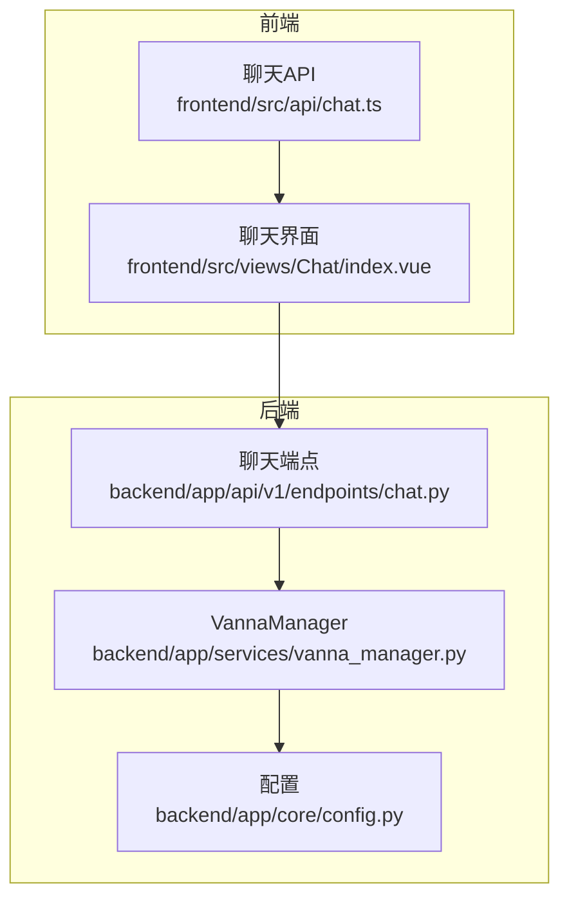
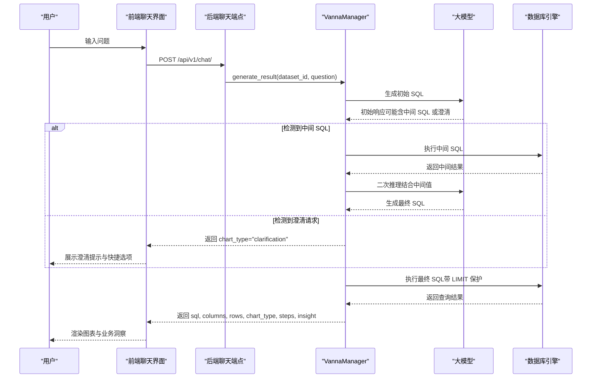
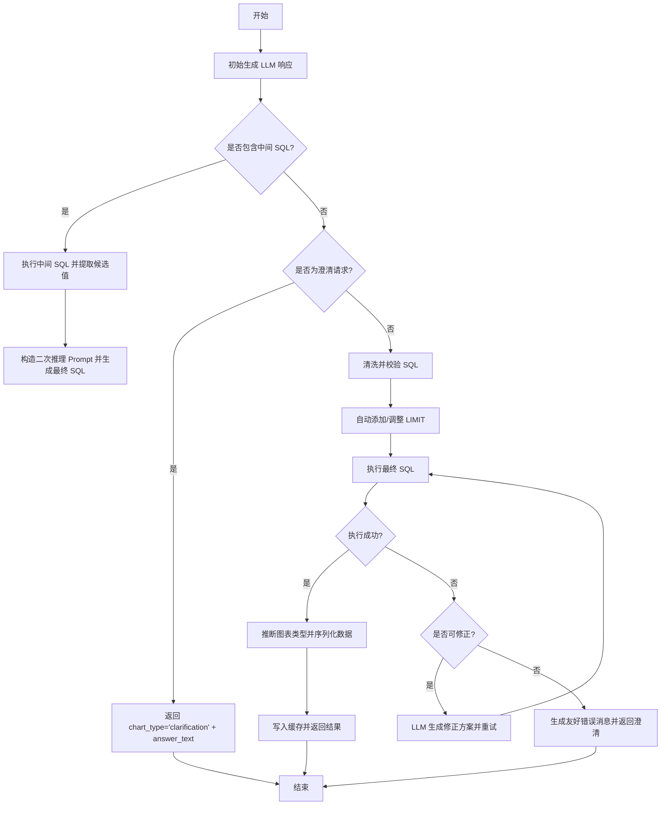
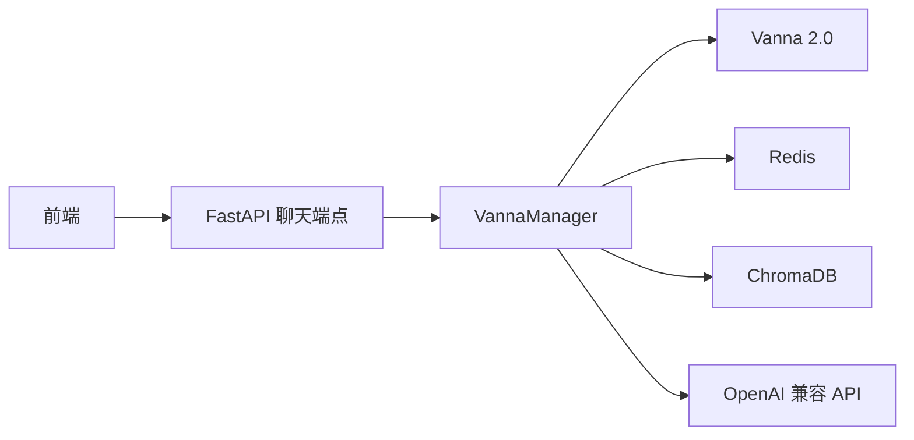

# 多轮推理与澄清机制

<cite>
**本文引用的文件**
- [MULTI_ROUND_REASONING.md](file://docs/backend/MULTI_ROUND_REASONING.md)
- [QUICK_START_MULTI_ROUND.md](file://docs/backend/QUICK_START_MULTI_ROUND.md)
- [vanna_manager.py](file://backend/app/services/vanna_manager.py)
- [chat.py](file://backend/app/api/v1/endpoints/chat.py)
- [chat.py（前端接口定义）](file://backend/app/schemas/chat.py)
- [聊天API（前端）](file://frontend/src/api/chat.ts)
- [聊天界面（前端）](file://frontend/src/views/Chat/index.vue)
- [配置（后端）](file://backend/app/core/config.py)
- [单元测试（多轮）](file://backend/tests/manual_scripts/test_multi_round.py)
</cite>

## 目录
1. [引言](#引言)
2. [项目结构](#项目结构)
3. [核心组件](#核心组件)
4. [架构总览](#架构总览)
5. [详细组件分析](#详细组件分析)
6. [依赖关系分析](#依赖关系分析)
7. [性能考量](#性能考量)
8. [故障排查指南](#故障排查指南)
9. [结论](#结论)
10. [附录](#附录)

## 引言
本文件围绕多轮对话与用户澄清机制的实现原理进行系统化说明，结合 MULTI_ROUND_REASONING.md 与 vanna_manager.py 的实现，阐述系统如何识别模糊查询、生成澄清问题、维护对话上下文状态；同时说明对话历史在服务层的存储结构与上下文窗口管理策略；并基于 QUICK_START_MULTI_ROUND.md 提供快速启用多轮推理的配置指南。文档还解释 AI 如何基于用户反馈调整 SQL 生成方向，并支持多轮修正后的最终查询确认；最后给出从初始提问到多次澄清再到成功执行的完整交互示例，以及异常情况（如超时、上下文溢出）的处理方式。

## 项目结构
本项目采用前后端分离架构，后端基于 FastAPI，前端基于 Vue3 + Element Plus。多轮推理与澄清机制主要由后端服务层的 VannaManager 实现，前端负责渲染与交互。

图示来源
- [chat.py](file://backend/app/api/v1/endpoints/chat.py#L1-L156)
- [vanna_manager.py](file://backend/app/services/vanna_manager.py#L868-L1332)
- [chat.ts（前端接口定义）](file://backend/app/schemas/chat.py#L1-L38)
- [聊天API（前端）](file://frontend/src/api/chat.ts#L1-L65)
- [聊天界面（前端）](file://frontend/src/views/Chat/index.vue#L1-L800)
- [配置（后端）](file://backend/app/core/config.py#L1-L51)

章节来源
- [chat.py](file://backend/app/api/v1/endpoints/chat.py#L1-L156)
- [vanna_manager.py](file://backend/app/services/vanna_manager.py#L868-L1332)
- [chat.py（前端接口定义）](file://backend/app/schemas/chat.py#L1-L38)
- [聊天API（前端）](file://frontend/src/api/chat.ts#L1-L65)
- [聊天界面（前端）](file://frontend/src/views/Chat/index.vue#L1-L800)
- [配置（后端）](file://backend/app/core/config.py#L1-L51)

## 核心组件
- VannaManager.generate_result：多轮推理与澄清的核心流程入口，负责：
  - 识别中间 SQL 并自动执行
  - 识别澄清请求并返回特殊格式
  - 执行最终 SQL 并进行自愈（错误修正）
  - 缓存策略与上下文窗口管理
- 聊天端点 chat：接收用户问题，调用 VannaManager 并返回标准化响应
- 前端聊天界面：渲染澄清提示、执行步骤、图表与业务洞察

章节来源
- [vanna_manager.py](file://backend/app/services/vanna_manager.py#L868-L1332)
- [chat.py](file://backend/app/api/v1/endpoints/chat.py#L1-L156)
- [聊天界面（前端）](file://frontend/src/views/Chat/index.vue#L120-L180)

## 架构总览
下图展示了从用户提问到多轮澄清与最终执行的关键交互流程，包括中间 SQL 检测、澄清请求识别、SQL 执行与自愈机制。

图示来源
- [chat.py](file://backend/app/api/v1/endpoints/chat.py#L13-L43)
- [vanna_manager.py](file://backend/app/services/vanna_manager.py#L1035-L1307)
- [聊天界面（前端）](file://frontend/src/views/Chat/index.vue#L580-L637)

## 详细组件分析

### VannaManager 多轮推理与澄清流程
- 初始生成：调用 LLM 生成 SQL 或澄清文本
- 中间 SQL 检测：通过显式标记与隐式模式识别中间查询
- 中间 SQL 执行：自动执行并收集候选值，驱动第二轮生成
- 澄清请求识别：当响应不含有效 SQL 或过短 SQL 时，判定为澄清请求
- 最终 SQL 执行：自动添加 LIMIT 保护，执行并推断图表类型
- 自愈机制：SQL 执行失败时，LLM 生成修正方案并重试
- 缓存策略：SQL 缓存与结果缓存双通道，提升性能

图示来源
- [vanna_manager.py](file://backend/app/services/vanna_manager.py#L1035-L1307)

章节来源
- [vanna_manager.py](file://backend/app/services/vanna_manager.py#L868-L1332)
- [MULTI_ROUND_REASONING.md](file://docs/backend/MULTI_ROUND_REASONING.md#L104-L155)

### 中间 SQL 检测与执行
- 显式模式：识别包含“intermediate_sql”标记的响应，提取其后的 SQL
- 隐式模式：识别包含不确定性关键词且包含 DISTINCT 查询的响应
- 执行与回退：中间 SQL 执行失败时记录步骤并回退到原始响应

章节来源
- [vanna_manager.py](file://backend/app/services/vanna_manager.py#L1477-L1544)
- [MULTI_ROUND_REASONING.md](file://docs/backend/MULTI_ROUND_REASONING.md#L61-L87)

### 澄清请求识别
- 关键词检测：支持中英文澄清关键词集合
- SQL 长度判断：若响应包含 SQL 但长度过短，视为不完整，判定为澄清

章节来源
- [vanna_manager.py](file://backend/app/services/vanna_manager.py#L1546-L1585)
- [MULTI_ROUND_REASONING.md](file://docs/backend/MULTI_ROUND_REASONING.md#L90-L103)

### SQL 清洗与有效性校验
- Markdown 去除：移除代码块标记
- 标记清理：移除“intermediate_sql”标记
- 结构校验：确保 SELECT/ FROM 出现在合理位置

章节来源
- [vanna_manager.py](file://backend/app/services/vanna_manager.py#L1587-L1606)
- [vanna_manager.py](file://backend/app/services/vanna_manager.py#L1416-L1445)

### 上下文窗口与缓存策略
- SQL 缓存：仅缓存 SQL 字符串，TTL 7 天，命中后重新执行以获取最新数据
- 结果缓存：缓存完整结果，TTL 5 分钟
- 缓存键：基于 dataset_id 与问题哈希生成
- Redis 客户端：连接池与超时保护，异常降级

章节来源
- [vanna_manager.py](file://backend/app/services/vanna_manager.py#L894-L974)
- [vanna_manager.py](file://backend/app/services/vanna_manager.py#L1177-L1210)
- [配置（后端）](file://backend/app/core/config.py#L26-L29)

### 前端集成与交互
- 澄清对话渲染：chart_type='clarification' 时显示黄色提示框与快捷选项
- 执行步骤追踪：折叠面板展示详细步骤，区分成功/失败/修正
- 业务洞察：同步返回分析师 Agent 的业务洞察
- 反馈机制：支持点赞/踩反馈，用于后续训练

章节来源
- [聊天界面（前端）](file://frontend/src/views/Chat/index.vue#L120-L180)
- [聊天界面（前端）](file://frontend/src/views/Chat/index.vue#L639-L682)
- [聊天API（前端）](file://frontend/src/api/chat.ts#L1-L65)

### 快速启用多轮推理（配置指南）
- 启动后端与前端
- 访问前端页面，选择已训练完成的数据集
- 提问“查询大客户数量”观察多轮推理
- 提问“统计订单”观察澄清提示
- 查看后端日志与前端执行步骤

章节来源
- [QUICK_START_MULTI_ROUND.md](file://docs/backend/QUICK_START_MULTI_ROUND.md#L1-L184)

### 实际交互流程示例
- 初始提问：“查询大客户数量”
- 第一轮：AI 返回中间 SQL（DISTINCT 类型查询）
- 中间 SQL 执行：返回候选值列表
- 第二轮：AI 基于候选值生成最终 SQL
- 执行最终 SQL：返回结果并渲染图表
- 若出现超时：返回友好提示，建议缩小时间范围或添加筛选条件
- 若 SQL 错误：LLM 生成修正方案并重试

章节来源
- [MULTI_ROUND_REASONING.md](file://docs/backend/MULTI_ROUND_REASONING.md#L157-L220)
- [vanna_manager.py](file://backend/app/services/vanna_manager.py#L1212-L1297)

## 依赖关系分析
- 后端依赖
  - Vanna 2.0：用于 SQL 生成与向量检索
  - Redis：查询缓存与结果缓存
  - ChromaDB：向量存储与检索
  - OpenAI 兼容 API：调用大模型
- 前端依赖
  - Element Plus：UI 组件库
  - Axios：HTTP 请求封装

图示来源
- [vanna_manager.py](file://backend/app/services/vanna_manager.py#L1-L50)
- [chat.py](file://backend/app/api/v1/endpoints/chat.py#L1-L156)
- [聊天API（前端）](file://frontend/src/api/chat.ts#L1-L65)

章节来源
- [vanna_manager.py](file://backend/app/services/vanna_manager.py#L1-L50)
- [chat.py](file://backend/app/api/v1/endpoints/chat.py#L1-L156)
- [聊天API（前端）](file://frontend/src/api/chat.ts#L1-L65)

## 性能考量
- 中间 SQL 执行：建议设置 LIMIT 与超时保护，避免慢查询
- 缓存策略：SQL 缓存（7 天）与结果缓存（5 分钟）双通道，减少重复计算
- 图表类型推断：基于列数、列类型与时间特征自动选择最优图表
- 自愈重试：最多两次修正尝试，避免无限循环

章节来源
- [vanna_manager.py](file://backend/app/services/vanna_manager.py#L1114-L1133)
- [vanna_manager.py](file://backend/app/services/vanna_manager.py#L1334-L1368)
- [MULTI_ROUND_REASONING.md](file://docs/backend/MULTI_ROUND_REASONING.md#L293-L304)

## 故障排查指南
- 中间 SQL 执行失败：查看后端日志“中间 SQL 执行失败”，系统会回退到原始响应
- 澄清对话未触发：检查 LLM 是否返回中间 SQL 或澄清关键词，必要时调整关键词列表
- 响应时间过长：为中间查询添加 LIMIT，设置查询超时，考虑缓存常见中间查询
- SQL 超时：系统会生成友好提示，建议缩小时间范围或添加筛选条件
- 缓存异常：Redis 连接失败时自动降级，不影响主流程

章节来源
- [vanna_manager.py](file://backend/app/services/vanna_manager.py#L320-L340)
- [vanna_manager.py](file://backend/app/services/vanna_manager.py#L1217-L1243)
- [QUICK_START_MULTI_ROUND.md](file://docs/backend/QUICK_START_MULTI_ROUND.md#L110-L132)

## 结论
多轮推理与澄清机制通过“中间 SQL 自动检测与执行 + 澄清对话 + 自愈修正”的组合，显著提升了系统处理模糊查询的能力。配合缓存与上下文窗口管理策略，系统在保证用户体验的同时兼顾性能与稳定性。前端通过清晰的 UI 与执行步骤追踪，帮助用户理解 AI 的思考过程并参与修正，形成良好的人机协作闭环。

## 附录
- 单元测试：覆盖中间 SQL 提取、澄清请求识别、SQL 清洗与完整工作流
- 前端集成要点：处理 chart_type='clarification'，渲染快捷选项与执行步骤

章节来源
- [单元测试（多轮）](file://backend/tests/manual_scripts/test_multi_round.py#L1-L203)
- [聊天界面（前端）](file://frontend/src/views/Chat/index.vue#L120-L180)