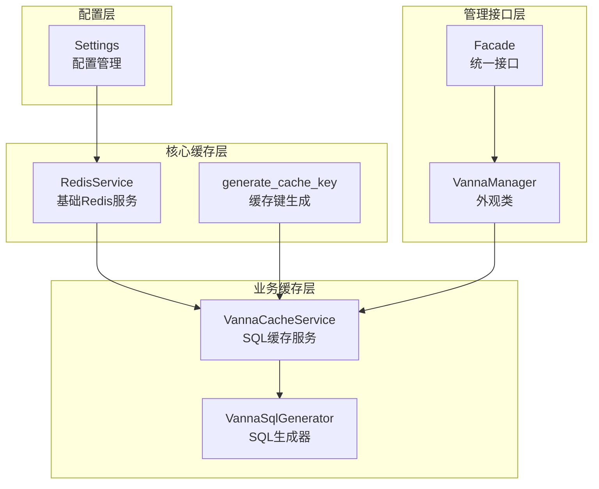
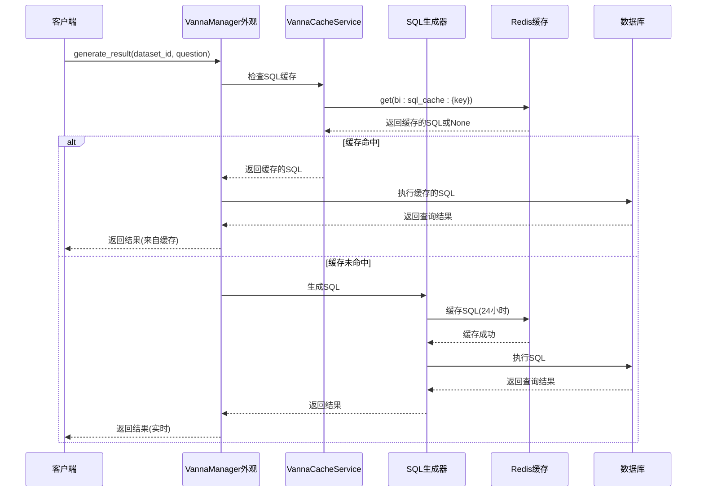
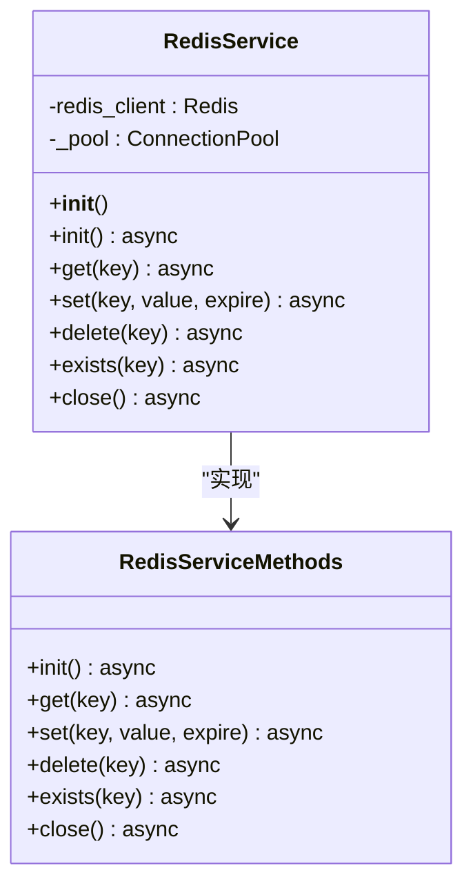
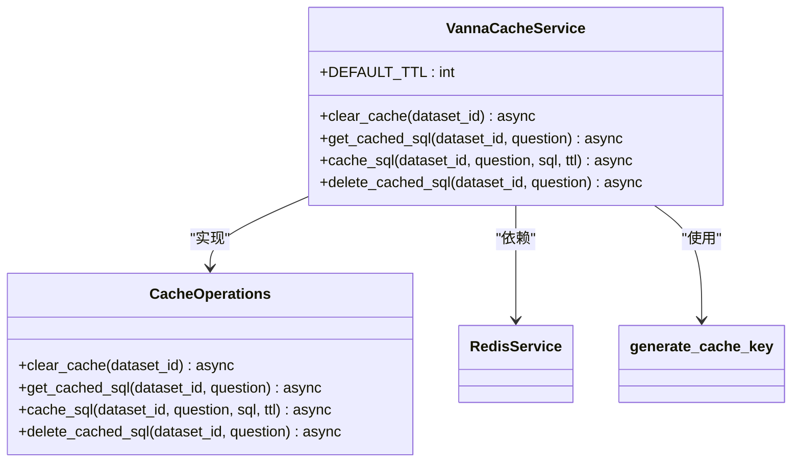
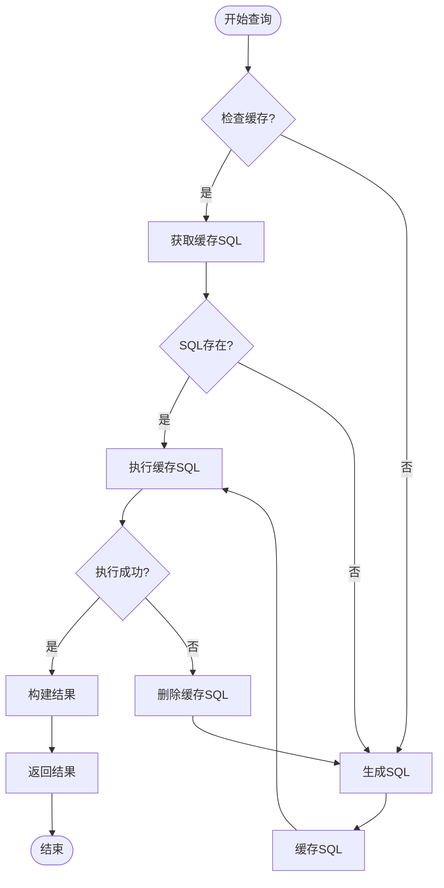
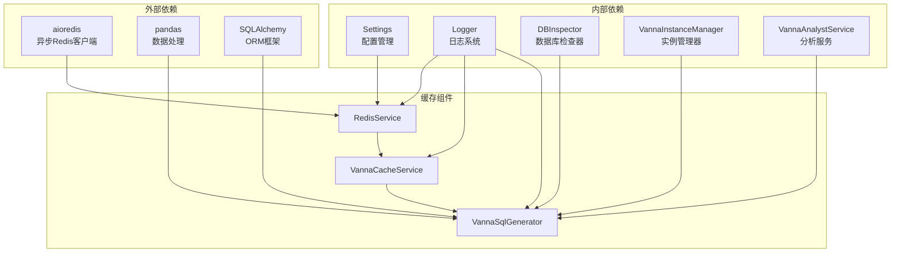

# Redis缓存集成

<cite>
**本文档引用的文件**
- [redis.py](file://backend/app/core/redis.py)
- [cache_service.py](file://backend/app/services/vanna/cache_service.py)
- [sql_generator.py](file://backend/app/services/vanna/sql_generator.py)
- [facade.py](file://backend/app/services/vanna/facade.py)
- [config.py](file://backend/app/core/config.py)
- [test_redis_cache.py](file://backend/tests/manual_scripts/test_redis_cache.py)
- [clear_cache.py](file://backend/clear_cache.py)
- [REDIS_CACHE.md](file://docs/backend/REDIS_CACHE.md)
</cite>

## 目录
1. [简介](#简介)
2. [项目结构](#项目结构)
3. [核心组件](#核心组件)
4. [架构概览](#架构概览)
5. [详细组件分析](#详细组件分析)
6. [依赖关系分析](#依赖关系分析)
7. [性能考虑](#性能考虑)
8. [故障排除指南](#故障排除指南)
9. [结论](#结论)

## 简介

Redis缓存集成是Universal BI智能问答系统的重要性能优化组件。该系统实现了两层缓存机制：SQL缓存和结果缓存，旨在显著提升查询响应速度，同时确保数据的实时性和准确性。

系统采用异步Redis连接池设计，支持智能缓存键生成、自动序列化/反序列化、异常降级等特性。缓存策略包括：
- **SQL缓存**：缓存生成的SQL语句，TTL为24小时
- **结果缓存**：缓存完整的查询结果，TTL为5分钟
- **自动清理**：数据集重新训练或更新术语时自动清除相关缓存

## 项目结构

Redis缓存功能在项目中的组织结构如下：

**图表来源**
- [redis.py](file://backend/app/core/redis.py#L13-L180)
- [cache_service.py](file://backend/app/services/vanna/cache_service.py#L14-L126)
- [sql_generator.py](file://backend/app/services/vanna/sql_generator.py#L24-L200)
- [facade.py](file://backend/app/services/vanna/facade.py#L18-L152)

**章节来源**
- [redis.py](file://backend/app/core/redis.py#L1-L180)
- [cache_service.py](file://backend/app/services/vanna/cache_service.py#L1-L126)
- [sql_generator.py](file://backend/app/services/vanna/sql_generator.py#L1-L200)

## 核心组件

### RedisService基础服务

RedisService是整个缓存系统的基础，提供了异步Redis连接管理和基本操作：

**主要特性：**
- 异步连接池管理
- 自动序列化/反序列化支持
- 多种数据类型处理
- 错误处理和降级机制

**关键方法：**
- `init()` - 初始化Redis连接池
- `get()` - 获取缓存值（支持JSON和Pickle）
- `set()` - 设置缓存值（自动序列化）
- `delete()` - 删除缓存键
- `exists()` - 检查键是否存在
- `close()` - 关闭连接池

### VannaCacheService缓存服务

VannaCacheService专门负责SQL缓存管理，实现了完整的缓存生命周期管理：

**缓存策略：**
- **SQL缓存键格式**：`bi:sql_cache:{dataset_id}:{md5(question)}`
- **结果缓存键格式**：`bi:cache:{dataset_id}:{md5(question)}`
- **默认TTL**：SQL缓存7天，结果缓存5分钟

**核心功能：**
- `clear_cache()` - 清除指定数据集的缓存
- `get_cached_sql()` - 获取缓存的SQL
- `cache_sql()` - 缓存SQL查询
- `delete_cached_sql()` - 删除SQL缓存

### 缓存键生成器

generate_cache_key函数提供了智能的缓存键生成机制：

**生成规则：**
- 输入：前缀 + dataset_id + 问题内容
- 处理：将所有参数转换为字符串并MD5哈希
- 输出：`{prefix}:{md5_hash}`格式

**优势：**
- 确保相同问题生成相同键
- 避免键冲突
- 支持灵活的键命名空间

**章节来源**
- [redis.py](file://backend/app/core/redis.py#L13-L180)
- [cache_service.py](file://backend/app/services/vanna/cache_service.py#L14-L126)

## 架构概览

Redis缓存系统采用分层架构设计，确保了良好的可维护性和扩展性：

**图表来源**
- [facade.py](file://backend/app/services/vanna/facade.py#L115-L118)
- [cache_service.py](file://backend/app/services/vanna/cache_service.py#L62-L105)
- [sql_generator.py](file://backend/app/services/vanna/sql_generator.py#L70-L171)

## 详细组件分析

### RedisService类分析

RedisService实现了完整的Redis连接管理，采用了异步编程模式：

**设计特点：**
- **异步连接池**：使用aioredis.ConnectionPool确保连接复用
- **自动序列化**：支持JSON和Pickle两种序列化方式
- **错误处理**：优雅的异常捕获和降级机制
- **资源管理**：正确的连接关闭和清理

**章节来源**
- [redis.py](file://backend/app/core/redis.py#L13-L180)

### VannaCacheService类分析

VannaCacheService专注于SQL缓存管理，实现了业务特定的缓存策略：

**缓存策略：**
- **SQL缓存**：存储生成的SQL语句，TTL为24小时
- **结果缓存**：存储完整查询结果，TTL为5分钟
- **批量清理**：支持按数据集清理所有相关缓存

**章节来源**
- [cache_service.py](file://backend/app/services/vanna/cache_service.py#L14-L126)

### SQL生成器缓存集成

VannaSqlGenerator集成了缓存机制，实现了智能的缓存策略：

**缓存流程：**
1. **SQL缓存检查**：优先检查SQL缓存
2. **SQL执行**：执行缓存的SQL获取最新数据
3. **结果构建**：构建最终的查询结果
4. **缓存清理**：处理执行失败的情况

**章节来源**
- [sql_generator.py](file://backend/app/services/vanna/sql_generator.py#L32-L171)

## 依赖关系分析

Redis缓存系统与其他组件的依赖关系如下：

**依赖特点：**
- **低耦合**：各组件间依赖关系清晰
- **单向依赖**：缓存服务依赖于其他服务，而非相反
- **异步支持**：全面支持异步编程模式
- **错误隔离**：缓存失败不影响核心功能

**图表来源**
- [redis.py](file://backend/app/core/redis.py#L5-L10)
- [cache_service.py](file://backend/app/services/vanna/cache_service.py#L8-L11)
- [sql_generator.py](file://backend/app/services/vanna/sql_generator.py#L13-L21)

**章节来源**
- [redis.py](file://backend/app/core/redis.py#L1-L180)
- [cache_service.py](file://backend/app/services/vanna/cache_service.py#L1-L126)
- [sql_generator.py](file://backend/app/services/vanna/sql_generator.py#L1-L200)

## 性能考虑

### 缓存性能优化

Redis缓存系统在性能方面采用了多项优化策略：

**连接池优化：**
- 最大连接数限制为10
- 自动连接复用
- 异步非阻塞操作

**序列化优化：**
- JSON序列化用于基本数据类型
- Pickle序列化用于复杂对象
- 自动类型检测和选择

**缓存策略优化：**
- SQL缓存24小时，减少LLM调用
- 结果缓存5分钟，保证数据新鲜度
- 智能键生成避免冲突

### 监控和调试

系统提供了完善的监控机制：

**日志记录：**
- 缓存命中/未命中统计
- SQL执行时间监控
- 错误处理和降级记录

**性能指标：**
- 缓存检查耗时
- SQL执行耗时
- 总体响应时间

## 故障排除指南

### 常见问题及解决方案

**问题1：Redis连接失败**
- **症状**：缓存功能降级，所有查询正常但无缓存效果
- **原因**：Redis服务器不可达或配置错误
- **解决**：检查REDIS_URL配置，确认Redis服务运行状态

**问题2：缓存数据不一致**
- **症状**：查询结果显示过期数据
- **原因**：缓存TTL过长或缓存未及时清理
- **解决**：调整REDIS_CACHE_TTL配置，触发缓存清理

**问题3：缓存键冲突**
- **症状**：不同问题产生相同缓存键
- **原因**：问题内容相似导致MD5哈希冲突
- **解决**：检查问题输入，确保唯一性

### 调试工具

**缓存清理工具：**
- 支持按数据集清理缓存
- 支持清理所有缓存
- 提供交互式和命令行模式

**测试脚本：**
- 完整的缓存功能测试套件
- 连接状态检查
- 序列化/反序列化验证
- 异常降级测试

**章节来源**
- [test_redis_cache.py](file://backend/tests/manual_scripts/test_redis_cache.py#L1-L363)
- [clear_cache.py](file://backend/clear_cache.py#L1-L104)

## 结论

Redis缓存集成为Universal BI系统提供了显著的性能提升，通过智能的两层缓存策略，在保证数据准确性的同时大幅提升了查询响应速度。

**主要优势：**
- **性能提升**：缓存命中时响应时间从秒级降至毫秒级
- **可靠性**：Redis不可用时自动降级，不影响核心功能
- **灵活性**：支持多种缓存策略和TTL配置
- **可维护性**：清晰的架构设计和完善的监控机制

**未来改进方向：**
- 更精细的缓存粒度控制
- 缓存预热机制
- 分布式缓存支持
- 缓存统计和分析功能增强

该缓存系统为智能问答平台提供了坚实的技术基础，能够有效支撑大规模用户访问和高并发查询场景。