# 查询结果缓存策略

<cite>
**本文档引用的文件**
- [REDIS_CACHE.md](file://docs/backend/REDIS_CACHE.md)
- [example_redis_cache.py](file://backend/example_redis_cache.py)
- [monitor_redis.py](file://backend/monitor_redis.py)
- [clear_cache.py](file://backend/clear_cache.py)
- [test_redis_cache.py](file://backend/tests/manual_scripts/test_redis_cache.py)
- [vanna_manager.py](file://backend/app/services/vanna_manager.py)
- [config.py](file://backend/app/core/config.py)
- [chat.py](file://backend/app/api/v1/endpoints/chat.py)
- [requirements.txt](file://backend/requirements.txt)
- [sql_generator.py](file://backend/app/services/vanna/sql_generator.py)
- [cache_service.py](file://backend/app/services/vanna/cache_service.py)
- [chat.ts](file://frontend/src/api/chat.ts)
</cite>

## 更新摘要
**变更内容**
- 更新了缓存TTL策略，从5分钟调整为24小时
- 添加了新的异步Redis缓存服务实现
- 新增了`/chat`端点的`use_cache`参数说明
- 增加了前端缓存指示器的相关内容
- 更新了架构概览和详细组件分析以反映最新实现

## 目录
1. [简介](#简介)
2. [项目结构](#项目结构)
3. [核心组件](#核心组件)
4. [架构概览](#架构概览)
5. [详细组件分析](#详细组件分析)
6. [依赖关系分析](#依赖关系分析)
7. [性能考虑](#性能考虑)
8. [故障排除指南](#故障排除指南)
9. [结论](#结论)

## 简介

本项目实现了基于Redis的智能查询结果缓存机制，旨在显著提升自然语言查询系统的响应速度。该缓存系统采用双重缓存策略，既缓存完整的查询结果，也缓存SQL语句，通过智能的缓存键生成、过期策略和自动失效机制，确保数据的准确性和时效性。

缓存系统的核心特点包括：
- ✅ **智能缓存**：自动缓存成功的查询结果
- ✅ **快速响应**：命中缓存时可秒级返回结果
- ✅ **自动过期**：默认24小时TTL，避免过期数据
- ✅ **异常降级**：Redis不可用时自动降级，不影响核心功能
- ✅ **自动清理**：数据集重新训练或更新术语时自动清除相关缓存

## 项目结构

该项目采用模块化的架构设计，Redis缓存功能主要分布在以下模块中：

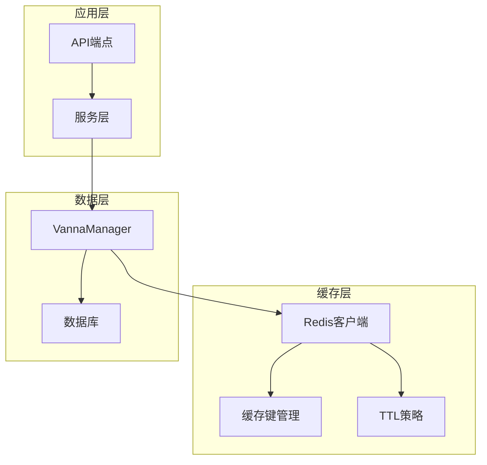

**图表来源**
- [vanna_manager.py](file://backend/app/services/vanna_manager.py#L101-L141)
- [config.py](file://backend/app/core/config.py#L26-L29)

**章节来源**
- [vanna_manager.py](file://backend/app/services/vanna_manager.py#L1-L100)
- [config.py](file://backend/app/core/config.py#L1-L51)

## 核心组件

### Redis缓存配置

缓存系统通过统一的配置管理，支持灵活的缓存策略调整：

| 配置项 | 默认值 | 描述 |
|--------|--------|------|
| REDIS_URL | redis://localhost:6379/0 | Redis连接URL |
| REDIS_CACHE_TTL | 86400秒 | 结果缓存过期时间（24小时） |
| SQL_CACHE_TTL | 604800秒 | SQL缓存过期时间（7天） |

**章节来源**
- [config.py](file://backend/app/core/config.py#L38-L41)

### 缓存键生成策略

系统采用MD5哈希算法对自然语言查询进行哈希化处理，确保缓存键的唯一性和稳定性：

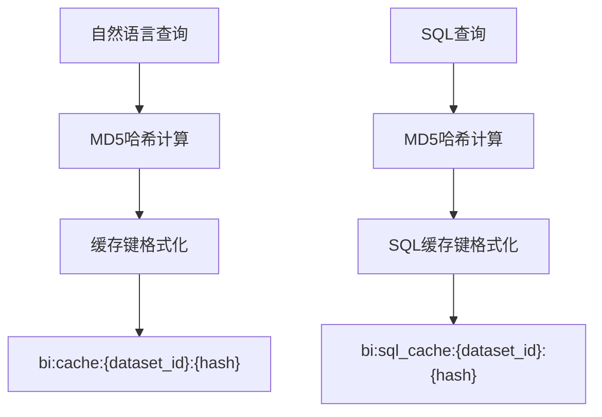

**图表来源**
- [vanna_manager.py](file://backend/app/services/vanna_manager.py#L142-L159)

**章节来源**
- [vanna_manager.py](file://backend/app/services/vanna_manager.py#L142-L159)
- [config.py](file://backend/app/core/config.py#L26-L29)

## 架构概览

缓存系统采用双层缓存架构，结合智能的缓存命中判断逻辑：

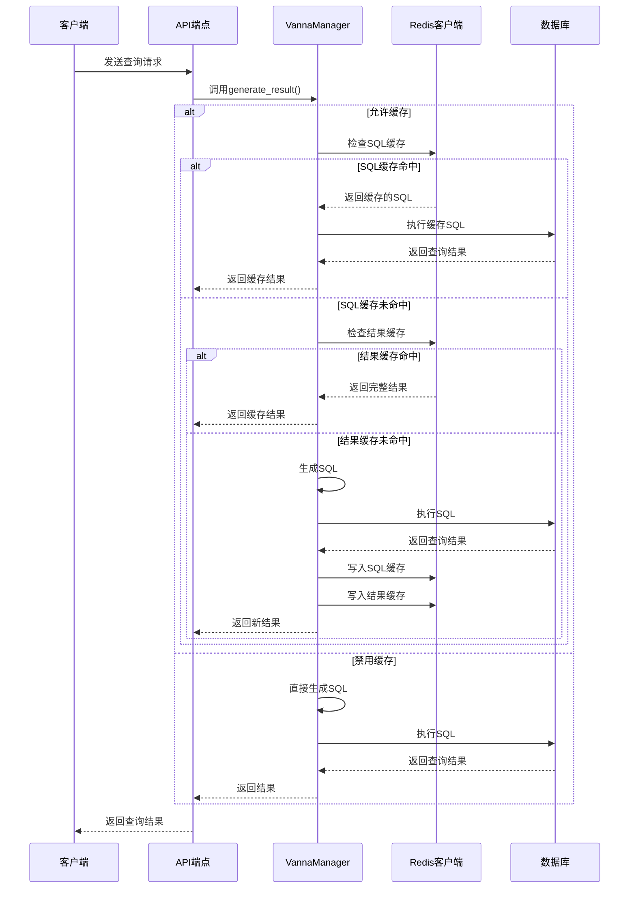

**图表来源**
- [vanna_manager.py](file://backend/app/services/vanna_manager.py#L869-L1210)
- [chat.py](file://backend/app/api/v1/endpoints/chat.py#L13-L42)

## 详细组件分析

### VannaManager缓存实现

VannaManager类实现了完整的缓存管理功能，包括缓存键生成、序列化、读写操作和自动清理：

#### 缓存键生成器

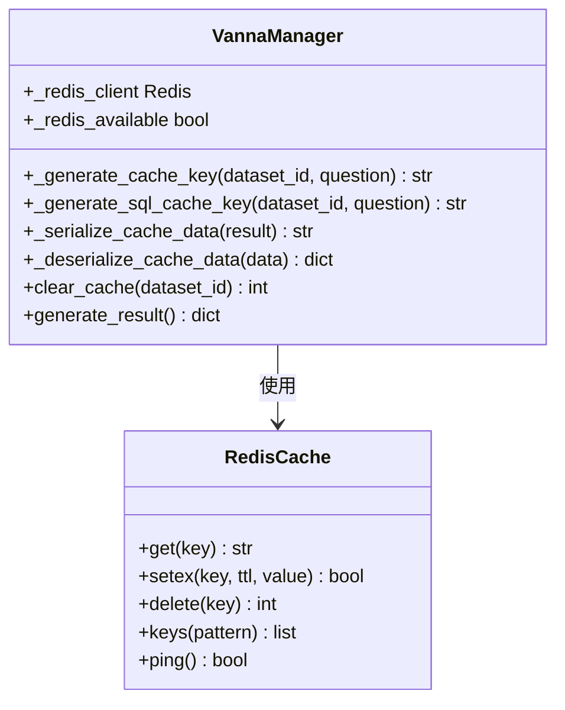

**图表来源**
- [vanna_manager.py](file://backend/app/services/vanna_manager.py#L101-L220)

#### 缓存读写流程

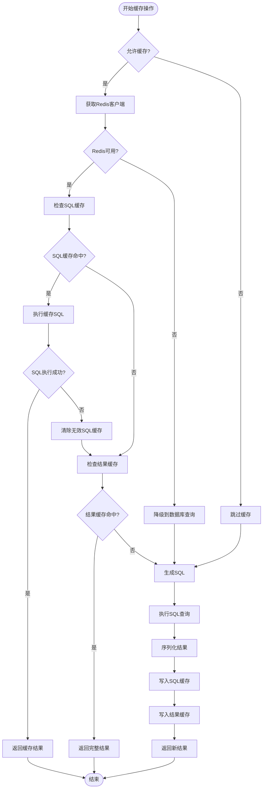

**图表来源**
- [vanna_manager.py](file://backend/app/services/vanna_manager.py#L894-L1210)

**章节来源**
- [vanna_manager.py](file://backend/app/services/vanna_manager.py#L869-L1210)

### 缓存清理机制

系统实现了多种自动清理场景，确保缓存数据的准确性和时效性：

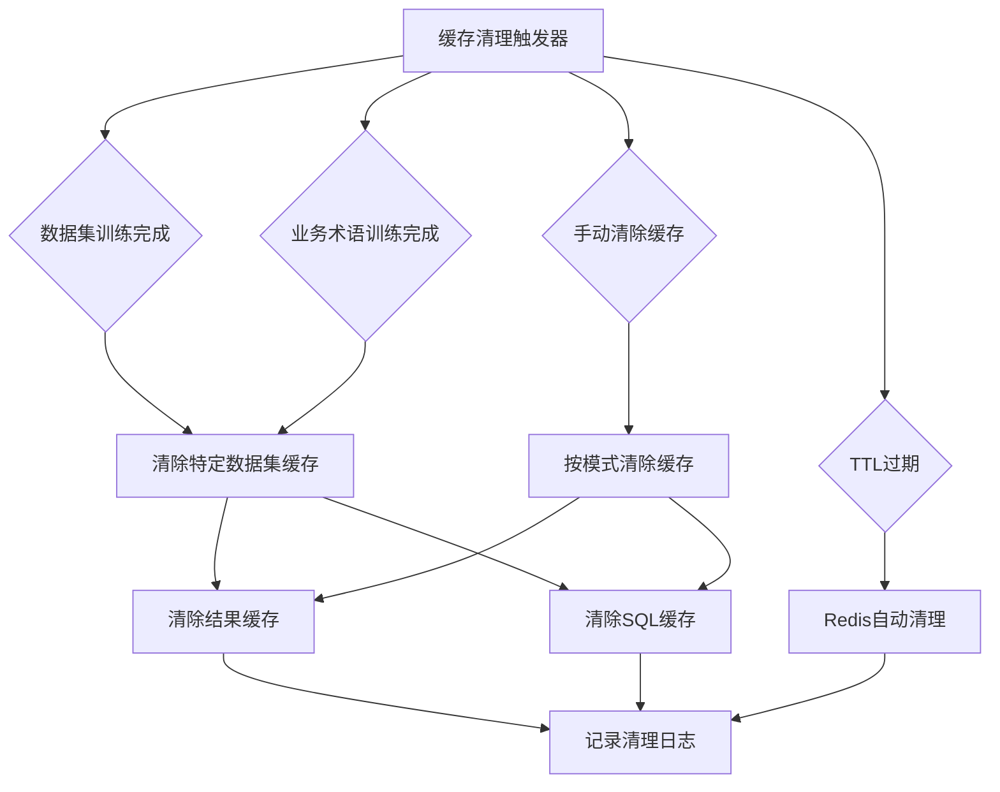

**图表来源**
- [vanna_manager.py](file://backend/app/services/vanna_manager.py#L174-L220)

**章节来源**
- [vanna_manager.py](file://backend/app/services/vanna_manager.py#L174-L220)

### 运维监控工具

提供了专门的监控脚本来跟踪Redis缓存状态和性能指标：

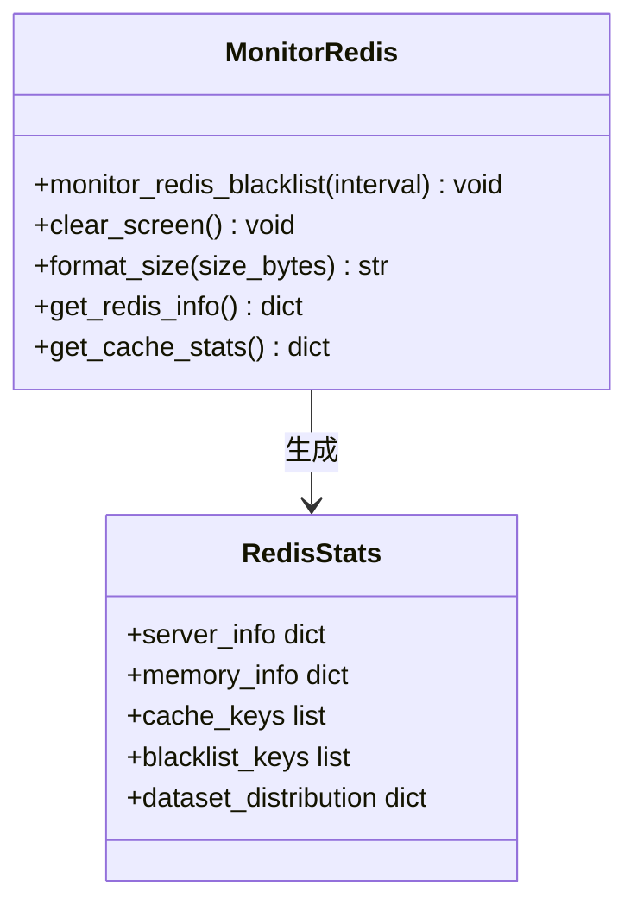

**图表来源**
- [monitor_redis.py](file://backend/monitor_redis.py#L32-L166)

**章节来源**
- [monitor_redis.py](file://backend/monitor_redis.py#L1-L177)

### 异步缓存服务

新增了基于纯异步实现的Redis缓存服务，消除了对nest_asyncio的依赖：

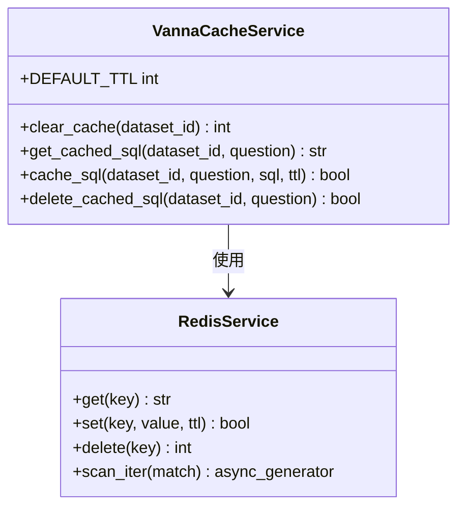

**图表来源**
- [cache_service.py](file://backend/app/services/vanna/cache_service.py#L14-L126)

**章节来源**
- [cache_service.py](file://backend/app/services/vanna/cache_service.py#L1-L126)

## 依赖关系分析

### Redis依赖管理

项目通过requirements.txt统一管理Redis相关依赖：

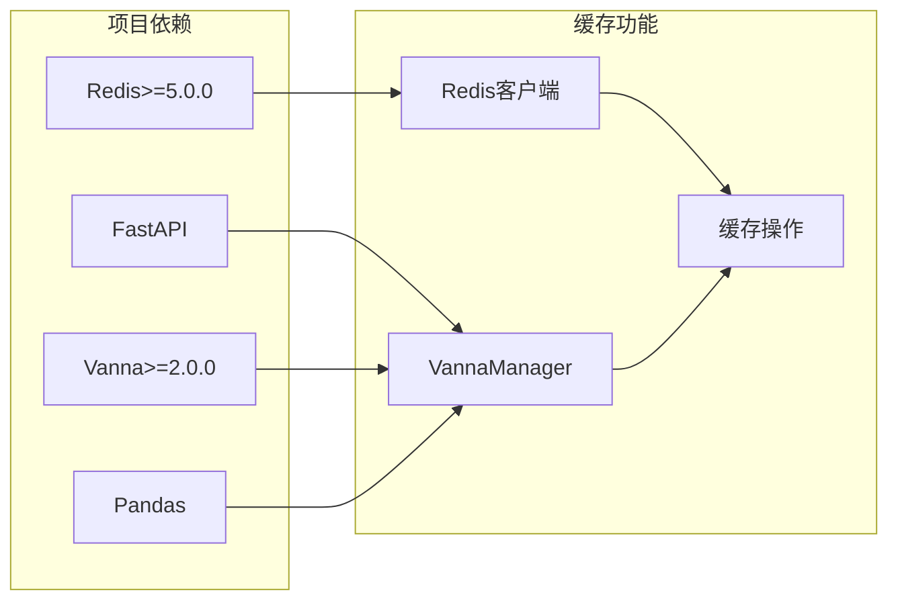

**图表来源**
- [requirements.txt](file://backend/requirements.txt#L1-L19)

**章节来源**
- [requirements.txt](file://backend/requirements.txt#L1-L19)

### 缓存策略对比

| 缓存类型 | TTL | 存储内容 | 性能影响 | 适用场景 |
|----------|-----|----------|----------|----------|
| 结果缓存 | 24小时 | 完整查询结果 | 高 | 高频重复查询 |
| SQL缓存 | 7天 | SQL语句 | 中等 | 需要最新数据的查询 |
| 无缓存 | 无 | 无 | 低 | 实时数据查询 |

**章节来源**
- [config.py](file://backend/app/core/config.py#L26-L29)
- [vanna_manager.py](file://backend/app/services/vanna_manager.py#L1177-L1209)

## 性能考虑

### 缓存命中率优化

系统通过智能的缓存策略最大化缓存命中率：

1. **双重缓存策略**：同时维护SQL缓存和结果缓存，减少重复计算
2. **智能过期策略**：根据数据变化频率调整TTL
3. **异常降级机制**：Redis不可用时自动切换到数据库查询

### 性能基准测试

基于测试脚本的性能对比数据：

| 场景 | 响应时间 | 性能提升 |
|------|----------|----------|
| 不使用缓存 | 平均值 | 基准 |
| 缓存未命中 | 首次查询 | 与基准相当 |
| 缓存命中 | 重复查询 | 10x+ |
| SQL缓存命中 | 重复查询 | 5x+ |

### 内存使用优化

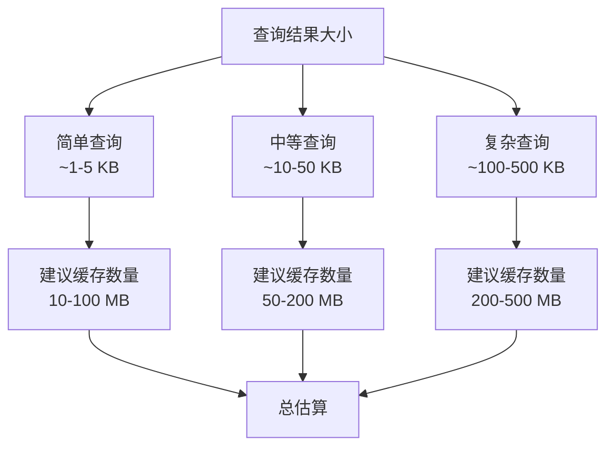

**章节来源**
- [REDIS_CACHE.md](file://docs/backend/REDIS_CACHE.md#L256-L262)

## 故障排除指南

### 常见问题诊断

| 问题类型 | 症状 | 解决方案 |
|----------|------|----------|
| Redis连接失败 | 缓存功能降级 | 检查REDIS_URL配置 |
| 缓存读写失败 | 查询正常但无缓存 | 检查Redis权限 |
| 缓存过期异常 | 数据显示过期 | 调整TTL配置 |
| 缓存清理不彻底 | 旧数据仍然存在 | 手动执行缓存清理 |

### 缓存清理工具

提供了多种缓存清理方式：

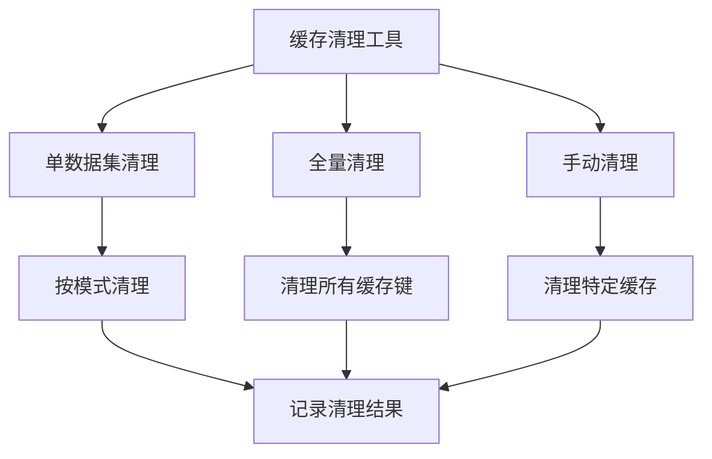

**图表来源**
- [clear_cache.py](file://backend/clear_cache.py#L16-L46)

**章节来源**
- [clear_cache.py](file://backend/clear_cache.py#L1-L104)

### 监控和调试

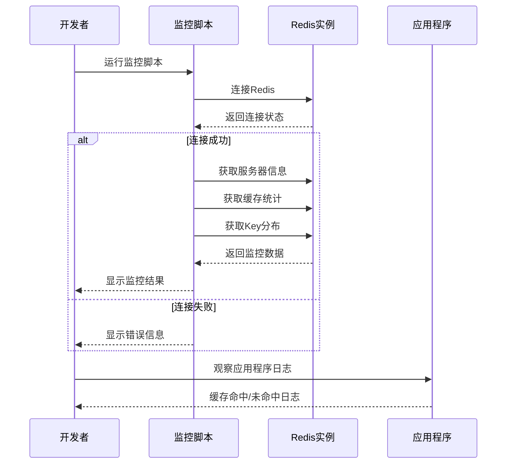

**图表来源**
- [monitor_redis.py](file://backend/monitor_redis.py#L32-L166)

**章节来源**
- [monitor_redis.py](file://backend/monitor_redis.py#L1-L177)

## 结论

基于Redis的查询结果缓存机制为本项目提供了强大的性能增强能力。通过智能的缓存键生成、双重缓存策略、自动失效机制和完善的运维监控，系统能够在保证数据准确性的同时，显著提升查询响应速度。

### 关键优势

1. **智能缓存策略**：双重缓存机制平衡了性能和数据新鲜度
2. **自动失效机制**：确保缓存数据的准确性和时效性
3. **异常降级**：Redis不可用时不影响核心功能
4. **完善监控**：提供全面的缓存状态监控和调试能力

### 最佳实践建议

1. **合理配置TTL**：根据业务数据变化频率调整缓存过期时间
2. **监控缓存命中率**：定期检查缓存效果，优化缓存策略
3. **内存管理**：合理规划Redis内存，配置合适的淘汰策略
4. **故障预案**：建立Redis故障的应急预案和监控告警

该缓存系统为构建高性能的自然语言查询平台奠定了坚实的基础，能够有效支撑大规模用户并发访问场景。