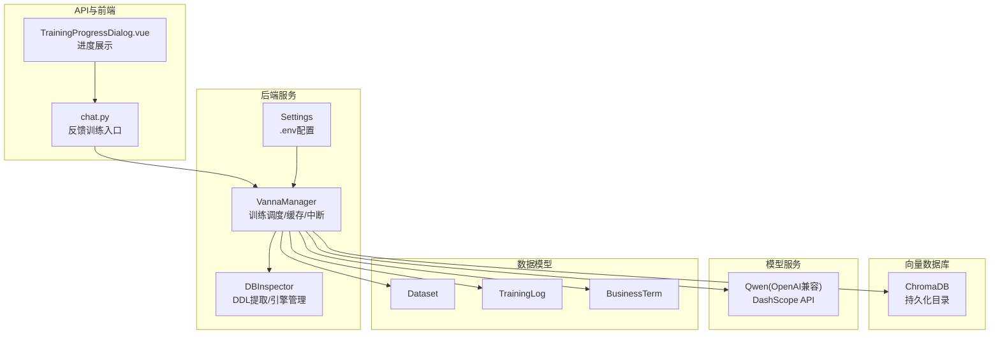
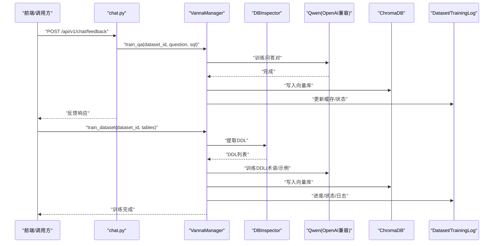
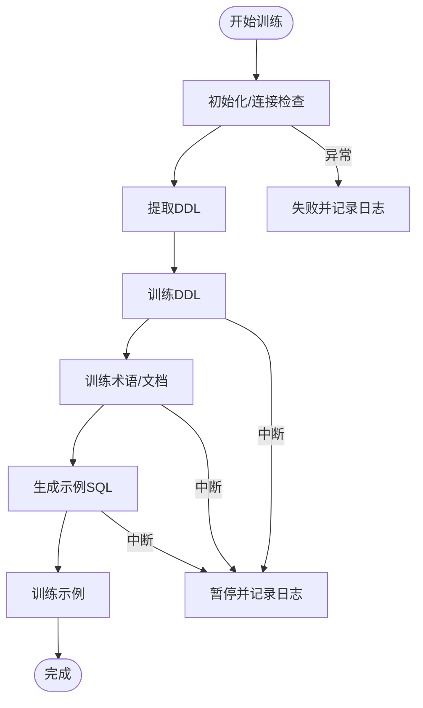
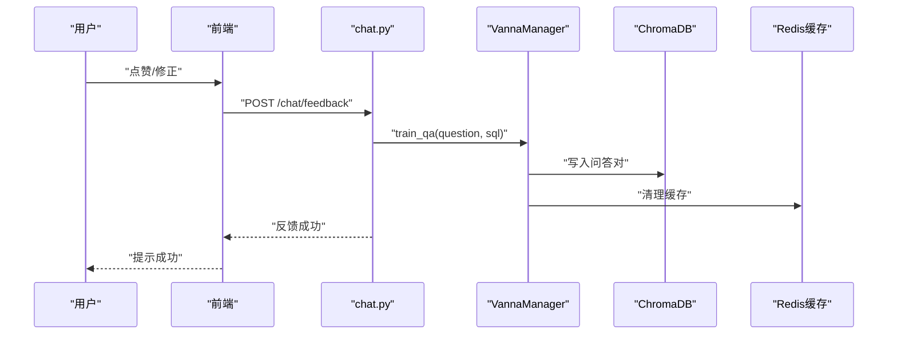
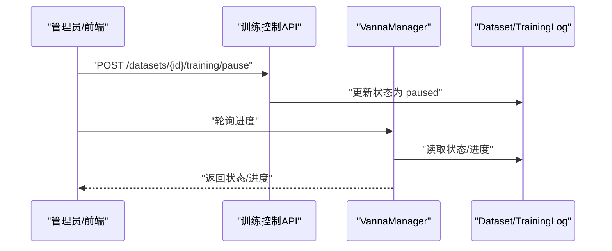
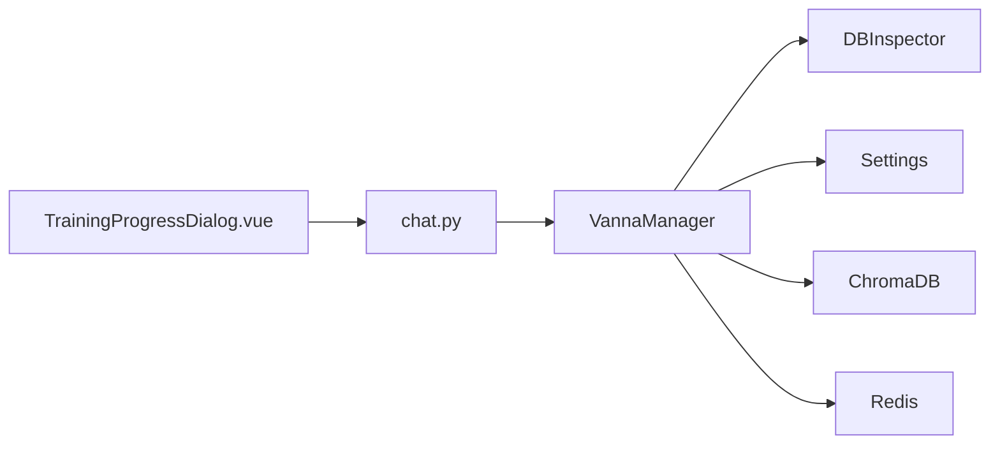

# 模型训练机制

<cite>
**本文引用的文件**
- [vanna_manager.py](file://backend/app/services/vanna_manager.py)
- [AI_FEEDBACK_TRAINING.md](file://docs/backend/AI_FEEDBACK_TRAINING.md)
- [TRAINING_CONTROL_GUIDE.md](file://backend/TRAINING_CONTROL_GUIDE.md)
- [db_inspector.py](file://backend/app/services/db_inspector.py)
- [metadata.py](file://backend/app/models/metadata.py)
- [chat.py](file://backend/app/api/v1/endpoints/chat.py)
- [config.py](file://backend/app/core/config.py)
- [test_training_flow.py](file://backend/tests/test_training_flow.py)
- [test_training_control.py](file://backend/tests/test_training_control.py)
- [TrainingProgressDialog.vue](file://frontend/src/views/Dataset/components/TrainingProgressDialog.vue)
</cite>

## 目录
1. [简介](#简介)
2. [项目结构](#项目结构)
3. [核心组件](#核心组件)
4. [架构总览](#架构总览)
5. [详细组件分析](#详细组件分析)
6. [依赖关系分析](#依赖关系分析)
7. [性能考量](#性能考量)
8. [故障排查指南](#故障排查指南)
9. [结论](#结论)
10. [附录](#附录)

## 简介
本文件深入解析基于 Vanna AI 的模型训练流程，涵盖从初始化 AI 模型、配置 Qwen 等 LLM 后端、连接 ChromaDB 向量数据库，到从数据库提取 DDL 与示例 SQL、将结构化元数据注入向量库以增强语义理解能力。文档还结合 AI 反馈训练机制，说明用户反馈数据如何转化为训练样本并触发增量训练；并提供训练任务控制接口的使用方法，包括启动、暂停、监控训练进度等操作；解释训练过程中的错误处理机制与日志追踪方式；最后给出训练调用链路示例与模型状态更新、缓存清除策略。

## 项目结构
本项目的训练相关代码主要集中在后端服务层与文档说明中，前端提供训练进度展示组件。关键模块包括：
- 服务层：VannaManager 负责训练生命周期管理、实例缓存、进度与中断控制、向量库操作等
- 数据库访问：DBInspector 负责构建数据库引擎、提取 DDL、读取示例数据
- 数据模型：Dataset、TrainingLog、BusinessTerm 等支撑训练状态与日志
- API 层：chat.py 提供反馈训练入口
- 文档：AI_FEEDBACK_TRAINING.md 与 TRAINING_CONTROL_GUIDE.md 提供反馈训练与训练控制的完整说明
- 前端：TrainingProgressDialog.vue 提供训练进度可视化

**图表来源**
- [vanna_manager.py](file://backend/app/services/vanna_manager.py#L101-L340)
- [db_inspector.py](file://backend/app/services/db_inspector.py#L13-L152)
- [config.py](file://backend/app/core/config.py#L21-L42)
- [chat.py](file://backend/app/api/v1/endpoints/chat.py#L44-L111)
- [TrainingProgressDialog.vue](file://frontend/src/views/Dataset/components/TrainingProgressDialog.vue#L25-L226)

**章节来源**
- [vanna_manager.py](file://backend/app/services/vanna_manager.py#L101-L340)
- [db_inspector.py](file://backend/app/services/db_inspector.py#L13-L152)
- [config.py](file://backend/app/core/config.py#L21-L42)
- [chat.py](file://backend/app/api/v1/endpoints/chat.py#L44-L111)
- [TRAINING_CONTROL_GUIDE.md](file://backend/TRAINING_CONTROL_GUIDE.md#L1-L312)
- [AI_FEEDBACK_TRAINING.md](file://docs/backend/AI_FEEDBACK_TRAINING.md#L1-L445)

## 核心组件
- VannaManager：训练主控制器，负责初始化 Vanna 实例（Legacy 与 Agent 两种形态）、训练数据准备、进度与中断控制、向量库操作、缓存管理、训练数据导出等
- DBInspector：数据库引擎构建与 DDL 提取工具，支持 MySQL、PostgreSQL、SQLite
- Settings：统一从 .env 读取的配置，包括 DashScope API Key、Qwen 模型名、ChromaDB 持久化目录、Redis 缓存等
- Dataset/TrainingLog/BusinessTerm：训练状态、日志与业务术语模型
- API(chat.py)：对外暴露反馈训练接口，将用户反馈转化为训练样本
- 前端 TrainingProgressDialog.vue：训练进度可视化与轮询刷新

**章节来源**
- [vanna_manager.py](file://backend/app/services/vanna_manager.py#L101-L340)
- [db_inspector.py](file://backend/app/services/db_inspector.py#L13-L152)
- [config.py](file://backend/app/core/config.py#L21-L42)
- [metadata.py](file://backend/app/models/metadata.py#L35-L80)
- [chat.py](file://backend/app/api/v1/endpoints/chat.py#L44-L111)

## 架构总览
下图展示了训练流程的关键交互：后端通过 VannaManager 调用 DBInspector 提取 DDL，使用 Qwen（DashScope OpenAI 兼容接口）与 ChromaDB 完成训练；用户反馈通过 API 触发增量训练；训练状态与日志由 Dataset 与 TrainingLog 持久化；前端通过 TrainingProgressDialog.vue 轮询进度。

**图表来源**
- [chat.py](file://backend/app/api/v1/endpoints/chat.py#L44-L111)
- [vanna_manager.py](file://backend/app/services/vanna_manager.py#L586-L763)
- [db_inspector.py](file://backend/app/services/db_inspector.py#L108-L116)
- [metadata.py](file://backend/app/models/metadata.py#L35-L80)

## 详细组件分析

### VannaManager：训练生命周期与控制
- 实例缓存与冲突处理：为每个数据集维护 ChromaDB 客户端与 Agent 实例缓存，避免“不同设置”冲突；若冲突则清理缓存后重试
- 初始化与配置：
  - Legacy Vanna：面向旧版 API，适配 DDL/文档/问答对训练
  - Agent（Vanna 2.0）：使用 OpenAI LLM Service + ChromaAgentMemory + DefaultLlmContextEnhancer
- 训练流程（异步）：
  - 阶段划分：DDL 提取（0-10%）、训练 DDL（10-40%）、训练术语/文档（40-80%）、生成示例并训练（80-100%）
  - 检查点：每阶段更新 Dataset.process_rate、写入 TrainingLog、检查中断（paused）
- 反馈训练：train_qa 将问答对写入向量库并自动清理缓存
- 数据导出：get_training_data 从 ChromaDB 获取训练数据（QA/DDL/文档），支持分页
- 清理与删除：delete_collection 删除集合并清理缓存；clear_cache 清理 Redis 缓存

**图表来源**
- [vanna_manager.py](file://backend/app/services/vanna_manager.py#L586-L763)

**章节来源**
- [vanna_manager.py](file://backend/app/services/vanna_manager.py#L101-L340)
- [vanna_manager.py](file://backend/app/services/vanna_manager.py#L342-L452)
- [vanna_manager.py](file://backend/app/services/vanna_manager.py#L586-L763)
- [vanna_manager.py](file://backend/app/services/vanna_manager.py#L764-L800)

### DBInspector：DDL 提取与数据库引擎
- 构建数据库 URL（支持 sqlite/postgresql/mysql）
- 连接池与超时配置，保障稳定性
- 提取 DDL：通过反射表结构生成 CREATE TABLE 语句
- 读取示例数据：用于辅助理解与训练

**章节来源**
- [db_inspector.py](file://backend/app/services/db_inspector.py#L13-L152)

### Settings：配置中心
- DashScope API Key、Qwen Model 名称
- ChromaDB 持久化目录、检索返回数量
- Redis 缓存地址与 TTL

**章节来源**
- [config.py](file://backend/app/core/config.py#L21-L42)

### 数据模型：训练状态与日志
- Dataset：训练状态、进度、错误信息、最后训练时间
- TrainingLog：训练过程日志
- BusinessTerm：业务术语，用于增强语义理解

**章节来源**
- [metadata.py](file://backend/app/models/metadata.py#L35-L80)
- [metadata.py](file://backend/app/models/metadata.py#L98-L110)

### 反馈训练：从用户反馈到增量训练
- API 入口：chat.py 的 /chat/feedback，支持 rating=1（点赞）与 rating=-1（修正）
- 服务实现：VannaManager.train_qa 将问答对写入向量库并清理缓存
- 前端交互：TrainingProgressDialog.vue 轮询进度，展示状态与日志

**图表来源**
- [chat.py](file://backend/app/api/v1/endpoints/chat.py#L44-L111)
- [vanna_manager.py](file://backend/app/services/vanna_manager.py#L851-L866)
- [AI_FEEDBACK_TRAINING.md](file://docs/backend/AI_FEEDBACK_TRAINING.md#L36-L51)

**章节来源**
- [chat.py](file://backend/app/api/v1/endpoints/chat.py#L44-L111)
- [AI_FEEDBACK_TRAINING.md](file://docs/backend/AI_FEEDBACK_TRAINING.md#L1-L445)
- [vanna_manager.py](file://backend/app/services/vanna_manager.py#L851-L866)

### 训练控制接口：启动/暂停/监控
- 启动：VannaManager.train_dataset(dataset_id, table_names, db_session)
- 监控：查询 Dataset.status/process_rate/error_msg
- 暂停：将 Dataset.status 设为 paused，训练在检查点检测并停止
- 删除：VannaManager.delete_collection(dataset_id) 删除集合并清理缓存
- 日志：TrainingLog 记录每个检查点内容

**图表来源**
- [TRAINING_CONTROL_GUIDE.md](file://backend/TRAINING_CONTROL_GUIDE.md#L104-L192)
- [vanna_manager.py](file://backend/app/services/vanna_manager.py#L366-L401)

**章节来源**
- [TRAINING_CONTROL_GUIDE.md](file://backend/TRAINING_CONTROL_GUIDE.md#L1-L312)
- [vanna_manager.py](file://backend/app/services/vanna_manager.py#L366-L401)

### 向量库注入：DDL、术语与示例 SQL
- DDL 注入：DBInspector 提取 DDL，VannaManager 训练 DDL
- 术语注入：BusinessTerm 定义业务术语，VannaManager 训练术语文档
- 示例注入：为前几个表生成基础查询示例（如全量查询、COUNT 统计），VannaManager 训练示例问答对
- 文档注入：表关系描述等自然语言文档，增强 JOIN 等复杂查询能力

**章节来源**
- [vanna_manager.py](file://backend/app/services/vanna_manager.py#L648-L718)
- [metadata.py](file://backend/app/models/metadata.py#L98-L110)

### 缓存与状态更新策略
- Redis 缓存：结果缓存与 SQL 缓存，键格式包含 dataset_id 与问题哈希
- 缓存清理：训练完成后自动清理对应 dataset 的缓存，确保查询使用最新结果
- 模型状态：Dataset.status、process_rate、error_msg、last_train_at

**章节来源**
- [vanna_manager.py](file://backend/app/services/vanna_manager.py#L142-L220)
- [vanna_manager.py](file://backend/app/services/vanna_manager.py#L730-L734)
- [metadata.py](file://backend/app/models/metadata.py#L35-L53)

## 依赖关系分析
- VannaManager 依赖 Settings（配置）、DBInspector（DDL）、ChromaDB（向量存储）、Redis（缓存）
- API(chat.py) 依赖 VannaManager 提供的训练能力
- 前端 TrainingProgressDialog.vue 依赖后端训练控制接口与日志接口

**图表来源**
- [vanna_manager.py](file://backend/app/services/vanna_manager.py#L101-L340)
- [chat.py](file://backend/app/api/v1/endpoints/chat.py#L44-L111)
- [config.py](file://backend/app/core/config.py#L21-L42)

**章节来源**
- [vanna_manager.py](file://backend/app/services/vanna_manager.py#L101-L340)
- [chat.py](file://backend/app/api/v1/endpoints/chat.py#L44-L111)

## 性能考量
- 训练开销：单次训练耗时 < 1 秒，向量存储每个问答对约 1-5 KB
- 缓存命中：缓存命中时查询延迟 < 0.1 秒
- 连接池：DBInspector 配置连接池与超时，降低长连接与超时风险
- 异步训练：训练过程异步执行，避免阻塞主线程

[本节为通用性能讨论，无需具体文件引用]

## 故障排查指南
- 反馈提交失败：检查后端服务、浏览器控制台、后端日志；确认数据集 ID 有效
- 训练后查询未改进：确认缓存已清理、问题描述语义相似度足够、向量库索引更新
- SQL 修正对话框无法打开：检查前端状态与消息对象字段完整性
- 训练中断：确认状态为 paused，训练在检查点检测并停止；注意中断非即时生效

**章节来源**
- [AI_FEEDBACK_TRAINING.md](file://docs/backend/AI_FEEDBACK_TRAINING.md#L361-L396)
- [TRAINING_CONTROL_GUIDE.md](file://backend/TRAINING_CONTROL_GUIDE.md#L202-L214)

## 结论
本项目通过 VannaManager 将数据库 DDL、业务术语与示例 SQL 注入向量库，结合 Qwen 的语义理解能力，显著提升了 SQL 生成的准确性与稳定性。AI 反馈训练机制使系统能够从用户反馈中持续学习，形成闭环优化。训练控制接口提供了启动、暂停、监控与清理能力，配合缓存与日志体系，确保训练过程可控、可观测、可恢复。

[本节为总结性内容，无需具体文件引用]

## 附录

### 实际调用链路示例（路径指引）
- 启动训练：调用 VannaManager.train_dataset(dataset_id, table_names, db_session)
  - 参考：[vanna_manager.py](file://backend/app/services/vanna_manager.py#L342-L363)
- 反馈训练：调用 VannaManager.train_qa(dataset_id, question, sql, db_session)
  - 参考：[vanna_manager.py](file://backend/app/services/vanna_manager.py#L851-L866)
- 获取训练数据：调用 VannaManager.get_training_data(dataset_id, page, page_size)
  - 参考：[vanna_manager.py](file://backend/app/services/vanna_manager.py#L454-L583)
- 删除集合：调用 VannaManager.delete_collection(dataset_id)
  - 参考：[vanna_manager.py](file://backend/app/services/vanna_manager.py#L403-L451)
- 清理缓存：调用 VannaManager.clear_cache(dataset_id)
  - 参考：[vanna_manager.py](file://backend/app/services/vanna_manager.py#L175-L219)

### 前端集成要点
- 轮询训练进度：TrainingProgressDialog.vue 调用后端接口获取状态与进度
  - 参考：[TrainingProgressDialog.vue](file://frontend/src/views/Dataset/components/TrainingProgressDialog.vue#L204-L226)
- 暂停训练：前端设置 Dataset.status 为 paused，后端在检查点检测并停止
  - 参考：[TRAINING_CONTROL_GUIDE.md](file://backend/TRAINING_CONTROL_GUIDE.md#L152-L174)

**章节来源**
- [vanna_manager.py](file://backend/app/services/vanna_manager.py#L342-L363)
- [vanna_manager.py](file://backend/app/services/vanna_manager.py#L454-L583)
- [vanna_manager.py](file://backend/app/services/vanna_manager.py#L403-L451)
- [vanna_manager.py](file://backend/app/services/vanna_manager.py#L175-L219)
- [TrainingProgressDialog.vue](file://frontend/src/views/Dataset/components/TrainingProgressDialog.vue#L204-L226)
- [TRAINING_CONTROL_GUIDE.md](file://backend/TRAINING_CONTROL_GUIDE.md#L152-L174)