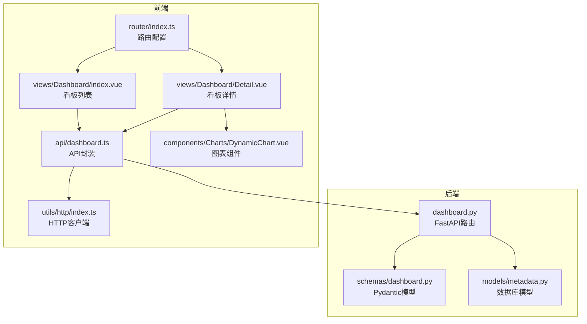
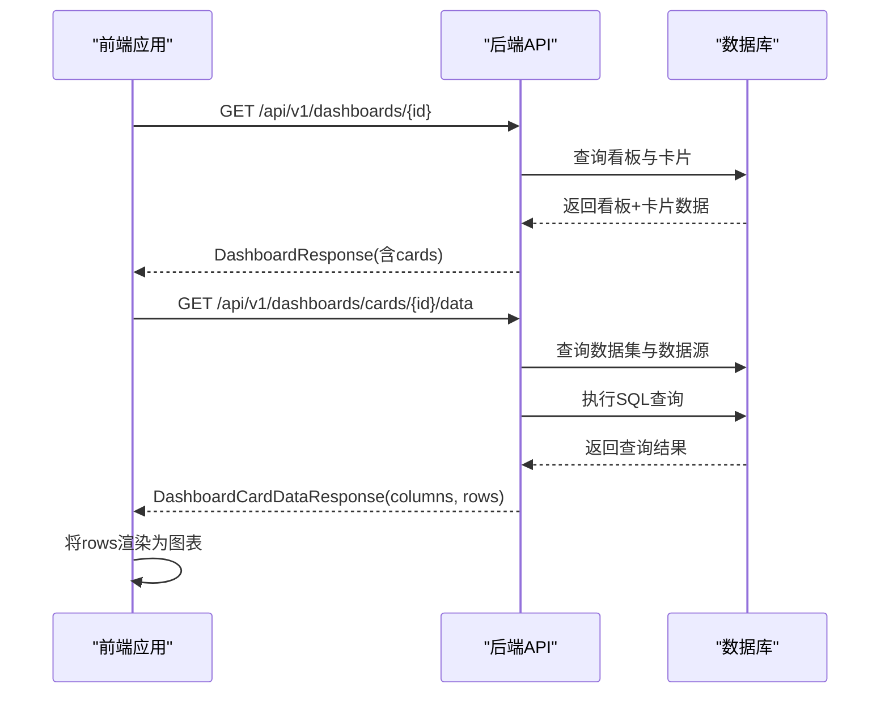
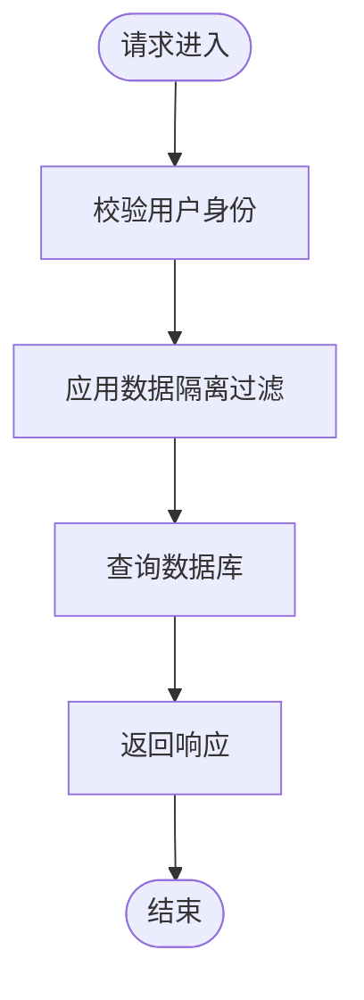
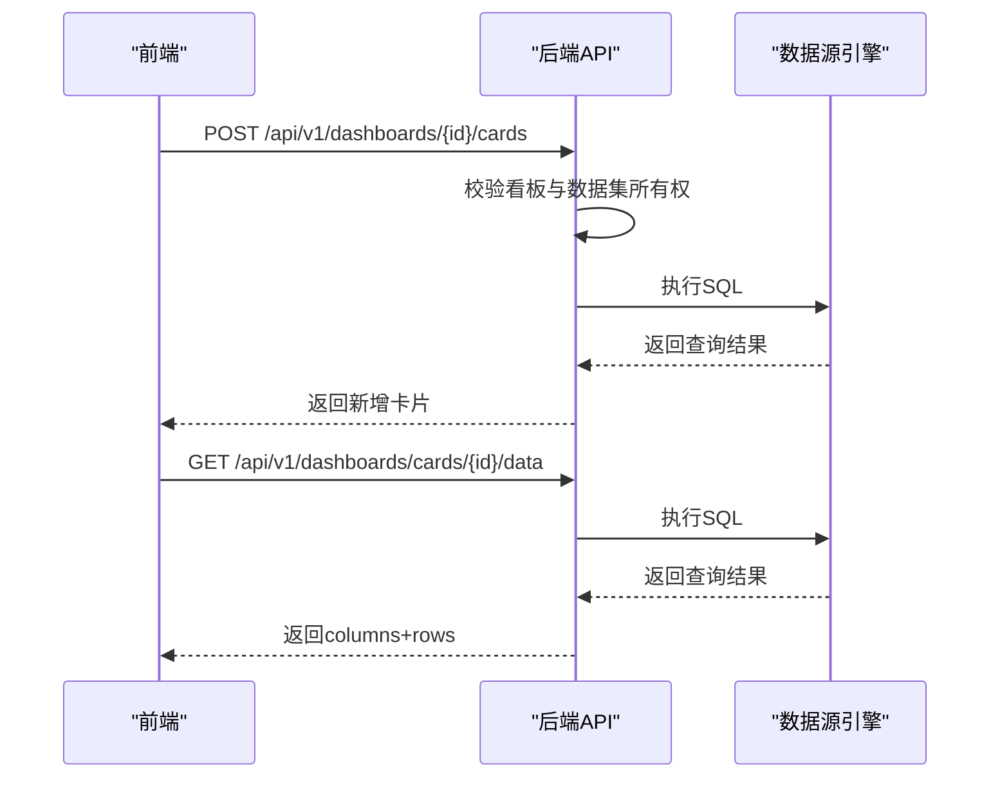
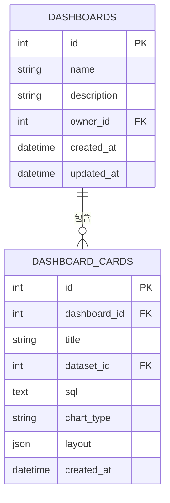
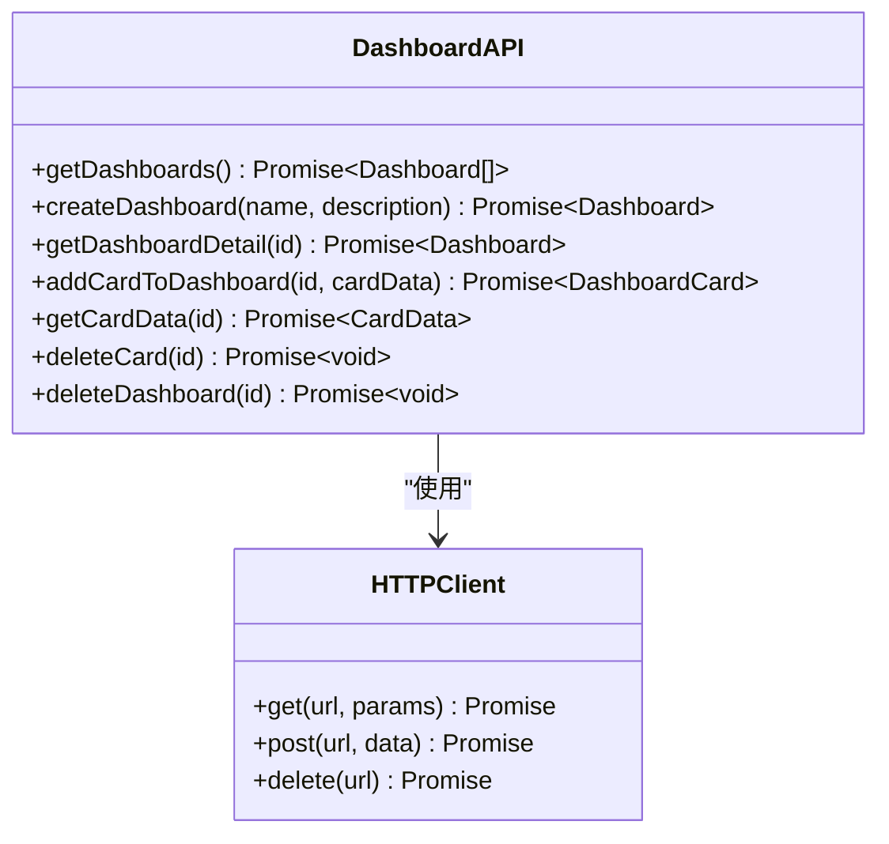
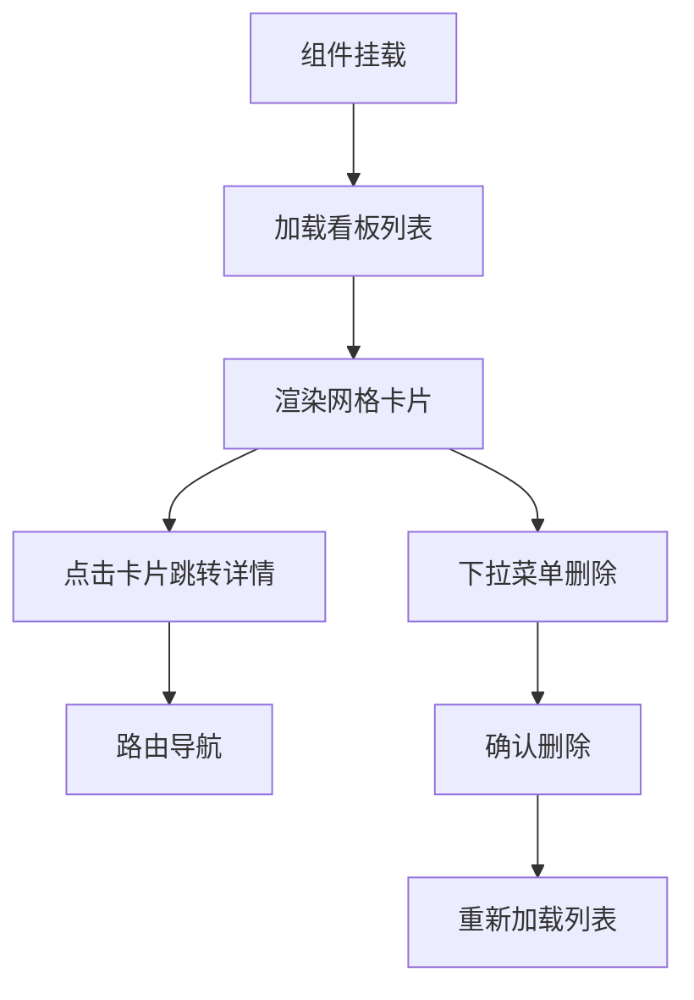
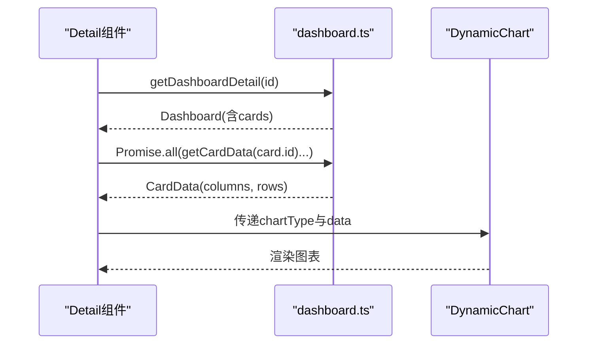
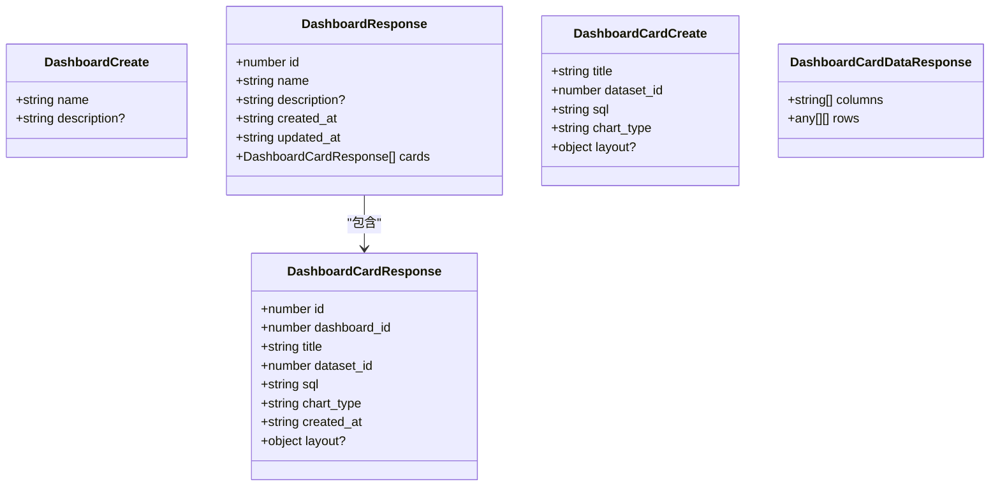
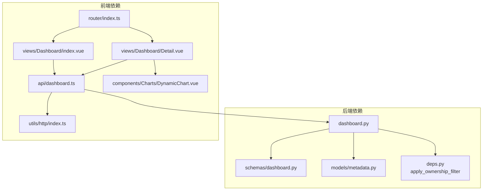

# 仪表盘管理接口

<cite>
**本文档引用的文件**
- [backend/app/api/v1/endpoints/dashboard.py](file://backend/app/api/v1/endpoints/dashboard.py)
- [backend/app/schemas/dashboard.py](file://backend/app/schemas/dashboard.py)
- [backend/app/models/metadata.py](file://backend/app/models/metadata.py)
- [frontend/src/api/dashboard.ts](file://frontend/src/api/dashboard.ts)
- [frontend/src/views/Dashboard/index.vue](file://frontend/src/views/Dashboard/index.vue)
- [frontend/src/views/Dashboard/Detail.vue](file://frontend/src/views/Dashboard/Detail.vue)
- [frontend/src/components/Charts/DynamicChart.vue](file://frontend/src/components/Charts/DynamicChart.vue)
- [frontend/src/utils/http/index.ts](file://frontend/src/utils/http/index.ts)
- [frontend/src/router/index.ts](file://frontend/src/router/index.ts)
</cite>

## 目录
1. [简介](#简介)
2. [项目结构](#项目结构)
3. [核心组件](#核心组件)
4. [架构概览](#架构概览)
5. [详细组件分析](#详细组件分析)
6. [依赖关系分析](#依赖关系分析)
7. [性能考虑](#性能考虑)
8. [故障排除指南](#故障排除指南)
9. [结论](#结论)

## 简介
本文件全面阐述了仪表盘管理接口的设计与实现，包括看板的增删改查、卡片布局管理、前后端交互协议以及前端渲染机制。重点说明了POST /api/v1/dashboards和PUT /api/v1/dashboards/{id}的请求结构（DashboardCreate/Update schema），以及网格布局数据的序列化方式。同时，详细描述了前端如何通过dashboard.ts将查询结果嵌入卡片并持久化布局配置，结合index.vue组件说明拖拽排序与响应式设计的实现逻辑，并记录了分页查询看板列表时的性能优化策略。

## 项目结构
该功能涉及后端FastAPI路由、Pydantic模型定义、数据库ORM映射，以及前端Vue组件与API封装。整体采用前后端分离架构，后端提供RESTful API，前端通过Axios进行HTTP通信。

**图表来源**
- [backend/app/api/v1/endpoints/dashboard.py](file://backend/app/api/v1/endpoints/dashboard.py#L1-L261)
- [backend/app/schemas/dashboard.py](file://backend/app/schemas/dashboard.py#L1-L51)
- [backend/app/models/metadata.py](file://backend/app/models/metadata.py#L56-L96)
- [frontend/src/api/dashboard.ts](file://frontend/src/api/dashboard.ts#L1-L72)
- [frontend/src/views/Dashboard/index.vue](file://frontend/src/views/Dashboard/index.vue#L1-L197)
- [frontend/src/views/Dashboard/Detail.vue](file://frontend/src/views/Dashboard/Detail.vue#L1-L327)
- [frontend/src/components/Charts/DynamicChart.vue](file://frontend/src/components/Charts/DynamicChart.vue#L1-L346)
- [frontend/src/utils/http/index.ts](file://frontend/src/utils/http/index.ts#L1-L173)
- [frontend/src/router/index.ts](file://frontend/src/router/index.ts#L1-L116)

**章节来源**
- [backend/app/api/v1/endpoints/dashboard.py](file://backend/app/api/v1/endpoints/dashboard.py#L1-L261)
- [frontend/src/api/dashboard.ts](file://frontend/src/api/dashboard.ts#L1-L72)

## 核心组件
- 后端路由与业务逻辑：提供看板的创建、列表查询、详情获取、卡片增删改查等接口，包含数据隔离与权限控制。
- Pydantic模型：定义请求/响应数据结构，确保前后端数据契约一致。
- 数据库模型：映射Dashboards与DashboardCards表，支持JSON字段存储布局信息。
- 前端API封装：统一HTTP请求方法，处理基础URL、认证头、错误处理与进度条。
- 视图组件：看板列表与详情页面，负责UI渲染、事件绑定与状态管理。
- 图表组件：动态渲染多种图表类型，支持表格视图与ECharts可视化。

**章节来源**
- [backend/app/schemas/dashboard.py](file://backend/app/schemas/dashboard.py#L1-L51)
- [backend/app/models/metadata.py](file://backend/app/models/metadata.py#L56-L96)
- [frontend/src/api/dashboard.ts](file://frontend/src/api/dashboard.ts#L1-L72)
- [frontend/src/views/Dashboard/index.vue](file://frontend/src/views/Dashboard/index.vue#L1-L197)
- [frontend/src/views/Dashboard/Detail.vue](file://frontend/src/views/Dashboard/Detail.vue#L1-L327)
- [frontend/src/components/Charts/DynamicChart.vue](file://frontend/src/components/Charts/DynamicChart.vue#L1-L346)

## 架构概览
后端通过FastAPI提供REST API，前端通过封装的HTTP客户端发起请求。看板详情接口返回包含卡片列表的完整结构，卡片包含布局信息；前端在详情页按需加载卡片数据并渲染图表。

**图表来源**
- [backend/app/api/v1/endpoints/dashboard.py](file://backend/app/api/v1/endpoints/dashboard.py#L63-L79)
- [backend/app/api/v1/endpoints/dashboard.py](file://backend/app/api/v1/endpoints/dashboard.py#L132-L197)
- [frontend/src/views/Dashboard/Detail.vue](file://frontend/src/views/Dashboard/Detail.vue#L236-L291)

**章节来源**
- [backend/app/api/v1/endpoints/dashboard.py](file://backend/app/api/v1/endpoints/dashboard.py#L63-L79)
- [backend/app/api/v1/endpoints/dashboard.py](file://backend/app/api/v1/endpoints/dashboard.py#L132-L197)
- [frontend/src/views/Dashboard/Detail.vue](file://frontend/src/views/Dashboard/Detail.vue#L236-L291)

## 详细组件分析

### 后端接口与数据模型

#### 看板创建与列表查询
- POST /api/v1/dashboards：创建空看板，自动设置owner_id为当前用户。
- GET /api/v1/dashboards：分页查询看板列表，支持skip/limit参数，默认limit=100。
- GET /api/v1/dashboards/{id}：获取看板详情，包含所有卡片。

**图表来源**
- [backend/app/api/v1/endpoints/dashboard.py](file://backend/app/api/v1/endpoints/dashboard.py#L46-L60)
- [backend/app/api/v1/endpoints/dashboard.py](file://backend/app/api/v1/endpoints/dashboard.py#L63-L79)

**章节来源**
- [backend/app/api/v1/endpoints/dashboard.py](file://backend/app/api/v1/endpoints/dashboard.py#L25-L43)
- [backend/app/api/v1/endpoints/dashboard.py](file://backend/app/api/v1/endpoints/dashboard.py#L46-L60)
- [backend/app/api/v1/endpoints/dashboard.py](file://backend/app/api/v1/endpoints/dashboard.py#L63-L79)

#### 卡片管理与数据刷新
- POST /api/v1/dashboards/{id}/cards：向指定看板添加卡片，包含标题、数据集ID、SQL、图表类型与布局信息。
- GET /api/v1/dashboards/cards/{id}/data：执行卡片SQL并返回标准化数据结构。
- DELETE /api/v1/dashboards/cards/{id}：删除卡片并更新看板更新时间。
- DELETE /api/v1/dashboards/{id}：删除看板（级联删除卡片）。

**图表来源**
- [backend/app/api/v1/endpoints/dashboard.py](file://backend/app/api/v1/endpoints/dashboard.py#L82-L129)
- [backend/app/api/v1/endpoints/dashboard.py](file://backend/app/api/v1/endpoints/dashboard.py#L132-L197)

**章节来源**
- [backend/app/api/v1/endpoints/dashboard.py](file://backend/app/api/v1/endpoints/dashboard.py#L82-L129)
- [backend/app/api/v1/endpoints/dashboard.py](file://backend/app/api/v1/endpoints/dashboard.py#L132-L197)

#### 数据模型与序列化
- Dashboard模型：包含name、description、owner_id、created_at、updated_at，以及cards关系。
- DashboardCard模型：包含dashboard_id、title、dataset_id、sql、chart_type、layout(JSON)、created_at。
- 布局数据结构：layout为字典，包含x、y、w、h四个数值字段，用于网格布局定位与尺寸。

**图表来源**
- [backend/app/models/metadata.py](file://backend/app/models/metadata.py#L56-L68)
- [backend/app/models/metadata.py](file://backend/app/models/metadata.py#L82-L96)

**章节来源**
- [backend/app/models/metadata.py](file://backend/app/models/metadata.py#L56-L68)
- [backend/app/models/metadata.py](file://backend/app/models/metadata.py#L82-L96)

### 前端API封装与组件交互

#### API封装与HTTP客户端
- 基础URL：/api/v1，统一处理认证头与错误响应。
- 提供getDashboards、createDashboard、getDashboardDetail、addCardToDashboard、getCardData、deleteCard、deleteDashboard等方法。
- 支持Promise链式调用，便于在组件中直接使用。

**图表来源**
- [frontend/src/api/dashboard.ts](file://frontend/src/api/dashboard.ts#L33-L71)
- [frontend/src/utils/http/index.ts](file://frontend/src/utils/http/index.ts#L114-L173)

**章节来源**
- [frontend/src/api/dashboard.ts](file://frontend/src/api/dashboard.ts#L1-L72)
- [frontend/src/utils/http/index.ts](file://frontend/src/utils/http/index.ts#L1-L173)

#### 看板列表页面（index.vue）
- 响应式网格布局：基于Tailwind CSS的grid-cols-1 md:grid-cols-2 lg:grid-cols-3实现不同屏幕下的列数变化。
- 加载状态与空态：使用loading与empty状态提升用户体验。
- 交互功能：新建看板对话框、删除确认、路由跳转至详情页。

**图表来源**
- [frontend/src/views/Dashboard/index.vue](file://frontend/src/views/Dashboard/index.vue#L116-L129)
- [frontend/src/views/Dashboard/index.vue](file://frontend/src/views/Dashboard/index.vue#L160-L182)

**章节来源**
- [frontend/src/views/Dashboard/index.vue](file://frontend/src/views/Dashboard/index.vue#L1-L197)

#### 看板详情页面（Detail.vue）
- 卡片网格布局：12列栅格系统，根据图表类型动态计算列跨度（line/bar/area/scatter占8列，其他占4列）。
- 数据加载策略：首次进入时并行加载所有卡片数据，支持单卡片与全量刷新。
- 错误处理：每个卡片维护独立的loading与error状态，避免全局阻塞。
- 删除与导航：支持删除卡片并重新加载看板。

**图表来源**
- [frontend/src/views/Dashboard/Detail.vue](file://frontend/src/views/Dashboard/Detail.vue#L236-L258)
- [frontend/src/views/Dashboard/Detail.vue](file://frontend/src/views/Dashboard/Detail.vue#L249-L251)
- [frontend/src/components/Charts/DynamicChart.vue](file://frontend/src/components/Charts/DynamicChart.vue#L39-L46)

**章节来源**
- [frontend/src/views/Dashboard/Detail.vue](file://frontend/src/views/Dashboard/Detail.vue#L1-L327)
- [frontend/src/components/Charts/DynamicChart.vue](file://frontend/src/components/Charts/DynamicChart.vue#L1-L346)

#### 图表组件（DynamicChart.vue）
- 支持多种图表类型：bar、line、pie、table。
- 动态主题适配：根据深色/浅色模式切换颜色方案。
- 空状态处理：当数据为空或类型为clarification时显示相应提示。

**章节来源**
- [frontend/src/components/Charts/DynamicChart.vue](file://frontend/src/components/Charts/DynamicChart.vue#L1-L346)

### 请求结构与序列化规范

#### DashboardCreate/Update Schema
- DashboardCreate：包含name与description字段，用于创建新看板。
- DashboardResponse：在DashboardCreate基础上增加id、created_at、updated_at与cards列表。
- DashboardCardCreate：包含title、dataset_id、sql、chart_type与可选layout。
- DashboardCardResponse：在DashboardCardCreate基础上增加dashboard_id、id、created_at。
- DashboardCardDataResponse：标准化数据结构，包含columns与rows。

**图表来源**
- [backend/app/schemas/dashboard.py](file://backend/app/schemas/dashboard.py#L34-L51)
- [backend/app/schemas/dashboard.py](file://backend/app/schemas/dashboard.py#L6-L31)

**章节来源**
- [backend/app/schemas/dashboard.py](file://backend/app/schemas/dashboard.py#L1-L51)

#### 网格布局数据序列化
- layout字段为JSON格式，包含x、y、w、h四个数值字段，分别表示位置坐标与尺寸。
- 后端模型使用JSON类型存储布局信息，便于灵活扩展。
- 前端通过接口接收layout并传递给图表组件，用于控制卡片在网格中的位置与大小。

**章节来源**
- [backend/app/models/metadata.py](file://backend/app/models/metadata.py#L91-L91)
- [frontend/src/api/dashboard.ts](file://frontend/src/api/dashboard.ts#L19-L24)

## 依赖关系分析

**图表来源**
- [backend/app/api/v1/endpoints/dashboard.py](file://backend/app/api/v1/endpoints/dashboard.py#L10-L19)
- [frontend/src/api/dashboard.ts](file://frontend/src/api/dashboard.ts#L1-L1)
- [frontend/src/router/index.ts](file://frontend/src/router/index.ts#L6-L66)

**章节来源**
- [backend/app/api/v1/endpoints/dashboard.py](file://backend/app/api/v1/endpoints/dashboard.py#L10-L19)
- [frontend/src/api/dashboard.ts](file://frontend/src/api/dashboard.ts#L1-L1)
- [frontend/src/router/index.ts](file://frontend/src/router/index.ts#L6-L66)

## 性能考虑
- 分页查询优化：后端接口支持skip/limit参数，默认limit=100，避免一次性返回大量数据导致的性能问题。
- 并行数据加载：前端在看板详情页对所有卡片数据采用Promise.all并行加载，减少总体等待时间。
- 前端懒加载策略：可结合Intersection Observer或虚拟滚动技术，在卡片数量较多时仅渲染可见区域，进一步提升性能。
- 缓存机制：虽然仪表盘模块未直接实现缓存，但可借鉴其他模块的Redis缓存策略，对卡片数据查询结果进行缓存，设置合理的TTL并在数据变更时主动失效。
- 响应式设计：通过CSS Grid与媒体查询实现自适应布局，减少不必要的重绘与回流。

**章节来源**
- [backend/app/api/v1/endpoints/dashboard.py](file://backend/app/api/v1/endpoints/dashboard.py#L47-L59)
- [frontend/src/views/Dashboard/Detail.vue](file://frontend/src/views/Dashboard/Detail.vue#L249-L251)

## 故障排除指南
- HTTP错误处理：前端HTTP客户端统一处理401、403、404、500等状态码，显示友好提示并进行路由跳转或错误恢复。
- SQL执行异常：后端在执行卡片SQL时区分数据库连接错误与SQL语法错误，分别返回500与400状态码，前端捕获错误并展示具体原因。
- 权限与数据隔离：后端在所有写操作中应用apply_ownership_filter，公共资源仅超级管理员可修改/删除，避免越权访问。

**章节来源**
- [frontend/src/utils/http/index.ts](file://frontend/src/utils/http/index.ts#L68-L109)
- [backend/app/api/v1/endpoints/dashboard.py](file://backend/app/api/v1/endpoints/dashboard.py#L160-L176)
- [backend/app/api/v1/endpoints/dashboard.py](file://backend/app/api/v1/endpoints/dashboard.py#L93-L103)

## 结论
仪表盘管理接口提供了完整的看板生命周期管理能力，从前端的响应式布局到后端的数据隔离与权限控制，形成了清晰的技术栈分工。通过标准化的请求/响应模型与JSON布局数据，实现了灵活的卡片布局管理。前端采用并行加载与懒加载策略，结合良好的错误处理机制，确保了用户体验与系统稳定性。未来可在卡片数据层面引入缓存与增量更新策略，进一步提升性能表现。