# 数据源管理接口

<cite>
**本文档引用的文件**
- [backend/app/api/v1/endpoints/datasource.py](file://backend/app/api/v1/endpoints/datasource.py)
- [backend/app/schemas/datasource.py](file://backend/app/schemas/datasource.py)
- [backend/app/services/db_inspector.py](file://backend/app/services/db_inspector.py)
- [backend/app/api/deps.py](file://backend/app/api/deps.py)
- [backend/app/models/metadata.py](file://backend/app/models/metadata.py)
- [backend/app/main.py](file://backend/app/main.py)
- [frontend/src/api/datasource.ts](file://frontend/src/api/datasource.ts)
- [frontend/src/utils/http/index.ts](file://frontend/src/utils/http/index.ts)
- [frontend/src/components/AddConnectionDialog.vue](file://frontend/src/components/AddConnectionDialog.vue)
</cite>

## 目录
1. [简介](#简介)
2. [项目结构](#项目结构)
3. [核心组件](#核心组件)
4. [架构概览](#架构概览)
5. [详细组件分析](#详细组件分析)
6. [依赖关系分析](#依赖关系分析)
7. [性能考虑](#性能考虑)
8. [故障排除指南](#故障排除指南)
9. [结论](#结论)

## 简介

数据源管理接口是Universal BI系统的核心功能模块，负责管理用户与各种数据库的连接配置。该模块提供了完整的CRUD操作，包括创建、读取、测试连接、更新和删除数据源。系统支持多种数据库类型，包括PostgreSQL和MySQL，并通过db_inspector.py组件实现数据库连接验证和元数据提取功能。

## 项目结构

数据源管理功能分布在后端和前端两个主要部分：

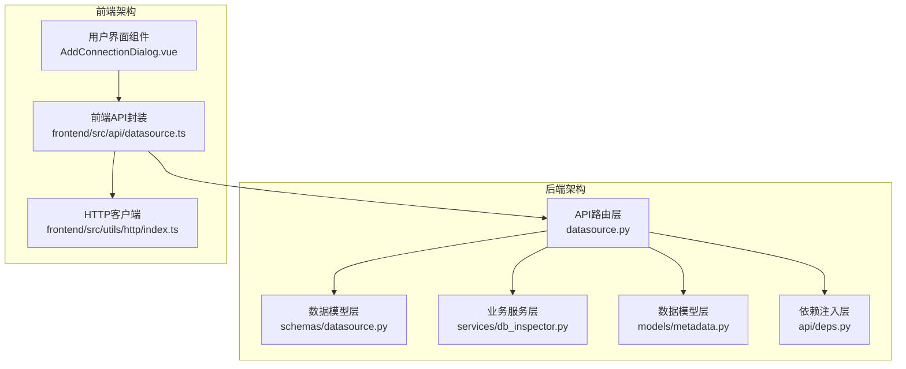

**图表来源**
- [backend/app/api/v1/endpoints/datasource.py](file://backend/app/api/v1/endpoints/datasource.py#L1-L182)
- [frontend/src/api/datasource.ts](file://frontend/src/api/datasource.ts#L1-L51)

**章节来源**
- [backend/app/main.py](file://backend/app/main.py#L1-L35)
- [backend/app/api/v1/endpoints/datasource.py](file://backend/app/api/v1/endpoints/datasource.py#L1-L182)

## 核心组件

### 数据源模型定义

数据源管理涉及多个核心数据模型，采用Pydantic进行数据验证和序列化：

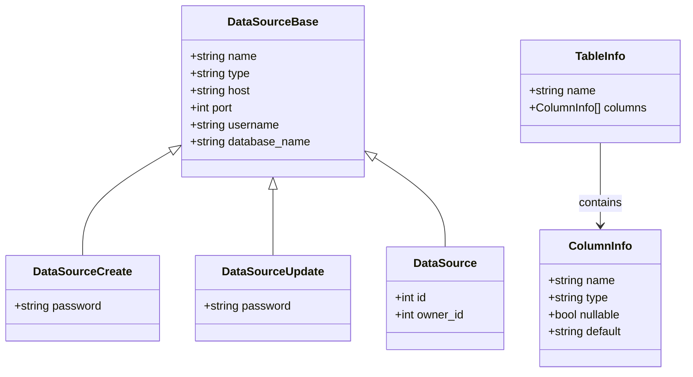

**图表来源**
- [backend/app/schemas/datasource.py](file://backend/app/schemas/datasource.py#L1-L34)

### 数据库连接测试服务

DBInspector类是数据源连接验证的核心组件，支持多种数据库类型的连接测试：

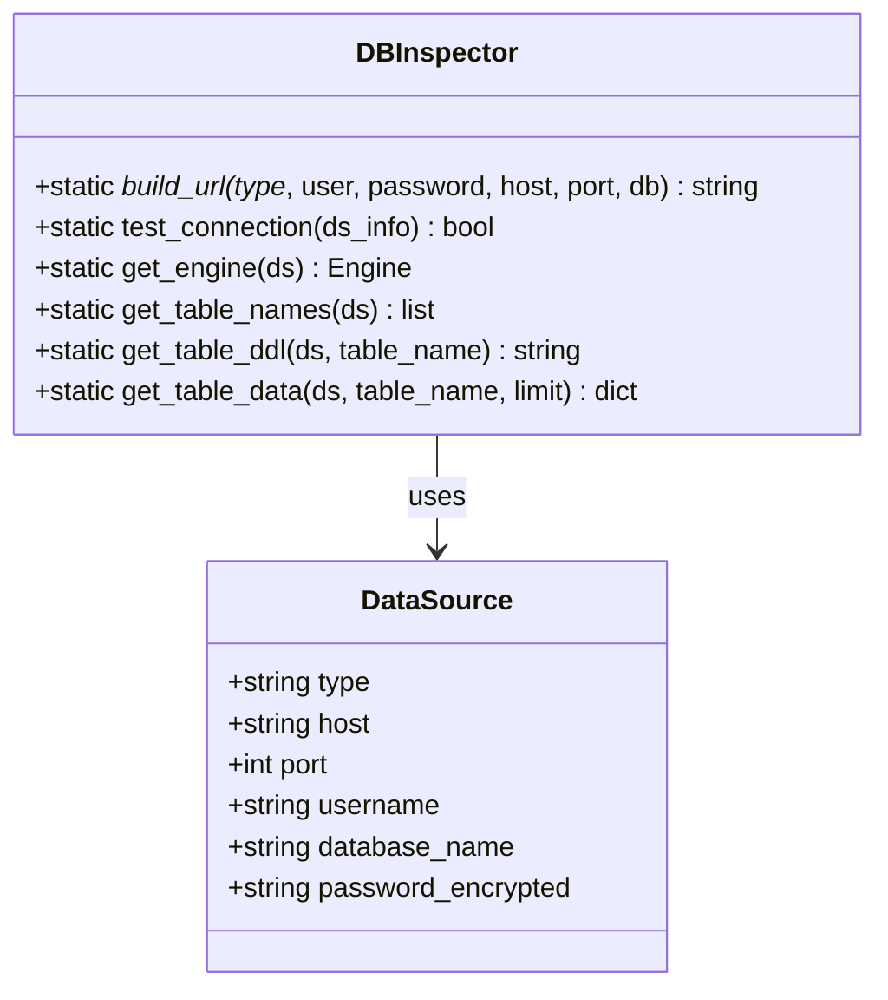

**图表来源**
- [backend/app/services/db_inspector.py](file://backend/app/services/db_inspector.py#L1-L152)

**章节来源**
- [backend/app/schemas/datasource.py](file://backend/app/schemas/datasource.py#L1-L34)
- [backend/app/services/db_inspector.py](file://backend/app/services/db_inspector.py#L1-L152)

## 架构概览

数据源管理接口采用分层架构设计，确保了良好的可维护性和扩展性：

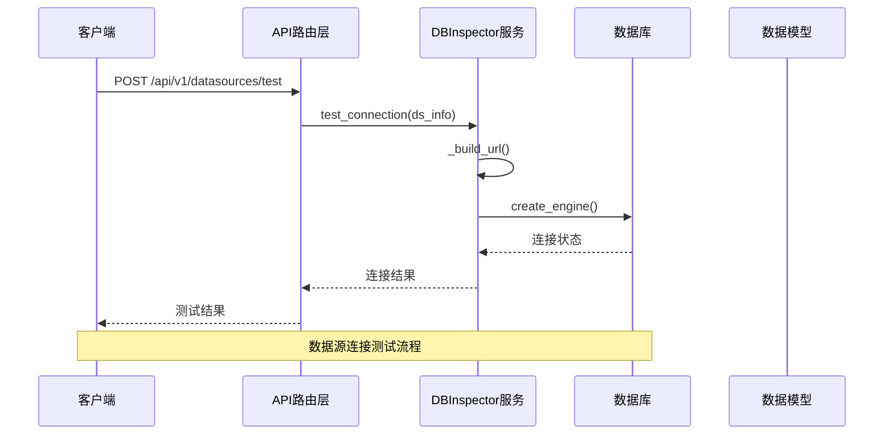

**图表来源**
- [backend/app/api/v1/endpoints/datasource.py](file://backend/app/api/v1/endpoints/datasource.py#L20-L29)
- [backend/app/services/db_inspector.py](file://backend/app/services/db_inspector.py#L32-L50)

系统采用以下关键设计原则：

1. **数据所有权隔离**：通过apply_ownership_filter函数实现基于owner_id的数据访问控制
2. **数据库类型抽象**：DBInspector统一处理不同数据库类型的连接参数构建
3. **安全加密存储**：密码采用encrypt_password函数进行加密存储
4. **连接池优化**：配置适当的连接池参数防止连接超时

## 详细组件分析

### POST /api/v1/datasources/test - 连接测试接口

连接测试接口允许用户在不保存数据源配置的情况下验证数据库连接的有效性。

#### 请求参数 (DataSourceCreate schema)

| 参数名 | 类型 | 必填 | 描述 | 示例值 |
|--------|------|------|------|--------|
| name | string | 是 | 数据源名称 | "生产数据库" |
| type | string | 是 | 数据库类型 | "postgresql" 或 "mysql" |
| host | string | 是 | 数据库主机地址 | "localhost" |
| port | integer | 是 | 数据库端口号 | 5432 |
| username | string | 是 | 数据库用户名 | "admin" |
| password | string | 是 | 数据库密码 | "password123" |
| database_name | string | 是 | 数据库名称 | "bi_production" |

#### 连接测试流程

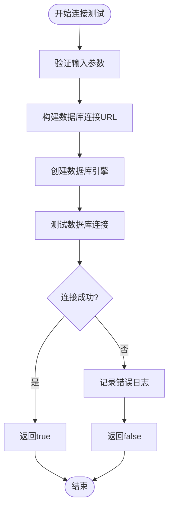

**图表来源**
- [backend/app/services/db_inspector.py](file://backend/app/services/db_inspector.py#L32-L50)

**章节来源**
- [backend/app/api/v1/endpoints/datasource.py](file://backend/app/api/v1/endpoints/datasource.py#L20-L29)
- [backend/app/schemas/datasource.py](file://backend/app/schemas/datasource.py#L12-L16)

### POST /api/v1/datasources - 创建数据源

创建数据源接口负责持久化用户提供的数据库连接配置。

#### 创建流程

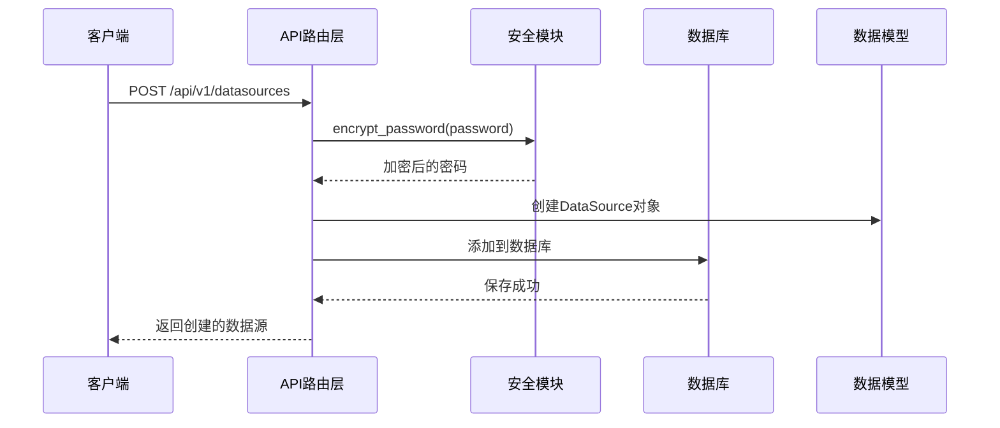

**图表来源**
- [backend/app/api/v1/endpoints/datasource.py](file://backend/app/api/v1/endpoints/datasource.py#L31-L58)

#### 数据所有权控制

创建的数据源默认归属于当前用户，通过owner_id字段实现数据隔离：

- **普通用户**：只能查看自己创建的数据源
- **超级管理员**：可以查看所有数据源
- **公共资源**：owner_id为NULL的数据源可被所有人使用

**章节来源**
- [backend/app/api/v1/endpoints/datasource.py](file://backend/app/api/v1/endpoints/datasource.py#L31-L58)
- [backend/app/api/deps.py](file://backend/app/api/deps.py#L97-L124)

### GET /api/v1/datasources - 读取数据源列表

数据源列表接口支持分页查询和数据所有权过滤。

#### 分页机制

接口支持两种分页方式：

1. **URL参数分页**：`GET /api/v1/datasources?page=1&size=10`
2. **偏移量分页**：`GET /api/v1/datasources?skip=0&limit=100`

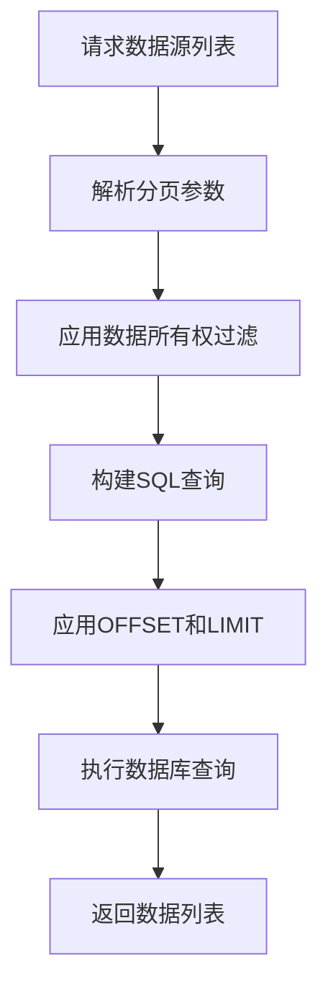

**图表来源**
- [backend/app/api/v1/endpoints/datasource.py](file://backend/app/api/v1/endpoints/datasource.py#L60-L74)

#### 数据所有权过滤逻辑

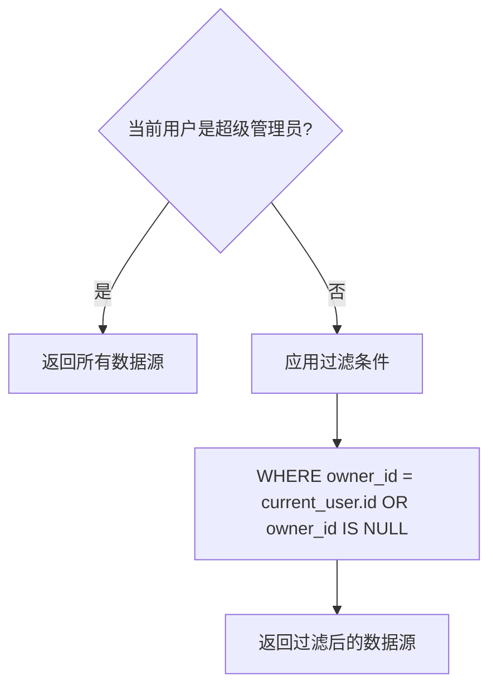

**图表来源**
- [backend/app/api/deps.py](file://backend/app/api/deps.py#L97-L124)

**章节来源**
- [backend/app/api/v1/endpoints/datasource.py](file://backend/app/api/v1/endpoints/datasource.py#L60-L74)
- [backend/app/api/deps.py](file://backend/app/api/deps.py#L97-L124)

### DELETE /api/v1/datasources/{id} - 删除数据源

删除接口实现了严格的数据访问控制和安全检查。

#### 删除流程

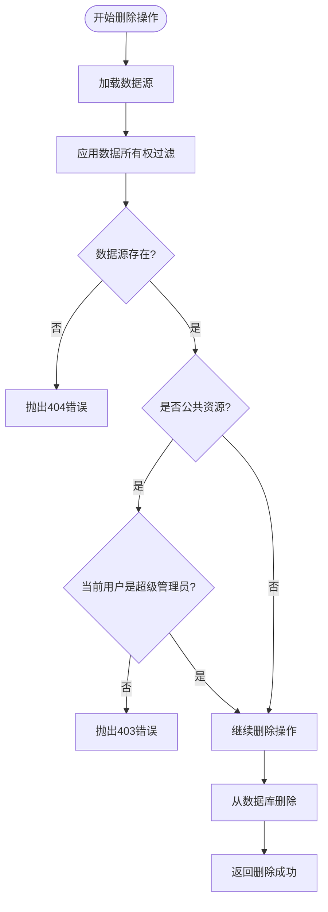

**图表来源**
- [backend/app/api/v1/endpoints/datasource.py](file://backend/app/api/v1/endpoints/datasource.py#L76-L99)

**章节来源**
- [backend/app/api/v1/endpoints/datasource.py](file://backend/app/api/v1/endpoints/datasource.py#L76-L99)

### 数据表元数据接口

系统还提供了数据表元数据查询功能：

#### GET /api/v1/datasources/{id}/tables - 获取数据表列表

该接口返回指定数据源的所有表名和基本结构信息。

#### GET /api/v1/datasources/{id}/tables/{table_name}/preview - 预览表数据

该接口返回指定表的预览数据，包含列信息和示例行数据。

**章节来源**
- [backend/app/api/v1/endpoints/datasource.py](file://backend/app/api/v1/endpoints/datasource.py#L101-L182)

## 依赖关系分析

数据源管理模块的依赖关系体现了清晰的分层架构：

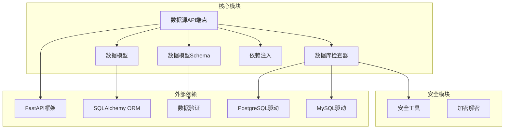

**图表来源**
- [backend/app/api/v1/endpoints/datasource.py](file://backend/app/api/v1/endpoints/datasource.py#L1-L182)
- [backend/app/services/db_inspector.py](file://backend/app/services/db_inspector.py#L1-L152)

### 前端集成

前端通过专门的API封装模块与后端接口交互：

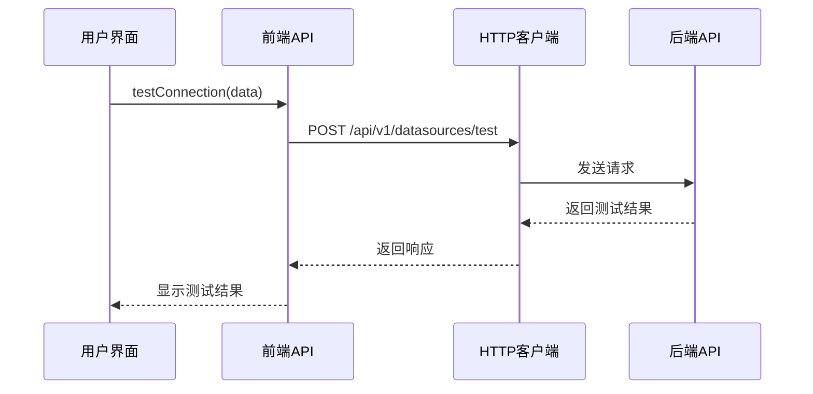

**图表来源**
- [frontend/src/api/datasource.ts](file://frontend/src/api/datasource.ts#L28-L30)
- [frontend/src/utils/http/index.ts](file://frontend/src/utils/http/index.ts#L114-L145)

**章节来源**
- [frontend/src/api/datasource.ts](file://frontend/src/api/datasource.ts#L1-L51)
- [frontend/src/utils/http/index.ts](file://frontend/src/utils/http/index.ts#L1-L173)

## 性能考虑

### 连接池配置

DBInspector针对不同数据库类型配置了优化的连接池参数：

- **连接池大小**：5个基础连接，最多10个溢出连接
- **连接超时**：30秒获取超时，1小时连接回收
- **连接预检查**：启用pre_ping确保连接有效性
- **数据库特定配置**：
  - MySQL：10秒连接超时，30秒读写超时
  - PostgreSQL：10秒连接超时

### 查询优化

- 使用apply_ownership_filter确保查询只返回授权的数据
- 支持分页查询避免一次性加载大量数据
- 数据库索引优化：name字段建立索引便于快速查找

## 故障排除指南

### 常见连接问题

1. **连接超时**
   - 检查网络连通性和防火墙设置
   - 验证数据库服务状态
   - 调整连接超时参数

2. **认证失败**
   - 确认用户名和密码正确
   - 检查数据库用户权限
   - 验证数据库类型选择正确

3. **SSL连接问题**
   - 检查SSL证书配置
   - 验证客户端SSL设置

### 前端调试

使用浏览器开发者工具监控API请求和响应：

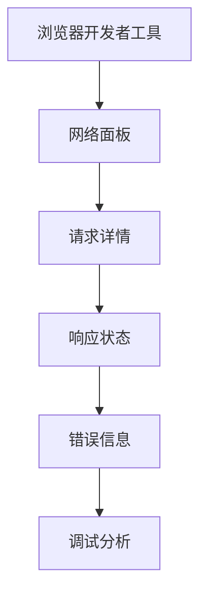

**章节来源**
- [backend/app/services/db_inspector.py](file://backend/app/services/db_inspector.py#L74-L99)

## 结论

数据源管理接口提供了完整的企业级数据库连接管理功能。通过清晰的分层架构、严格的数据所有权控制和完善的错误处理机制，系统能够安全可靠地管理用户的各种数据库连接配置。DBInspector组件的引入使得数据库连接验证变得简单可靠，而前端API封装则提供了良好的用户体验。

该模块的设计充分考虑了性能优化和安全性要求，为Universal BI系统的数据连接功能奠定了坚实的基础。