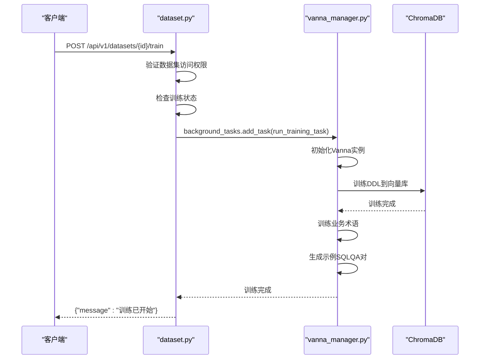
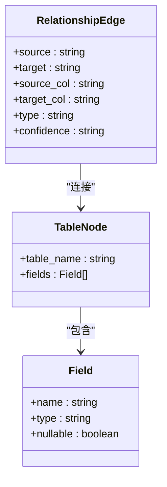
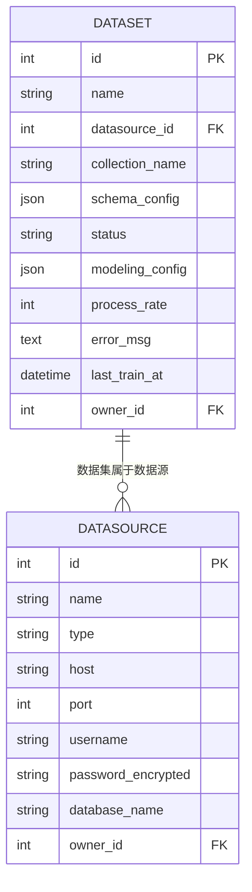

# 数据集管理接口

<cite>
**本文档引用的文件**   
- [dataset.py](file://backend/app/api/v1/endpoints/dataset.py)
- [vanna_manager.py](file://backend/app/services/vanna_manager.py)
- [metadata.py](file://backend/app/models/metadata.py)
- [dataset.ts](file://frontend/src/api/dataset.ts)
- [index.vue](file://frontend/src/views/Dataset/modeling/index.vue)
- [TrainingProgressDialog.vue](file://frontend/src/components/TrainingProgressDialog.vue)
</cite>

## 目录
1. [简介](#简介)
2. [核心功能](#核心功能)
3. [数据集创建与元数据提取](#数据集创建与元数据提取)
4. [训练状态查询与训练触发](#训练状态查询与训练触发)
5. [表结构信息与前端建模](#表结构信息与前端建模)
6. [数据模型与外键关系](#数据模型与外键关系)
7. [JavaScript异步轮询示例](#javascript异步轮询示例)
8. [结论](#结论)

## 简介
本文档详细介绍了数据集管理接口的技术实现，涵盖数据集创建、元数据提取、训练状态查询及训练触发等核心功能。文档重点解析了`POST /api/v1/datasets/{id}/train`如何启动Vanna模型训练流程，并通过`vanna_manager.py`与ChromaDB交互。同时，文档描述了`GET /api/v1/datasets/{id}/tables`返回的表结构信息及其在前端建模界面中的应用。结合`dataset.py`中的SQLAlchemy模型关联，说明了数据集与数据源之间的外键关系，并提供了JavaScript示例展示如何异步轮询训练进度。

## 核心功能
数据集管理接口提供了以下核心功能：
- **数据集创建**：通过`POST /api/v1/datasets`创建新的数据集。
- **元数据提取**：通过`GET /api/v1/datasets/{id}/tables`获取数据集的表结构信息。
- **训练状态查询**：通过`GET /api/v1/datasets/{id}/training/progress`查询训练进度。
- **训练触发**：通过`POST /api/v1/datasets/{id}/train`启动Vanna模型训练。

**Section sources**
- [dataset.py](file://backend/app/api/v1/endpoints/dataset.py#L29-L62)

## 数据集创建与元数据提取
数据集创建通过`POST /api/v1/datasets`接口实现。该接口接收`DatasetCreate`对象，包含数据集名称和数据源ID。创建成功后，系统会自动生成`collection_name`并返回`DatasetResponse`对象。

元数据提取通过`GET /api/v1/datasets/{id}/tables`接口实现。该接口返回数据集的表结构信息，包括表名和字段列表。字段信息包含字段名、类型、是否可为空及默认值。

```mermaid
flowchart TD
A[客户端] --> |POST /api/v1/datasets| B[创建数据集]
B --> C[验证数据源访问权限]
C --> D[创建数据集记录]
D --> E[生成collection_name]
E --> F[返回DatasetResponse]
A --> |GET /api/v1/datasets/{id}/tables| G[获取表结构]
G --> H[查询数据源表信息]
H --> I[返回表结构信息]
```

**Diagram sources **
- [dataset.py](file://backend/app/api/v1/endpoints/dataset.py#L29-L62)
- [datasource.py](file://backend/app/api/v1/endpoints/datasource.py#L130-L155)

**Section sources**
- [dataset.py](file://backend/app/api/v1/endpoints/dataset.py#L29-L62)
- [datasource.py](file://backend/app/api/v1/endpoints/datasource.py#L130-L155)

## 训练状态查询与训练触发
训练状态查询通过`GET /api/v1/datasets/{id}/training/progress`接口实现。该接口返回训练状态、进度百分比、错误信息和当前步骤。

训练触发通过`POST /api/v1/datasets/{id}/train`接口实现。该接口启动Vanna模型训练流程，通过`vanna_manager.py`与ChromaDB交互。训练流程包括提取DDL、训练DDL到Vanna、训练业务术语和生成示例SQLQA对。



**Diagram sources **
- [dataset.py](file://backend/app/api/v1/endpoints/dataset.py#L126-L167)
- [vanna_manager.py](file://backend/app/services/vanna_manager.py#L342-L763)

**Section sources**
- [dataset.py](file://backend/app/api/v1/endpoints/dataset.py#L126-L167)
- [vanna_manager.py](file://backend/app/services/vanna_manager.py#L342-L763)

## 表结构信息与前端建模
`GET /api/v1/datasets/{id}/tables`返回的表结构信息在前端建模界面中用于可视化展示。前端通过`getDbTables`方法获取表结构，并在VueFlow画布中展示表节点和关系连线。用户可以通过拖拽表节点、创建关系连线来构建数据模型。



**Diagram sources **
- [dataset.ts](file://frontend/src/api/dataset.ts#L111-L129)
- [index.vue](file://frontend/src/views/Dataset/modeling/index.vue#L372-L400)

**Section sources**
- [dataset.ts](file://frontend/src/api/dataset.ts#L111-L129)
- [index.vue](file://frontend/src/views/Dataset/modeling/index.vue#L372-L400)

## 数据模型与外键关系
数据集与数据源之间的外键关系通过SQLAlchemy模型定义。`Dataset`模型中的`datasource_id`字段是`DataSource`模型的外键。`Dataset`模型通过`relationship`与`DataSource`模型关联，实现数据集与数据源的一对多关系。



**Diagram sources **
- [metadata.py](file://backend/app/models/metadata.py#L35-L54)

**Section sources**
- [metadata.py](file://backend/app/models/metadata.py#L35-L54)

## JavaScript异步轮询示例
以下JavaScript示例展示了如何异步轮询训练进度：

```javascript
async function pollTrainingProgress(datasetId) {
  const pollingTimer = setInterval(async () => {
    try {
      const res = await getTrainingProgress(datasetId);
      console.log(`训练进度: ${res.process_rate}%`);
      console.log(`当前步骤: ${res.current_step}`);
      
      if (['completed', 'failed'].includes(res.status)) {
        clearInterval(pollingTimer);
        console.log('训练完成或失败，停止轮询');
      }
    } catch (error) {
      console.error('获取训练进度失败:', error);
      clearInterval(pollingTimer);
    }
  }, 1000);
}
```

**Section sources**
- [TrainingProgressDialog.vue](file://frontend/src/components/TrainingProgressDialog.vue#L249-L264)

## 结论
本文档详细介绍了数据集管理接口的技术实现，涵盖了数据集创建、元数据提取、训练状态查询及训练触发等核心功能。通过`POST /api/v1/datasets/{id}/train`接口，系统能够启动Vanna模型训练流程，并通过`vanna_manager.py`与ChromaDB交互。`GET /api/v1/datasets/{id}/tables`返回的表结构信息在前端建模界面中用于可视化展示。数据集与数据源之间的外键关系通过SQLAlchemy模型定义。JavaScript示例展示了如何异步轮询训练进度，确保用户能够实时了解训练状态。