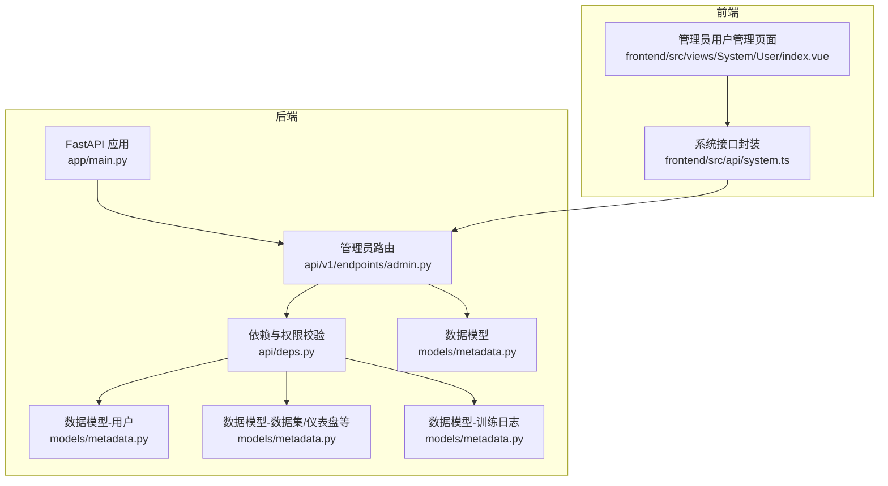
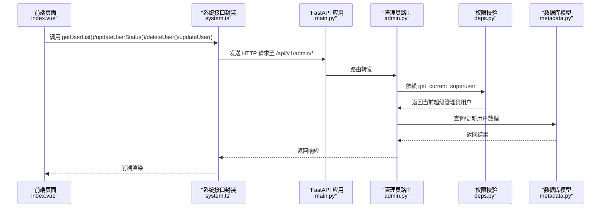
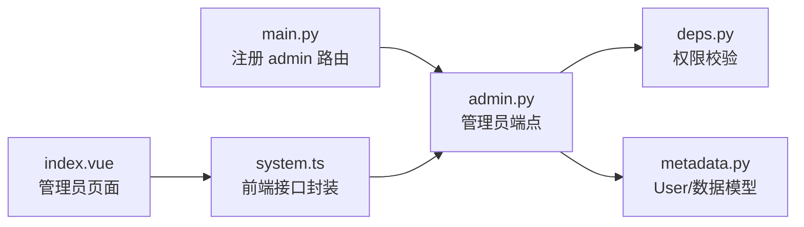

# 管理员接口

<cite>
**本文引用的文件**
- [backend/app/api/v1/endpoints/admin.py](file://backend/app/api/v1/endpoints/admin.py)
- [backend/app/api/deps.py](file://backend/app/api/deps.py)
- [backend/app/models/metadata.py](file://backend/app/models/metadata.py)
- [backend/app/schemas/user.py](file://backend/app/schemas/user.py)
- [backend/app/main.py](file://backend/app/main.py)
- [frontend/src/api/system.ts](file://frontend/src/api/system.ts)
- [frontend/src/views/System/User/index.vue](file://frontend/src/views/System/User/index.vue)
- [backend/monitor_redis.py](file://backend/monitor_redis.py)
- [backend/TRAINING_CONTROL_GUIDE.md](file://backend/TRAINING_CONTROL_GUIDE.md)
</cite>

## 目录
1. [简介](#简介)
2. [项目结构](#项目结构)
3. [核心组件](#核心组件)
4. [架构总览](#架构总览)
5. [详细组件分析](#详细组件分析)
6. [依赖关系分析](#依赖关系分析)
7. [性能考量](#性能考量)
8. [故障排查指南](#故障排查指南)
9. [结论](#结论)
10. [附录](#附录)

## 简介
本文件为管理员专用接口的权威文档，聚焦用户管理与系统监控两大功能域。重点覆盖：
- GET /api/v1/admin/users 的分页查询、关键词搜索与超级管理员权限校验机制（依赖 deps.py 中的 allow_superuser）
- PUT /api/v1/admin/users/{id} 如何修改用户角色或禁用账户，并强调 owner_id 为 NULL 的公共资源可见性规则
- 系统级监控接口的使用方法，包括活跃会话统计与训练任务监控
- 管理员前端调用 system.ts 的权限守卫实现示例

## 项目结构
后端采用 FastAPI + SQLAlchemy 架构，管理员接口位于 /api/v1/endpoints/admin.py，权限校验由 deps.py 提供；前端通过 system.ts 调用管理员接口，页面组件负责分页、搜索与操作交互。

图表来源
- [backend/app/main.py](file://backend/app/main.py#L25-L30)
- [backend/app/api/v1/endpoints/admin.py](file://backend/app/api/v1/endpoints/admin.py#L1-L232)
- [backend/app/api/deps.py](file://backend/app/api/deps.py#L1-L124)
- [backend/app/models/metadata.py](file://backend/app/models/metadata.py#L1-L129)
- [frontend/src/api/system.ts](file://frontend/src/api/system.ts#L1-L77)
- [frontend/src/views/System/User/index.vue](file://frontend/src/views/System/User/index.vue#L1-L397)

章节来源
- [backend/app/main.py](file://backend/app/main.py#L1-L35)
- [backend/app/api/v1/endpoints/admin.py](file://backend/app/api/v1/endpoints/admin.py#L1-L232)
- [backend/app/api/deps.py](file://backend/app/api/deps.py#L1-L124)
- [backend/app/models/metadata.py](file://backend/app/models/metadata.py#L1-L129)
- [frontend/src/api/system.ts](file://frontend/src/api/system.ts#L1-L77)
- [frontend/src/views/System/User/index.vue](file://frontend/src/views/System/User/index.vue#L1-L397)

## 核心组件
- 管理员路由与端点：提供用户列表查询、状态变更、软删除、信息修改等能力
- 权限校验依赖：get_current_superuser 实现超级管理员权限校验
- 数据模型：用户、数据源、数据集、仪表盘、训练日志等
- 前端接口封装：system.ts 提供统一的管理员接口调用方法
- 监控工具：Redis 黑名单监控脚本与训练控制指南

章节来源
- [backend/app/api/v1/endpoints/admin.py](file://backend/app/api/v1/endpoints/admin.py#L16-L232)
- [backend/app/api/deps.py](file://backend/app/api/deps.py#L83-L94)
- [backend/app/models/metadata.py](file://backend/app/models/metadata.py#L6-L129)
- [frontend/src/api/system.ts](file://frontend/src/api/system.ts#L1-L77)

## 架构总览
管理员接口的调用链路如下：前端通过 system.ts 发起请求，FastAPI 路由器接收请求，依赖注入 get_current_superuser 校验超级管理员权限，随后访问数据库模型执行相应操作。

图表来源
- [backend/app/main.py](file://backend/app/main.py#L25-L30)
- [backend/app/api/v1/endpoints/admin.py](file://backend/app/api/v1/endpoints/admin.py#L16-L232)
- [backend/app/api/deps.py](file://backend/app/api/deps.py#L83-L94)
- [backend/app/models/metadata.py](file://backend/app/models/metadata.py#L6-L129)
- [frontend/src/api/system.ts](file://frontend/src/api/system.ts#L40-L76)
- [frontend/src/views/System/User/index.vue](file://frontend/src/views/System/User/index.vue#L242-L374)

## 详细组件分析

### GET /api/v1/admin/users：分页查询与搜索
- 接口路径：/api/v1/admin/users
- 方法：GET
- 权限：仅超级管理员
- 查询参数
  - page：页码，默认 1，最小 1
  - page_size：每页数量，默认 20，范围 [1, 100]
  - search：关键词，支持按 email 或 full_name 模糊匹配
- 返回体：UsersListResponse，包含 total、page、page_size、users
- 关键逻辑
  - 构建基础查询并应用搜索过滤（email 或 full_name 包含关键词）
  - 计算总数并分页（offset = (page - 1) × page_size）
  - 记录日志，包含当前管理员邮箱、页码、页大小、搜索词与总数

章节来源
- [backend/app/api/v1/endpoints/admin.py](file://backend/app/api/v1/endpoints/admin.py#L16-L60)
- [backend/app/schemas/user.py](file://backend/app/schemas/user.py#L59-L65)

### PUT /api/v1/admin/users/{id}：修改用户角色或禁用账户
- 接口路径：/api/v1/admin/users/{user_id}
- 方法：PATCH
- 权限：仅超级管理员
- 请求体：UserUpdateByAdmin，字段可选（full_name、password、role）
- 行为
  - 仅允许修改非自身信息（防误操作）
  - 若任一字段提供则更新对应字段；若均未提供则报错
  - 密码更新时进行哈希处理
  - 记录日志，包含管理员邮箱、被修改用户邮箱、旧值与新值
- 返回体：UserListOut

章节来源
- [backend/app/api/v1/endpoints/admin.py](file://backend/app/api/v1/endpoints/admin.py#L162-L231)
- [backend/app/schemas/user.py](file://backend/app/schemas/user.py#L52-L56)

### PATCH /api/v1/admin/users/{id}/status：封禁/解封用户
- 接口路径：/api/v1/admin/users/{user_id}/status
- 方法：PATCH
- 权限：仅超级管理员
- 请求体：UserStatusUpdate，包含 is_active（布尔）
- 行为
  - 仅允许修改非自身状态
  - is_active=false 表示封禁，true 表示解封
  - 记录日志，包含管理员邮箱、被封禁/解封用户邮箱及状态变更前后对比

章节来源
- [backend/app/api/v1/endpoints/admin.py](file://backend/app/api/v1/endpoints/admin.py#L63-L107)
- [backend/app/schemas/user.py](file://backend/app/schemas/user.py#L47-L49)

### DELETE /api/v1/admin/users/{id}：软删除用户
- 接口路径：/api/v1/admin/users/{user_id}
- 方法：DELETE
- 权限：仅超级管理员
- 行为
  - 将 is_deleted 设为 True，同时将 is_active 设为 False
  - 不会物理删除记录，便于审计与恢复
  - 不能删除自身
  - 若用户已删除则报错

章节来源
- [backend/app/api/v1/endpoints/admin.py](file://backend/app/api/v1/endpoints/admin.py#L110-L159)

### 超级管理员权限校验机制（依赖 deps.py 中的 allow_superuser）
- get_current_superuser 依赖 get_current_user 完成令牌黑名单校验、签名验证、用户软删除与封禁状态检查
- get_current_superuser 校验 current_user.is_superuser，非超级管理员直接拒绝
- apply_ownership_filter 提供数据隔离过滤逻辑：超级管理员可查看全部，普通用户仅能查看 owner_id==当前用户或 owner_id==NULL 的资源

章节来源
- [backend/app/api/deps.py](file://backend/app/api/deps.py#L17-L80)
- [backend/app/api/deps.py](file://backend/app/api/deps.py#L83-L94)
- [backend/app/api/deps.py](file://backend/app/api/deps.py#L97-L124)

### owner_id 为 NULL 的公共资源可见性规则
- 数据模型中多处字段包含 owner_id（如 DataSource、Dataset、Dashboard、BusinessTerm），当 owner_id 为 NULL 时表示公共资源
- apply_ownership_filter 逻辑：普通用户仅能查看 owner_id==当前用户或 owner_id==NULL 的数据；超级管理员可查看全部
- 该规则适用于涉及 owner_id 的查询场景，确保数据隔离与共享边界清晰

章节来源
- [backend/app/models/metadata.py](file://backend/app/models/metadata.py#L29-L48)
- [backend/app/models/metadata.py](file://backend/app/models/metadata.py#L62-L105)
- [backend/app/api/deps.py](file://backend/app/api/deps.py#L97-L124)

### 系统级监控接口与工具
- Redis 黑名单监控
  - 用途：监控 Redis 中的 token 黑名单 Key 数量、剩余时间与缓存分布
  - 命令：python3 monitor_redis.py [刷新间隔秒数]
  - 输出：服务器信息、黑名单统计、缓存统计与详情
- 训练任务监控
  - 数据集状态与进度：status、process_rate、error_msg、last_train_at
  - 中断控制：将数据集状态设为 paused 触发训练暂停
  - 日志记录：TrainingLog 记录训练过程中的关键节点
  - 前端集成建议：轮询进度接口，展示状态与进度条

章节来源
- [backend/monitor_redis.py](file://backend/monitor_redis.py#L32-L177)
- [backend/TRAINING_CONTROL_GUIDE.md](file://backend/TRAINING_CONTROL_GUIDE.md#L104-L125)
- [backend/TRAINING_CONTROL_GUIDE.md](file://backend/TRAINING_CONTROL_GUIDE.md#L196-L207)
- [backend/app/models/metadata.py](file://backend/app/models/metadata.py#L43-L47)
- [backend/app/models/metadata.py](file://backend/app/models/metadata.py#L70-L79)

### 管理员前端调用 system.ts 的权限守卫实现示例
- system.ts 提供以下方法：
  - getUserList(params)：分页与搜索
  - updateUserStatus(userId, data)：封禁/解封
  - deleteUser(userId)：软删除
  - updateUser(userId, data)：修改用户信息
- 前端页面 index.vue 的典型流程
  - 初始化分页参数与搜索关键词
  - 调用 getUserList 获取用户列表并渲染表格
  - 点击“封禁/解封”调用 updateUserStatus
  - 点击“注销”调用 deleteUser
  - 点击“编辑”弹窗收集 full_name/password/role，仅提交非空字段，调用 updateUser

章节来源
- [frontend/src/api/system.ts](file://frontend/src/api/system.ts#L40-L76)
- [frontend/src/views/System/User/index.vue](file://frontend/src/views/System/User/index.vue#L242-L374)

## 依赖关系分析
- 路由注册：main.py 将 admin 路由挂载到 /api/v1/admin 前缀
- 权限依赖：admin.py 中各端点均依赖 get_current_superuser
- 数据模型：admin.py 操作 User 模型，deps.py 的 apply_ownership_filter 作用于具有 owner_id 的模型
- 前端依赖：index.vue 通过 system.ts 调用后端接口

图表来源
- [backend/app/main.py](file://backend/app/main.py#L25-L30)
- [backend/app/api/v1/endpoints/admin.py](file://backend/app/api/v1/endpoints/admin.py#L7-L10)
- [backend/app/api/deps.py](file://backend/app/api/deps.py#L83-L94)
- [backend/app/models/metadata.py](file://backend/app/models/metadata.py#L6-L129)
- [frontend/src/api/system.ts](file://frontend/src/api/system.ts#L1-L77)
- [frontend/src/views/System/User/index.vue](file://frontend/src/views/System/User/index.vue#L1-L397)

章节来源
- [backend/app/main.py](file://backend/app/main.py#L25-L30)
- [backend/app/api/v1/endpoints/admin.py](file://backend/app/api/v1/endpoints/admin.py#L7-L10)
- [backend/app/api/deps.py](file://backend/app/api/deps.py#L83-L94)
- [backend/app/models/metadata.py](file://backend/app/models/metadata.py#L6-L129)
- [frontend/src/api/system.ts](file://frontend/src/api/system.ts#L1-L77)
- [frontend/src/views/System/User/index.vue](file://frontend/src/views/System/User/index.vue#L1-L397)

## 性能考量
- 分页与搜索
  - page_size 上限为 100，避免一次性返回过多数据
  - 模糊匹配在 email 与 full_name 上进行，建议配合索引提升查询效率
- 权限校验
  - get_current_user 会进行黑名单、签名、软删除与封禁状态检查，确保安全性的同时增加一次数据库查询
- 数据隔离
  - apply_ownership_filter 在普通用户场景下增加 OR 条件，注意在大表上建立 owner_id 索引以降低开销

章节来源
- [backend/app/api/v1/endpoints/admin.py](file://backend/app/api/v1/endpoints/admin.py#L20-L22)
- [backend/app/api/deps.py](file://backend/app/api/deps.py#L17-L80)
- [backend/app/api/deps.py](file://backend/app/api/deps.py#L97-L124)

## 故障排查指南
- 401 未授权
  - 可能原因：令牌在黑名单中、令牌签名无效、用户被软删除或封禁
  - 处理建议：确认令牌有效性与用户状态
- 403 权限不足
  - 可能原因：当前用户非超级管理员
  - 处理建议：确保调用者具备 is_superuser=true
- 400 参数错误
  - 可能原因：修改用户信息时未提供任何更新字段；封禁/解封时尝试修改自身状态
  - 处理建议：检查请求体字段与目标用户是否为自身
- 404 用户不存在
  - 可能原因：user_id 不存在
  - 处理建议：确认用户 ID 正确性
- 训练任务中断
  - 可能原因：将数据集状态设为 paused
  - 处理建议：等待检查点后自动停止，或恢复状态继续训练

章节来源
- [backend/app/api/deps.py](file://backend/app/api/deps.py#L30-L80)
- [backend/app/api/v1/endpoints/admin.py](file://backend/app/api/v1/endpoints/admin.py#L82-L93)
- [backend/app/api/v1/endpoints/admin.py](file://backend/app/api/v1/endpoints/admin.py#L188-L193)
- [backend/app/api/v1/endpoints/admin.py](file://backend/app/api/v1/endpoints/admin.py#L128-L147)
- [backend/TRAINING_CONTROL_GUIDE.md](file://backend/TRAINING_CONTROL_GUIDE.md#L196-L207)

## 结论
管理员接口围绕“超级管理员权限校验 + 用户生命周期管理 + 系统监控”构建，既保证了平台安全与合规，又提供了高效的运维手段。前端通过 system.ts 与 index.vue 实现直观的用户管理体验；后端通过 deps.py 的 apply_ownership_filter 确保数据隔离与公共资源可见性。结合 Redis 黑名单监控与训练控制指南，可实现对活跃会话与训练任务的全面掌控。

## 附录
- 接口一览
  - GET /api/v1/admin/users：分页查询与搜索
  - PATCH /api/v1/admin/users/{id}/status：封禁/解封
  - DELETE /api/v1/admin/users/{id}：软删除
  - PATCH /api/v1/admin/users/{id}：修改用户信息
- 前端调用要点
  - 分页与搜索：getUserList({ page, page_size, search })
  - 状态变更：updateUserStatus(userId, { is_active })
  - 软删除：deleteUser(userId)
  - 修改信息：updateUser(userId, { full_name?, password?, role? })