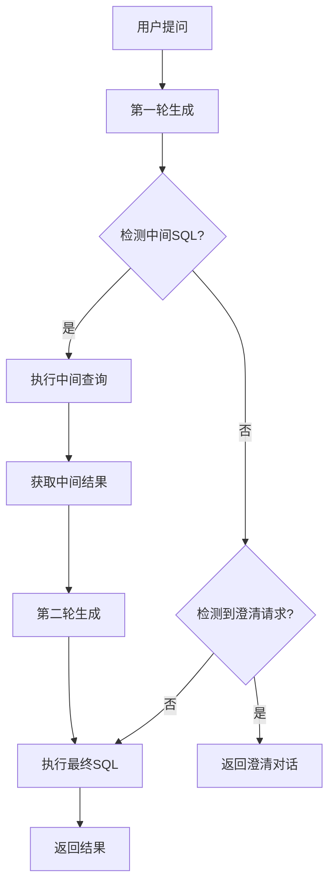
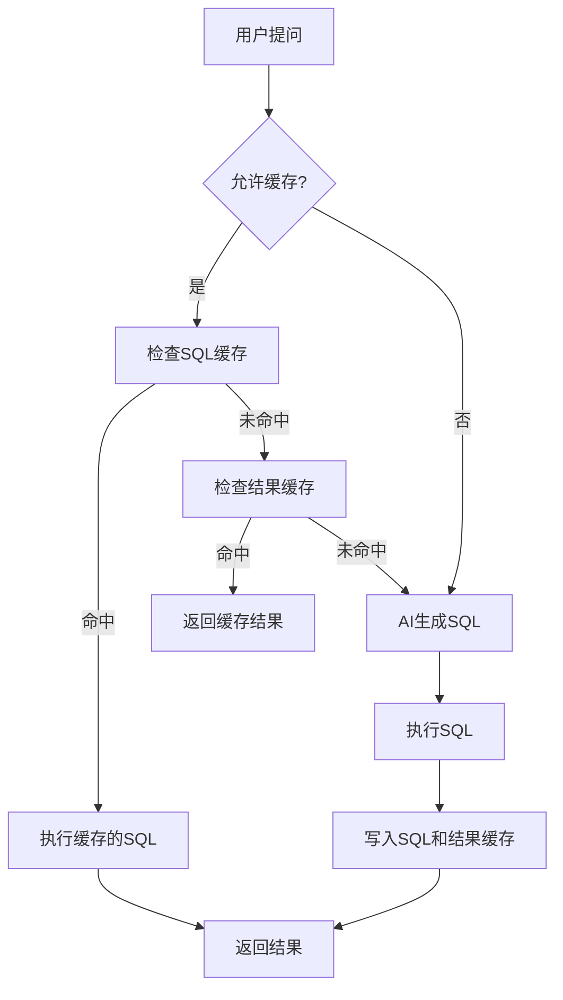

# 聊天查询接口

<cite>
**本文档引用文件**   
- [chat.py](file://backend/app/api/v1/endpoints/chat.py)
- [chat.ts](file://frontend/src/api/chat.ts)
- [vanna_manager.py](file://backend/app/services/vanna_manager.py)
- [chat.py](file://backend/app/schemas/chat.py)
- [MULTI_ROUND_REASONING.md](file://docs/backend/MULTI_ROUND_REASONING.md)
- [REDIS_CACHE.md](file://docs/backend/REDIS_CACHE.md)
- [index.vue](file://frontend/src/views/Chat/index.vue)
</cite>

## 目录
1. [接口概述](#接口概述)
2. [输入输出结构](#输入输出结构)
3. [多轮推理机制](#多轮推理机制)
4. [AI模型调用与SQL执行](#ai模型调用与sql执行)
5. [Redis结果缓存](#redis结果缓存)
6. [前端流式响应处理](#前端流式响应处理)
7. [测试用例](#测试用例)

## 接口概述

聊天查询接口 `POST /api/v1/chat/message` 是 Universal-BI 系统的核心功能，它允许用户通过自然语言提问，系统自动将其转换为 SQL 查询并返回可视化结果。该接口集成了多轮推理、澄清提问、结果缓存和错误自愈等高级功能，旨在提供智能、流畅的对话式数据分析体验。

**Section sources**
- [chat.py](file://backend/app/api/v1/endpoints/chat.py#L13-L42)

## 输入输出结构

### 输入结构 (ChatRequest)

聊天查询接口的输入是一个 JSON 对象，其结构由 `ChatRequest` 模型定义，包含以下两个必填字段：

- **dataset_id**: 整数类型，指定要查询的数据集ID。
- **question**: 字符串类型，用户提出的自然语言问题。

```json
{
  "dataset_id": 1,
  "question": "查询2023年销售额最高的产品"
}
```

### 输出结构 (ChatResponse)

接口的输出是一个包含丰富信息的 JSON 对象，其结构由 `ChatResponse` 模型定义，主要字段如下：

- **sql**: 生成的 SQL 查询语句，如果无法生成则为 `null`。
- **columns**: 查询结果的列名列表。
- **rows**: 查询结果的数据行，每行是一个键值对对象。
- **chart_type**: 推断出的图表类型，如 `table`, `bar`, `line`, `pie` 或 `clarification`（表示需要澄清）。
- **answer_text**: 当 `chart_type` 为 `clarification` 时，此字段包含 AI 提出的澄清问题。
- **steps**: 一个字符串数组，记录了从理解问题到返回结果的完整执行步骤，用于调试和展示。
- **from_cache**: 布尔值，指示结果是否来自缓存。
- **insight**: 由 AI 分析师代理生成的业务洞察摘要。

```json
{
  "sql": "SELECT product_name, sales FROM products ORDER BY sales DESC LIMIT 1",
  "columns": ["product_name", "sales"],
  "rows": [
    {"product_name": "产品A", "sales": 100000}
  ],
  "chart_type": "bar",
  "answer_text": null,
  "steps": ["初始化完成", "LLM 初始响应生成", "SQL 执行成功"],
  "from_cache": false,
  "insight": "产品A的销售额最高，达到10万元，远超其他产品。"
}
```

**Section sources**
- [chat.py](file://backend/app/api/v1/endpoints/chat.py#L13-L42)
- [chat.py](file://backend/app/schemas/chat.py#L4-L18)

## 多轮推理机制

系统通过多轮推理机制处理模糊或不明确的用户问题。该机制的核心逻辑在 `MULTI_ROUND_REASONING.md` 文档中详细描述，并在 `VannaManager.generate_result` 方法中实现。

### 核心流程

1.  **第一轮生成**: 系统将用户问题发送给 AI 模型，期望获得一个 SQL 查询。
2.  **中间 SQL 检测**: 如果 AI 模型返回的响应中包含探索性 SQL（例如 `SELECT DISTINCT type FROM users;`），系统会识别出这是一个“中间 SQL”。
3.  **执行中间查询**: 系统自动执行这个中间 SQL，获取数据库中的实际数据。
4.  **第二轮生成**: 系统将原始问题和中间查询的结果（如 `['VIP', 'Normal', 'Enterprise']`）一起作为新的提示（prompt）发送给 AI 模型，要求其生成最终的、精确的 SQL 查询。
5.  **澄清请求**: 如果 AI 模型无法推断出用户意图，它会返回一个澄清问题。此时，系统会将 `chart_type` 设置为 `clarification`，并将 AI 的问题通过 `answer_text` 返回给前端。

### 技术实现

- **`_extract_intermediate_sql` 方法**: 通过关键词（如“不确定”、“intermediate_sql”）和 SQL 模式（如 `DISTINCT` 查询）来检测中间 SQL。
- **`_is_clarification_request` 方法**: 通过检测澄清关键词（如“请明确”、“cannot determine”）和无效 SQL 来判断是否需要澄清。



**Diagram sources**
- [vanna_manager.py](file://backend/app/services/vanna_manager.py#L849-L1312)
- [MULTI_ROUND_REASONING.md](file://docs/backend/MULTI_ROUND_REASONING.md#执行流程)

## AI模型调用与SQL执行

`vanna_manager.py` 文件中的 `VannaManager` 类是整个自然语言转 SQL 流程的核心。

### 核心组件

- **VannaLegacy**: 一个继承自 `ChromaDB_VectorStore` 和 `OpenAI_Chat` 的类，它结合了向量数据库（用于存储和检索训练数据）和 OpenAI 的聊天模型（用于生成 SQL）。
- **VannaManager**: 一个静态工具类，封装了所有与 Vanna 相关的操作，如生成结果、训练模型、管理缓存等。

### 工作流程

1.  **初始化**: `generate_result` 方法首先获取数据集和数据源信息，并初始化 `VannaLegacy` 实例。
2.  **生成 SQL**: 调用 `vn.generate_sql(question)` 方法，该方法会利用向量数据库中的训练数据（如 DDL、业务术语）来增强提示，从而生成更准确的 SQL。
3.  **执行 SQL**: 使用 `pandas.read_sql()` 执行生成的 SQL 查询。
4.  **推断图表类型**: 根据查询结果的结构（如是否有日期列、数值列等）自动推断最合适的图表类型。
5.  **生成业务洞察**: 在返回结果前，系统会调用 `generate_data_insight` 方法，让 AI 以“分析师”的角色对数据进行分析，并生成一段简明的业务洞察。

**Section sources**
- [vanna_manager.py](file://backend/app/services/vanna_manager.py#L42-L1967)

## Redis结果缓存

为了优化性能，系统使用 Redis 实现了两级缓存策略，该功能在 `REDIS_CACHE.md` 文档中有详细说明。

### 缓存策略

1.  **SQL 缓存**: 缓存生成的 SQL 语句，TTL（生存时间）较长（默认 7 天）。当缓存命中时，系统会重新执行 SQL 以获取最新数据，从而保证数据的时效性。
2.  **结果缓存**: 缓存完整的查询结果（包括 `sql`, `columns`, `rows` 等），TTL 较短（默认 5 分钟）。这适用于极短期的重复查询，能实现秒级响应。

### 工作流程

1.  **检查缓存**: 在生成 SQL 前，系统会先检查 Redis 中是否存在该问题的 SQL 缓存。
2.  **缓存命中**: 如果命中，则直接执行缓存的 SQL 并返回结果，整个过程非常快。
3.  **缓存未命中**: 如果未命中，则进入常规的 AI 生成和 SQL 执行流程。
4.  **写入缓存**: 查询成功后，系统会将 SQL 和结果分别写入 Redis。

### 异常降级

如果 Redis 服务不可用，系统会自动降级，所有功能正常运行，只是不使用缓存，确保了系统的健壮性。



**Diagram sources**
- [vanna_manager.py](file://backend/app/services/vanna_manager.py#L849-L1312)
- [REDIS_CACHE.md](file://docs/backend/REDIS_CACHE.md#工作原理)

## 前端流式响应处理

前端通过 `chat.ts` 文件中的 `sendChat` 函数与后端 API 交互，并在 `index.vue` 组件中处理响应。

### 实现细节

1.  **API 调用**: `sendChat` 函数使用 `http.post` 方法向 `/chat/` 端点发送请求。
2.  **响应处理**: 函数接收到后端响应后，会将其结构转换为前端组件所需的格式，然后返回。
3.  **UI 渲染**: `index.vue` 组件根据返回的 `chart_type` 决定如何渲染结果：
    -   如果 `chart_type` 为 `clarification`，则显示 AI 的澄清问题，并提供快捷回复选项。
    -   如果 `chart_type` 为 `table`, `bar` 等，则使用 `DynamicChart` 组件渲染图表。
    -   无论何种类型，都会显示一个可折叠的“执行步骤”面板，展示 `steps` 字段的内容。
4.  **流式体验**: 虽然当前实现是基于普通 HTTP 请求，但通过在发送请求后立即显示“加载中”动画，并在收到响应后更新 UI，模拟了流式响应的效果，提升了用户体验。

**Section sources**
- [chat.ts](file://frontend/src/api/chat.ts#L42-L55)
- [index.vue](file://frontend/src/views/Chat/index.vue#L378-L764)

## 测试用例

### 模拟多轮对话

以下是一个模拟用户与系统进行多轮对话的测试用例：

1.  **第一轮提问**: 用户问“查询大客户数量”。
    -   **系统响应**: 由于“大客户”定义模糊，系统检测到中间 SQL `SELECT DISTINCT type FROM users;`。
    -   **系统行为**: 执行中间查询，得到结果 `['VIP', 'Normal', 'Enterprise']`。
2.  **第二轮生成**: 系统将“大客户”和 `['VIP', 'Normal', 'Enterprise']` 作为新提示发送给 AI。
    -   **AI 响应**: 生成最终 SQL `SELECT COUNT(*) FROM users WHERE type = 'VIP'`。
3.  **最终结果**: 执行最终 SQL，返回结果和图表。

### 单元测试

系统提供了手动测试脚本来验证核心功能：
- `test_multi_round.py`: 验证中间 SQL 提取、澄清请求识别和多轮推理流程。
- `test_redis_cache.py`: 验证 Redis 连接、缓存键生成、序列化和异常降级等功能。

**Section sources**
- [test_multi_round.py](file://backend/tests/manual_scripts/test_multi_round.py#L1-L203)
- [test_redis_cache.py](file://backend/tests/manual_scripts/test_redis_cache.py#L1-L363)