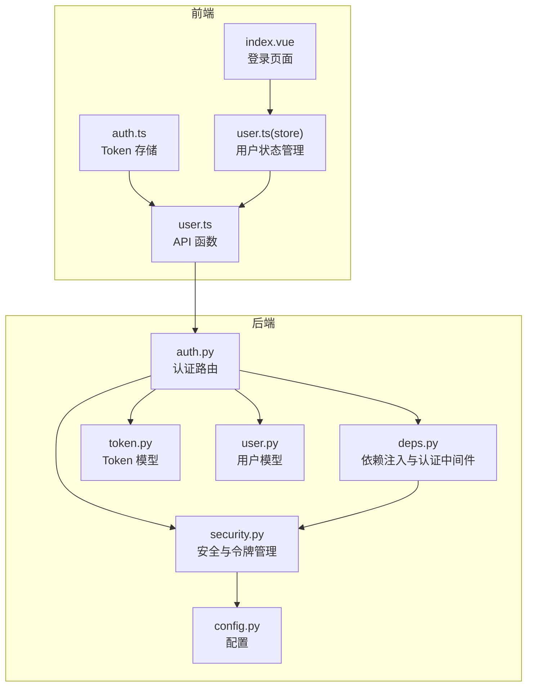
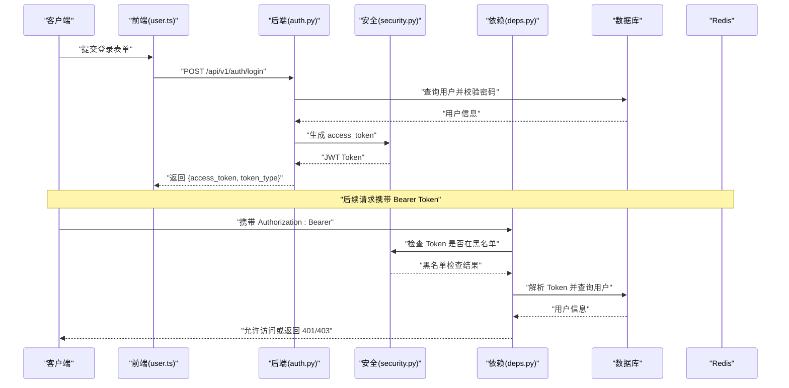
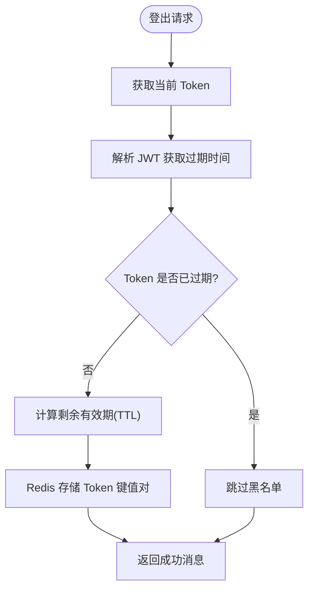
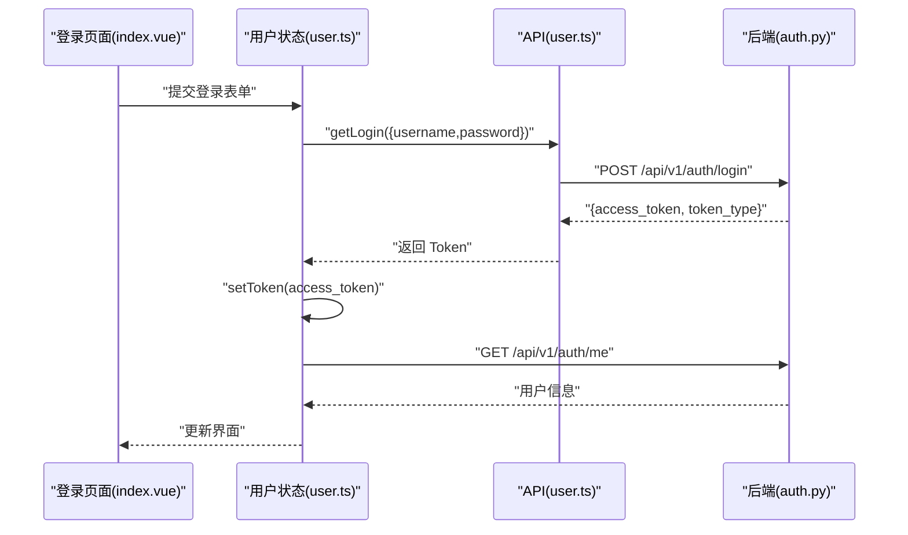
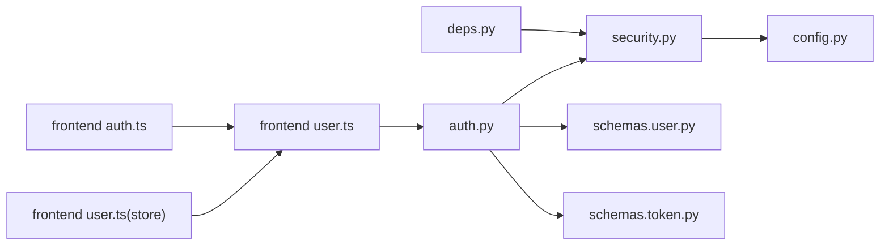

# 认证接口

<cite>
**本文引用的文件**
- [backend/app/api/v1/endpoints/auth.py](file://backend/app/api/v1/endpoints/auth.py)
- [backend/app/schemas/user.py](file://backend/app/schemas/user.py)
- [backend/app/schemas/token.py](file://backend/app/schemas/token.py)
- [backend/app/core/security.py](file://backend/app/core/security.py)
- [backend/app/api/deps.py](file://backend/app/api/deps.py)
- [backend/app/core/config.py](file://backend/app/core/config.py)
- [backend/app/main.py](file://backend/app/main.py)
- [frontend/src/api/user.ts](file://frontend/src/api/user.ts)
- [frontend/src/utils/auth.ts](file://frontend/src/utils/auth.ts)
- [frontend/src/store/modules/user.ts](file://frontend/src/store/modules/user.ts)
- [frontend/src/views/Login/index.vue](file://frontend/src/views/Login/index.vue)
- [backend/tests/manual_scripts/test_logout.py](file://backend/tests/manual_scripts/test_logout.py)
- [backend/tests/manual_scripts/test_token_blacklist.sh](file://backend/tests/manual_scripts/test_token_blacklist.sh)
</cite>

## 目录
1. [简介](#简介)
2. [项目结构](#项目结构)
3. [核心组件](#核心组件)
4. [架构概览](#架构概览)
5. [详细组件分析](#详细组件分析)
6. [依赖关系分析](#依赖关系分析)
7. [性能考虑](#性能考虑)
8. [故障排除指南](#故障排除指南)
9. [结论](#结论)
10. [附录](#附录)

## 简介
本文档详细说明了系统的认证接口，包括用户注册、登录、登出以及令牌管理功能。重点覆盖以下方面：
- POST /api/v1/auth/login 的请求体结构（使用 schemas.user.UserLogin）和响应格式（schemas.token.Token），包括 access_token 的生成机制
- JWT Bearer 认证在其他 API 中的应用方式
- 登出机制如何利用 Redis 实现令牌黑名单
- 前端调用示例，展示如何通过 user.ts 中的 API 函数处理认证流程
- 所有可能的 HTTP 状态码及其错误信息，如 401 未授权、403 禁止访问等

## 项目结构
认证相关的核心文件分布如下：
- 后端认证路由：backend/app/api/v1/endpoints/auth.py
- 数据模型与验证：backend/app/schemas/user.py、backend/app/schemas/token.py
- 安全与令牌管理：backend/app/core/security.py、backend/app/api/deps.py
- 配置：backend/app/core/config.py
- 前端 API 与状态管理：frontend/src/api/user.ts、frontend/src/utils/auth.ts、frontend/src/store/modules/user.ts
- 登录页面与表单：frontend/src/views/Login/index.vue
- 测试脚本：backend/tests/manual_scripts/test_logout.py、backend/tests/manual_scripts/test_token_blacklist.sh

**图表来源**
- [backend/app/api/v1/endpoints/auth.py](file://backend/app/api/v1/endpoints/auth.py#L1-L147)
- [backend/app/core/security.py](file://backend/app/core/security.py#L1-L161)
- [backend/app/api/deps.py](file://backend/app/api/deps.py#L1-L124)
- [backend/app/core/config.py](file://backend/app/core/config.py#L1-L51)
- [backend/app/schemas/token.py](file://backend/app/schemas/token.py#L1-L10)
- [backend/app/schemas/user.py](file://backend/app/schemas/user.py#L1-L65)
- [frontend/src/api/user.ts](file://frontend/src/api/user.ts#L1-L69)
- [frontend/src/utils/auth.ts](file://frontend/src/utils/auth.ts#L1-L25)
- [frontend/src/store/modules/user.ts](file://frontend/src/store/modules/user.ts#L1-L81)
- [frontend/src/views/Login/index.vue](file://frontend/src/views/Login/index.vue#L1-L143)

**章节来源**
- [backend/app/main.py](file://backend/app/main.py#L1-L35)
- [backend/app/api/v1/endpoints/auth.py](file://backend/app/api/v1/endpoints/auth.py#L1-L147)

## 核心组件
- 认证路由模块：提供 /auth 路由下的注册、登录、登出、获取当前用户信息等接口
- 安全模块：负责密码哈希、JWT 令牌生成、Redis 黑名单管理、令牌有效性校验
- 依赖注入模块：提供 OAuth2 密码流、当前用户解析、超级管理员权限检查
- 前端 API 模块：封装认证相关的 HTTP 请求，处理表单数据提交和响应
- 前端状态管理：维护用户登录状态、Token 存储与清理

**章节来源**
- [backend/app/api/v1/endpoints/auth.py](file://backend/app/api/v1/endpoints/auth.py#L17-L147)
- [backend/app/core/security.py](file://backend/app/core/security.py#L73-L161)
- [backend/app/api/deps.py](file://backend/app/api/deps.py#L13-L94)
- [frontend/src/api/user.ts](file://frontend/src/api/user.ts#L34-L68)

## 架构概览
认证流程采用 JWT Bearer 认证模式，结合 Redis 实现令牌黑名单以支持登出撤销。整体交互如下：

**图表来源**
- [backend/app/api/v1/endpoints/auth.py](file://backend/app/api/v1/endpoints/auth.py#L17-L55)
- [backend/app/core/security.py](file://backend/app/core/security.py#L73-L161)
- [backend/app/api/deps.py](file://backend/app/api/deps.py#L17-L80)

## 详细组件分析

### 认证路由与接口定义
- POST /api/v1/auth/login
  - 请求体：OAuth2PasswordRequestForm（用户名/密码）
  - 响应：Token（包含 access_token 和 token_type）
  - 行为：校验用户存在性、密码正确性和账户激活状态，生成 access_token
- POST /api/v1/auth/register
  - 请求体：UserCreate（邮箱、密码、可选全名）
  - 响应：UserOut（不含密码的用户信息）
  - 行为：检查邮箱唯一性，对密码进行哈希，创建用户并返回
- POST /api/v1/auth/logout
  - 请求体：无（依赖依赖注入获取当前 Token）
  - 响应：成功消息（含降级警告）
  - 行为：将 Token 加入 Redis 黑名单，过期时间为剩余有效期
- GET /api/v1/auth/me
  - 请求体：无
  - 响应：User（完整用户信息）
  - 行为：返回当前登录用户信息

**章节来源**
- [backend/app/api/v1/endpoints/auth.py](file://backend/app/api/v1/endpoints/auth.py#L17-L147)

### 数据模型与验证
- schemas.user.UserCreate：注册时的输入模型，要求密码最小长度
- schemas.user.UserOut：注册成功返回的输出模型，不包含敏感信息
- schemas.user.User：完整用户模型，包含权限字段
- schemas.token.Token：登录响应模型，包含 access_token 和 token_type
- schemas.token.TokenData：用于解析 JWT 载荷的辅助模型

**章节来源**
- [backend/app/schemas/user.py](file://backend/app/schemas/user.py#L8-L28)
- [backend/app/schemas/token.py](file://backend/app/schemas/token.py#L4-L10)

### 安全与令牌管理
- 密码处理：使用 bcrypt 进行哈希与验证
- JWT 生成：基于 SECRET_KEY 和 ALGORITHM，设置过期时间
- Redis 黑名单：将 Token 作为键，值为撤销标记，TTL 为剩余有效期
- 黑名单检查：在依赖注入中对每个受保护请求进行检查
- 降级策略：当 Redis 不可用时，登出仍返回成功但不加入黑名单

**图表来源**
- [backend/app/core/security.py](file://backend/app/core/security.py#L83-L133)

**章节来源**
- [backend/app/core/security.py](file://backend/app/core/security.py#L67-L161)

### 依赖注入与认证中间件
- OAuth2PasswordBearer：定义令牌端点，用于 Bearer 认证
- get_current_user：执行多层安全检查（黑名单、签名、用户状态）
- get_current_superuser：检查超级管理员权限
- apply_ownership_filter：数据所有权过滤逻辑

**章节来源**
- [backend/app/api/deps.py](file://backend/app/api/deps.py#L13-L94)

### 前端认证流程
- 登录：通过 user.ts 的 getLogin 发送 application/x-www-form-urlencoded 请求，接收 access_token 并存储到本地
- 登出：调用 apiLogout，后端将 Token 加入黑名单，前端清除本地 Token
- 获取用户信息：调用 getCurrentUser 获取当前用户详情
- 登录页面：index.vue 提供表单校验与登录触发逻辑

**图表来源**
- [frontend/src/views/Login/index.vue](file://frontend/src/views/Login/index.vue#L29-L57)
- [frontend/src/store/modules/user.ts](file://frontend/src/store/modules/user.ts#L42-L62)
- [frontend/src/api/user.ts](file://frontend/src/api/user.ts#L34-L48)

**章节来源**
- [frontend/src/api/user.ts](file://frontend/src/api/user.ts#L34-L68)
- [frontend/src/store/modules/user.ts](file://frontend/src/store/modules/user.ts#L42-L78)
- [frontend/src/views/Login/index.vue](file://frontend/src/views/Login/index.vue#L29-L57)

## 依赖关系分析
- 路由依赖安全模块：登录接口依赖 security.create_access_token 生成 JWT
- 依赖注入依赖安全模块：get_current_user 依赖 security.is_token_blacklisted 检查黑名单
- 前端依赖后端：user.ts 依赖后端提供的 /auth 接口
- 配置依赖：JWT 算法、密钥、过期时间、Redis 地址均来自配置

**图表来源**
- [backend/app/api/v1/endpoints/auth.py](file://backend/app/api/v1/endpoints/auth.py#L1-L147)
- [backend/app/core/security.py](file://backend/app/core/security.py#L1-L161)
- [backend/app/api/deps.py](file://backend/app/api/deps.py#L1-L124)
- [frontend/src/api/user.ts](file://frontend/src/api/user.ts#L1-L69)
- [frontend/src/store/modules/user.ts](file://frontend/src/store/modules/user.ts#L1-L81)
- [frontend/src/utils/auth.ts](file://frontend/src/utils/auth.ts#L1-L25)
- [backend/app/core/config.py](file://backend/app/core/config.py#L1-L51)

**章节来源**
- [backend/app/main.py](file://backend/app/main.py#L25-L30)

## 性能考虑
- JWT 令牌生成与解析：使用 HS256 算法，性能开销较低，适合高并发场景
- Redis 黑名单：TTL 自动过期，避免手动清理；当 Redis 不可用时采用降级策略，不影响业务主流程
- 密码哈希：bcrypt 默认成本适中，兼顾安全性与性能
- 数据库查询：登录与登出仅涉及少量查询，建议配合索引优化

## 故障排除指南
常见错误与处理：
- 400 Bad Request：邮箱未注册、密码错误、账户未激活
- 401 Unauthorized：Token 无效、已撤销、用户不存在或被封禁
- 403 Forbidden：权限不足（非超级管理员访问管理员接口）
- Redis 不可用：登出返回警告但仍视为成功（降级策略）

测试参考：
- 使用 test_logout.py 验证登出流程与黑名单效果
- 使用 test_token_blacklist.sh 快速启动后端、测试登出、监控 Redis 黑名单

**章节来源**
- [backend/app/api/v1/endpoints/auth.py](file://backend/app/api/v1/endpoints/auth.py#L25-L46)
- [backend/app/api/deps.py](file://backend/app/api/deps.py#L30-L78)
- [backend/tests/manual_scripts/test_logout.py](file://backend/tests/manual_scripts/test_logout.py#L71-L185)
- [backend/tests/manual_scripts/test_token_blacklist.sh](file://backend/tests/manual_scripts/test_token_blacklist.sh#L27-L87)

## 结论
本认证体系通过 JWT Bearer 认证与 Redis 黑名单实现了安全可靠的用户登录、注册与登出流程。后端提供清晰的接口与完善的错误处理，前端通过统一的 API 封装简化了调用流程。建议在生产环境中：
- 使用强随机密钥并妥善保管
- 配置独立的 Redis 实例并监控其健康状态
- 对敏感接口启用超级管理员权限检查
- 在网关层统一处理 CORS 与限流策略

## 附录

### API 定义与参数说明
- POST /api/v1/auth/login
  - 请求体：application/x-www-form-urlencoded
    - username：邮箱（必填）
    - password：密码（必填）
  - 响应：Token
    - access_token：JWT 字符串
    - token_type：bearer
- POST /api/v1/auth/register
  - 请求体：JSON
    - email：邮箱（必填）
    - password：密码（必填，至少6位）
    - full_name：全名（可选）
  - 响应：UserOut
- POST /api/v1/auth/logout
  - 请求头：Authorization: Bearer {access_token}
  - 响应：成功消息（含降级警告）
- GET /api/v1/auth/me
  - 请求头：Authorization: Bearer {access_token}
  - 响应：User

**章节来源**
- [backend/app/api/v1/endpoints/auth.py](file://backend/app/api/v1/endpoints/auth.py#L17-L147)
- [backend/app/schemas/token.py](file://backend/app/schemas/token.py#L4-L10)
- [backend/app/schemas/user.py](file://backend/app/schemas/user.py#L8-L18)

### JWT Bearer 认证在其他 API 中的应用
- 通过 reusable_oauth2 定义令牌端点，所有受保护路由自动依赖当前用户解析
- get_current_user 在每次请求时执行黑名单检查、签名验证与用户状态检查
- get_current_superuser 用于管理员接口的权限控制

**章节来源**
- [backend/app/api/deps.py](file://backend/app/api/deps.py#L13-L94)

### 前端调用示例
- 登录：调用 getLogin，发送表单数据，接收 access_token 并存储
- 登出：调用 logout，后端将 Token 加入黑名单，前端清除本地存储
- 获取用户信息：调用 getCurrentUser，更新用户状态

**章节来源**
- [frontend/src/api/user.ts](file://frontend/src/api/user.ts#L34-L68)
- [frontend/src/store/modules/user.ts](file://frontend/src/store/modules/user.ts#L42-L78)
- [frontend/src/utils/auth.ts](file://frontend/src/utils/auth.ts#L14-L24)