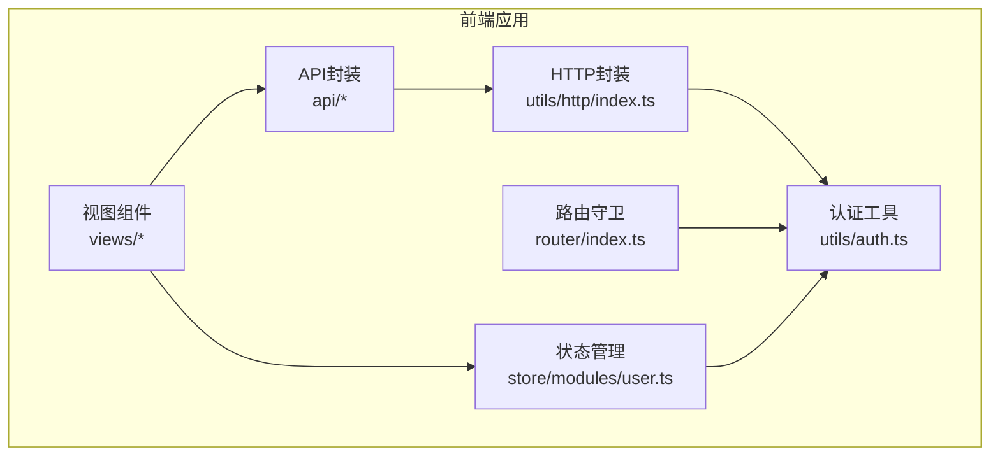
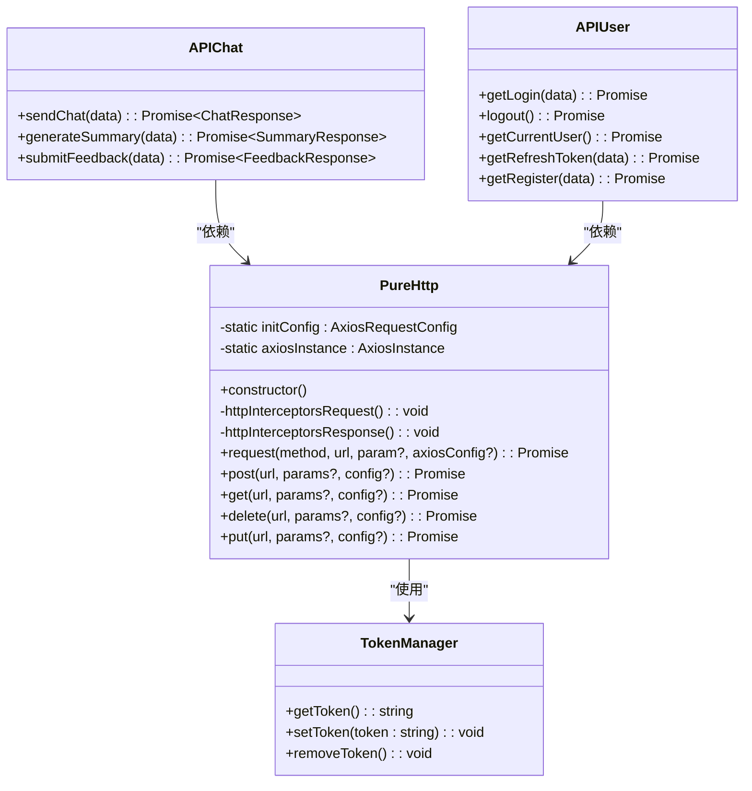
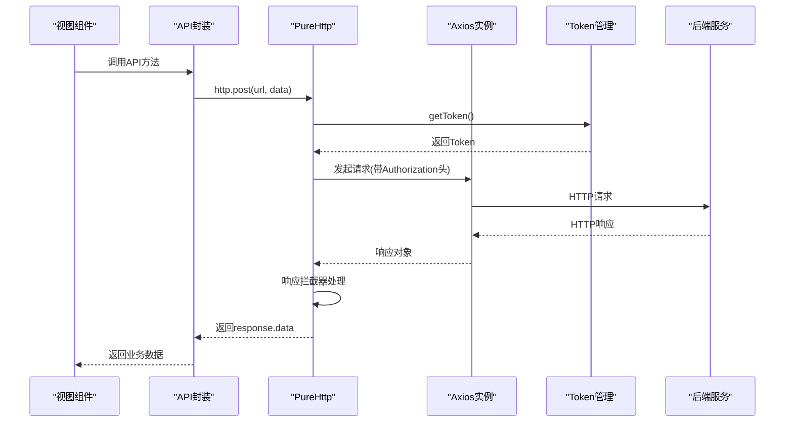
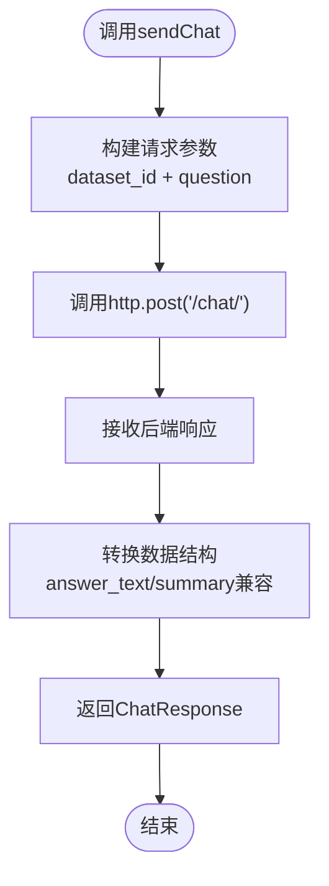
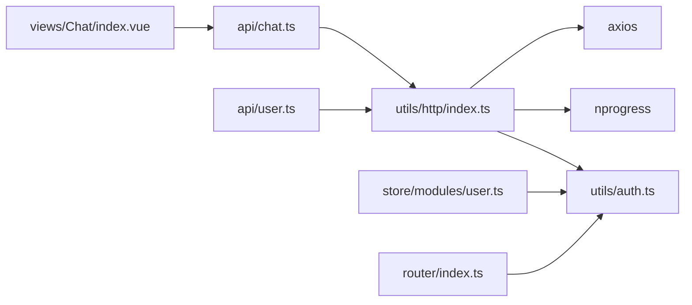

# API通信与HTTP封装

<cite>
**本文档引用的文件**
- [frontend/src/utils/http/index.ts](file://frontend/src/utils/http/index.ts)
- [frontend/src/api/chat.ts](file://frontend/src/api/chat.ts)
- [frontend/src/api/user.ts](file://frontend/src/api/user.ts)
- [frontend/src/utils/auth.ts](file://frontend/src/utils/auth.ts)
- [frontend/src/store/modules/user.ts](file://frontend/src/store/modules/user.ts)
- [frontend/src/views/Chat/index.vue](file://frontend/src/views/Chat/index.vue)
- [frontend/src/router/index.ts](file://frontend/src/router/index.ts)
</cite>

## 目录
1. [简介](#简介)
2. [项目结构](#项目结构)
3. [核心组件](#核心组件)
4. [架构总览](#架构总览)
5. [详细组件分析](#详细组件分析)
6. [依赖关系分析](#依赖关系分析)
7. [性能考虑](#性能考虑)
8. [故障排除指南](#故障排除指南)
9. [结论](#结论)

## 简介
本文件聚焦于前端API通信层的HTTP封装机制，深入解析基于Axios的PureHttp类实现，包括：
- 自定义实例配置项（baseURL、timeout、默认请求头）
- 请求拦截器自动注入JWT Token的流程
- 响应拦截器对成功/错误状态的统一处理逻辑
- 错误捕获策略（如401跳转登录、500提示）
- 加载状态管理（NProgress进度条）
- 实际调用示例（如调用chat API），展示封装如何提升代码复用性与可维护性，并确保前后端接口通信的安全与稳定

## 项目结构
前端采用模块化组织方式，API通信层位于utils/http目录，业务API封装位于api目录，视图组件位于views目录，路由与状态管理分别位于router与store目录。

**图表来源**
- [frontend/src/utils/http/index.ts](file://frontend/src/utils/http/index.ts#L1-L173)
- [frontend/src/api/chat.ts](file://frontend/src/api/chat.ts#L1-L65)
- [frontend/src/api/user.ts](file://frontend/src/api/user.ts#L1-L69)
- [frontend/src/utils/auth.ts](file://frontend/src/utils/auth.ts#L1-L25)
- [frontend/src/store/modules/user.ts](file://frontend/src/store/modules/user.ts#L1-L81)
- [frontend/src/router/index.ts](file://frontend/src/router/index.ts#L1-L116)

**章节来源**
- [frontend/src/utils/http/index.ts](file://frontend/src/utils/http/index.ts#L1-L173)
- [frontend/src/api/chat.ts](file://frontend/src/api/chat.ts#L1-L65)
- [frontend/src/api/user.ts](file://frontend/src/api/user.ts#L1-L69)
- [frontend/src/utils/auth.ts](file://frontend/src/utils/auth.ts#L1-L25)
- [frontend/src/store/modules/user.ts](file://frontend/src/store/modules/user.ts#L1-L81)
- [frontend/src/router/index.ts](file://frontend/src/router/index.ts#L1-L116)

## 核心组件
- PureHttp类：基于Axios的自定义HTTP客户端，提供统一的请求/响应拦截器、错误处理与加载状态管理
- http实例：全局唯一的HTTP客户端实例，供所有API模块使用
- Token管理：通过localStorage存储JWT Token，支持获取、设置、移除
- API封装：针对具体业务的API方法（如聊天、用户认证等）

**章节来源**
- [frontend/src/utils/http/index.ts](file://frontend/src/utils/http/index.ts#L21-L173)
- [frontend/src/utils/auth.ts](file://frontend/src/utils/auth.ts#L1-L25)

## 架构总览
HTTP封装的整体架构围绕PureHttp类展开，通过Axios拦截器实现横切关注点（认证、错误处理、加载状态），并通过统一的API封装提升代码复用性。

**图表来源**
- [frontend/src/utils/http/index.ts](file://frontend/src/utils/http/index.ts#L21-L173)
- [frontend/src/utils/auth.ts](file://frontend/src/utils/auth.ts#L14-L24)
- [frontend/src/api/chat.ts](file://frontend/src/api/chat.ts#L42-L64)
- [frontend/src/api/user.ts](file://frontend/src/api/user.ts#L35-L68)

## 详细组件分析

### HTTP封装机制（PureHttp类）
PureHttp类是整个API通信层的核心，负责：
- 创建Axios实例并设置默认配置（baseURL、timeout、默认请求头）
- 注入请求拦截器：在每次请求前自动读取Token并注入Authorization头
- 注入响应拦截器：统一处理响应数据与错误，关闭加载进度条
- 提供通用请求方法：request、post、get、delete、put

关键特性：
- 默认baseURL为"/api/v1"，统一后端接口前缀
- 超时时间为60秒，适应AI查询等长耗时场景
- 默认Content-Type为application/json，支持XMLHttpRequest标识
- 请求拦截器自动注入Bearer Token，简化业务代码
- 响应拦截器统一返回response.data，减少重复解包
- 响应拦截器内置HTTP状态码错误映射与401自动跳转登录

**图表来源**
- [frontend/src/utils/http/index.ts](file://frontend/src/utils/http/index.ts#L34-L60)
- [frontend/src/utils/auth.ts](file://frontend/src/utils/auth.ts#L14-L16)
- [frontend/src/api/chat.ts](file://frontend/src/api/chat.ts#L42-L56)

**章节来源**
- [frontend/src/utils/http/index.ts](file://frontend/src/utils/http/index.ts#L11-L19)
- [frontend/src/utils/http/index.ts](file://frontend/src/utils/http/index.ts#L34-L60)
- [frontend/src/utils/http/index.ts](file://frontend/src/utils/http/index.ts#L114-L169)

### 请求拦截器（自动注入JWT Token）
请求拦截器在每次HTTP请求前执行：
- 启动NProgress加载进度条
- 从localStorage读取Token
- 若存在Token，则在请求头添加Authorization: Bearer {token}
- 返回修改后的配置

该机制确保所有需要认证的接口自动携带Token，无需在每个API调用中手动处理。

**章节来源**
- [frontend/src/utils/http/index.ts](file://frontend/src/utils/http/index.ts#L34-L49)
- [frontend/src/utils/auth.ts](file://frontend/src/utils/auth.ts#L14-L20)

### 响应拦截器（统一错误处理）
响应拦截器负责：
- 成功响应：关闭NProgress，返回response.data
- 错误响应：关闭NProgress，根据HTTP状态码进行统一处理
  - 401：清理本地Token并跳转到登录页
  - 400/403/404/408/500/501/502/503/504/505：输出对应错误信息
  - 其他：输出"网络连接故障"
- 最终通过Promise.reject(error)向上抛出错误

该设计实现了错误的集中处理，避免在各处重复编写错误判断逻辑。

**章节来源**
- [frontend/src/utils/http/index.ts](file://frontend/src/utils/http/index.ts#L52-L111)

### 加载状态管理（NProgress）
- 在请求拦截器中启动NProgress
- 在响应拦截器中关闭NProgress
- 无论成功或失败都会关闭进度条，确保UI状态一致

**章节来源**
- [frontend/src/utils/http/index.ts](file://frontend/src/utils/http/index.ts#L37-L38)
- [frontend/src/utils/http/index.ts](file://frontend/src/utils/http/index.ts#L56-L57)
- [frontend/src/utils/http/index.ts](file://frontend/src/utils/http/index.ts#L62-L63)

### Token管理机制
- TokenKey常量定义为"authorized-token"
- 提供getToken、setToken、removeToken三个基础方法
- 与路由守卫配合实现登录状态校验
- 与用户状态管理配合实现登录成功后的Token持久化

**章节来源**
- [frontend/src/utils/auth.ts](file://frontend/src/utils/auth.ts#L3-L24)
- [frontend/src/router/index.ts](file://frontend/src/router/index.ts#L74-L87)
- [frontend/src/store/modules/user.ts](file://frontend/src/store/modules/user.ts#L44-L61)

### API封装示例（聊天API）
聊天API封装展示了HTTP封装的优势：
- sendChat方法直接调用http.post，传入dataset_id和question
- 直接返回后端数据结构，保持原始字段不变
- 对answer_text与summary进行兼容性处理
- 通过泛型约束确保类型安全

**图表来源**
- [frontend/src/api/chat.ts](file://frontend/src/api/chat.ts#L42-L56)

**章节来源**
- [frontend/src/api/chat.ts](file://frontend/src/api/chat.ts#L1-L65)

### 用户认证API封装
用户认证API封装体现了HTTP封装的复用性：
- getLogin使用URLSearchParams发送application/x-www-form-urlencoded数据
- logout、getCurrentUser、getRefreshToken、getRegister分别对应不同端点
- 所有方法都通过http.request统一处理，无需关心底层实现细节

**章节来源**
- [frontend/src/api/user.ts](file://frontend/src/api/user.ts#L35-L68)

### 视图组件中的错误处理
聊天视图组件展示了如何结合HTTP封装进行错误处理：
- 发送消息时启动加载动画和进度条
- 捕获API调用异常，区分系统错误与业务澄清
- 对500及以上错误显示系统错误提示
- 对401错误由HTTP层自动处理跳转登录

**章节来源**
- [frontend/src/views/Chat/index.vue](file://frontend/src/views/Chat/index.vue#L558-L637)

## 依赖关系分析
HTTP封装与其他模块的依赖关系如下：

**图表来源**
- [frontend/src/utils/http/index.ts](file://frontend/src/utils/http/index.ts#L1-L9)
- [frontend/src/api/chat.ts](file://frontend/src/api/chat.ts#L1)
- [frontend/src/api/user.ts](file://frontend/src/api/user.ts#L1)
- [frontend/src/views/Chat/index.vue](file://frontend/src/views/Chat/index.vue#L405)
- [frontend/src/store/modules/user.ts](file://frontend/src/store/modules/user.ts#L3)
- [frontend/src/router/index.ts](file://frontend/src/router/index.ts#L3)

**章节来源**
- [frontend/src/utils/http/index.ts](file://frontend/src/utils/http/index.ts#L1-L9)
- [frontend/src/api/chat.ts](file://frontend/src/api/chat.ts#L1)
- [frontend/src/api/user.ts](file://frontend/src/api/user.ts#L1)
- [frontend/src/views/Chat/index.vue](file://frontend/src/views/Chat/index.vue#L405)
- [frontend/src/store/modules/user.ts](file://frontend/src/store/modules/user.ts#L3)
- [frontend/src/router/index.ts](file://frontend/src/router/index.ts#L3)

## 性能考虑
- 超时时间设置为60秒，适合AI查询等长耗时场景
- NProgress提供即时反馈，改善用户体验
- 统一的错误处理减少重复代码，提高开发效率
- Token自动注入避免重复请求头设置，降低出错概率

## 故障排除指南
常见问题与解决方案：
- 401未授权：检查Token是否正确存储和注入；确认后端认证配置
- 404请求地址错误：检查API端点路径是否正确
- 500服务器内部错误：查看后端日志，确认服务状态
- 超时问题：适当调整timeout配置或优化后端性能
- 进度条不消失：确认响应拦截器是否正常执行

**章节来源**
- [frontend/src/utils/http/index.ts](file://frontend/src/utils/http/index.ts#L68-L106)

## 结论
该HTTP封装通过PureHttp类实现了：
- 统一的请求/响应拦截器，确保认证与错误处理的一致性
- 简化的API调用方式，提升代码复用性与可维护性
- 完善的加载状态管理，改善用户体验
- 安全的Token管理机制，保障前后端通信安全

这种设计模式为后续扩展更多API功能提供了良好的基础，同时保持了代码的简洁性和一致性。