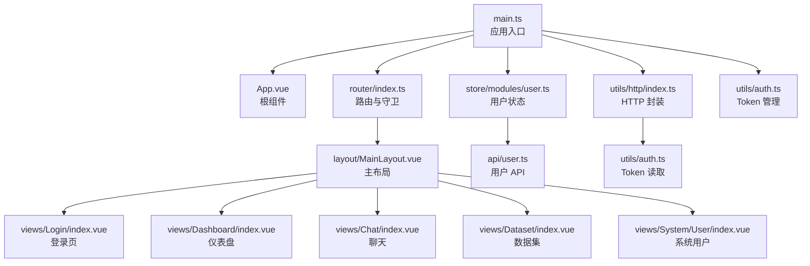
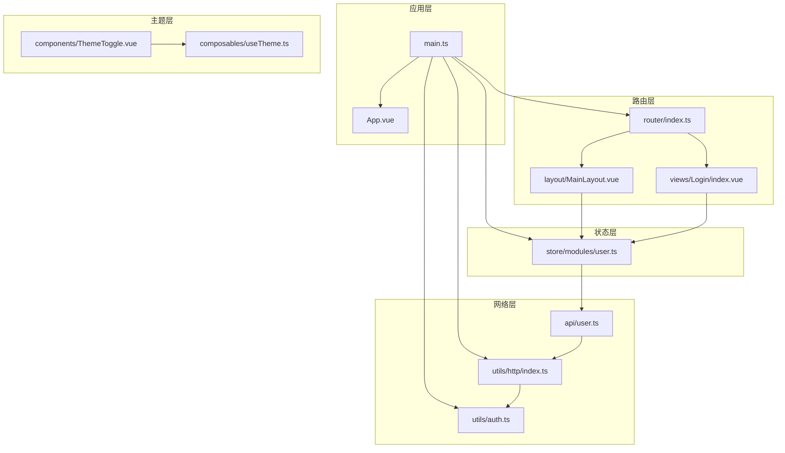
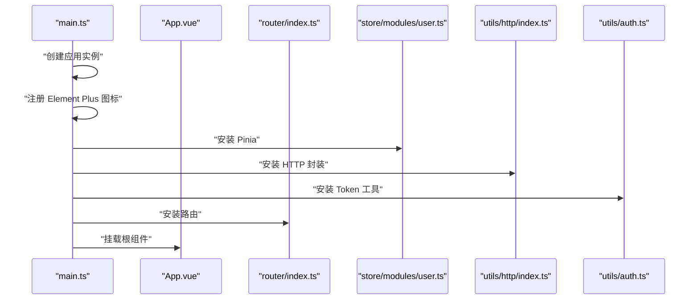
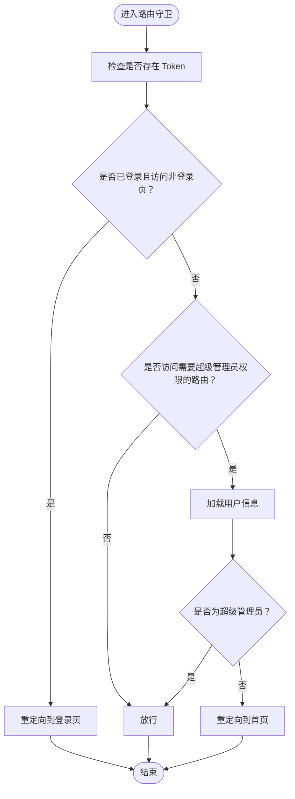
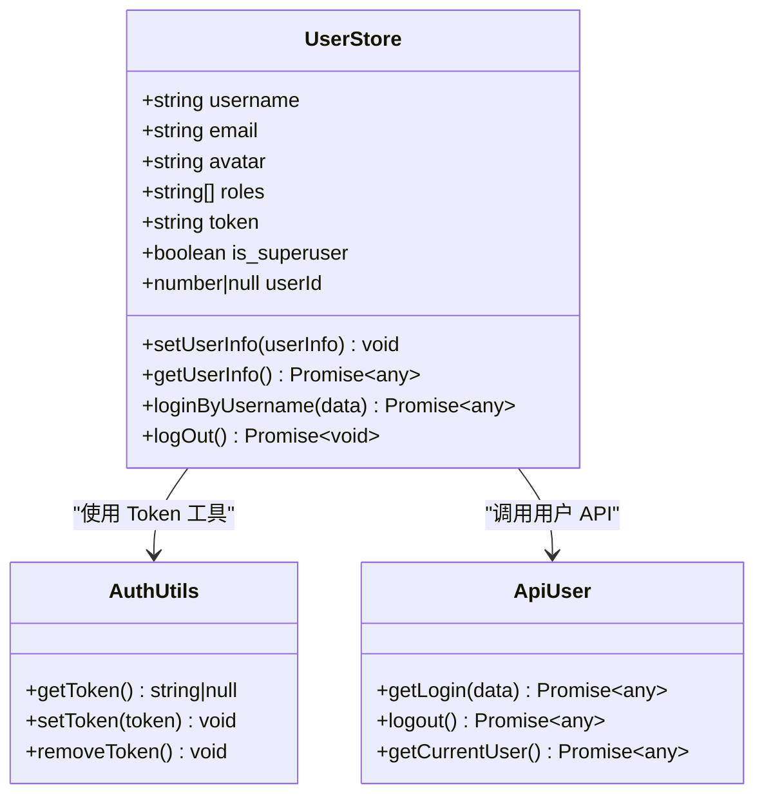
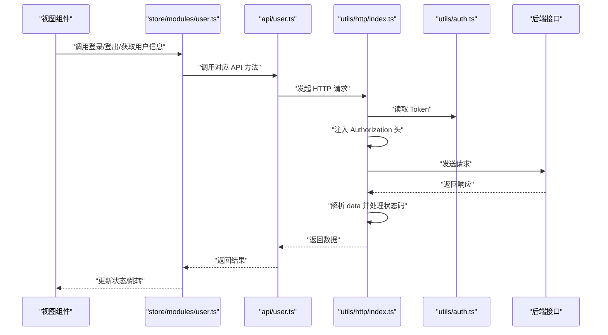
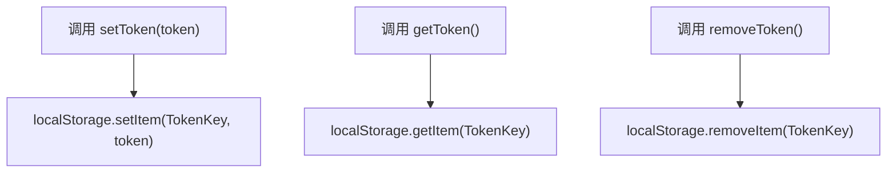
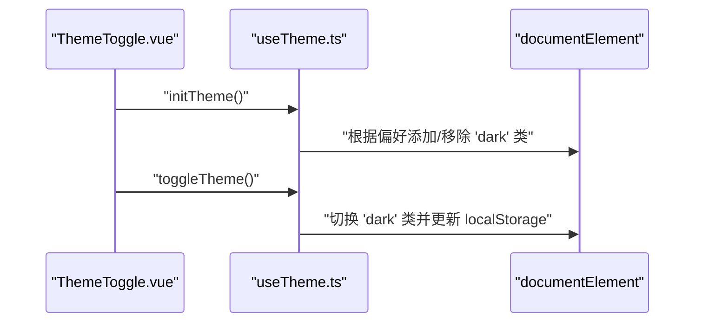
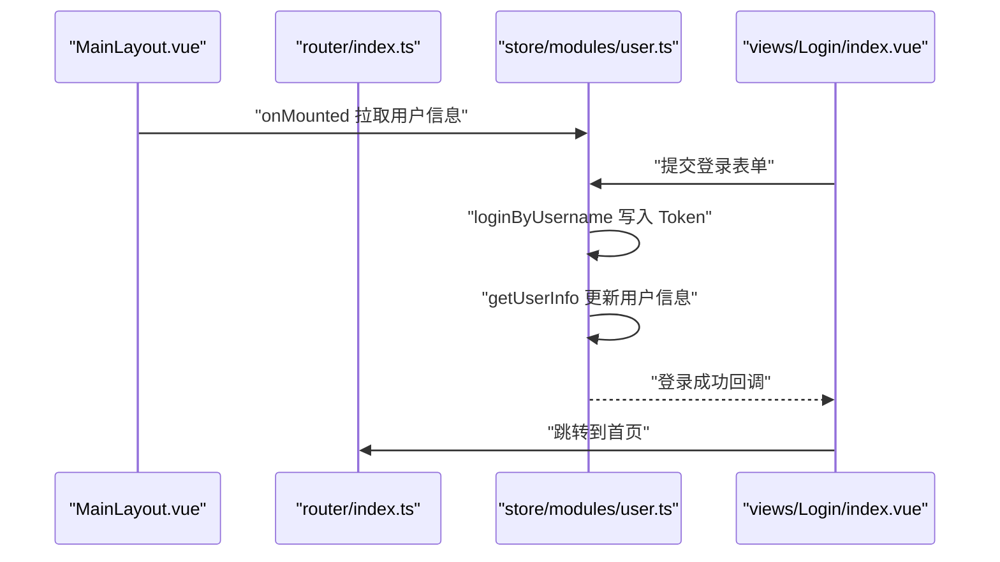
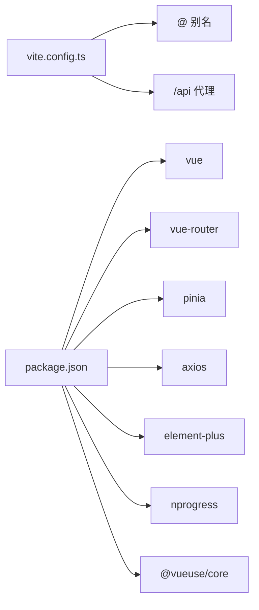

# 前端架构

<cite>
**本文引用的文件列表**
- [main.ts](file://frontend/src/main.ts)
- [App.vue](file://frontend/src/App.vue)
- [router/index.ts](file://frontend/src/router/index.ts)
- [store/modules/user.ts](file://frontend/src/store/modules/user.ts)
- [utils/http/index.ts](file://frontend/src/utils/http/index.ts)
- [utils/auth.ts](file://frontend/src/utils/auth.ts)
- [composables/useTheme.ts](file://frontend/src/composables/useTheme.ts)
- [layout/MainLayout.vue](file://frontend/src/layout/MainLayout.vue)
- [views/Login/index.vue](file://frontend/src/views/Login/index.vue)
- [api/user.ts](file://frontend/src/api/user.ts)
- [components/ThemeToggle.vue](file://frontend/src/components/ThemeToggle.vue)
- [package.json](file://frontend/package.json)
- [vite.config.ts](file://frontend/vite.config.ts)
</cite>

## 目录
1. [引言](#引言)
2. [项目结构](#项目结构)
3. [核心组件](#核心组件)
4. [架构总览](#架构总览)
5. [详细组件分析](#详细组件分析)
6. [依赖关系分析](#依赖关系分析)
7. [性能考量](#性能考量)
8. [故障排查指南](#故障排查指南)
9. [结论](#结论)
10. [附录](#附录)

## 引言
本文件系统性阐述该 Vue 3 应用的整体设计与实现机制，重点覆盖以下方面：
- 应用入口如何挂载根组件并集成 Pinia 状态管理与 Vue Router
- 路由配置中的页面映射、懒加载策略与导航守卫的认证控制
- 用户状态管理模块（Pinia Store）的登录状态持久化与权限判断
- HTTP 封装（Axios 实例）的请求拦截、响应处理与错误统一捕获
- 认证逻辑（Token 存储、刷新与登出）的实现要点
- Composition API 的逻辑复用最佳实践（如主题切换）

## 项目结构
前端采用基于功能域的组织方式，核心目录与职责如下：
- src/main.ts：应用入口，初始化应用实例、插件与挂载
- src/router/index.ts：路由定义与导航守卫
- src/store/modules/user.ts：用户状态管理（Pinia）
- src/utils/http/index.ts：Axios 封装与拦截器
- src/utils/auth.ts：Token 存储与读取
- src/composables/useTheme.ts：主题切换逻辑复用
- src/layout/MainLayout.vue：主布局与头部区域
- src/views/Login/index.vue：登录视图
- src/api/user.ts：用户相关 API 封装
- 其他：组件、图表、工具等按功能分层放置

**图表来源**
- [main.ts](file://frontend/src/main.ts#L1-L26)
- [router/index.ts](file://frontend/src/router/index.ts#L1-L116)
- [store/modules/user.ts](file://frontend/src/store/modules/user.ts#L1-L81)
- [utils/http/index.ts](file://frontend/src/utils/http/index.ts#L1-L173)
- [utils/auth.ts](file://frontend/src/utils/auth.ts#L1-L25)
- [layout/MainLayout.vue](file://frontend/src/layout/MainLayout.vue#L1-L155)
- [views/Login/index.vue](file://frontend/src/views/Login/index.vue#L1-L143)
- [api/user.ts](file://frontend/src/api/user.ts#L1-L69)

**章节来源**
- [main.ts](file://frontend/src/main.ts#L1-L26)
- [package.json](file://frontend/package.json#L1-L40)

## 核心组件
- 应用入口与插件集成：在入口文件中创建应用实例，注册 Element Plus 图标组件，安装 Pinia、Element Plus、Vue Router，并强制启用深色模式，最后挂载根组件。
- 路由与导航守卫：定义多级路由与懒加载页面映射；通过 beforeEach 守卫进行未登录跳转、已登录访问登录页重定向、以及超级管理员权限校验。
- 用户状态管理：使用 Pinia 定义用户 Store，包含用户信息、角色、Token 等状态，提供登录、登出、获取用户信息等动作，并与 Token 存储交互。
- HTTP 封装：基于 Axios 创建实例，统一设置基础路径、超时、请求头；在请求拦截中注入 Authorization 头，在响应拦截中统一处理状态码与错误提示。
- 认证工具：提供 Token 的读取、设置、移除方法，作为 HTTP 封装与 Store 的桥梁。
- 主题切换 Composable：封装主题初始化与切换逻辑，支持系统偏好与本地存储同步。
- 主布局与登录页：主布局负责面包屑、头部工具栏与路由视图渲染；登录页负责表单校验、登录流程与消息提示。

**章节来源**
- [main.ts](file://frontend/src/main.ts#L1-L26)
- [router/index.ts](file://frontend/src/router/index.ts#L1-L116)
- [store/modules/user.ts](file://frontend/src/store/modules/user.ts#L1-L81)
- [utils/http/index.ts](file://frontend/src/utils/http/index.ts#L1-L173)
- [utils/auth.ts](file://frontend/src/utils/auth.ts#L1-L25)
- [composables/useTheme.ts](file://frontend/src/composables/useTheme.ts#L1-L40)
- [layout/MainLayout.vue](file://frontend/src/layout/MainLayout.vue#L1-L155)
- [views/Login/index.vue](file://frontend/src/views/Login/index.vue#L1-L143)

## 架构总览
下图展示了从入口到各子系统的交互关系，包括路由守卫、状态管理、HTTP 封装与认证工具之间的协作。

**图表来源**
- [main.ts](file://frontend/src/main.ts#L1-L26)
- [router/index.ts](file://frontend/src/router/index.ts#L1-L116)
- [store/modules/user.ts](file://frontend/src/store/modules/user.ts#L1-L81)
- [utils/http/index.ts](file://frontend/src/utils/http/index.ts#L1-L173)
- [utils/auth.ts](file://frontend/src/utils/auth.ts#L1-L25)
- [layout/MainLayout.vue](file://frontend/src/layout/MainLayout.vue#L1-L155)
- [views/Login/index.vue](file://frontend/src/views/Login/index.vue#L1-L143)
- [api/user.ts](file://frontend/src/api/user.ts#L1-L69)
- [components/ThemeToggle.vue](file://frontend/src/components/ThemeToggle.vue#L1-L19)
- [composables/useTheme.ts](file://frontend/src/composables/useTheme.ts#L1-L40)

## 详细组件分析

### 应用入口与插件集成（main.ts）
- 创建应用实例并注册 Element Plus 图标组件，确保全局可用
- 安装 Pinia、Element Plus、Vue Router
- 强制启用深色模式（向根元素添加 dark 类）
- 挂载根组件

**图表来源**
- [main.ts](file://frontend/src/main.ts#L1-L26)

**章节来源**
- [main.ts](file://frontend/src/main.ts#L1-L26)

### 路由配置与导航守卫（router/index.ts）
- 页面映射：登录页、主布局下的多个子路由（数据连接、数据集、可视化建模、聊天、仪表盘、系统用户）
- 懒加载策略：使用动态导入实现按需加载，减少首屏体积
- 导航守卫：
  - 未登录访问非登录页：重定向至登录页
  - 已登录访问登录页：重定向至首页
  - 超级管理员权限校验：若目标路由标记 requireSuperuser，则在进入前拉取用户信息并检查 is_superuser

**图表来源**
- [router/index.ts](file://frontend/src/router/index.ts#L74-L113)

**章节来源**
- [router/index.ts](file://frontend/src/router/index.ts#L1-L116)

### 用户状态管理（store/modules/user.ts）
- 状态字段：用户名、邮箱、头像、角色、Token、是否超级管理员、用户 ID
- 动作：
  - setUserInfo：根据后端返回更新用户信息与角色
  - getUserInfo：调用后端获取当前用户信息
  - loginByUsername：发起登录请求，成功后写入 Token 并设置角色
  - logOut：调用后端登出接口，清理本地状态与 Token

**图表来源**
- [store/modules/user.ts](file://frontend/src/store/modules/user.ts#L6-L81)
- [utils/auth.ts](file://frontend/src/utils/auth.ts#L1-L25)
- [api/user.ts](file://frontend/src/api/user.ts#L35-L68)

**章节来源**
- [store/modules/user.ts](file://frontend/src/store/modules/user.ts#L1-L81)
- [api/user.ts](file://frontend/src/api/user.ts#L1-L69)

### HTTP 封装与拦截器（utils/http/index.ts）
- 默认配置：baseURL、timeout、Content-Type
- 请求拦截：开启进度条，从 localStorage 读取 Token 并注入 Authorization 头
- 响应拦截：关闭进度条，根据 HTTP 状态码统一提示；401 时移除 Token 并跳转登录页
- 通用请求方法：get/post/delete/put 包装，统一返回 data 字段

**图表来源**
- [utils/http/index.ts](file://frontend/src/utils/http/index.ts#L34-L111)
- [utils/auth.ts](file://frontend/src/utils/auth.ts#L14-L24)
- [api/user.ts](file://frontend/src/api/user.ts#L35-L68)

**章节来源**
- [utils/http/index.ts](file://frontend/src/utils/http/index.ts#L1-L173)
- [api/user.ts](file://frontend/src/api/user.ts#L1-L69)

### 认证逻辑（utils/auth.ts）
- TokenKey：统一的本地存储键名
- 提供 getToken/setToken/removeToken 三个基础方法，供 HTTP 封装与 Store 使用

**图表来源**
- [utils/auth.ts](file://frontend/src/utils/auth.ts#L14-L24)

**章节来源**
- [utils/auth.ts](file://frontend/src/utils/auth.ts#L1-L25)

### 主题切换与复用（composables/useTheme.ts 与 components/ThemeToggle.vue）
- useTheme：初始化主题（优先本地存储，其次系统偏好），提供切换函数并同步到 DOM 与本地存储
- ThemeToggle：按钮组件，绑定 useTheme 返回的状态与切换函数

**图表来源**
- [composables/useTheme.ts](file://frontend/src/composables/useTheme.ts#L6-L29)
- [components/ThemeToggle.vue](file://frontend/src/components/ThemeToggle.vue#L13-L18)

**章节来源**
- [composables/useTheme.ts](file://frontend/src/composables/useTheme.ts#L1-L40)
- [components/ThemeToggle.vue](file://frontend/src/components/ThemeToggle.vue#L1-L19)

### 主布局与登录页（layout/MainLayout.vue 与 views/Login/index.vue）
- MainLayout：包含侧边栏、头部工具栏、面包屑、路由视图容器与过渡动画；在挂载时尝试拉取用户信息
- Login：表单校验、登录流程、消息提示与注册页切换

**图表来源**
- [layout/MainLayout.vue](file://frontend/src/layout/MainLayout.vue#L68-L76)
- [views/Login/index.vue](file://frontend/src/views/Login/index.vue#L29-L57)
- [store/modules/user.ts](file://frontend/src/store/modules/user.ts#L43-L62)

**章节来源**
- [layout/MainLayout.vue](file://frontend/src/layout/MainLayout.vue#L1-L155)
- [views/Login/index.vue](file://frontend/src/views/Login/index.vue#L1-L143)

## 依赖关系分析
- 构建与运行：Vite 配置了别名、代理与开发服务器端口
- 依赖清单：Vue 3、Vue Router、Pinia、Element Plus、Axios、NProgress、@vueuse/core、ECharts 等

**图表来源**
- [vite.config.ts](file://frontend/vite.config.ts#L1-L27)
- [package.json](file://frontend/package.json#L11-L28)

**章节来源**
- [vite.config.ts](file://frontend/vite.config.ts#L1-L27)
- [package.json](file://frontend/package.json#L1-L40)

## 性能考量
- 路由懒加载：通过动态导入减少首屏资源加载量
- 请求拦截与进度条：统一注入 Token 与显示加载状态，提升用户体验
- 组件过渡动画：轻量的 fade 过渡，避免复杂动画影响性能
- 本地存储：Token 与主题偏好使用 localStorage，避免频繁网络请求

[本节为通用建议，不直接分析具体文件]

## 故障排查指南
- 登录后无法访问受保护页面
  - 检查路由守卫是否正确读取 Token 与权限
  - 确认用户信息是否成功拉取并写入 Store
- 401 未授权
  - 检查请求拦截器是否正确注入 Authorization 头
  - 确认响应拦截器是否移除了失效 Token 并跳转登录页
- 主题切换无效
  - 检查 useTheme 是否在 onMounted 时初始化
  - 确认 documentElement 上的 dark 类是否正确切换

**章节来源**
- [router/index.ts](file://frontend/src/router/index.ts#L74-L113)
- [utils/http/index.ts](file://frontend/src/utils/http/index.ts#L34-L111)
- [composables/useTheme.ts](file://frontend/src/composables/useTheme.ts#L6-L29)

## 结论
该 Vue 3 应用遵循清晰的分层架构：入口负责初始化与插件集成，路由负责页面映射与导航守卫，状态管理负责用户信息与权限，HTTP 封装负责网络请求与错误处理，认证工具负责 Token 生命周期管理，主题 Composable 提供可复用的 UI 行为。整体设计具备良好的扩展性与可维护性，适合在中大型前端项目中推广。

[本节为总结性内容，不直接分析具体文件]

## 附录
- 开发与构建：Vite 别名与代理配置便于前后端联调
- 依赖版本：通过 package.json 管理核心依赖，保证生态一致性

**章节来源**
- [vite.config.ts](file://frontend/vite.config.ts#L1-L27)
- [package.json](file://frontend/package.json#L1-L40)