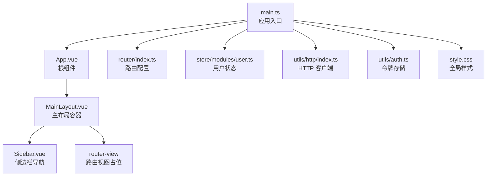
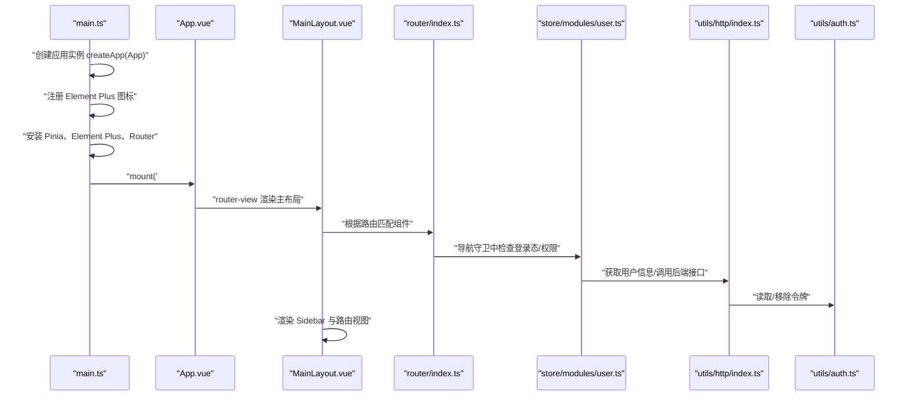
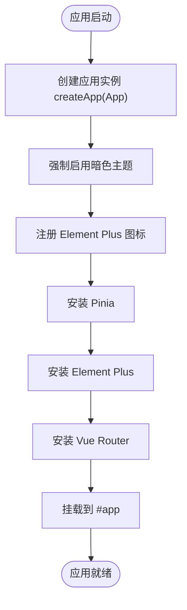
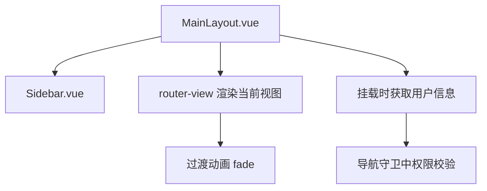
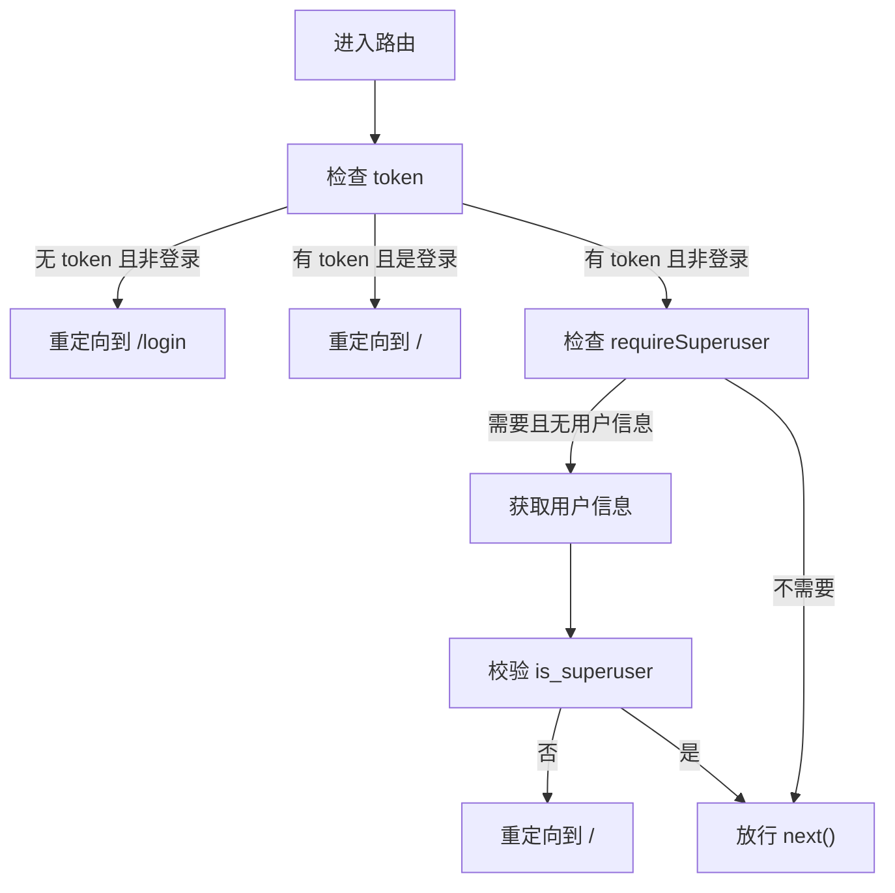
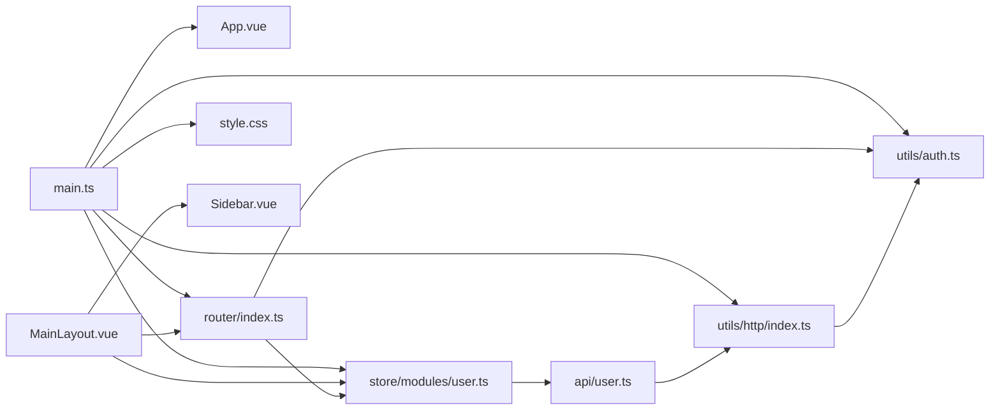

# 应用入口与初始化

<cite>
**本文引用的文件列表**
- [main.ts](file://frontend/src/main.ts)
- [App.vue](file://frontend/src/App.vue)
- [MainLayout.vue](file://frontend/src/layout/MainLayout.vue)
- [Sidebar.vue](file://frontend/src/components/Sidebar.vue)
- [index.ts](file://frontend/src/router/index.ts)
- [user.ts](file://frontend/src/store/modules/user.ts)
- [auth.ts](file://frontend/src/utils/auth.ts)
- [http/index.ts](file://frontend/src/utils/http/index.ts)
- [user.ts](file://frontend/src/api/user.ts)
- [style.css](file://frontend/src/style.css)
- [package.json](file://frontend/package.json)
</cite>

## 目录
1. [简介](#简介)
2. [项目结构](#项目结构)
3. [核心组件](#核心组件)
4. [架构总览](#架构总览)
5. [详细组件分析](#详细组件分析)
6. [依赖关系分析](#依赖关系分析)
7. [性能考量](#性能考量)
8. [故障排查指南](#故障排查指南)
9. [结论](#结论)
10. [附录](#附录)

## 简介
本文件围绕前端应用入口机制展开，重点解析 main.ts 中的应用初始化流程，说明如何通过 createApp 挂载根组件 App.vue，并集成 Vue Router、Pinia 状态管理器、全局样式与插件；同时梳理应用启动时的依赖注入过程（API 客户端、认证模块），并阐述 App.vue 作为根布局容器如何协调 MainLayout、Sidebar 与路由视图的渲染。最后给出错误处理与全局属性的最佳实践建议，强调入口层在整体架构中的核心地位。

## 项目结构
前端采用基于 Vue 3 的单页应用结构，入口位于 frontend/src/main.ts，根组件为 App.vue，页面布局由 MainLayout.vue 提供，侧边栏 Sidebar.vue 作为导航容器，路由与鉴权逻辑集中在 router/index.ts 与 store/modules/user.ts 中，HTTP 通信封装于 utils/http/index.ts，认证令牌存储于 utils/auth.ts，全局样式由 style.css 提供。

图表来源
- [main.ts](file://frontend/src/main.ts#L1-L26)
- [App.vue](file://frontend/src/App.vue#L1-L16)
- [MainLayout.vue](file://frontend/src/layout/MainLayout.vue#L1-L155)
- [Sidebar.vue](file://frontend/src/components/Sidebar.vue#L1-L110)
- [index.ts](file://frontend/src/router/index.ts#L1-L116)
- [user.ts](file://frontend/src/store/modules/user.ts#L1-L81)
- [http/index.ts](file://frontend/src/utils/http/index.ts#L1-L173)
- [auth.ts](file://frontend/src/utils/auth.ts#L1-L25)
- [style.css](file://frontend/src/style.css#L1-L166)

章节来源
- [main.ts](file://frontend/src/main.ts#L1-L26)
- [package.json](file://frontend/package.json#L1-L40)

## 核心组件
- 应用入口 main.ts：负责创建 Vue 应用实例、注册 Element Plus 图标、安装 Pinia、Element Plus、Vue Router 插件，并强制启用暗色主题，最终挂载根组件。
- 根组件 App.vue：提供最外层模板与全局样式，当前版本仅包含一个 router-view，作为路由视图的根容器。
- 主布局 MainLayout.vue：提供侧边栏、头部工具栏、页面内容区与过渡动画，内部通过 router-view 渲染当前路由对应的视图。
- 侧边栏 Sidebar.vue：根据用户权限动态生成导航菜单，提供主题切换与登出功能。
- 路由 router/index.ts：定义路由表与导航守卫，处理登录态校验与超级管理员权限控制。
- 状态管理 store/modules/user.ts：封装用户信息、登录/登出、获取当前用户等逻辑。
- HTTP 客户端 utils/http/index.ts：基于 Axios 封装统一请求与响应拦截，内置进度条与错误处理。
- 认证工具 utils/auth.ts：提供令牌的读取、设置与移除。
- 全局样式 style.css：提供 Tailwind、暗色主题变量与 Element Plus 的覆盖样式。

章节来源
- [main.ts](file://frontend/src/main.ts#L1-L26)
- [App.vue](file://frontend/src/App.vue#L1-L16)
- [MainLayout.vue](file://frontend/src/layout/MainLayout.vue#L1-L155)
- [Sidebar.vue](file://frontend/src/components/Sidebar.vue#L1-L110)
- [index.ts](file://frontend/src/router/index.ts#L1-L116)
- [user.ts](file://frontend/src/store/modules/user.ts#L1-L81)
- [http/index.ts](file://frontend/src/utils/http/index.ts#L1-L173)
- [auth.ts](file://frontend/src/utils/auth.ts#L1-L25)
- [style.css](file://frontend/src/style.css#L1-L166)

## 架构总览
下图展示了从应用启动到路由渲染的关键交互路径，体现入口层如何完成依赖注入与插件安装，并驱动后续的布局与视图渲染。

图表来源
- [main.ts](file://frontend/src/main.ts#L14-L25)
- [App.vue](file://frontend/src/App.vue#L1-L16)
- [MainLayout.vue](file://frontend/src/layout/MainLayout.vue#L44-L50)
- [index.ts](file://frontend/src/router/index.ts#L74-L113)
- [user.ts](file://frontend/src/store/modules/user.ts#L32-L41)
- [http/index.ts](file://frontend/src/utils/http/index.ts#L34-L111)
- [auth.ts](file://frontend/src/utils/auth.ts#L14-L24)

## 详细组件分析

### 应用入口 main.ts 初始化流程
- 创建应用实例：使用 createApp(App) 将根组件 App.vue 作为应用的根节点。
- 强制暗色主题：向 document.documentElement 添加 dark 类，确保全局暗色样式生效。
- 注册 Element Plus 图标：遍历 ElementPlusIconsVue 并通过 app.component 注册为全局组件，便于在任意组件中直接使用。
- 安装插件：
  - createPinia()：启用 Pinia 状态管理。
  - ElementPlus：启用 Element Plus UI 组件库及其暗色主题样式。
  - router：启用 Vue Router 路由能力。
- 挂载应用：将根实例挂载到 DOM 节点 #app。

图表来源
- [main.ts](file://frontend/src/main.ts#L11-L25)

章节来源
- [main.ts](file://frontend/src/main.ts#L1-L26)

### 根组件 App.vue 的作用与职责
- 角色定位：作为最外层容器，当前版本仅包含一个 router-view，承担“路由视图占位”的职责。
- 全局样式：在 style 区域声明基础选择器（html、body、#app）的高度与间距，保证布局一致性。
- 与布局协作：App.vue 将控制权交给 MainLayout.vue，后者负责侧边栏、头部与内容区的组织。

章节来源
- [App.vue](file://frontend/src/App.vue#L1-L16)

### 主布局 MainLayout.vue 的协调机制
- 结构组成：侧边栏、头部工具栏、页面内容区与过渡动画。
- 路由视图渲染：通过 router-view 与 v-slot 接收当前组件，配合淡入淡出过渡提升体验。
- 用户信息加载：在组件挂载时，若存在 token 且尚未获取用户信息，则尝试拉取用户详情。
- 导航标签解析：根据当前路由路径计算活动视图并显示对应标签。

图表来源
- [MainLayout.vue](file://frontend/src/layout/MainLayout.vue#L44-L76)

章节来源
- [MainLayout.vue](file://frontend/src/layout/MainLayout.vue#L1-L155)

### 侧边栏 Sidebar.vue 的动态导航
- 动态菜单：根据用户是否为超级管理员动态拼接基础导航与管理导航。
- 登出流程：调用用户状态模块的登出方法，提示消息并跳转至登录页。

章节来源
- [Sidebar.vue](file://frontend/src/components/Sidebar.vue#L1-L110)

### 路由与导航守卫 router/index.ts
- 路由表：定义登录页与主布局下的多级子路由，支持按需异步加载视图组件。
- 导航守卫：
  - 未登录访问非登录页：重定向至登录页。
  - 已登录访问登录页：重定向至首页。
  - 超级管理员权限：若目标路由要求超级管理员，先拉取用户信息并校验权限，否则回退至首页。
- 权限控制：通过 useUserStore 与路由 meta 字段协同实现细粒度权限控制。

图表来源
- [index.ts](file://frontend/src/router/index.ts#L74-L113)

章节来源
- [index.ts](file://frontend/src/router/index.ts#L1-L116)

### 状态管理与认证 user.ts
- 状态字段：用户名、邮箱、头像、角色、令牌、是否超级管理员、用户 ID。
- 行为方法：
  - setUserInfo：根据后端返回更新用户信息与角色。
  - getUserInfo：调用后端接口获取当前用户信息。
  - loginByUsername：发起登录请求，成功后写入令牌并设置角色。
  - logOut：调用后端登出接口，清理本地状态与令牌。
- 与路由守卫联动：在导航守卫中通过 useUserStore 获取用户信息并进行权限判断。

章节来源
- [user.ts](file://frontend/src/store/modules/user.ts#L1-L81)

### HTTP 客户端与认证工具
- HTTP 客户端：
  - 默认配置：baseURL、超时、请求头。
  - 请求拦截：开启进度条、注入 Authorization 头。
  - 响应拦截：关闭进度条、根据状态码统一提示并处理 401 自动跳转登录。
  - 通用请求方法：get/post/put/delete。
- 认证工具：
  - 令牌键值常量与读取/设置/移除方法，统一管理 localStorage 中的令牌。

章节来源
- [http/index.ts](file://frontend/src/utils/http/index.ts#L1-L173)
- [auth.ts](file://frontend/src/utils/auth.ts#L1-L25)

### API 层 user.ts
- 登录、刷新令牌、注册、登出、获取当前用户等接口均通过 http.request 调用，遵循统一的响应数据结构约定。

章节来源
- [user.ts](file://frontend/src/api/user.ts#L1-L69)

### 全局样式与主题
- Tailwind 基础层与组件层覆盖，提供按钮、输入框、选择器等元素的暗色主题样式。
- 强制暗色模式：通过 html.dark 与 Element Plus 变量覆盖，确保第三方组件一致的暗色体验。
- 滚动条定制：针对深浅色模式分别设置滚动条颜色与悬停效果。

章节来源
- [style.css](file://frontend/src/style.css#L1-L166)

## 依赖关系分析
- 入口层依赖：main.ts 依赖 App.vue、router/index.ts、store/modules/user.ts、utils/http/index.ts、utils/auth.ts、style.css。
- 布局层依赖：MainLayout.vue 依赖 Sidebar.vue、router/index.ts、store/modules/user.ts。
- 路由层依赖：router/index.ts 依赖 utils/auth.ts、store/modules/user.ts。
- 状态层依赖：store/modules/user.ts 依赖 api/user.ts、utils/auth.ts、Element Plus 消息提示。
- HTTP 层依赖：utils/http/index.ts 依赖 axios、nprogress、utils/auth.ts。
- 认证层依赖：utils/auth.ts 依赖 @vueuse/core 的 useStorage（封装 localStorage）。

图表来源
- [main.ts](file://frontend/src/main.ts#L1-L26)
- [App.vue](file://frontend/src/App.vue#L1-L16)
- [MainLayout.vue](file://frontend/src/layout/MainLayout.vue#L1-L155)
- [Sidebar.vue](file://frontend/src/components/Sidebar.vue#L1-L110)
- [index.ts](file://frontend/src/router/index.ts#L1-L116)
- [user.ts](file://frontend/src/store/modules/user.ts#L1-L81)
- [http/index.ts](file://frontend/src/utils/http/index.ts#L1-L173)
- [auth.ts](file://frontend/src/utils/auth.ts#L1-L25)
- [user.ts](file://frontend/src/api/user.ts#L1-L69)
- [style.css](file://frontend/src/style.css#L1-L166)

章节来源
- [package.json](file://frontend/package.json#L11-L27)

## 性能考量
- 路由懒加载：路由组件通过动态导入实现按需加载，减少首屏体积与初次渲染压力。
- 进度条：HTTP 请求拦截中开启/关闭进度条，改善用户感知与等待体验。
- 暗色主题：通过全局类与 CSS 变量实现，避免重复计算与频繁重排。
- 组件复用：Element Plus 图标统一注册，减少重复引入与打包体积。

## 故障排查指南
- 登录态异常
  - 现象：访问受保护路由被重定向至登录页。
  - 排查：确认 localStorage 中是否存在令牌；检查 401 响应拦截是否触发自动跳转。
  - 参考
    - [index.ts](file://frontend/src/router/index.ts#L78-L81)
    - [http/index.ts](file://frontend/src/utils/http/index.ts#L72-L76)
    - [auth.ts](file://frontend/src/utils/auth.ts#L14-L24)
- 权限不足
  - 现象：访问需要超级管理员的路由被重定向。
  - 排查：确认用户是否已获取用户信息；检查 is_superuser 字段与路由 meta.requireSuperuser。
  - 参考
    - [index.ts](file://frontend/src/router/index.ts#L89-L110)
    - [user.ts](file://frontend/src/store/modules/user.ts#L32-L41)
- 登出后状态未清理
  - 现象：登出后仍显示用户信息或可访问受保护路由。
  - 排查：确认 logOut 是否调用了后端接口并清理了本地状态与令牌。
  - 参考
    - [user.ts](file://frontend/src/store/modules/user.ts#L64-L78)
    - [http/index.ts](file://frontend/src/utils/http/index.ts#L61-L111)
- 暗色主题不生效
  - 现象：页面未呈现暗色样式。
  - 排查：确认入口已添加 dark 类；检查 style.css 中的 html.dark 样式与 Element Plus 变量覆盖。
  - 参考
    - [main.ts](file://frontend/src/main.ts#L11-L12)
    - [style.css](file://frontend/src/style.css#L85-L108)

章节来源
- [index.ts](file://frontend/src/router/index.ts#L74-L113)
- [user.ts](file://frontend/src/store/modules/user.ts#L64-L78)
- [http/index.ts](file://frontend/src/utils/http/index.ts#L61-L111)
- [auth.ts](file://frontend/src/utils/auth.ts#L14-L24)
- [style.css](file://frontend/src/style.css#L85-L108)

## 结论
main.ts 作为前端应用的入口，承担着应用初始化、插件安装与依赖注入的关键职责。它通过 createApp 挂载根组件 App.vue，并将 Vue Router、Pinia、Element Plus 等核心能力无缝集成。App.vue 作为根布局容器，协调 MainLayout、Sidebar 与路由视图的渲染；路由守卫与状态管理共同保障登录态与权限控制；HTTP 客户端与认证工具提供统一的网络与令牌管理。整体架构清晰、职责分明，入口层在系统中具有核心地位，直接影响用户体验与系统稳定性。

## 附录
- 最佳实践建议
  - 错误处理：在导航守卫与状态管理中统一捕获错误并提示，避免未处理异常导致页面白屏。
  - 全局属性：通过 app.config.globalProperties 或 provide/inject 注入只读配置，避免在组件内重复读取环境变量。
  - 依赖注入：将 API 客户端、认证模块、日志模块等通过插件方式集中注入，便于测试与替换。
  - 主题与样式：保持全局样式与暗色主题变量的一致性，避免第三方组件样式冲突。
  - 性能优化：继续推进路由与组件的动态导入，合理拆分包体，结合浏览器缓存策略提升二次加载速度。