# 状态管理与用户模块

<cite>
**本文档引用的文件**
- [frontend/src/store/modules/user.ts](file://frontend/src/store/modules/user.ts)
- [frontend/src/main.ts](file://frontend/src/main.ts)
- [frontend/src/utils/auth.ts](file://frontend/src/utils/auth.ts)
- [frontend/src/api/user.ts](file://frontend/src/api/user.ts)
- [frontend/src/views/Login/index.vue](file://frontend/src/views/Login/index.vue)
- [frontend/src/layout/MainLayout.vue](file://frontend/src/layout/MainLayout.vue)
- [frontend/src/router/index.ts](file://frontend/src/router/index.ts)
- [frontend/src/components/Sidebar.vue](file://frontend/src/components/Sidebar.vue)
- [frontend/src/utils/http/index.ts](file://frontend/src/utils/http/index.ts)
</cite>

## 目录
1. [简介](#简介)
2. [项目结构](#项目结构)
3. [核心组件](#核心组件)
4. [架构概览](#架构概览)
5. [详细组件分析](#详细组件分析)
6. [依赖关系分析](#依赖关系分析)
7. [性能考虑](#性能考虑)
8. [故障排除指南](#故障排除指南)
9. [结论](#结论)

## 简介

本项目采用Pinia作为状态管理库，实现了完整的用户状态管理系统。本文档深入分析了user.ts模块中用户状态的定义与操作，包括state、getters、actions的实现方式，详细说明了登录状态、用户信息、权限角色的存储与更新逻辑。同时解释了状态持久化机制（localStorage同步）与多组件间状态共享的实现路径，并结合登录流程说明状态变更如何驱动UI响应，以及其与认证模块、API调用之间的协作关系。

## 项目结构

项目采用前后端分离架构，前端使用Vue 3 + Pinia + Element Plus技术栈。状态管理相关的核心文件组织如下：

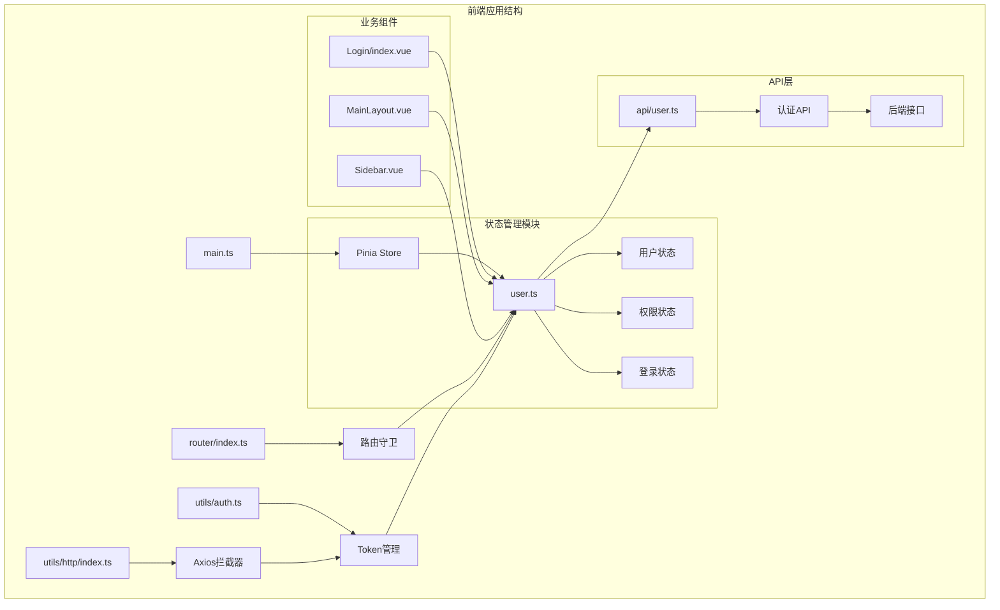

**图表来源**
- [frontend/src/main.ts](file://frontend/src/main.ts#L1-L26)
- [frontend/src/store/modules/user.ts](file://frontend/src/store/modules/user.ts#L1-L81)
- [frontend/src/router/index.ts](file://frontend/src/router/index.ts#L1-L116)

**章节来源**
- [frontend/src/main.ts](file://frontend/src/main.ts#L1-L26)
- [frontend/src/store/modules/user.ts](file://frontend/src/store/modules/user.ts#L1-L81)

## 核心组件

### Pinia Store初始化

应用在入口文件中初始化Pinia并全局注册：

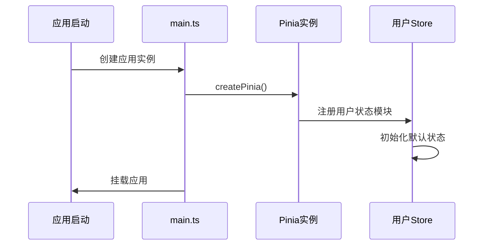

**图表来源**
- [frontend/src/main.ts](file://frontend/src/main.ts#L21-L21)
- [frontend/src/store/modules/user.ts](file://frontend/src/store/modules/user.ts#L6-L15)

### 用户状态模块设计

用户状态模块采用模块化设计，包含完整的状态管理功能：

**章节来源**
- [frontend/src/store/modules/user.ts](file://frontend/src/store/modules/user.ts#L1-L81)

## 架构概览

系统采用分层架构，各层职责明确：

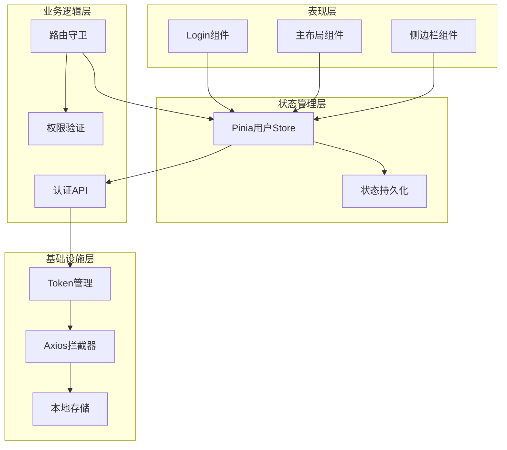

**图表来源**
- [frontend/src/views/Login/index.vue](file://frontend/src/views/Login/index.vue#L10-L10)
- [frontend/src/layout/MainLayout.vue](file://frontend/src/layout/MainLayout.vue#L65-L65)
- [frontend/src/components/Sidebar.vue](file://frontend/src/components/Sidebar.vue#L72-L72)
- [frontend/src/store/modules/user.ts](file://frontend/src/store/modules/user.ts#L1-L81)

## 详细组件分析

### 用户状态模块 (user.ts)

#### 状态定义

用户状态模块定义了完整的用户信息状态：

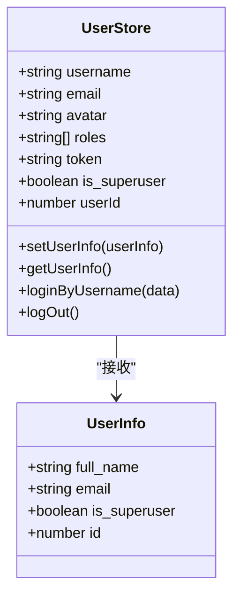

**图表来源**
- [frontend/src/store/modules/user.ts](file://frontend/src/store/modules/user.ts#L7-L15)
- [frontend/src/store/modules/user.ts](file://frontend/src/store/modules/user.ts#L17-L30)

#### Actions实现

用户状态模块提供了三个核心Actions：

1. **setUserInfo**: 用户信息设置逻辑
2. **getUserInfo**: 获取用户信息API调用
3. **loginByUsername**: 用户登录处理

**章节来源**
- [frontend/src/store/modules/user.ts](file://frontend/src/store/modules/user.ts#L16-L78)

### 认证API模块 (api/user.ts)

#### API接口定义

认证API模块封装了所有用户相关的HTTP请求：

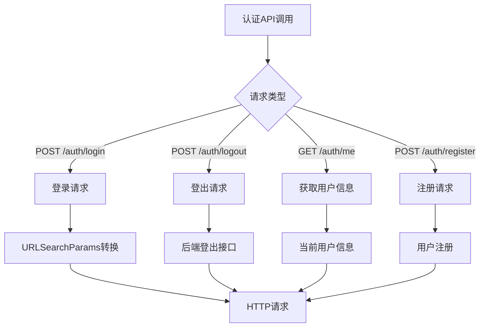

**图表来源**
- [frontend/src/api/user.ts](file://frontend/src/api/user.ts#L35-L48)
- [frontend/src/api/user.ts](file://frontend/src/api/user.ts#L61-L68)

**章节来源**
- [frontend/src/api/user.ts](file://frontend/src/api/user.ts#L1-L69)

### Token管理模块 (utils/auth.ts)

#### Token持久化机制

Token管理模块实现了基于localStorage的持久化存储：

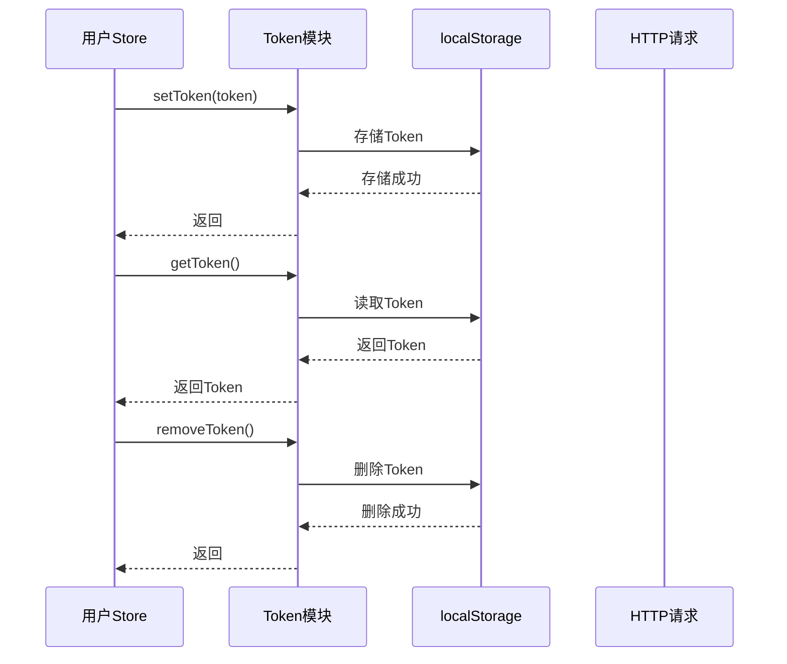

**图表来源**
- [frontend/src/utils/auth.ts](file://frontend/src/utils/auth.ts#L14-L24)
- [frontend/src/store/modules/user.ts](file://frontend/src/store/modules/user.ts#L12-L12)

**章节来源**
- [frontend/src/utils/auth.ts](file://frontend/src/utils/auth.ts#L1-L25)

### 登录流程组件 (views/Login/index.vue)

#### 登录流程实现

登录组件实现了完整的用户登录流程：

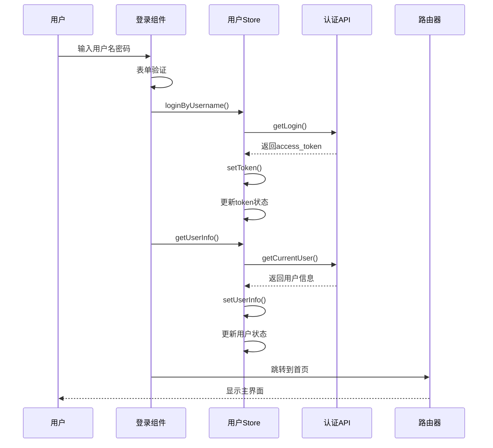

**图表来源**
- [frontend/src/views/Login/index.vue](file://frontend/src/views/Login/index.vue#L29-L57)
- [frontend/src/store/modules/user.ts](file://frontend/src/store/modules/user.ts#L42-L62)

**章节来源**
- [frontend/src/views/Login/index.vue](file://frontend/src/views/Login/index.vue#L1-L143)

### 路由守卫与权限控制

#### 路由守卫实现

路由守卫实现了基于Token和权限的访问控制：

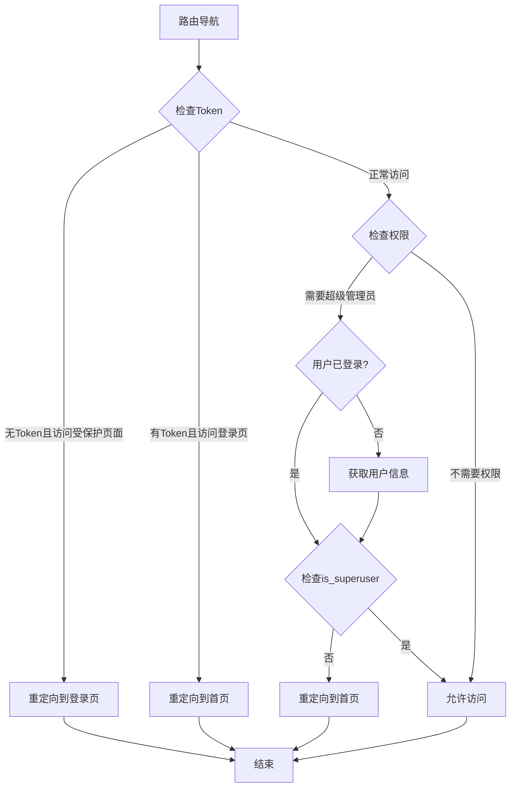

**图表来源**
- [frontend/src/router/index.ts](file://frontend/src/router/index.ts#L74-L113)

**章节来源**
- [frontend/src/router/index.ts](file://frontend/src/router/index.ts#L1-L116)

### 侧边栏组件与状态共享

#### 权限导航实现

侧边栏组件展示了用户状态在UI中的实际应用：

```mermaid
classDiagram
class Sidebar {
+computed navigation
+handleLogout()
+render() Template
}
class UserStore {
+string avatar
+string username
+string email
+boolean is_superuser
}
Sidebar --> UserStore : "读取状态"
UserStore --> Sidebar : "响应式更新"
note for Sidebar : "根据用户权限动态生成导航菜单"
note for UserStore : "包含用户基本信息和权限状态"
```

**图表来源**
- [frontend/src/components/Sidebar.vue](file://frontend/src/components/Sidebar.vue#L91-L96)
- [frontend/src/components/Sidebar.vue](file://frontend/src/components/Sidebar.vue#L99-L108)

**章节来源**
- [frontend/src/components/Sidebar.vue](file://frontend/src/components/Sidebar.vue#L1-L110)

## 依赖关系分析

### 组件依赖图

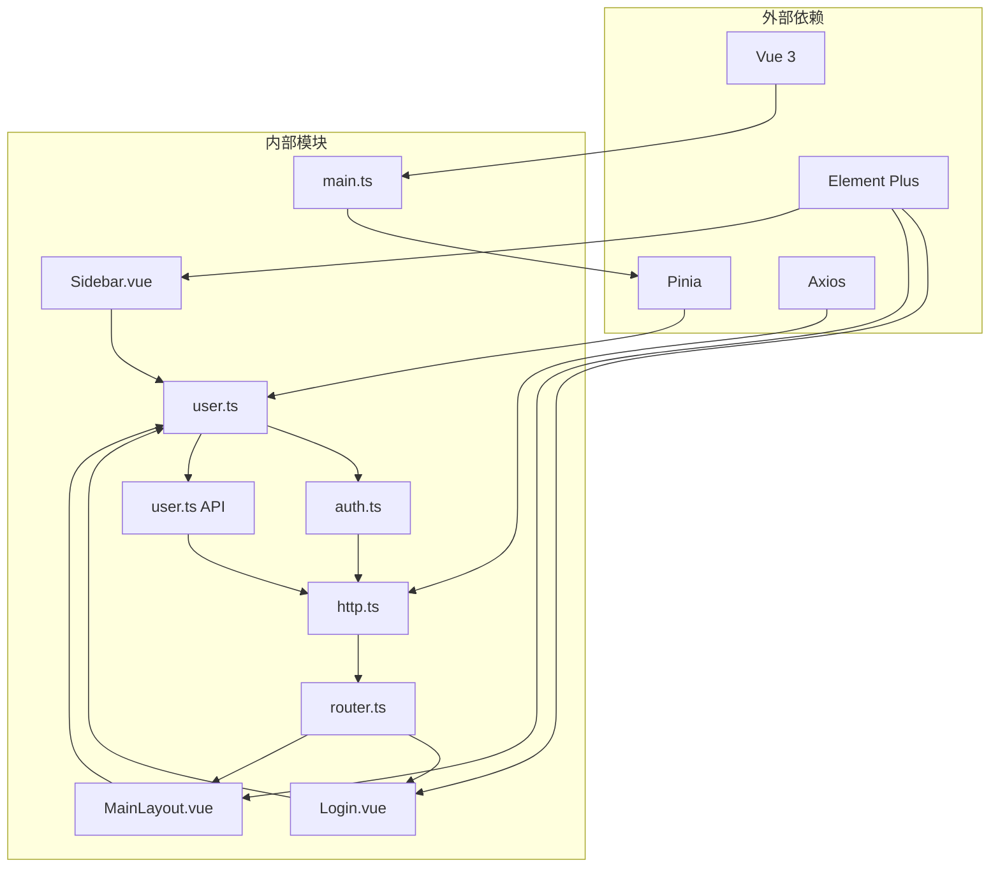

**图表来源**
- [frontend/src/main.ts](file://frontend/src/main.ts#L6-L6)
- [frontend/src/store/modules/user.ts](file://frontend/src/store/modules/user.ts#L1-L4)
- [frontend/src/utils/http/index.ts](file://frontend/src/utils/http/index.ts#L1-L10)

### 状态流分析

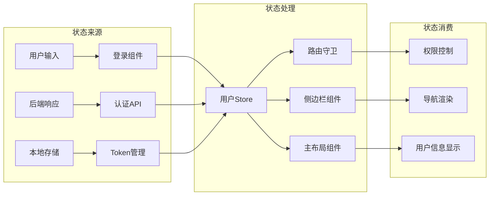

**图表来源**
- [frontend/src/views/Login/index.vue](file://frontend/src/views/Login/index.vue#L39-L45)
- [frontend/src/store/modules/user.ts](file://frontend/src/store/modules/user.ts#L32-L41)
- [frontend/src/components/Sidebar.vue](file://frontend/src/components/Sidebar.vue#L54-L59)

**章节来源**
- [frontend/src/store/modules/user.ts](file://frontend/src/store/modules/user.ts#L1-L81)
- [frontend/src/utils/http/index.ts](file://frontend/src/utils/http/index.ts#L34-L50)

## 性能考虑

### 状态更新优化

1. **响应式更新**: Pinia的响应式系统确保状态变化自动触发UI更新
2. **懒加载**: 用户信息仅在需要时获取，避免不必要的API调用
3. **缓存策略**: Token存储在localStorage中，减少重复登录

### 性能监控

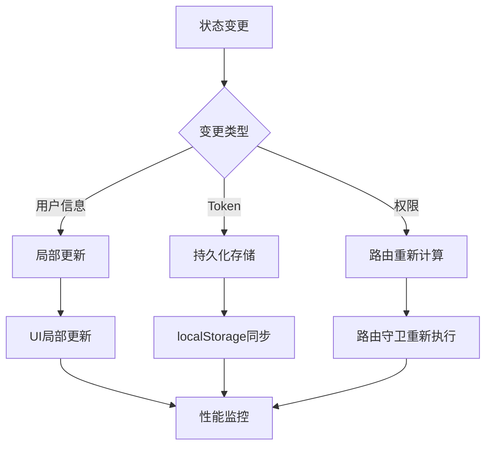

## 故障排除指南

### 常见问题及解决方案

#### 登录失败问题

**问题**: 用户登录后无法进入主页面
**原因**: Token未正确设置或用户信息获取失败
**解决方案**: 
1. 检查认证API响应格式
2. 验证Token存储逻辑
3. 确认用户信息API可用性

#### 权限控制失效

**问题**: 非管理员用户可以访问管理页面
**原因**: 路由守卫逻辑错误或用户状态未正确更新
**解决方案**:
1. 检查路由元信息配置
2. 验证用户权限状态
3. 确认路由守卫执行顺序

#### 状态不同步

**问题**: 多个组件显示不同的用户状态
**原因**: 组件未正确使用Pinia Store或状态更新不及时
**解决方案**:
1. 确保所有组件都使用同一个Store实例
2. 检查状态更新的异步处理
3. 验证响应式系统的使用

**章节来源**
- [frontend/src/store/modules/user.ts](file://frontend/src/store/modules/user.ts#L64-L78)
- [frontend/src/router/index.ts](file://frontend/src/router/index.ts#L89-L110)

## 结论

本项目的状态管理系统展现了现代前端应用的最佳实践：

1. **模块化设计**: 用户状态独立模块化，职责清晰
2. **响应式架构**: 基于Pinia的响应式状态管理
3. **持久化机制**: Token持久化确保用户体验连续性
4. **权限控制**: 完整的路由守卫和组件级权限控制
5. **组件解耦**: 通过Store实现组件间状态共享

该系统为后续的功能扩展提供了良好的基础，特别是在用户管理、权限系统和多租户支持方面具有很大的扩展潜力。