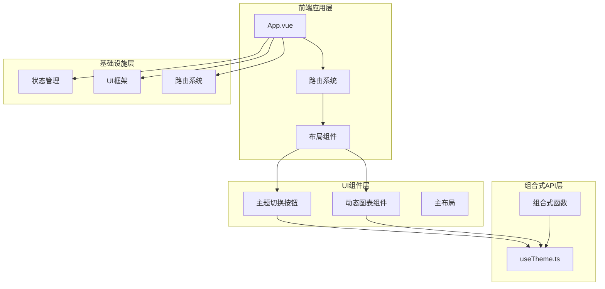
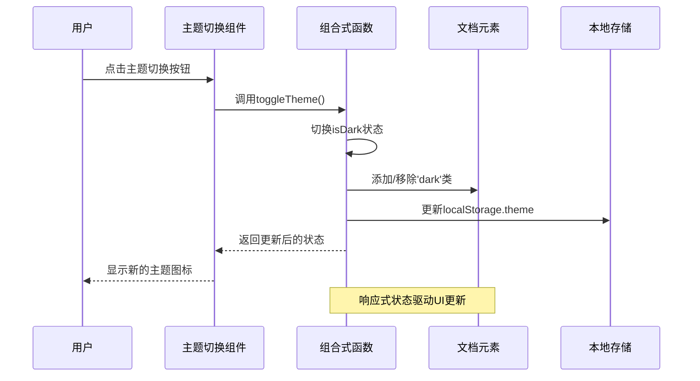
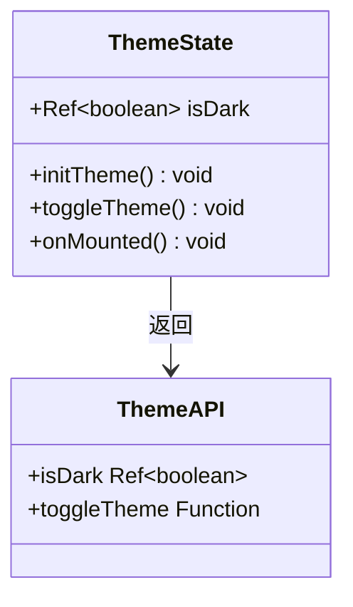
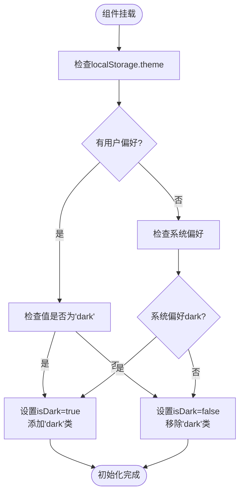
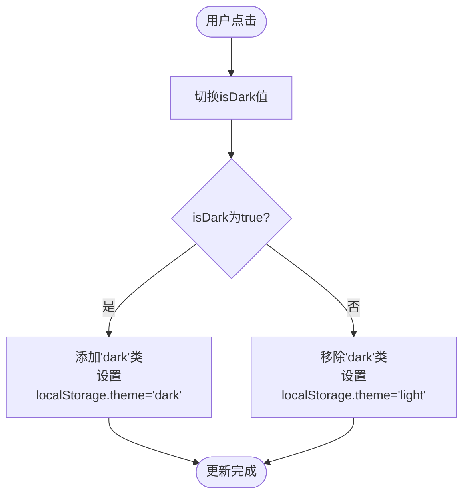
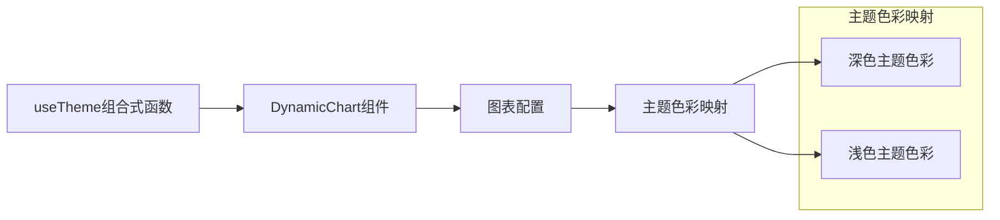
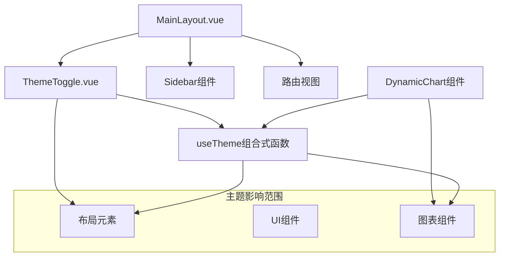
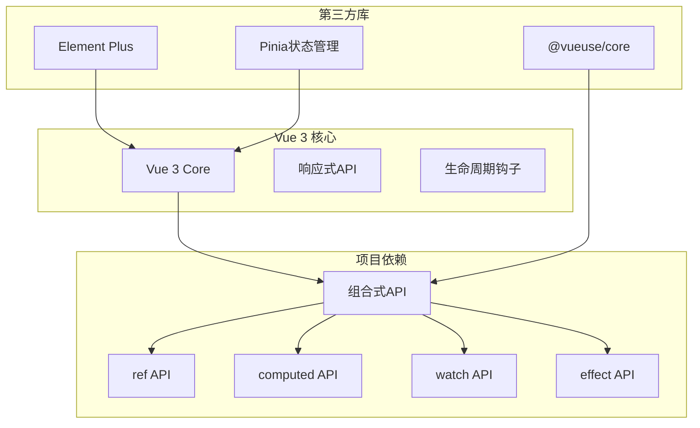
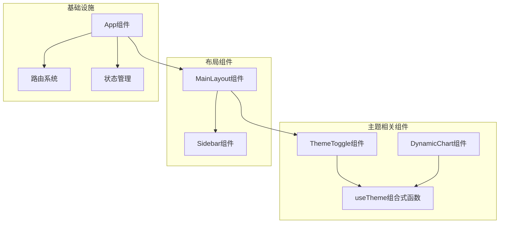

# 组合式API与逻辑复用

<cite>
**本文档引用的文件**
- [useTheme.ts](file://frontend/src/composables/useTheme.ts)
- [ThemeToggle.vue](file://frontend/src/components/ThemeToggle.vue)
- [MainLayout.vue](file://frontend/src/layout/MainLayout.vue)
- [DynamicChart.vue](file://frontend/src/components/Charts/DynamicChart.vue)
- [main.ts](file://frontend/src/main.ts)
- [App.vue](file://frontend/src/App.vue)
- [package.json](file://frontend/package.json)
</cite>

## 目录
1. [引言](#引言)
2. [项目结构](#项目结构)
3. [核心组件](#核心组件)
4. [架构概览](#架构概览)
5. [详细组件分析](#详细组件分析)
6. [依赖关系分析](#依赖关系分析)
7. [性能考虑](#性能考虑)
8. [故障排除指南](#故障排除指南)
9. [结论](#结论)

## 引言

本文件深入分析了Vue 3组合式API在逻辑复用方面的最佳实践，以`useTheme.ts`为主题切换逻辑的实现示例。该实现展示了如何通过自定义组合式函数封装复杂的业务逻辑，包括主题切换、本地存储持久化、系统偏好检测等功能，并在多个组件中实现跨组件的状态同步与行为抽象。

通过分析该项目中的主题管理系统，我们可以看到组合式API如何提升代码的组织性、可测试性和可维护性，为现代前端开发提供了一种更加灵活和强大的解决方案。

## 项目结构

该项目采用典型的Vue 3单页应用架构，主要分为以下几个层次：

**图表来源**
- [main.ts](file://frontend/src/main.ts#L1-L26)
- [App.vue](file://frontend/src/App.vue#L1-L16)

**章节来源**
- [main.ts](file://frontend/src/main.ts#L1-L26)
- [package.json](file://frontend/package.json#L1-L40)

## 核心组件

### useTheme 组合式函数

`useTheme.ts`是整个主题管理系统的核心，它实现了以下关键功能：

#### 响应式状态管理
- 使用 `ref` 创建响应式状态 `isDark`
- 自动处理DOM类名的添加和移除
- 支持localStorage持久化

#### 初始化策略
- 检查localStorage中的主题偏好
- 回退到系统颜色方案偏好
- 在组件挂载时自动初始化

#### 主题切换机制
- 切换响应式状态值
- 更新HTML根元素的dark类
- 同步更新localStorage

**章节来源**
- [useTheme.ts](file://frontend/src/composables/useTheme.ts#L1-L40)

## 架构概览

该主题系统的整体架构体现了组合式API的优势：

**图表来源**
- [ThemeToggle.vue](file://frontend/src/components/ThemeToggle.vue#L1-L19)
- [useTheme.ts](file://frontend/src/composables/useTheme.ts#L17-L29)

## 详细组件分析

### useTheme 组合式函数详解

#### 数据结构设计

**图表来源**
- [useTheme.ts](file://frontend/src/composables/useTheme.ts#L3-L39)

#### 初始化流程

**图表来源**
- [useTheme.ts](file://frontend/src/composables/useTheme.ts#L6-L15)

#### 主题切换流程

**图表来源**
- [useTheme.ts](file://frontend/src/composables/useTheme.ts#L17-L29)

**章节来源**
- [useTheme.ts](file://frontend/src/composables/useTheme.ts#L1-L40)

### ThemeToggle 组件分析

#### 组件职责
- 提供用户交互界面
- 展示当前主题状态
- 触发主题切换操作

#### 实现特点
- 使用Composition API的`<script setup>`语法
- 直接解构使用`useTheme()`返回的状态
- 基于`isDark`状态动态切换图标

**章节来源**
- [ThemeToggle.vue](file://frontend/src/components/ThemeToggle.vue#L1-L19)

### DynamicChart 组件集成

#### 主题感知能力

**图表来源**
- [DynamicChart.vue](file://frontend/src/components/Charts/DynamicChart.vue#L90-L123)

#### 响应式图表配置
组件通过计算属性`chartOption`自动响应主题变化：
- 动态调整文本颜色
- 根据主题切换网格线颜色
- 更新工具提示样式

**章节来源**
- [DynamicChart.vue](file://frontend/src/components/Charts/DynamicChart.vue#L98-L160)

### MainLayout 布局集成

#### 全局主题支持
主布局组件通过CSS类名实现全局主题效果：
- 背景色随主题变化
- 文字颜色适配深浅主题
- 组件样式自动更新

#### 组件协作

**图表来源**
- [MainLayout.vue](file://frontend/src/layout/MainLayout.vue#L36-L41)

**章节来源**
- [MainLayout.vue](file://frontend/src/layout/MainLayout.vue#L1-L155)

## 依赖关系分析

### Vue 3 组合式API生态

**图表来源**
- [package.json](file://frontend/package.json#L11-L27)

### 组件间依赖关系

**图表来源**
- [ThemeToggle.vue](file://frontend/src/components/ThemeToggle.vue#L15-L17)
- [DynamicChart.vue](file://frontend/src/components/Charts/DynamicChart.vue#L50-L90)

**章节来源**
- [package.json](file://frontend/package.json#L1-L40)

## 性能考虑

### 响应式更新优化

1. **细粒度状态管理**
   - 使用`ref`而非`reactive`管理简单布尔值
   - 避免不必要的对象包装

2. **计算属性缓存**
   - `chartOption`使用`computed`避免重复计算
   - 仅在依赖变化时重新计算

3. **事件处理优化**
   - 组件内直接调用组合式函数，减少中间层

### 内存管理

- 组合式函数在组件卸载时自动清理
- 无需手动清理事件监听器
- localStorage访问开销最小化

## 故障排除指南

### 常见问题及解决方案

#### 主题初始化失败
**症状**: 页面加载时主题状态不正确
**原因**: localStorage访问受限或系统偏好检测失败
**解决方案**: 
- 检查浏览器隐私设置
- 验证`window.matchMedia`支持
- 确认`document.documentElement`存在

#### 主题切换无效
**症状**: 点击按钮后UI未发生变化
**原因**: DOM类名更新失败或样式冲突
**解决方案**:
- 检查CSS选择器优先级
- 确认`dark`类名正确添加/移除
- 验证Tailwind CSS配置

#### 性能问题
**症状**: 主题切换卡顿
**原因**: 复杂DOM操作或样式重绘
**解决方案**:
- 减少DOM操作次数
- 使用CSS变量替代JavaScript样式修改
- 优化图表重绘频率

**章节来源**
- [useTheme.ts](file://frontend/src/composables/useTheme.ts#L6-L15)
- [DynamicChart.vue](file://frontend/src/components/Charts/DynamicChart.vue#L94-L96)

## 结论

通过`useTheme.ts`的实现，我们可以看到Vue 3组合式API在逻辑复用方面的巨大优势：

### 技术优势
1. **代码复用**: 将复杂主题逻辑封装在独立的组合式函数中
2. **状态共享**: 多个组件可以共享同一份主题状态
3. **测试友好**: 组合式函数易于单元测试和模拟
4. **类型安全**: TypeScript支持提供完整的类型推导

### 最佳实践
1. **单一职责**: 每个组合式函数专注于特定业务逻辑
2. **响应式设计**: 使用合适的响应式API（ref vs reactive）
3. **生命周期管理**: 正确使用生命周期钩子进行资源管理
4. **错误处理**: 提供健壮的错误处理和降级策略

### 扩展建议
1. **主题定制**: 支持更多主题变量和自定义颜色
2. **动画过渡**: 添加主题切换的平滑过渡效果
3. **服务端渲染**: 考虑SSR环境下的主题初始化
4. **多用户支持**: 为不同用户保存独立的主题偏好

这个实现为Vue 3项目的逻辑复用提供了优秀的参考模板，展示了如何通过组合式API构建可维护、可扩展的前端应用。