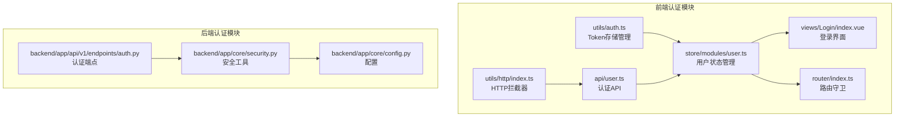
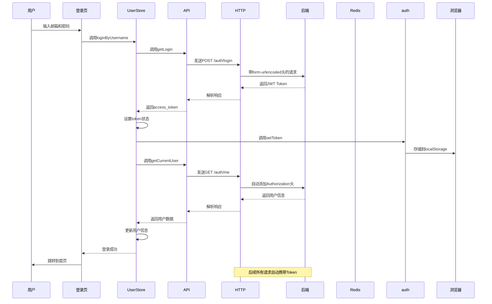
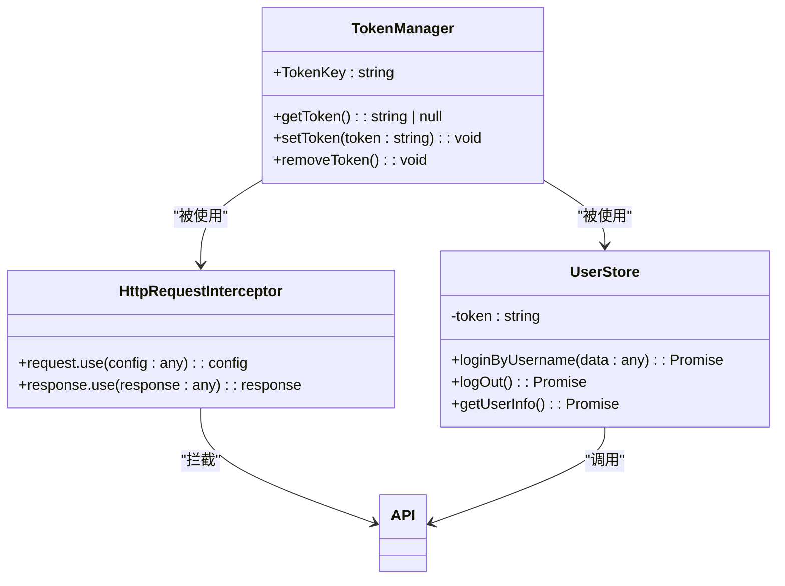
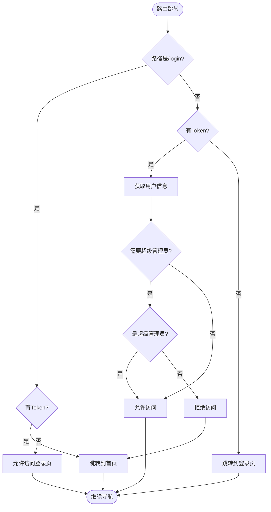
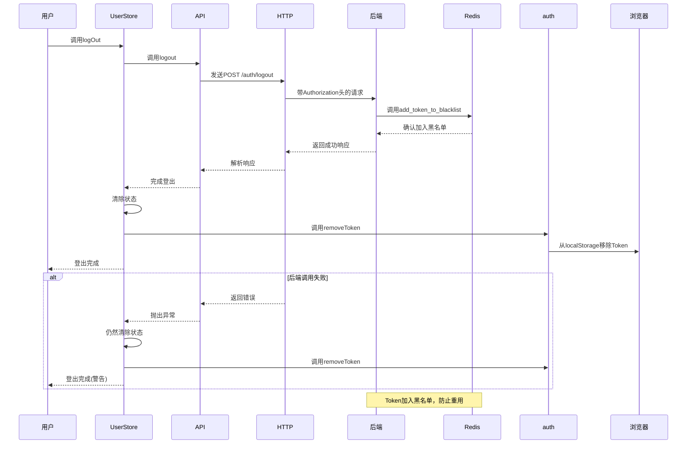
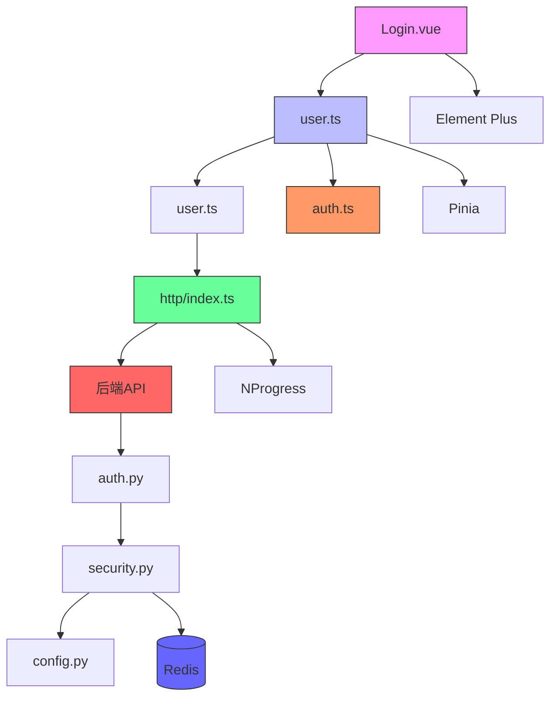

# 认证机制与会话管理

<cite>
**本文档引用的文件**   
- [auth.ts](file://frontend/src/utils/auth.ts)
- [user.ts](file://frontend/src/store/modules/user.ts)
- [index.ts](file://frontend/src/router/index.ts)
- [user.ts](file://frontend/src/api/user.ts)
- [index.ts](file://frontend/src/utils/http/index.ts)
- [auth.py](file://backend/app/api/v1/endpoints/auth.py)
- [security.py](file://backend/app/core/security.py)
- [config.py](file://backend/app/core/config.py)
- [Login.vue](file://frontend/src/views/Login/index.vue)
</cite>

## 目录
1. [项目结构](#项目结构)
2. [核心组件](#核心组件)
3. [架构概述](#架构概述)
4. [详细组件分析](#详细组件分析)
5. [依赖分析](#依赖分析)
6. [性能考虑](#性能考虑)
7. [故障排除指南](#故障排除指南)
8. [结论](#结论)

## 项目结构

前端认证机制主要由以下几个核心文件构成，分布在不同的模块中：

**图示来源**
- [auth.ts](file://frontend/src/utils/auth.ts)
- [user.ts](file://frontend/src/store/modules/user.ts)
- [index.ts](file://frontend/src/router/index.ts)
- [auth.py](file://backend/app/api/v1/endpoints/auth.py)
- [security.py](file://backend/app/core/security.py)

**本节来源**
- [auth.ts](file://frontend/src/utils/auth.ts)
- [user.ts](file://frontend/src/store/modules/user.ts)
- [index.ts](file://frontend/src/router/index.ts)
- [auth.py](file://backend/app/api/v1/endpoints/auth.py)

## 核心组件

前端认证机制的核心组件包括Token管理、用户状态管理、路由守卫和HTTP拦截器。这些组件协同工作，确保用户会话的安全性和一致性。

**本节来源**
- [auth.ts](file://frontend/src/utils/auth.ts)
- [user.ts](file://frontend/src/store/modules/user.ts)
- [index.ts](file://frontend/src/router/index.ts)
- [http/index.ts](file://frontend/src/utils/http/index.ts)

## 架构概述

整个认证系统采用前后端分离架构，前端负责Token的存储和状态管理，后端负责Token的生成、验证和黑名单管理。

**图示来源**
- [Login.vue](file://frontend/src/views/Login/index.vue)
- [user.ts](file://frontend/src/store/modules/user.ts)
- [user.ts](file://frontend/src/api/user.ts)
- [index.ts](file://frontend/src/utils/http/index.ts)
- [auth.py](file://backend/app/api/v1/endpoints/auth.py)

## 详细组件分析

### Token管理分析

前端Token管理通过`auth.ts`文件实现，采用localStorage作为存储介质，提供统一的接口进行Token的读写操作。

**图示来源**
- [auth.ts](file://frontend/src/utils/auth.ts)
- [user.ts](file://frontend/src/store/modules/user.ts)
- [http/index.ts](file://frontend/src/utils/http/index.ts)

**本节来源**
- [auth.ts](file://frontend/src/utils/auth.ts)

### 路由守卫分析

路由守卫机制确保只有经过认证的用户才能访问受保护的页面，同时防止已登录用户重复访问登录页。

**图示来源**
- [index.ts](file://frontend/src/router/index.ts)

**本节来源**
- [index.ts](file://frontend/src/router/index.ts)

### 登出流程分析

登出流程设计为即使后端调用失败也能确保本地会话被清除，体现了安全优先的设计原则。

**图示来源**
- [user.ts](file://frontend/src/store/modules/user.ts)
- [auth.py](file://backend/app/api/v1/endpoints/auth.py)
- [security.py](file://backend/app/core/security.py)

**本节来源**
- [user.ts](file://frontend/src/store/modules/user.ts)
- [auth.py](file://backend/app/api/v1/endpoints/auth.py)

## 依赖分析

认证系统涉及多个组件之间的依赖关系，从前端到后端形成完整的认证链条。

**图示来源**
- [Login.vue](file://frontend/src/views/Login/index.vue)
- [user.ts](file://frontend/src/store/modules/user.ts)
- [auth.ts](file://frontend/src/utils/auth.ts)
- [http/index.ts](file://frontend/src/utils/http/index.ts)
- [auth.py](file://backend/app/api/v1/endpoints/auth.py)
- [security.py](file://backend/app/core/security.py)
- [config.py](file://backend/app/core/config.py)

**本节来源**
- [user.ts](file://frontend/src/store/modules/user.ts)
- [auth.py](file://backend/app/api/v1/endpoints/auth.py)
- [security.py](file://backend/app/core/security.py)

## 性能考虑

认证机制在性能方面有以下考虑：

1. **Token存储**：使用localStorage进行同步存储，避免异步操作带来的延迟
2. **HTTP拦截器**：在请求拦截器中添加Authorization头，避免每次手动设置
3. **路由守卫**：在路由跳转前进行认证检查，避免不必要的页面渲染
4. **错误处理**：在网络请求失败时仍能保证本地状态的一致性

**本节来源**
- [auth.ts](file://frontend/src/utils/auth.ts)
- [http/index.ts](file://frontend/src/utils/http/index.ts)
- [index.ts](file://frontend/src/router/index.ts)

## 故障排除指南

### Token未正确存储

**现象**：登录后刷新页面仍需重新登录

**检查步骤**：
1. 确认`auth.ts`中的`TokenKey`常量是否正确
2. 检查浏览器是否禁用了localStorage
3. 确认`userStore.loginByUsername`是否正确调用了`setToken`

**本节来源**
- [auth.ts](file://frontend/src/utils/auth.ts)
- [user.ts](file://frontend/src/store/modules/user.ts)

### 401错误持续出现

**现象**：页面频繁跳转到登录页

**检查步骤**：
1. 检查后端返回的Token是否有效
2. 确认HTTP拦截器是否正确添加了Authorization头
3. 检查后端JWT配置是否与前端一致
4. 验证Redis服务是否正常运行

**本节来源**
- [http/index.ts](file://frontend/src/utils/http/index.ts)
- [auth.py](file://backend/app/api/v1/endpoints/auth.py)
- [security.py](file://backend/app/core/security.py)

### 登出后Token仍有效

**现象**：登出后使用旧Token仍能访问受保护接口

**检查步骤**：
1. 确认`auth.py`中的`logout`端点是否被正确调用
2. 检查`security.py`中的`add_token_to_blacklist`函数是否正常执行
3. 验证Redis中是否存在对应的黑名单Key
4. 确认`get_current_user`依赖函数是否检查了黑名单

**本节来源**
- [user.ts](file://frontend/src/store/modules/user.ts)
- [auth.py](file://backend/app/api/v1/endpoints/auth.py)
- [security.py](file://backend/app/core/security.py)

## 结论

本系统实现了完整的JWT认证机制，从前端Token管理到后端黑名单验证形成了闭环。关键特性包括：

1. **安全性**：通过Redis黑名单机制，即使Token未过期也能立即失效
2. **一致性**：前端状态与本地存储保持同步，确保用户体验一致
3. **容错性**：在网络请求失败时仍能保证本地会话状态的正确性
4. **可维护性**：清晰的模块划分和依赖关系，便于后续维护和扩展

认证系统的设计充分考虑了实际使用场景，如页面刷新、网络不稳定等情况，确保了用户会话的安全性和可靠性。