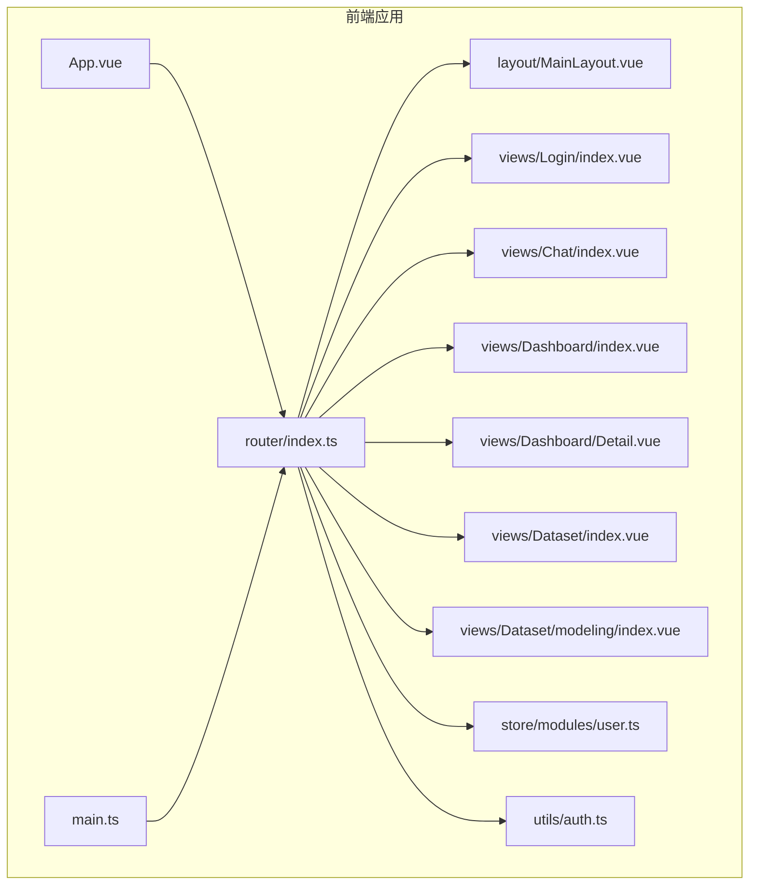
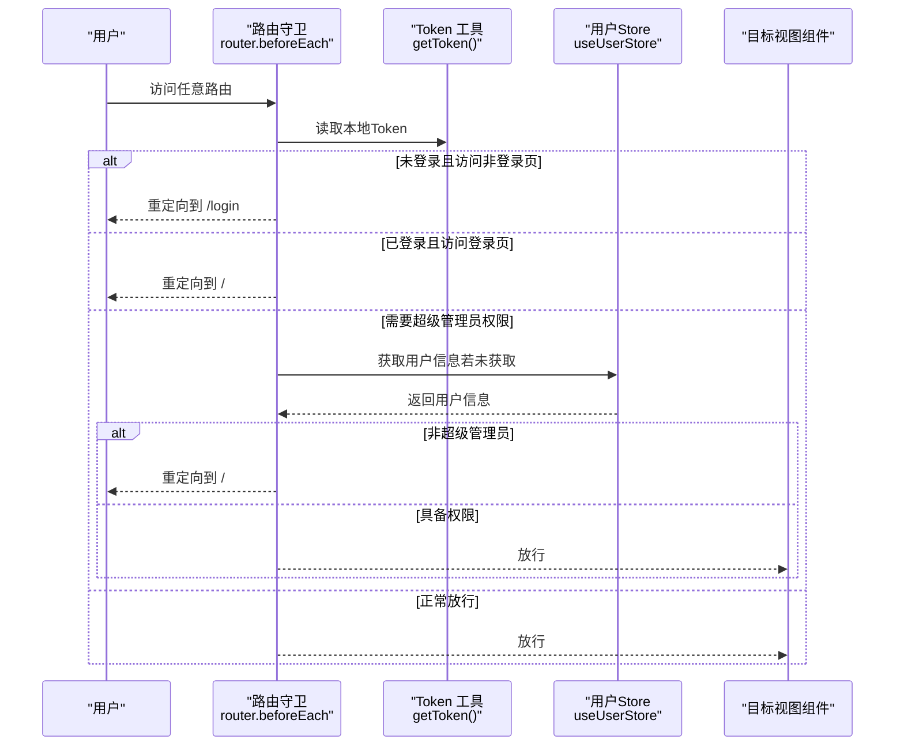
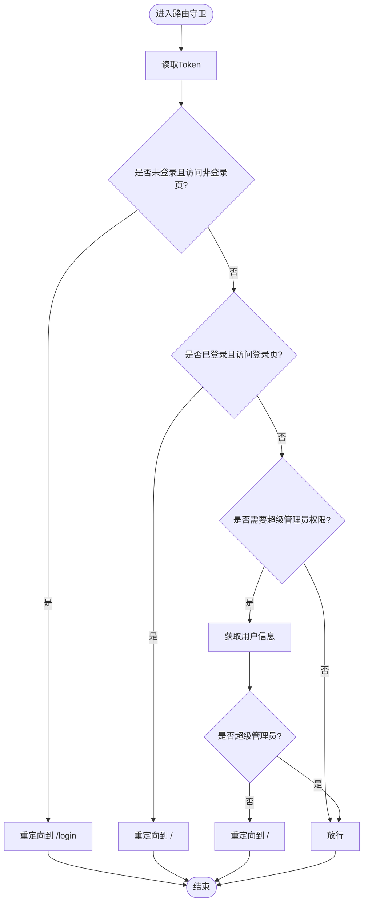
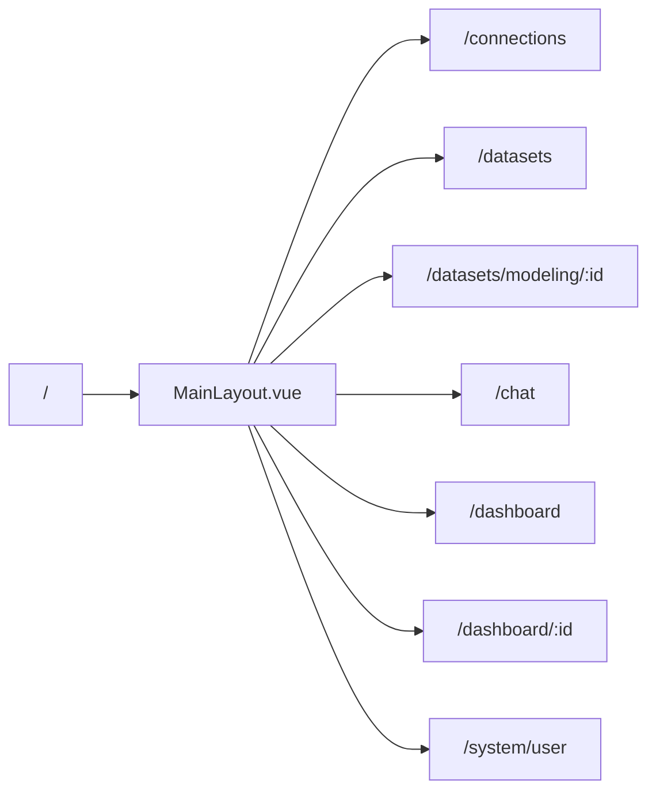
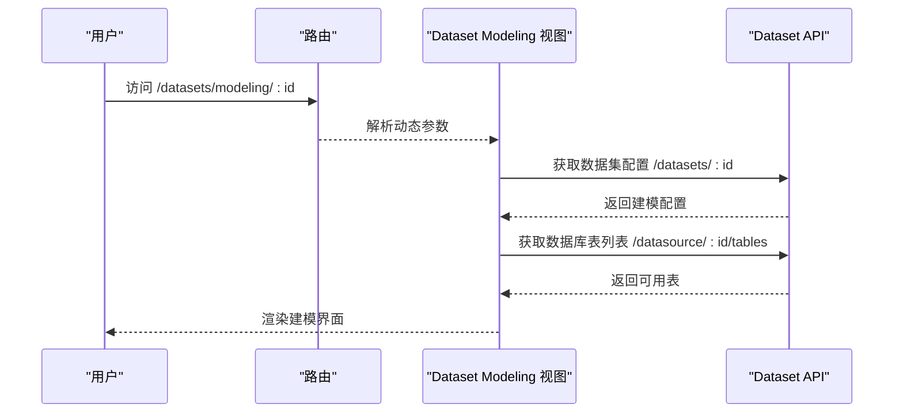
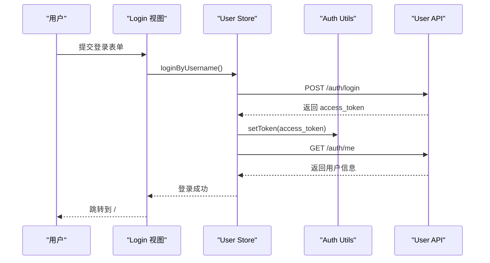
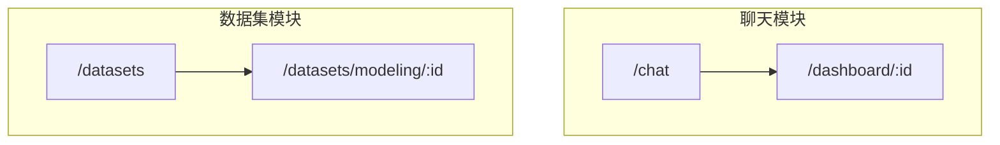
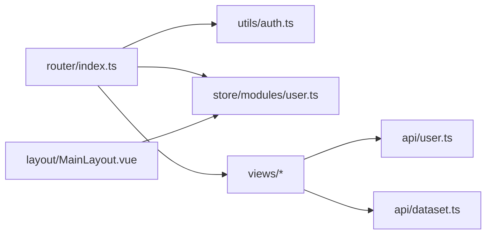

# 路由系统与导航控制

<cite>
**本文档引用的文件**
- [router/index.ts](file://frontend/src/router/index.ts)
- [main.ts](file://frontend/src/main.ts)
- [store/modules/user.ts](file://frontend/src/store/modules/user.ts)
- [utils/auth.ts](file://frontend/src/utils/auth.ts)
- [layout/MainLayout.vue](file://frontend/src/layout/MainLayout.vue)
- [views/Chat/index.vue](file://frontend/src/views/Chat/index.vue)
- [views/Dashboard/index.vue](file://frontend/src/views/Dashboard/index.vue)
- [views/Dataset/index.vue](file://frontend/src/views/Dataset/index.vue)
- [views/Dataset/modeling/index.vue](file://frontend/src/views/Dataset/modeling/index.vue)
- [views/Login/index.vue](file://frontend/src/views/Login/index.vue)
- [App.vue](file://frontend/src/App.vue)
- [api/user.ts](file://frontend/src/api/user.ts)
- [api/dataset.ts](file://frontend/src/api/dataset.ts)
</cite>

## 目录
1. [简介](#简介)
2. [项目结构](#项目结构)
3. [核心组件](#核心组件)
4. [架构总览](#架构总览)
5. [详细组件分析](#详细组件分析)
6. [依赖关系分析](#依赖关系分析)
7. [性能考虑](#性能考虑)
8. [故障排除指南](#故障排除指南)
9. [结论](#结论)

## 简介
本文件深入解析前端路由系统，重点覆盖以下方面：
- 路由表结构与懒加载实现（import() 语法）及页面映射关系
- 路由守卫（beforeEach）在用户认证、权限校验与页面访问控制中的应用，特别是拦截未登录用户访问受保护页面
- 嵌套路由在 Dashboard、Dataset 等模块中的使用方式
- 动态路由参数的处理机制
- 结合实际路径（如 /chat、/dataset/modeling/:id）说明路由设计如何支持功能模块化与用户体验优化

## 项目结构
前端采用 Vue 3 + Vue Router + Pinia 架构，路由系统位于 `frontend/src/router/index.ts`，通过懒加载按需加载视图组件，配合全局路由守卫实现统一的导航控制与权限校验。

**图表来源**
- [router/index.ts](file://frontend/src/router/index.ts#L1-L116)
- [main.ts](file://frontend/src/main.ts#L1-L26)
- [App.vue](file://frontend/src/App.vue#L1-L16)

**章节来源**
- [router/index.ts](file://frontend/src/router/index.ts#L1-L116)
- [main.ts](file://frontend/src/main.ts#L1-L26)
- [App.vue](file://frontend/src/App.vue#L1-L16)

## 核心组件
- 路由表与懒加载：通过 `() => import('@/views/...')` 实现按需加载，减少首屏体积
- 全局前置守卫：统一处理登录拦截、已登录用户访问登录页跳转、超级管理员权限校验
- 嵌套路由：以 `/` 为主布局，子路由渲染到 `<router-view>` 中
- 动态路由参数：如 `/datasets/modeling/:id`、`/dashboard/:id`
- 用户状态与权限：通过 Pinia Store 与 Token 管理实现

**章节来源**
- [router/index.ts](file://frontend/src/router/index.ts#L6-L67)
- [router/index.ts](file://frontend/src/router/index.ts#L74-L113)
- [store/modules/user.ts](file://frontend/src/store/modules/user.ts#L1-L81)
- [utils/auth.ts](file://frontend/src/utils/auth.ts#L1-L25)

## 架构总览
路由系统围绕“懒加载 + 前置守卫 + 嵌套路由 + 动态参数”的设计，实现模块化功能与良好的用户体验。

**图表来源**
- [router/index.ts](file://frontend/src/router/index.ts#L74-L113)
- [utils/auth.ts](file://frontend/src/utils/auth.ts#L14-L24)
- [store/modules/user.ts](file://frontend/src/store/modules/user.ts#L32-L41)

## 详细组件分析

### 路由表结构与懒加载
- 登录页：`/login`，懒加载 `views/Login/index.vue`
- 主布局：`/`，懒加载 `layout/MainLayout.vue`，包含子路由
  - 数据连接：`/connections`
  - 数据集列表：`/datasets`
  - 可视化建模：`/datasets/modeling/:id`（动态参数）
  - 智能问答：`/chat`
  - 看板列表：`/dashboard`
  - 看板详情：`/dashboard/:id`（动态参数）
  - 系统用户管理：`/system/user`（需要超级管理员权限）

懒加载通过 `() => import('@/views/...')` 实现，提升首屏性能。

**章节来源**
- [router/index.ts](file://frontend/src/router/index.ts#L6-L67)

### 路由守卫与导航控制
- 登录拦截：访问非登录页且无 Token，重定向至 `/login`
- 已登录访问登录页：重定向至 `/`
- 超级管理员权限：当路由元信息包含 `requireSuperuser: true` 时，先获取用户信息，再判断 `is_superuser`，否则重定向至 `/`

**图表来源**
- [router/index.ts](file://frontend/src/router/index.ts#L74-L113)
- [utils/auth.ts](file://frontend/src/utils/auth.ts#L14-L24)
- [store/modules/user.ts](file://frontend/src/store/modules/user.ts#L32-L41)

**章节来源**
- [router/index.ts](file://frontend/src/router/index.ts#L74-L113)
- [utils/auth.ts](file://frontend/src/utils/auth.ts#L1-L25)
- [store/modules/user.ts](file://frontend/src/store/modules/user.ts#L1-L81)

### 嵌套路由与主布局
- 主布局：`/` 对应 `MainLayout.vue`，其内部通过 `<router-view>` 渲染子路由
- 子路由包括：`/connections`、`/datasets`、`/datasets/modeling/:id`、`/chat`、`/dashboard`、`/dashboard/:id`、`/system/user`
- 主布局负责面包屑标题、主题切换、用户信息获取等

**图表来源**
- [router/index.ts](file://frontend/src/router/index.ts#L18-L66)
- [layout/MainLayout.vue](file://frontend/src/layout/MainLayout.vue#L45-L50)

**章节来源**
- [router/index.ts](file://frontend/src/router/index.ts#L18-L66)
- [layout/MainLayout.vue](file://frontend/src/layout/MainLayout.vue#L1-L155)

### 动态路由参数与页面映射
- `/datasets/modeling/:id`：进入可视化建模页面，通过 `useRoute()` 读取 `route.params.id` 或查询参数 `dataset_id`，并据此加载数据集配置与数据库表列表
- `/dashboard/:id`：进入看板详情页，通过 `useRoute()` 读取 `route.params.id`，并据此加载看板卡片数据

**图表来源**
- [router/index.ts](file://frontend/src/router/index.ts#L33-L38)
- [views/Dataset/modeling/index.vue](file://frontend/src/views/Dataset/modeling/index.vue#L439-L465)
- [api/dataset.ts](file://frontend/src/api/dataset.ts#L106-L108)
- [api/dataset.ts](file://frontend/src/api/dataset.ts#L156)

**章节来源**
- [router/index.ts](file://frontend/src/router/index.ts#L33-L38)
- [views/Dataset/modeling/index.vue](file://frontend/src/views/Dataset/modeling/index.vue#L439-L584)
- [api/dataset.ts](file://frontend/src/api/dataset.ts#L106-L157)

### 用户认证与权限校验
- Token 管理：通过 `localStorage` 存储 Token，提供 `getToken()`、`setToken()`、`removeToken()` 方法
- 登录流程：登录页调用 `userStore.loginByUsername()`，成功后立即调用 `getUserInfo()`，随后跳转到首页
- 退出登录：调用后端登出接口，清理本地 Token 与用户状态

**图表来源**
- [views/Login/index.vue](file://frontend/src/views/Login/index.vue#L29-L57)
- [store/modules/user.ts](file://frontend/src/store/modules/user.ts#L43-L61)
- [utils/auth.ts](file://frontend/src/utils/auth.ts#L18-L24)
- [api/user.ts](file://frontend/src/api/user.ts#L35-L48)

**章节来源**
- [utils/auth.ts](file://frontend/src/utils/auth.ts#L1-L25)
- [views/Login/index.vue](file://frontend/src/views/Login/index.vue#L1-L143)
- [store/modules/user.ts](file://frontend/src/store/modules/user.ts#L1-L81)
- [api/user.ts](file://frontend/src/api/user.ts#L1-L69)

### 功能模块化与用户体验优化
- 智能问答（/chat）：支持数据集选择、推荐指令、消息流式展示、图表渲染、保存到看板等功能
- 看板管理（/dashboard、/dashboard/:id）：支持创建、删除、查看看板卡片，支持从聊天记录保存卡片
- 数据集管理（/datasets、/datasets/modeling/:id）：支持数据集列表、训练状态、可视化建模、AI 关联分析、生成宽表等

**图表来源**
- [router/index.ts](file://frontend/src/router/index.ts#L41-L54)
- [views/Chat/index.vue](file://frontend/src/views/Chat/index.vue#L1-L1052)
- [views/Dashboard/index.vue](file://frontend/src/views/Dashboard/index.vue#L1-L197)
- [views/Dataset/index.vue](file://frontend/src/views/Dataset/index.vue#L1-L243)
- [views/Dataset/modeling/index.vue](file://frontend/src/views/Dataset/modeling/index.vue#L1-L1701)

**章节来源**
- [views/Chat/index.vue](file://frontend/src/views/Chat/index.vue#L1-L1052)
- [views/Dashboard/index.vue](file://frontend/src/views/Dashboard/index.vue#L1-L197)
- [views/Dataset/index.vue](file://frontend/src/views/Dataset/index.vue#L1-L243)
- [views/Dataset/modeling/index.vue](file://frontend/src/views/Dataset/modeling/index.vue#L1-L1701)

## 依赖关系分析
- 路由依赖：`router/index.ts` 依赖 `utils/auth.ts` 读取 Token，依赖 `store/modules/user.ts` 获取用户信息
- 视图依赖：各页面通过 `vue-router` 的 `useRouter/useRoute` 获取路由信息；主布局依赖 `useUserStore` 在挂载时获取用户信息
- API 依赖：用户登录、登出、获取用户信息依赖 `api/user.ts`；数据集相关依赖 `api/dataset.ts`

**图表来源**
- [router/index.ts](file://frontend/src/router/index.ts#L1-L116)
- [utils/auth.ts](file://frontend/src/utils/auth.ts#L1-L25)
- [store/modules/user.ts](file://frontend/src/store/modules/user.ts#L1-L81)
- [api/user.ts](file://frontend/src/api/user.ts#L1-L69)
- [api/dataset.ts](file://frontend/src/api/dataset.ts#L1-L157)

**章节来源**
- [router/index.ts](file://frontend/src/router/index.ts#L1-L116)
- [layout/MainLayout.vue](file://frontend/src/layout/MainLayout.vue#L61-L76)
- [api/user.ts](file://frontend/src/api/user.ts#L1-L69)
- [api/dataset.ts](file://frontend/src/api/dataset.ts#L1-L157)

## 性能考虑
- 懒加载：通过 `() => import()` 按需加载视图组件，降低首屏资源消耗
- 嵌套路由：主布局组件复用，子路由切换仅替换内部内容，减少重复渲染
- 动态参数：通过 `useRoute()` 获取参数，避免不必要的全量刷新
- 用户信息预取：在主布局挂载时尝试获取用户信息，避免后续页面重复请求

[本节为通用指导，无需特定文件来源]

## 故障排除指南
- 登录后仍被重定向到登录页
  - 检查 Token 是否正确写入本地存储
  - 确认 `getToken()` 返回值是否为空
- 已登录访问 /login 被重定向到 /
  - 属于预期行为，无需处理
- 访问 /system/user 被重定向到 /
  - 当前用户不是超级管理员，需要具备相应权限
- 动态路由参数无效
  - 确认路由定义中的参数名与页面读取一致（如 `:id`）
  - 确认页面通过 `useRoute()` 正确读取参数

**章节来源**
- [router/index.ts](file://frontend/src/router/index.ts#L74-L113)
- [utils/auth.ts](file://frontend/src/utils/auth.ts#L14-L24)
- [views/Dataset/modeling/index.vue](file://frontend/src/views/Dataset/modeling/index.vue#L439-L465)

## 结论
该路由系统通过懒加载、全局前置守卫、嵌套路由与动态参数的组合，实现了清晰的功能模块划分与良好的用户体验。登录拦截与超级管理员权限校验在路由层统一处理，简化了各页面的权限逻辑。动态路由参数与 API 集成紧密，支持复杂业务场景（如数据集建模、看板详情）。整体设计兼顾性能与可维护性，适合持续扩展。