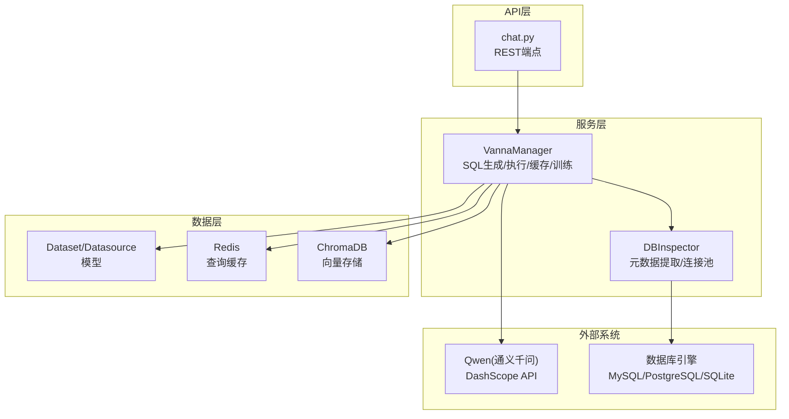
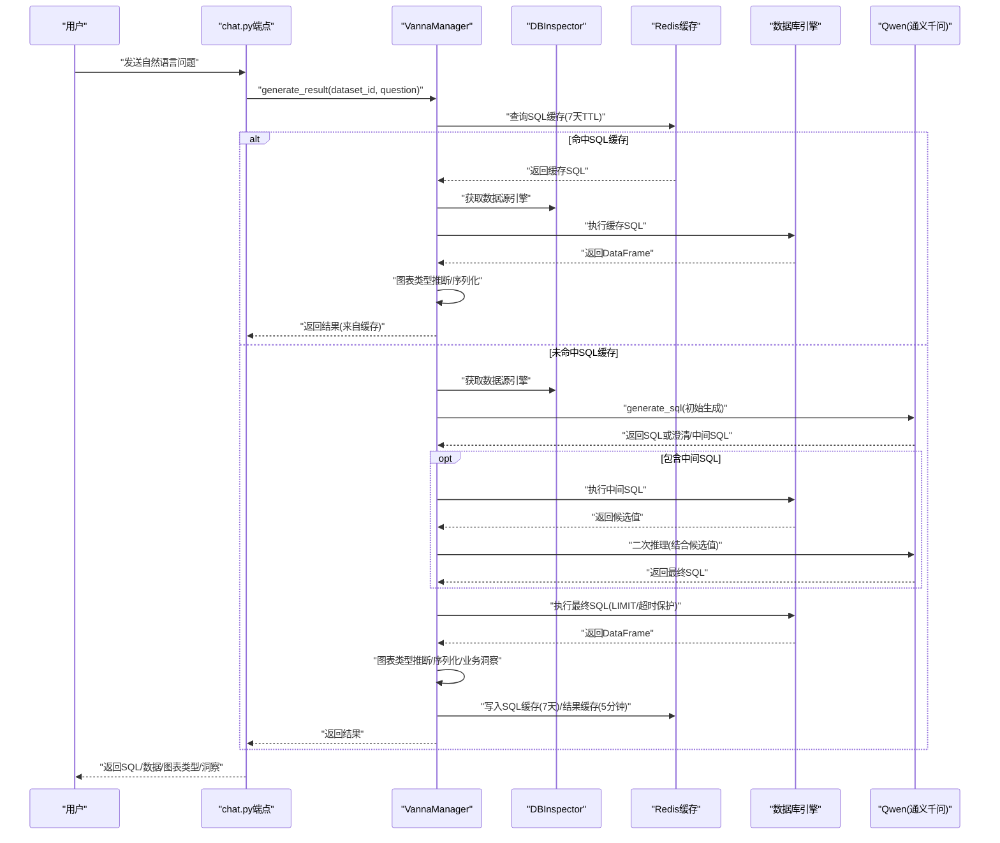
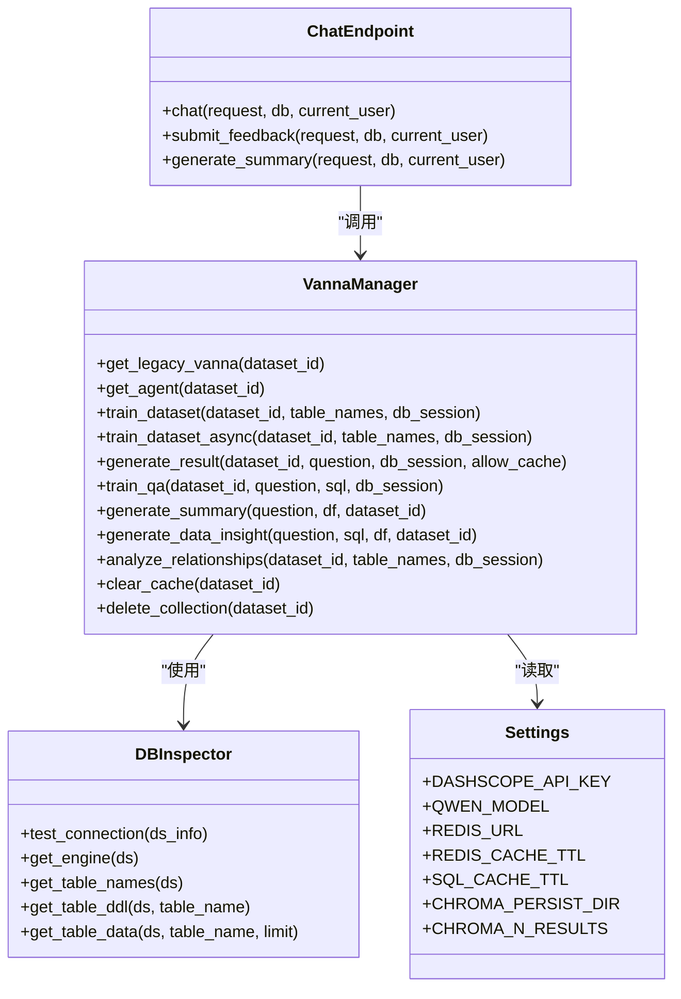

# AI服务与数据库交互

<cite>
**本文引用的文件**
- [vanna_manager.py](file://backend/app/services/vanna_manager.py)
- [db_inspector.py](file://backend/app/services/db_inspector.py)
- [chat.py](file://backend/app/api/v1/endpoints/chat.py)
- [main.py](file://backend/app/main.py)
- [config.py](file://backend/app/core/config.py)
- [metadata.py](file://backend/app/models/metadata.py)
- [chat.py](file://backend/app/schemas/chat.py)
</cite>

## 目录
1. [简介](#简介)
2. [项目结构](#项目结构)
3. [核心组件](#核心组件)
4. [架构总览](#架构总览)
5. [详细组件分析](#详细组件分析)
6. [依赖关系分析](#依赖关系分析)
7. [性能考量](#性能考量)
8. [故障排查指南](#故障排查指南)
9. [结论](#结论)

## 简介
本文件面向AI服务与数据库交互的实现，重点解析以下内容：
- VannaManager类设计与职责边界：包括Qwen大模型与Vanna框架的集成方式、向量数据库（ChromaDB）的配置与训练数据存储机制、SQL生成与执行的封装流程、多轮对话上下文管理及错误自愈逻辑。
- DBInspector.inspect_database方法如何支持MySQL、PostgreSQL、SQLite等多种数据库的元数据提取（表结构、DDL语句），并被数据集模块用于模型训练准备。
- 从自然语言输入到SQL执行结果返回的完整链路，结合chat.py端点调用流程，展示缓存策略与性能优化考虑。

## 项目结构
后端采用FastAPI + SQLAlchemy + Vanna + Redis + ChromaDB的组合，围绕“数据集-数据源-向量化记忆-LLM-数据库”的闭环构建AI问答与SQL生成能力。

图示来源
- [chat.py](file://backend/app/api/v1/endpoints/chat.py#L1-L156)
- [vanna_manager.py](file://backend/app/services/vanna_manager.py#L101-L340)
- [db_inspector.py](file://backend/app/services/db_inspector.py#L13-L152)
- [config.py](file://backend/app/core/config.py#L21-L42)

章节来源
- [main.py](file://backend/app/main.py#L1-L35)
- [config.py](file://backend/app/core/config.py#L1-L51)

## 核心组件
- VannaManager：负责与Vanna框架集成、ChromaDB向量存储、Redis缓存、SQL生成与执行、训练数据管理、业务洞察生成、关系分析等。
- DBInspector：负责数据库连接、URL构建、表DDL生成、表数据预览、连接池配置与超时控制。
- chat.py端点：接收用户自然语言输入，调用VannaManager生成SQL并执行，返回结果与可选业务洞察。
- 配置中心：集中管理DashScope API密钥、Qwen模型、Redis与ChromaDB路径、PGVector参数等。

章节来源
- [vanna_manager.py](file://backend/app/services/vanna_manager.py#L101-L340)
- [db_inspector.py](file://backend/app/services/db_inspector.py#L13-L152)
- [chat.py](file://backend/app/api/v1/endpoints/chat.py#L1-L156)
- [config.py](file://backend/app/core/config.py#L21-L42)

## 架构总览
下图展示从自然语言到SQL执行与结果返回的完整链路，以及缓存与错误自愈策略。

图示来源
- [chat.py](file://backend/app/api/v1/endpoints/chat.py#L13-L43)
- [vanna_manager.py](file://backend/app/services/vanna_manager.py#L868-L1332)
- [db_inspector.py](file://backend/app/services/db_inspector.py#L52-L99)

## 详细组件分析

### VannaManager类设计与实现
- 角色定位
  - 作为Vanna 2.0与Legacy混合模式的统一入口，负责：
    - LLM服务（Qwen via OpenAI兼容接口）、Agent内存（ChromaDB）、工具注册、上下文增强器的装配。
    - 训练数据管理：DDL、业务术语、表关系、示例问答对的注入。
    - SQL生成与执行：多轮推理、中间SQL检测、澄清请求识别、LIMIT与超时保护、错误自愈。
    - 缓存策略：SQL级缓存（7天TTL）与结果级缓存（5分钟TTL），Redis连接复用与降级。
    - 业务洞察：基于查询结果的业务总结与分析。
- 关键实现要点
  - LLM与ChromaDB集成
    - 使用OpenAILlmService与ChromaAgentMemory，结合DefaultLlmContextEnhancer将向量检索到的DDL/文档注入系统提示，提升SQL生成质量。
    - 通过全局单例缓存避免ChromaDB实例冲突，支持动态清理与重建。
  - SQL生成与执行封装
    - generate_result主流程包含：SQL缓存检查、结果缓存检查、初始化、初始生成、多轮推理（中间SQL/澄清）、执行与限流、图表类型推断、业务洞察、缓存写入。
    - 错误自愈：捕获超时/连接丢失等错误，生成友好提示；非最后轮次尝试LLM修正SQL；最终兜底生成友好错误消息。
  - 缓存策略
    - SQL缓存：仅缓存SQL字符串，7天TTL；命中后重新执行SQL以获取最新数据，兼顾性能与一致性。
    - 结果缓存：缓存完整结果，5分钟TTL；与SQL缓存并存，兼容旧版本。
    - Redis可用性：连接失败自动降级，不影响核心流程。
  - 训练流程
    - train_dataset_async：分阶段训练（DDL、业务术语、表关系、示例问答），支持进度更新与用户中断（paused状态）。
    - 支持term与relationship的增量训练，训练后清理缓存确保一致性。
  - 业务洞察与总结
    - generate_summary：对结果进行简要业务总结（≤100字）。
    - generate_data_insight：压缩数据摘要，生成Markdown格式的业务洞察（≤150字）。

章节来源
- [vanna_manager.py](file://backend/app/services/vanna_manager.py#L101-L340)
- [vanna_manager.py](file://backend/app/services/vanna_manager.py#L585-L763)
- [vanna_manager.py](file://backend/app/services/vanna_manager.py#L868-L1332)
- [vanna_manager.py](file://backend/app/services/vanna_manager.py#L1608-L1776)

### DBInspector元数据提取与数据库适配
- 支持数据库类型
  - MySQL（pymysql驱动）、PostgreSQL（psycopg2驱动）、SQLite（文件路径）。
- 核心能力
  - URL构建：根据类型选择驱动，对用户名/密码进行URL编码，拼接连接串。
  - 连接测试：短超时连接验证，快速判断数据源连通性。
  - 引擎与连接池：统一配置连接池大小、超时、回收与预检，MySQL额外设置读写超时。
  - 表DDL生成：反射表结构，生成CREATE TABLE DDL字符串。
  - 表数据预览：按LIMIT限制返回列定义与行数据，处理日期/Decimal等类型序列化。
- 与训练流程的关系
  - VannaManager在训练时调用DBInspector获取DDL，注入向量库，提升SQL生成准确性。

章节来源
- [db_inspector.py](file://backend/app/services/db_inspector.py#L13-L152)

### chat.py端点调用链路
- 权限校验：基于数据集所有权过滤，确保用户只能访问其拥有或公共资源。
- 调用VannaManager.generate_result：返回SQL、列名、行数据、图表类型、步骤追踪、是否来自缓存、业务洞察等。
- 反馈与总结：提供正向/负向反馈训练接口与独立的业务总结接口，避免阻塞主响应。

章节来源
- [chat.py](file://backend/app/api/v1/endpoints/chat.py#L13-L156)
- [chat.py](file://backend/app/schemas/chat.py#L4-L38)

### 配置与部署要点
- DashScope/Qwen：API密钥、模型名、兼容OpenAI接口的base_url。
- Redis：URL、结果缓存TTL、SQL缓存TTL。
- ChromaDB：持久化目录、检索返回条数。
- PGVector：向量数据库主机、端口、库名、账号、密码（用于其他向量能力时可扩展）。

章节来源
- [config.py](file://backend/app/core/config.py#L21-L42)

## 依赖关系分析

图示来源
- [vanna_manager.py](file://backend/app/services/vanna_manager.py#L101-L340)
- [db_inspector.py](file://backend/app/services/db_inspector.py#L13-L152)
- [chat.py](file://backend/app/api/v1/endpoints/chat.py#L1-L156)
- [config.py](file://backend/app/core/config.py#L21-L42)

## 性能考量
- 缓存策略
  - SQL缓存（7天TTL）：命中后重新执行SQL以保证数据新鲜度，兼顾性能与一致性。
  - 结果缓存（5分钟TTL）：缓存完整结果，适合重复查询场景。
  - Redis连接复用与降级：连接失败自动降级，不影响主流程。
- 执行保护
  - 自动添加LIMIT 1000，避免大数据量查询；若LIMIT>5000则调整为1000，防止超时。
  - 超时错误直接返回友好提示，避免长时间等待。
- 数据压缩与提示优化
  - 业务洞察与总结前对DataFrame进行压缩（前5行+数值列统计+元信息），降低Token消耗。
- 多轮推理与中间SQL
  - 通过中间SQL探索数据，减少歧义，提高最终SQL成功率与稳定性。

章节来源
- [vanna_manager.py](file://backend/app/services/vanna_manager.py#L894-L1210)
- [vanna_manager.py](file://backend/app/services/vanna_manager.py#L1114-L1133)
- [vanna_manager.py](file://backend/app/services/vanna_manager.py#L1608-L1681)

## 故障排查指南
- 训练中断
  - 现象：训练过程中状态变为paused，抛出自定义异常。
  - 处理：检查数据集状态与进度日志，确认用户是否暂停；必要时重试或清理缓存后继续。
- ChromaDB实例冲突
  - 现象：创建向量集合时出现“不同设置”或“已存在”错误。
  - 处理：清理全局缓存与Agent/Vanna实例，重试创建；或删除对应collection后重试。
- Redis不可用
  - 现象：缓存读写失败，自动降级。
  - 处理：检查Redis连接URL与网络；确认TTL配置合理；必要时临时关闭缓存。
- SQL执行失败
  - 现象：执行超时、连接丢失、语法错误。
  - 处理：触发错误自愈流程，生成友好提示；必要时LLM修正SQL；最后兜底生成解释性文本。
- 数据库连接问题
  - 现象：连接超时、认证失败。
  - 处理：使用DBInspector.test_connection快速验证；检查URL构建与连接池参数。

章节来源
- [vanna_manager.py](file://backend/app/services/vanna_manager.py#L365-L401)
- [vanna_manager.py](file://backend/app/services/vanna_manager.py#L255-L289)
- [vanna_manager.py](file://backend/app/services/vanna_manager.py#L1212-L1296)
- [db_inspector.py](file://backend/app/services/db_inspector.py#L32-L50)

## 结论
本实现以VannaManager为核心，将Qwen大模型、ChromaDB向量存储、Redis缓存与数据库引擎有机结合，形成从自然语言到SQL执行与结果可视化的完整链路。通过多轮推理、中间SQL检测、错误自愈与缓存策略，系统在准确性、稳定性与性能之间取得平衡。DBInspector为训练与运行期提供了可靠的元数据与连接能力，支撑多数据库类型与复杂查询场景。