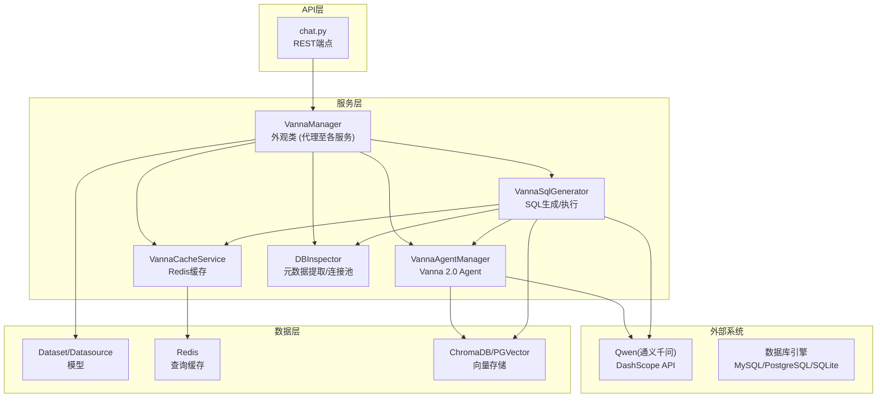
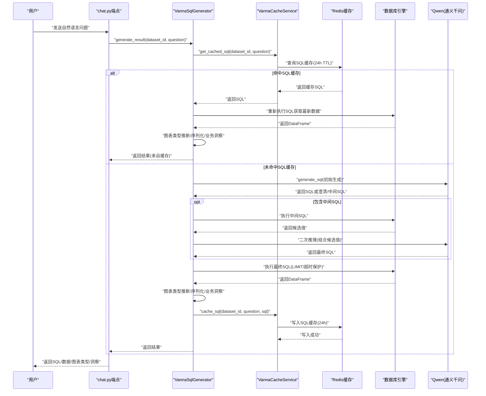
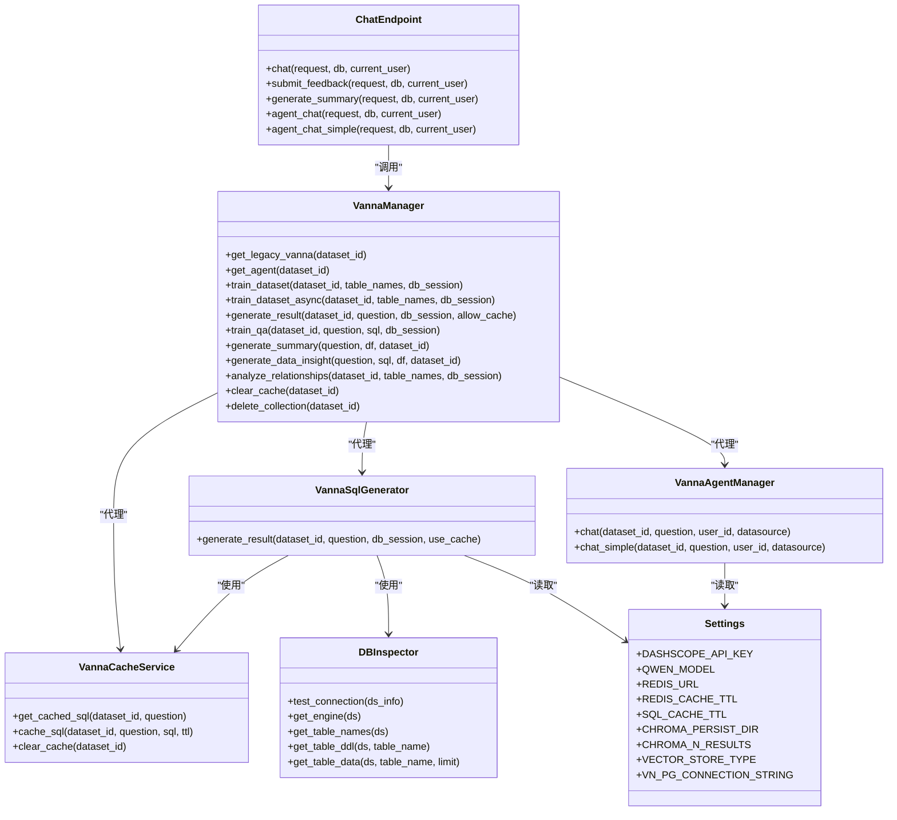

# AI服务与数据库交互

<cite>
**本文引用的文件**
- [vanna_manager.py](file://backend/app/services/vanna_manager.py)
- [db_inspector.py](file://backend/app/services/db_inspector.py)
- [chat.py](file://backend/app/api/v1/endpoints/chat.py)
- [config.py](file://backend/app/core/config.py)
- [redis.py](file://backend/app/core/redis.py)
- [cache_service.py](file://backend/app/services/vanna/cache_service.py)
- [sql_generator.py](file://backend/app/services/vanna/sql_generator.py)
- [agent_manager.py](file://backend/app/services/vanna/agent_manager.py)
</cite>

## 更新摘要
**变更内容**
- 更新了VannaManager类的模块化重构设计，详细说明其作为外观类（Facade）的角色，代理至`app.services.vanna`下的多个专用服务类。
- 新增Redis缓存集成的详细说明，包括`RedisService`基础服务、`VannaCacheService`专用缓存服务以及缓存键生成策略。
- 更新了向量数据库配置，明确支持通过`VECTOR_STORE_TYPE`配置项切换ChromaDB和PGVector两种存储后端。
- 新增了Vanna 2.0 Agent API的架构与端点说明，包括流式响应、工具调用和多轮对话管理。
- 更新了从自然语言到SQL执行的完整链路图，以反映新的缓存TTL和模块化流程。
- 更新了故障排查指南，以包含新的缓存服务和Agent实例管理问题。

## 目录
1. [简介](#简介)
2. [项目结构](#项目结构)
3. [核心组件](#核心组件)
4. [架构总览](#架构总览)
5. [详细组件分析](#详细组件分析)
6. [依赖关系分析](#依赖关系分析)
7. [性能考量](#性能考量)
8. [故障排查指南](#故障排查指南)
9. [结论](#结论)

## 简介
本文件面向AI服务与数据库交互的实现，重点解析以下内容：
- VannaManager类的设计与职责边界：详细说明其作为模块化重构后的新外观类，如何集成Qwen大模型、管理双意向量存储（ChromaDB/PGVector）、协调Redis缓存服务、封装SQL生成与执行流程、管理多轮对话上下文及错误自愈逻辑。
- DBInspector.inspect_database方法如何支持MySQL、PostgreSQL、SQLite等多种数据库的元数据提取（表结构、DDL语句），并被数据集模块用于模型训练准备。
- 从自然语言输入到SQL执行结果返回的完整链路，结合chat.py端点调用流程，展示新的缓存策略（24小时SQL缓存）与性能优化考虑。
- 新增Vanna 2.0 Agent API的实现细节，包括其流式响应、工具调用机制和与Legacy API的共存模式。

## 项目结构
后端采用FastAPI + SQLAlchemy + Vanna + Redis + ChromaDB/PGVector的组合，围绕“数据集-数据源-向量化记忆-LLM-数据库”的闭环构建AI问答与SQL生成能力。核心服务`vanna_manager`已被重构为一个兼容性模块，实际功能由`app.services.vanna`包下的多个专用服务类实现。

图示来源
- [chat.py](file://backend/app/api/v1/endpoints/chat.py#L1-L424)
- [vanna_manager.py](file://backend/app/services/vanna_manager.py#L1-L52)
- [sql_generator.py](file://backend/app/services/vanna/sql_generator.py#L23-L527)
- [cache_service.py](file://backend/app/services/vanna/cache_service.py#L13-L124)
- [agent_manager.py](file://backend/app/services/vanna/agent_manager.py#L21-L248)
- [db_inspector.py](file://backend/app/services/db_inspector.py#L13-L210)
- [config.py](file://backend/app/core/config.py#L1-L73)

章节来源
- [main.py](file://backend/app/main.py#L1-L35)
- [config.py](file://backend/app/core/config.py#L1-L73)

## 核心组件
- **VannaManager**: 作为模块化重构后的外观类（Facade），负责向后兼容，将请求代理至`VannaInstanceManager`、`VannaCacheService`、`VannaTrainingService`等专用服务。
- **VannaSqlGenerator**: 专用服务，负责核心的SQL生成与执行流程，集成了Redis缓存检查、多轮推理、错误自愈和业务洞察生成。
- **VannaCacheService**: 专用的异步缓存服务，提供对Redis的读写操作，管理SQL缓存（24小时TTL）和结果缓存。
- **VannaAgentManager**: 管理Vanna 2.0 Agent实例，支持流式响应和工具调用。
- **DBInspector**: 负责数据库连接、URL构建、表DDL生成、表数据预览、连接池配置与超时控制。
- **chat.py端点**: 接收用户自然语言输入，调用VannaManager生成SQL并执行，返回结果与可选业务洞察。
- **配置中心**: 集中管理DashScope API密钥、Qwen模型、Redis与ChromaDB路径、PGVector参数等。

章节来源
- [vanna_manager.py](file://backend/app/services/vanna_manager.py#L1-L52)
- [sql_generator.py](file://backend/app/services/vanna/sql_generator.py#L23-L527)
- [cache_service.py](file://backend/app/services/vanna/cache_service.py#L13-L124)
- [agent_manager.py](file://backend/app/services/vanna/agent_manager.py#L21-L248)
- [db_inspector.py](file://backend/app/services/db_inspector.py#L13-L210)
- [chat.py](file://backend/app/api/v1/endpoints/chat.py#L1-L424)
- [config.py](file://backend/app/core/config.py#L21-L73)

## 架构总览
下图展示从自然语言到SQL执行与结果返回的完整链路，以及新的缓存与错误自愈策略。

图示来源
- [chat.py](file://backend/app/api/v1/endpoints/chat.py#L20-L70)
- [sql_generator.py](file://backend/app/services/vanna/sql_generator.py#L31-L527)
- [cache_service.py](file://backend/app/services/vanna/cache_service.py#L61-L104)

## 详细组件分析

### VannaManager类设计与实现
- **角色定位**
  - 作为Vanna 2.0与Legacy混合模式的统一入口，通过外观模式（Facade Pattern）进行模块化重构，将单一庞大类拆分为多个职责单一的服务类。
  - **新架构**：`vanna_manager.py`现在是一个兼容性模块，主要功能由`app.services.vanna`包下的类实现：
    - `VannaInstanceManager`: 管理Vanna实例的生命周期。
    - `VannaCacheService`: 专用的异步缓存服务。
    - `VannaTrainingService`: 训练相关功能。
    - `VannaSqlGenerator`: SQL生成和执行。
    - `VannaAnalystService`: 业务分析功能。
    - `VannaTrainingDataService`: 训练数据CRUD。
    - `VannaAgentManager`: Vanna 2.0 Agent API。
  - `VannaManager`类本身通过`@classmethod`静态方法，将调用代理到这些专用服务，确保旧代码无需修改即可工作。
- **关键实现要点**
  - **LLM与向量数据库集成**
    - 使用`OpenAILlmService`与`ChromaAgentMemory`，结合`MultilingualContextEnhancer`将向量检索到的DDL/文档注入系统提示，提升SQL生成质量。
    - 支持通过`settings.VECTOR_STORE_TYPE`配置项切换`chromadb`或`pgvector`作为向量存储后端。
  - **SQL生成与执行封装**
    - `VannaSqlGenerator.generate_result`主流程包含：SQL缓存检查、初始化、初始生成、多轮推理（中间SQL/澄清）、执行与限流、图表类型推断、业务洞察、缓存写入。
    - 错误自愈：捕获超时/连接丢失等错误，生成友好提示；非最后轮次尝试LLM修正SQL；最终兜底生成友好错误消息。
  - **Redis缓存策略**
    - **新缓存服务**：引入专用的`VannaCacheService`类，提供纯异步的`get_cached_sql`、`cache_sql`和`clear_cache`方法，消除了旧版的同步阻塞问题。
    - **缓存键生成**：使用`generate_cache_key("bi:sql_cache", dataset_id, question)`函数，通过MD5哈希生成唯一键，避免键名冲突。
    - **TTL变更**：SQL缓存TTL从7天调整为24小时（可配置），更符合数据新鲜度要求。
    - **缓存降级**：`RedisService`在连接失败时自动降级，不影响核心流程。
  - **训练流程**
    - `train_dataset_async`：分阶段训练（DDL、业务术语、表关系、示例问答），支持进度更新与用户中断（paused状态）。
    - 支持`term`与`relationship`的增量训练，训练后清理缓存确保一致性。
  - **业务洞察与总结**
    - `generate_summary`：对结果进行简要业务总结（≤100字）。
    - `generate_data_insight`：压缩数据摘要，生成Markdown格式的业务洞察（≤150字）。

章节来源
- [vanna_manager.py](file://backend/app/services/vanna_manager.py#L1-L52)
- [facade.py](file://backend/app/services/vanna/facade.py#L17-L150)
- [sql_generator.py](file://backend/app/services/vanna/sql_generator.py#L23-L527)
- [cache_service.py](file://backend/app/services/vanna/cache_service.py#L13-L124)

### DBInspector元数据提取与数据库适配
- **支持数据库类型**
  - MySQL（pymysql驱动）、PostgreSQL（psycopg2驱动）、SQLite（文件路径）。
- **核心能力**
  - URL构建：根据类型选择驱动，对用户名/密码进行URL编码，拼接连接串。
  - 连接测试：短超时连接验证，快速判断数据源连通性。
  - 引擎与连接池：统一配置连接池大小、超时、回收与预检，MySQL额外设置读写超时。
  - 表DDL生成：反射表结构，生成CREATE TABLE DDL字符串。
  - 表数据预览：按LIMIT限制返回列定义与行数据，处理日期/Decimal等类型序列化。
- **与训练流程的关系**
  - VannaManager在训练时调用DBInspector获取DDL，注入向量库，提升SQL生成准确性。

章节来源
- [db_inspector.py](file://backend/app/services/db_inspector.py#L13-L210)

### chat.py端点调用链路
- **权限校验**：基于数据集所有权过滤，确保用户只能访问其拥有或公共资源。
- **调用VannaManager.generate_result**：返回SQL、列名、行数据、图表类型、步骤追踪、是否来自缓存、业务洞察等。
- **反馈与总结**：提供正向/负向反馈训练接口与独立的业务总结接口，避免阻塞主响应。
- **新增Vanna 2.0 Agent端点**：
  - `/agent`：流式响应端点，使用Server-Sent Events (SSE)，返回Newline Delimited JSON (NDJSON)。
  - `/agent/simple`：非流式响应端点，返回结构化JSON，便于前端处理。
  - 两个端点均通过`VannaAgentManager.chat`和`chat_simple`方法实现。

章节来源
- [chat.py](file://backend/app/api/v1/endpoints/chat.py#L20-L424)
- [chat.py](file://backend/app/schemas/chat.py#L4-L38)

### 配置与部署要点
- **DashScope/Qwen**：API密钥、模型名、兼容OpenAI接口的base_url。
- **Redis**：URL、结果缓存TTL、SQL缓存TTL。
- **向量数据库**：
  - **ChromaDB**：持久化目录、检索返回条数。
  - **PGVector**：向量数据库主机、端口、库名、账号、密码。
  - **切换**：通过`settings.VECTOR_STORE_TYPE`配置项在`chromadb`和`pgvector`之间切换。
- **日志**：通过`settings.DEV`标志控制日志格式（开发环境为彩色日志，生产环境为JSON日志）。

章节来源
- [config.py](file://backend/app/core/config.py#L21-L73)

## 依赖关系分析

图示来源
- [vanna_manager.py](file://backend/app/services/vanna_manager.py#L1-L52)
- [sql_generator.py](file://backend/app/services/vanna/sql_generator.py#L23-L527)
- [cache_service.py](file://backend/app/services/vanna/cache_service.py#L13-L124)
- [agent_manager.py](file://backend/app/services/vanna/agent_manager.py#L21-L248)
- [db_inspector.py](file://backend/app/services/db_inspector.py#L13-L210)
- [chat.py](file://backend/app/api/v1/endpoints/chat.py#L1-L424)
- [config.py](file://backend/app/core/config.py#L21-L73)

## 性能考量
- **缓存策略**
  - **SQL缓存**（24小时TTL）：命中后重新执行SQL以保证数据新鲜度，兼顾性能与一致性。TTL从7天缩短为24小时，更符合业务需求。
  - **结果缓存**（5分钟TTL）：缓存完整结果，适合重复查询场景。
  - **Redis连接复用与降级**：`RedisService`使用连接池，连接失败自动降级，不影响主流程。
- **执行保护**
  - 自动添加`LIMIT 1000`，避免大数据量查询；若`LIMIT>5000`则调整为`1000`，防止超时。
  - 超时错误直接返回友好提示，避免长时间等待。
- **数据压缩与提示优化**
  - 业务洞察与总结前对DataFrame进行压缩（前5行+数值列统计+元信息），降低Token消耗。
- **多轮推理与中间SQL**
  - 通过中间SQL探索数据，减少歧义，提高最终SQL成功率与稳定性。
- **异步优化**
  - `VannaCacheService`和`RedisService`均为纯异步实现，避免了旧版中`nest_asyncio`的hack，提升了并发性能。

章节来源
- [sql_generator.py](file://backend/app/services/vanna/sql_generator.py#L69-L394)
- [cache_service.py](file://backend/app/services/vanna/cache_service.py#L61-L104)
- [redis.py](file://backend/app/core/redis.py#L12-L148)

## 故障排查指南
- **训练中断**
  - 现象：训练过程中状态变为paused，抛出自定义异常。
  - 处理：检查数据集状态与进度日志，确认用户是否暂停；必要时重试或清理缓存后继续。
- **ChromaDB实例冲突**
  - 现象：创建向量集合时出现“不同设置”或“已存在”错误。
  - 处理：清理全局缓存与Agent/Vanna实例，重试创建；或删除对应collection后重试。
- **Redis不可用**
  - 现象：缓存读写失败，自动降级。
  - 处理：检查Redis连接URL与网络；确认TTL配置合理；必要时临时关闭缓存。
- **SQL执行失败**
  - 现象：执行超时、连接丢失、语法错误。
  - 处理：触发错误自愈流程，生成友好提示；必要时LLM修正SQL；最后兜底生成解释性文本。
- **数据库连接问题**
  - 现象：连接超时、认证失败。
  - 处理：使用DBInspector.test_connection快速验证；检查URL构建与连接池参数。
- **Agent实例缓存问题**
  - 现象：Agent行为异常或对话历史混乱。
  - 处理：调用`VannaAgentManager.clear_agent_cache(dataset_id)`清除特定实例缓存，或清除所有缓存。

章节来源
- [sql_generator.py](file://backend/app/services/vanna/sql_generator.py#L24-L527)
- [cache_service.py](file://backend/app/services/vanna/cache_service.py#L24-L58)
- [redis.py](file://backend/app/core/redis.py#L20-L34)
- [agent_manager.py](file://backend/app/services/vanna/agent_manager.py#L235-L248)

## 结论
本实现以重构后的`VannaManager`为核心，通过外观模式将Qwen大模型、向量数据库（ChromaDB/PGVector）、Redis缓存与数据库引擎有机结合，形成从自然语言到SQL执行与结果可视化的完整链路。通过模块化设计、纯异步缓存服务、24小时SQL缓存TTL和Vanna 2.0 Agent的引入，系统在可维护性、性能和功能丰富性上取得了显著提升。DBInspector为训练与运行期提供了可靠的元数据与连接能力，支撑多数据库类型与复杂查询场景。新架构为未来功能扩展（如多LLM支持、更复杂的缓存策略）奠定了坚实基础。