# Vanna服务架构重构

<cite>
**本文档引用的文件**   
- [main.py](file://backend/app/main.py)
- [facade.py](file://backend/app/services/vanna/facade.py)
- [base.py](file://backend/app/services/vanna/base.py)
- [analyst_service.py](file://backend/app/services/vanna/analyst_service.py)
- [cache_service.py](file://backend/app/services/vanna/cache_service.py)
- [training_service.py](file://backend/app/services/vanna/training_service.py)
- [sql_generator.py](file://backend/app/services/vanna/sql_generator.py)
- [instance_manager.py](file://backend/app/services/vanna/instance_manager.py)
- [training_data_service.py](file://backend/app/services/vanna/training_data_service.py)
- [chat.py](file://backend/app/api/v1/endpoints/chat.py)
- [config.py](file://backend/app/core/config.py)
- [utils.py](file://backend/app/services/vanna/utils.py)
- [metadata.py](file://backend/app/models/metadata.py)
- [chat.py](file://backend/app/schemas/chat.py)
- [vanna_manager.py](file://backend/app/services/vanna_manager.py)
</cite>

## 目录
1. [项目结构](#项目结构)
2. [核心组件](#核心组件)
3. [Vanna服务架构](#vanna服务架构)
4. [详细组件分析](#详细组件分析)
5. [依赖关系分析](#依赖关系分析)
6. [性能考虑](#性能考虑)
7. [故障排除指南](#故障排除指南)
8. [结论](#结论)

## 项目结构

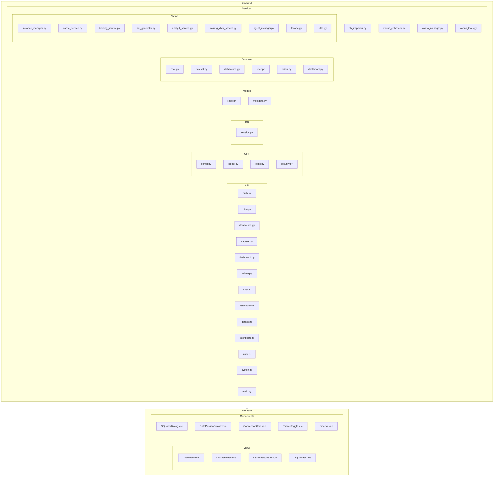

**图示来源**
- [main.py](file://backend/app/main.py#L1-L166)
- [metadata.py](file://backend/app/models/metadata.py#L1-L131)

**本节来源**
- [main.py](file://backend/app/main.py#L1-L166)
- [metadata.py](file://backend/app/models/metadata.py#L1-L131)

## 核心组件

Vanna服务架构重构的核心是将原有的单体式VannaManager类拆分为多个职责单一的服务模块，通过外观模式（Facade Pattern）保持向后兼容性。这种重构方式提高了代码的可维护性、可测试性和可扩展性。

主要核心组件包括：
- **VannaManager**：外观类，提供统一的API接口
- **VannaInstanceManager**：实例生命周期管理
- **VannaCacheService**：Redis缓存服务
- **VannaTrainingService**：训练服务
- **VannaSqlGenerator**：SQL生成器
- **VannaAnalystService**：分析服务
- **VannaTrainingDataService**：训练数据服务

这些组件通过清晰的职责划分，实现了高内聚低耦合的设计原则。

**本节来源**
- [facade.py](file://backend/app/services/vanna/facade.py#L1-L152)
- [vanna_manager.py](file://backend/app/services/vanna_manager.py#L1-L52)

## Vanna服务架构

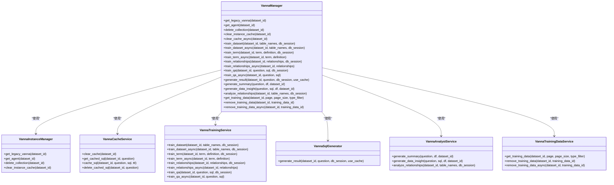

**图示来源**
- [facade.py](file://backend/app/services/vanna/facade.py#L1-L152)
- [instance_manager.py](file://backend/app/services/vanna/instance_manager.py#L1-L289)
- [cache_service.py](file://backend/app/services/vanna/cache_service.py#L1-L126)
- [training_service.py](file://backend/app/services/vanna/training_service.py#L1-L392)
- [sql_generator.py](file://backend/app/services/vanna/sql_generator.py#L1-L529)
- [analyst_service.py](file://backend/app/services/vanna/analyst_service.py#L1-L353)
- [training_data_service.py](file://backend/app/services/vanna/training_data_service.py#L1-L338)

**本节来源**
- [facade.py](file://backend/app/services/vanna/facade.py#L1-L152)

## 详细组件分析

### VannaManager外观类分析

VannaManager作为外观类，提供了统一的API接口，代理到各个拆分后的服务模块。它保持了与原有VannaManager类相同的接口，确保了向后兼容性。

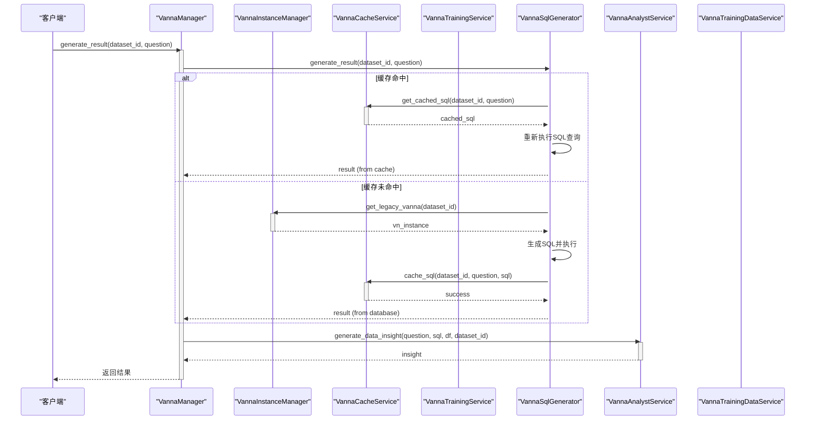

**图示来源**
- [facade.py](file://backend/app/services/vanna/facade.py#L1-L152)
- [sql_generator.py](file://backend/app/services/vanna/sql_generator.py#L1-L529)
- [cache_service.py](file://backend/app/services/vanna/cache_service.py#L1-L126)
- [analyst_service.py](file://backend/app/services/vanna/analyst_service.py#L1-L353)

**本节来源**
- [facade.py](file://backend/app/services/vanna/facade.py#L1-L152)

### VannaInstanceManager实例管理分析

VannaInstanceManager负责管理Vanna实例的生命周期，使用单例模式确保同一数据集的实例复用。它支持ChromaDB和PGVector两种向量存储后端。

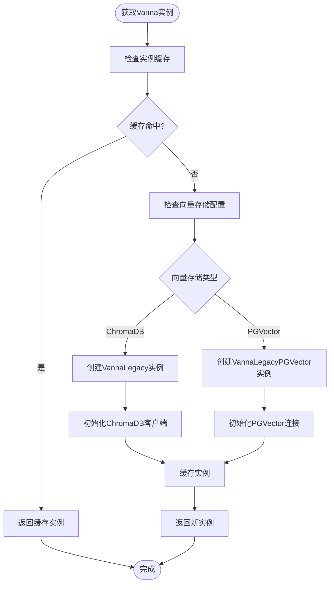

**图示来源**
- [instance_manager.py](file://backend/app/services/vanna/instance_manager.py#L1-L289)
- [base.py](file://backend/app/services/vanna/base.py#L1-L364)

**本节来源**
- [instance_manager.py](file://backend/app/services/vanna/instance_manager.py#L1-L289)

### VannaCacheService缓存服务分析

VannaCacheService提供纯异步的Redis缓存服务，用于SQL查询缓存，消除了nest_asyncio的使用。

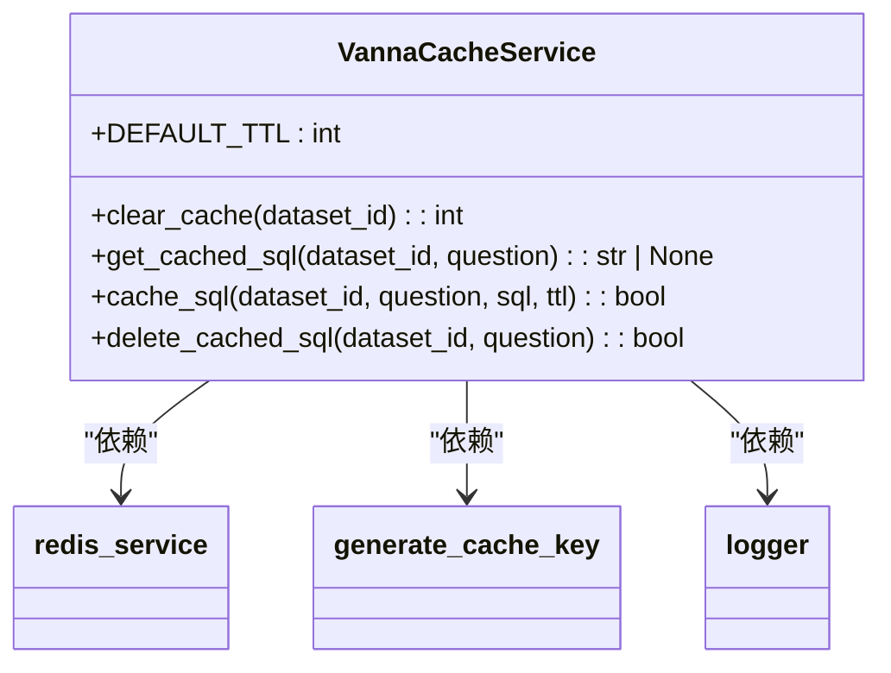

**图示来源**
- [cache_service.py](file://backend/app/services/vanna/cache_service.py#L1-L126)
- [main.py](file://backend/app/main.py#L1-L166)

**本节来源**
- [cache_service.py](file://backend/app/services/vanna/cache_service.py#L1-L126)

### VannaTrainingService训练服务分析

VannaTrainingService提供数据集训练、业务术语训练、表关系训练等功能，支持进度更新和中断控制。

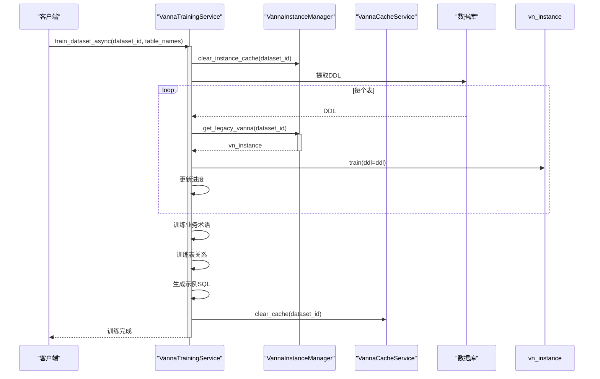

**图示来源**
- [training_service.py](file://backend/app/services/vanna/training_service.py#L1-L392)
- [instance_manager.py](file://backend/app/services/vanna/instance_manager.py#L1-L289)
- [cache_service.py](file://backend/app/services/vanna/cache_service.py#L1-L126)

**本节来源**
- [training_service.py](file://backend/app/services/vanna/training_service.py#L1-L392)

### VannaSqlGenerator SQL生成器分析

VannaSqlGenerator提供智能SQL生成、多轮对话反思循环、缓存管理等功能。

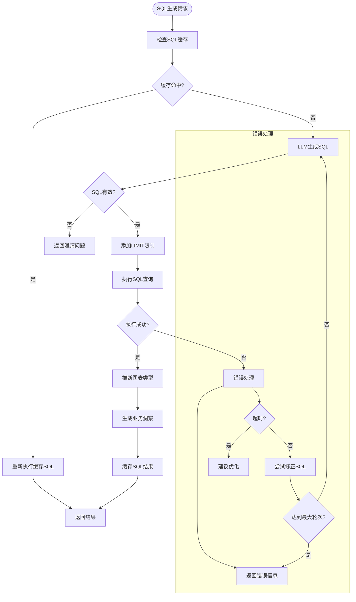

**图示来源**
- [sql_generator.py](file://backend/app/services/vanna/sql_generator.py#L1-L529)
- [utils.py](file://backend/app/services/vanna/utils.py#L1-L285)

**本节来源**
- [sql_generator.py](file://backend/app/services/vanna/sql_generator.py#L1-L529)

### VannaAnalystService分析服务分析

VannaAnalystService提供业务分析、数据洞察和表关系分析功能。

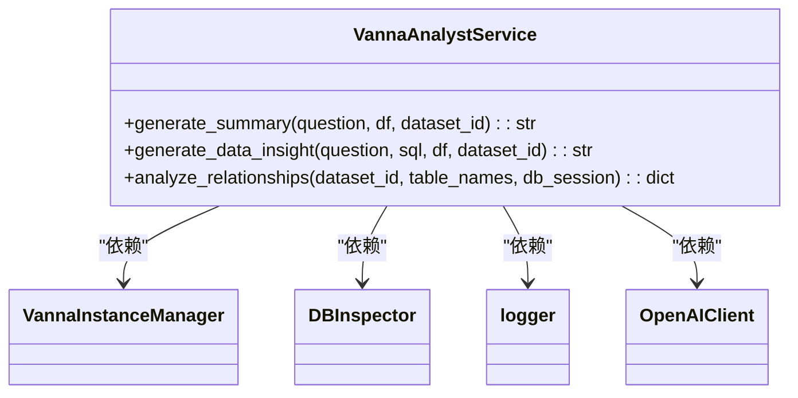

**图示来源**
- [analyst_service.py](file://backend/app/services/vanna/analyst_service.py#L1-L353)
- [instance_manager.py](file://backend/app/services/vanna/instance_manager.py#L1-L289)

**本节来源**
- [analyst_service.py](file://backend/app/services/vanna/analyst_service.py#L1-L353)

### VannaTrainingDataService训练数据服务分析

VannaTrainingDataService提供训练数据的CRUD操作，支持ChromaDB和PGVector两种后端。

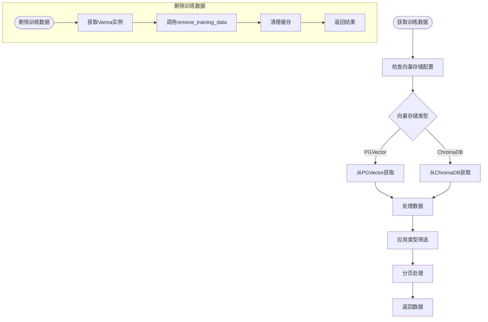

**图示来源**
- [training_data_service.py](file://backend/app/services/vanna/training_data_service.py#L1-L338)
- [instance_manager.py](file://backend/app/services/vanna/instance_manager.py#L1-L289)

**本节来源**
- [training_data_service.py](file://backend/app/services/vanna/training_data_service.py#L1-L338)

## 依赖关系分析

```mermaid
graph TD
backend.app.main[main]:::module
backend.app.main.app[app]:::variable
backend.app.main.lifespan[lifespan]:::function
backend.app.main.logging_middleware[logging_middleware]:::function
backend.app.services.vanna.facade[VannaManager]:::CLASS
backend.app.services.vanna.instance_manager[VannaInstanceManager]:::CLASS
backend.app.services.vanna.cache_service[VannaCacheService]:::CLASS
backend.app.services.vanna.training_service[VannaTrainingService]:::CLASS
backend.app.services.vanna.sql_generator[VannaSqlGenerator]:::CLASS
backend.app.services.vanna.analyst_service[VannaAnalystService]:::CLASS
backend.app.services.vanna.training_data_service[VannaTrainingDataService]:::CLASS
backend.app.services.vanna.base[VannaLegacy]:::CLASS
backend.app.services.vanna.base[VannaLegacyPGVector]:::CLASS
backend.app.api.v1.endpoints.chat[chat]:::module
backend.app.api.v1.endpoints.chat.chat[chat]:::function
backend.app.api.v1.endpoints.chat.submit_feedback[submit_feedback]:::function
backend.app.api.v1.endpoints.chat.generate_summary[generate_summary]:::function
backend.app.main.app --> backend.app.api.v1.endpoints.chat.chat
backend.app.api.v1.endpoints.chat.chat --> backend.app.services.vanna.sql_generator.generate_result
backend.app.api.v1.endpoints.chat.submit_feedback --> backend.app.services.vanna.training_service.train_qa
backend.app.api.v1.endpoints.chat.generate_summary --> backend.app.services.vanna.analyst_service.generate_summary
backend.app.services.vanna.facade.VannaManager --> backend.app.services.vanna.instance_manager
backend.app.services.vanna.facade.VannaManager --> backend.app.services.vanna.cache_service
backend.app.services.vanna.facade.VannaManager --> backend.app.services.vanna.training_service
backend.app.services.vanna.facade.VannaManager --> backend.app.services.vanna.sql_generator
backend.app.services.vanna.facade.VannaManager --> backend.app.services.vanna.analyst_service
backend.app.services.vanna.facade.VannaManager --> backend.app.services.vanna.training_data_service
backend.app.services.vanna.sql_generator.VannaSqlGenerator --> backend.app.services.vanna.instance_manager.get_legacy_vanna
backend.app.services.vanna.sql_generator.VannaSqlGenerator --> backend.app.services.vanna.cache_service.get_cached_sql
backend.app.services.vanna.sql_generator.VannaSqlGenerator --> backend.app.services.vanna.cache_service.cache_sql
backend.app.services.vanna.sql_generator.VannaSqlGenerator --> backend.app.services.vanna.analyst_service.generate_data_insight
backend.app.services.vanna.training_service.VannaTrainingService --> backend.app.services.vanna.instance_manager.get_legacy_vanna
backend.app.services.vanna.training_service.VannaTrainingService --> backend.app.services.vanna.cache_service.clear_cache
backend.app.services.vanna.analyst_service.VannaAnalystService --> backend.app.services.vanna.instance_manager.get_legacy_vanna
backend.app.services.vanna.training_data_service.VannaTrainingDataService --> backend.app.services.vanna.instance_manager.get_legacy_vanna
backend.app.services.vanna.training_data_service.VannaTrainingDataService --> backend.app.services.vanna.cache_service.clear_cache
backend.app.services.vanna.instance_manager.VannaInstanceManager --> backend.app.core.config.settings
backend.app.services.vanna.instance_manager.VannaInstanceManager --> backend.app.services.vanna.base.VannaLegacy
backend.app.services.vanna.instance_manager.VannaInstanceManager --> backend.app.services.vanna.base.VannaLegacyPGVector
classDef module fill:#f9f,stroke:#333,stroke-width:1px;
classDef CLASS fill:#bbf,stroke:#333,stroke-width:1px;
classDef function fill:#f96,stroke:#333,stroke-width:1px;
classDef variable fill:#9f9,stroke:#333,stroke-width:1px;
```

**图示来源**
- [main.py](file://backend/app/main.py#L1-L166)
- [facade.py](file://backend/app/services/vanna/facade.py#L1-L152)
- [instance_manager.py](file://backend/app/services/vanna/instance_manager.py#L1-L289)
- [cache_service.py](file://backend/app/services/vanna/cache_service.py#L1-L126)
- [training_service.py](file://backend/app/services/vanna/training_service.py#L1-L392)
- [sql_generator.py](file://backend/app/services/vanna/sql_generator.py#L1-L529)
- [analyst_service.py](file://backend/app/services/vanna/analyst_service.py#L1-L353)
- [training_data_service.py](file://backend/app/services/vanna/training_data_service.py#L1-L338)
- [chat.py](file://backend/app/api/v1/endpoints/chat.py#L1-L424)

**本节来源**
- [main.py](file://backend/app/main.py#L1-L166)
- [facade.py](file://backend/app/services/vanna/facade.py#L1-L152)

## 性能考虑

Vanna服务架构在性能方面进行了多项优化：

1. **缓存策略**：使用Redis缓存SQL查询结果，减少重复查询的开销
2. **异步处理**：关键操作采用异步实现，提高并发处理能力
3. **实例缓存**：Vanna实例采用单例模式，避免重复创建的开销
4. **连接池**：数据库连接使用连接池管理，减少连接创建的开销
5. **分页查询**：训练数据查询支持分页，避免一次性加载大量数据

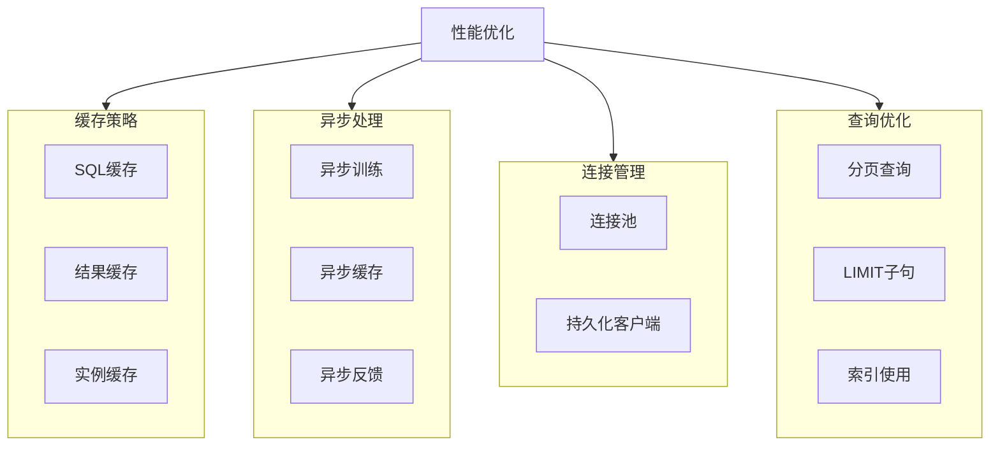

**图示来源**
- [cache_service.py](file://backend/app/services/vanna/cache_service.py#L1-L126)
- [training_service.py](file://backend/app/services/vanna/training_service.py#L1-L392)
- [sql_generator.py](file://backend/app/services/vanna/sql_generator.py#L1-L529)
- [instance_manager.py](file://backend/app/services/vanna/instance_manager.py#L1-L289)

**本节来源**
- [cache_service.py](file://backend/app/services/vanna/cache_service.py#L1-L126)

## 故障排除指南

### 常见问题及解决方案

| 问题现象 | 可能原因 | 解决方案 |
|---------|--------|---------|
| SQL生成失败 | LLM服务不可用 | 检查DASHSCOPE_API_KEY配置 |
| 缓存无法清除 | Redis连接失败 | 检查REDIS_URL配置 |
| 训练进度卡住 | 数据库连接超时 | 检查数据源配置 |
| 图表类型推断错误 | 数据结构异常 | 检查查询结果数据 |
| 业务洞察生成失败 | LLM服务响应超时 | 调整QWEN_MODEL配置 |

### 错误处理流程

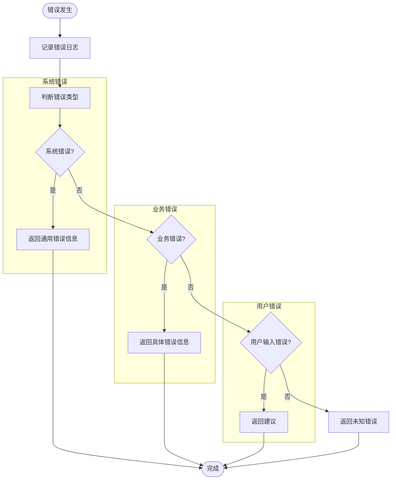

**图示来源**
- [sql_generator.py](file://backend/app/services/vanna/sql_generator.py#L1-L529)
- [training_service.py](file://backend/app/services/vanna/training_service.py#L1-L392)

**本节来源**
- [sql_generator.py](file://backend/app/services/vanna/sql_generator.py#L1-L529)

## 结论

Vanna服务架构重构通过模块化设计，将原有的单体式VannaManager类拆分为多个职责单一的服务模块，实现了高内聚低耦合的设计原则。这种重构方式带来了以下优势：

1. **可维护性提升**：每个服务模块职责单一，代码更易于理解和维护
2. **可测试性增强**：独立的服务模块可以单独进行单元测试
3. **可扩展性提高**：新的功能可以作为独立模块添加，不影响现有代码
4. **向后兼容性**：通过外观模式保持了与原有接口的兼容性
5. **性能优化**：通过缓存、异步处理等机制提升了系统性能

重构后的架构为未来的功能扩展和性能优化奠定了良好的基础，同时也为团队协作开发提供了更好的支持。