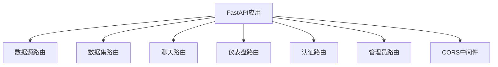
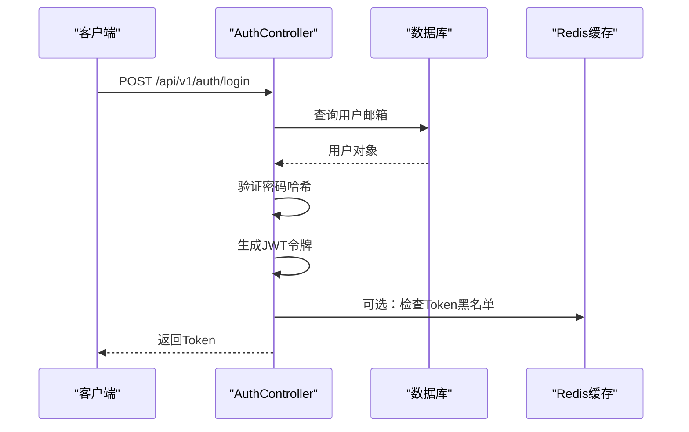
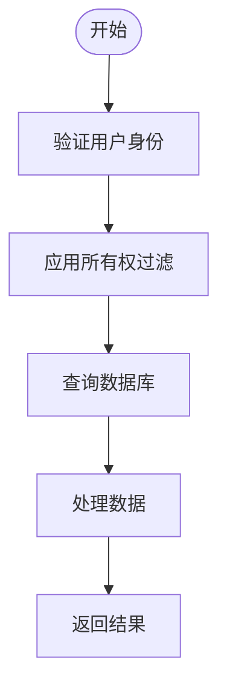
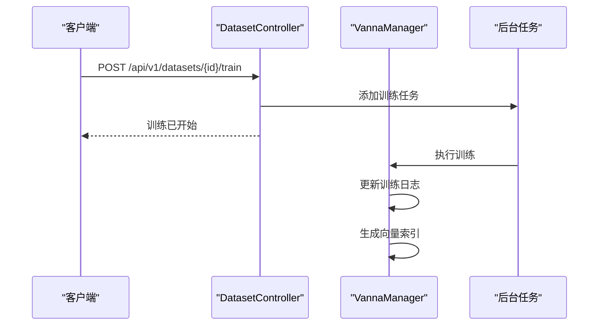
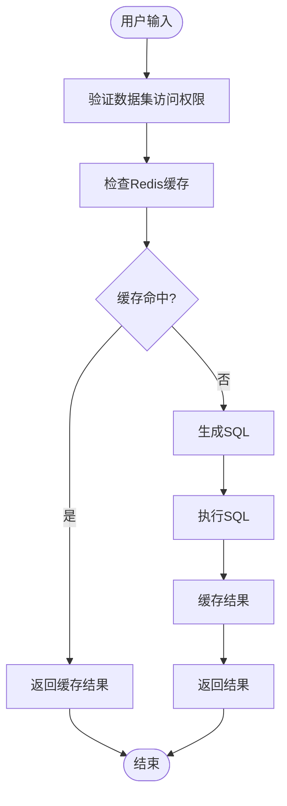
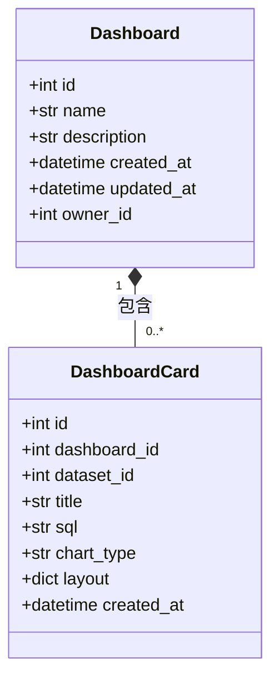
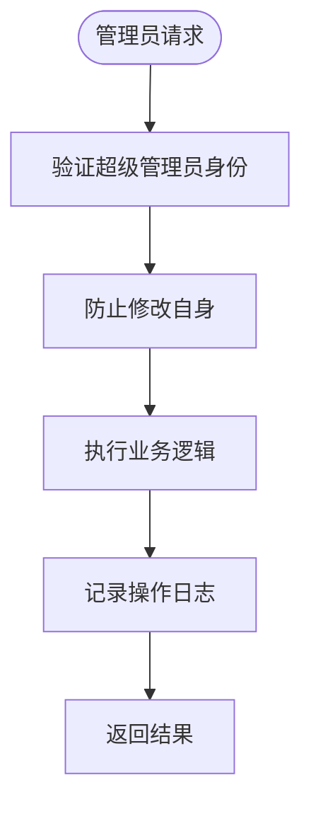
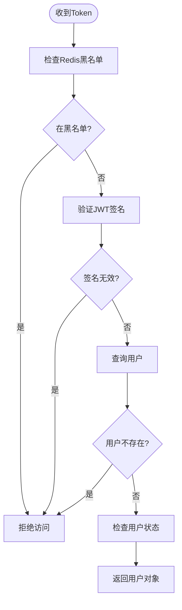

# API端点与路由

<cite>
**本文档引用的文件**  
- [main.py](file://backend/app/main.py)
- [auth.py](file://backend/app/api/v1/endpoints/auth.py)
- [datasource.py](file://backend/app/api/v1/endpoints/datasource.py)
- [dataset.py](file://backend/app/api/v1/endpoints/dataset.py)
- [chat.py](file://backend/app/api/v1/endpoints/chat.py)
- [dashboard.py](file://backend/app/api/v1/endpoints/dashboard.py)
- [admin.py](file://backend/app/api/v1/endpoints/admin.py)
- [deps.py](file://backend/app/api/deps.py)
- [config.py](file://backend/app/core/config.py)
- [datasource.py](file://backend/app/schemas/datasource.py)
- [dataset.py](file://backend/app/schemas/dataset.py)
- [chat.py](file://backend/app/schemas/chat.py)
- [dashboard.py](file://backend/app/schemas/dashboard.py)
- [token.py](file://backend/app/schemas/token.py)
- [user.py](file://backend/app/schemas/user.py)
</cite>

## 目录
1. [API初始化与路由注册](#api初始化与路由注册)
2. [认证端点](#认证端点)
3. [数据源端点](#数据源端点)
4. [数据集端点](#数据集端点)
5. [聊天与查询端点](#聊天与查询端点)
6. [仪表盘端点](#仪表盘端点)
7. [管理员端点](#管理员端点)
8. [依赖注入与安全控制](#依赖注入与安全控制)

## API初始化与路由注册

FastAPI应用在`main.py`中进行初始化，并通过模块化方式注册v1版本的API路由。系统使用`API_V1_STR`配置项（默认为`/api/v1`）作为所有API的前缀，并为每个功能模块设置独立的标签，便于在OpenAPI文档中组织和展示。

**图示来源**
- [main.py](file://backend/app/main.py#L1-L35)

**本节来源**
- [main.py](file://backend/app/main.py#L1-L35)
- [config.py](file://backend/app/core/config.py#L1-L51)

## 认证端点

`auth.py`模块实现了基于OAuth2的用户认证流程，包括登录、注册、登出和获取当前用户信息等功能。系统使用JWT（JSON Web Token）进行身份验证，并通过Redis实现Token黑名单机制，支持用户登出后立即失效Token。

### 登录与Token生成
用户通过`/api/v1/auth/login`端点进行登录，系统验证邮箱和密码后，为用户生成JWT访问令牌。令牌包含用户邮箱作为主体（subject），并设置过期时间（由`ACCESS_TOKEN_EXPIRE_MINUTES`配置，默认30分钟）。

### 用户注册
`/api/v1/auth/register`端点允许新用户注册。系统会检查邮箱是否已存在，对密码进行哈希加密后存储，并创建用户记录。

### 用户登出
`/api/v1/auth/logout`端点将当前用户的Token加入Redis黑名单，实现Token的立即失效。若Redis不可用，系统会降级处理，但仍返回成功响应。

### 获取用户信息
`/api/v1/auth/me`端点返回当前登录用户的详细信息，包括权限字段（如`is_superuser`），用于前端界面的权限控制。

**图示来源**
- [auth.py](file://backend/app/api/v1/endpoints/auth.py#L1-L147)
- [deps.py](file://backend/app/api/deps.py#L1-L124)

**本节来源**
- [auth.py](file://backend/app/api/v1/endpoints/auth.py#L1-L147)
- [token.py](file://backend/app/schemas/token.py#L1-L10)
- [user.py](file://backend/app/schemas/user.py#L1-L65)

## 数据源端点

`datasource.py`模块提供了对数据源的完整CRUD操作，包括测试连接、创建、读取、删除以及获取表结构和数据预览等功能。所有操作均应用数据所有权控制，确保用户只能访问自己的或公共资源。

### 核心功能
- **测试连接** (`/test`): 在不保存的情况下测试数据源连接。
- **创建数据源** (`/`): 加密密码后创建新的数据源记录。
- **读取数据源** (`/`): 获取用户有权限的数据源列表。
- **删除数据源** (`/{id}`): 删除指定ID的数据源，超级管理员可删除任何资源。
- **获取表结构** (`/{id}/tables`): 返回数据源中所有表的名称和列信息。
- **预览表数据** (`/{id}/tables/{table_name}/preview`): 返回指定表的前几行数据。

### 数据隔离
所有端点通过`apply_ownership_filter`依赖函数实现数据隔离，普通用户只能查看`owner_id`为自己或为`NULL`（公共资源）的数据源。

**图示来源**
- [datasource.py](file://backend/app/api/v1/endpoints/datasource.py#L1-L182)
- [deps.py](file://backend/app/api/deps.py#L97-L124)

**本节来源**
- [datasource.py](file://backend/app/api/v1/endpoints/datasource.py#L1-L182)
- [datasource.py](file://backend/app/schemas/datasource.py#L1-L34)

## 数据集端点

`dataset.py`模块管理数据集的生命周期，包括创建、训练、业务术语管理、建模配置和训练进度监控。数据集是连接数据源和AI分析的核心实体。

### 核心功能
- **创建数据集** (`/`): 创建与特定数据源关联的数据集。
- **训练数据集** (`/{id}/train`): 触发后台任务对数据集进行训练，生成向量索引。
- **管理业务术语** (`/{id}/terms`): 添加、列出和删除业务术语，用于增强AI理解。
- **分析表关系** (`/analyze`): 使用AI分析数据源中表之间的潜在关系。
- **创建视图** (`/create_view`): 在数据库中创建物化视图以优化查询性能。
- **训练进度管理**: 提供获取进度、日志、训练数据、暂停和删除训练数据等功能。

### 后台任务
训练任务通过`BackgroundTasks`异步执行，确保API响应不被长时间阻塞。系统使用`run_training_task`包装函数确保每个任务有独立的数据库会话。

**图示来源**
- [dataset.py](file://backend/app/api/v1/endpoints/dataset.py#L1-L800)
- [deps.py](file://backend/app/api/deps.py#L97-L124)

**本节来源**
- [dataset.py](file://backend/app/api/v1/endpoints/dataset.py#L1-L800)
- [dataset.py](file://backend/app/schemas/dataset.py#L1-L120)

## 聊天与查询端点

`chat.py`模块实现了自然语言到SQL的转换和执行流程，支持多轮会话、用户反馈和AI生成摘要。

### 核心功能
- **自然语言查询** (`/`): 接收用户问题，生成SQL并执行，返回结果和图表类型。
- **用户反馈** (`/feedback`): 收集用户对生成SQL的反馈，正反馈或修正后的SQL将用于重新训练AI模型。
- **生成摘要** (`/summary`): 基于查询结果生成AI驱动的业务摘要。

### 多轮会话处理
系统通过`VannaManager.generate_result`处理复杂的多轮会话，能够理解上下文并生成准确的SQL。查询结果可从Redis缓存中获取，提高响应速度。

**图示来源**
- [chat.py](file://backend/app/api/v1/endpoints/chat.py#L1-L156)
- [deps.py](file://backend/app/api/deps.py#L97-L124)

**本节来源**
- [chat.py](file://backend/app/api/v1/endpoints/chat.py#L1-L156)
- [chat.py](file://backend/app/schemas/chat.py#L1-L38)

## 仪表盘端点

`dashboard.py`模块支持创建和管理数据可视化仪表盘，包括看板和卡片的CRUD操作。

### 核心功能
- **创建看板** (`/`): 创建新的空看板。
- **添加卡片** (`/{id}/cards`): 将查询结果作为卡片添加到看板。
- **获取卡片数据** (`/cards/{id}/data`): 执行卡片关联的SQL并返回结果。
- **删除操作**: 支持删除卡片和整个看板。

### 数据执行
`get_card_data`端点直接连接到数据源数据库执行SQL，并对结果进行序列化处理，确保日期、小数等特殊类型能正确传输。

**图示来源**
- [dashboard.py](file://backend/app/api/v1/endpoints/dashboard.py#L1-L261)
- [deps.py](file://backend/app/api/deps.py#L97-L124)

**本节来源**
- [dashboard.py](file://backend/app/api/v1/endpoints/dashboard.py#L1-L261)
- [dashboard.py](file://backend/app/schemas/dashboard.py#L1-L51)

## 管理员端点

`admin.py`模块提供管理员专属接口，用于用户管理和全局资源查看。

### 核心功能
- **用户列表** (`/users`): 分页获取所有用户，支持按邮箱或姓名搜索。
- **用户状态管理** (`/users/{user_id}/status`): 封禁或解封用户账户。
- **软删除用户** (`/users/{user_id}`): 标记用户为已删除状态，不物理删除数据。
- **修改用户信息** (`/users/{user_id}`): 修改用户昵称、密码或角色。

### 权限控制
所有管理员端点使用`get_current_superuser`依赖，确保只有超级管理员才能访问。系统还防止管理员修改自己的账户状态或信息。

**图示来源**
- [admin.py](file://backend/app/api/v1/endpoints/admin.py#L1-L232)
- [deps.py](file://backend/app/api/deps.py#L83-L94)

**本节来源**
- [admin.py](file://backend/app/api/v1/endpoints/admin.py#L1-L232)
- [user.py](file://backend/app/schemas/user.py#L31-L65)

## 依赖注入与安全控制

系统通过`deps.py`模块实现依赖注入和安全控制，包括身份验证、权限检查和数据所有权过滤。

### 核心依赖
- `get_current_user`: 验证JWT令牌，检查Token黑名单和用户状态。
- `get_current_superuser`: 确保当前用户是超级管理员。
- `apply_ownership_filter`: 应用数据隔离逻辑，普通用户只能访问自己的或公共资源。

### 安全检查
`get_current_user`函数执行多项安全检查：
1. Token是否在黑名单中（已登出）
2. Token签名是否有效
3. 用户是否被软删除
4. 用户是否被封禁

**图示来源**
- [deps.py](file://backend/app/api/deps.py#L1-L124)
- [security.py](file://backend/app/core/security.py)

**本节来源**
- [deps.py](file://backend/app/api/deps.py#L1-L124)
- [config.py](file://backend/app/core/config.py#L1-L51)