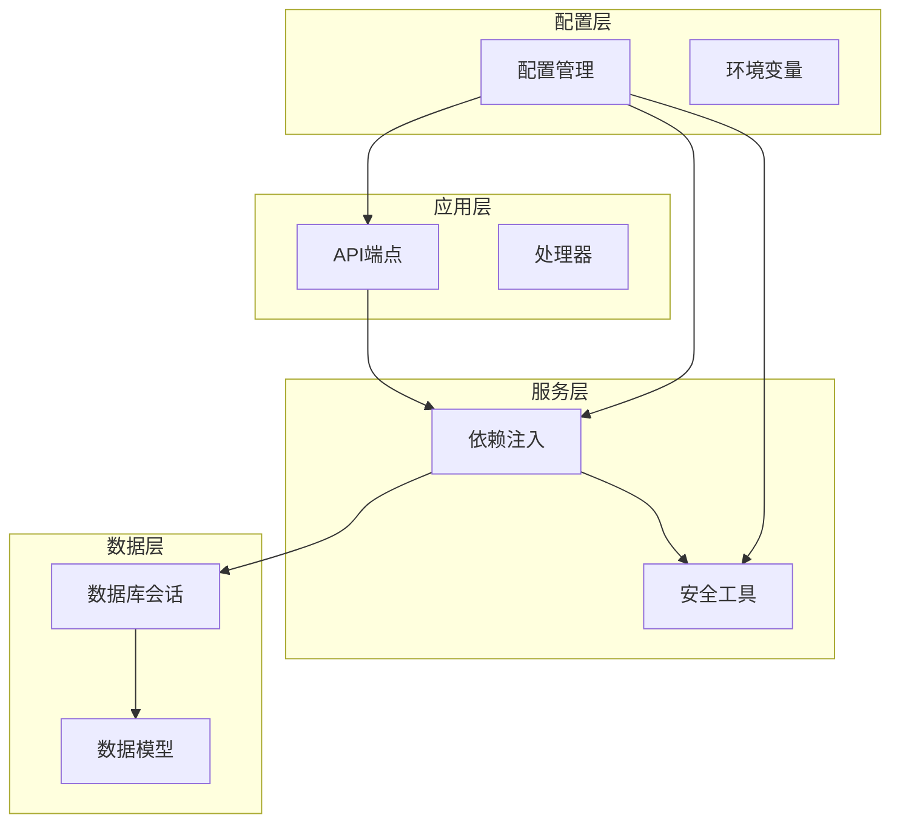
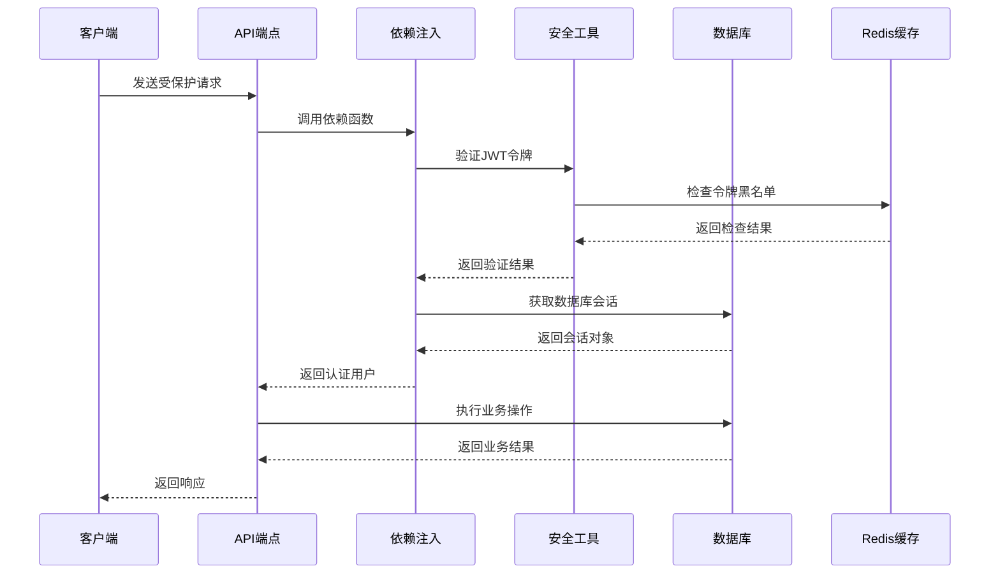
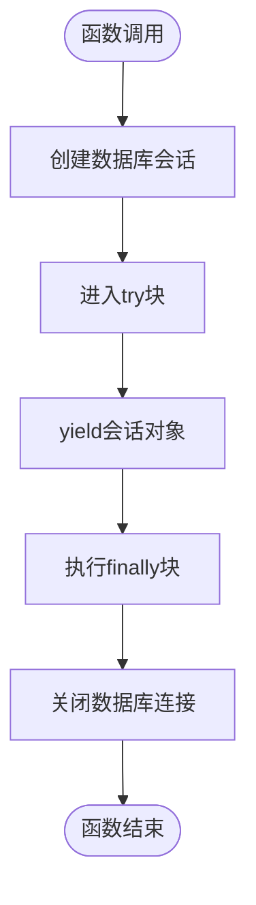
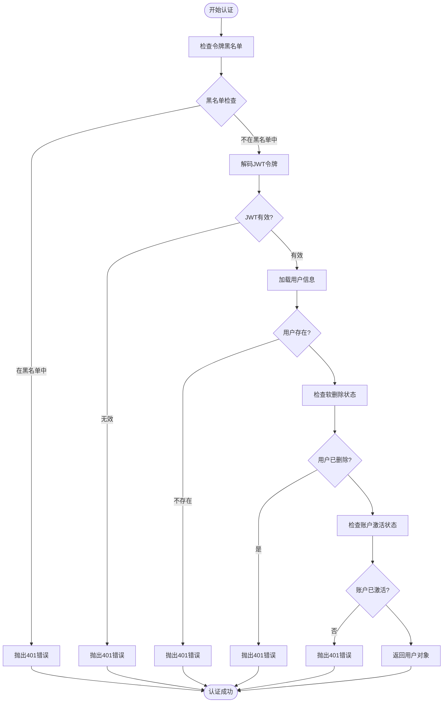
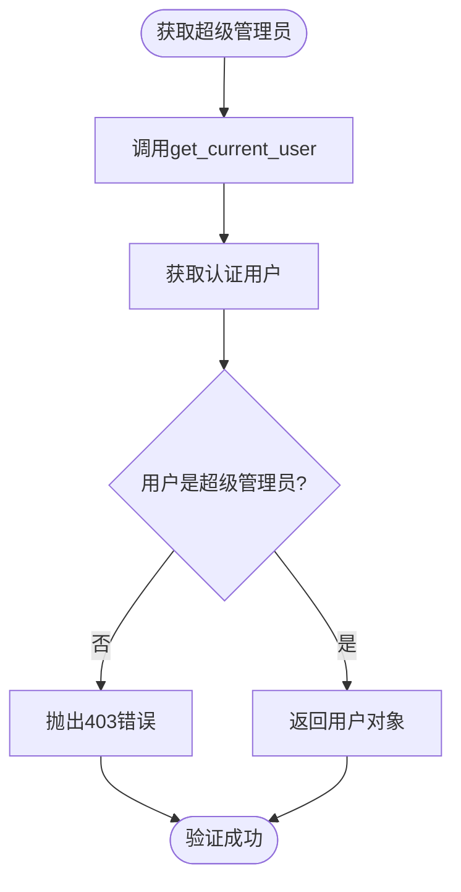
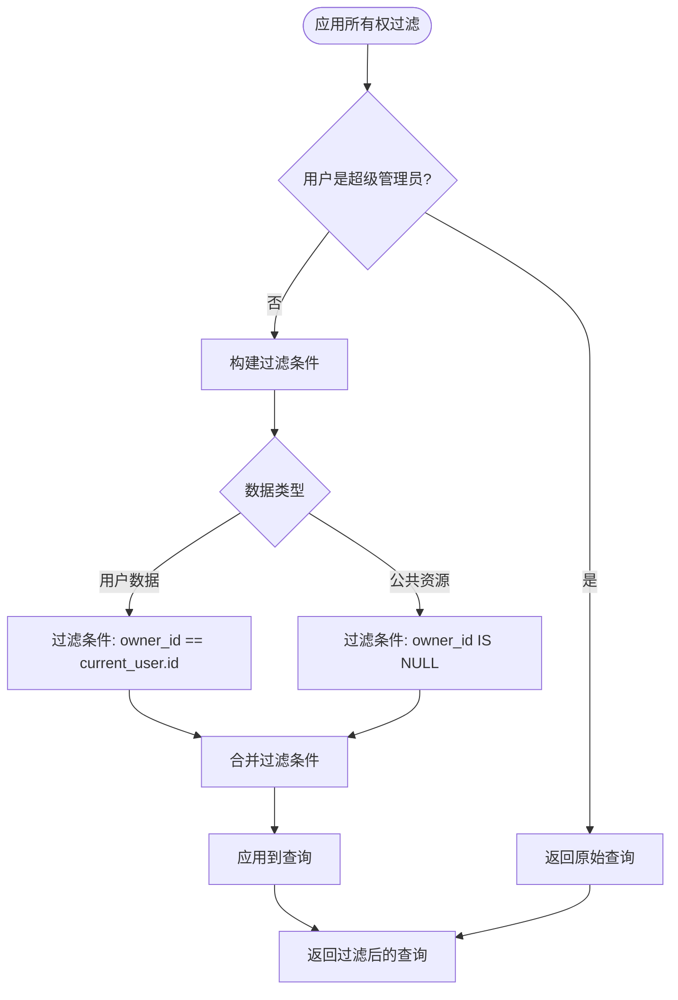
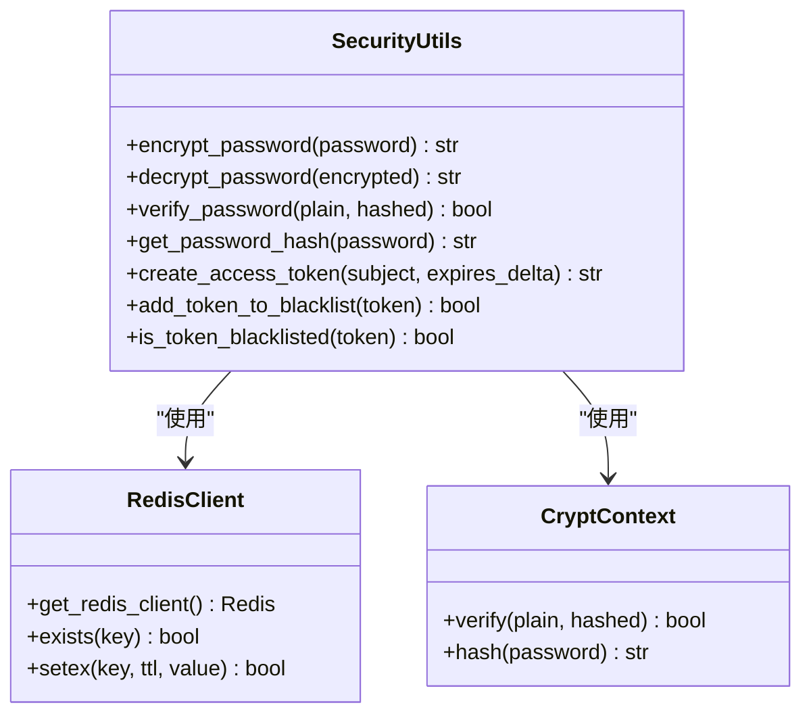
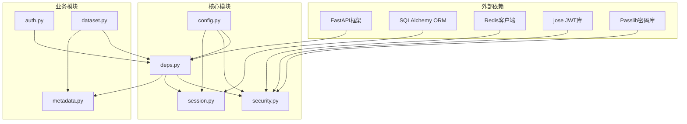

# 依赖注入与安全控制

<cite>
**本文档引用的文件**
- [deps.py](file://backend/app/api/deps.py)
- [security.py](file://backend/app/core/security.py)
- [config.py](file://backend/app/core/config.py)
- [session.py](file://backend/app/db/session.py)
- [main.py](file://backend/app/main.py)
- [auth.py](file://backend/app/api/v1/endpoints/auth.py)
- [dataset.py](file://backend/app/api/v1/endpoints/dataset.py)
- [metadata.py](file://backend/app/models/metadata.py)
- [token.py](file://backend/app/schemas/token.py)
- [user.py](file://backend/app/schemas/user.py)
- [.env.example](file://.env.example)
</cite>

## 目录
1. [简介](#简介)
2. [项目结构](#项目结构)
3. [核心组件](#核心组件)
4. [架构概览](#架构概览)
5. [详细组件分析](#详细组件分析)
6. [依赖关系分析](#依赖关系分析)
7. [性能考量](#性能考量)
8. [故障排除指南](#故障排除指南)
9. [结论](#结论)

## 简介

本项目采用FastAPI框架构建，实现了完整的依赖注入系统和安全控制机制。通过声明式依赖注入，系统将认证、授权、数据库会话管理和数据所有权过滤等横切关注点与业务逻辑解耦，提供了清晰的安全控制链路。

## 项目结构

项目采用模块化设计，主要分为以下几个层次：

**图表来源**
- [main.py](file://backend/app/main.py#L1-L35)
- [deps.py](file://backend/app/api/deps.py#L1-L124)
- [security.py](file://backend/app/core/security.py#L1-L161)
- [config.py](file://backend/app/core/config.py#L1-L51)

**章节来源**
- [main.py](file://backend/app/main.py#L1-L35)
- [config.py](file://backend/app/core/config.py#L1-L51)

## 核心组件

### 依赖注入系统

依赖注入系统是整个安全控制的核心，通过FastAPI的Depends机制实现声明式依赖管理。

### 安全配置管理

系统通过集中化的配置管理确保安全参数的一致性和可维护性。

### 数据库会话管理

采用SQLAlchemy ORM和连接池技术，提供高效且安全的数据库访问。

**章节来源**
- [deps.py](file://backend/app/api/deps.py#L1-L124)
- [security.py](file://backend/app/core/security.py#L1-L161)
- [config.py](file://backend/app/core/config.py#L1-L51)
- [session.py](file://backend/app/db/session.py#L1-L34)

## 架构概览

系统采用分层架构设计，实现了安全控制的完整链路：

**图表来源**
- [auth.py](file://backend/app/api/v1/endpoints/auth.py#L101-L133)
- [deps.py](file://backend/app/api/deps.py#L17-L80)
- [security.py](file://backend/app/core/security.py#L136-L160)
- [session.py](file://backend/app/db/session.py#L28-L34)

## 详细组件分析

### get_db - 数据库会话管理

get_db函数实现了数据库会话的生命周期管理，采用生成器模式确保资源的正确释放。

#### 实现机制

**图表来源**
- [session.py](file://backend/app/db/session.py#L28-L34)

#### 关键特性

- **连接池管理**: 使用SQLAlchemy连接池优化数据库连接性能
- **异常安全**: 通过finally块确保连接在任何情况下都会被正确关闭
- **多数据库支持**: 支持MySQL、PostgreSQL和SQLite三种数据库类型
- **连接池配置**: 生产环境使用QueuePool，开发环境使用SQLite

**章节来源**
- [session.py](file://backend/app/db/session.py#L1-L34)

### get_current_user - JWT令牌解析与用户身份认证

get_current_user函数实现了完整的用户身份认证流程，包含多个安全检查步骤。

#### 认证流程

**图表来源**
- [deps.py](file://backend/app/api/deps.py#L17-L80)

#### 安全检查清单

1. **令牌黑名单检查**: 验证令牌是否已被撤销
2. **JWT签名验证**: 确保令牌完整性
3. **用户存在性检查**: 验证用户账户状态
4. **软删除检查**: 防止已删除用户访问
5. **账户激活检查**: 确保用户账户处于激活状态

**章节来源**
- [deps.py](file://backend/app/api/deps.py#L17-L80)
- [security.py](file://backend/app/core/security.py#L136-L160)

### get_current_superuser - 超级管理员权限验证

get_current_superuser函数基于get_current_user的认证结果，进一步验证用户是否具有超级管理员权限。

#### 权限验证流程

**图表来源**
- [deps.py](file://backend/app/api/deps.py#L83-L94)

**章节来源**
- [deps.py](file://backend/app/api/deps.py#L83-L94)

### apply_ownership_filter - 数据所有权过滤

apply_ownership_filter函数实现了基于用户权限的数据访问控制，确保用户只能访问其拥有或公共资源的数据。

#### 过滤逻辑

**图表来源**
- [deps.py](file://backend/app/api/deps.py#L97-L123)

#### 过滤规则

- **普通用户**: 只能查看 `owner_id == current_user.id` 或 `owner_id IS NULL` 的数据
- **超级管理员**: 可以查看所有数据
- **数据类型**: 支持所有具有 `owner_id` 字段的模型

**章节来源**
- [deps.py](file://backend/app/api/deps.py#L97-L123)

### 安全工具 - 加密与令牌管理

security.py模块提供了完整的安全工具集，包括密码哈希、JWT令牌生成和黑名单管理。

#### 密码安全管理

**图表来源**
- [security.py](file://backend/app/core/security.py#L1-L161)

#### JWT令牌管理

- **令牌生成**: 使用HS256算法和配置的SECRET_KEY
- **令牌验证**: 支持过期时间检查和签名验证
- **黑名单机制**: 基于Redis实现令牌撤销功能
- **降级策略**: Redis不可用时的安全降级

**章节来源**
- [security.py](file://backend/app/core/security.py#L1-L161)

### 配置管理

config.py模块实现了集中化的配置管理，所有安全相关的配置都统一管理。

#### 安全配置项

| 配置项 | 类型 | 默认值 | 描述 |
|--------|------|--------|------|
| SECRET_KEY | str | change_this_to_a_secure_random_key_in_production | JWT密钥 |
| ALGORITHM | str | HS256 | JWT算法 |
| ACCESS_TOKEN_EXPIRE_MINUTES | int | 30 | 令牌过期时间(分钟) |
| REDIS_URL | str | redis://localhost:6379/0 | Redis连接URL |

**章节来源**
- [config.py](file://backend/app/core/config.py#L1-L51)
- [.env.example](file://.env.example#L14-L18)

## 依赖关系分析

系统中的依赖关系体现了清晰的分层架构：

**图表来源**
- [deps.py](file://backend/app/api/deps.py#L1-L124)
- [security.py](file://backend/app/core/security.py#L1-L161)
- [config.py](file://backend/app/core/config.py#L1-L51)
- [session.py](file://backend/app/db/session.py#L1-L34)

**章节来源**
- [deps.py](file://backend/app/api/deps.py#L1-L124)
- [security.py](file://backend/app/core/security.py#L1-L161)
- [config.py](file://backend/app/core/config.py#L1-L51)
- [session.py](file://backend/app/db/session.py#L1-L34)

## 性能考量

### 连接池优化

系统采用SQLAlchemy连接池技术，生产环境配置了合理的连接池参数：

- **连接池大小**: 10个基础连接
- **最大溢出连接**: 20个
- **连接超时**: 30秒
- **连接回收**: 3600秒
- **连接前检查**: 启用pre-ping确保连接有效性

### 缓存策略

- **Redis缓存**: 用于令牌黑名单和结果缓存
- **SQL查询缓存**: 7天过期时间
- **降级策略**: Redis不可用时自动降级

### 异步处理

- **后台任务**: 训练任务使用BackgroundTasks异步执行
- **连接分离**: 后台任务使用独立的数据库连接

## 故障排除指南

### 常见问题及解决方案

#### 1. 令牌验证失败

**症状**: 401 Unauthorized错误

**可能原因**:
- 令牌已过期
- 令牌不在黑名单检查中
- JWT签名验证失败
- 用户账户被软删除或封禁

**解决方法**:
- 检查ACCESS_TOKEN_EXPIRE_MINUTES配置
- 验证SECRET_KEY设置
- 确认用户账户状态

#### 2. 数据访问权限问题

**症状**: 403 Forbidden或404 Not Found

**可能原因**:
- 用户不是数据所有者
- 用户是公共资源的非超级管理员
- 数据已被删除

**解决方法**:
- 检查apply_ownership_filter的使用
- 验证用户权限级别
- 确认数据所有权字段

#### 3. Redis连接问题

**症状**: 令牌黑名单功能失效

**可能原因**:
- Redis服务器不可达
- 连接超时
- 认证失败

**解决方法**:
- 检查REDIS_URL配置
- 验证Redis服务器状态
- 查看应用日志

**章节来源**
- [deps.py](file://backend/app/api/deps.py#L17-L80)
- [security.py](file://backend/app/core/security.py#L136-L160)
- [session.py](file://backend/app/db/session.py#L1-L34)

## 结论

本项目的依赖注入与安全控制系统展现了现代Web应用的最佳实践：

1. **声明式依赖**: 通过FastAPI的Depends机制实现清晰的依赖管理
2. **安全分层**: 多层安全检查确保系统的安全性
3. **配置集中**: 统一的配置管理便于维护和部署
4. **异常处理**: 完善的异常处理和降级策略提升系统稳定性
5. **性能优化**: 连接池和缓存策略确保系统性能

这套系统为后续的功能扩展提供了良好的基础，开发者可以通过添加新的依赖函数来扩展安全控制能力，同时保持代码的整洁性和可维护性。