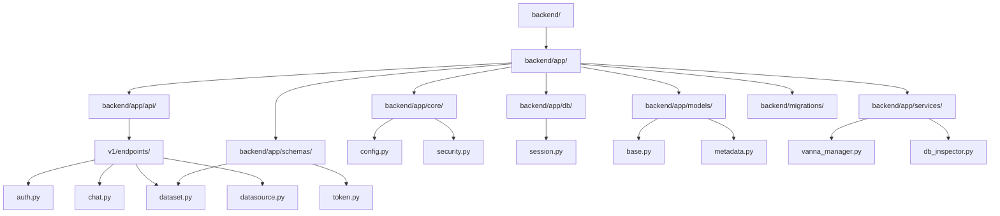
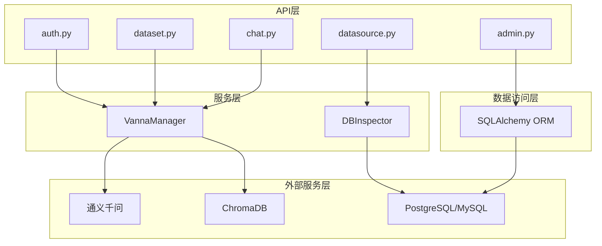
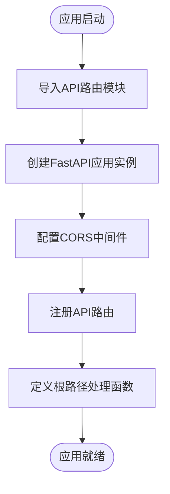
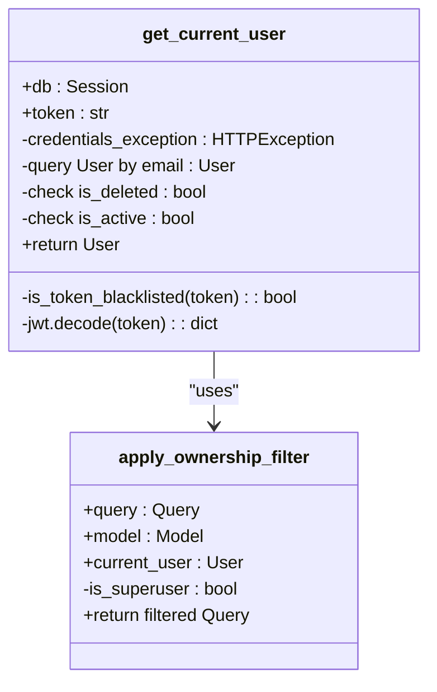
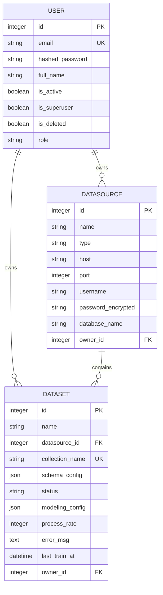
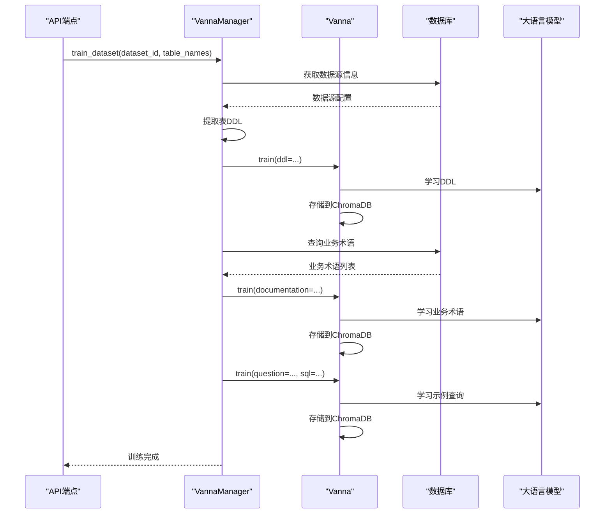
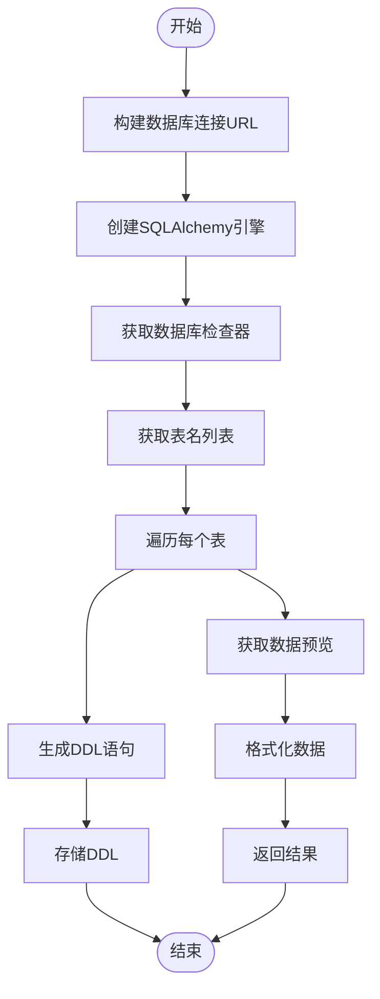
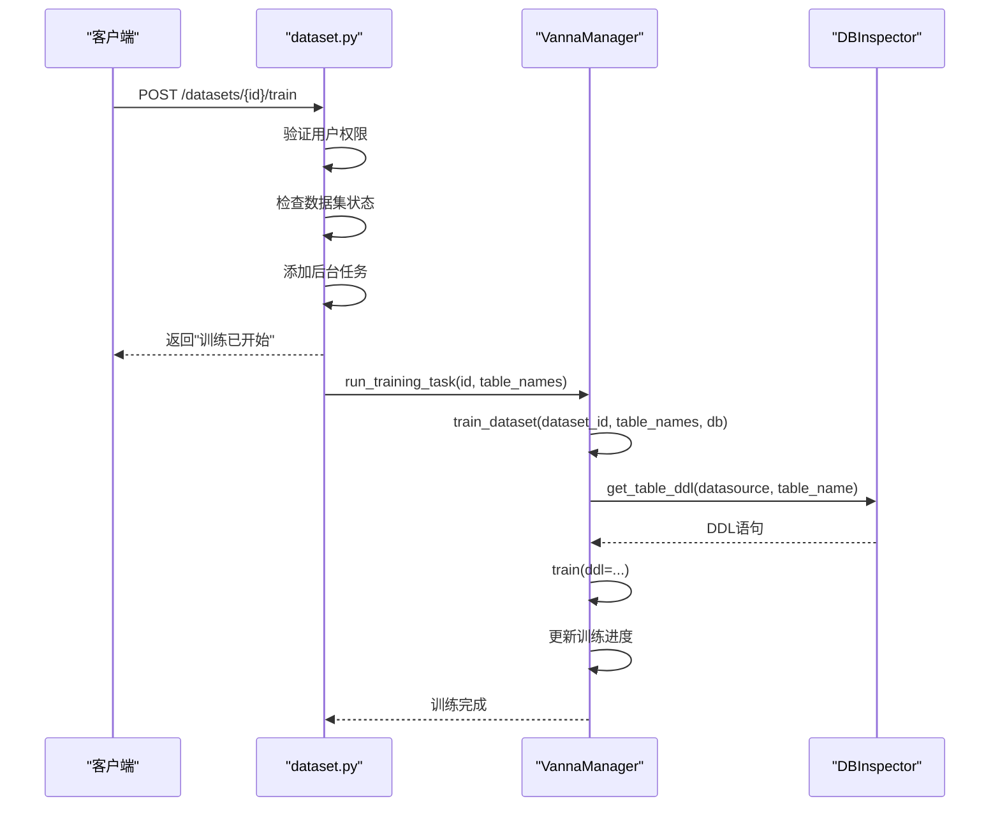
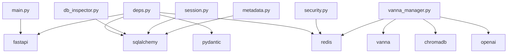

# 后端架构

<cite>
**本文档引用的文件**   
- [main.py](file://backend/app/main.py)
- [deps.py](file://backend/app/api/deps.py)
- [metadata.py](file://backend/app/models/metadata.py)
- [vanna_manager.py](file://backend/app/services/vanna_manager.py)
- [db_inspector.py](file://backend/app/services/db_inspector.py)
- [config.py](file://backend/app/core/config.py)
- [security.py](file://backend/app/core/security.py)
- [session.py](file://backend/app/db/session.py)
- [auth.py](file://backend/app/api/v1/endpoints/auth.py)
- [dataset.py](file://backend/app/api/v1/endpoints/dataset.py)
- [datasource.py](file://backend/app/api/v1/endpoints/datasource.py)
- [chat.py](file://backend/app/api/v1/endpoints/chat.py)
- [admin.py](file://backend/app/api/v1/endpoints/admin.py)
- [token.py](file://backend/app/schemas/token.py)
- [dataset.py](file://backend/app/schemas/dataset.py)
- [base.py](file://backend/app/models/base.py)
</cite>

## 目录
1. [简介](#简介)
2. [项目结构](#项目结构)
3. [核心组件](#核心组件)
4. [架构概览](#架构概览)
5. [详细组件分析](#详细组件分析)
6. [依赖分析](#依赖分析)
7. [性能考虑](#性能考虑)
8. [故障排除指南](#故障排除指南)
9. [结论](#结论)

## 简介
本文档全面描述了基于FastAPI的Universal BI后端服务的高层设计与组件交互。该系统是一个支持SaaS多租户数据隔离的智能商业分析平台，核心功能包括数据源连接、数据集训练、自然语言到SQL的转换以及可视化分析。系统采用分层架构设计，通过依赖注入、中间件和数据过滤机制实现了JWT认证、数据所有权隔离和AI服务集成。从`main.py`的API路由注册到`deps.py`中的依赖注入，再到`models/metadata.py`中的统一数据模型设计，系统展现了清晰的模块化结构。AI服务通过`vanna_manager.py`封装，实现了Vanna模型的初始化、训练流程和SQL生成调用，而`db_inspector.py`则提供了多数据库元数据提取能力。整体架构遵循分层原则，服务层与API端点之间通过清晰的调用关系实现解耦。

## 项目结构
该后端项目采用标准的FastAPI项目结构，以`backend/app`为核心目录，组织清晰，职责分明。项目根目录包含Docker配置、依赖文件和启动脚本，而`backend/app`目录则包含了所有应用代码。`api`目录存放API端点，`core`目录存放核心配置和安全逻辑，`db`目录管理数据库会话，`models`目录定义数据模型，`schemas`目录定义Pydantic数据模型，`services`目录封装业务逻辑服务。这种分层结构确保了代码的可维护性和可扩展性。

**图源**
- [main.py](file://backend/app/main.py#L1-L35)
- [project_structure](file://project_structure)

**本节源**
- [main.py](file://backend/app/main.py#L1-L35)

## 核心组件
本系统的核心组件围绕FastAPI框架构建，包括API路由、依赖注入、数据模型、AI服务和数据库服务。`main.py`作为应用入口，负责创建FastAPI应用实例、配置CORS中间件和注册所有API路由。`deps.py`是依赖注入的核心，提供了`get_current_user`和`apply_ownership_filter`等关键依赖，实现了JWT认证和数据所有权隔离。`models/metadata.py`定义了所有数据库模型，通过`owner_id`字段实现了SaaS数据隔离。`vanna_manager.py`封装了AI服务，负责Vanna模型的初始化、训练和SQL生成。`db_inspector.py`提供了多数据库元数据提取功能，支持PostgreSQL和MySQL。这些组件通过清晰的接口和依赖关系协同工作，构成了系统的坚实基础。

**本节源**
- [main.py](file://backend/app/main.py#L1-L35)
- [deps.py](file://backend/app/api/deps.py#L1-L124)
- [metadata.py](file://backend/app/models/metadata.py#L1-L129)
- [vanna_manager.py](file://backend/app/services/vanna_manager.py#L1-L800)
- [db_inspector.py](file://backend/app/services/db_inspector.py#L1-L152)

## 架构概览
整个系统采用典型的分层架构，从上至下分为API层、服务层、数据访问层和外部服务层。API层由FastAPI的`APIRouter`构成，处理HTTP请求和响应。服务层封装了核心业务逻辑，如`VannaManager`和`DBInspector`。数据访问层通过SQLAlchemy ORM与数据库交互。外部服务层包括AI大模型（通义千问）和向量数据库（ChromaDB）。各层之间通过明确定义的接口进行通信，确保了低耦合和高内聚。认证和授权通过依赖注入在API层处理，数据隔离通过查询过滤在数据访问层实现。

**图源**
- [main.py](file://backend/app/main.py#L1-L35)
- [deps.py](file://backend/app/api/deps.py#L1-L124)
- [vanna_manager.py](file://backend/app/services/vanna_manager.py#L1-L800)
- [db_inspector.py](file://backend/app/services/db_inspector.py#L1-L152)

## 详细组件分析

### API路由与中间件配置
`main.py`是整个应用的入口点，负责初始化FastAPI应用、配置中间件和注册API路由。它首先从`app.api.v1.endpoints`导入所有路由模块，然后创建`FastAPI`实例。CORS中间件通过`CORSMiddleware`配置，允许所有来源的请求，这在开发环境中是方便的，但在生产环境中应限制为特定来源。API路由通过`app.include_router()`方法注册，每个路由都带有前缀和标签，实现了API的模块化和版本控制。最后，根路径`/`被映射到一个简单的欢迎函数。

**图源**
- [main.py](file://backend/app/main.py#L1-L35)

**本节源**
- [main.py](file://backend/app/main.py#L1-L35)

### 依赖注入与认证授权
`deps.py`文件是系统依赖注入的核心，它定义了`get_current_user`和`get_current_superuser`等可重用的依赖项。`get_current_user`函数是一个复杂的依赖，它接收一个JWT令牌，执行多项安全检查，包括令牌是否在黑名单中、签名是否有效、用户是否被软删除以及是否被封禁。只有通过所有检查的用户才能被返回，否则会抛出相应的HTTP异常。`apply_ownership_filter`函数则实现了数据所有权隔离，它根据当前用户的身份，动态地向SQLAlchemy查询对象添加过滤条件，确保普通用户只能访问自己的数据或公共资源，而超级管理员可以访问所有数据。

**图源**
- [deps.py](file://backend/app/api/deps.py#L1-L124)
- [security.py](file://backend/app/core/security.py#L1-L161)

**本节源**
- [deps.py](file://backend/app/api/deps.py#L1-L124)
- [security.py](file://backend/app/core/security.py#L1-L161)

### 数据模型与SaaS数据隔离
`models/metadata.py`文件定义了系统中所有核心数据模型，包括`User`、`DataSource`、`Dataset`、`Dashboard`等。这些模型都继承自`Base`类，该类由`sqlalchemy.ext.declarative.declarative_base()`创建。一个关键的设计是`owner_id`字段，它在`DataSource`、`Dataset`、`Dashboard`等多个模型中出现，用于实现SaaS多租户数据隔离。当`owner_id`为`NULL`时，表示该资源是公共资源，所有用户都可以访问；当`owner_id`指向某个用户ID时，表示该资源属于该用户，只有该用户和超级管理员可以访问。这种设计简单而有效，通过外键约束保证了数据完整性。

**图源**
- [metadata.py](file://backend/app/models/metadata.py#L1-L129)
- [base.py](file://backend/app/models/base.py#L1-L4)

**本节源**
- [metadata.py](file://backend/app/models/metadata.py#L1-L129)
- [base.py](file://backend/app/models/base.py#L1-L4)

### AI服务封装逻辑
`vanna_manager.py`文件封装了与Vanna AI服务交互的所有逻辑。它通过`VannaLegacy`类（使用Mixin模式组合`ChromaDB_VectorStore`和`OpenAI_Chat`）来初始化Vanna实例，并通过`VannaManager`类提供静态方法来管理这些实例。`get_legacy_vanna`和`get_agent`方法负责创建和缓存Vanna实例，避免了ChromaDB的实例冲突问题。`train_dataset`方法实现了完整的训练流程，包括提取DDL、训练业务术语和生成示例查询。该类还集成了Redis缓存，用于缓存SQL查询结果，提高性能。`VannaManager`的设计体现了对复杂外部服务的优雅封装，为上层应用提供了简单、一致的接口。

**图源**
- [vanna_manager.py](file://backend/app/services/vanna_manager.py#L1-L800)
- [db_inspector.py](file://backend/app/services/db_inspector.py#L1-L152)

**本节源**
- [vanna_manager.py](file://backend/app/services/vanna_manager.py#L1-L800)
- [db_inspector.py](file://backend/app/services/db_inspector.py#L1-L152)

### 多数据库元数据提取
`db_inspector.py`文件提供了与外部数据库交互的能力。`DBInspector`类是一个工具类，它根据数据源的类型（PostgreSQL或MySQL）构建相应的数据库连接URL，并创建SQLAlchemy引擎。`get_table_names`、`get_table_ddl`和`get_table_data`等方法利用SQLAlchemy的`inspect`功能，可以获取数据库的元数据信息。`get_table_ddl`方法使用`CreateTable`编译器生成创建表的SQL语句，这对于训练AI模型至关重要。`get_table_data`方法则用于预览表数据，它会将`datetime`和`Decimal`等特殊类型转换为JSON兼容的格式。该类的设计考虑了连接池和超时设置，确保了与外部数据库交互的稳定性和性能。

**图源**
- [db_inspector.py](file://backend/app/services/db_inspector.py#L1-L152)
- [security.py](file://backend/app/core/security.py#L1-L161)

**本节源**
- [db_inspector.py](file://backend/app/services/db_inspector.py#L1-L152)
- [security.py](file://backend/app/core/security.py#L1-L161)

### 服务层与API端点调用关系
服务层与API端点之间的调用关系清晰地体现了分层架构原则。API端点（如`dataset.py`中的`train_dataset`）负责处理HTTP请求、验证输入、调用服务层方法并返回响应。服务层（如`vanna_manager.py`中的`VannaManager.train_dataset`）则专注于业务逻辑的实现，不关心HTTP协议的细节。例如，当用户通过API请求训练一个数据集时，`dataset.py`中的`train_dataset`端点会先验证用户权限和数据集状态，然后启动一个后台任务来调用`VannaManager.train_dataset`。这种分离使得API端点保持简洁，而复杂的业务逻辑可以被独立测试和维护。

**图源**
- [dataset.py](file://backend/app/api/v1/endpoints/dataset.py#L1-L800)
- [vanna_manager.py](file://backend/app/services/vanna_manager.py#L1-L800)
- [db_inspector.py](file://backend/app/services/db_inspector.py#L1-L152)

**本节源**
- [dataset.py](file://backend/app/api/v1/endpoints/dataset.py#L1-L800)
- [vanna_manager.py](file://backend/app/services/vanna_manager.py#L1-L800)
- [db_inspector.py](file://backend/app/services/db_inspector.py#L1-L152)

## 依赖分析
系统内部依赖关系清晰，外部依赖丰富。内部依赖主要体现在API端点对`deps.py`和`services`的依赖，以及`services`对`models`和`db`的依赖。外部依赖包括`fastapi`、`sqlalchemy`、`pydantic`等核心框架，以及`vanna`、`chromadb`、`openai`等AI相关库。`requirements.txt`文件列出了所有Python依赖。数据库依赖包括MySQL/PostgreSQL作为主数据库，Redis作为缓存和令牌黑名单，以及ChromaDB作为向量数据库。这种依赖结构确保了系统功能的完整性和先进性。

**图源**
- [main.py](file://backend/app/main.py#L1-L35)
- [deps.py](file://backend/app/api/deps.py#L1-L124)
- [vanna_manager.py](file://backend/app/services/vanna_manager.py#L1-L800)
- [db_inspector.py](file://backend/app/services/db_inspector.py#L1-L152)
- [requirements.txt](file://backend/requirements.txt)

**本节源**
- [main.py](file://backend/app/main.py#L1-L35)
- [deps.py](file://backend/app/api/deps.py#L1-L124)
- [vanna_manager.py](file://backend/app/services/vanna_manager.py#L1-L800)
- [db_inspector.py](file://backend/app/services/db_inspector.py#L1-L152)
- [requirements.txt](file://backend/requirements.txt)

## 性能考虑
系统在设计时考虑了多项性能优化。首先，数据库连接使用了SQLAlchemy的连接池，避免了频繁创建和销毁连接的开销。其次，`VannaManager`类对Vanna实例和ChromaDB客户端进行了缓存，减少了初始化的开销。第三，系统集成了Redis缓存，用于缓存SQL查询结果和生成的SQL语句，显著减少了对大语言模型的调用次数和数据库查询时间。第四，训练任务在后台异步执行，避免了阻塞API响应。最后，ChromaDB的向量检索被配置为返回固定数量的结果，避免了不必要的计算。

**本节源**
- [session.py](file://backend/app/db/session.py#L1-L34)
- [vanna_manager.py](file://backend/app/services/vanna_manager.py#L1-L800)
- [config.py](file://backend/app/core/config.py#L1-L51)

## 故障排除指南
当系统出现问题时，可以按照以下步骤进行排查：
1.  **检查日志**：查看应用日志（通常在控制台输出）和Redis、数据库的日志，寻找错误信息。
2.  **验证配置**：检查`.env`文件中的配置项，特别是数据库连接字符串、Redis URL和API密钥。
3.  **测试数据库连接**：使用`datasource.py`中的`test_datasource_connection`端点测试与外部数据库的连接。
4.  **检查Redis状态**：确认Redis服务正在运行，并且应用可以连接到它。
5.  **查看训练状态**：如果训练失败，通过`dataset.py`中的`get_training_logs`端点查看详细的训练日志。
6.  **验证AI服务**：确认通义千问API密钥有效，并且网络可以访问API端点。

**本节源**
- [db_inspector.py](file://backend/app/services/db_inspector.py#L1-L152)
- [security.py](file://backend/app/core/security.py#L1-L161)
- [vanna_manager.py](file://backend/app/services/vanna_manager.py#L1-L800)
- [dataset.py](file://backend/app/api/v1/endpoints/dataset.py#L1-L800)

## 结论
Universal BI后端架构是一个设计精良、功能完整的FastAPI应用。它通过清晰的分层和模块化设计，实现了复杂的功能，包括SaaS数据隔离、JWT认证、AI驱动的自然语言查询和多数据库支持。核心组件如`deps.py`中的依赖注入和`vanna_manager.py`中的AI服务封装，展现了高内聚、低耦合的设计原则。系统充分利用了现代Python生态中的优秀库，如SQLAlchemy、Pydantic和Vanna，构建了一个高性能、可扩展的智能BI平台。该架构为未来的功能扩展和维护提供了坚实的基础。