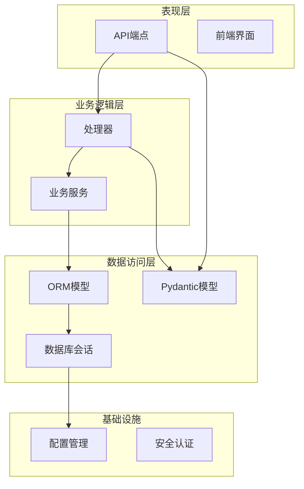
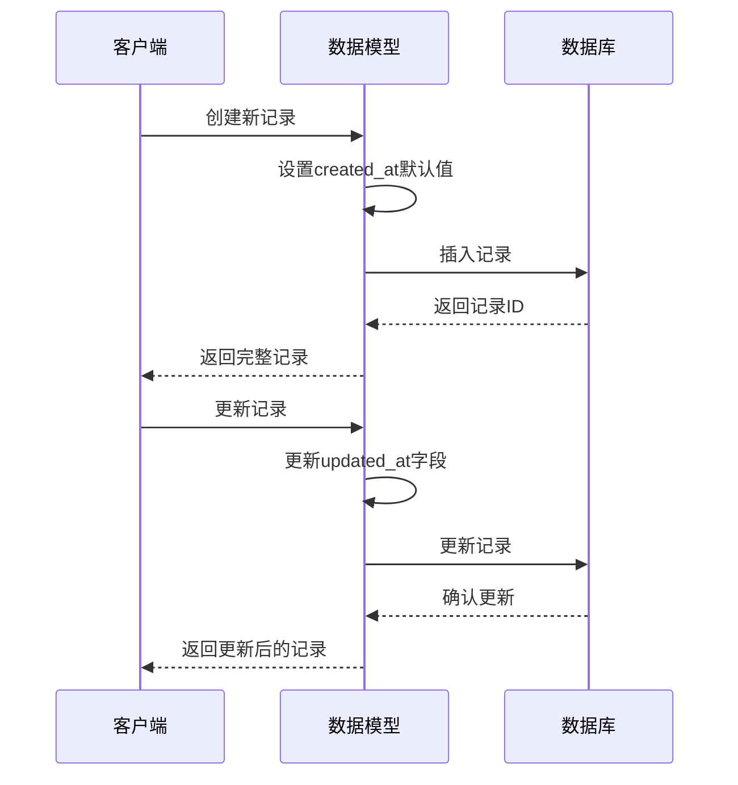
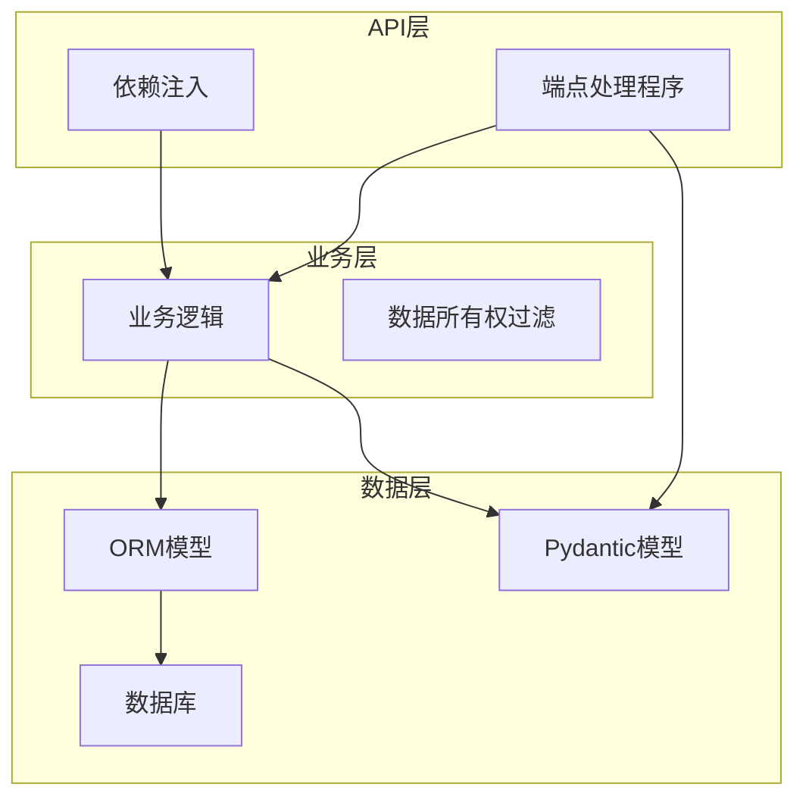
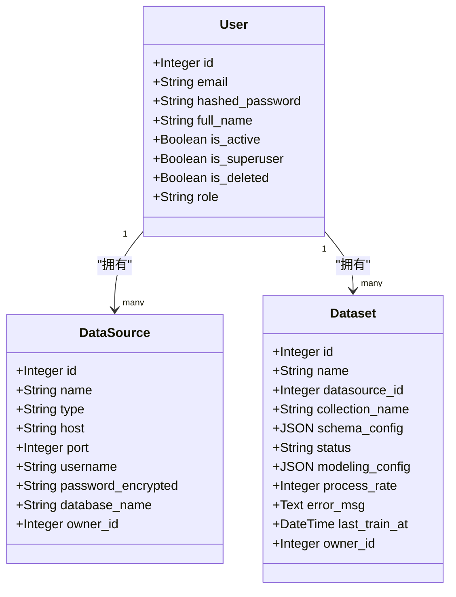
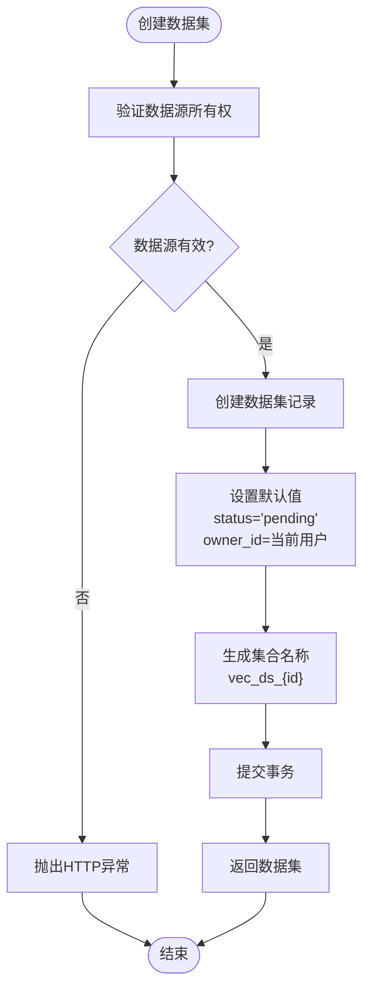
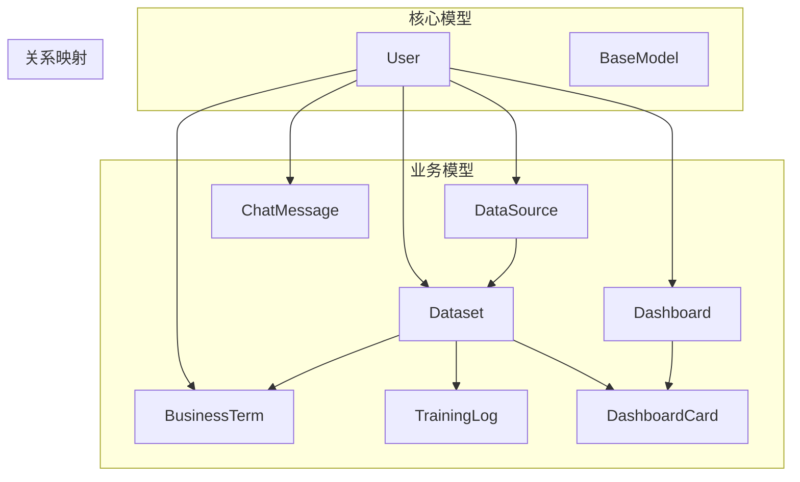
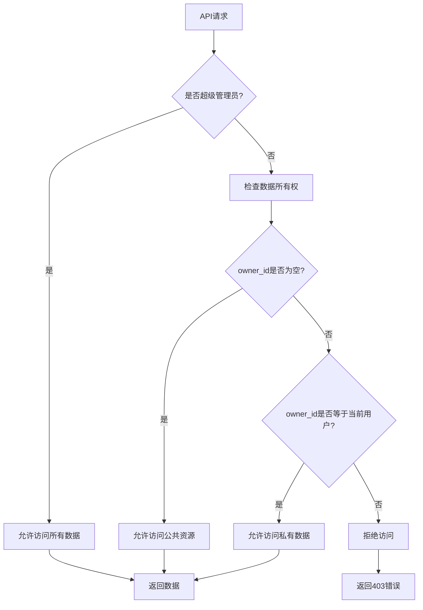
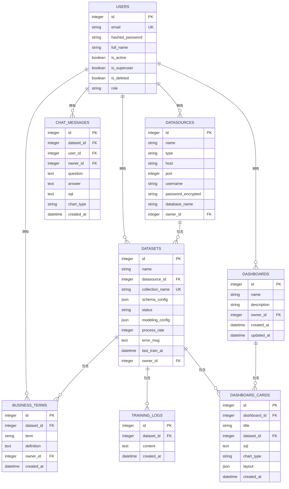

# 数据模型与ORM设计

<cite>
**本文档引用的文件**
- [metadata.py](file://backend/app/models/metadata.py)
- [base.py](file://backend/app/models/base.py)
- [session.py](file://backend/app/db/session.py)
- [config.py](file://backend/app/core/config.py)
- [deps.py](file://backend/app/api/deps.py)
- [dataset.py](file://backend/app/api/v1/endpoints/dataset.py)
- [user.py](file://backend/app/schemas/user.py)
- [dataset.py](file://backend/app/schemas/dataset.py)
- [dashboard.py](file://backend/app/schemas/dashboard.py)
- [datasource.py](file://backend/app/schemas/datasource.py)
- [chat.py](file://backend/app/schemas/chat.py)
</cite>

## 目录
1. [简介](#简介)
2. [项目结构](#项目结构)
3. [核心组件](#核心组件)
4. [架构概览](#架构概览)
5. [详细组件分析](#详细组件分析)
6. [依赖关系分析](#依赖关系分析)
7. [性能考虑](#性能考虑)
8. [故障排除指南](#故障排除指南)
9. [结论](#结论)
10. [附录](#附录)

## 简介

本项目采用SQLAlchemy作为ORM框架，构建了一个完整的数据分析平台。本文档深入分析了基于SQLAlchemy的ORM设计，重点解析了metadata.py中的模型定义、base.py中的通用字段抽象、以及schemas目录下的Pydantic模型与数据库模型之间的映射关系。

该系统实现了完整的数据所有权控制机制，支持公共资源和私有资源的混合管理模式，通过owner_id外键关联实现细粒度的数据访问控制。

## 项目结构

项目采用分层架构设计，主要分为以下几个层次：



**图表来源**
- [metadata.py](file://backend/app/models/metadata.py#L1-L129)
- [base.py](file://backend/app/models/base.py#L1-L4)
- [session.py](file://backend/app/db/session.py#L1-L34)

**章节来源**
- [metadata.py](file://backend/app/models/metadata.py#L1-L129)
- [base.py](file://backend/app/models/base.py#L1-L4)
- [session.py](file://backend/app/db/session.py#L1-L34)

## 核心组件

### 基础模型架构

项目的核心是基于SQLAlchemy的DeclarativeBase基类，通过统一的Base类实现所有模型的继承。这种设计提供了以下优势：

- **统一的模型基类**：所有模型共享相同的生命周期管理和元数据
- **一致的字段定义**：通过抽象通用字段减少重复代码
- **标准化的关系映射**：确保模型间关系的一致性和可维护性

### 时间戳管理机制

系统实现了自动化的created_at和updated_at时间戳管理：



**图表来源**
- [metadata.py](file://backend/app/models/metadata.py#L63-L64)
- [metadata.py](file://backend/app/models/metadata.py#L77-L77)

**章节来源**
- [metadata.py](file://backend/app/models/metadata.py#L6-L16)
- [metadata.py](file://backend/app/models/metadata.py#L63-L64)
- [metadata.py](file://backend/app/models/metadata.py#L77-L77)

## 架构概览

系统采用MVC架构模式，结合FastAPI的依赖注入机制：



**图表来源**
- [deps.py](file://backend/app/api/deps.py#L97-L124)
- [dataset.py](file://backend/app/api/v1/endpoints/dataset.py#L64-L78)

## 详细组件分析

### 用户模型 (User)

用户模型是系统的基础实体，定义了用户的基本属性和权限控制：



**图表来源**
- [metadata.py](file://backend/app/models/metadata.py#L6-L16)
- [metadata.py](file://backend/app/models/metadata.py#L18-L32)
- [metadata.py](file://backend/app/models/metadata.py#L35-L53)

**章节来源**
- [metadata.py](file://backend/app/models/metadata.py#L6-L16)
- [metadata.py](file://backend/app/models/metadata.py#L18-L32)

### 数据源模型 (DataSource)

数据源模型负责管理外部数据库连接信息：

| 字段名 | 类型 | 约束 | 描述 |
|--------|------|------|------|
| id | Integer | 主键 | 数据源唯一标识符 |
| name | String(255) | 唯一、索引 | 数据源名称 |
| type | String(50) |  | 数据库类型（postgresql/mysql） |
| host | String(255) |  | 数据库主机地址 |
| port | Integer |  | 数据库端口号 |
| username | String(255) |  | 用户名 |
| password_encrypted | String(500) |  | 加密后的密码 |
| database_name | String(255) |  | 数据库名称 |
| owner_id | Integer | 外键(users.id) | 所有者ID，为空表示公共资源 |

**章节来源**
- [metadata.py](file://backend/app/models/metadata.py#L18-L32)

### 数据集模型 (Dataset)

数据集模型是核心业务实体，负责管理数据集的训练状态和配置：



**图表来源**
- [dataset.py](file://backend/app/api/v1/endpoints/dataset.py#L29-L62)

**章节来源**
- [metadata.py](file://backend/app/models/metadata.py#L35-L53)
- [dataset.py](file://backend/app/api/v1/endpoints/dataset.py#L29-L62)

### 仪表板模型 (Dashboard)

仪表板模型支持动态可视化卡片管理：

| 字段名 | 类型 | 约束 | 描述 |
|--------|------|------|------|
| id | Integer | 主键 | 仪表板唯一标识符 |
| name | String(255) | 索引 | 仪表板名称 |
| description | String(500) | 可空 | 描述信息 |
| owner_id | Integer | 外键(users.id) | 所有者ID |
| created_at | DateTime | 默认值 | 创建时间 |
| updated_at | DateTime | 默认值+更新触发器 | 更新时间 |

**章节来源**
- [metadata.py](file://backend/app/models/metadata.py#L56-L67)

### 业务术语模型 (BusinessTerm)

业务术语模型用于定义数据集中的业务概念：

| 字段名 | 类型 | 约束 | 描述 |
|--------|------|------|------|
| id | Integer | 主键 | 术语唯一标识符 |
| dataset_id | Integer | 外键(datasets.id) | 关联的数据集 |
| term | String(255) | 索引 | 术语名称 |
| definition | Text |  | 术语定义 |
| owner_id | Integer | 外键(users.id) | 所有者ID |
| created_at | DateTime | 默认值 | 创建时间 |

**章节来源**
- [metadata.py](file://backend/app/models/metadata.py#L98-L109)

### 聊天消息模型 (ChatMessage)

聊天消息模型支持AI对话历史记录：

| 字段名 | 类型 | 约束 | 描述 |
|--------|------|------|------|
| id | Integer | 主键 | 消息唯一标识符 |
| dataset_id | Integer | 外键(datasets.id) | 关联的数据集 |
| user_id | Integer | 外键(users.id) | 发送用户 |
| owner_id | Integer | 外键(users.id) | 所有者ID |
| question | Text |  | 用户问题 |
| answer | Text | 可空 | AI回答 |
| sql | Text | 可空 | 生成的SQL |
| chart_type | String(50) | 可空 | 图表类型 |
| created_at | DateTime | 默认值 | 创建时间 |

**章节来源**
- [metadata.py](file://backend/app/models/metadata.py#L112-L128)

## 依赖关系分析

### 数据模型依赖图



**图表来源**
- [metadata.py](file://backend/app/models/metadata.py#L1-L129)

### 数据所有权过滤机制

系统实现了统一的数据所有权控制机制：



**图表来源**
- [deps.py](file://backend/app/api/deps.py#L97-L124)

**章节来源**
- [deps.py](file://backend/app/api/deps.py#L97-L124)

## 性能考虑

### 数据库连接池配置

系统采用连接池优化数据库连接性能：

| 配置项 | 值 | 说明 |
|--------|-----|------|
| pool_size | 10 | 连接池大小 |
| max_overflow | 20 | 最大溢出连接数 |
| pool_timeout | 30秒 | 获取连接超时时间 |
| pool_recycle | 3600秒 | 连接回收时间 |
| pool_pre_ping | True | 连接前检查可用性 |

### 索引策略

系统针对高频查询字段建立了适当的索引：

- **唯一索引**：email（用户）、collection_name（数据集）
- **普通索引**：name（多表）、owner_id（所有权过滤）
- **组合索引**：根据查询模式优化

## 故障排除指南

### 常见问题及解决方案

1. **数据所有权访问错误**
   - 症状：403 Forbidden错误
   - 原因：普通用户尝试访问非自己拥有的数据
   - 解决：确认用户权限或联系超级管理员

2. **数据库连接超时**
   - 症状：数据库操作超时
   - 原因：连接池配置不当
   - 解决：调整pool_size和pool_timeout参数

3. **时间戳字段异常**
   - 症状：created_at或updated_at字段值异常
   - 原因：时区设置问题
   - 解决：统一使用UTC时间

**章节来源**
- [session.py](file://backend/app/db/session.py#L14-L24)

## 结论

本项目展示了基于SQLAlchemy的ORM设计最佳实践，通过统一的模型基类、清晰的实体关系映射、完善的权限控制机制，构建了一个功能完整、可扩展的数据分析平台。

关键设计亮点包括：
- **模块化设计**：通过Base类实现代码复用
- **权限控制**：基于owner_id的细粒度访问控制
- **自动化管理**：时间戳字段的自动管理机制
- **类型安全**：结合Pydantic模型实现数据验证

## 附录

### 实体关系图（ERD）



### 典型查询示例

1. **获取用户的所有数据集**
   ```sql
   SELECT * FROM datasets WHERE owner_id = ? OR owner_id IS NULL;
   ```

2. **查询特定数据源的数据集**
   ```sql
   SELECT d.*, ds.name as datasource_name 
   FROM datasets d 
   JOIN datasources ds ON d.datasource_id = ds.id 
   WHERE ds.id = ?;
   ```

3. **统计用户数据集数量**
   ```sql
   SELECT COUNT(*) as count, status 
   FROM datasets 
   WHERE owner_id = ? 
   GROUP BY status;
   ```

4. **获取仪表板及其卡片**
   ```sql
   SELECT d.*, dc.title, dc.sql, dc.chart_type
   FROM dashboards d 
   LEFT JOIN dashboard_cards dc ON d.id = dc.dashboard_id
   WHERE d.id = ?;
   ```

**章节来源**
- [metadata.py](file://backend/app/models/metadata.py#L1-L129)
- [dataset.py](file://backend/app/api/v1/endpoints/dataset.py#L64-L97)