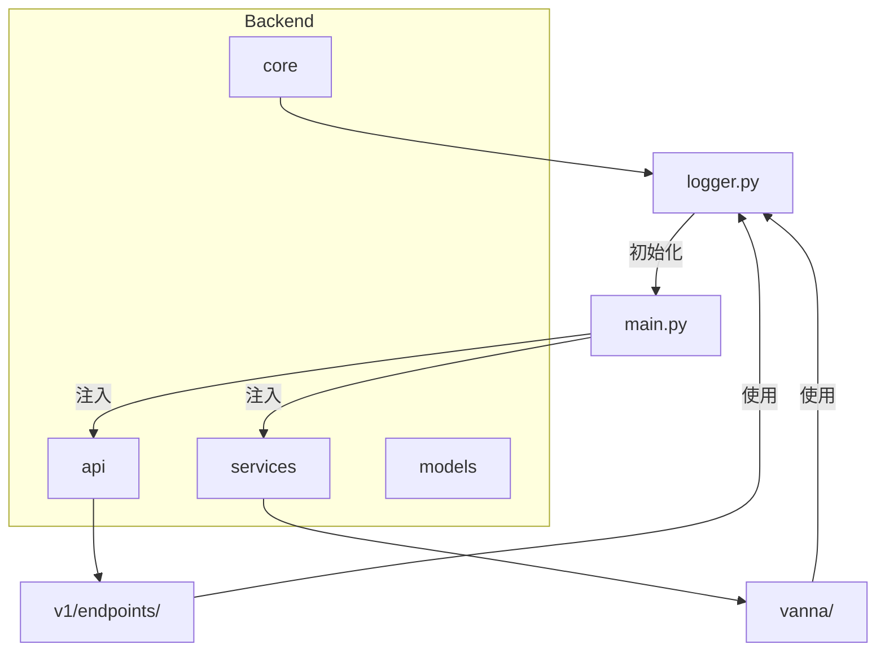
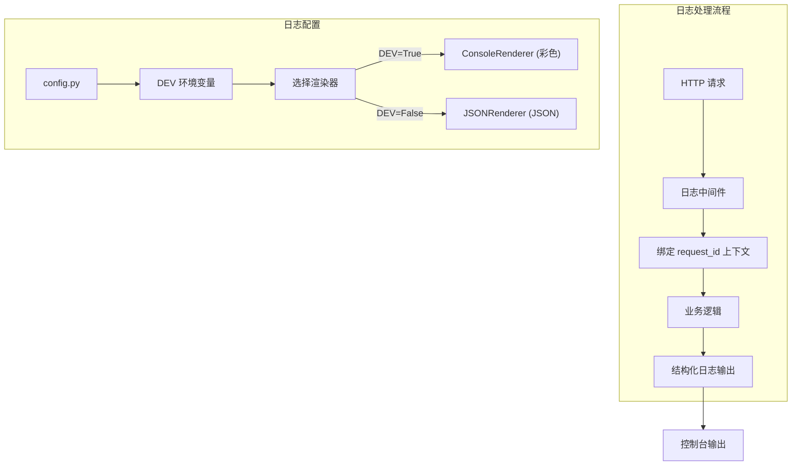
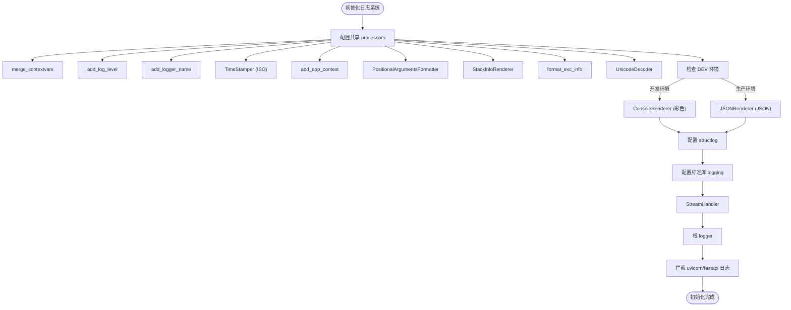
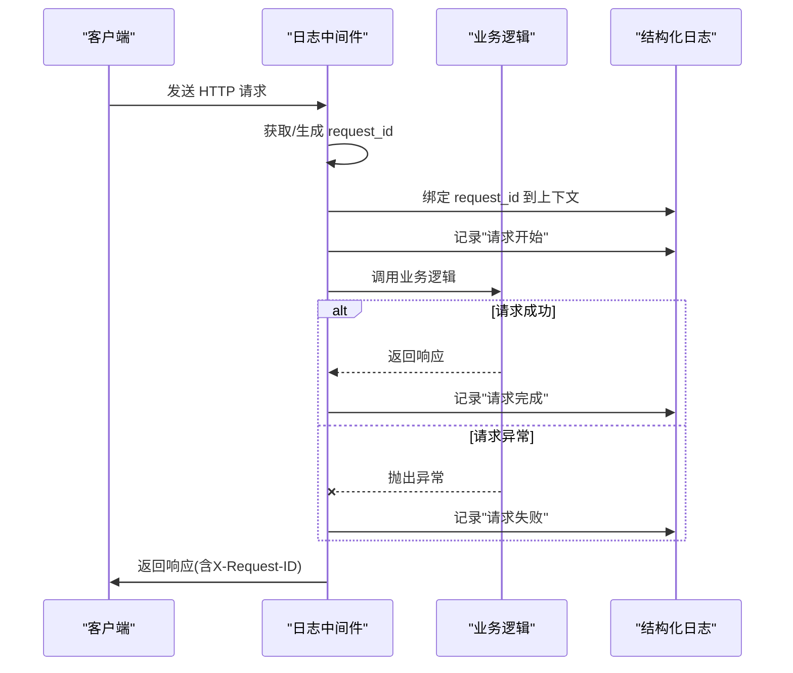
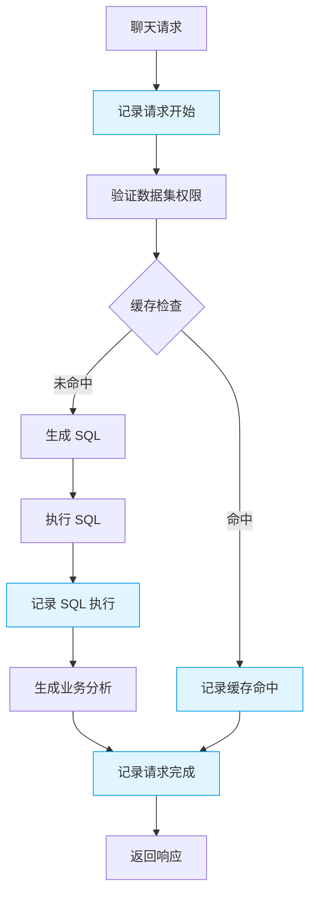
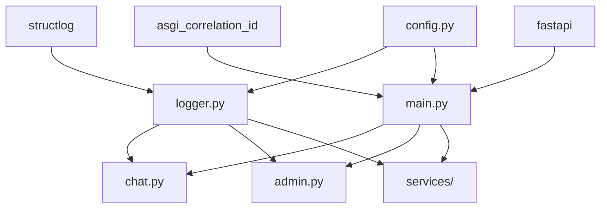

# 结构化日志

<cite>
**本文档引用的文件**
- [logger.py](file://backend/app/core/logger.py)
- [main.py](file://backend/app/main.py)
- [config.py](file://backend/app/core/config.py)
- [chat.py](file://backend/app/api/v1/endpoints/chat.py)
- [sql_generator.py](file://backend/app/services/vanna/sql_generator.py)
- [analyst_service.py](file://backend/app/services/vanna/analyst_service.py)
- [admin.py](file://backend/app/api/v1/endpoints/admin.py)
- [test_business_logs.py](file://backend/tests/test_business_logs.py)
- [.env.example](file://.env.example)
</cite>

## 目录
1. [简介](#简介)
2. [项目结构](#项目结构)
3. [核心组件](#核心组件)
4. [架构概述](#架构概述)
5. [详细组件分析](#详细组件分析)
6. [依赖分析](#依赖分析)
7. [性能考虑](#性能考虑)
8. [故障排除指南](#故障排除指南)
9. [结论](#结论)

## 简介
Universal BI 项目实现了基于 structlog 的结构化日志系统，支持开发环境的彩色控制台输出和生产环境的 JSON 格式输出。该系统通过中间件自动注入请求 ID，实现跨服务的请求追踪，并在业务逻辑中记录关键操作和性能指标。日志系统与 FastAPI 框架深度集成，能够拦截并格式化 uvicorn 和 fastapi 的标准日志输出。

## 项目结构
项目采用分层架构，日志系统主要分布在核心模块和 API 端点中。核心日志配置位于 `backend/app/core/logger.py`，应用入口在 `backend/app/main.py` 中初始化日志系统。各业务模块通过 `get_logger(__name__)` 获取模块级别的 logger 实例，在关键业务流程中记录结构化日志。

**图示来源**
- [logger.py](file://backend/app/core/logger.py)
- [main.py](file://backend/app/main.py)

## 核心组件
结构化日志系统的核心组件包括日志配置、请求中间件和业务日志记录。系统通过 `setup_logging()` 函数初始化，根据 `DEV` 环境变量选择输出格式。HTTP 中间件自动为每个请求生成唯一 ID 并绑定到日志上下文，确保同一请求的所有日志都带有相同的 request_id。业务代码通过 `get_logger()` 获取 logger 实例，在关键操作点记录结构化信息。

**组件来源**
- [logger.py](file://backend/app/core/logger.py#L19-L86)
- [main.py](file://backend/app/main.py#L48-L49)

## 架构概述
日志系统采用分层架构，底层基于 Python 标准库 logging，中间层使用 structlog 进行结构化处理，上层通过 FastAPI 中间件集成。系统在应用启动时初始化，配置共享的 processors 链，包括上下文变量合并、日志级别添加、时间戳生成等。对于 HTTP 请求，系统通过中间件记录请求开始和结束的完整信息，包括方法、路径、客户端 IP、状态码和处理时间。

**图示来源**
- [main.py](file://backend/app/main.py#L85-L123)
- [logger.py](file://backend/app/core/logger.py#L19-L86)

## 详细组件分析

### 日志配置分析
日志配置模块实现了灵活的环境适配机制，通过 `setup_logging()` 函数完成系统初始化。该函数配置了共享的 processors 链，包括上下文变量合并、日志级别、logger 名称、ISO 8601 时间戳等。根据 `settings.DEV` 的值选择不同的渲染器：开发环境使用带颜色的控制台输出，生产环境使用 JSON 格式。系统还拦截了 uvicorn 和 fastapi 的日志，将其重定向到统一的结构化输出。

**图示来源**
- [logger.py](file://backend/app/core/logger.py#L19-L84)

**组件来源**
- [logger.py](file://backend/app/core/logger.py#L19-L86)

### 请求日志中间件分析
HTTP 请求日志中间件是日志系统的关键组件，负责记录每个请求的完整生命周期。中间件首先获取或生成请求 ID，并将其绑定到 structlog 上下文，确保后续所有日志都自动携带该 ID。在请求开始时记录方法、路径、客户端 IP 等信息，在请求结束时记录状态码和处理时间。对于异常情况，中间件会捕获异常并记录详细的错误信息，包括异常类型和堆栈跟踪。

**图示来源**
- [main.py](file://backend/app/main.py#L85-L123)

**组件来源**
- [main.py](file://backend/app/main.py#L85-L123)

### 业务日志使用分析
业务代码在关键操作点使用结构化日志记录详细信息。例如，在聊天服务中，系统记录用户提问、SQL 生成、缓存命中等事件，并包含用户 ID、数据集 ID、问题长度等上下文信息。在管理功能中，系统记录管理员操作，如用户状态变更、用户删除等，便于审计追踪。日志记录包含性能指标，如缓存检查时间、SQL 执行时间等，为性能优化提供数据支持。

**图示来源**
- [chat.py](file://backend/app/api/v1/endpoints/chat.py#L30-L68)
- [sql_generator.py](file://backend/app/services/vanna/sql_generator.py#L62-L144)

**组件来源**
- [chat.py](file://backend/app/api/v1/endpoints/chat.py#L30-L68)
- [sql_generator.py](file://backend/app/services/vanna/sql_generator.py#L62-L144)

## 依赖分析
日志系统依赖于多个核心组件和第三方库。主要依赖包括 structlog 用于结构化日志处理，asgi_correlation_id 用于请求 ID 生成，fastapi 用于中间件集成。系统通过配置文件 `config.py` 获取环境设置，特别是 `DEV` 变量决定日志输出格式。各业务模块通过 `get_logger()` 函数获取 logger 实例，形成清晰的依赖关系。

**图示来源**
- [logger.py](file://backend/app/core/logger.py#L10)
- [main.py](file://backend/app/main.py#L7-L8)
- [config.py](file://backend/app/core/config.py#L11)

## 性能考虑
日志系统在设计时考虑了性能影响。通过缓存 logger 实例（`cache_logger_on_first_use=True`）减少创建开销。在生产环境中使用 JSON 格式输出，便于日志收集系统解析。系统记录关键性能指标，如请求处理时间、缓存检查时间、SQL 执行时间等，帮助识别性能瓶颈。对于高频率的日志记录，建议使用适当的日志级别（如 debug）以避免影响系统性能。

## 故障排除指南
当遇到日志相关问题时，可参考以下排查步骤：检查 `.env` 文件中的 `DEV` 变量设置是否正确；确认 `setup_logging()` 在应用启动时被调用；验证日志中间件是否正确注册；检查业务代码中是否正确获取 logger 实例。对于生产环境，确保日志输出格式为 JSON，便于与 ELK 等日志收集系统集成。如果发现日志丢失，检查是否有异常被静默处理而未记录。

**组件来源**
- [main.py](file://backend/app/main.py#L48)
- [.env.example](file://.env.example#L14)

## 结论
Universal BI 的结构化日志系统提供了强大的日志记录能力，支持开发和生产环境的不同需求。系统通过中间件实现了请求级别的追踪，结合业务代码中的结构化日志记录，为系统监控、故障排查和性能优化提供了有力支持。建议在新开发的业务模块中遵循相同的日志实践，确保日志的一致性和可读性。