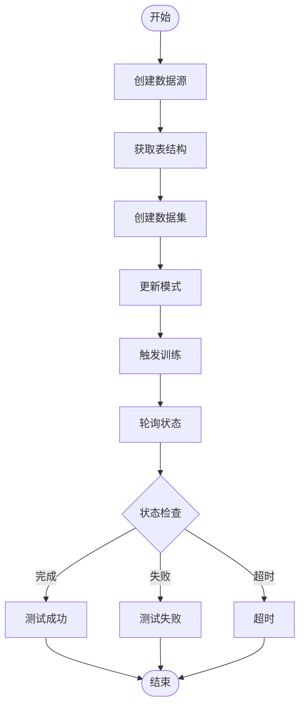
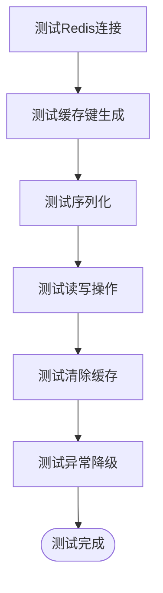
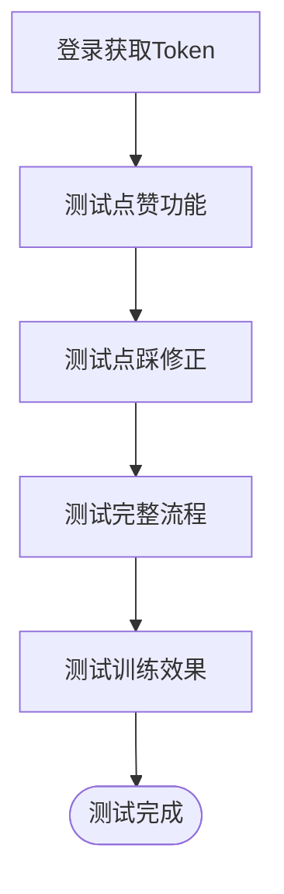
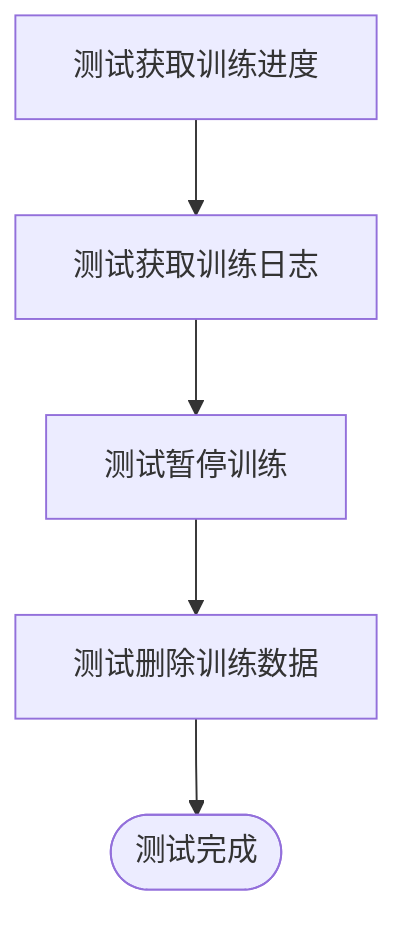
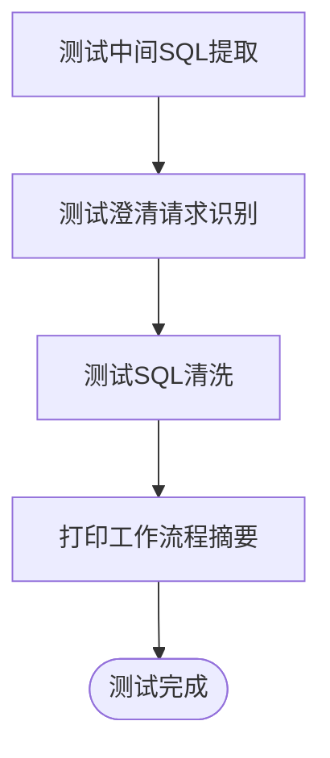
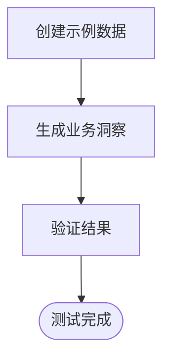
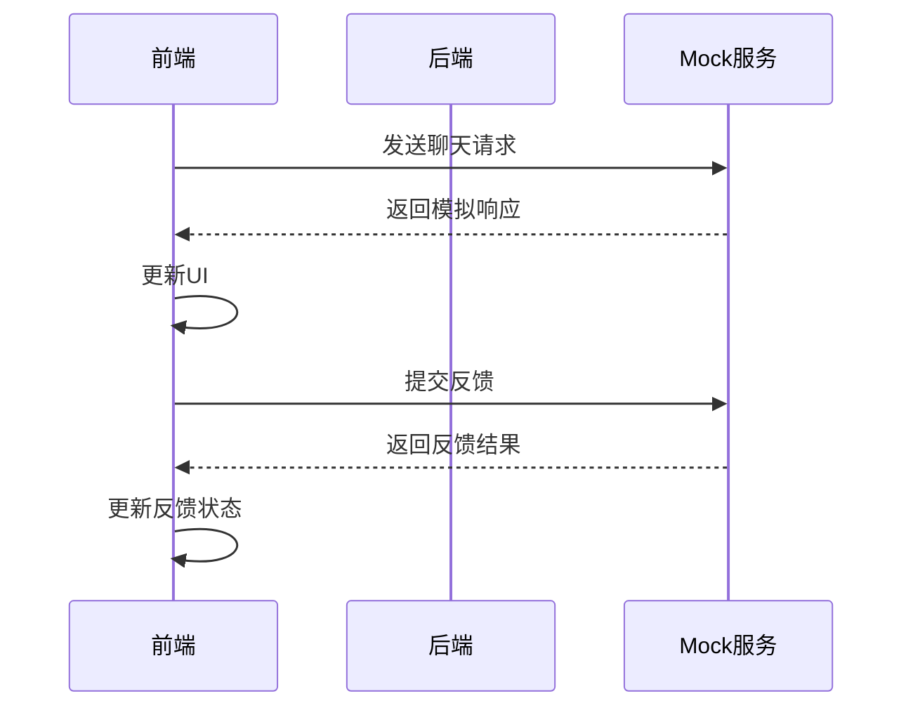
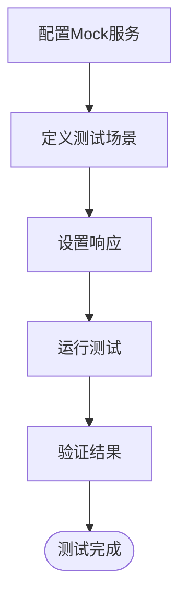
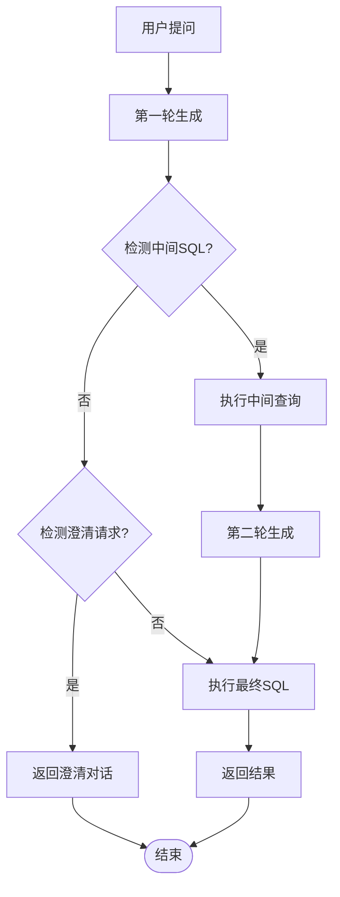
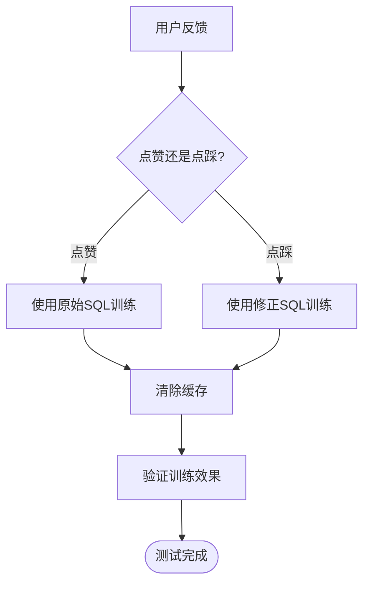

# 测试策略与执行

<cite>
**本文档引用的文件**   
- [test_training_flow.py](file://backend/tests/test_training_flow.py)
- [test_redis_cache.py](file://backend/tests/manual_scripts/test_redis_cache.py)
- [test_feedback_rlhf.py](file://backend/tests/test_feedback_rlhf.py)
- [test_training_api.py](file://backend/tests/test_training_api.py)
- [test_multi_round.py](file://backend/tests/manual_scripts/test_multi_round.py)
- [test_analyst_agent.py](file://backend/tests/test_analyst_agent.py)
- [chat.ts](file://frontend/src/api/chat.ts)
- [MULTI_ROUND_REASONING.md](file://docs/backend/MULTI_ROUND_REASONING.md)
- [FEEDBACK_RLHF.md](file://docs/backend/FEEDBACK_RLHF.md)
- [TEST_CLARIFICATION.md](file://docs/frontend/TEST_CLARIFICATION.md)
</cite>

## 目录
1. [引言](#引言)
2. [后端测试结构](#后端测试结构)
3. [前端测试实践](#前端测试实践)
4. [测试数据准备与Mock配置](#测试数据准备与mock配置)
5. [AI功能测试特殊性](#ai功能测试特殊性)
6. [测试执行与覆盖率](#测试执行与覆盖率)
7. [结论](#结论)

## 引言
本文档旨在为Universal-BI项目提供全面的测试策略，涵盖后端Python测试与前端TypeScript测试实践。文档详细说明了测试结构、运行命令、覆盖率报告生成方法，以及针对AI相关功能的特殊测试方法。通过本策略，确保系统核心功能的稳定性和可靠性。

## 后端测试结构

后端测试主要位于`backend/tests/`目录下，包含单元测试和手动验证脚本。单元测试文件如`test_training_flow.py`用于验证核心训练流程，而`manual_scripts/`中的脚本则用于手动验证缓存机制与边界场景。

### 核心训练流程测试
`test_training_flow.py`文件实现了对核心训练流程的端到端测试，包括数据源创建、表结构获取、数据集创建、模式更新、训练触发和状态轮询等步骤。该测试通过HTTP请求与后端API交互，验证整个训练流程的正确性。



**图示来源**
- [test_training_flow.py](file://backend/tests/test_training_flow.py#L1-L140)

**本节来源**
- [test_training_flow.py](file://backend/tests/test_training_flow.py#L1-L140)

### 缓存机制测试
`manual_scripts/test_redis_cache.py`脚本用于手动验证Redis缓存功能，包括连接测试、缓存键生成、序列化、读写操作、清除缓存和异常降级等测试。该脚本提供了详细的测试输出，便于开发人员验证缓存功能的正确性。



**图示来源**
- [test_redis_cache.py](file://backend/tests/manual_scripts/test_redis_cache.py#L1-L363)

**本节来源**
- [test_redis_cache.py](file://backend/tests/manual_scripts/test_redis_cache.py#L1-L363)

### 反馈RLHF测试
`test_feedback_rlhf.py`文件测试了ChatBI的反馈闭环机制（RLHF），包括点赞、点踩修正、完整流程和训练效果验证。该测试通过模拟用户交互，验证了反馈机制的正确性和有效性。



**图示来源**
- [test_feedback_rlhf.py](file://backend/tests/test_feedback_rlhf.py#L1-L239)

**本节来源**
- [test_feedback_rlhf.py](file://backend/tests/test_feedback_rlhf.py#L1-L239)

### 训练API测试
`test_training_api.py`文件测试了训练进度API端点的存在性和基本功能。该测试使用FastAPI的TestClient，验证了获取训练进度、日志、暂停训练和删除训练数据等端点的可用性。



**图示来源**
- [test_training_api.py](file://backend/tests/test_training_api.py#L1-L81)

**本节来源**
- [test_training_api.py](file://backend/tests/test_training_api.py#L1-L81)

### 多轮推理测试
`manual_scripts/test_multi_round.py`脚本测试了多轮推理和中间SQL处理功能，包括中间SQL提取、澄清请求识别和SQL清洗等测试。该脚本验证了系统处理模糊问题和进行自我反思的能力。



**图示来源**
- [test_multi_round.py](file://backend/tests/manual_scripts/test_multi_round.py#L1-L203)

**本节来源**
- [test_multi_round.py](file://backend/tests/manual_scripts/test_multi_round.py#L1-L203)

### 分析师Agent测试
`test_analyst_agent.py`文件测试了分析师Agent功能，验证了同步生成业务洞察的能力。该测试使用示例数据，验证了生成数据洞察方法的正确性。



**图示来源**
- [test_analyst_agent.py](file://backend/tests/test_analyst_agent.py#L1-L51)

**本节来源**
- [test_analyst_agent.py](file://backend/tests/test_analyst_agent.py#L1-L51)

## 前端测试实践

前端测试主要通过Jest或Vue Test Utils进行，重点测试API封装模块和集成测试。API封装模块如`src/api/chat.ts`定义了与后端交互的接口，需要进行充分的测试。

### API封装模块测试
`src/api/chat.ts`文件定义了与聊天功能相关的API接口，包括发送聊天消息、生成摘要和提交反馈。这些接口需要进行单元测试，确保其正确性和健壮性。

```mermaid
classDiagram
class ChatResponse {
+answer_text? : string
+sql : string | null
+columns? : string[] | null
+rows? : any[] | null
+data : { columns : string[] | null, rows : any[] | null } | null
+chart_type : string
+steps? : string[]
+from_cache? : boolean
+insight? : string
}
class SummaryRequest {
+dataset_id : number
+question : string
+sql : string
+columns : string[]
+rows : any[]
}
class SummaryResponse {
+summary : string
}
class FeedbackRequest {
+dataset_id : number
+question : string
+sql : string
+rating : number
}
class FeedbackResponse {
+success : boolean
+message : string
}
ChatResponse <|-- sendChat
SummaryRequest <|-- generateSummary
SummaryResponse <|-- generateSummary
FeedbackRequest <|-- submitFeedback
FeedbackResponse <|-- submitFeedback
```

**图示来源**
- [chat.ts](file://frontend/src/api/chat.ts#L1-L65)

**本节来源**
- [chat.ts](file://frontend/src/api/chat.ts#L1-L65)

### 集成测试
前端集成测试需要模拟请求进行，验证组件之间的交互和整体功能。通过模拟后端响应，可以测试各种场景下的用户界面行为。



**图示来源**
- [chat.ts](file://frontend/src/api/chat.ts#L1-L65)
- [TEST_CLARIFICATION.md](file://docs/frontend/TEST_CLARIFICATION.md#L1-L377)

**本节来源**
- [chat.ts](file://frontend/src/api/chat.ts#L1-L65)
- [TEST_CLARIFICATION.md](file://docs/frontend/TEST_CLARIFICATION.md#L1-L377)

## 测试数据准备与Mock配置

### 测试数据准备
测试数据的准备是确保测试有效性的关键。对于后端测试，可以通过`scripts/generate_fake_data.py`脚本生成假数据，用于测试各种场景。对于前端测试，可以使用预定义的测试数据集，确保测试的一致性和可重复性。

### Mock服务配置
Mock服务的配置对于前端集成测试至关重要。通过配置Mock服务，可以模拟各种后端响应，包括成功、失败、超时等场景。这有助于测试前端在各种情况下的行为和错误处理能力。



**图示来源**
- [TEST_CLARIFICATION.md](file://docs/frontend/TEST_CLARIFICATION.md#L1-L377)

**本节来源**
- [TEST_CLARIFICATION.md](file://docs/frontend/TEST_CLARIFICATION.md#L1-L377)

## AI功能测试特殊性

### 多轮推理测试
多轮推理功能的测试需要特别关注中间SQL的提取和执行，以及澄清请求的识别。通过`MULTI_ROUND_REASONING.md`文档中的测试用例，可以验证系统处理模糊问题和进行自我反思的能力。



**图示来源**
- [MULTI_ROUND_REASONING.md](file://docs/backend/MULTI_ROUND_REASONING.md#L1-L373)
- [test_multi_round.py](file://backend/tests/manual_scripts/test_multi_round.py#L1-L203)

**本节来源**
- [MULTI_ROUND_REASONING.md](file://docs/backend/MULTI_ROUND_REASONING.md#L1-L373)
- [test_multi_round.py](file://backend/tests/manual_scripts/test_multi_round.py#L1-L203)

### 反馈RLHF测试
反馈RLHF功能的测试需要验证点赞和点踩修正的正确性，以及训练效果的提升。通过`FEEDBACK_RLHF.md`文档中的测试用例，可以验证反馈机制的有效性和AI学习能力。



**图示来源**
- [FEEDBACK_RLHF.md](file://docs/backend/FEEDBACK_RLHF.md#L1-L550)
- [test_feedback_rlhf.py](file://backend/tests/test_feedback_rlhf.py#L1-L239)

**本节来源**
- [FEEDBACK_RLHF.md](file://docs/backend/FEEDBACK_RLHF.md#L1-L550)
- [test_feedback_rlhf.py](file://backend/tests/test_feedback_rlhf.py#L1-L239)

## 测试执行与覆盖率

### 运行测试命令
后端测试使用pytest运行，可以通过以下命令执行：

```bash
cd backend
pytest
```

前端测试使用Vite和Jest，可以通过以下命令执行：

```bash
cd frontend
npm run test
```

### 覆盖率报告生成
使用coverage.py生成后端测试覆盖率报告：

```bash
cd backend
coverage run -m pytest
coverage report
coverage html
```

前端测试覆盖率可以通过Jest的`--coverage`选项生成：

```bash
cd frontend
npm run test -- --coverage
```

**本节来源**
- [test_training_flow.py](file://backend/tests/test_training_flow.py#L1-L140)
- [test_redis_cache.py](file://backend/tests/manual_scripts/test_redis_cache.py#L1-L363)
- [test_feedback_rlhf.py](file://backend/tests/test_feedback_rlhf.py#L1-L239)
- [test_training_api.py](file://backend/tests/test_training_api.py#L1-L81)
- [test_multi_round.py](file://backend/tests/manual_scripts/test_multi_round.py#L1-L203)
- [test_analyst_agent.py](file://backend/tests/test_analyst_agent.py#L1-L51)

## 结论
本文档提供了Universal-BI项目的全面测试策略，涵盖了后端Python测试与前端TypeScript测试实践。通过详细的测试结构、运行命令和覆盖率报告生成方法，确保了系统核心功能的稳定性和可靠性。特别是针对AI相关功能的特殊测试方法，为提升AI准确率提供了有力支持。建议在项目开发过程中严格执行本测试策略，持续优化测试用例，提高软件质量。