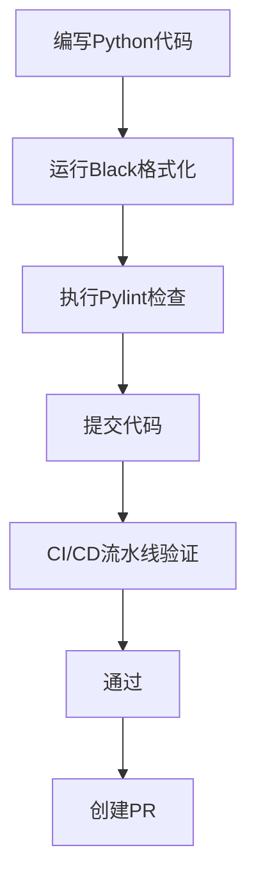
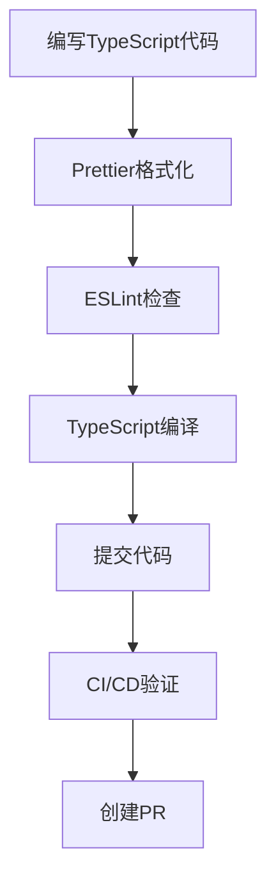
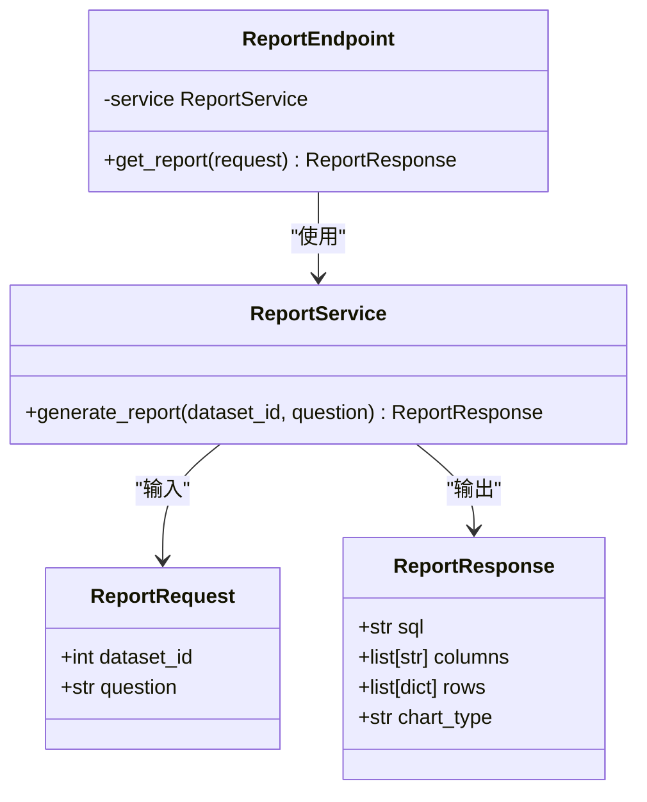
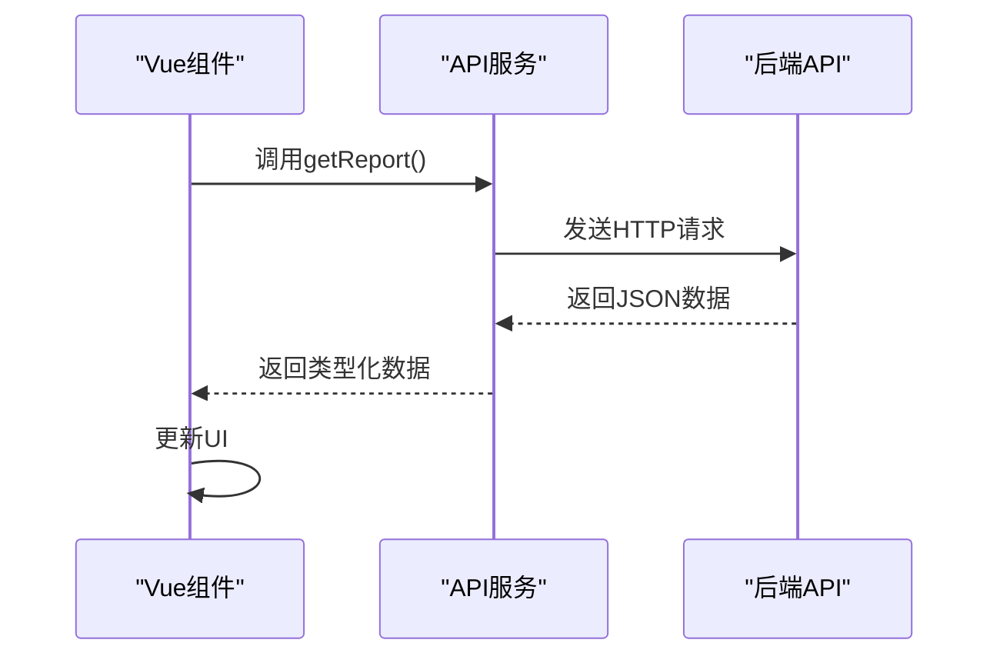

# 贡献流程与代码规范

<cite>
**本文档引用文件**  
- [main.py](file://backend/app/main.py)
- [chat.py](file://backend/app/api/v1/endpoints/chat.py)
- [chat.ts](file://frontend/src/api/chat.ts)
- [deps.py](file://backend/app/api/deps.py)
- [config.py](file://backend/app/core/config.py)
- [main.ts](file://frontend/src/main.ts)
- [requirements.txt](file://backend/requirements.txt)
- [package.json](file://frontend/package.json)
- [tsconfig.json](file://frontend/tsconfig.json)
- [vite.config.ts](file://frontend/vite.config.ts)
- [README.md](file://README.md)
- [QUICKSTART.md](file://QUICKSTART.md)
</cite>

## 目录
1. [简介](#简介)
2. [Git分支管理策略](#git分支管理策略)
3. [Pull Request规范](#pull-request规范)
4. [代码风格与格式化](#代码风格与格式化)
5. [新增功能开发指南](#新增功能开发指南)
6. [架构模式遵循](#架构模式遵循)
7. [代码审查重点](#代码审查重点)
8. [测试要求](#测试要求)
9. [文档更新](#文档更新)

## 简介
本指南旨在为开源贡献者提供清晰的代码提交标准与协作流程。通过规范化的分支管理、代码风格、功能开发和审查流程，确保项目代码质量与可维护性。本项目采用前后端分离架构，后端基于FastAPI（Python），前端基于Vue 3（TypeScript）。

## Git分支管理策略
项目采用多分支协作模式，明确各分支职责：

- `main`：稳定分支，仅包含已发布或可发布的稳定代码。所有生产环境部署均基于此分支。
- `develop`：集成分支，用于集成各功能分支的代码，作为预发布测试的基础。
- `feature/*`：功能分支，所有新功能开发均从此类分支进行，命名格式为`feature/功能描述`（如`feature/user-auth`）。
- `hotfix/*`：紧急修复分支，用于快速修复生产环境问题，修复完成后需合并至`main`和`develop`。

**分支操作流程**：
1. 从`develop`分支创建新的`feature/*`分支
2. 在功能分支上完成开发与测试
3. 提交Pull Request至`develop`分支
4. 经代码审查通过后合并
5. 定期从`develop`合并至`main`进行发布

**Section sources**
- [README.md](file://README.md#L483-L484)

## Pull Request规范
创建Pull Request时需遵循以下要求：

1. **关联Issue**：每个PR必须关联一个已存在的Issue，使用`Closes #ISSUE_NUMBER`或`Fixes #ISSUE_NUMBER`格式在描述中声明。
2. **清晰描述**：PR描述应包含：
   - 功能/修复目的
   - 实现方案简述
   - 相关截图（如UI变更）
   - 测试方法
3. **代码范围**：保持PR专注单一功能或修复，避免包含无关变更。
4. **标签使用**：根据内容添加适当标签（如`enhancement`、`bug`、`documentation`）。

**Section sources**
- [README.md](file://README.md#L483-L484)

## 代码风格与格式化
### Python代码规范
后端Python代码需遵循统一风格：

- **格式化**：使用[Black](https://github.com/psf/black)进行代码格式化，确保代码风格一致性。
- **静态检查**：通过Pylint进行代码质量检查，消除潜在错误和不良实践。
- **依赖管理**：所有Python依赖定义在`backend/requirements.txt`中。



**Diagram sources**
- [requirements.txt](file://backend/requirements.txt#L1-L19)

### TypeScript代码规范
前端TypeScript代码需遵循统一标准：

- **格式化**：使用[Prettier](https://prettier.io/)进行代码格式化，配置文件为`frontend/.prettierrc`。
- **静态检查**：通过[ESLint](https://eslint.org/)进行代码质量检查，规则定义在`frontend/.eslintrc.cjs`。
- **类型检查**：使用TypeScript编译器进行严格类型检查，配置文件为`frontend/tsconfig.json`。



**Diagram sources**
- [package.json](file://frontend/package.json#L1-L40)
- [tsconfig.json](file://frontend/tsconfig.json#L1-L23)
- [vite.config.ts](file://frontend/vite.config.ts#L1-L27)

## 新增功能开发指南
### 后端API开发
新增API端点需遵循以下流程：

1. 在`backend/app/api/v1/endpoints/`目录下创建新模块文件
2. 定义Pydantic Schema在`backend/app/schemas/`对应文件中
3. 实现业务逻辑在`backend/app/services/`中
4. 在`main.py`中注册新路由

例如，添加新的`report`端点：
- 创建`backend/app/api/v1/endpoints/report.py`
- 定义Schema在`backend/app/schemas/report.py`
- 实现服务逻辑在`backend/app/services/report_service.py`



**Diagram sources**
- [main.py](file://backend/app/main.py#L1-L35)
- [chat.py](file://backend/app/api/v1/endpoints/chat.py#L1-L156)

### 前端接口开发
前端新增功能需遵循以下规范：

1. 在`src/api/`目录下创建对应的TypeScript模块
2. 定义接口请求/响应类型
3. 在Vue组件中通过Composition API调用

例如，封装新的报表API：
- 创建`src/api/report.ts`
- 导出`getReport`等函数
- 在`views/Report/index.vue`中调用



**Diagram sources**
- [chat.ts](file://frontend/src/api/chat.ts#L1-L65)
- [main.ts](file://frontend/src/main.ts#L1-L26)

## 架构模式遵循
新增代码必须遵循现有架构模式，确保系统一致性。

### 依赖注入
使用FastAPI的依赖注入系统管理服务实例和数据库会话。所有需要数据库访问的端点应通过`Depends(get_db)`获取会话。

```python
from app.db.session import get_db
from sqlalchemy.orm import Session

@router.get("/")
def read_items(db: Session = Depends(get_db)):
    return item_service.get_items(db)
```

**Section sources**
- [deps.py](file://backend/app/api/deps.py#L1-L124)

### 数据所有权过滤
实现数据隔离，确保用户只能访问自己的数据或公共资源。通过`apply_ownership_filter`函数实现：

```python
from app.api.deps import apply_ownership_filter

def get_datasets(db, current_user):
    query = db.query(Dataset)
    return apply_ownership_filter(query, Dataset, current_user).all()
```

该机制在`deps.py`中定义，所有涉及用户数据的查询都必须应用此过滤。

**Section sources**
- [deps.py](file://backend/app/api/deps.py#L97-L124)

## 代码审查重点
代码审查应重点关注以下方面：

### 安全性
- 验证所有用户输入
- 防止SQL注入、XSS等常见漏洞
- 正确处理认证与授权
- 敏感信息不硬编码

### 性能
- 避免N+1查询问题
- 合理使用数据库索引
- 大数据集分页处理
- 缓存策略合理性

### 可维护性
- 代码结构清晰，职责单一
- 充足的注释和文档
- 避免重复代码
- 合理的错误处理

### 测试覆盖
- 核心逻辑必须有单元测试
- API端点应有集成测试
- 边界条件和异常情况覆盖

**Section sources**
- [chat.py](file://backend/app/api/v1/endpoints/chat.py#L13-L43)
- [chat.ts](file://frontend/src/api/chat.ts#L42-L56)

## 测试要求
所有代码变更必须包含相应的测试：

- **后端测试**：位于`backend/tests/`目录，使用Python标准测试框架
- **前端测试**：建议添加单元测试和组件测试
- **测试覆盖率**：新增功能应达到80%以上测试覆盖率
- **测试数据**：使用`scripts/generate_fake_data.py`生成测试数据

**Section sources**
- [README.md](file://README.md#L399-L401)

## 文档更新
代码变更可能影响文档，需同步更新：

1. **README更新**：重大功能变更需更新README中的使用指南
2. **API文档**：新增API需在`docs/backend/`中添加说明
3. **架构文档**：架构变更需更新`docs/general/`中的相关文档
4. **快速入门**：影响部署流程的变更需更新`QUICKSTART.md`

**Section sources**
- [README.md](file://README.md#L204-L241)
- [QUICKSTART.md](file://QUICKSTART.md#L1-L274)