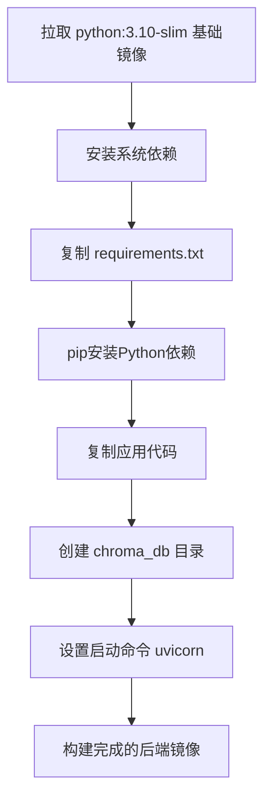
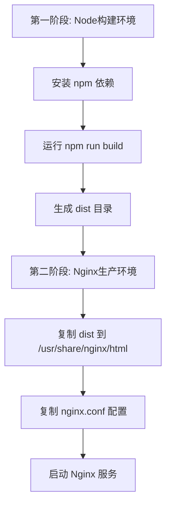
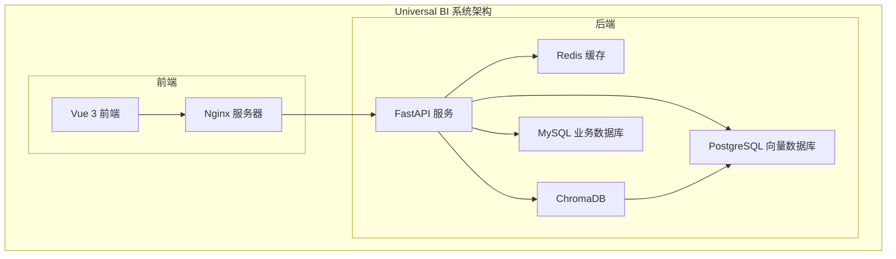
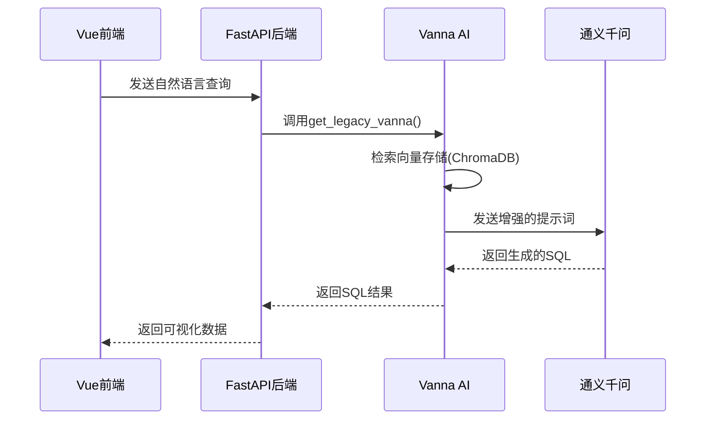

# 技术栈与依赖

<cite>
**本文档引用的文件**
- [requirements.txt](file://backend/requirements.txt)
- [package.json](file://frontend/package.json)
- [Dockerfile.backend](file://Dockerfile.backend)
- [Dockerfile.frontend](file://Dockerfile.frontend)
- [main.py](file://backend/app/main.py)
- [vanna_manager.py](file://backend/app/services/vanna_manager.py)
- [config.py](file://backend/app/core/config.py)
- [docker-compose.yml](file://docker-compose.yml)
- [vite.config.ts](file://frontend/vite.config.ts)
- [tsconfig.json](file://frontend/tsconfig.json)
- [tailwind.config.js](file://frontend/tailwind.config.js)
- [postcss.config.js](file://frontend/postcss.config.js)
</cite>

## 目录
1. [简介](#简介)
2. [后端技术栈](#后端技术栈)
3. [前端技术栈](#前端技术栈)
4. [依赖管理方式](#依赖管理方式)
5. [构建流程](#构建流程)
6. [兼容性要求](#兼容性要求)
7. [运行时环境配置](#运行时环境配置)
8. [关键依赖交互关系](#关键依赖交互关系)
9. [总结](#总结)

## 简介
本技术栈文档详细说明了Universal BI平台所采用的核心技术及其版本范围。系统采用前后端分离架构，后端基于Python生态构建，前端基于现代JavaScript框架开发。文档涵盖了API框架、ORM、AI引擎、向量存储、缓存系统等核心技术选型，以及依赖管理、构建流程和运行时环境配置等关键信息。

## 后端技术栈

### FastAPI (API框架)
FastAPI作为后端核心API框架，提供了高性能的异步处理能力。其基于Python 3.7+的类型提示特性，实现了自动化的API文档生成和数据验证功能。FastAPI的异步支持使得系统能够高效处理大量并发请求，特别适合AI驱动的BI查询场景。

### SQLAlchemy (ORM)
SQLAlchemy作为对象关系映射(ORM)工具，提供了强大的数据库抽象层。它支持多种数据库后端(MySQL、PostgreSQL、SQLite)，并通过声明式语法简化了数据库操作。在本项目中，SQLAlchemy用于管理主业务数据库的连接和操作。

### Vanna AI (NL2SQL引擎)
Vanna AI是核心的自然语言到SQL(NL2SQL)转换引擎，版本要求v2.0.0及以上。它将用户友好的自然语言查询转换为精确的SQL语句，支持多种AI模型后端。Vanna通过向量存储记忆数据库结构和业务术语，不断提升查询准确性。

### ChromaDB (向量存储)
ChromaDB作为向量数据库，存储Vanna AI的训练数据，包括数据库模式(DDL)、业务术语和问答对。每个数据集都有独立的向量集合(vec_ds_{dataset_id})，支持高效的相似性搜索，帮助AI理解上下文并生成准确的SQL查询。

### Redis (缓存与会话)
Redis提供多级缓存机制，包括查询结果缓存(默认5分钟)和SQL生成缓存(默认7天)。通过redis://localhost:6379/0连接，Redis显著提升了系统响应速度，避免了重复的AI推理和数据库查询开销。

**Section sources**
- [requirements.txt](file://backend/requirements.txt)
- [main.py](file://backend/app/main.py)
- [vanna_manager.py](file://backend/app/services/vanna_manager.py)
- [config.py](file://backend/app/core/config.py)

## 前端技术栈

### Vue 3 (框架)
Vue 3作为前端核心框架，利用其组合式API和响应式系统构建了现代化的单页应用。通过<script setup>语法糖，实现了更简洁的组件定义方式。Vue Router 4管理应用路由，Pinia提供状态管理。

### TypeScript (语言)
TypeScript为前端代码提供了静态类型检查，增强了代码的可维护性和开发体验。配置中启用了严格模式(strict: true)，确保类型安全。通过tsconfig.json中的路径别名(@/*指向src/*)，简化了模块导入。

### Element Plus (UI组件库)
Element Plus提供了一套完整的UI组件，包括数据表格、表单、对话框等。项目采用了其暗色主题，通过在main.ts中导入dark css变量实现。@element-plus/icons-vue提供了丰富的图标支持。

### ECharts (可视化)
ECharts用于数据可视化展示，通过vue-echarts 6.x封装实现了在Vue 3中的无缝集成。支持各种图表类型，包括折线图、柱状图、饼图等，满足BI平台的多样化展示需求。

### Tailwind CSS (样式)
Tailwind CSS作为实用优先的CSS框架，通过在vite.config.ts中配置别名和tailwind.config.js中定义主题，实现了高效的样式开发。结合PostCSS和Autoprefixer，确保了跨浏览器兼容性。

**Section sources**
- [package.json](file://frontend/package.json)
- [main.ts](file://frontend/src/main.ts)
- [App.vue](file://frontend/src/App.vue)
- [vite.config.ts](file://frontend/vite.config.ts)
- [tsconfig.json](file://frontend/tsconfig.json)
- [tailwind.config.js](file://frontend/tailwind.config.js)
- [postcss.config.js](file://frontend/postcss.config.js)

## 依赖管理方式

### 后端依赖管理 (pip)
后端使用pip作为包管理工具，依赖关系定义在requirements.txt文件中。通过阿里云镜像源(https://mirrors.aliyun.com/pypi/simple/)加速包安装。关键依赖包括：
- fastapi: 异步API框架
- sqlalchemy: ORM工具
- vanna>=2.0.0: NL2SQL引擎
- chromadb: 向量数据库
- redis>=5.0.0: 缓存系统

### 前端依赖管理 (pnpm)
前端使用pnpm作为包管理工具，通过package.json管理依赖。pnpm-lock.yaml确保了依赖版本的一致性。开发依赖包括：
- typescript: 类型检查
- vite: 构建工具
- vue-tsc: Vue单文件组件类型检查
生产依赖包括：
- vue: 核心框架
- element-plus: UI组件库
- echarts: 可视化库

**Section sources**
- [requirements.txt](file://backend/requirements.txt)
- [package.json](file://frontend/package.json)
- [pnpm-lock.yaml](file://pnpm-lock.yaml)

## 构建流程

### 后端Docker镜像构建
后端Docker构建流程定义在Dockerfile.backend中，基于python:3.10-slim基础镜像。构建过程包括：
1. 安装系统依赖(gcc、g++、数据库客户端)
2. 复制并安装Python依赖
3. 复制应用代码
4. 创建必要目录(chroma_db, logs)
5. 设置启动命令(uvicorn app.main:app)

**Diagram sources**
- [Dockerfile.backend](file://Dockerfile.backend)

### 前端Docker镜像构建
前端Docker构建采用多阶段构建策略，定义在Dockerfile.frontend中。流程包括：
1. 构建阶段：基于node:18-alpine安装依赖并构建
2. 生产阶段：基于nginx:alpine部署构建产物
3. 复制Nginx配置实现反向代理

**Diagram sources**
- [Dockerfile.frontend](file://Dockerfile.frontend)

## 兼容性要求

### Python版本要求
后端要求Python 3.9及以上版本，当前使用Python 3.10-slim作为基础镜像。项目利用了Python 3.7+的类型提示特性，以及async/await语法实现异步处理。

### Node.js版本要求
前端构建要求Node.js 18或更高版本，由Dockerfile.frontend中的node:18-alpine镜像保证。开发服务器(vite)需要ES模块支持。

### 数据库兼容性
系统支持多种数据库后端：
- MySQL 8.0 (主业务数据库)
- PostgreSQL 15 (向量数据库)
- SQLite (可选的轻量级替代)

通过SQLAlchemy的抽象层，应用代码与具体数据库实现解耦。

**Section sources**
- [Dockerfile.backend](file://Dockerfile.backend)
- [Dockerfile.frontend](file://Dockerfile.frontend)
- [docker-compose.yml](file://docker-compose.yml)

## 运行时环境配置

### Docker Compose环境
通过docker-compose.yml定义了完整的运行时环境，包括：
- MySQL: 主业务数据库
- PostgreSQL: 向量数据库
- Redis: 缓存服务
- Backend: FastAPI应用
- Frontend: Nginx静态服务

各服务通过universal-bi-network网络互联，实现了服务发现和通信。

**Diagram sources**
- [docker-compose.yml](file://docker-compose.yml)

### 环境变量配置
通过.env文件集中管理配置，主要环境变量包括：
- DASHSCOPE_API_KEY: 通义千问API密钥
- QWEN_MODEL: 使用的Qwen模型(qwen-max, qwen-plus等)
- REDIS_URL: Redis连接地址
- CHROMA_PERSIST_DIR: ChromaDB持久化目录

**Section sources**
- [docker-compose.yml](file://docker-compose.yml)
- [config.py](file://backend/app/core/config.py)

## 关键依赖交互关系

### Vanna与Qwen模型集成
Vanna通过OpenAI兼容API调用阿里云通义千问(Qwen)模型。在vanna_manager.py中配置了自定义的OpenAI客户端，指向DashScope的兼容模式端点：

**Diagram sources**
- [vanna_manager.py](file://backend/app/services/vanna_manager.py)
- [config.py](file://backend/app/core/config.py)

### 缓存层级架构
系统实现了多级缓存策略：
1. Redis缓存查询结果(5分钟)
2. Redis缓存SQL生成结果(7天)
3. ChromaDB向量缓存训练数据

当用户查询时，系统首先检查Redis缓存，避免重复的AI推理过程。

**Section sources**
- [vanna_manager.py](file://backend/app/services/vanna_manager.py)
- [config.py](file://backend/app/core/config.py)

## 总结
Universal BI平台采用了现代化的技术栈组合，后端利用FastAPI的异步性能优势和Vanna AI对多种AI模型的支持能力，前端采用Vue 3生态系统实现响应式界面。通过Docker容器化部署，确保了环境一致性。系统设计考虑了可扩展性和维护性，各组件职责清晰，交互明确。