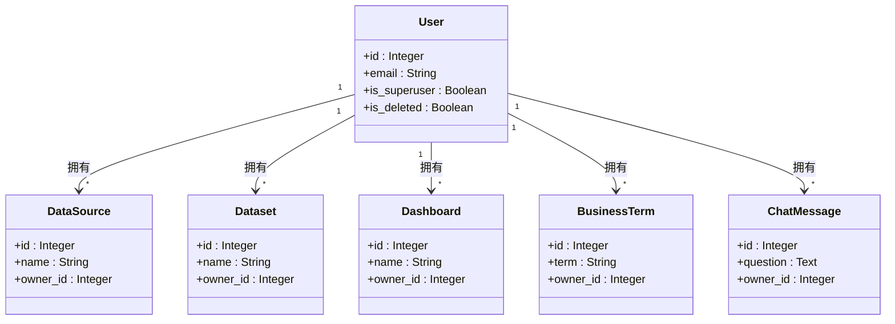
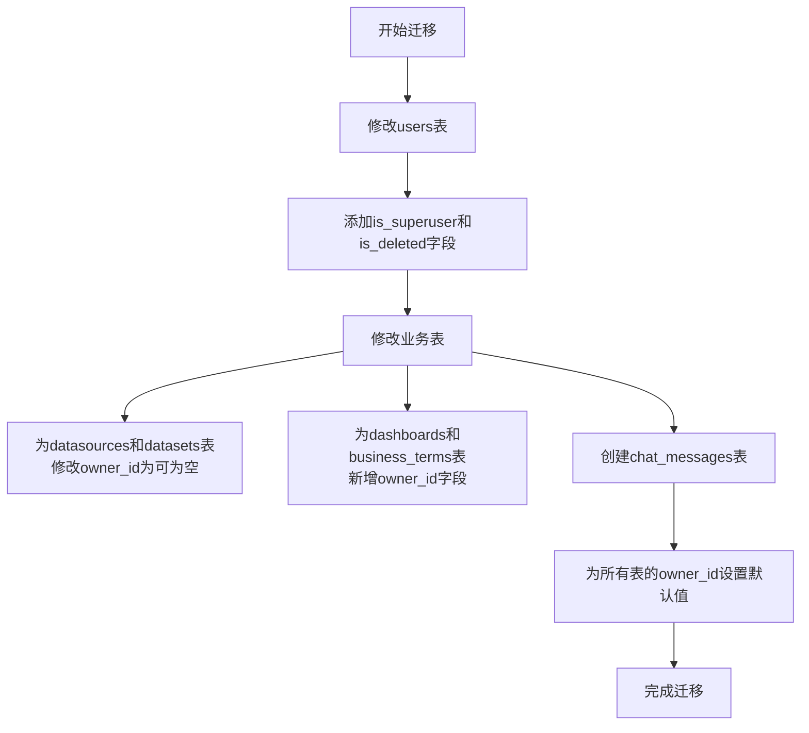
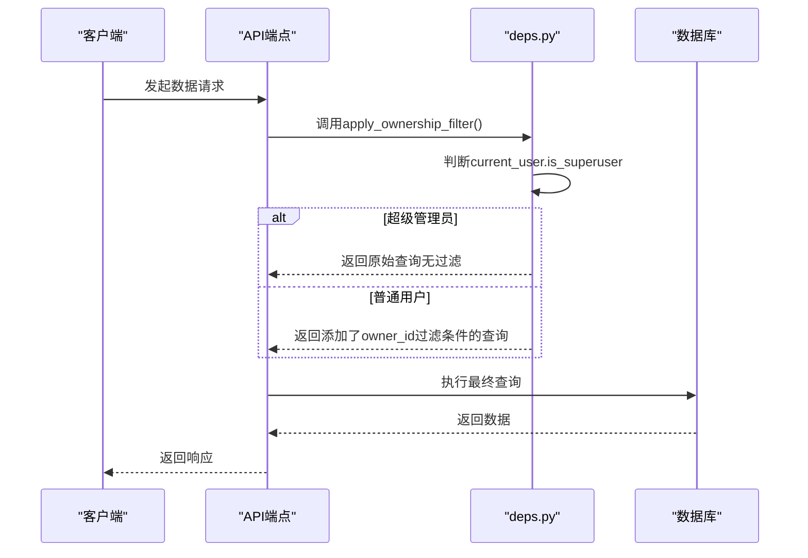

# SaaS数据隔离与所有权控制

<cite>
**本文档引用文件**   
- [metadata.py](file://backend/app/models/metadata.py)
- [001_add_saas_features.sql](file://backend/migrations/001_add_saas_features.sql)
- [SAAS_UPGRADE_GUIDE.md](file://docs/backend/SAAS_UPGRADE_GUIDE.md)
- [deps.py](file://backend/app/api/deps.py)
- [datasource.py](file://backend/app/api/v1/endpoints/datasource.py)
- [dataset.py](file://backend/app/api/v1/endpoints/dataset.py)
- [dashboard.py](file://backend/app/api/v1/endpoints/dashboard.py)
- [chat.py](file://backend/app/api/v1/endpoints/chat.py)
</cite>

## 目录
1. [引言](#引言)
2. [核心数据模型与owner_id字段](#核心数据模型与owner_id字段)
3. [数据库迁移与表结构变更](#数据库迁移与表结构变更)
4. [API层的数据过滤与依赖注入](#apilayer的数据过滤与依赖注入)
5. [数据访问权限与安全边界](#数据访问权限与安全边界)
6. [实际查询示例与权限差异](#实际查询示例与权限差异)
7. [结论](#结论)

## 引言

本文档深入阐述了在Universal-BI项目中实现的SaaS多租户架构下的数据隔离机制。该机制的核心是通过在所有业务实体中引入`owner_id`字段，实现用户数据的逻辑隔离。系统设计确保了普通用户只能访问自己的数据和公共资源，而超级管理员则拥有访问所有数据的权限。文档将详细分析`owner_id`字段在数据模型中的集成方式、在各实体间的传播逻辑、数据库迁移过程以及API层如何通过依赖注入自动应用数据过滤规则，最终构建起服务层与数据库层双重保障的安全边界。

## 核心数据模型与owner_id字段

在SaaS多租户架构中，`owner_id`字段是实现数据隔离的关键。该字段被集成到`metadata.py`文件定义的所有核心业务模型中，作为外键关联到`User`表，从而建立数据与用户的归属关系。



**图示来源**
- [metadata.py](file://backend/app/models/metadata.py#L6-L129)

**Section sources**
- [metadata.py](file://backend/app/models/metadata.py#L6-L129)

### owner_id字段的集成与传播逻辑

`owner_id`字段在所有业务模型中均被定义为可为空（`nullable=True`）的整数类型，并作为外键指向`users.id`。其核心作用和传播逻辑如下：

1.  **数据归属**：`owner_id`明确标识了每条数据记录的所有者。当`owner_id`为具体用户ID时，表示该数据为该用户的私有资源。
2.  **公共资源**：当`owner_id`为`NULL`时，表示该数据是系统级的公共资源。根据`SAAS_UPGRADE_GUIDE.md`文档，所有用户都可以查看公共资源，但只有超级管理员才能修改或删除它们。
3.  **创建时的自动设置**：在创建新资源时，API端点会自动将`owner_id`设置为当前登录用户（`current_user.id`）。例如，在`datasource.py`中，创建数据源时会执行`owner_id=current_user.id`。
4.  **级联关系**：数据集（Dataset）的所有权依赖于其关联的数据源（DataSource），而仪表盘（Dashboard）和业务术语（BusinessTerm）等又依赖于数据集。这种设计确保了权限的传递性，即用户必须先拥有对父级资源的访问权限，才能创建或访问子级资源。

## 数据库迁移与表结构变更

为了将现有系统升级为SaaS多租户架构，项目通过`001_add_saas_features.sql`迁移脚本对数据库进行了结构性改造。



**图示来源**
- [001_add_saas_features.sql](file://backend/migrations/001_add_saas_features.sql#L1-L149)

**Section sources**
- [001_add_saas_features.sql](file://backend/migrations/001_add_saas_features.sql#L1-L149)

### 迁移脚本详解

该SQL脚本主要执行了以下操作：

1.  **增强User模型**：向`users`表添加了`is_superuser`和`is_deleted`两个布尔字段。前者用于标识平台超级管理员，后者用于实现用户软删除功能，保护数据完整性。
2.  **修改现有表**：对于`datasources`和`datasets`表，脚本执行了`ALTER COLUMN owner_id DROP NOT NULL`，确保`owner_id`字段可以为`NULL`，以支持公共资源。
3.  **新增字段**：为`dashboards`和`business_terms`表添加了新的`owner_id`字段，并建立了指向`users(id)`的外键约束。
4.  **创建新表**：创建了`chat_messages`表，用于存储用户与AI的对话历史，并同样包含了`owner_id`字段。
5.  **数据初始化**：脚本将所有现有数据的`owner_id`默认设置为`1`（假设ID为1的用户是首个管理员），并为超级管理员字段赋值。这确保了迁移后所有历史数据都有明确的所有者。

## API层的数据过滤与依赖注入

数据隔离的实现不仅依赖于数据库层面的`owner_id`字段，更关键的是在API层通过代码逻辑强制执行访问控制。这一机制的核心是`deps.py`文件中定义的`apply_ownership_filter`函数，并通过FastAPI的依赖注入系统在各个端点中自动应用。



**图示来源**
- [deps.py](file://backend/app/api/deps.py#L97-L124)
- [datasource.py](file://backend/app/api/v1/endpoints/datasource.py#L71-L73)

**Section sources**
- [deps.py](file://backend/app/api/deps.py#L97-L124)

### 依赖注入与过滤逻辑

1.  **核心函数 `apply_ownership_filter`**：
    *   此函数接收一个SQLAlchemy查询对象、一个模型类和当前用户对象。
    *   如果当前用户是超级管理员（`current_user.is_superuser`为`True`），则直接返回原始查询，允许其访问所有数据。
    *   如果是普通用户，则返回一个经过过滤的查询，该查询通过`or_`条件确保只返回`owner_id`等于当前用户ID或`owner_id`为`NULL`（公共资源）的记录。

2.  **在端点中的应用**：
    *   在`datasource.py`、`dataset.py`等端点文件中，几乎所有读取数据的端点（如`read_datasources`）都会调用此函数。
    *   例如，在`datasource.py`的`read_datasources`函数中，先创建一个查询`query = db.query(DataSource)`，然后立即通过`query = apply_ownership_filter(query, DataSource, current_user)`对其进行过滤，最后才执行查询并返回结果。

3.  **公共资源保护**：
    *   对于修改和删除操作，除了应用数据过滤外，还会进行额外的检查。例如，在`delete_datasource`端点中，会检查`if datasource.owner_id is None and not current_user.is_superuser`，如果尝试删除的是公共资源且当前用户不是超级管理员，则抛出403错误。

## 数据访问权限与安全边界

系统的安全边界由服务层和数据库层共同构建，形成了双重保障。

**服务层**：通过`get_current_user`和`get_current_superuser`等依赖函数，确保了所有API调用都经过身份验证和权限校验。`get_current_user`函数不仅验证JWT令牌，还检查用户是否被软删除（`is_deleted`）或被封禁（`is_active`），从源头上阻止了无效用户的访问。

**数据库层**：`owner_id`字段和外键约束构成了数据隔离的物理基础。即使服务层逻辑出现疏漏，数据库的结构设计也能在一定程度上防止数据越权访问。

这种分层设计确保了：
*   **普通用户**：只能看到和操作自己的私有数据以及系统提供的公共资源。
*   **超级管理员**：可以访问所有数据，负责管理公共资源和进行系统维护。

## 实际查询示例与权限差异

以下示例展示了普通用户与管理员在数据访问权限上的具体差异。

### 普通用户视角

当普通用户（非超级管理员）发起请求时，其查询结果会自动过滤。

```sql
-- 用户A (ID=2) 请求获取所有数据源
-- 实际执行的SQL（由apply_ownership_filter生成）
SELECT * FROM datasources 
WHERE owner_id = 2 OR owner_id IS NULL;
```
此查询将返回用户A自己创建的数据源（`owner_id=2`）以及所有`owner_id=NULL`的公共资源。

### 超级管理员视角

当超级管理员发起相同的请求时，过滤逻辑被绕过。

```sql
-- 超级管理员 (ID=1) 请求获取所有数据源
-- 实际执行的SQL
SELECT * FROM datasources;
-- 返回所有记录，无任何过滤
```

### 权限验证示例

根据`SAAS_UPGRADE_GUIDE.md`中的说明，如果用户B尝试访问用户A的私有数据源，其请求将被拒绝：

```bash
# 用户B尝试访问用户A的私有数据源（ID=1）
curl -X GET http://localhost:8000/api/v1/datasources/1 \
  -H "Authorization: Bearer <user_b_token>"
# 返回：404 Not found or access denied
```

**Section sources**
- [SAAS_UPGRADE_GUIDE.md](file://docs/backend/SAAS_UPGRADE_GUIDE.md#L186-L198)
- [datasource.py](file://backend/app/api/v1/endpoints/datasource.py#L86-L92)

## 结论

Universal-BI项目通过在`metadata.py`中为所有核心实体引入`owner_id`字段，并结合`001_add_saas_features.sql`迁移脚本完成数据库升级，成功实现了SaaS多租户架构。系统利用`deps.py`中的`apply_ownership_filter`函数，通过FastAPI的依赖注入机制，在API层自动为所有查询应用数据隔离规则。`SAAS_UPGRADE_GUIDE.md`文档明确了`owner_id`为`NULL`时表示公共资源的管理策略。最终，通过服务层的权限校验和数据库层的`owner_id`过滤，构建了坚固的安全边界，确保了普通用户与管理员在数据访问权限上的清晰划分，为系统的安全稳定运行提供了有力保障。