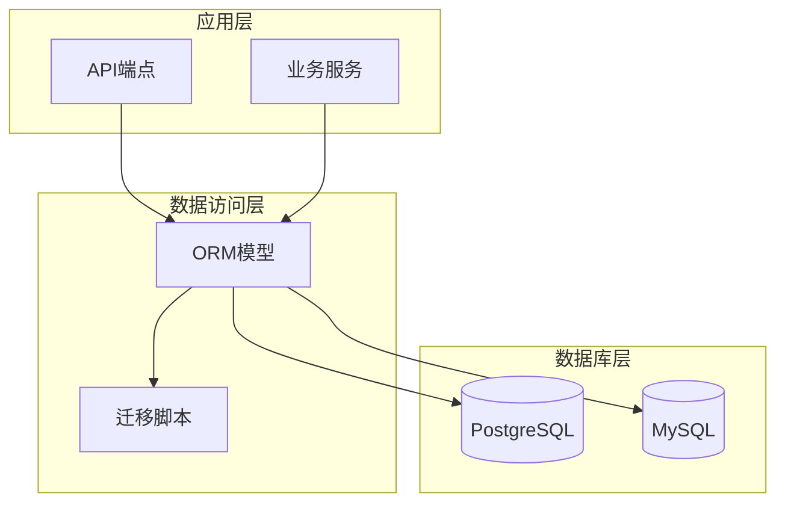
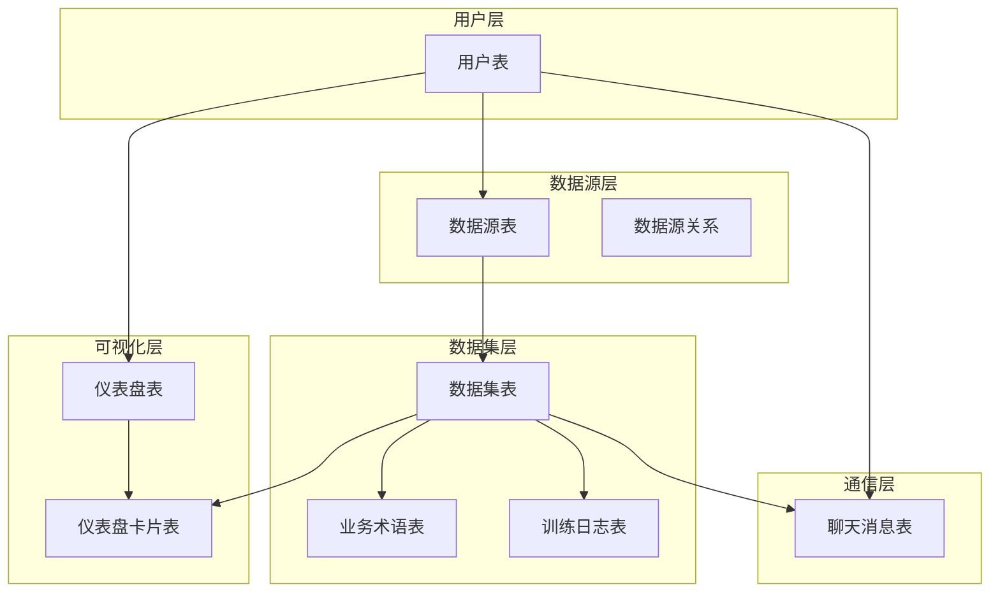
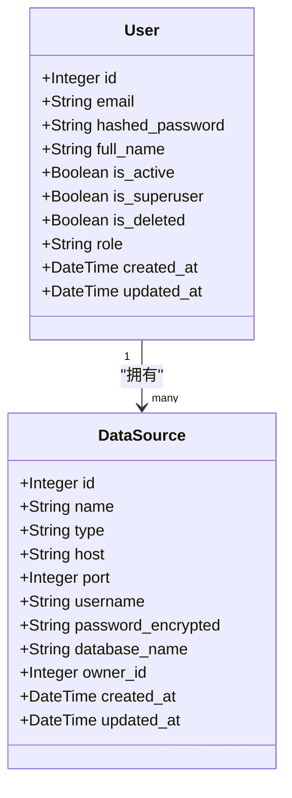
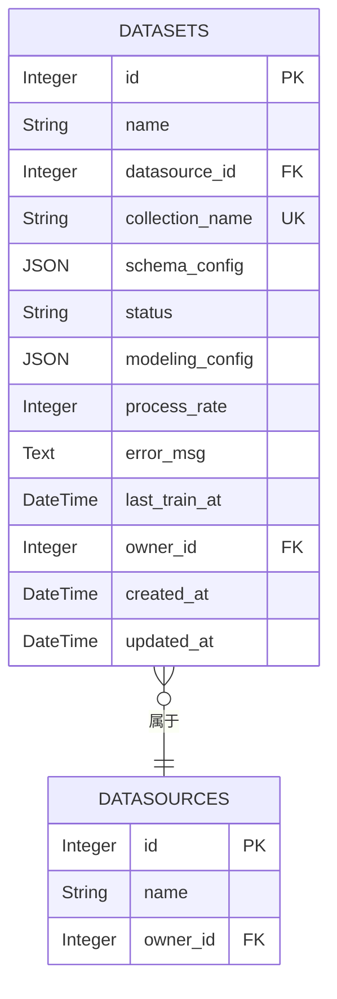
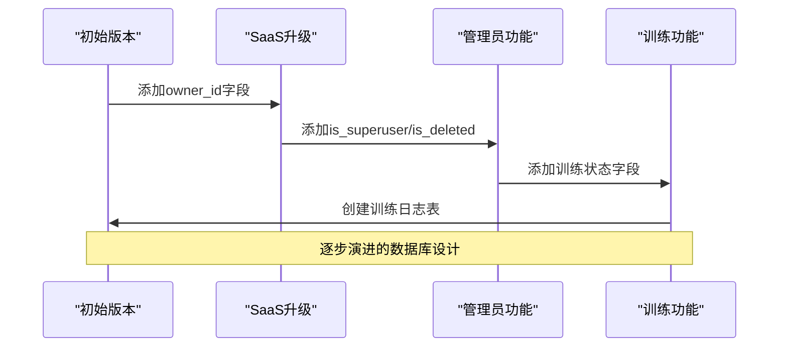
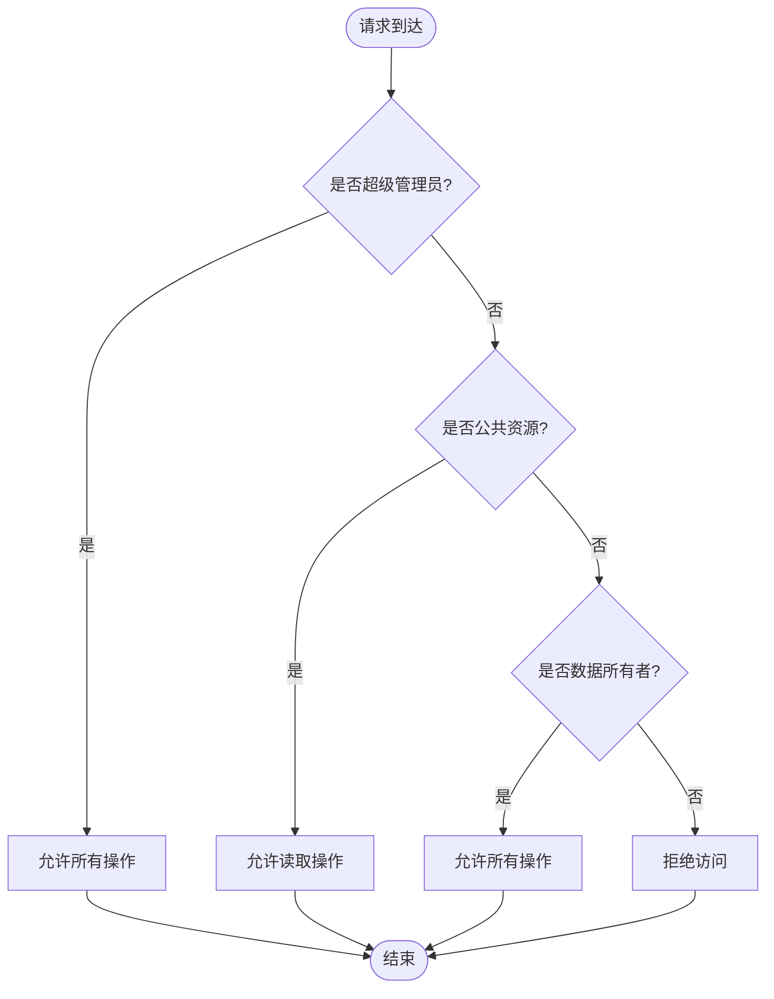
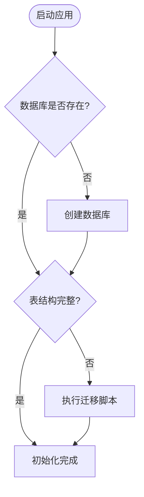

# 数据模型与数据库设计

<cite>
**本文档引用的文件**
- [metadata.py](file://backend/app/models/metadata.py)
- [base.py](file://backend/app/models/base.py)
- [000_init_schema.sql](file://backend/migrations/000_init_schema.sql)
- [001_add_saas_features.sql](file://backend/migrations/001_add_saas_features.sql)
- [002_add_user_admin_fields.sql](file://backend/migrations/002_add_user_admin_fields.sql)
- [003_add_training_status_fields.sql](file://backend/migrations/003_add_training_status_fields.sql)
- [deps.py](file://backend/app/api/deps.py)
- [SAAS_UPGRADE_GUIDE.md](file://docs/backend/SAAS_UPGRADE_GUIDE.md)
- [init_db.py](file://backend/init_db.py)
- [add_owner_id.py](file://backend/add_owner_id.py)
- [add_owner_id.sql](file://backend/add_owner_id.sql)
</cite>

## 目录
1. [简介](#简介)
2. [项目结构](#项目结构)
3. [核心组件](#核心组件)
4. [架构概览](#架构概览)
5. [详细组件分析](#详细组件分析)
6. [依赖关系分析](#依赖关系分析)
7. [性能考虑](#性能考虑)
8. [故障排除指南](#故障排除指南)
9. [结论](#结论)
10. [附录](#附录)

## 简介

本文件提供了基于SQLAlchemy ORM的完整数据模型文档，详细描述了底层PostgreSQL/MySQL数据库架构。重点解析了metadata.py中BaseModel的通用字段设计（id, created_at, updated_at, owner_id）及其在SaaS数据隔离中的关键作用。通过初始迁移脚本（000_init_schema.sql）展示了核心表结构：users、data_sources、datasets、dashboards、queries等的字段定义、主外键关系与索引策略。结合后续迁移文件（如001_add_saas_features.sql）阐述了数据所有权字段的演进过程。使用SAAS_UPGRADE_GUIDE.md说明了owner_id如何实现租户隔离与公共资源（owner_id为NULL）管理。

## 项目结构

该项目采用分层架构设计，数据库相关的核心文件分布如下：



**图表来源**
- [metadata.py](file://backend/app/models/metadata.py#L1-L129)
- [base.py](file://backend/app/models/base.py#L1-L4)
- [000_init_schema.sql](file://backend/migrations/000_init_schema.sql#L1-L153)

**章节来源**
- [metadata.py](file://backend/app/models/metadata.py#L1-L129)
- [base.py](file://backend/app/models/base.py#L1-L4)

## 核心组件

### BaseModel通用字段设计

所有业务模型都继承自Base类，具备统一的字段规范：

| 字段名 | 类型 | 约束 | 说明 |
|--------|------|------|------|
| id | Integer | PRIMARY KEY, index=True | 主键标识符 |
| created_at | DateTime | default=datetime.utcnow | 创建时间戳 |
| updated_at | DateTime | default=datetime.utcnow, onupdate=datetime.utcnow | 更新时间戳 |
| owner_id | Integer | ForeignKey("users.id"), nullable=True | 所有者ID，NULL表示公共资源 |

这些字段的设计体现了现代SaaS应用的最佳实践：

1. **统一性**：所有模型共享相同的字段结构
2. **审计追踪**：完整的创建和更新时间记录
3. **数据隔离**：通过owner_id实现多租户隔离
4. **性能优化**：适当的索引设计提升查询效率

**章节来源**
- [metadata.py](file://backend/app/models/metadata.py#L6-L16)
- [base.py](file://backend/app/models/base.py#L1-L4)

## 架构概览

系统采用三层架构设计，实现了完整的数据模型层次：



**图表来源**
- [metadata.py](file://backend/app/models/metadata.py#L18-L129)
- [000_init_schema.sql](file://backend/migrations/000_init_schema.sql#L8-L119)

## 详细组件分析

### 用户模型（User）

用户模型是整个系统的根实体，支持多租户架构的核心基础：



**图表来源**
- [metadata.py](file://backend/app/models/metadata.py#L6-L16)
- [metadata.py](file://backend/app/models/metadata.py#L18-L32)

用户模型的关键特性：
- **超级管理员支持**：`is_superuser`字段标识平台管理员
- **软删除机制**：`is_deleted`实现数据安全删除
- **角色管理**：`role`字段支持细粒度权限控制

**章节来源**
- [metadata.py](file://backend/app/models/metadata.py#L6-L16)

### 数据源模型（DataSource）

数据源模型代表外部数据库连接配置：

| 字段名 | 类型 | 约束 | 说明 |
|--------|------|------|------|
| id | Integer | PRIMARY KEY | 数据源唯一标识 |
| name | String(255) | UNIQUE, INDEX | 数据源名称 |
| type | String(50) | | 数据库类型（postgresql, mysql） |
| host | String(255) | | 数据库主机地址 |
| port | Integer | | 端口号 |
| username | String(255) | | 用户名 |
| password_encrypted | String(500) | | 加密存储的密码 |
| database_name | String(255) | | 数据库名称 |
| owner_id | Integer | ForeignKey(users.id), nullable=True | 所有者ID |

**章节来源**
- [metadata.py](file://backend/app/models/metadata.py#L18-L32)

### 数据集模型（Dataset）

数据集模型是核心业务实体，承载着数据处理和分析能力：



**图表来源**
- [metadata.py](file://backend/app/models/metadata.py#L35-L54)

数据集模型的高级特性：
- **训练状态管理**：支持多种训练状态（pending, training, completed, failed, paused）
- **可视化建模**：`modeling_config`存储前端建模画布数据
- **进度跟踪**：`process_rate`实时显示训练进度
- **错误处理**：`error_msg`记录训练过程中的错误信息

**章节来源**
- [metadata.py](file://backend/app/models/metadata.py#L35-L54)

### 仪表盘模型（Dashboard）

仪表盘模型提供数据可视化展示功能：

| 字段名 | 类型 | 约束 | 说明 |
|--------|------|------|------|
| id | Integer | PRIMARY KEY | 仪表盘唯一标识 |
| name | String(255) | INDEX | 仪表盘名称 |
| description | String(500) | NULLABLE | 描述信息 |
| owner_id | Integer | ForeignKey(users.id), nullable=True | 所有者ID |
| created_at | DateTime | default=datetime.utcnow | 创建时间 |
| updated_at | DateTime | default=datetime.utcnow, onupdate=datetime.utcnow | 更新时间 |

**章节来源**
- [metadata.py](file://backend/app/models/metadata.py#L56-L68)

### 业务术语模型（BusinessTerm）

业务术语模型支持企业级术语管理：

| 字段名 | 类型 | 约束 | 说明 |
|--------|------|------|------|
| id | Integer | PRIMARY KEY | 术语唯一标识 |
| dataset_id | Integer | ForeignKey(datasets.id) | 关联数据集ID |
| term | String(255) | INDEX | 术语名称 |
| definition | Text | | 术语定义 |
| owner_id | Integer | ForeignKey(users.id), nullable=True | 所有者ID |
| created_at | DateTime | default=datetime.utcnow | 创建时间 |

**章节来源**
- [metadata.py](file://backend/app/models/metadata.py#L98-L110)

### 训练日志模型（TrainingLog）

训练日志模型记录数据集训练过程的详细信息：

| 字段名 | 类型 | 约束 | 说明 |
|--------|------|------|------|
| id | Integer | PRIMARY KEY | 日志唯一标识 |
| dataset_id | Integer | ForeignKey(datasets.id) | 关联数据集ID |
| content | Text | | 日志内容 |
| created_at | DateTime | default=datetime.utcnow | 创建时间 |

**章节来源**
- [metadata.py](file://backend/app/models/metadata.py#L70-L80)

### 聊天消息模型（ChatMessage）

聊天消息模型支持AI对话和数据分析交互：

| 字段名 | 类型 | 约束 | 说明 |
|--------|------|------|------|
| id | Integer | PRIMARY KEY | 消息唯一标识 |
| dataset_id | Integer | ForeignKey(datasets.id) | 关联数据集ID |
| user_id | Integer | ForeignKey(users.id) | 用户ID |
| owner_id | Integer | ForeignKey(users.id), nullable=True | 所有者ID |
| question | Text | | 用户问题 |
| answer | Text | NULLABLE | AI回答 |
| sql | Text | NULLABLE | 生成的SQL语句 |
| chart_type | String(50) | NULLABLE | 图表类型 |
| created_at | DateTime | default=datetime.utcnow | 创建时间 |

**章节来源**
- [metadata.py](file://backend/app/models/metadata.py#L112-L129)

## 依赖关系分析

### 数据库迁移演进

系统通过多个迁移脚本实现了从单租户到多租户的完整演进：



**图表来源**
- [001_add_saas_features.sql](file://backend/migrations/001_add_saas_features.sql#L1-L149)
- [002_add_user_admin_fields.sql](file://backend/migrations/002_add_user_admin_fields.sql#L1-L20)
- [003_add_training_status_fields.sql](file://backend/migrations/003_add_training_status_fields.sql#L1-L60)

### 权限控制机制

系统实现了严格的权限控制体系：



**图表来源**
- [deps.py](file://backend/app/api/deps.py#L97-L124)

**章节来源**
- [deps.py](file://backend/app/api/deps.py#L97-L124)

## 性能考虑

### 索引策略

数据库设计采用了全面的索引策略来优化查询性能：

| 表名 | 索引字段 | 用途 | 性能影响 |
|------|----------|------|----------|
| datasources | owner_id | 租户隔离查询 | O(log n) |
| datasets | datasource_id | 关联查询 | O(log n) |
| datasets | owner_id | 租户隔离 | O(log n) |
| datasets | collection_name | 唯一性约束 | O(1) |
| business_terms | dataset_id | 关联查询 | O(log n) |
| business_terms | owner_id | 租户隔离 | O(log n) |
| training_logs | dataset_id | 关联查询 | O(log n) |
| training_logs | created_at | 时间范围查询 | O(log n) |
| dashboards | owner_id | 租户隔离 | O(log n) |
| dashboard_cards | dashboard_id | 关联查询 | O(log n) |
| dashboard_cards | dataset_id | 关联查询 | O(log n) |
| users | username | 用户认证 | O(1) |
| users | email | 用户查找 | O(1) |
| chat_messages | dataset_id | 关联查询 | O(log n) |
| chat_messages | user_id | 用户查询 | O(log n) |
| chat_messages | owner_id | 租户隔离 | O(log n) |
| chat_messages | created_at | 时间排序 | O(log n) |

### 查询优化建议

1. **批量查询**：使用JOIN操作减少数据库往返次数
2. **分页处理**：对大数据集实施分页查询
3. **缓存策略**：对频繁访问的静态数据实施缓存
4. **连接池**：合理配置数据库连接池参数

## 故障排除指南

### 常见问题及解决方案

#### 问题1：用户无法看到任何数据

**可能原因**：
- 现有数据的owner_id未正确设置
- 数据库迁移未完全执行

**解决方案**：
```sql
-- 检查数据分布情况
SELECT 'datasources' as table_name, 
       COUNT(*) as total, 
       COUNT(owner_id) as with_owner 
FROM datasources;

-- 批量设置owner_id为管理员
UPDATE datasources SET owner_id = 1 WHERE owner_id IS NULL;
```

**章节来源**
- [SAAS_UPGRADE_GUIDE.md](file://docs/backend/SAAS_UPGRADE_GUIDE.md#L234-L251)

#### 问题2：普通用户可以修改公共资源

**可能原因**：
- endpoint缺少公共资源保护逻辑
- 权限检查代码缺失

**解决方案**：
确保所有修改/删除操作都包含以下检查：

```python
if resource.owner_id is None and not current_user.is_superuser:
    raise HTTPException(status_code=403, detail="Cannot modify public resources")
```

**章节来源**
- [SAAS_UPGRADE_GUIDE.md](file://docs/backend/SAAS_UPGRADE_GUIDE.md#L252-L261)

#### 问题3：数据库初始化失败

**可能原因**：
- 数据库连接配置错误
- 权限不足
- 数据库不存在

**解决方案**：
1. 检查数据库连接字符串
2. 确认数据库用户权限
3. 创建目标数据库
4. 运行初始化脚本

**章节来源**
- [init_db.py](file://backend/init_db.py#L21-L79)

## 结论

本数据模型设计充分体现了现代SaaS应用的最佳实践，通过owner_id字段实现了完整的多租户隔离机制。系统采用分层架构设计，从用户模型到业务实体形成了清晰的数据关系链。迁移脚本的演进展示了系统从单租户向多租户架构的平滑过渡。

关键优势包括：
1. **数据隔离**：通过owner_id实现严格的租户隔离
2. **权限控制**：支持超级管理员和普通用户的差异化权限
3. **审计追踪**：完整的创建和更新时间记录
4. **性能优化**：全面的索引策略提升查询效率
5. **扩展性**：模块化的架构设计便于功能扩展

建议的后续优化方向：
1. 实现团队协作和组织级别的权限管理
2. 添加公共资源管理的API接口
3. 建立完善的审计日志系统
4. 实施资源使用配额管理

## 附录

### 数据库初始化流程



**图表来源**
- [init_db.py](file://backend/init_db.py#L21-L79)
- [000_init_schema.sql](file://backend/migrations/000_init_schema.sql#L1-L153)

### 权限控制代码示例

```python
def apply_ownership_filter(query, model, current_user: User):
    """应用数据隔离过滤逻辑"""
    if current_user.is_superuser:
        return query  # 超级管理员可以查看所有数据
    
    # 普通用户：只能查看自己的数据或公共资源
    return query.filter(
        or_(
            model.owner_id == current_user.id,
            model.owner_id.is_(None)
        )
    )
```

**章节来源**
- [deps.py](file://backend/app/api/deps.py#L97-L124)