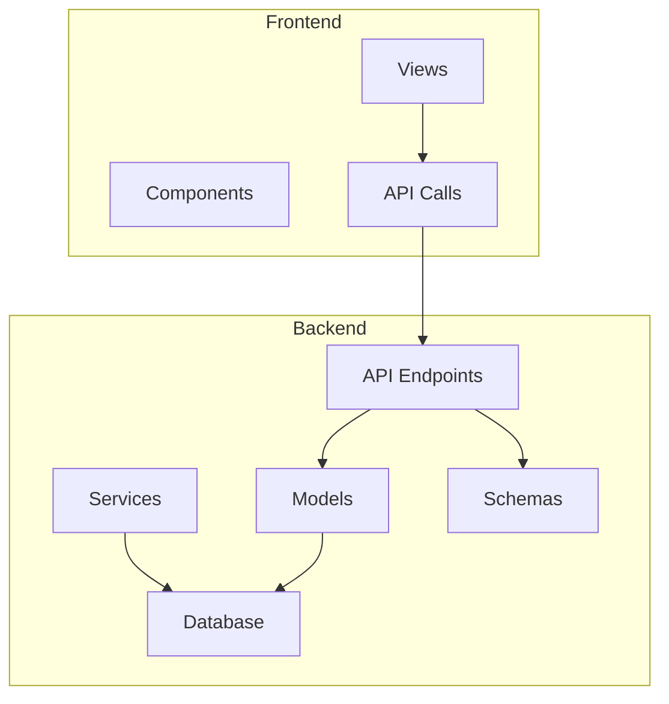
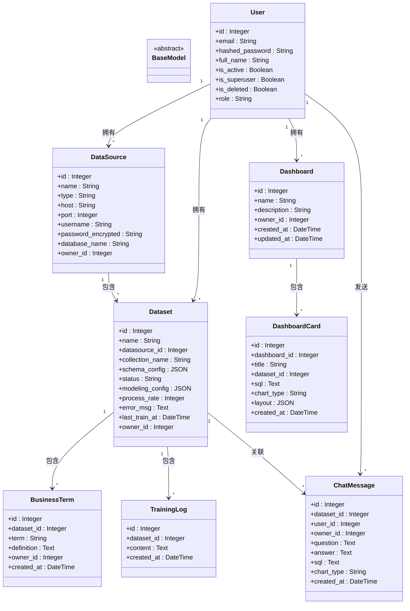
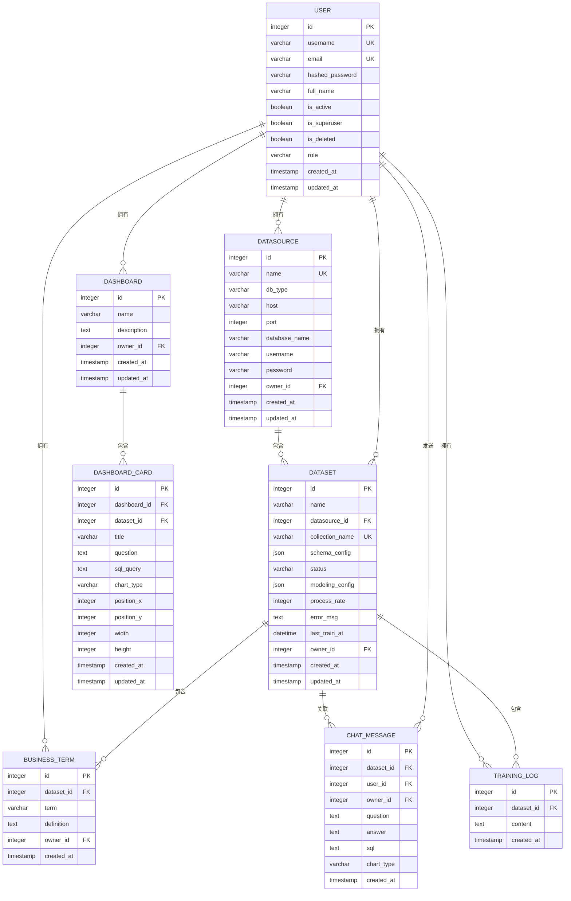

# 核心数据模型设计

<cite>
**本文档引用的文件**   
- [metadata.py](file://backend/app/models/metadata.py)
- [base.py](file://backend/app/models/base.py)
- [000_init_schema.sql](file://backend/migrations/000_init_schema.sql)
- [user.py](file://backend/app/schemas/user.py)
- [datasource.py](file://backend/app/schemas/datasource.py)
- [dataset.py](file://backend/app/schemas/dataset.py)
- [dashboard.py](file://backend/app/schemas/dashboard.py)
- [chat.py](file://backend/app/schemas/chat.py)
- [session.py](file://backend/app/db/session.py)
- [main.py](file://backend/app/main.py)
- [datasource.py](file://backend/app/api/v1/endpoints/datasource.py)
- [dataset.py](file://backend/app/api/v1/endpoints/dataset.py)
- [dashboard.py](file://backend/app/api/v1/endpoints/dashboard.py)
- [chat.py](file://backend/app/api/v1/endpoints/chat.py)
</cite>

## 目录
1. [项目结构](#项目结构)
2. [核心数据模型](#核心数据模型)
3. [通用字段设计](#通用字段设计)
4. [数据库表结构](#数据库表结构)
5. [ORM与数据库映射](#orm与数据库映射)
6. [实体关系图（ERD）](#实体关系图erd)
7. [数据访问与查询构建](#数据访问与查询构建)
8. [结论](#结论)

## 项目结构

本项目采用分层架构设计，主要分为后端（backend）和前端（frontend）两大部分。后端采用Python的FastAPI框架，前端采用Vue.js技术栈。数据模型主要定义在`backend/app/models/`目录下，数据库迁移脚本存放在`backend/migrations/`目录中。



**图源**
- [main.py](file://backend/app/main.py#L1-L35)
- [project_structure](file://)

**本节来源**
- [main.py](file://backend/app/main.py#L1-L35)

## 核心数据模型

本系统的核心数据模型基于SQLAlchemy ORM实现，定义在`metadata.py`文件中。所有实体模型都继承自`Base`类，该类通过`declarative_base()`函数创建，提供了ORM的基本功能。



**图源**
- [metadata.py](file://backend/app/models/metadata.py#L6-L129)

**本节来源**
- [metadata.py](file://backend/app/models/metadata.py#L6-L129)

## 通用字段设计

### 基础字段设计

系统中的所有实体模型都继承自`Base`类，该类提供了基本的ORM功能。每个实体都有一个`id`字段作为主键，采用自增整数类型，确保了全局唯一性。

```python
id = Column(Integer, primary_key=True, index=True)
```

`id`字段的设计考虑了性能和可扩展性：
- 使用`Integer`类型而非`UUID`，减少了存储空间和索引大小
- `primary_key=True`确保了唯一性和主键约束
- `index=True`为ID字段创建了索引，提高了查询性能

### 时间戳字段

系统中多个实体包含时间戳字段，用于记录创建和更新时间：

```python
created_at = Column(DateTime, default=datetime.utcnow)
updated_at = Column(DateTime, default=datetime.utcnow, onupdate=datetime.utcnow)
```

这些字段的设计意图包括：
- **审计追踪**：记录实体的创建和修改时间，便于问题排查和操作审计
- **数据排序**：支持按时间顺序查询数据，如获取最新的数据集或仪表盘
- **缓存策略**：`updated_at`字段可用于实现缓存失效机制

`created_at`字段使用`default=datetime.utcnow`设置默认值，而`updated_at`字段额外使用`onupdate=datetime.utcnow`参数，确保在记录更新时自动更新时间戳。

### 所有权字段

系统通过`owner_id`字段实现多租户和数据隔离：

```python
owner_id = Column(Integer, ForeignKey("users.id"), nullable=True)
```

该字段的设计特点：
- 外键关联到`users`表的`id`字段，确保引用完整性
- `nullable=True`允许为空，表示公共资源
- 当`owner_id`为`None`时，表示该资源为公共资源，所有用户均可访问
- 当`owner_id`有值时，表示该资源为私有资源，只有所有者和超级管理员可访问

这种设计支持了灵活的权限控制策略，既允许用户创建私有资源，也支持平台创建和管理公共资源。

**本节来源**
- [metadata.py](file://backend/app/models/metadata.py#L6-L129)
- [000_init_schema.sql](file://backend/migrations/000_init_schema.sql#L1-L153)

## 数据库表结构

### 用户表（users）

用户表存储系统用户的基本信息：

```sql
CREATE TABLE IF NOT EXISTS users (
    id INTEGER PRIMARY KEY AUTO_INCREMENT,
    username VARCHAR(50) NOT NULL UNIQUE COMMENT '用户名',
    email VARCHAR(255) UNIQUE COMMENT '邮箱',
    hashed_password VARCHAR(255) NOT NULL COMMENT '加密后的密码',
    full_name VARCHAR(255) COMMENT '全名',
    is_active BOOLEAN DEFAULT TRUE COMMENT '是否激活',
    is_superuser BOOLEAN DEFAULT FALSE COMMENT '是否超级管理员',
    is_deleted BOOLEAN DEFAULT FALSE COMMENT '软删除标记',
    role VARCHAR(50) DEFAULT 'user' COMMENT '用户角色',
    created_at TIMESTAMP DEFAULT CURRENT_TIMESTAMP COMMENT '创建时间',
    updated_at TIMESTAMP DEFAULT CURRENT_TIMESTAMP ON UPDATE CURRENT_TIMESTAMP COMMENT '更新时间'
) ENGINE=InnoDB DEFAULT CHARSET=utf8mb4 COMMENT='用户表';
```

关键设计要点：
- `username`和`email`字段都有唯一约束，确保用户标识的唯一性
- `hashed_password`存储加密后的密码，保障安全
- `is_active`字段用于账户激活/封禁控制
- `is_superuser`字段标识平台超级管理员
- `is_deleted`字段实现软删除，保留数据历史
- `role`字段支持未来扩展更多用户角色

### 数据源表（datasources）

数据源表存储外部数据库连接配置：

```sql
CREATE TABLE IF NOT EXISTS datasources (
    id INTEGER PRIMARY KEY AUTO_INCREMENT,
    name VARCHAR(100) NOT NULL UNIQUE COMMENT '数据源名称',
    db_type VARCHAR(20) NOT NULL COMMENT '数据库类型: mysql/postgresql',
    host VARCHAR(255) NOT NULL COMMENT '主机地址',
    port INTEGER NOT NULL COMMENT '端口号',
    database_name VARCHAR(100) NOT NULL COMMENT '数据库名',
    username VARCHAR(100) NOT NULL COMMENT '用户名',
    password VARCHAR(255) NOT NULL COMMENT '密码（加密存储）',
    owner_id INTEGER COMMENT '所有者ID',
    created_at TIMESTAMP DEFAULT CURRENT_TIMESTAMP COMMENT '创建时间',
    updated_at TIMESTAMP DEFAULT CURRENT_TIMESTAMP ON UPDATE CURRENT_TIMESTAMP COMMENT '更新时间'
) ENGINE=InnoDB DEFAULT CHARSET=utf8mb4 COMMENT='数据源配置表';
```

关键设计要点：
- `db_type`字段支持多种数据库类型
- `password`字段存储加密后的密码
- `owner_id`字段实现数据源的所有权管理
- 包含完整的数据库连接信息

### 数据集表（datasets）

数据集表是系统的核心实体，关联数据源和业务逻辑：

```sql
CREATE TABLE IF NOT EXISTS datasets (
    id INTEGER PRIMARY KEY AUTO_INCREMENT,
    name VARCHAR(255) NOT NULL COMMENT '数据集名称',
    datasource_id INTEGER NOT NULL COMMENT '关联的数据源ID',
    collection_name VARCHAR(255) UNIQUE COMMENT 'Vanna collection名称',
    schema_config JSON COMMENT '已选择的表列表（JSON格式）',
    status VARCHAR(50) DEFAULT 'pending' COMMENT '训练状态: pending, training, completed, failed, paused',
    modeling_config JSON COMMENT '存储前端可视化建模的画布数据(nodes/edges)',
    process_rate INTEGER DEFAULT 0 COMMENT '训练进度百分比 0-100',
    error_msg TEXT COMMENT '错误信息',
    last_train_at DATETIME COMMENT '最后训练时间',
    owner_id INTEGER COMMENT '所有者ID',
    created_at TIMESTAMP DEFAULT CURRENT_TIMESTAMP COMMENT '创建时间',
    updated_at TIMESTAMP DEFAULT CURRENT_TIMESTAMP ON UPDATE CURRENT_TIMESTAMP COMMENT '更新时间',
    FOREIGN KEY (datasource_id) REFERENCES datasources(id) ON DELETE CASCADE
) ENGINE=InnoDB DEFAULT CHARSET=utf8mb4 COMMENT='数据集表';
```

关键设计要点：
- `datasource_id`外键关联数据源，实现级联删除
- `collection_name`唯一约束，确保Vanna集合名称唯一
- `schema_config`使用JSON字段存储选择的表列表
- `status`字段管理数据集的训练状态机
- `modeling_config`存储前端可视化建模的画布数据
- `process_rate`跟踪训练进度

### 仪表盘表（dashboards）

仪表盘表存储可视化看板信息：

```sql
CREATE TABLE IF NOT EXISTS dashboards (
    id INTEGER PRIMARY KEY AUTO_INCREMENT,
    name VARCHAR(100) NOT NULL COMMENT '仪表盘名称',
    description TEXT COMMENT '描述',
    owner_id INTEGER COMMENT '所有者ID',
    created_at TIMESTAMP DEFAULT CURRENT_TIMESTAMP COMMENT '创建时间',
    updated_at TIMESTAMP DEFAULT CURRENT_TIMESTAMP ON UPDATE CURRENT_TIMESTAMP COMMENT '更新时间'
) ENGINE=InnoDB DEFAULT CHARSET=utf8mb4 COMMENT='仪表盘表';
```

关键设计要点：
- 简洁的设计，只包含基本信息
- `owner_id`实现所有权管理
- `updated_at`字段在更新时自动更新，便于跟踪修改

### 仪表盘卡片表（dashboard_cards）

卡片表存储仪表盘中的具体可视化组件：

```sql
CREATE TABLE IF NOT EXISTS dashboard_cards (
    id INTEGER PRIMARY KEY AUTO_INCREMENT,
    dashboard_id INTEGER NOT NULL COMMENT '所属仪表盘ID',
    dataset_id INTEGER NOT NULL COMMENT '关联的数据集ID',
    title VARCHAR(200) NOT NULL COMMENT '卡片标题',
    question TEXT NOT NULL COMMENT '原始问题',
    sql_query TEXT NOT NULL COMMENT 'SQL 查询语句',
    chart_type VARCHAR(50) DEFAULT 'table' COMMENT '图表类型: table/bar/line/pie',
    position_x INTEGER DEFAULT 0 COMMENT 'X 坐标位置',
    position_y INTEGER DEFAULT 0 COMMENT 'Y 坐标位置',
    width INTEGER DEFAULT 6 COMMENT '宽度（栅格列数）',
    height INTEGER DEFAULT 4 COMMENT '高度（栅格行数）',
    created_at TIMESTAMP DEFAULT CURRENT_TIMESTAMP COMMENT '创建时间',
    updated_at TIMESTAMP DEFAULT CURRENT_TIMESTAMP ON UPDATE CURRENT_TIMESTAMP COMMENT '更新时间',
    FOREIGN KEY (dashboard_id) REFERENCES dashboards(id) ON DELETE CASCADE,
    FOREIGN KEY (dataset_id) REFERENCES datasets(id) ON DELETE CASCADE
) ENGINE=InnoDB DEFAULT CHARSET=utf8mb4 COMMENT='仪表盘卡片表';
```

关键设计要点：
- 双重外键关联，确保数据一致性
- 存储完整的SQL查询语句
- 包含布局信息（位置、大小）
- 支持多种图表类型

### 业务术语表（business_terms）

业务术语表存储领域特定的业务概念：

```sql
CREATE TABLE IF NOT EXISTS business_terms (
    id INTEGER PRIMARY KEY AUTO_INCREMENT,
    dataset_id INTEGER NOT NULL COMMENT '关联的数据集ID',
    term VARCHAR(255) NOT NULL COMMENT '术语名称',
    definition TEXT NOT NULL COMMENT '术语定义',
    owner_id INTEGER COMMENT '所有者ID',
    created_at TIMESTAMP DEFAULT CURRENT_TIMESTAMP COMMENT '创建时间',
    FOREIGN KEY (dataset_id) REFERENCES datasets(id) ON DELETE CASCADE
) ENGINE=InnoDB DEFAULT CHARSET=utf8mb4 COMMENT='业务术语表';
```

关键设计要点：
- `term`和`definition`字段存储业务术语及其定义
- 与数据集关联，确保术语的上下文一致性
- 支持AI自然语言查询的理解

### 训练日志表（training_logs）

训练日志表记录数据集的训练过程：

```sql
CREATE TABLE IF NOT EXISTS training_logs (
    id INTEGER PRIMARY KEY AUTO_INCREMENT,
    dataset_id INTEGER NOT NULL COMMENT '关联的数据集ID',
    content TEXT NOT NULL COMMENT '日志内容',
    created_at TIMESTAMP DEFAULT CURRENT_TIMESTAMP COMMENT '创建时间',
    FOREIGN KEY (dataset_id) REFERENCES datasets(id) ON DELETE CASCADE
) ENGINE=InnoDB DEFAULT CHARSET=utf8mb4 COMMENT='训练日志表';
```

关键设计要点：
- 记录详细的训练过程日志
- 便于问题排查和进度跟踪
- 与数据集级联删除

### 聊天消息表（chat_messages）

聊天消息表存储用户与AI的对话历史：

```sql
CREATE TABLE IF NOT EXISTS chat_messages (
    id INTEGER PRIMARY KEY AUTO_INCREMENT,
    dataset_id INTEGER NOT NULL COMMENT '关联的数据集ID',
    user_id INTEGER NOT NULL COMMENT '用户ID',
    owner_id INTEGER COMMENT '所有者ID',
    question TEXT NOT NULL COMMENT '用户问题',
    answer TEXT COMMENT 'AI回答',
    sql TEXT COMMENT 'SQL语句',
    chart_type VARCHAR(50) COMMENT '图表类型',
    created_at TIMESTAMP DEFAULT CURRENT_TIMESTAMP COMMENT '创建时间',
    FOREIGN KEY (dataset_id) REFERENCES datasets(id) ON DELETE CASCADE,
    FOREIGN KEY (user_id) REFERENCES users(id) ON DELETE CASCADE,
    FOREIGN KEY (owner_id) REFERENCES users(id) ON DELETE SET NULL
) ENGINE=InnoDB DEFAULT CHARSET=utf8mb4 COMMENT='聊天消息表';
```

关键设计要点：
- 记录完整的对话历史
- 存储生成的SQL和图表类型
- 支持对话上下文的理解

### 索引策略

系统定义了多个索引以优化查询性能：

```sql
CREATE INDEX idx_datasource_owner ON datasources(owner_id);
CREATE INDEX idx_dataset_datasource ON datasets(datasource_id);
CREATE INDEX idx_dataset_owner ON datasets(owner_id);
CREATE INDEX idx_dataset_collection_name ON datasets(collection_name);
CREATE INDEX idx_business_term_dataset ON business_terms(dataset_id);
CREATE INDEX idx_business_term_owner ON business_terms(owner_id);
CREATE INDEX idx_training_log_dataset ON training_logs(dataset_id);
CREATE INDEX idx_training_log_created ON training_logs(created_at);
CREATE INDEX idx_dashboard_owner ON dashboards(owner_id);
CREATE INDEX idx_card_dashboard ON dashboard_cards(dashboard_id);
CREATE INDEX idx_card_dataset ON dashboard_cards(dataset_id);
CREATE INDEX idx_user_username ON users(username);
CREATE INDEX idx_user_email ON users(email);
CREATE INDEX idx_chat_message_dataset ON chat_messages(dataset_id);
CREATE INDEX idx_chat_message_user ON chat_messages(user_id);
CREATE INDEX idx_chat_message_owner ON chat_messages(owner_id);
CREATE INDEX idx_chat_message_created ON chat_messages(created_at);
```

索引设计原则：
- 在外键字段上创建索引，优化JOIN查询
- 在经常用于过滤的字段上创建索引
- 在唯一性约束字段上自动创建唯一索引
- 考虑查询模式，避免过度索引影响写入性能

**本节来源**
- [000_init_schema.sql](file://backend/migrations/000_init_schema.sql#L1-L153)

## ORM与数据库映射

### 基类映射

系统使用SQLAlchemy的声明式基类实现ORM映射：

```python
from sqlalchemy.ext.declarative import declarative_base

Base = declarative_base()
```

`Base`类作为所有实体模型的基类，提供了ORM的基本功能，包括：
- 表名自动推断
- 列定义和约束
- 关系映射
- 查询接口

### 实体映射配置

每个实体通过`__tablename__`属性明确指定对应的数据库表名：

```python
class User(Base):
    __tablename__ = "users"
    # 字段定义
```

这种显式映射方式的优点：
- 提高代码可读性
- 避免命名冲突
- 支持遗留数据库的映射

### 字段类型映射

系统使用了多种SQLAlchemy字段类型，与数据库类型对应：

| SQLAlchemy类型 | 数据库类型 | 用途 |
|----------------|-----------|------|
| Integer | INTEGER | 主键、外键、整数字段 |
| String | VARCHAR | 可变长度字符串 |
| Text | TEXT | 长文本内容 |
| DateTime | DATETIME/TIMESTAMP | 日期时间值 |
| JSON | JSON | 结构化数据存储 |
| Boolean | BOOLEAN | 布尔值 |

### 关系映射

系统使用SQLAlchemy的关系函数实现实体间的关联：

#### 一对多关系

数据源与数据集之间的一对多关系：

```python
class DataSource(Base):
    # ...
    datasets = relationship("Dataset", back_populates="datasource")

class Dataset(Base):
    # ...
    datasource = relationship("DataSource", back_populates="datasets")
```

这种双向关系映射允许：
- 从数据源访问其所有数据集
- 从数据集访问其所属的数据源

#### 多对一关系

数据集与用户之间的多对一关系：

```python
class Dataset(Base):
    # ...
    owner_id = Column(Integer, ForeignKey("users.id"), nullable=True)
    owner = relationship("User")
```

#### 一对一关系

虽然系统中没有显式的一对一关系，但可以通过设置唯一约束实现：

```python
# 示例：用户与其个人资料
profile = relationship("UserProfile", uselist=False, back_populates="user")
```

### 级联删除

系统在多个关系中使用了级联删除策略：

```python
datasets = relationship("Dataset", back_populates="datasource", cascade="all, delete-orphan")
```

`cascade="all, delete-orphan"`参数的含义：
- `all`：级联所有操作（保存、更新、删除）
- `delete-orphan`：当子对象从父对象的集合中移除时，自动删除子对象

这确保了数据的一致性和完整性。

**本节来源**
- [metadata.py](file://backend/app/models/metadata.py#L6-L129)
- [base.py](file://backend/app/models/base.py#L1-L4)

## 实体关系图（ERD）



**图源**
- [000_init_schema.sql](file://backend/migrations/000_init_schema.sql#L1-L153)
- [metadata.py](file://backend/app/models/metadata.py#L6-L129)

## 数据访问与查询构建

### 会话管理

系统使用SQLAlchemy的会话管理机制：

```python
from sqlalchemy.orm import sessionmaker

SessionLocal = sessionmaker(autocommit=False, autoflush=False, bind=engine)

def get_db():
    db = SessionLocal()
    try:
        yield db
    finally:
        db.close()
```

会话管理的特点：
- 使用依赖注入模式，通过`get_db()`函数提供数据库会话
- 确保每个请求都有独立的会话
- 自动关闭会话，避免资源泄漏

### 数据库连接池

系统配置了数据库连接池以提高性能：

```python
engine = create_engine(
    settings.SQLALCHEMY_DATABASE_URI,
    poolclass=QueuePool,
    pool_size=10,
    max_overflow=20,
    pool_timeout=30,
    pool_recycle=3600,
    pool_pre_ping=True,
    echo=False
)
```

连接池配置说明：
- `pool_size=10`：初始连接池大小
- `max_overflow=20`：最大溢出连接数
- `pool_timeout=30`：获取连接的超时时间
- `pool_recycle=3600`：连接回收时间，防止连接超时
- `pool_pre_ping=True`：连接前检查可用性

### 查询构建

系统在API端点中构建各种查询：

#### 基本查询

创建数据源的查询：

```python
db_obj = DataSource(
    name=ds_in.name,
    type=ds_in.type,
    # ... 其他字段
    owner_id=current_user.id
)
db.add(db_obj)
db.commit()
db.refresh(db_obj)
```

#### 过滤查询

获取用户的数据源列表：

```python
query = db.query(DataSource)
query = apply_ownership_filter(query, DataSource, current_user)
datasources = query.offset(skip).limit(limit).all()
```

#### 关联查询

获取仪表盘及其卡片：

```python
dashboard = db.query(Dashboard).filter(Dashboard.id == id).first()
# 由于关系映射，cards属性会自动加载
cards = dashboard.cards
```

### 数据隔离

系统实现了细粒度的数据隔离策略：

```python
def apply_ownership_filter(query, model_class, current_user):
    if current_user.is_superuser:
        return query
    else:
        return query.filter(
            or_(
                model_class.owner_id == current_user.id,
                model_class.owner_id.is_(None)
            )
        )
```

数据隔离规则：
- 超级管理员可以访问所有资源
- 普通用户只能访问自己的资源和公共资源
- 公共资源通过`owner_id IS NULL`标识

### 事务管理

系统使用数据库事务确保数据一致性：

```python
try:
    # 数据库操作
    db.commit()
except Exception:
    db.rollback()
    raise
```

在关键操作中，如训练术语时，系统实现了事务性操作：
- 先在数据库中创建业务术语
- 然后在Vanna中训练术语
- 如果Vanna训练失败，回滚数据库事务

### 异步处理

对于耗时的训练任务，系统使用后台任务：

```python
@router.post("/{id}/train")
def train_dataset(
    id: int,
    background_tasks: BackgroundTasks,
    db: Session = Depends(get_db),
    current_user: User = Depends(get_current_user)
):
    # ... 验证逻辑
    background_tasks.add_task(run_training_task, id, dataset.schema_config)
    return {"message": "训练已开始"}
```

这种设计避免了长时间的HTTP请求，提高了用户体验。

**本节来源**
- [session.py](file://backend/app/db/session.py#L1-L34)
- [datasource.py](file://backend/app/api/v1/endpoints/datasource.py#L1-L182)
- [dataset.py](file://backend/app/api/v1/endpoints/dataset.py#L1-L800)
- [dashboard.py](file://backend/app/api/v1/endpoints/dashboard.py#L1-L261)
- [chat.py](file://backend/app/api/v1/endpoints/chat.py#L1-L156)

## 结论

本系统的核心数据模型设计体现了现代数据应用的最佳实践。通过精心设计的实体关系、合理的字段类型选择和有效的索引策略，系统实现了高性能的数据访问和管理。

关键设计亮点包括：
- **统一的基础**：所有实体继承自`Base`类，确保了一致的ORM行为
- **灵活的所有权模型**：通过`owner_id`字段实现多租户支持
- **丰富的时间戳**：`created_at`和`updated_at`字段提供了完整的审计追踪
- **JSON字段的合理使用**：`schema_config`和`modeling_config`字段支持灵活的结构化数据存储
- **级联删除**：确保数据的一致性和完整性
- **数据隔离**：通过`apply_ownership_filter`函数实现细粒度的访问控制

未来优化方向：
- 考虑对频繁查询的字段添加更多索引
- 评估JSON字段的查询性能，必要时进行规范化
- 实现更复杂的权限控制模型
- 添加数据版本控制功能

总体而言，该数据模型设计既满足了当前的功能需求，又为未来的扩展留下了足够的空间。