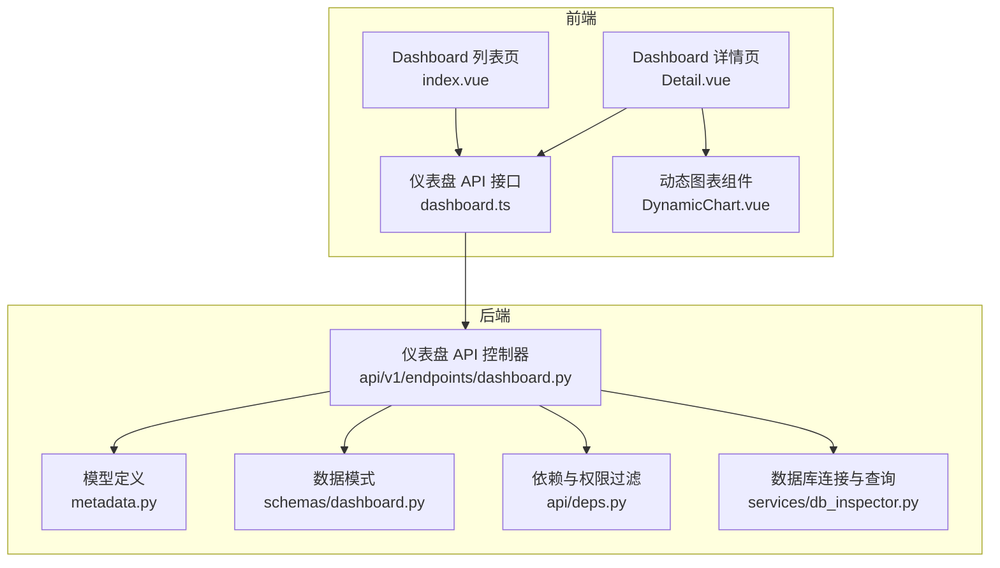
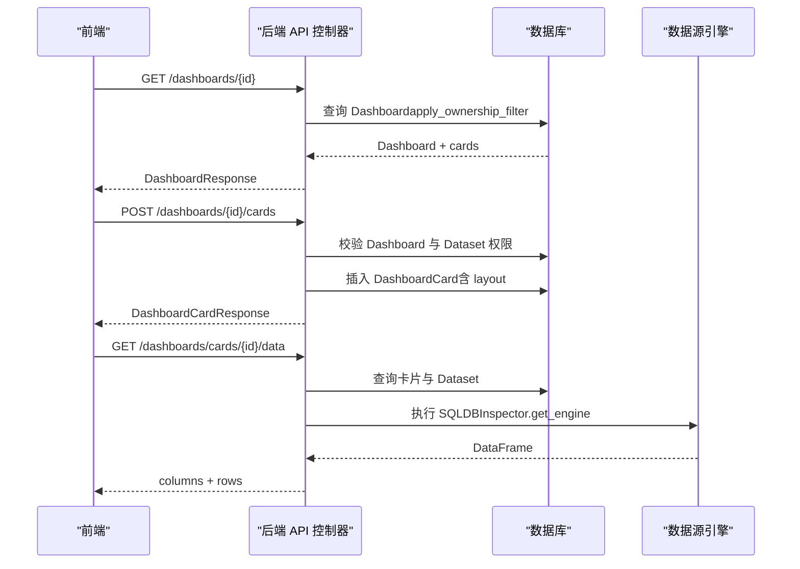
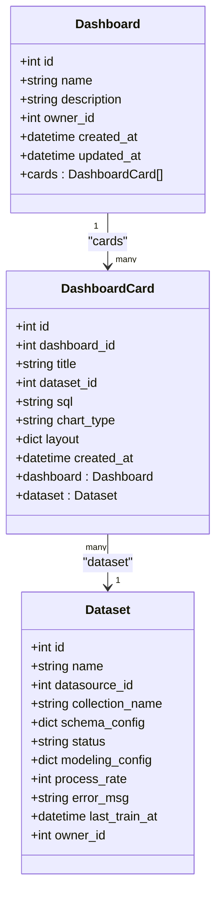
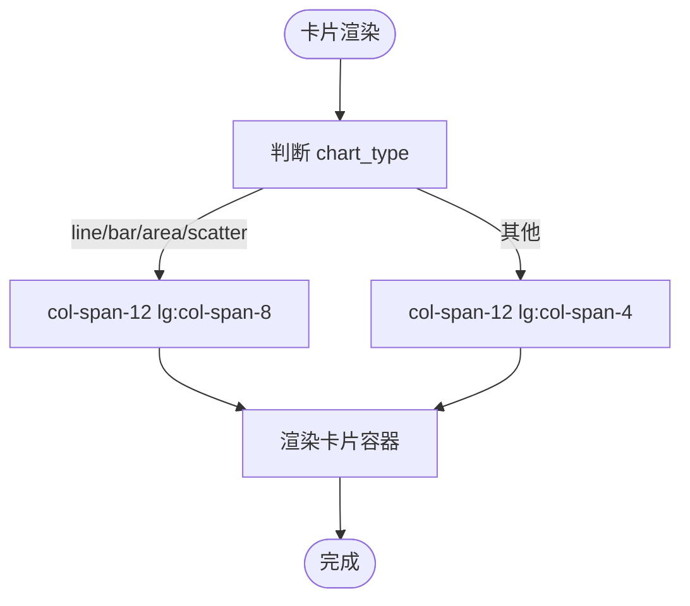
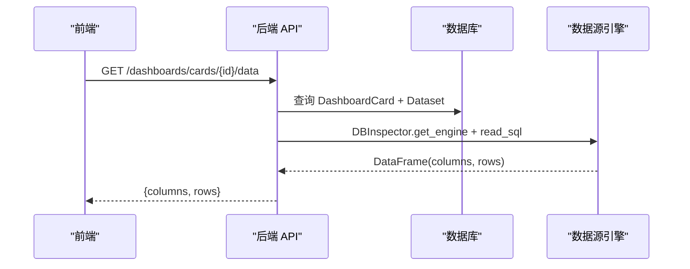
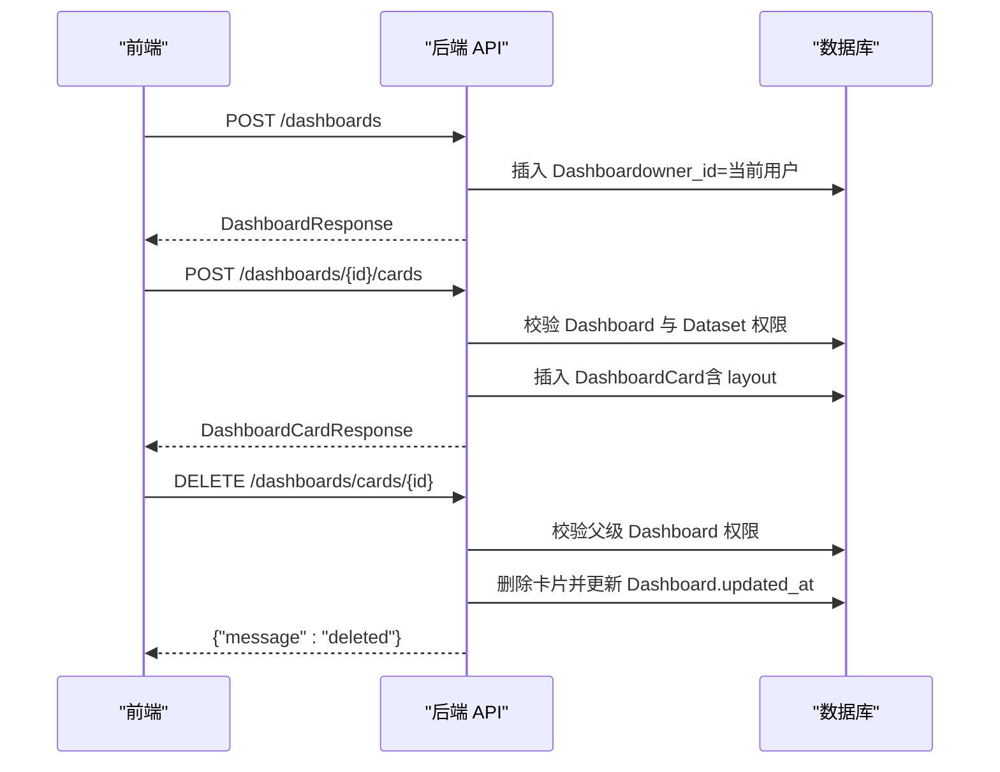
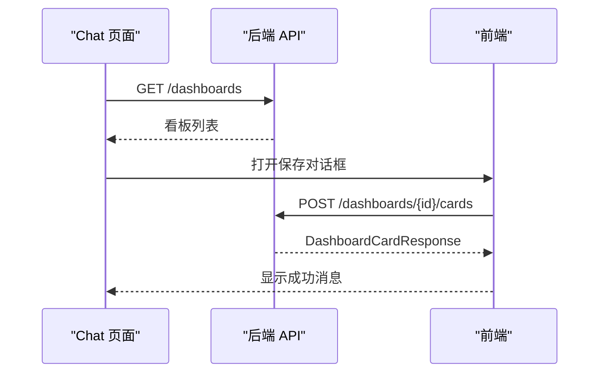
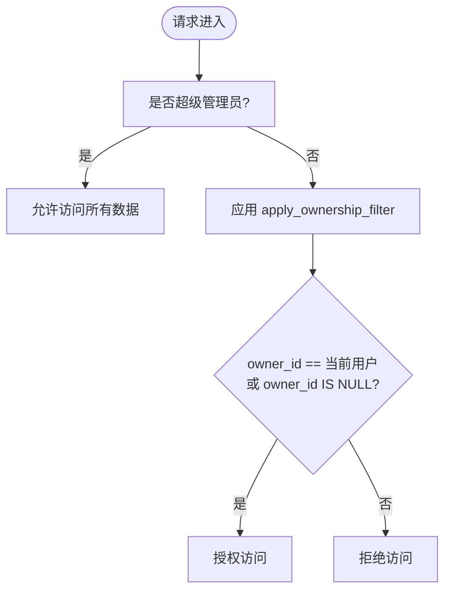
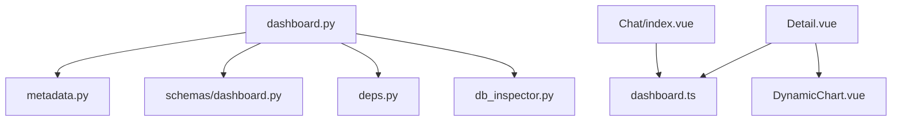

# 仪表盘构建与可视化

<cite>
**本文档引用的文件**
- [metadata.py](file://backend/app/models/metadata.py)
- [dashboard.py](file://backend/app/schemas/dashboard.py)
- [dashboard.py](file://backend/app/api/v1/endpoints/dashboard.py)
- [deps.py](file://backend/app/api/deps.py)
- [db_inspector.py](file://backend/app/services/db_inspector.py)
- [Detail.vue](file://frontend/src/views/Dashboard/Detail.vue)
- [index.vue](file://frontend/src/views/Dashboard/index.vue)
- [dashboard.ts](file://frontend/src/api/dashboard.ts)
- [DynamicChart.vue](file://frontend/src/components/Charts/DynamicChart.vue)
- [index.vue](file://frontend/src/views/Chat/index.vue)
</cite>

## 目录
1. [简介](#简介)
2. [项目结构](#项目结构)
3. [核心组件](#核心组件)
4. [架构总览](#架构总览)
5. [详细组件分析](#详细组件分析)
6. [依赖关系分析](#依赖关系分析)
7. [性能考虑](#性能考虑)
8. [故障排除指南](#故障排除指南)
9. [结论](#结论)

## 简介
本文件系统化文档化仪表盘功能，覆盖看板创建、卡片添加、布局管理与数据展示。重点说明 Dashboard 与 DashboardCard 模型的关系，layout 字段如何存储网格布局信息（x/y/w/h），前端如何通过拖拽或自动布局排列卡片并将布局持久化到数据库；解释卡片如何绑定特定数据集和 SQL 查询，实现动态数据加载；结合 Detail.vue 组件说明看板编辑交互逻辑，以及如何将聊天查询结果快速保存为卡片；强调权限控制如何确保用户只能访问自有或公共看板。

## 项目结构
后端采用 FastAPI + SQLAlchemy 架构，前端采用 Vue 3 + TypeScript + Element Plus + ECharts。仪表盘功能由后端模型与 API 控制器、前端视图与图表组件共同实现。

**图表来源**
- [index.vue](file://frontend/src/views/Dashboard/index.vue#L1-L197)
- [Detail.vue](file://frontend/src/views/Dashboard/Detail.vue#L1-L327)
- [DynamicChart.vue](file://frontend/src/components/Charts/DynamicChart.vue#L1-L346)
- [dashboard.ts](file://frontend/src/api/dashboard.ts#L1-L72)
- [metadata.py](file://backend/app/models/metadata.py#L56-L96)
- [dashboard.py](file://backend/app/schemas/dashboard.py#L1-L51)
- [dashboard.py](file://backend/app/api/v1/endpoints/dashboard.py#L1-L261)
- [deps.py](file://backend/app/api/deps.py#L97-L124)
- [db_inspector.py](file://backend/app/services/db_inspector.py#L1-L152)

**章节来源**
- [index.vue](file://frontend/src/views/Dashboard/index.vue#L1-L197)
- [Detail.vue](file://frontend/src/views/Dashboard/Detail.vue#L1-L327)
- [DynamicChart.vue](file://frontend/src/components/Charts/DynamicChart.vue#L1-L346)
- [dashboard.ts](file://frontend/src/api/dashboard.ts#L1-L72)
- [metadata.py](file://backend/app/models/metadata.py#L56-L96)
- [dashboard.py](file://backend/app/schemas/dashboard.py#L1-L51)
- [dashboard.py](file://backend/app/api/v1/endpoints/dashboard.py#L1-L261)
- [deps.py](file://backend/app/api/deps.py#L97-L124)
- [db_inspector.py](file://backend/app/services/db_inspector.py#L1-L152)

## 核心组件
- 后端模型与关系
  - Dashboard：看板实体，包含 id、name、description、owner_id、created_at、updated_at，一对多关系 cards。
  - DashboardCard：看板卡片实体，包含 id、dashboard_id、title、dataset_id、sql、chart_type、layout、created_at，多对一关系 dashboard 与 dataset。
- 前端接口与视图
  - Dashboard 接口：提供获取看板列表、创建看板、获取看板详情、添加卡片、删除卡片、删除看板等方法。
  - Dashboard 详情页：展示卡片网格布局，支持刷新单卡与全部卡片、删除卡片。
  - 动态图表组件：根据 chart_type 渲染表格或 ECharts 图表，支持主题切换与空状态提示。
- 权限控制
  - apply_ownership_filter：普通用户仅能访问 owner_id == 当前用户或 owner_id IS NULL 的数据；超级管理员可访问所有数据。
  - 公共资源保护：对公共资源的修改与删除增加 is_superuser 校验。

**章节来源**
- [metadata.py](file://backend/app/models/metadata.py#L56-L96)
- [dashboard.py](file://backend/app/schemas/dashboard.py#L1-L51)
- [dashboard.py](file://backend/app/api/v1/endpoints/dashboard.py#L1-L261)
- [deps.py](file://backend/app/api/deps.py#L97-L124)
- [dashboard.ts](file://frontend/src/api/dashboard.ts#L1-L72)
- [Detail.vue](file://frontend/src/views/Dashboard/Detail.vue#L1-L327)
- [DynamicChart.vue](file://frontend/src/components/Charts/DynamicChart.vue#L1-L346)

## 架构总览
仪表盘功能遵循前后端分离架构：前端负责 UI 与交互，后端提供 RESTful API 与数据访问层。数据流从前端发起请求，经后端控制器与权限过滤，访问数据库模型，再返回给前端渲染。

**图表来源**
- [dashboard.py](file://backend/app/api/v1/endpoints/dashboard.py#L63-L197)
- [deps.py](file://backend/app/api/deps.py#L97-L124)
- [db_inspector.py](file://backend/app/services/db_inspector.py#L52-L99)
- [dashboard.ts](file://frontend/src/api/dashboard.ts#L41-L67)

**章节来源**
- [dashboard.py](file://backend/app/api/v1/endpoints/dashboard.py#L63-L197)
- [deps.py](file://backend/app/api/deps.py#L97-L124)
- [db_inspector.py](file://backend/app/services/db_inspector.py#L52-L99)
- [dashboard.ts](file://frontend/src/api/dashboard.ts#L41-L67)

## 详细组件分析

### Dashboard 与 DashboardCard 模型关系
- 关系映射
  - Dashboard 与 DashboardCard：一对多关系，Dashboard.cards 通过 back_populates 引用卡片集合。
  - DashboardCard 与 Dataset：多对一关系，卡片绑定具体数据集以执行 SQL。
- 字段说明
  - DashboardCard.layout：JSON 字段，存储网格布局信息 {x, y, w, h}，用于卡片在网格中的位置与尺寸。
  - DashboardCard.sql：卡片绑定的 SQL 查询语句，用于动态数据加载。
  - Dashboard.owner_id：用于权限控制，owner_id 为 NULL 表示公共资源。

**图表来源**
- [metadata.py](file://backend/app/models/metadata.py#L56-L96)

**章节来源**
- [metadata.py](file://backend/app/models/metadata.py#L56-L96)

### 布局管理与网格系统
- 前端网格布局
  - Dashboard 详情页使用 12 列网格系统，卡片通过 col-span 类控制宽度，根据 chart_type 决定占位宽度。
  - 卡片头部包含刷新与删除按钮，支持单卡刷新与批量刷新。
- 布局字段存储
  - layout 字段在前端接口中定义为 {x, y, w, h}，后端 API 在创建卡片时接收并持久化到数据库。
  - 当前前端未实现拖拽重排，但 layout 字段已预留，便于后续集成拖拽布局库（如 gridstack、interact.js）。

**图表来源**
- [Detail.vue](file://frontend/src/views/Dashboard/Detail.vue#L224-L230)

**章节来源**
- [Detail.vue](file://frontend/src/views/Dashboard/Detail.vue#L81-L144)
- [dashboard.ts](file://frontend/src/api/dashboard.ts#L19-L26)
- [dashboard.py](file://backend/app/api/v1/endpoints/dashboard.py#L114-L121)

### 数据展示与动态加载
- 数据加载流程
  - 前端在 Dashboard 详情页加载完成后，异步拉取每个卡片的数据。
  - 后端根据卡片绑定的 dataset_id 与 sql，连接数据源引擎执行 SQL，返回 columns 与 rows。
- 错误处理
  - 后端区分数据库连接错误与 SQL 语法错误，分别返回 500 与 400 状态码。
  - 前端捕获错误并在卡片区域显示错误信息。

**图表来源**
- [dashboard.py](file://backend/app/api/v1/endpoints/dashboard.py#L132-L197)
- [db_inspector.py](file://backend/app/services/db_inspector.py#L52-L99)
- [dashboard.ts](file://frontend/src/api/dashboard.ts#L61-L62)

**章节来源**
- [dashboard.py](file://backend/app/api/v1/endpoints/dashboard.py#L132-L197)
- [db_inspector.py](file://backend/app/services/db_inspector.py#L52-L99)
- [dashboard.ts](file://frontend/src/api/dashboard.ts#L61-L62)
- [Detail.vue](file://frontend/src/views/Dashboard/Detail.vue#L260-L273)

### 看板编辑交互逻辑
- 创建看板
  - 前端调用 createDashboard，后端自动设置 owner_id 为当前用户。
- 添加卡片
  - 前端调用 addCardToDashboard，后端校验 Dashboard 与 Dataset 权限，公共资源需超级管理员权限。
  - 后端更新 Dashboard 的 updated_at 时间戳。
- 删除卡片与看板
  - 删除卡片与看板均需校验父级 Dashboard 的所有权，公共资源需超级管理员权限。
- 刷新数据
  - 支持单卡刷新与全部刷新，前端使用 Promise.all 并发加载。

**图表来源**
- [dashboard.py](file://backend/app/api/v1/endpoints/dashboard.py#L25-L43)
- [dashboard.py](file://backend/app/api/v1/endpoints/dashboard.py#L82-L129)
- [dashboard.py](file://backend/app/api/v1/endpoints/dashboard.py#L200-L234)
- [dashboard.ts](file://frontend/src/api/dashboard.ts#L37-L39)
- [dashboard.ts](file://frontend/src/api/dashboard.ts#L45-L59)
- [dashboard.ts](file://frontend/src/api/dashboard.ts#L65-L71)

**章节来源**
- [dashboard.py](file://backend/app/api/v1/endpoints/dashboard.py#L25-L43)
- [dashboard.py](file://backend/app/api/v1/endpoints/dashboard.py#L82-L129)
- [dashboard.py](file://backend/app/api/v1/endpoints/dashboard.py#L200-L234)
- [dashboard.ts](file://frontend/src/api/dashboard.ts#L37-L39)
- [dashboard.ts](file://frontend/src/api/dashboard.ts#L45-L59)
- [dashboard.ts](file://frontend/src/api/dashboard.ts#L65-L71)

### 将聊天查询结果快速保存为卡片
- 交互流程
  - 在 Chat 页面，当 AI 返回图表结果时，用户可点击“保存到看板”弹出对话框。
  - 前端加载现有看板列表，支持选择已有看板或新建看板，随后调用 addCardToDashboard 保存卡片。
- 数据绑定
  - 保存时使用当前消息的 datasetId、sql、chartType 等字段，标题默认取问题内容。

**图表来源**
- [index.vue](file://frontend/src/views/Chat/index.vue#L684-L754)
- [dashboard.ts](file://frontend/src/api/dashboard.ts#L45-L59)

**章节来源**
- [index.vue](file://frontend/src/views/Chat/index.vue#L684-L754)
- [dashboard.ts](file://frontend/src/api/dashboard.ts#L45-L59)

### 权限控制与数据隔离
- 用户认证与状态检查
  - get_current_user：校验 Token 黑名单、签名有效性、用户软删除与封禁状态。
- 数据访问控制
  - apply_ownership_filter：普通用户仅能访问 owner_id == 当前用户或 owner_id IS NULL 的数据；超级管理员可访问所有数据。
- 公共资源保护
  - 对公共资源的修改与删除增加 is_superuser 校验，避免非管理员误操作。

**图表来源**
- [deps.py](file://backend/app/api/deps.py#L17-L80)
- [deps.py](file://backend/app/api/deps.py#L97-L124)
- [dashboard.py](file://backend/app/api/v1/endpoints/dashboard.py#L93-L103)

**章节来源**
- [deps.py](file://backend/app/api/deps.py#L17-L80)
- [deps.py](file://backend/app/api/deps.py#L97-L124)
- [dashboard.py](file://backend/app/api/v1/endpoints/dashboard.py#L93-L103)

## 依赖关系分析
- 后端模块耦合
  - API 控制器依赖模型、模式、依赖注入与数据库检查服务。
  - 权限过滤函数被多个控制器复用，降低重复逻辑。
- 前端模块耦合
  - Dashboard 详情页依赖动态图表组件与 API 接口。
  - Chat 页面与 Dashboard 页面共享卡片保存逻辑，通过统一的 addCardToDashboard 接口。

**图表来源**
- [dashboard.py](file://backend/app/api/v1/endpoints/dashboard.py#L1-L261)
- [metadata.py](file://backend/app/models/metadata.py#L56-L96)
- [dashboard.py](file://backend/app/schemas/dashboard.py#L1-L51)
- [deps.py](file://backend/app/api/deps.py#L97-L124)
- [db_inspector.py](file://backend/app/services/db_inspector.py#L1-L152)
- [Detail.vue](file://frontend/src/views/Dashboard/Detail.vue#L1-L327)
- [DynamicChart.vue](file://frontend/src/components/Charts/DynamicChart.vue#L1-L346)
- [dashboard.ts](file://frontend/src/api/dashboard.ts#L1-L72)
- [index.vue](file://frontend/src/views/Chat/index.vue#L1-L1052)

**章节来源**
- [dashboard.py](file://backend/app/api/v1/endpoints/dashboard.py#L1-L261)
- [metadata.py](file://backend/app/models/metadata.py#L56-L96)
- [dashboard.py](file://backend/app/schemas/dashboard.py#L1-L51)
- [deps.py](file://backend/app/api/deps.py#L97-L124)
- [db_inspector.py](file://backend/app/services/db_inspector.py#L1-L152)
- [Detail.vue](file://frontend/src/views/Dashboard/Detail.vue#L1-L327)
- [DynamicChart.vue](file://frontend/src/components/Charts/DynamicChart.vue#L1-L346)
- [dashboard.ts](file://frontend/src/api/dashboard.ts#L1-L72)
- [index.vue](file://frontend/src/views/Chat/index.vue#L1-L1052)

## 性能考虑
- 数据库连接与查询
  - DBInspector 使用连接池与预检机制，减少连接超时与重建成本。
  - 读取 SQL 结果后进行序列化，避免复杂对象导致的传输开销。
- 前端并发加载
  - Dashboard 详情页使用 Promise.all 并发加载卡片数据，提升首屏渲染速度。
- 图表渲染
  - DynamicChart 组件按需注册 ECharts 组件，避免不必要的包体积。
  - 主题切换通过计算属性驱动，减少重复渲染。

[本节为通用性能建议，无需特定文件引用]

## 故障排除指南
- SQL 执行错误
  - 后端区分数据库连接错误与 SQL 语法错误，分别返回 500 与 400。
  - 前端捕获错误并显示友好提示，支持查看 SQL 详情与反馈。
- 权限访问失败
  - 若出现“看板不存在或访问被拒绝”，检查当前用户是否拥有该看板的所有权或是否为公共资源。
  - 公共资源的修改/删除需超级管理员权限。
- 数据源连接异常
  - 确认数据源凭据与网络连通性，必要时重新测试连接。

**章节来源**
- [dashboard.py](file://backend/app/api/v1/endpoints/dashboard.py#L157-L177)
- [index.vue](file://frontend/src/views/Chat/index.vue#L228-L266)

## 结论
仪表盘功能通过清晰的模型关系、完善的权限控制与前后端协同，实现了从看板创建、卡片添加到数据动态加载的完整闭环。layout 字段为后续拖拽布局提供了基础，而卡片与数据集的强绑定确保了数据一致性与可追溯性。权限过滤与公共资源保护机制保障了数据安全与合规。未来可在前端集成拖拽布局库，并扩展看板模板与共享能力，进一步提升用户体验与协作效率。