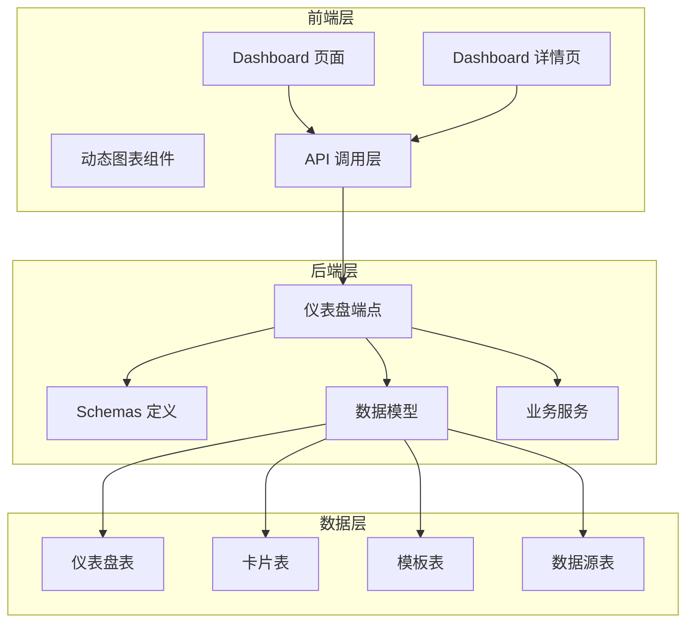
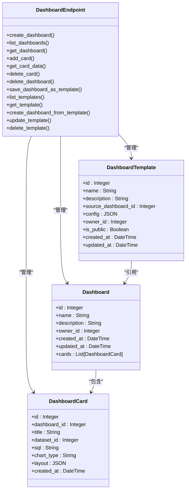
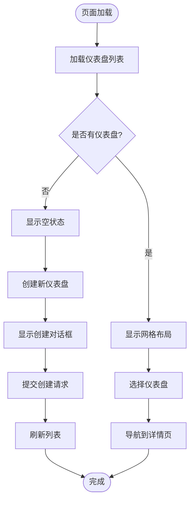
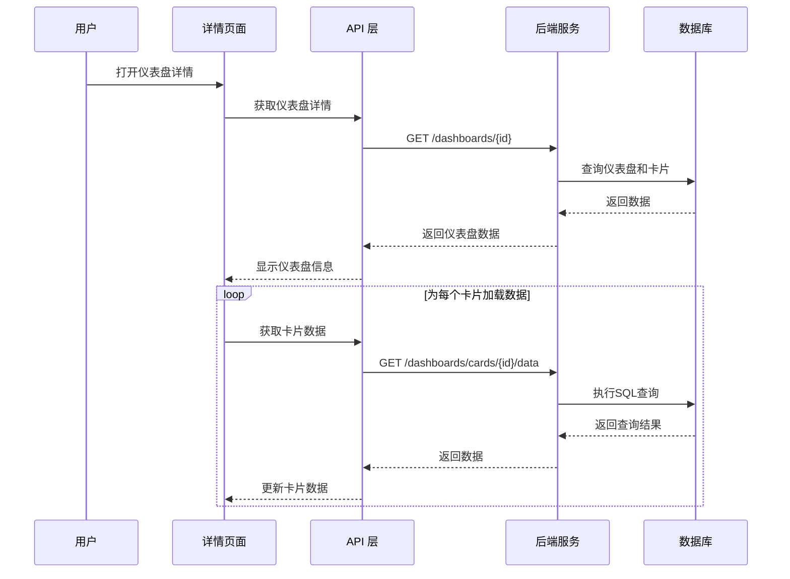
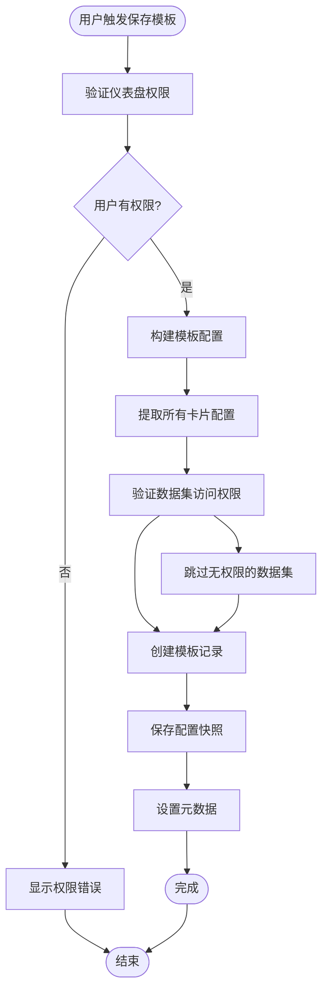
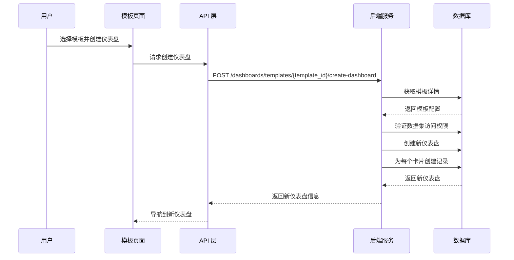
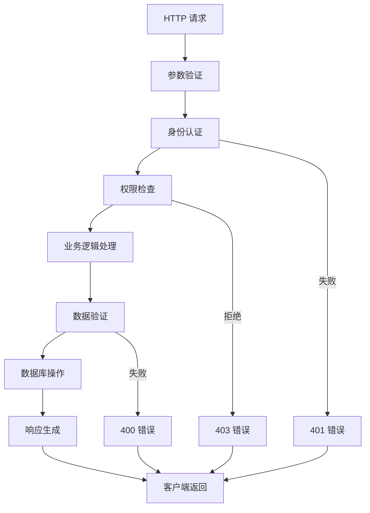
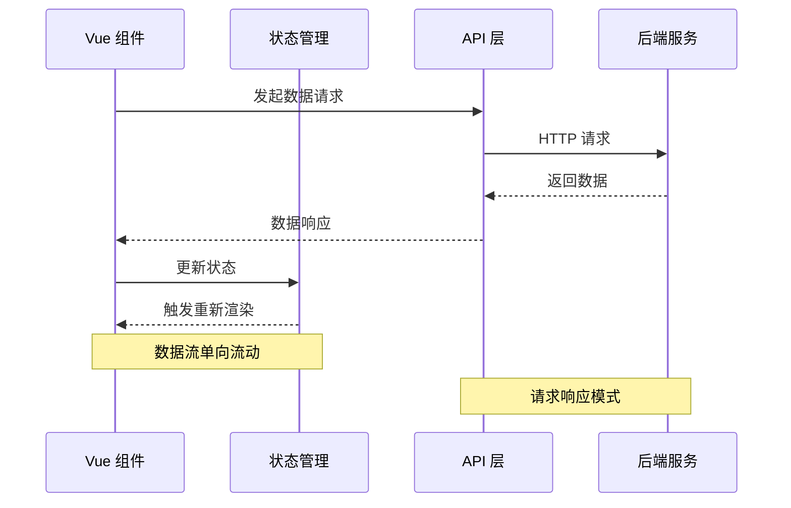
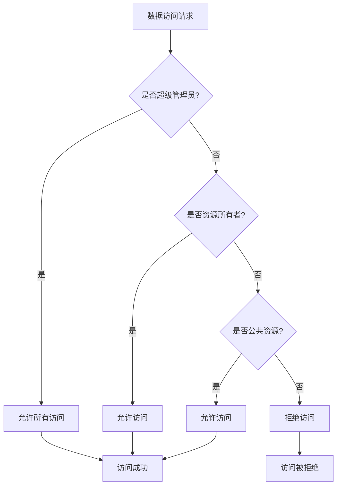
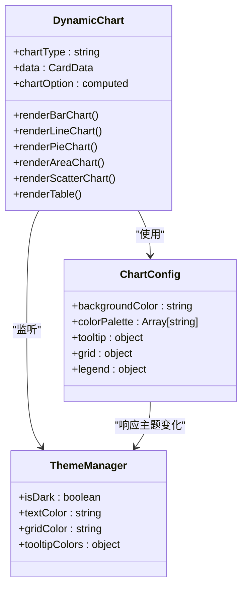

# 仪表盘模板系统

<cite>
**本文档引用的文件**
- [dashboard.py](file://backend/app/api/v1/endpoints/dashboard.py)
- [dashboard.py](file://backend/app/schemas/dashboard.py)
- [metadata.py](file://backend/app/models/metadata.py)
- [db_inspector.py](file://backend/app/services/db_inspector.py)
- [index.vue](file://frontend/src/views/Dashboard/index.vue)
- [Detail.vue](file://frontend/src/views/Dashboard/Detail.vue)
- [dashboard.ts](file://frontend/src/api/dashboard.ts)
- [DynamicChart.vue](file://frontend/src/components/Charts/DynamicChart.vue)
- [deps.py](file://backend/app/api/deps.py)
- [README.md](file://README.md)
</cite>

## 目录
1. [简介](#简介)
2. [系统架构概览](#系统架构概览)
3. [核心组件分析](#核心组件分析)
4. [仪表盘模板功能详解](#仪表盘模板功能详解)
5. [数据流分析](#数据流分析)
6. [安全机制](#安全机制)
7. [前端实现分析](#前端实现分析)
8. [性能考虑](#性能考虑)
9. [故障排除指南](#故障排除指南)
10. [总结](#总结)

## 简介

仪表盘模板系统是 Universal BI 平台中的核心功能模块，它允许用户创建、管理和复用数据仪表盘配置。该系统提供了完整的模板生命周期管理，包括模板创建、保存、分享、复用等功能，大大提升了用户构建数据可视化界面的效率。

## 系统架构概览

**图表来源**
- [dashboard.py](file://backend/app/api/v1/endpoints/dashboard.py#L1-L477)
- [metadata.py](file://backend/app/models/metadata.py#L58-L187)

## 核心组件分析

### 后端核心组件

#### 仪表盘端点控制器
仪表盘端点控制器实现了完整的 CRUD 操作和模板管理功能：

**图表来源**
- [dashboard.py](file://backend/app/api/v1/endpoints/dashboard.py#L30-L477)
- [metadata.py](file://backend/app/models/metadata.py#L58-L187)

#### 数据模型设计
系统采用清晰的三层架构设计：

**仪表盘模型**：负责存储仪表盘基本信息和所有者权限
**卡片模型**：存储具体的查询卡片配置和数据
**模板模型**：存储可复用的仪表盘配置快照

**章节来源**
- [metadata.py](file://backend/app/models/metadata.py#L58-L187)

### 前端核心组件

#### 仪表盘列表页面
仪表盘列表页面提供了用户管理仪表盘的主界面：

**图表来源**
- [index.vue](file://frontend/src/views/Dashboard/index.vue#L176-L189)

#### 仪表盘详情页面
仪表盘详情页面提供了完整的卡片管理和数据展示功能：

**图表来源**
- [Detail.vue](file://frontend/src/views/Dashboard/Detail.vue#L281-L303)

**章节来源**
- [index.vue](file://frontend/src/views/Dashboard/index.vue#L1-L301)
- [Detail.vue](file://frontend/src/views/Dashboard/Detail.vue#L1-L403)

## 仪表盘模板功能详解

### 模板创建流程

模板创建是仪表盘模板系统的核心功能，它允许用户将现有的仪表盘配置保存为可复用的模板：

**图表来源**
- [dashboard.py](file://backend/app/api/v1/endpoints/dashboard.py#L270-L315)

### 模板复用流程

模板复用功能允许用户基于现有模板快速创建新的仪表盘：

**图表来源**
- [dashboard.py](file://backend/app/api/v1/endpoints/dashboard.py#L363-L421)

### 模板管理功能

系统提供了完整的模板管理功能，包括：

**模板列表**：用户可以看到自己创建的模板和公开模板
**模板详情**：查看模板的详细配置信息
**模板更新**：修改模板的基本信息和可见性
**模板删除**：删除不再需要的模板

**章节来源**
- [dashboard.py](file://backend/app/api/v1/endpoints/dashboard.py#L318-L476)

## 数据流分析

### 后端数据处理流程

系统采用分层的数据处理架构，确保数据的安全性和一致性：

**图表来源**
- [dashboard.py](file://backend/app/api/v1/endpoints/dashboard.py#L30-L477)

### 前端数据交互流程

前端采用响应式数据绑定和异步请求处理：

**图表来源**
- [dashboard.ts](file://frontend/src/api/dashboard.ts#L33-L71)

**章节来源**
- [dashboard.ts](file://frontend/src/api/dashboard.ts#L1-L178)

## 安全机制

### 数据隔离机制

系统实现了严格的多层数据隔离机制，确保用户数据的安全：

**图表来源**
- [deps.py](file://backend/app/api/deps.py#L97-L123)

### 权限控制策略

系统采用基于角色的权限控制（RBAC）模型：

**超级管理员权限**：
- 访问所有数据
- 修改公共资源
- 管理所有用户

**普通用户权限**：
- 访问自己的数据
- 访问公共资源
- 创建和管理自己的资源

**公共资源机制**：
- owner_id 为 NULL 的资源
- 仅超级管理员可以修改
- 所有用户都可以访问

**章节来源**
- [deps.py](file://backend/app/api/deps.py#L83-L123)

## 前端实现分析

### 动态图表组件

动态图表组件支持多种图表类型的渲染：

**图表来源**
- [DynamicChart.vue](file://frontend/src/components/Charts/DynamicChart.vue#L99-L476)

### 响应式布局设计

系统采用响应式布局设计，支持不同屏幕尺寸：

**网格系统**：
- 移动端：1列网格
- 平板：2列网格  
- 桌面端：3列网格
- 大屏：4列网格

**卡片布局**：
- 线图、柱状图、面积图：占12列
- 饼图、表格：占8列
- KPI卡片：占4列

**章节来源**
- [Detail.vue](file://frontend/src/views/Dashboard/Detail.vue#L269-L275)

## 性能考虑

### 数据库优化

系统采用了多项数据库优化策略：

**连接池管理**：
- MySQL：连接超时10秒，读写超时30秒
- PostgreSQL：连接超时10秒
- 连接池大小：5个基础连接，最多15个并发

**查询优化**：
- 使用 selectinload 预加载关联对象
- 避免 N+1 查询问题
- 合理使用索引

**缓存策略**：
- Redis 缓存支持
- 查询结果缓存
- 模板配置缓存

### 前端性能优化

**懒加载**：
- 图表组件按需加载
- 路由组件懒加载
- 图片资源延迟加载

**虚拟滚动**：
- 大数据集使用虚拟滚动
- 无限滚动加载
- 分页加载策略

**内存管理**：
- 组件销毁时清理事件监听
- 及时释放定时器
- 避免内存泄漏

## 故障排除指南

### 常见问题及解决方案

**问题1：SQL 执行失败**
- 检查数据源连接配置
- 验证 SQL 语法正确性
- 确认数据集权限

**问题2：模板创建失败**
- 检查模板名称是否重复
- 验证数据集访问权限
- 确认模板配置格式正确

**问题3：权限访问被拒绝**
- 确认用户身份认证
- 检查资源所有权
- 验证公共资源设置

**问题4：图表渲染异常**
- 检查数据格式
- 验证图表类型匹配
- 确认主题配置

### 调试工具

**后端调试**：
- 日志级别设置
- 数据库查询日志
- 性能监控指标

**前端调试**：
- 浏览器开发者工具
- Vue DevTools
- 网络请求监控

**章节来源**
- [dashboard.py](file://backend/app/api/v1/endpoints/dashboard.py#L162-L181)

## 总结

仪表盘模板系统是一个功能完整、架构清晰的数据可视化管理平台。系统通过以下关键特性实现了高效的数据仪表盘管理：

**核心优势**：
- 完整的模板生命周期管理
- 严格的数据安全隔离机制
- 灵活的响应式布局设计
- 高性能的前后端架构

**技术特点**：
- 基于 FastAPI 的高性能后端
- Vue 3 + TypeScript 的现代化前端
- 完善的类型安全保证
- 清晰的分层架构设计

**应用场景**：
- 企业数据驾驶舱
- 业务监控面板
- 数据分析仪表盘
- 团队协作看板

该系统为用户提供了从数据查询到可视化展示的完整解决方案，大大提升了数据分析和决策支持的效率。