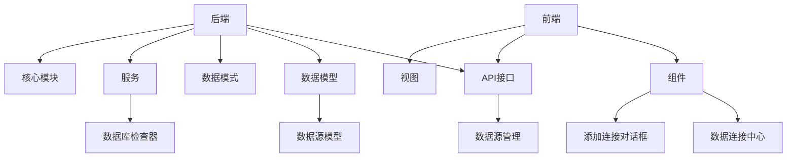
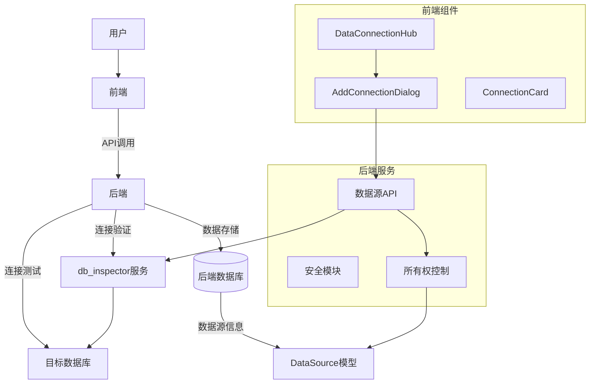
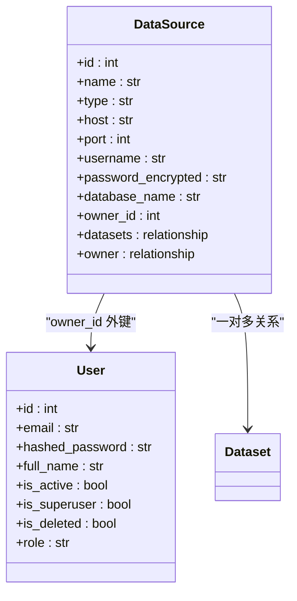
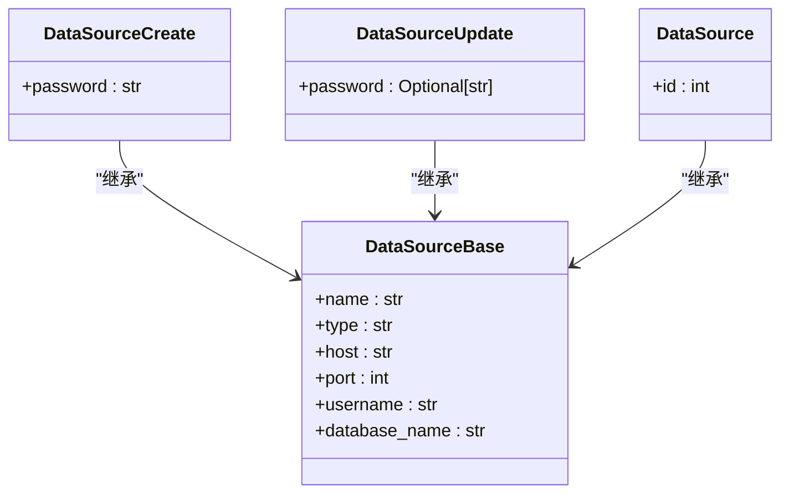
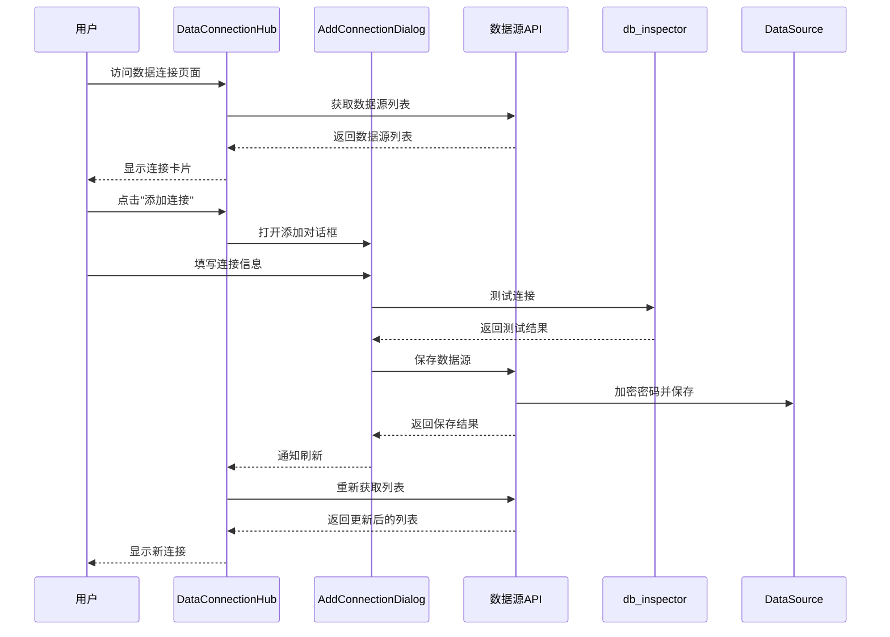
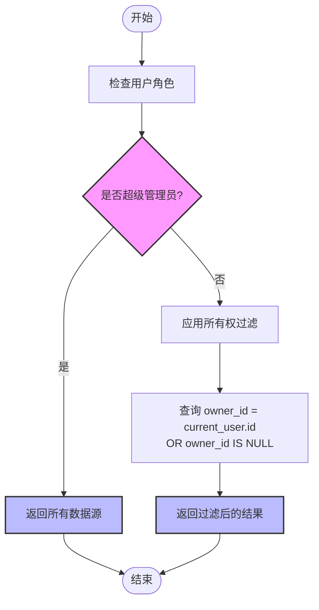
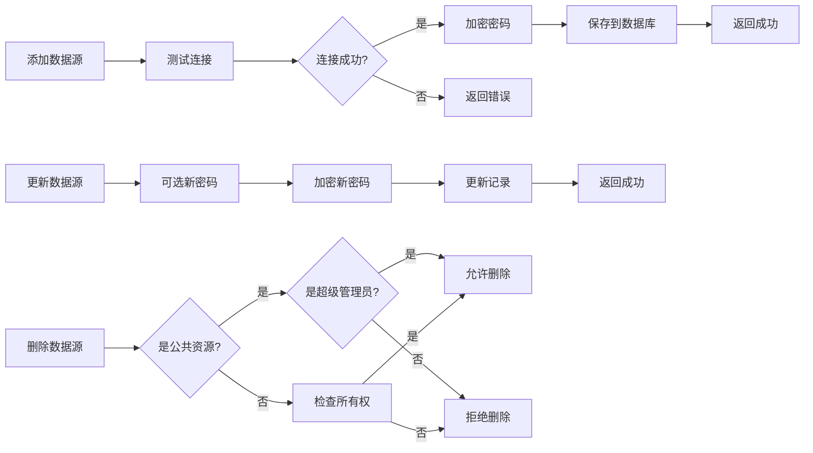
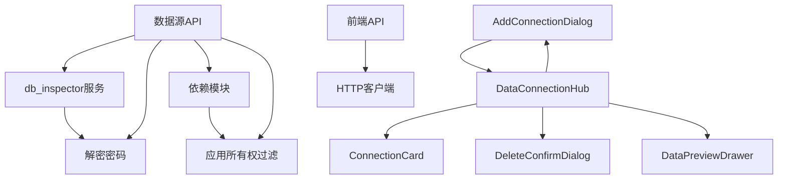

# 数据源管理

<cite>
**本文档引用的文件**
- [metadata.py](file://backend/app/models/metadata.py)
- [datasource.py](file://backend/app/schemas/datasource.py)
- [datasource.py](file://backend/app/api/v1/endpoints/datasource.py)
- [db_inspector.py](file://backend/app/services/db_inspector.py)
- [DataConnectionHub.vue](file://frontend/src/components/DataConnectionHub.vue)
- [datasource.ts](file://frontend/src/api/datasource.ts)
- [deps.py](file://backend/app/api/deps.py)
- [security.py](file://backend/app/core/security.py)
- [AddConnectionDialog.vue](file://frontend/src/components/AddConnectionDialog.vue)
- [ConnectionCard.vue](file://frontend/src/components/ConnectionCard.vue)
- [001_add_saas_features.sql](file://backend/migrations/001_add_saas_features.sql)
- [config.py](file://backend/app/core/config.py)
- [add_owner_id.py](file://backend/add_owner_id.py)
- [main.py](file://backend/app/main.py)
</cite>

## 目录
1. [简介](#简介)
2. [项目结构](#项目结构)
3. [核心组件](#核心组件)
4. [架构概述](#架构概述)
5. [详细组件分析](#详细组件分析)
6. [依赖分析](#依赖分析)
7. [性能考虑](#性能考虑)
8. [故障排除指南](#故障排除指南)
9. [结论](#结论)

## 简介
本文档详细说明了数据源管理功能的实现，涵盖数据源的添加、测试连接、更新和删除全流程。文档解释了后端如何通过DataSource模型存储数据库连接信息（包括加密密码），并利用db_inspector.py验证连接有效性。同时，文档阐述了前端DataConnectionHub组件如何通过表单收集用户输入，并调用API完成操作。重点描述了数据所有权机制（owner_id）如何实现SaaS环境下的资源隔离，以及公共资源（owner_id为NULL）的共享逻辑。

## 项目结构

**图示来源**
- [metadata.py](file://backend/app/models/metadata.py#L18-L32)
- [datasource.py](file://backend/app/api/v1/endpoints/datasource.py#L18)
- [DataConnectionHub.vue](file://frontend/src/components/DataConnectionHub.vue#L1)
- [AddConnectionDialog.vue](file://frontend/src/components/AddConnectionDialog.vue#L1)

**章节来源**
- [metadata.py](file://backend/app/models/metadata.py#L1-L129)
- [DataConnectionHub.vue](file://frontend/src/components/DataConnectionHub.vue#L1-L170)

## 核心组件

数据源管理功能的核心组件包括后端的DataSource模型、db_inspector服务和前端的DataConnectionHub组件。这些组件协同工作，实现了完整的数据源生命周期管理。

**章节来源**
- [metadata.py](file://backend/app/models/metadata.py#L18-L32)
- [db_inspector.py](file://backend/app/services/db_inspector.py#L13-L152)
- [DataConnectionHub.vue](file://frontend/src/components/DataConnectionHub.vue#L1-L170)

## 架构概述

**图示来源**
- [datasource.py](file://backend/app/api/v1/endpoints/datasource.py#L20-L182)
- [db_inspector.py](file://backend/app/services/db_inspector.py#L13-L152)
- [DataConnectionHub.vue](file://frontend/src/components/DataConnectionHub.vue#L1-L170)
- [AddConnectionDialog.vue](file://frontend/src/components/AddConnectionDialog.vue#L1-L239)

## 详细组件分析

### 后端数据模型分析

**图示来源**
- [metadata.py](file://backend/app/models/metadata.py#L18-L32)
- [metadata.py](file://backend/app/models/metadata.py#L6-L17)

### Pydantic模型定义

**图示来源**
- [datasource.py](file://backend/app/schemas/datasource.py#L4-L22)

### 前端组件交互流程

**图示来源**
- [DataConnectionHub.vue](file://frontend/src/components/DataConnectionHub.vue#L1-L170)
- [AddConnectionDialog.vue](file://frontend/src/components/AddConnectionDialog.vue#L1-L239)
- [datasource.py](file://backend/app/api/v1/endpoints/datasource.py#L20-L58)
- [db_inspector.py](file://backend/app/services/db_inspector.py#L32-L50)

### 数据所有权与隔离机制

**图示来源**
- [deps.py](file://backend/app/api/deps.py#L97-L123)
- [datasource.py](file://backend/app/api/v1/endpoints/datasource.py#L71-L73)

### 数据源操作流程

**图示来源**
- [datasource.py](file://backend/app/api/v1/endpoints/datasource.py#L31-L99)
- [security.py](file://backend/app/core/security.py#L59-L65)

## 依赖分析

**图示来源**
- [datasource.py](file://backend/app/api/v1/endpoints/datasource.py#L6-L15)
- [deps.py](file://backend/app/api/deps.py#L7-L11)
- [DataConnectionHub.vue](file://frontend/src/components/DataConnectionHub.vue#L75-L78)

## 性能考虑

数据源管理功能在性能方面有以下考虑：
1. 连接测试设置了5秒的超时时间，避免长时间等待
2. 数据库连接使用连接池配置，包括pool_size、max_overflow等参数
3. 对于MySQL和PostgreSQL有不同的连接参数优化
4. 使用Redis缓存Token黑名单，提高认证效率
5. 前端实现了列表数据的本地过滤，减少API调用

**章节来源**
- [db_inspector.py](file://backend/app/services/db_inspector.py#L44)
- [db_inspector.py](file://backend/app/services/db_inspector.py#L74-L80)
- [security.py](file://backend/app/core/security.py#L16-L47)

## 故障排除指南

常见问题及解决方案：
1. **连接测试失败**：检查网络连接、主机地址、端口、用户名和密码是否正确
2. **无法删除公共资源**：只有超级管理员才能删除owner_id为NULL的公共资源
3. **权限不足**：普通用户只能操作自己的数据源和公共资源
4. **密码加密失败**：检查SECRET_KEY配置是否正确
5. **Redis连接失败**：检查REDIS_URL配置，系统会自动降级处理

**章节来源**
- [datasource.py](file://backend/app/api/v1/endpoints/datasource.py#L94-L95)
- [security.py](file://backend/app/core/security.py#L38-L45)
- [db_inspector.py](file://backend/app/services/db_inspector.py#L49)

## 结论

数据源管理功能通过前后端协同工作，实现了完整的数据源生命周期管理。后端使用DataSource模型存储连接信息，通过加密保护密码安全，并利用db_inspector服务验证连接有效性。前端通过直观的界面收集用户输入，提供测试连接功能。系统通过owner_id机制实现了SaaS环境下的数据隔离，既保证了用户数据的安全性，又支持公共资源的共享。整个功能设计考虑了安全性、性能和用户体验，为系统提供了可靠的数据源管理能力。