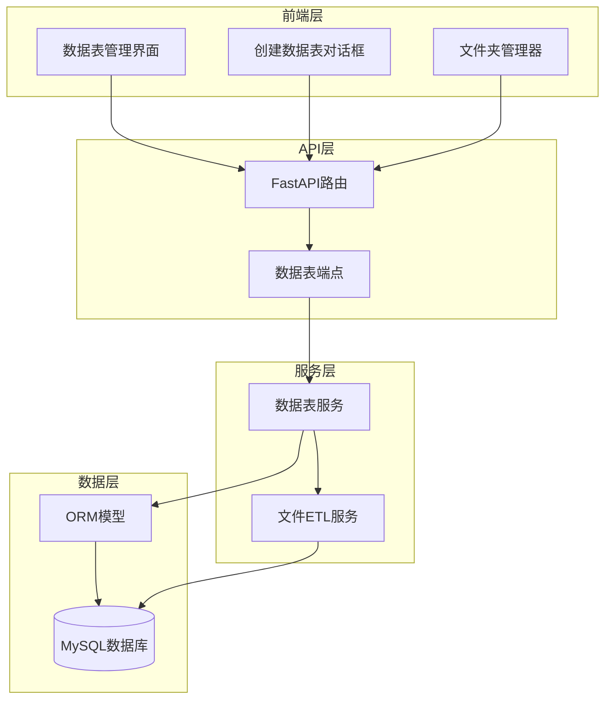
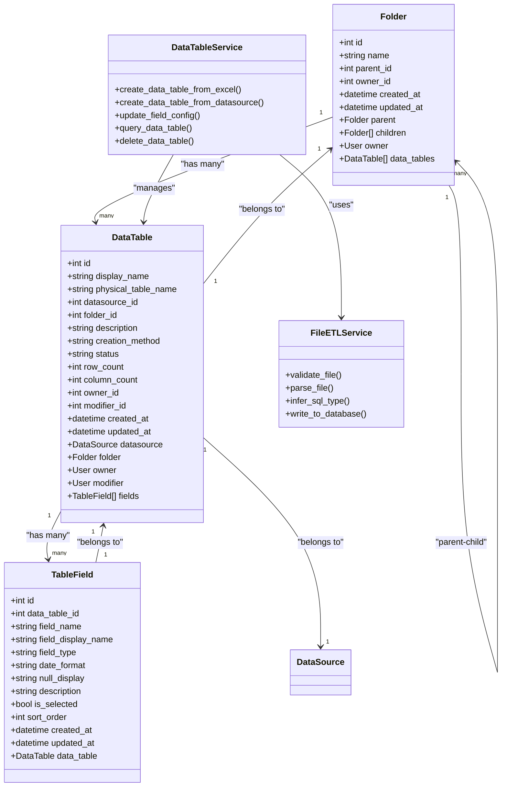
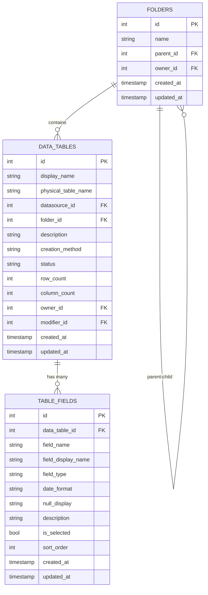
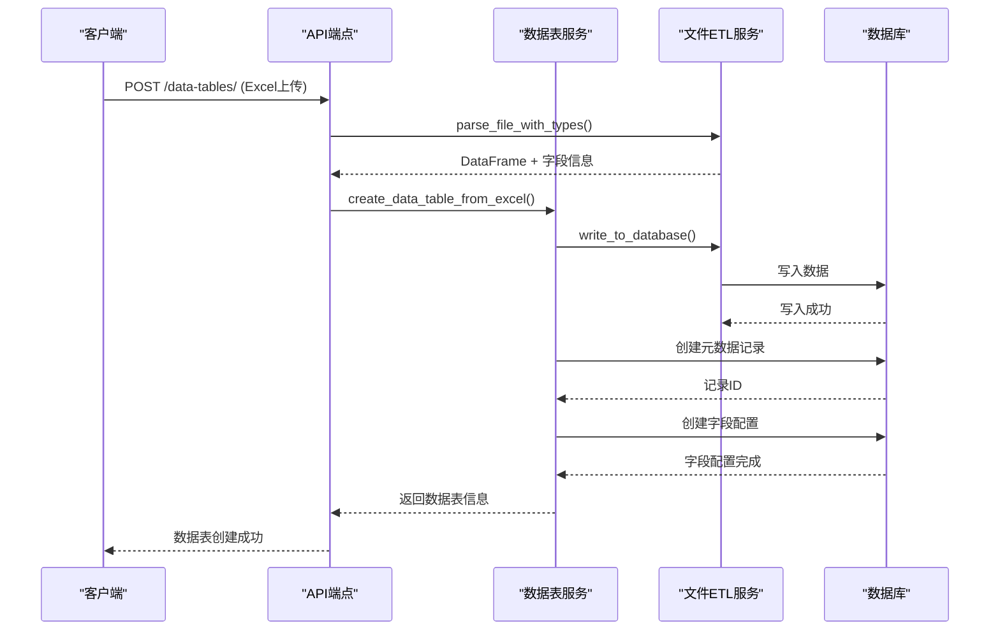
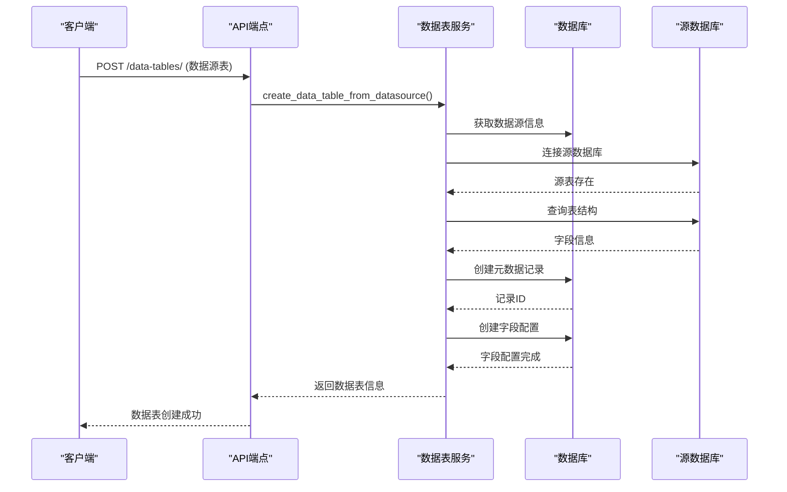
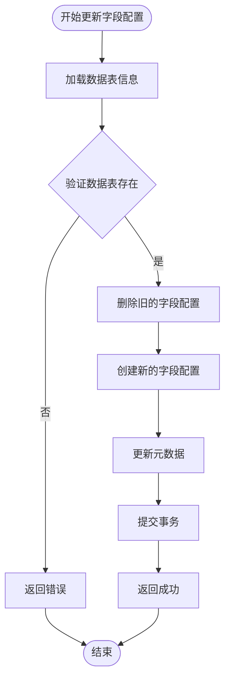
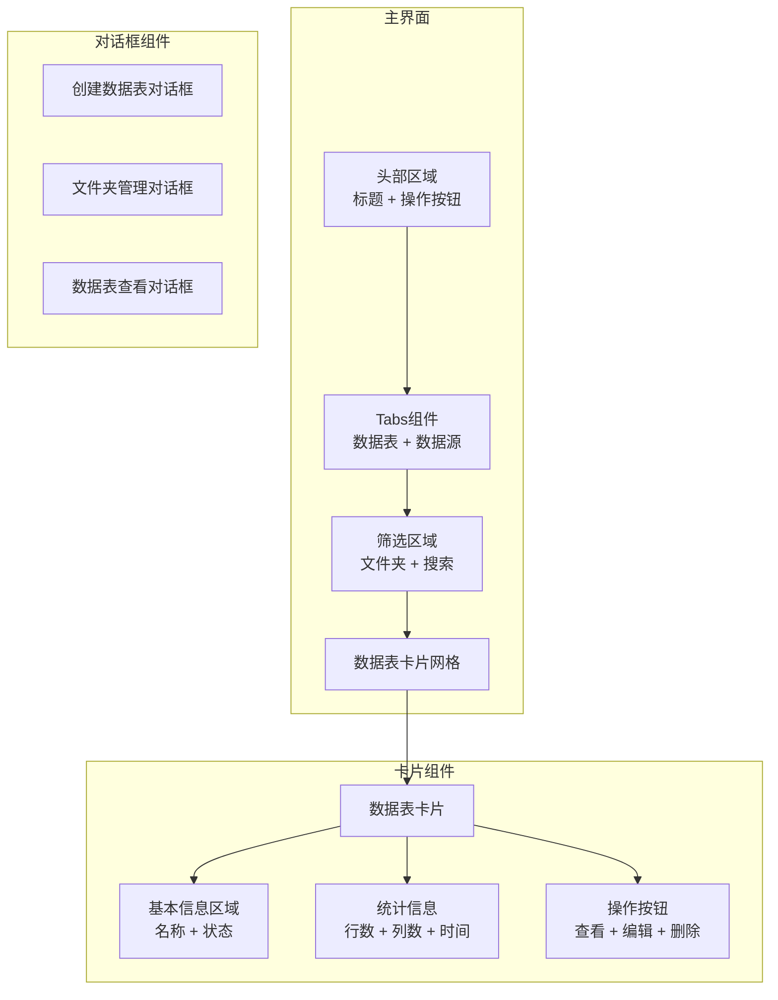
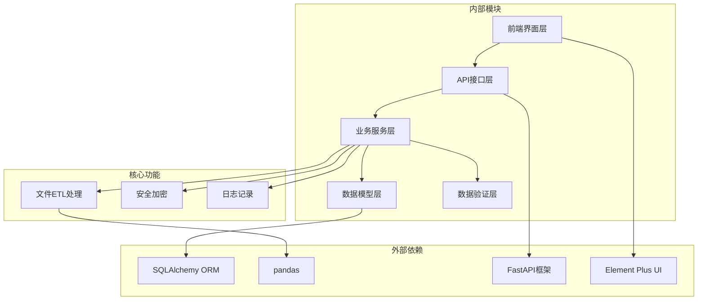
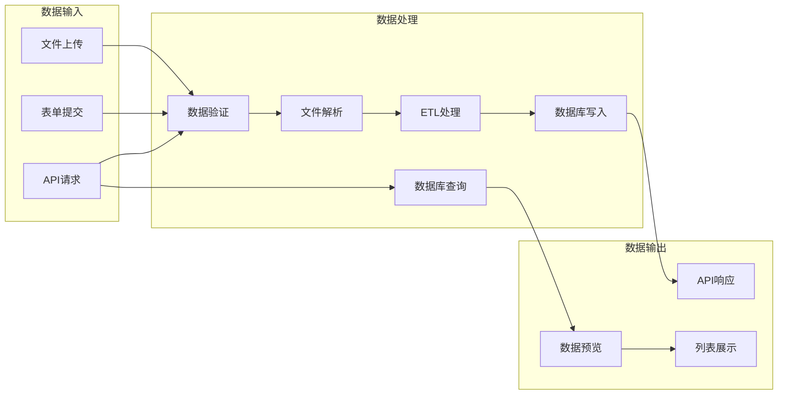

# 数据表管理

<cite>
**本文档引用的文件**
- [models/data_table.py](file://backend/app/models/data_table.py)
- [schemas/data_table.py](file://backend/app/schemas/data_table.py)
- [services/data_table_service.py](file://backend/app/services/data_table_service.py)
- [api/v1/endpoints/data_table.py](file://backend/app/api/v1/endpoints/data_table.py)
- [migrations/006_add_data_tables.sql](file://backend/migrations/006_add_data_tables.sql)
- [file_etl.py](file://backend/app/services/file_etl.py)
- [metadata.py](file://backend/app/models/metadata.py)
- [views/DataTable/index.vue](file://frontend/src/views/DataTable/index.vue)
- [api/dataTable.ts](file://frontend/src/api/dataTable.ts)
- [views/DataTable/components/CreateDataTableDialog.vue](file://frontend/src/views/DataTable/components/CreateDataTableDialog.vue)
- [views/DataTable/components/FolderManager.vue](file://frontend/src/views/DataTable/components/FolderManager.vue)
</cite>

## 目录
1. [简介](#简介)
2. [项目结构](#项目结构)
3. [核心组件](#核心组件)
4. [架构概览](#架构概览)
5. [详细组件分析](#详细组件分析)
6. [依赖关系分析](#依赖关系分析)
7. [性能考虑](#性能考虑)
8. [故障排除指南](#故障排除指南)
9. [结论](#结论)

## 简介

数据表管理是Universal BI平台的核心功能模块，负责管理用户创建和维护的各种数据表。该模块支持两种主要的数据表创建方式：Excel/CSV文件上传和从现有数据源中选择表。系统提供了完整的数据表生命周期管理，包括创建、查询、更新、删除以及字段配置管理。

该功能模块实现了数据表的元数据管理、字段配置、数据查询和文件ETL处理等核心能力，为上层的数据分析和可视化功能提供了坚实的基础。

## 项目结构

数据表管理功能采用典型的三层架构设计，包含后端API层、服务层和数据访问层，以及对应的前端界面组件。

**图表来源**
- [api/v1/endpoints/data_table.py](file://backend/app/api/v1/endpoints/data_table.py#L1-L537)
- [services/data_table_service.py](file://backend/app/services/data_table_service.py#L1-L451)
- [models/data_table.py](file://backend/app/models/data_table.py#L1-L74)

**章节来源**
- [models/data_table.py](file://backend/app/models/data_table.py#L1-L74)
- [schemas/data_table.py](file://backend/app/schemas/data_table.py#L1-L159)
- [services/data_table_service.py](file://backend/app/services/data_table_service.py#L1-L451)
- [api/v1/endpoints/data_table.py](file://backend/app/api/v1/endpoints/data_table.py#L1-L537)

## 核心组件

### 数据模型层

数据表管理模块包含三个核心数据模型，通过外键关系形成完整的数据表管理体系：

1. **Folder（文件夹）**：用于组织和分类数据表
2. **DataTable（数据表）**：存储数据表的元数据信息
3. **TableField（表字段）**：管理每个数据表的字段配置

### 业务服务层

数据表服务提供了完整的业务逻辑处理，包括：
- Excel文件解析和ETL处理
- 数据表创建和管理
- 字段配置更新
- 数据查询和分页
- 数据表删除和清理

### API接口层

提供了RESTful API接口，支持：
- 文件夹管理（创建、更新、删除、查询）
- 数据表管理（创建、查询、更新、删除）
- 字段配置管理
- 数据查询和预览

**章节来源**
- [models/data_table.py](file://backend/app/models/data_table.py#L11-L74)
- [services/data_table_service.py](file://backend/app/services/data_table_service.py#L21-L451)
- [api/v1/endpoints/data_table.py](file://backend/app/api/v1/endpoints/data_table.py#L35-L537)

## 架构概览

数据表管理采用分层架构设计，确保了良好的代码组织和职责分离。

**图表来源**
- [models/data_table.py](file://backend/app/models/data_table.py#L11-L74)
- [services/data_table_service.py](file://backend/app/services/data_table_service.py#L21-L451)
- [file_etl.py](file://backend/app/services/file_etl.py#L19-L200)

## 详细组件分析

### 数据表模型设计

数据表模型采用了清晰的层次化设计，支持多层级文件夹组织和灵活的数据表管理。

#### 文件夹模型（Folder）

文件夹模型支持嵌套结构，通过parent_id字段实现父子关系。每个文件夹都关联到创建它的用户，确保数据的归属关系。

**图表来源**
- [models/data_table.py](file://backend/app/models/data_table.py#L11-L74)
- [migrations/006_add_data_tables.sql](file://backend/migrations/006_add_data_tables.sql#L9-L75)

#### 数据表模型（DataTable）

数据表模型包含了丰富的元数据信息，支持Excel上传和数据源表两种创建方式。

#### 表字段模型（TableField）

表字段模型提供了灵活的字段配置能力，支持多种字段类型和显示配置。

**章节来源**
- [models/data_table.py](file://backend/app/models/data_table.py#L11-L74)
- [migrations/006_add_data_tables.sql](file://backend/migrations/006_add_data_tables.sql#L21-L58)

### 数据表服务实现

数据表服务是业务逻辑的核心，提供了完整的数据表管理功能。

#### Excel文件处理流程

**图表来源**
- [services/data_table_service.py](file://backend/app/services/data_table_service.py#L24-L134)
- [services/file_etl.py](file://backend/app/services/file_etl.py#L55-L124)

#### 数据源表处理流程

**图表来源**
- [services/data_table_service.py](file://backend/app/services/data_table_service.py#L136-L241)

#### 字段配置更新流程

**图表来源**
- [services/data_table_service.py](file://backend/app/services/data_table_service.py#L242-L314)

**章节来源**
- [services/data_table_service.py](file://backend/app/services/data_table_service.py#L21-L451)

### 前端界面组件

前端提供了完整的用户交互界面，支持数据表的创建、管理和查询。

#### 主界面布局

主界面采用卡片式布局展示数据表列表，支持文件夹筛选和搜索功能。

**图表来源**
- [views/DataTable/index.vue](file://frontend/src/views/DataTable/index.vue#L1-L381)

#### 创建数据表对话框

创建数据表对话框采用向导式设计，分为三个步骤：

1. **选择数据来源**：Excel上传或数据源选择
2. **基本信息配置**：显示名称、文件夹、备注等
3. **字段配置**：字段选择、类型设置、显示配置

**章节来源**
- [views/DataTable/index.vue](file://frontend/src/views/DataTable/index.vue#L1-L381)
- [views/DataTable/components/CreateDataTableDialog.vue](file://frontend/src/views/DataTable/components/CreateDataTableDialog.vue#L1-L513)
- [views/DataTable/components/FolderManager.vue](file://frontend/src/views/DataTable/components/FolderManager.vue#L1-L187)

## 依赖关系分析

数据表管理模块的依赖关系清晰明确，遵循了分层架构的设计原则。

**图表来源**
- [models/data_table.py](file://backend/app/models/data_table.py#L1-L74)
- [services/data_table_service.py](file://backend/app/services/data_table_service.py#L1-L18)
- [api/v1/endpoints/data_table.py](file://backend/app/api/v1/endpoints/data_table.py#L1-L32)

### 数据流分析

数据表管理涉及多个数据流，包括文件上传、数据库操作、缓存处理等。

**图表来源**
- [services/file_etl.py](file://backend/app/services/file_etl.py#L32-L124)
- [services/data_table_service.py](file://backend/app/services/data_table_service.py#L316-L388)

**章节来源**
- [models/data_table.py](file://backend/app/models/data_table.py#L1-L74)
- [schemas/data_table.py](file://backend/app/schemas/data_table.py#L1-L159)
- [services/file_etl.py](file://backend/app/services/file_etl.py#L1-L200)

## 性能考虑

数据表管理模块在设计时充分考虑了性能优化，特别是在大数据量处理和并发访问场景下的表现。

### 数据库性能优化

1. **索引策略**：为常用查询字段建立了适当的索引
2. **查询优化**：使用分页查询避免大量数据传输
3. **连接池管理**：合理管理数据库连接资源

### 文件处理性能

1. **内存管理**：Excel文件解析时控制内存使用
2. **并发处理**：支持多文件并发处理
3. **缓存机制**：对频繁访问的数据进行缓存

### 前端性能优化

1. **懒加载**：对话框组件按需加载
2. **虚拟滚动**：大数据量时使用虚拟滚动
3. **防抖处理**：搜索和筛选操作使用防抖

## 故障排除指南

### 常见问题及解决方案

#### Excel文件处理问题

**问题**：Excel文件解析失败
**原因**：文件格式不支持或文件损坏
**解决方案**：
1. 检查文件格式是否为.xlsx/.xls/.csv
2. 验证文件大小是否超过限制
3. 确认文件编码格式正确

#### 数据库连接问题

**问题**：数据表创建失败
**原因**：数据库连接异常或权限不足
**解决方案**：
1. 检查数据源配置信息
2. 验证数据库连接状态
3. 确认用户权限设置

#### 字段配置问题

**问题**：字段配置更新失败
**原因**：字段类型不匹配或数据格式错误
**解决方案**：
1. 检查字段类型设置
2. 验证数据格式正确性
3. 确认字段选择逻辑

**章节来源**
- [services/file_etl.py](file://backend/app/services/file_etl.py#L32-L124)
- [services/data_table_service.py](file://backend/app/services/data_table_service.py#L125-L134)

## 结论

数据表管理模块是Universal BI平台的重要组成部分，提供了完整而强大的数据表管理能力。通过清晰的分层架构设计、完善的业务逻辑实现和友好的用户界面，该模块能够满足用户在数据管理方面的各种需求。

模块的主要优势包括：
- **灵活性**：支持多种数据表创建方式
- **可扩展性**：模块化设计便于功能扩展
- **易用性**：直观的用户界面和操作流程
- **可靠性**：完善的错误处理和数据验证机制

未来可以考虑的功能改进方向：
- 增加数据表导入导出功能
- 优化大数据量处理性能
- 增强数据表版本管理
- 提供更丰富的字段类型支持