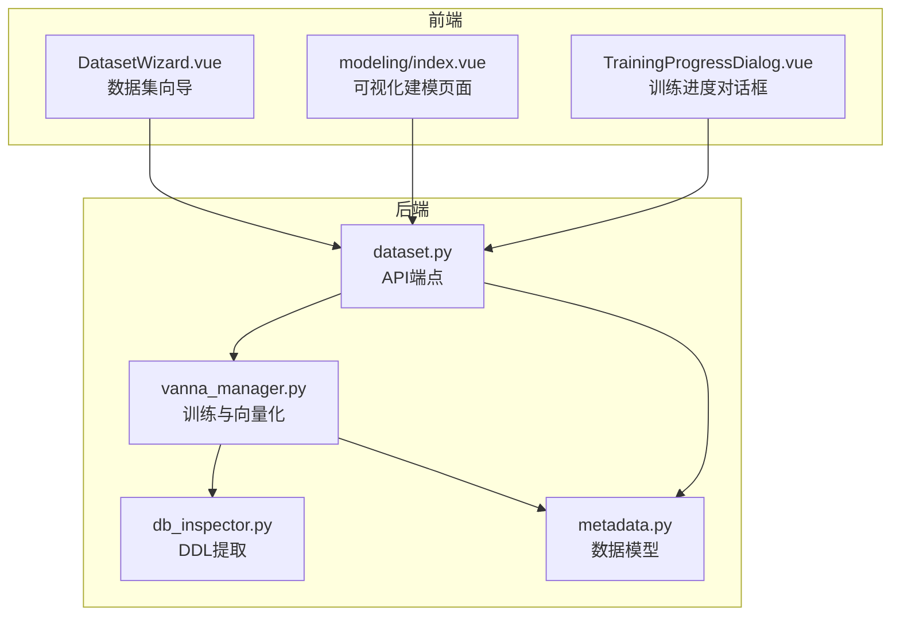
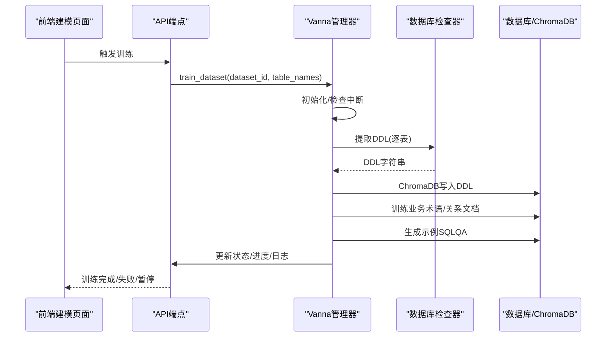
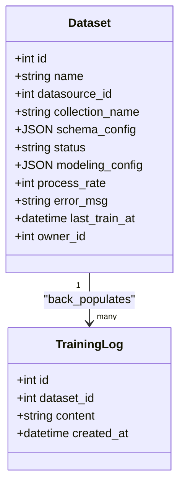
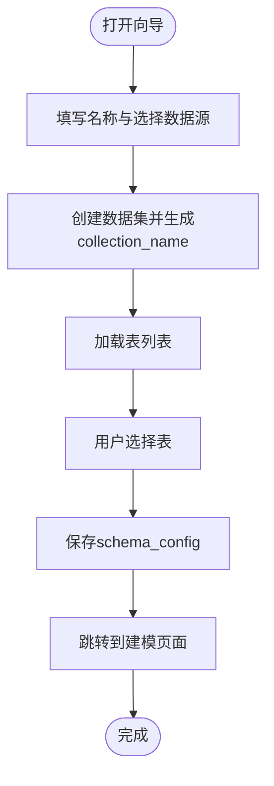
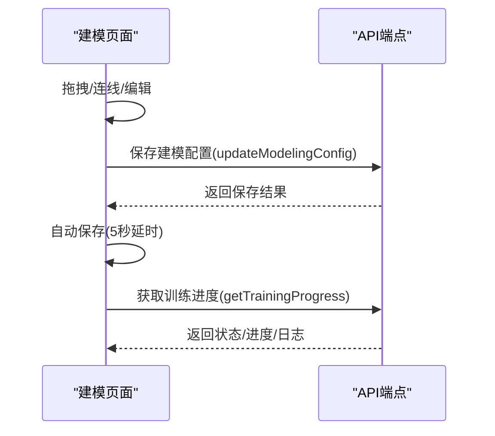
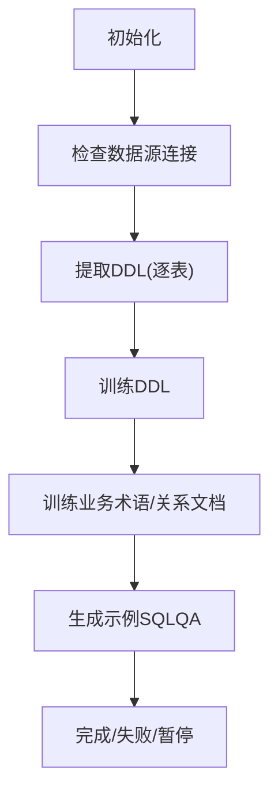
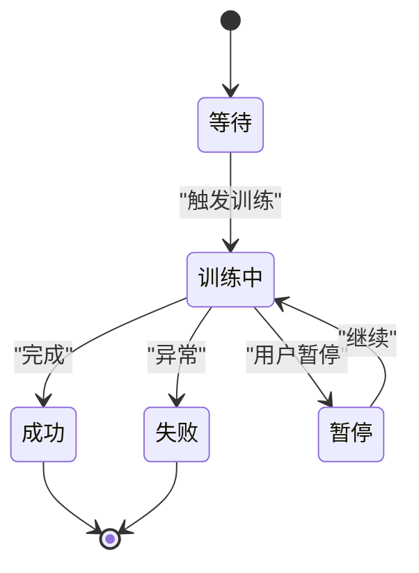
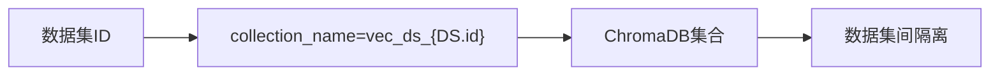
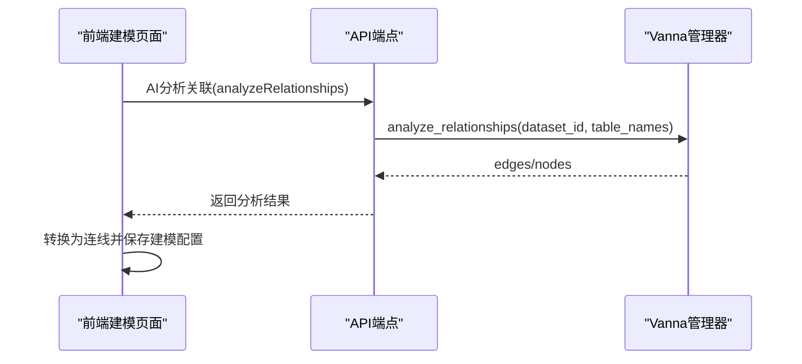
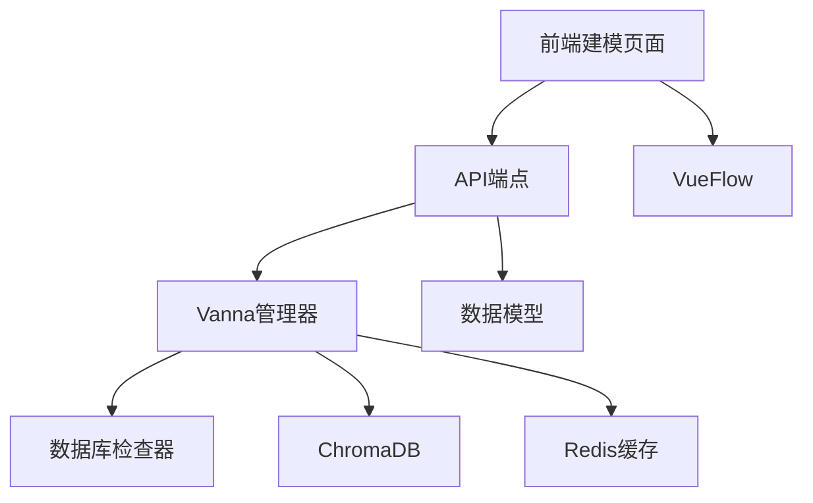

# 数据集建模与训练

<cite>
**本文引用的文件**
- [metadata.py](file://backend/app/models/metadata.py)
- [dataset.py](file://backend/app/schemas/dataset.py)
- [dataset.py](file://backend/app/api/v1/endpoints/dataset.py)
- [vanna_manager.py](file://backend/app/services/vanna_manager.py)
- [db_inspector.py](file://backend/app/services/db_inspector.py)
- [DatasetWizard.vue](file://frontend/src/views/Dataset/components/DatasetWizard.vue)
- [index.vue](file://frontend/src/views/Dataset/modeling/index.vue)
- [TrainingProgressDialog.vue](file://frontend/src/views/Dataset/components/TrainingProgressDialog.vue)
- [003_add_training_status_fields.sql](file://backend/migrations/003_add_training_status_fields.sql)
- [TRAINING_CONTROL_GUIDE.md](file://backend/TRAINING_CONTROL_GUIDE.md)
</cite>

## 目录
1. [简介](#简介)
2. [项目结构](#项目结构)
3. [核心组件](#核心组件)
4. [架构总览](#架构总览)
5. [详细组件分析](#详细组件分析)
6. [依赖关系分析](#依赖关系分析)
7. [性能考量](#性能考量)
8. [故障排查指南](#故障排查指南)
9. [结论](#结论)

## 简介
本文深入阐述数据集建模与训练机制，涵盖数据集创建、表选择、可视化建模以及 Vanna AI 模型训练流程。重点说明 Dataset 模型中的 schema_config 字段如何记录所选表结构，以及 modeling_config 如何存储前端画布的节点与边关系；解释 DatasetWizard 组件如何引导用户完成建模交互；并详述后端如何通过 vanna_manager.py 触发 DDL 提取与向量化训练。最后分析训练状态机（pending/training/completed/failed/paused）的实现及 process_rate 字段如何反映进度，结合代码说明如何通过 collection_name 实现向量数据库的隔离存储。

## 项目结构
后端采用 FastAPI + SQLAlchemy 架构，前端使用 Vue3 + Element Plus + VueFlow。数据模型位于 models/metadata.py，API 端点位于 api/v1/endpoints/dataset.py，训练与向量化逻辑位于 services/vanna_manager.py，数据库元数据提取位于 services/db_inspector.py。前端建模页面位于 frontend/src/views/Dataset/modeling/index.vue，向导组件位于 frontend/src/views/Dataset/components/DatasetWizard.vue。

**图表来源**
- [DatasetWizard.vue](file://frontend/src/views/Dataset/components/DatasetWizard.vue#L1-L218)
- [index.vue](file://frontend/src/views/Dataset/modeling/index.vue#L1-L1701)
- [TrainingProgressDialog.vue](file://frontend/src/views/Dataset/components/TrainingProgressDialog.vue#L179-L226)
- [dataset.py](file://backend/app/api/v1/endpoints/dataset.py#L1-L868)
- [vanna_manager.py](file://backend/app/services/vanna_manager.py#L1-L1200)
- [db_inspector.py](file://backend/app/services/db_inspector.py#L1-L152)
- [metadata.py](file://backend/app/models/metadata.py#L35-L54)

**章节来源**
- [metadata.py](file://backend/app/models/metadata.py#L35-L54)
- [dataset.py](file://backend/app/api/v1/endpoints/dataset.py#L1-L868)
- [vanna_manager.py](file://backend/app/services/vanna_manager.py#L1-L1200)
- [db_inspector.py](file://backend/app/services/db_inspector.py#L1-L152)
- [DatasetWizard.vue](file://frontend/src/views/Dataset/components/DatasetWizard.vue#L1-L218)
- [index.vue](file://frontend/src/views/Dataset/modeling/index.vue#L1-L1701)
- [TrainingProgressDialog.vue](file://frontend/src/views/Dataset/components/TrainingProgressDialog.vue#L179-L226)

## 核心组件
- 数据集模型（Dataset）：包含 schema_config（所选表列表）、modeling_config（画布节点与边）、status（训练状态）、process_rate（训练进度百分比）、error_msg（错误信息）、last_train_at（最近训练时间）等字段。
- API 端点：提供数据集 CRUD、表选择更新、训练触发、关系分析、视图创建、训练进度查询、日志查询、暂停训练、删除训练数据等接口。
- Vanna 管理器：负责训练流程（DDL、业务术语、关系文档、示例 QA）、向量化内存管理、缓存清理、集合删除、训练数据查询。
- 前端建模页面：提供拖拽表、连线、AI 分析、一键排版、SQL 预览、生成宽表、保存建模配置等功能。
- 数据库检查器：负责构建数据库引擎、提取表 DDL、查询表数据等。

**章节来源**
- [metadata.py](file://backend/app/models/metadata.py#L35-L54)
- [dataset.py](file://backend/app/schemas/dataset.py#L5-L27)
- [dataset.py](file://backend/app/api/v1/endpoints/dataset.py#L1-L868)
- [vanna_manager.py](file://backend/app/services/vanna_manager.py#L101-L834)
- [db_inspector.py](file://backend/app/services/db_inspector.py#L101-L152)
- [index.vue](file://frontend/src/views/Dataset/modeling/index.vue#L1-L1701)

## 架构总览
后端通过 API 端点接收前端请求，调用 Vanna 管理器执行训练流程。训练流程包括：初始化、提取 DDL、训练 DDL、训练业务术语与关系文档、生成示例 SQLQA、更新状态与进度、记录日志。前端通过建模页面与向导组件完成数据集创建、表选择、可视化建模与训练触发，并通过训练进度对话框实时监控训练状态。

**图表来源**
- [dataset.py](file://backend/app/api/v1/endpoints/dataset.py#L19-L27)
- [vanna_manager.py](file://backend/app/services/vanna_manager.py#L343-L763)
- [db_inspector.py](file://backend/app/services/db_inspector.py#L108-L117)

**章节来源**
- [dataset.py](file://backend/app/api/v1/endpoints/dataset.py#L126-L167)
- [vanna_manager.py](file://backend/app/services/vanna_manager.py#L586-L763)

## 详细组件分析

### 数据集模型与字段语义
- schema_config：JSON 数组，记录用户在数据集向导中选择的表名列表，作为训练的输入表集合。
- modeling_config：JSON 对象，存储前端 VueFlow 画布的 nodes/edges 以及 viewport，用于持久化建模状态。
- status：训练状态，枚举值 pending/training/completed/failed/paused。
- process_rate：训练进度百分比（0-100），用于前端进度展示。
- error_msg：训练失败时的错误信息。
- last_train_at：最近一次训练完成的时间。
- collection_name：向量数据库集合名称，格式为 vec_ds_{dataset_id}，用于隔离不同数据集的向量存储。

**图表来源**
- [metadata.py](file://backend/app/models/metadata.py#L35-L54)
- [metadata.py](file://backend/app/models/metadata.py#L70-L79)

**章节来源**
- [metadata.py](file://backend/app/models/metadata.py#L35-L54)
- [dataset.py](file://backend/app/schemas/dataset.py#L5-L27)
- [003_add_training_status_fields.sql](file://backend/migrations/003_add_training_status_fields.sql#L9-L23)

### DatasetWizard 组件：引导用户完成建模
- 步骤一：填写数据集名称与选择数据源，创建数据集并自动生成 collection_name（vec_ds_{id}）。
- 步骤二：从数据源拉取表列表，用户通过 Transfer 组件选择表，保存到 schema_config。
- 完成后跳转至可视化建模页面，自动加载之前保存的建模配置（modeling_config）。

**图表来源**
- [DatasetWizard.vue](file://frontend/src/views/Dataset/components/DatasetWizard.vue#L15-L71)
- [DatasetWizard.vue](file://frontend/src/views/Dataset/components/DatasetWizard.vue#L191-L210)

**章节来源**
- [DatasetWizard.vue](file://frontend/src/views/Dataset/components/DatasetWizard.vue#L1-L218)
- [dataset.py](file://backend/app/api/v1/endpoints/dataset.py#L29-L62)

### 可视化建模页面：节点与边的持久化
- 前端使用 VueFlow 管理 nodes/edges，支持拖拽、连线、删除节点/连线、编辑关联字段、自动布局、AI 分析关联、SQL 预览等。
- 保存建模配置时，使用 toObject() 获取 nodes/edges/viewport，写入 modeling_config。
- 加载建模配置时，若存在则使用 fromObject() 恢复完整状态（包括视口）。

**图表来源**
- [index.vue](file://frontend/src/views/Dataset/modeling/index.vue#L1555-L1614)
- [index.vue](file://frontend/src/views/Dataset/modeling/index.vue#L1648-L1668)
- [dataset.py](file://backend/app/api/v1/endpoints/dataset.py#L788-L867)

**章节来源**
- [index.vue](file://frontend/src/views/Dataset/modeling/index.vue#L1-L1701)
- [dataset.py](file://backend/app/api/v1/endpoints/dataset.py#L788-L867)

### 训练流程：DDL 提取与向量化
- 后端通过 run_training_task 启动后台任务，调用 VannaManager.train_dataset。
- 训练流程分为若干阶段：初始化、检查数据库连接、提取 DDL、训练 DDL、训练业务术语与关系文档、生成示例 SQLQA、更新状态与进度、记录日志。
- 每个阶段通过_checkpoint_and_check_interrupt 更新 process_rate、记录 TrainingLog，并检查是否被暂停。

**图表来源**
- [vanna_manager.py](file://backend/app/services/vanna_manager.py#L586-L763)
- [vanna_manager.py](file://backend/app/services/vanna_manager.py#L366-L401)

**章节来源**
- [dataset.py](file://backend/app/api/v1/endpoints/dataset.py#L19-L27)
- [vanna_manager.py](file://backend/app/services/vanna_manager.py#L343-L763)

### 训练状态机与进度控制
- 状态机：pending → training → completed/failed/paused。
- 进度：process_rate 从 0 逐步增加到 100，前端通过轮询 get_training_progress 获取最新状态与进度。
- 中断：当状态为 paused 时，训练在检查点抛出 TrainingStoppedException，记录中断日志并保持 paused 状态。
- 错误：训练失败时设置 failed 并记录 error_msg。

**图表来源**
- [vanna_manager.py](file://backend/app/services/vanna_manager.py#L366-L401)
- [dataset.py](file://backend/app/api/v1/endpoints/dataset.py#L694-L720)
- [TRAINING_CONTROL_GUIDE.md](file://backend/TRAINING_CONTROL_GUIDE.md#L194-L256)

**章节来源**
- [vanna_manager.py](file://backend/app/services/vanna_manager.py#L366-L401)
- [dataset.py](file://backend/app/api/v1/endpoints/dataset.py#L694-L720)
- [TRAINING_CONTROL_GUIDE.md](file://backend/TRAINING_CONTROL_GUIDE.md#L194-L256)

### 向量数据库隔离：collection_name 的作用
- collection_name 采用统一格式 vec_ds_{dataset_id}，确保每个数据集拥有独立的向量集合。
- Vanna 管理器在创建实例、删除集合、查询训练数据时均使用该名称，实现物理隔离，防止不同数据集间的 AI 幻觉与数据污染。
- 删除集合时，同时清理缓存，确保彻底释放资源。

**图表来源**
- [vanna_manager.py](file://backend/app/services/vanna_manager.py#L228-L228)
- [vanna_manager.py](file://backend/app/services/vanna_manager.py#L414-L447)
- [vanna_manager.py](file://backend/app/services/vanna_manager.py#L480-L501)

**章节来源**
- [vanna_manager.py](file://backend/app/services/vanna_manager.py#L228-L228)
- [vanna_manager.py](file://backend/app/services/vanna_manager.py#L414-L447)
- [vanna_manager.py](file://backend/app/services/vanna_manager.py#L480-L501)

### 关系训练与 AI 分析
- 前端建模页面支持 AI 自动分析关联，后端调用 analyze_relationships，返回 edges/nodes，前端将其转换为画布连线。
- 前端也可将建模配置中的 edges 解析为自然语言的关系描述，调用 train_relationships 训练到 Vanna。

**图表来源**
- [dataset.py](file://backend/app/api/v1/endpoints/dataset.py#L278-L330)
- [index.vue](file://frontend/src/views/Dataset/modeling/index.vue#L1029-L1153)

**章节来源**
- [dataset.py](file://backend/app/api/v1/endpoints/dataset.py#L278-L330)
- [index.vue](file://frontend/src/views/Dataset/modeling/index.vue#L1029-L1153)

## 依赖关系分析
- API 端点依赖 Vanna 管理器进行训练，依赖数据库检查器进行 DDL 提取。
- Vanna 管理器依赖 ChromaDB 向量库与 Redis 缓存，依赖数据库模型进行状态与日志管理。
- 前端建模页面依赖 VueFlow 进行可视化建模，依赖 API 端点进行数据交互。

**图表来源**
- [dataset.py](file://backend/app/api/v1/endpoints/dataset.py#L1-L868)
- [vanna_manager.py](file://backend/app/services/vanna_manager.py#L1-L1200)
- [db_inspector.py](file://backend/app/services/db_inspector.py#L1-L152)
- [index.vue](file://frontend/src/views/Dataset/modeling/index.vue#L1-L1701)

**章节来源**
- [dataset.py](file://backend/app/api/v1/endpoints/dataset.py#L1-L868)
- [vanna_manager.py](file://backend/app/services/vanna_manager.py#L1-L1200)
- [db_inspector.py](file://backend/app/services/db_inspector.py#L1-L152)
- [index.vue](file://frontend/src/views/Dataset/modeling/index.vue#L1-L1701)

## 性能考量
- Redis 缓存：SQL 缓存与结果缓存并存，SQL 缓存 TTL 更长（7 天），结果缓存 TTL 较短（5 分钟），显著降低重复查询成本。
- 限流与安全：SQL 自动生成时自动添加 LIMIT 1000，避免大数据量查询导致超时。
- 自动化：AI 分析、自动排版、自动保存等减少人工干预，提升效率。
- 隔离存储：通过 collection_name 实现向量数据库隔离，避免跨数据集干扰。

[本节为通用指导，无需特定文件引用]

## 故障排查指南
- 训练被暂停：检查 dataset.status 是否为 paused，确认是否在检查点被中断。
- 训练失败：查看 error_msg 与最新 TrainingLog，定位具体失败环节。
- 集合删除失败：确认 collection_name 是否存在，检查 ChromaDB 客户端连接与权限。
- 进度不更新：确认 get_training_progress 接口可用，检查轮询频率与网络状况。
- 前端建模配置丢失：确认 modeling_config 是否正确保存与恢复，检查 toObject/fromObject 的兼容性。

**章节来源**
- [vanna_manager.py](file://backend/app/services/vanna_manager.py#L366-L401)
- [dataset.py](file://backend/app/api/v1/endpoints/dataset.py#L602-L630)
- [TRAINING_CONTROL_GUIDE.md](file://backend/TRAINING_CONTROL_GUIDE.md#L194-L256)

## 结论
本系统通过清晰的数据模型设计（schema_config/modeling_config/status/process_rate/collection_name）与完善的 API 端点，实现了从数据集创建、表选择、可视化建模到 Vanna AI 训练的全链路流程。训练状态机与检查点机制保证了训练过程的可控性与可观测性，Redis 缓存与向量数据库隔离提升了性能与安全性。前端通过直观的可视化建模界面与训练进度对话框，为用户提供了良好的交互体验。