# 业务术语管理

<cite>
**本文档引用的文件**
- [metadata.py](file://backend/app/models/metadata.py)
- [dataset.py](file://backend/app/schemas/dataset.py)
- [BusinessTermManager.vue](file://frontend/src/views/Dataset/components/BusinessTermManager.vue)
- [dataset.py](file://backend/app/api/v1/endpoints/dataset.py)
- [training_data_service.py](file://backend/app/services/vanna/training_data_service.py)
- [training_service.py](file://backend/app/services/vanna/training_service.py)
- [dataset.ts](file://frontend/src/api/dataset.ts)
- [deps.py](file://backend/app/api/deps.py)
- [facade.py](file://backend/app/services/vanna/facade.py)
</cite>

## 目录
1. [简介](#简介)
2. [项目结构](#项目结构)
3. [核心组件](#核心组件)
4. [架构概览](#架构概览)
5. [详细组件分析](#详细组件分析)
6. [依赖关系分析](#依赖关系分析)
7. [性能考虑](#性能考虑)
8. [故障排除指南](#故障排除指南)
9. [结论](#结论)

## 简介

业务术语管理是Universal BI平台中的核心功能模块，负责管理和维护数据集相关的业务术语知识库。该系统通过将业务术语注入到AI训练向量库中，帮助AI系统更好地理解和解释业务概念，从而生成更准确的SQL查询和数据分析结果。

系统采用前后端分离架构，前端使用Vue.js框架，后端使用FastAPI，通过RESTful API进行通信。业务术语管理功能包括术语的增删改查、与AI系统的集成训练、以及权限控制等核心特性。

## 项目结构

业务术语管理功能分布在以下主要模块中：

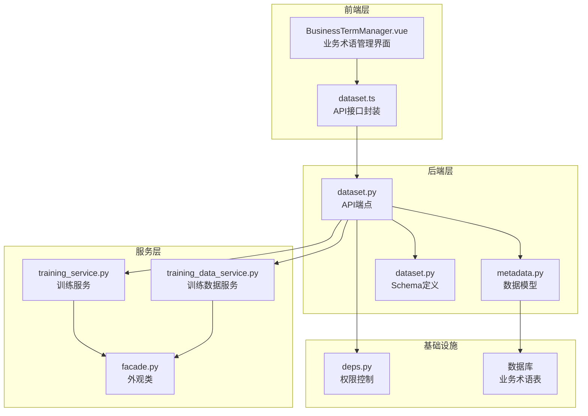

**图表来源**
- [BusinessTermManager.vue](file://frontend/src/views/Dataset/components/BusinessTermManager.vue#L1-L389)
- [dataset.py](file://backend/app/api/v1/endpoints/dataset.py#L1-L1226)
- [metadata.py](file://backend/app/models/metadata.py#L100-L112)

**章节来源**
- [BusinessTermManager.vue](file://frontend/src/views/Dataset/components/BusinessTermManager.vue#L1-L389)
- [dataset.py](file://backend/app/api/v1/endpoints/dataset.py#L1-L1226)
- [metadata.py](file://backend/app/models/metadata.py#L100-L112)

## 核心组件

### 数据模型设计

业务术语管理的核心数据模型基于SQLAlchemy ORM实现，包含以下关键实体：

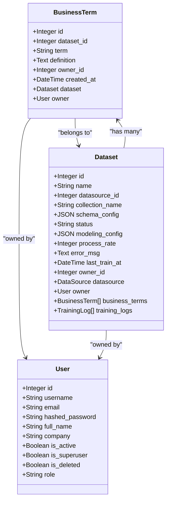

**图表来源**
- [metadata.py](file://backend/app/models/metadata.py#L37-L112)

### 前端界面组件

前端业务术语管理界面采用Element Plus组件库构建，提供直观的用户交互体验：

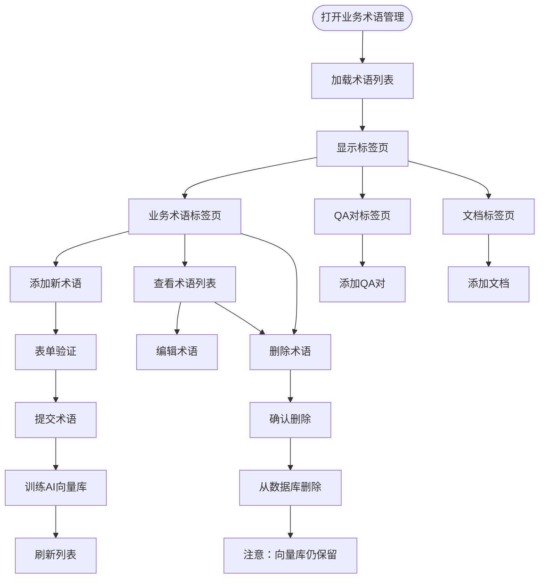

**图表来源**
- [BusinessTermManager.vue](file://frontend/src/views/Dataset/components/BusinessTermManager.vue#L1-L389)

**章节来源**
- [metadata.py](file://backend/app/models/metadata.py#L100-L112)
- [BusinessTermManager.vue](file://frontend/src/views/Dataset/components/BusinessTermManager.vue#L1-L389)

## 架构概览

业务术语管理采用分层架构设计，确保功能模块的清晰分离和良好的可维护性：

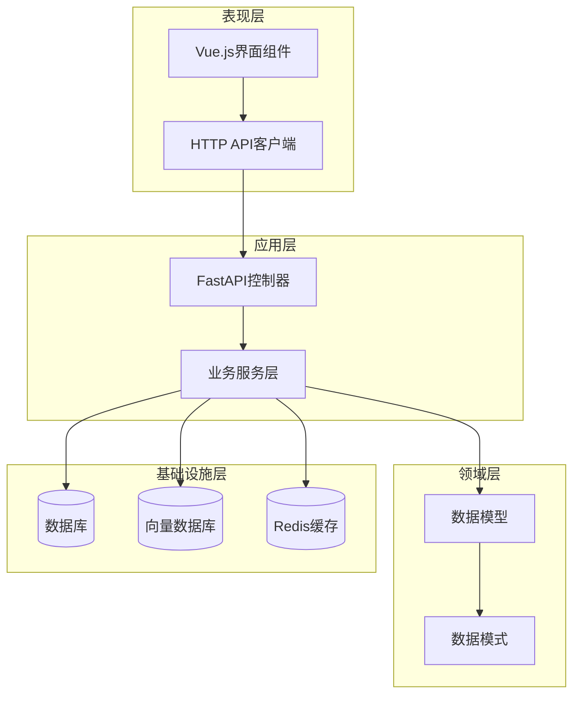

**图表来源**
- [dataset.py](file://backend/app/api/v1/endpoints/dataset.py#L1-L1226)
- [training_service.py](file://backend/app/services/vanna/training_service.py#L1-L392)

系统的核心工作流程如下：

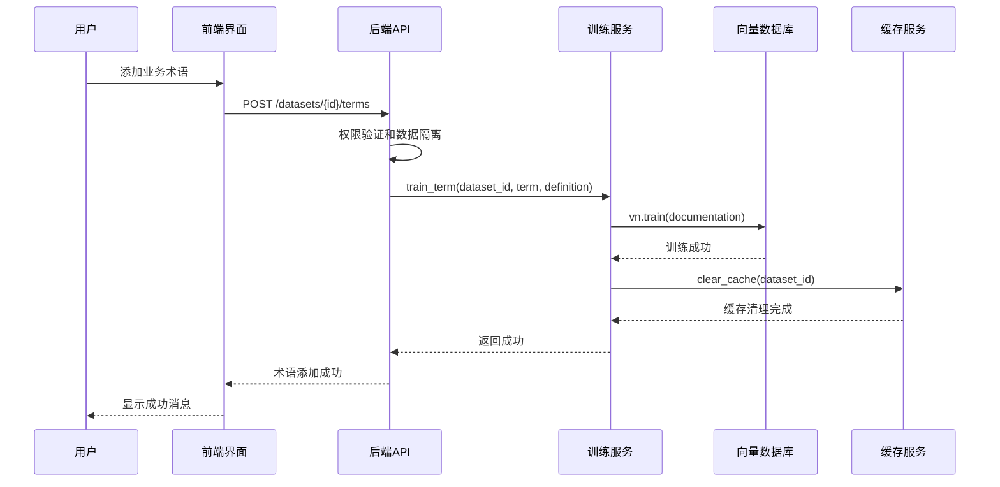

**图表来源**
- [dataset.py](file://backend/app/api/v1/endpoints/dataset.py#L178-L226)
- [training_service.py](file://backend/app/services/vanna/training_service.py#L282-L299)

**章节来源**
- [dataset.py](file://backend/app/api/v1/endpoints/dataset.py#L1-L1226)
- [training_service.py](file://backend/app/services/vanna/training_service.py#L1-L392)

## 详细组件分析

### 后端API端点

后端提供了完整的业务术语管理API端点，包括增删查改等核心功能：

#### 术语添加端点

术语添加功能实现了完整的业务逻辑，包括数据验证、权限控制和AI训练：

```mermaid
flowchart TD
AddTerm[POST /datasets/{id}/terms] --> ValidateDataset[验证数据集存在性]
ValidateDataset --> CheckOwnership[检查所有权]
CheckOwnership --> CheckPublicResource{公共资源?}
CheckPublicResource --> |是| CheckSuperuser{超级管理员?}
CheckPublicResource --> |否| CreateTerm[创建术语记录]
CheckSuperuser --> |是| CreateTerm
CheckSuperuser --> |否| Forbidden[403 禁止访问]
CreateTerm --> TrainAI[训练AI向量库]
TrainAI --> TrainSuccess{训练成功?}
TrainSuccess --> |是| ReturnTerm[返回术语信息]
TrainSuccess --> |否| RollbackDB[回滚数据库]
RollbackDB --> Error500[500 内部错误]
```

**图表来源**
- [dataset.py](file://backend/app/api/v1/endpoints/dataset.py#L178-L226)

#### 术语查询端点

术语查询功能支持分页查询和权限控制：

```mermaid
flowchart TD
ListTerms[GET /datasets/{id}/terms] --> ValidateAccess[验证访问权限]
ValidateAccess --> CheckDataset{数据集存在?}
CheckDataset --> |否| NotFound[404 未找到]
CheckDataset --> |是| ApplyFilter[应用权限过滤]
ApplyFilter --> QueryTerms[查询术语列表]
QueryTerms --> ReturnList[返回术语列表]
```

**图表来源**
- [dataset.py](file://backend/app/api/v1/endpoints/dataset.py#L229-L252)

**章节来源**
- [dataset.py](file://backend/app/api/v1/endpoints/dataset.py#L178-L252)

### AI训练服务

业务术语训练服务通过Vanna AI框架实现，将业务术语注入到向量数据库中：

#### 训练流程

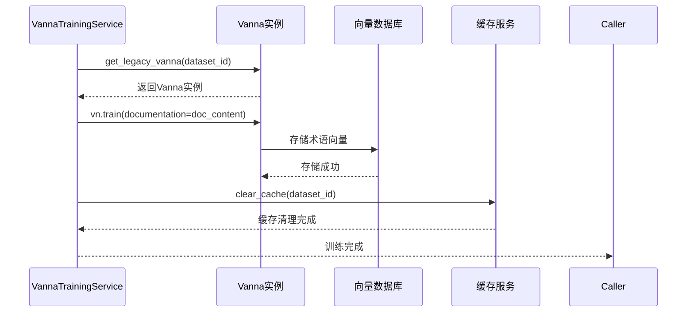

**图表来源**
- [training_service.py](file://backend/app/services/vanna/training_service.py#L282-L299)

#### 异步训练支持

系统支持异步训练，提高并发处理能力：

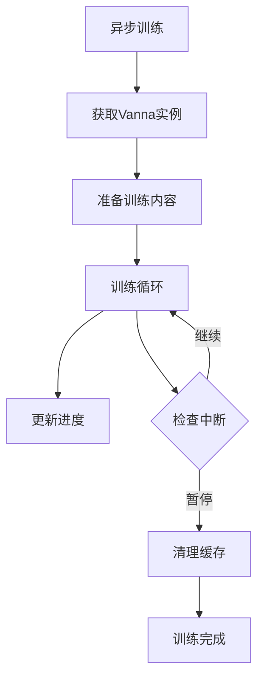

**图表来源**
- [training_service.py](file://backend/app/services/vanna/training_service.py#L261-L279)

**章节来源**
- [training_service.py](file://backend/app/services/vanna/training_service.py#L1-L392)

### 权限控制机制

系统实现了严格的权限控制机制，确保数据安全和访问隔离：

#### 数据所有权过滤

```mermaid
flowchart TD
ApplyFilter[apply_ownership_filter] --> IsSuperuser{是否超级管理员?}
IsSuperuser --> |是| ReturnOriginal[返回原始查询]
IsSuperuser --> |否| AddFilter[添加权限过滤条件]
AddFilter --> FilterCondition[OR(owner_id == user.id OR owner_id IS NULL)]
FilterCondition --> ReturnFiltered[返回过滤后的查询]
```

**图表来源**
- [deps.py](file://backend/app/api/deps.py#L97-L124)

#### 公共资源访问控制

系统支持公共资源的概念，允许超级管理员访问和管理公共资源：

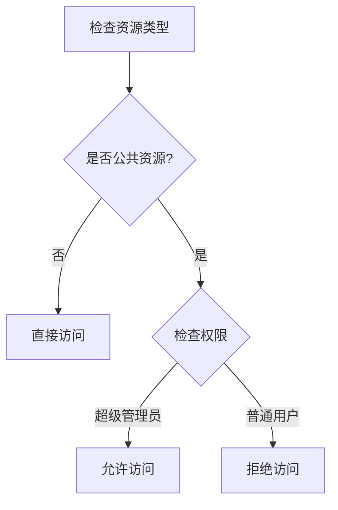

**图表来源**
- [dataset.py](file://backend/app/api/v1/endpoints/dataset.py#L197-L199)

**章节来源**
- [deps.py](file://backend/app/api/deps.py#L97-L124)
- [dataset.py](file://backend/app/api/v1/endpoints/dataset.py#L178-L282)

### 前端交互组件

前端业务术语管理组件提供了丰富的用户交互功能：

#### 表单验证机制

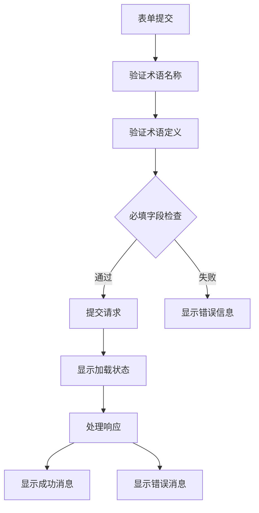

**图表来源**
- [BusinessTermManager.vue](file://frontend/src/views/Dataset/components/BusinessTermManager.vue#L205-L208)

#### 实时状态管理

前端组件使用Vue.js的响应式系统管理状态：

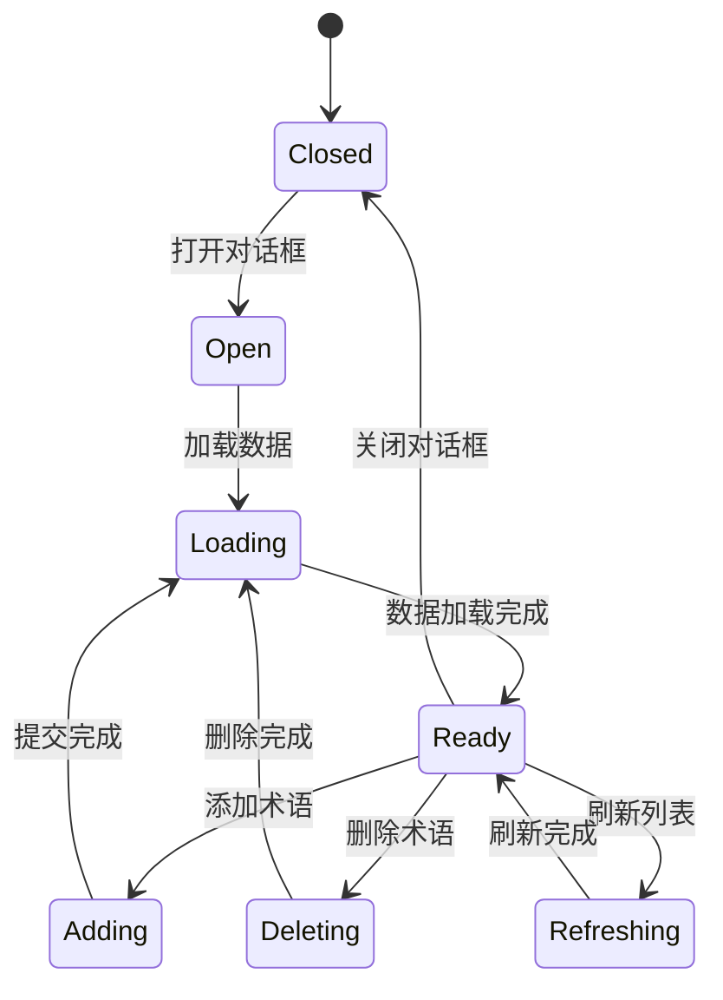

**图表来源**
- [BusinessTermManager.vue](file://frontend/src/views/Dataset/components/BusinessTermManager.vue#L248-L257)

**章节来源**
- [BusinessTermManager.vue](file://frontend/src/views/Dataset/components/BusinessTermManager.vue#L1-L389)

## 依赖关系分析

业务术语管理功能涉及多个层次的依赖关系：

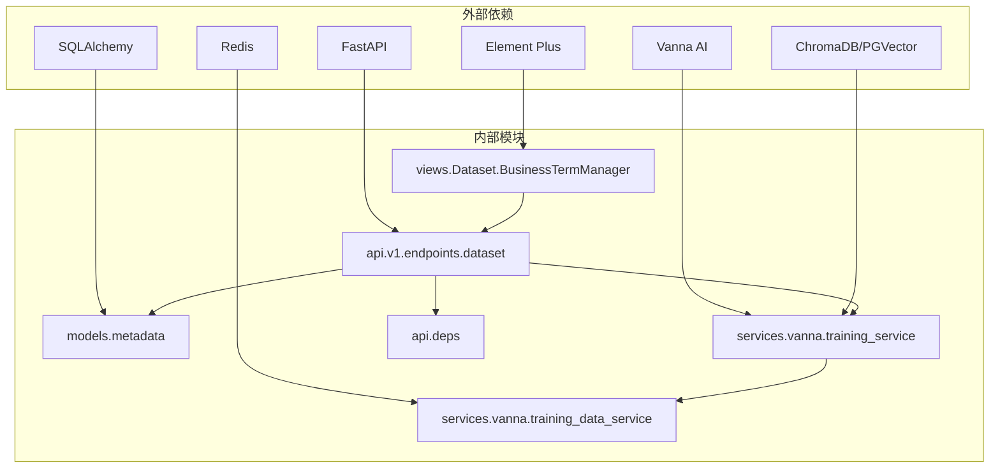

**图表来源**
- [dataset.py](file://backend/app/api/v1/endpoints/dataset.py#L1-L24)
- [metadata.py](file://backend/app/models/metadata.py#L1-L131)

### 核心依赖链

系统的关键依赖关系如下：

1. **API层依赖**：API端点依赖于数据模型、权限控制和训练服务
2. **服务层依赖**：训练服务依赖于Vanna实例管理和缓存服务
3. **前端依赖**：Vue组件依赖于API封装和Element Plus组件库
4. **数据库依赖**：所有服务都依赖于数据库连接和事务管理

**章节来源**
- [dataset.py](file://backend/app/api/v1/endpoints/dataset.py#L1-L1226)
- [training_service.py](file://backend/app/services/vanna/training_service.py#L1-L392)
- [BusinessTermManager.vue](file://frontend/src/views/Dataset/components/BusinessTermManager.vue#L1-L389)

## 性能考虑

业务术语管理功能在设计时充分考虑了性能优化：

### 缓存策略

系统采用了多层缓存策略来提升性能：

1. **Redis缓存**：用于存储AI查询结果和训练状态
2. **向量数据库缓存**：存储业务术语的向量表示
3. **API响应缓存**：减少重复查询的响应时间

### 异步处理

为了提升用户体验，系统大量采用异步处理机制：

- **后台训练任务**：术语训练在后台异步执行
- **批量操作**：支持批量添加和删除术语
- **流式响应**：训练进度实时更新

### 数据库优化

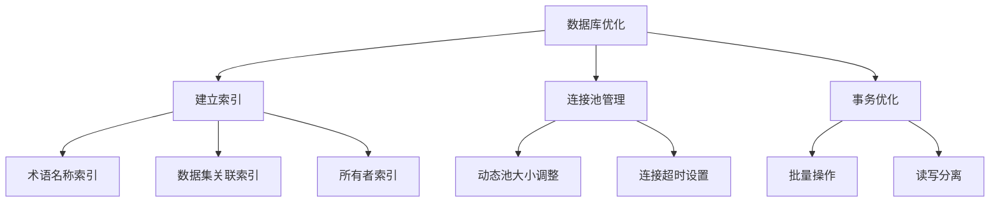

## 故障排除指南

### 常见问题及解决方案

#### 术语添加失败

**问题症状**：添加业务术语时返回500错误

**可能原因**：
1. AI训练服务不可用
2. 数据库连接异常
3. 权限不足

**解决步骤**：
1. 检查AI服务状态
2. 验证数据库连接
3. 确认用户权限
4. 查看服务器日志

#### 术语查询为空

**问题症状**：查询业务术语返回空列表

**可能原因**：
1. 数据集权限限制
2. 术语尚未训练
3. 公共资源访问限制

**解决步骤**：
1. 检查数据集所有权
2. 验证术语训练状态
3. 确认访问权限设置

#### 训练进度异常

**问题症状**：训练进度停滞或异常

**可能原因**：
1. 训练被意外中断
2. 缓存清理失败
3. 向量数据库连接问题

**解决步骤**：
1. 检查训练日志
2. 清理缓存
3. 重启AI服务

**章节来源**
- [dataset.py](file://backend/app/api/v1/endpoints/dataset.py#L213-L224)
- [training_service.py](file://backend/app/services/vanna/training_service.py#L231-L258)

## 结论

业务术语管理功能是Universal BI平台的重要组成部分，通过将业务概念注入到AI系统中，显著提升了系统的智能化水平和用户体验。该功能具有以下特点：

### 技术优势

1. **模块化设计**：采用分层架构，职责清晰，易于维护
2. **权限控制**：完善的权限体系，确保数据安全
3. **异步处理**：高效的异步训练机制，提升用户体验
4. **缓存优化**：多层缓存策略，保证系统性能

### 功能特色

1. **直观界面**：基于Vue.js的现代化用户界面
2. **实时反馈**：训练进度实时更新
3. **灵活配置**：支持多种训练数据类型
4. **扩展性强**：易于添加新的训练内容类型

### 发展方向

未来可以在以下方面进一步改进：

1. **智能推荐**：基于业务上下文智能推荐术语
2. **版本管理**：支持业务术语的版本控制
3. **批量操作**：增强批量导入导出功能
4. **审计日志**：完善操作审计和追踪功能

该业务术语管理系统为整个平台的智能化提供了坚实的基础，是实现企业级数据分析和AI辅助决策的重要工具。