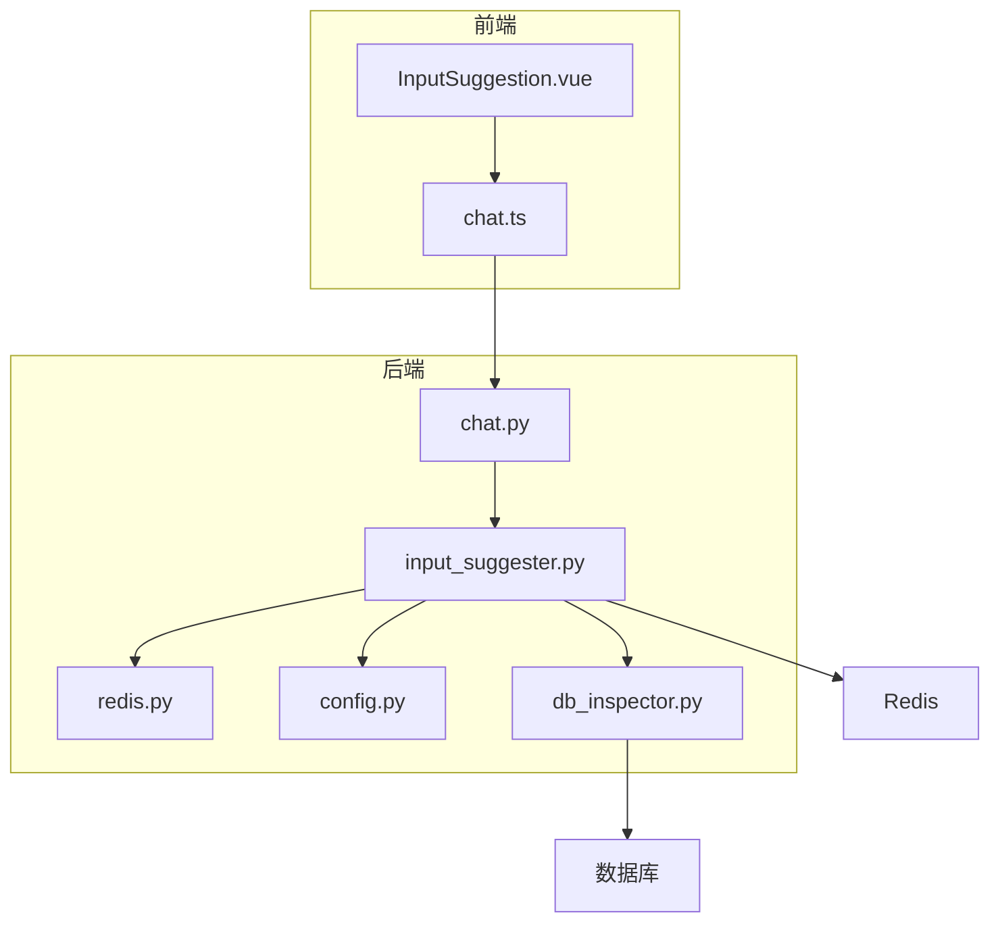
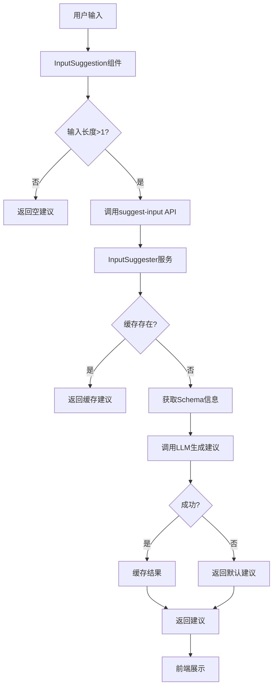
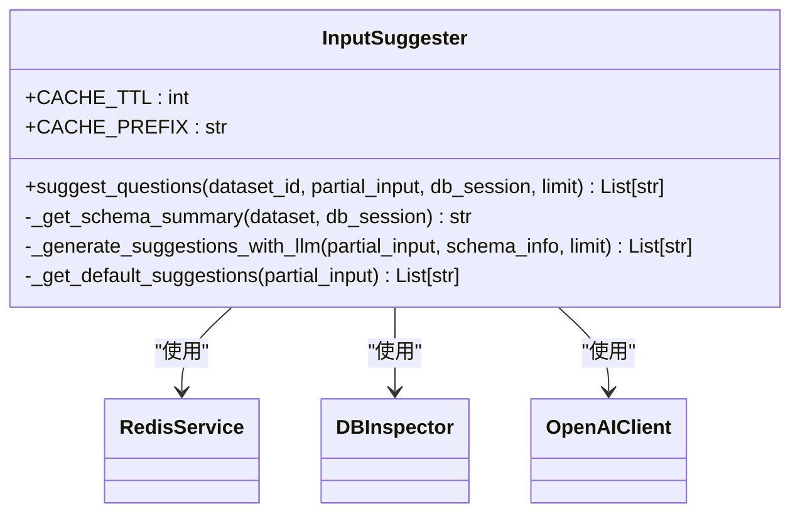
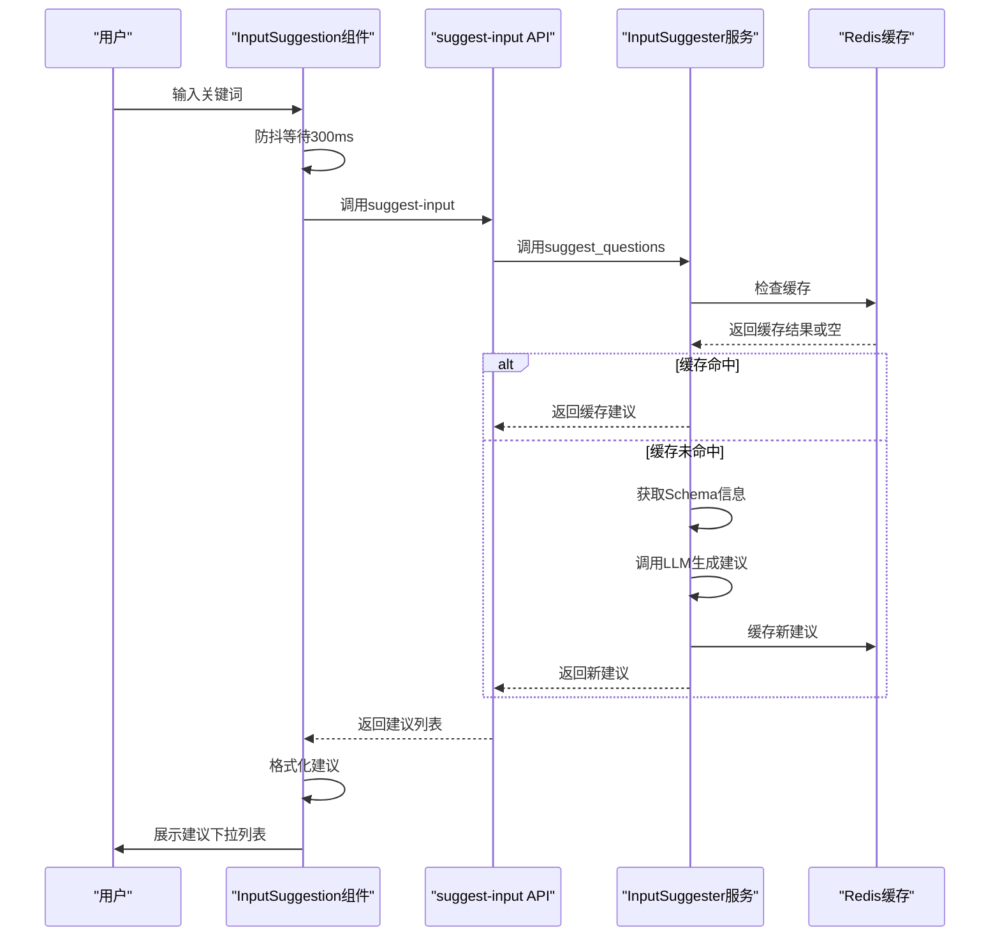
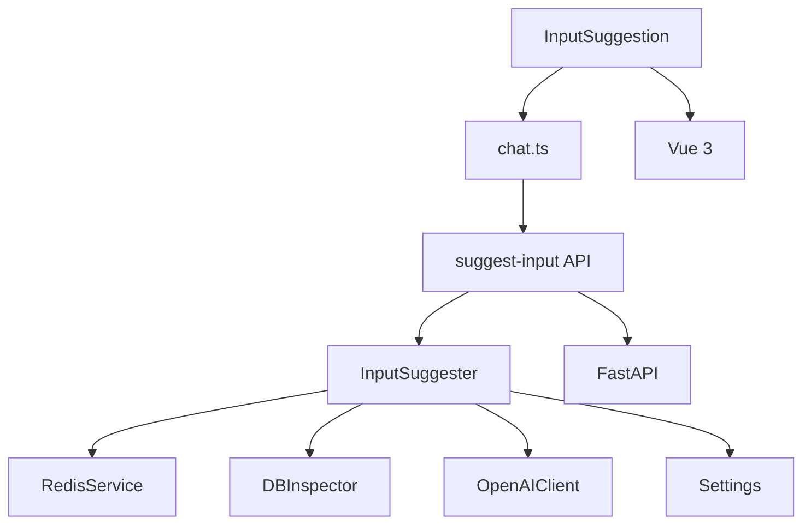

# 智能输入建议

<cite>
**本文档引用的文件**   
- [input_suggester.py](file://backend/app/services/input_suggester.py)
- [InputSuggestion.vue](file://frontend/src/components/InputSuggestion.vue)
- [chat.py](file://backend/app/api/v1/endpoints/chat.py)
- [chat.ts](file://frontend/src/api/chat.ts)
- [config.py](file://backend/app/core/config.py)
- [redis.py](file://backend/app/core/redis.py)
- [db_inspector.py](file://backend/app/services/db_inspector.py)
- [chat.py](file://backend/app/main.py)
</cite>

## 目录
1. [简介](#简介)
2. [项目结构](#项目结构)
3. [核心组件](#核心组件)
4. [架构概述](#架构概述)
5. [详细组件分析](#详细组件分析)
6. [依赖分析](#依赖分析)
7. [性能考虑](#性能考虑)
8. [故障排除指南](#故障排除指南)
9. [结论](#结论)

## 简介
智能输入建议系统是Universal BI平台的核心功能之一，旨在通过AI技术为用户提供实时的问题联想服务。该系统结合了大型语言模型（LLM）和缓存机制，能够根据用户输入的关键词和当前数据集的结构，智能生成相关的数据分析问题建议。系统采用前后端分离架构，前端通过Vue 3和Element Plus实现用户界面，后端基于FastAPI框架提供RESTful API服务。整个系统设计注重用户体验和性能优化，通过Redis缓存减少重复计算，确保建议生成的实时性和响应速度。

## 项目结构
智能输入建议功能分布在前后端多个目录中，形成了清晰的分层架构。后端服务主要位于`backend/app/services/`目录下的`input_suggester.py`文件中，负责核心的建议生成逻辑。该服务通过`backend/app/api/v1/endpoints/chat.py`中的API端点暴露给前端。前端组件则位于`frontend/src/components/`目录下的`InputSuggestion.vue`文件中，负责用户界面的展示和交互。API通信通过`frontend/src/api/chat.ts`进行封装，确保前后端的数据交互一致性。系统还依赖于Redis缓存服务（`backend/app/core/redis.py`）来提高性能，并通过`backend/app/core/config.py`进行统一的配置管理。

**图源**
- [InputSuggestion.vue](file://frontend/src/components/InputSuggestion.vue)
- [chat.ts](file://frontend/src/api/chat.ts)
- [input_suggester.py](file://backend/app/services/input_suggester.py)
- [chat.py](file://backend/app/api/v1/endpoints/chat.py)
- [redis.py](file://backend/app/core/redis.py)
- [config.py](file://backend/app/core/config.py)
- [db_inspector.py](file://backend/app/services/db_inspector.py)

**节源**
- [input_suggester.py](file://backend/app/services/input_suggester.py)
- [InputSuggestion.vue](file://frontend/src/components/InputSuggestion.vue)
- [chat.py](file://backend/app/api/v1/endpoints/chat.py)

## 核心组件

智能输入建议系统的核心组件包括前端的`InputSuggestion`组件和后端的`InputSuggester`服务。`InputSuggestion`组件负责监听用户输入，调用API获取建议，并在界面上展示下拉列表。`InputSuggester`服务则负责复杂的建议生成逻辑，包括从数据库获取schema信息、调用LLM生成建议以及缓存管理。系统通过`suggest-input` API端点连接前后端，确保数据的正确传输。整个流程设计考虑了错误处理和降级策略，当LLM服务不可用时，系统会返回基于关键词的默认建议，确保用户体验不受影响。

**节源**
- [input_suggester.py](file://backend/app/services/input_suggester.py#L18-L295)
- [InputSuggestion.vue](file://frontend/src/components/InputSuggestion.vue#L1-L148)

## 架构概述

智能输入建议系统的架构采用典型的分层设计，从前端用户界面到后端服务，再到数据存储，形成了清晰的层次结构。前端通过Vue 3的响应式系统监听用户输入变化，利用防抖技术减少不必要的API调用。后端服务采用面向对象的设计，`InputSuggester`类封装了所有建议生成的逻辑，包括缓存检查、schema信息获取、LLM调用和降级处理。系统与Redis缓存紧密集成，通过5分钟的TTL设置平衡了数据新鲜度和性能。配置管理通过`Settings`类集中处理，确保了环境配置的一致性。整个架构设计注重可维护性和可扩展性，为未来功能的添加提供了良好的基础。

**图源**
- [input_suggester.py](file://backend/app/services/input_suggester.py#L25-L109)
- [InputSuggestion.vue](file://frontend/src/components/InputSuggestion.vue#L39-L67)

## 详细组件分析

### InputSuggester 服务分析
`InputSuggester`服务是智能输入建议系统的核心，采用类方法的设计模式，提供了静态的`suggest_questions`方法作为主要入口。该服务通过Redis缓存机制显著提高了性能，避免了对LLM的重复调用。服务的错误处理机制完善，当任何环节出现异常时，都会返回空列表作为降级方案，确保不会中断主流程。`_get_schema_summary`方法负责从数据库获取表结构信息，为LLM提供上下文。`_generate_suggestions_with_llm`方法则构建了精心设计的提示词（prompt），指导LLM生成高质量的问题建议。

#### 类图

**图源**
- [input_suggester.py](file://backend/app/services/input_suggester.py#L18-L295)
- [redis.py](file://backend/app/core/redis.py)
- [db_inspector.py](file://backend/app/services/db_inspector.py)

### 前端组件分析
前端`InputSuggestion`组件采用Vue 3的组合式API，通过`watch`监听输入值的变化。组件使用`lodash-es`的`debounce`函数实现防抖，避免频繁的API调用。当用户输入变化时，组件会调用`suggestInput` API，获取建议列表并展示在下拉菜单中。点击建议项时，通过`emit`事件将选择的建议传递给父组件。组件的样式设计考虑了暗色模式，通过CSS变量实现了主题的无缝切换。整个组件设计简洁高效，提供了良好的用户体验。

#### 序列图

**图源**
- [InputSuggestion.vue](file://frontend/src/components/InputSuggestion.vue#L39-L67)
- [chat.py](file://backend/app/api/v1/endpoints/chat.py#L661-L724)
- [input_suggester.py](file://backend/app/services/input_suggester.py#L25-L109)

## 依赖分析

智能输入建议系统依赖于多个核心组件和服务。后端服务直接依赖于`RedisService`进行缓存操作，依赖于`DBInspector`获取数据库schema信息，以及`OpenAIClient`调用LLM服务。配置管理通过`Settings`类集中处理，确保了环境配置的一致性。前端组件依赖于`chat.ts`中的API封装，通过HTTP请求与后端通信。系统还依赖于FastAPI框架提供的路由和依赖注入功能，以及Vue 3的响应式系统。这些依赖关系形成了一个稳定的技术栈，为系统的可靠运行提供了保障。

**图源**
- [InputSuggestion.vue](file://frontend/src/components/InputSuggestion.vue)
- [chat.ts](file://frontend/src/api/chat.ts)
- [input_suggester.py](file://backend/app/services/input_suggester.py)
- [redis.py](file://backend/app/core/redis.py)
- [db_inspector.py](file://backend/app/services/db_inspector.py)
- [config.py](file://backend/app/core/config.py)
- [chat.py](file://backend/app/main.py)

**节源**
- [input_suggester.py](file://backend/app/services/input_suggester.py)
- [InputSuggestion.vue](file://frontend/src/components/InputSuggestion.vue)

## 性能考虑
智能输入建议系统在设计时充分考虑了性能优化。通过Redis缓存机制，系统能够将重复的建议生成请求的响应时间从数百毫秒降低到几毫秒。缓存键的设计包含了数据集ID、输入关键词和限制数量，确保了缓存的准确性和有效性。系统采用5分钟的缓存TTL，平衡了数据新鲜度和性能。前端的防抖机制（300ms）减少了不必要的API调用，降低了服务器负载。LLM调用的超时和错误处理机制确保了系统的稳定性，即使在LLM服务不可用时，系统也能通过默认建议提供基本功能。这些性能优化措施共同确保了用户能够获得流畅的输入体验。

## 故障排除指南
当智能输入建议功能出现问题时，可以按照以下步骤进行排查。首先检查Redis服务是否正常运行，因为缓存问题是导致建议生成缓慢的常见原因。其次检查LLM API的配置是否正确，包括`DASHSCOPE_API_KEY`和`QWEN_MODEL`等环境变量。如果建议生成完全失败，查看后端日志中的错误信息，特别是`InputSuggester`类中的异常记录。前端问题通常表现为建议不显示或显示延迟，可以通过浏览器开发者工具检查网络请求和响应。如果问题持续存在，可以尝试清除Redis缓存或重启后端服务。对于配置问题，确保`.env`文件中的配置项正确无误。

**节源**
- [input_suggester.py](file://backend/app/services/input_suggester.py#L100-L109)
- [redis.py](file://backend/app/core/redis.py)

## 结论
智能输入建议系统通过结合大型语言模型和缓存技术，为Universal BI平台提供了强大的问题联想功能。系统架构设计合理，前后端分离清晰，组件职责明确。通过Redis缓存和前端防抖机制，系统在保证实时性的同时实现了良好的性能表现。完善的错误处理和降级策略确保了系统的稳定性，即使在部分服务不可用时也能提供基本功能。未来可以考虑增加更多个性化建议算法，或引入用户行为分析来进一步优化建议质量。总体而言，该系统为用户提供了直观、高效的数据分析辅助，显著提升了平台的易用性和用户体验。