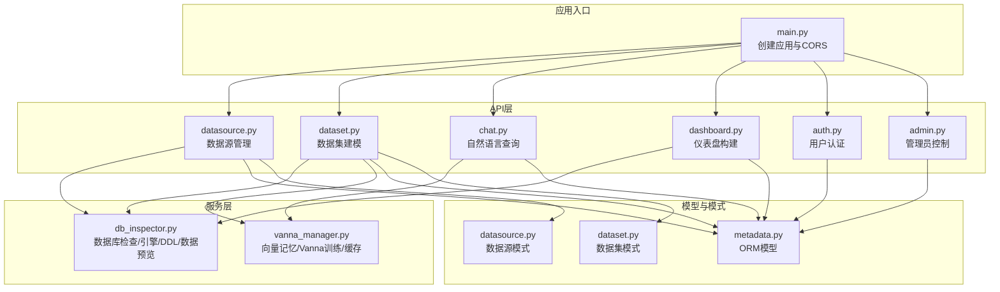
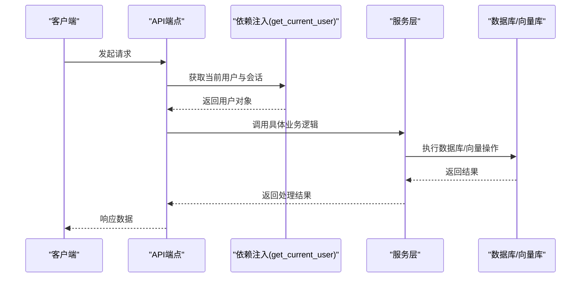
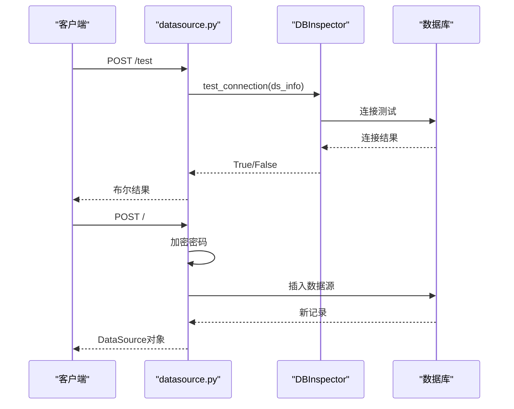
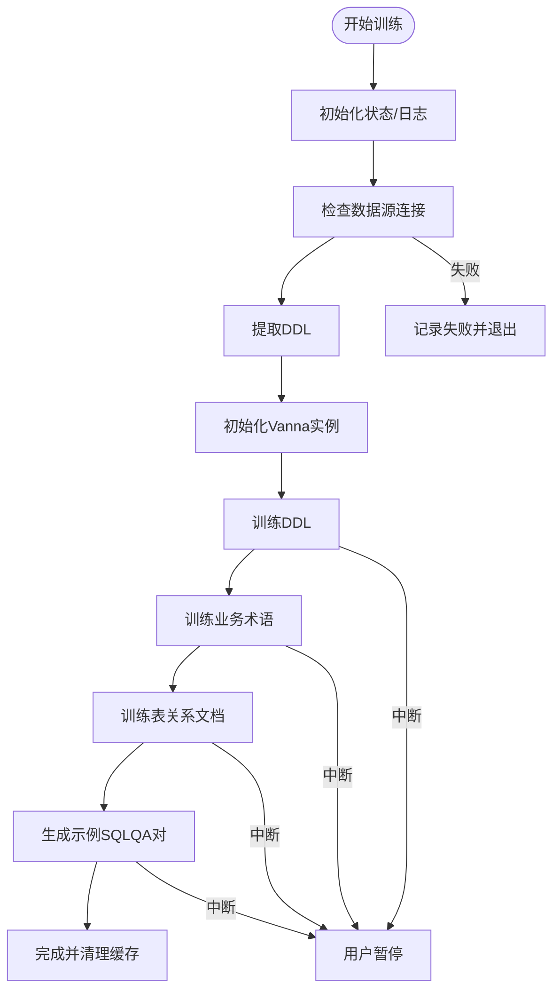
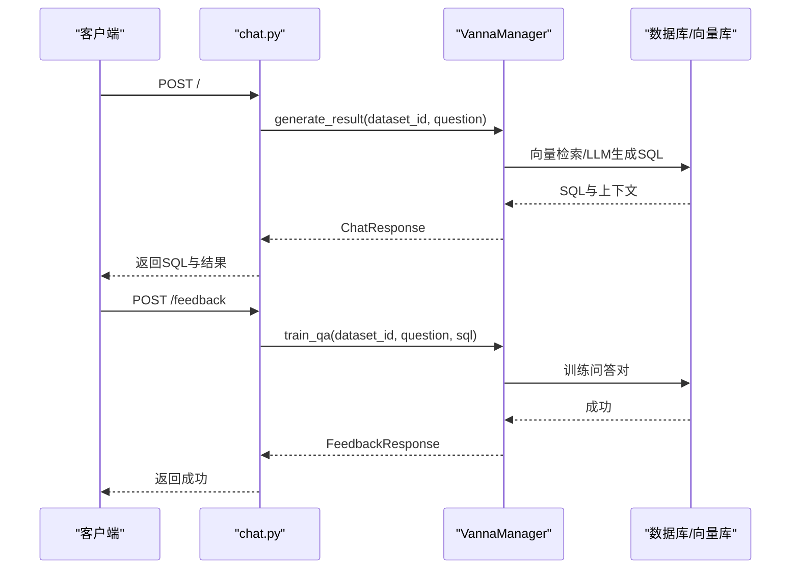
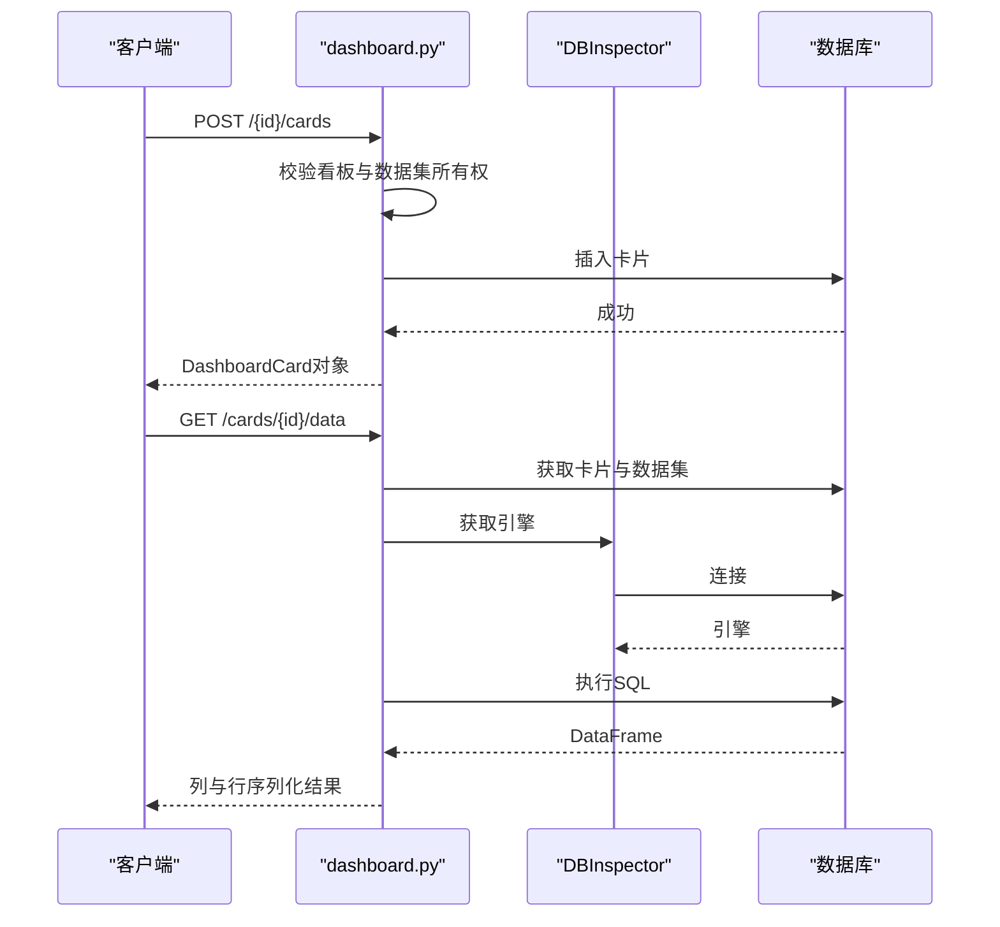
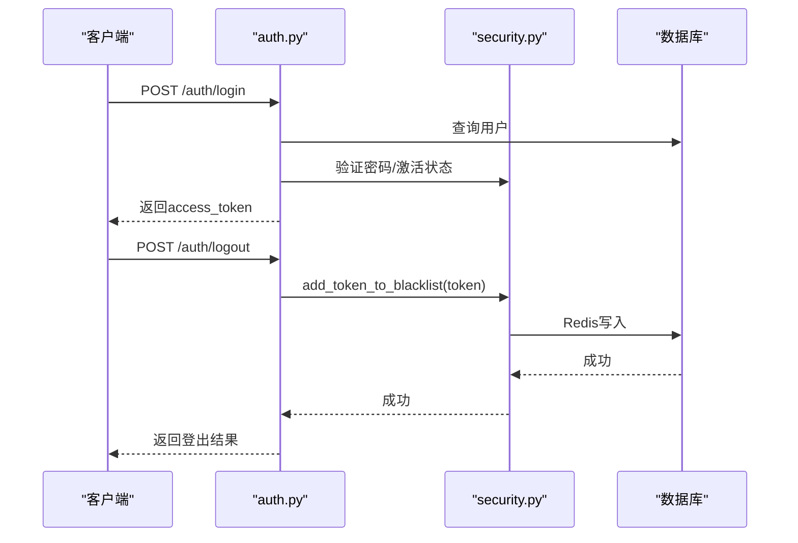
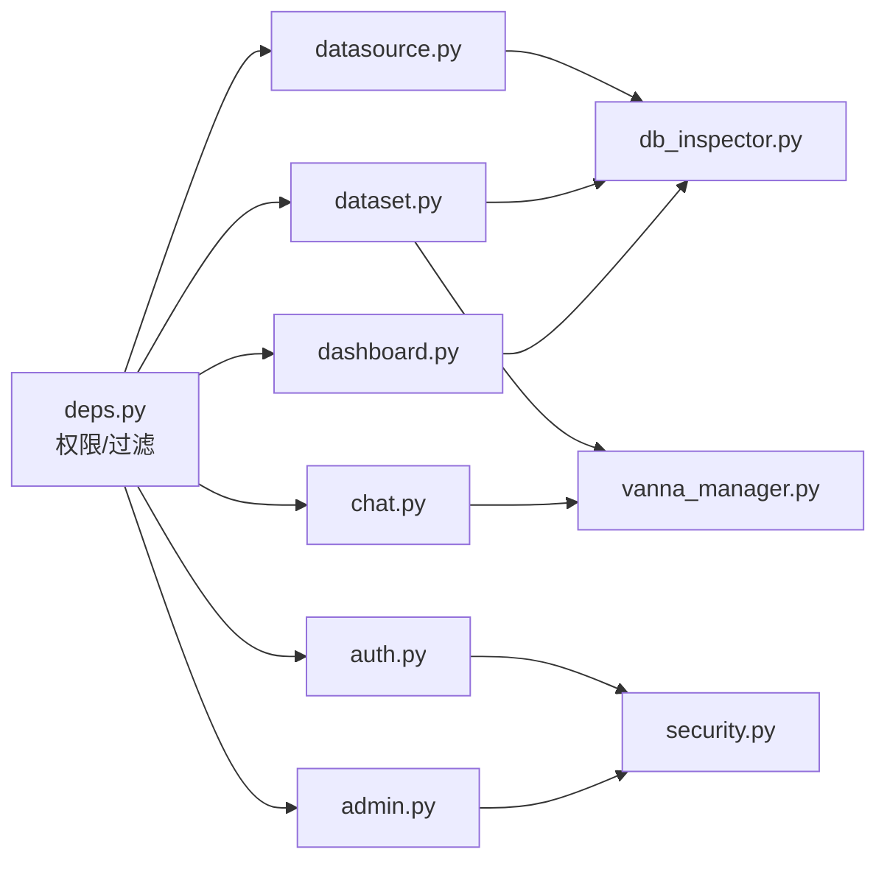

# 核心功能模块

<cite>
**本文档引用的文件**
- [backend/app/api/v1/endpoints/datasource.py](file://backend/app/api/v1/endpoints/datasource.py)
- [backend/app/api/v1/endpoints/dataset.py](file://backend/app/api/v1/endpoints/dataset.py)
- [backend/app/api/v1/endpoints/chat.py](file://backend/app/api/v1/endpoints/chat.py)
- [backend/app/api/v1/endpoints/dashboard.py](file://backend/app/api/v1/endpoints/dashboard.py)
- [backend/app/api/v1/endpoints/auth.py](file://backend/app/api/v1/endpoints/auth.py)
- [backend/app/api/v1/endpoints/admin.py](file://backend/app/api/v1/endpoints/admin.py)
- [backend/app/services/db_inspector.py](file://backend/app/services/db_inspector.py)
- [backend/app/services/vanna_manager.py](file://backend/app/services/vanna_manager.py)
- [backend/app/models/metadata.py](file://backend/app/models/metadata.py)
- [backend/app/schemas/datasource.py](file://backend/app/schemas/datasource.py)
- [backend/app/schemas/dataset.py](file://backend/app/schemas/dataset.py)
- [backend/app/api/deps.py](file://backend/app/api/deps.py)
- [backend/app/core/security.py](file://backend/app/core/security.py)
- [backend/app/main.py](file://backend/app/main.py)
</cite>

## 目录
1. [简介](#简介)
2. [项目结构](#项目结构)
3. [核心组件](#核心组件)
4. [架构总览](#架构总览)
5. [详细组件分析](#详细组件分析)
6. [依赖关系分析](#依赖关系分析)
7. [性能考量](#性能考量)
8. [故障排查指南](#故障排查指南)
9. [结论](#结论)

## 简介
本文件面向通用BI系统的六大核心能力：数据源管理、数据集建模、自然语言查询、仪表盘构建、用户认证与管理员控制。文档基于后端FastAPI实现，围绕各endpoint文件梳理业务逻辑、接口调用流程与关键实现细节，并强调功能间的协同关系（如数据集训练如何提升聊天查询准确性）。

## 项目结构
后端采用分层架构：API层（endpoints）、服务层（services）、模型层（models）、模式层（schemas）、依赖与安全层（deps、security），以及入口应用（main）。API路由统一挂载在主应用上，按模块划分路径前缀。

图表来源
- [backend/app/main.py](file://backend/app/main.py#L25-L30)
- [backend/app/api/v1/endpoints/datasource.py](file://backend/app/api/v1/endpoints/datasource.py#L1-L182)
- [backend/app/api/v1/endpoints/dataset.py](file://backend/app/api/v1/endpoints/dataset.py#L1-L868)
- [backend/app/api/v1/endpoints/chat.py](file://backend/app/api/v1/endpoints/chat.py#L1-L156)
- [backend/app/api/v1/endpoints/dashboard.py](file://backend/app/api/v1/endpoints/dashboard.py#L1-L261)
- [backend/app/api/v1/endpoints/auth.py](file://backend/app/api/v1/endpoints/auth.py#L1-L147)
- [backend/app/api/v1/endpoints/admin.py](file://backend/app/api/v1/endpoints/admin.py#L1-L232)
- [backend/app/services/db_inspector.py](file://backend/app/services/db_inspector.py#L1-L152)
- [backend/app/services/vanna_manager.py](file://backend/app/services/vanna_manager.py#L1-L800)
- [backend/app/models/metadata.py](file://backend/app/models/metadata.py#L1-L129)
- [backend/app/schemas/datasource.py](file://backend/app/schemas/datasource.py#L1-L34)
- [backend/app/schemas/dataset.py](file://backend/app/schemas/dataset.py#L1-L120)

章节来源
- [backend/app/main.py](file://backend/app/main.py#L1-L35)

## 核心组件
- 数据源管理：提供数据源连接测试、创建、查询、删除、表清单与预览等能力，贯穿数据隔离与权限控制。
- 数据集建模：负责数据集生命周期管理、表选择与DDL提取、业务术语训练、关系分析与建模、视图创建、训练进度与日志、训练数据查询与暂停/删除训练等。
- 自然语言查询：支持基于数据集的问答、SQL生成与结果返回、用户反馈（正向/负向）驱动再训练、摘要生成。
- 仪表盘构建：支持看板的增删改查、卡片的添加与数据刷新执行、布局管理、错误分类与序列化处理。
- 用户认证与管理员控制：提供登录/注册/登出、当前用户信息获取、超级管理员用户列表与状态管理、软删除与信息更新。
- 服务支撑：DBInspector封装数据库引擎、DDL生成、数据预览；VannaManager封装向量记忆、训练流程、缓存与Redis集成、训练日志与状态控制。

章节来源
- [backend/app/api/v1/endpoints/datasource.py](file://backend/app/api/v1/endpoints/datasource.py#L20-L182)
- [backend/app/api/v1/endpoints/dataset.py](file://backend/app/api/v1/endpoints/dataset.py#L29-L868)
- [backend/app/api/v1/endpoints/chat.py](file://backend/app/api/v1/endpoints/chat.py#L13-L156)
- [backend/app/api/v1/endpoints/dashboard.py](file://backend/app/api/v1/endpoints/dashboard.py#L25-L261)
- [backend/app/api/v1/endpoints/auth.py](file://backend/app/api/v1/endpoints/auth.py#L17-L147)
- [backend/app/api/v1/endpoints/admin.py](file://backend/app/api/v1/endpoints/admin.py#L16-L232)
- [backend/app/services/db_inspector.py](file://backend/app/services/db_inspector.py#L13-L152)
- [backend/app/services/vanna_manager.py](file://backend/app/services/vanna_manager.py#L101-L800)

## 架构总览
系统通过API层暴露REST接口，服务层提供数据库与AI训练能力，模型层定义数据结构，依赖与安全层保障鉴权与数据隔离。数据流从API层进入，经依赖注入获取当前用户与数据库会话，再调用服务层执行具体逻辑，最终返回响应。

图表来源
- [backend/app/api/deps.py](file://backend/app/api/deps.py#L17-L81)
- [backend/app/api/v1/endpoints/dataset.py](file://backend/app/api/v1/endpoints/dataset.py#L126-L167)
- [backend/app/services/vanna_manager.py](file://backend/app/services/vanna_manager.py#L342-L364)

## 详细组件分析

### 数据源管理（datasource.py）
- 连接测试：接收明文凭据，构建URL并短超时连接验证，返回布尔结果。
- 创建数据源：加密密码后持久化，自动设置拥有者。
- 查询与删除：应用数据隔离过滤，公共资源需超级管理员权限。
- 表清单与预览：基于DBInspector反射获取表名与列信息，支持表数据预览。

图表来源
- [backend/app/api/v1/endpoints/datasource.py](file://backend/app/api/v1/endpoints/datasource.py#L20-L58)
- [backend/app/services/db_inspector.py](file://backend/app/services/db_inspector.py#L32-L50)

章节来源
- [backend/app/api/v1/endpoints/datasource.py](file://backend/app/api/v1/endpoints/datasource.py#L20-L182)
- [backend/app/services/db_inspector.py](file://backend/app/services/db_inspector.py#L13-L152)

### 数据集建模（dataset.py）
- 生命周期：创建数据集、列出/获取、更新表选择(schema_config)、删除数据集。
- 训练触发：后台任务包装器确保独立会话，触发Vanna训练流程。
- 关系分析：基于现有数据集上下文，调用Vanna分析表间关系。
- 视图创建：校验SQL与视图名，自动去重重复列名，按数据库类型生成CREATE/REPLACE语句。
- 业务术语：新增/查询/删除术语，术语训练失败回滚数据库。
- 训练管理：进度查询、日志查询、训练数据导出、暂停/删除训练、删除数据集级联清理。

图表来源
- [backend/app/api/v1/endpoints/dataset.py](file://backend/app/api/v1/endpoints/dataset.py#L126-L167)
- [backend/app/services/vanna_manager.py](file://backend/app/services/vanna_manager.py#L586-L763)

章节来源
- [backend/app/api/v1/endpoints/dataset.py](file://backend/app/api/v1/endpoints/dataset.py#L29-L868)
- [backend/app/services/vanna_manager.py](file://backend/app/services/vanna_manager.py#L101-L800)

### 自然语言查询（chat.py）
- 问答流程：校验数据集访问权限，调用VannaManager生成结果（SQL与数据）。
- 反馈机制：正向反馈与负向反馈（提供修正SQL）均触发再训练，公共资源需超级管理员权限。
- 摘要生成：对查询结果DataFrame生成业务摘要文本。

图表来源
- [backend/app/api/v1/endpoints/chat.py](file://backend/app/api/v1/endpoints/chat.py#L13-L156)
- [backend/app/services/vanna_manager.py](file://backend/app/services/vanna_manager.py#L101-L800)

章节来源
- [backend/app/api/v1/endpoints/chat.py](file://backend/app/api/v1/endpoints/chat.py#L13-L156)
- [backend/app/services/vanna_manager.py](file://backend/app/services/vanna_manager.py#L101-L800)

### 仪表盘构建（dashboard.py）
- 看板管理：创建、列表、详情、删除。
- 卡片管理：添加卡片（校验看板与数据集所有权）、删除卡片、刷新数据（执行SQL并序列化）。
- 错误处理：区分数据库连接错误与SQL语法错误，返回不同HTTP状态码。

图表来源
- [backend/app/api/v1/endpoints/dashboard.py](file://backend/app/api/v1/endpoints/dashboard.py#L82-L197)
- [backend/app/services/db_inspector.py](file://backend/app/services/db_inspector.py#L52-L99)

章节来源
- [backend/app/api/v1/endpoints/dashboard.py](file://backend/app/api/v1/endpoints/dashboard.py#L25-L261)
- [backend/app/services/db_inspector.py](file://backend/app/services/db_inspector.py#L13-L152)

### 用户认证与管理员控制（auth.py, admin.py）
- 登录/注册/登出：登录校验邮箱、密码与激活状态，签发JWT；注册创建用户并哈希密码；登出将Token加入黑名单（Redis可用时）。
- 当前用户：返回当前用户信息。
- 管理员：用户列表（分页、搜索）、状态更新（封禁/解封）、软删除、信息更新（昵称/密码/角色）。

图表来源
- [backend/app/api/v1/endpoints/auth.py](file://backend/app/api/v1/endpoints/auth.py#L17-L147)
- [backend/app/core/security.py](file://backend/app/core/security.py#L83-L161)

章节来源
- [backend/app/api/v1/endpoints/auth.py](file://backend/app/api/v1/endpoints/auth.py#L17-L147)
- [backend/app/api/v1/endpoints/admin.py](file://backend/app/api/v1/endpoints/admin.py#L16-L232)
- [backend/app/core/security.py](file://backend/app/core/security.py#L1-L161)

## 依赖关系分析
- 数据隔离：所有资源均通过apply_ownership_filter进行过滤，普通用户仅可见自身或公共资源，超级管理员可查看全部。
- 权限链路：get_current_user负责JWT解析、黑名单检查、用户状态检查；get_current_superuser进一步限制管理员操作。
- 服务耦合：数据集训练依赖DBInspector提取DDL与数据库连接，依赖VannaManager进行向量训练与缓存；聊天查询依赖VannaManager生成SQL与结果；仪表盘依赖DBInspector执行SQL并序列化。

图表来源
- [backend/app/api/deps.py](file://backend/app/api/deps.py#L97-L124)
- [backend/app/api/v1/endpoints/datasource.py](file://backend/app/api/v1/endpoints/datasource.py#L1-L182)
- [backend/app/api/v1/endpoints/dataset.py](file://backend/app/api/v1/endpoints/dataset.py#L1-L868)
- [backend/app/api/v1/endpoints/chat.py](file://backend/app/api/v1/endpoints/chat.py#L1-L156)
- [backend/app/api/v1/endpoints/dashboard.py](file://backend/app/api/v1/endpoints/dashboard.py#L1-L261)
- [backend/app/api/v1/endpoints/auth.py](file://backend/app/api/v1/endpoints/auth.py#L1-L147)
- [backend/app/api/v1/endpoints/admin.py](file://backend/app/api/v1/endpoints/admin.py#L1-L232)
- [backend/app/services/db_inspector.py](file://backend/app/services/db_inspector.py#L1-L152)
- [backend/app/services/vanna_manager.py](file://backend/app/services/vanna_manager.py#L1-L800)
- [backend/app/core/security.py](file://backend/app/core/security.py#L1-L161)

章节来源
- [backend/app/api/deps.py](file://backend/app/api/deps.py#L17-L124)
- [backend/app/services/db_inspector.py](file://backend/app/services/db_inspector.py#L13-L152)
- [backend/app/services/vanna_manager.py](file://backend/app/services/vanna_manager.py#L101-L800)

## 性能考量
- 连接池与超时：DBInspector为不同数据库配置连接池与超时参数，避免长时间阻塞。
- 缓存与Redis：VannaManager内置Redis缓存键空间与序列化/反序列化，支持训练后清理缓存以保证一致性。
- 异步训练：训练流程异步执行，支持进度更新与用户中断（暂停）。
- SQL执行：仪表盘卡片刷新使用pandas读取SQL结果，序列化时对日期/Decimal进行转换，减少前端处理成本。

## 故障排查指南
- 登录失败：检查邮箱是否存在、密码是否正确、用户是否激活；确认JWT签名算法与密钥一致。
- Token黑名单：Redis不可用时登出降级，Token仍可能在到期前有效；检查Redis连接与TTL。
- 数据源连接：测试连接失败通常由凭据或网络导致；确认URL编码与超时设置。
- 训练中断：用户暂停训练会抛出自定义异常，检查数据集状态与日志；必要时清理缓存后重试。
- SQL执行错误：区分“连接失败”与“SQL语法错误”，前者返回500，后者返回400；检查SQL合法性与表名/列名。

章节来源
- [backend/app/api/v1/endpoints/auth.py](file://backend/app/api/v1/endpoints/auth.py#L17-L147)
- [backend/app/core/security.py](file://backend/app/core/security.py#L83-L161)
- [backend/app/services/db_inspector.py](file://backend/app/services/db_inspector.py#L32-L50)
- [backend/app/services/vanna_manager.py](file://backend/app/services/vanna_manager.py#L366-L401)
- [backend/app/api/v1/endpoints/dashboard.py](file://backend/app/api/v1/endpoints/dashboard.py#L157-L177)

## 结论
本系统通过清晰的模块划分与严格的权限控制，实现了从数据源接入、数据集建模、自然语言查询到仪表盘可视化的完整闭环。数据集训练显著提升了聊天查询的准确性，而管理员控制与认证体系则保障了平台的安全与合规。建议在生产环境中强化Redis与向量库的监控与备份，持续优化训练流程与缓存策略。