# 聊天会话管理

<cite>
**本文档引用的文件**
- [chat_session.py](file://backend/app/api/v1/endpoints/chat_session.py)
- [chat.py](file://backend/app/api/v1/endpoints/chat.py)
- [chat.py](file://backend/app/schemas/chat.py)
- [metadata.py](file://backend/app/models/metadata.py)
- [facade.py](file://backend/app/services/vanna/facade.py)
- [20260109_add_session_and_template.sql](file://backend/migrations/20260109_add_session_and_template.sql)
- [chatSession.ts](file://frontend/src/api/chatSession.ts)
- [index.vue](file://frontend/src/views/Chat/index.vue)
- [sql_generator.py](file://backend/app/services/vanna/sql_generator.py)
- [cache_service.py](file://backend/app/services/vanna/cache_service.py)
</cite>

## 目录
1. [简介](#简介)
2. [项目结构](#项目结构)
3. [核心组件](#核心组件)
4. [架构总览](#架构总览)
5. [详细组件分析](#详细组件分析)
6. [依赖关系分析](#依赖关系分析)
7. [性能考虑](#性能考虑)
8. [故障排除指南](#故障排除指南)
9. [结论](#结论)

## 简介
本项目实现了完整的聊天会话管理系统，支持用户与AI进行多轮对话，自动保存对话历史到数据库，并提供会话列表、详情查看、消息管理等功能。系统采用前后端分离架构，后端基于FastAPI提供RESTful API，前端使用Vue.js构建交互界面。

## 项目结构
聊天会话管理功能分布在以下层次：
- **后端API层**：提供会话管理的RESTful接口
- **数据模型层**：定义会话和消息的数据库模型
- **服务层**：封装AI分析、缓存等业务逻辑
- **前端界面层**：提供会话管理的用户界面

**图表来源**
- [chat_session.py](file://backend/app/api/v1/endpoints/chat_session.py#L1-L184)
- [metadata.py](file://backend/app/models/metadata.py#L114-L151)

**章节来源**
- [chat_session.py](file://backend/app/api/v1/endpoints/chat_session.py#L1-L184)
- [metadata.py](file://backend/app/models/metadata.py#L114-L151)

## 核心组件
系统的核心组件包括：

### 1. 会话管理API
提供完整的会话生命周期管理：
- 创建新会话
- 获取会话列表
- 查看会话详情
- 更新会话信息
- 删除会话（级联删除消息）

### 2. 消息管理
支持用户与AI的双向消息存储：
- 用户消息（role=user）
- AI响应消息（role=assistant）
- 自动保存SQL、图表数据、业务洞察

### 3. 数据模型
基于SQLAlchemy ORM定义的模型关系：
- ChatSession：会话实体
- ChatMessage：消息实体
- 外键约束保证数据完整性

**章节来源**
- [chat_session.py](file://backend/app/api/v1/endpoints/chat_session.py#L25-L184)
- [metadata.py](file://backend/app/models/metadata.py#L114-L151)

## 架构总览
系统采用分层架构设计，确保关注点分离和代码可维护性。

**图表来源**
- [chat_session.py](file://backend/app/api/v1/endpoints/chat_session.py#L45-L71)
- [chat.py](file://backend/app/api/v1/endpoints/chat.py#L28-L147)

## 详细组件分析

### 会话管理API组件
会话管理API提供RESTful接口，支持CRUD操作和消息查询。

**图表来源**
- [chat_session.py](file://backend/app/api/v1/endpoints/chat_session.py#L25-L184)
- [metadata.py](file://backend/app/models/metadata.py#L114-L151)

#### API端点功能
- **GET /sessions/**：获取当前用户的会话列表，按更新时间倒序排列
- **POST /sessions/**：创建新会话，支持自定义标题和数据集关联
- **GET /sessions/{session_id}**：获取会话详情，包含所有消息
- **PATCH /sessions/{session_id}**：更新会话标题
- **DELETE /sessions/{session_id}**：删除会话（级联删除所有消息）
- **GET /sessions/{session_id}/messages**：获取会话消息列表

**章节来源**
- [chat_session.py](file://backend/app/api/v1/endpoints/chat_session.py#L25-L184)

### 数据模型组件
数据库模型定义了会话和消息的结构及关系。

**图表来源**
- [metadata.py](file://backend/app/models/metadata.py#L6-L151)
- [20260109_add_session_and_template.sql](file://backend/migrations/20260109_add_session_and_template.sql#L6-L32)

#### 模型关系说明
- **ChatSession**：每个会话关联一个数据集（可选）和所有者
- **ChatMessage**：每条消息关联到特定会话，包含用户和AI的双向交流
- **外键约束**：确保数据一致性和完整性
- **级联删除**：删除会话时自动删除其所有消息

**章节来源**
- [metadata.py](file://backend/app/models/metadata.py#L114-L151)
- [20260109_add_session_and_template.sql](file://backend/migrations/20260109_add_session_and_template.sql#L6-L32)

### 前端集成组件
前端通过API与后端交互，提供直观的会话管理界面。

```mermaid
flowchart TD
Start([用户打开聊天界面]) --> LoadSessions[加载会话列表]
LoadSessions --> CheckCurrentSession{是否有当前会话?}
CheckCurrentSession --> |是| LoadSessionDetail[加载会话详情]
CheckCurrentSession --> |否| NewSession[创建新会话]
LoadSessionDetail --> DisplayMessages[显示消息历史]
NewSession --> CreateSessionAPI[调用创建会话API]
CreateSessionAPI --> UpdateUI[更新界面状态]
DisplayMessages --> UserInteraction[用户交互]
UserInteraction --> SendMessage[发送消息]
SendMessage --> SaveToSession[保存到会话]
SaveToSession --> UpdateList[更新会话列表]
UpdateList --> End([完成])
UpdateUI --> End
DisplayMessages --> End
```

**图表来源**
- [index.vue](file://frontend/src/views/Chat/index.vue#L1776-L1857)
- [chatSession.ts](file://frontend/src/api/chatSession.ts#L43-L80)

#### 前端功能特性
- **会话列表管理**：显示用户所有会话，支持新建、删除操作
- **消息历史恢复**：选择会话时自动加载历史消息
- **实时状态同步**：会话更新时自动刷新界面
- **数据集关联**：会话可关联特定数据集，影响后续查询

**章节来源**
- [index.vue](file://frontend/src/views/Chat/index.vue#L1776-L1857)
- [chatSession.ts](file://frontend/src/api/chatSession.ts#L43-L80)

### AI对话集成组件
系统集成了AI对话功能，支持智能SQL生成和分析。

**图表来源**
- [chat.py](file://backend/app/api/v1/endpoints/chat.py#L28-L147)
- [sql_generator.py](file://backend/app/services/vanna/sql_generator.py#L35-L67)

#### AI集成特性
- **智能SQL生成**：基于用户问题生成SQL查询
- **缓存优化**：Redis缓存提升查询性能
- **业务洞察**：生成数据解读和分析报告
- **多轮对话**：支持上下文理解和历史记忆

**章节来源**
- [chat.py](file://backend/app/api/v1/endpoints/chat.py#L28-L147)
- [sql_generator.py](file://backend/app/services/vanna/sql_generator.py#L35-L67)

## 依赖关系分析

**图表来源**
- [chat_session.py](file://backend/app/api/v1/endpoints/chat_session.py#L1-L22)
- [metadata.py](file://backend/app/models/metadata.py#L1-L4)
- [cache_service.py](file://backend/app/services/vanna/cache_service.py#L8-L11)

### 依赖关系说明
- **后端依赖**：FastAPI提供Web框架，SQLAlchemy处理数据库操作，Redis提供缓存支持
- **前端依赖**：Vue.js提供UI框架，Element Plus提供组件库
- **模块耦合**：API层与服务层松耦合，便于测试和维护
- **数据流**：从前端请求到后端处理再到数据库存储的完整链路

**章节来源**
- [chat_session.py](file://backend/app/api/v1/endpoints/chat_session.py#L1-L22)
- [metadata.py](file://backend/app/models/metadata.py#L1-L4)

## 性能考虑
系统在多个层面进行了性能优化：

### 缓存策略
- **Redis缓存**：SQL查询结果缓存24小时
- **智能缓存命中**：自动检测缓存有效性
- **异步缓存操作**：避免阻塞主线程

### 数据库优化
- **索引优化**：为常用查询字段建立索引
- **外键约束**：确保数据一致性
- **级联删除**：自动清理关联数据

### 前端优化
- **虚拟滚动**：大量消息时的性能优化
- **懒加载**：按需加载会话详情
- **状态缓存**：减少重复API调用

## 故障排除指南

### 常见问题及解决方案

#### 会话权限问题
**症状**：无法访问其他用户的会话
**原因**：权限验证失败
**解决**：检查用户认证状态和会话所有权

#### 数据库连接问题
**症状**：会话操作超时
**原因**：数据库连接池耗尽
**解决**：检查数据库连接配置和连接池大小

#### 缓存失效问题
**症状**：缓存未生效或返回过期数据
**原因**：Redis服务不可用或缓存键冲突
**解决**：重启Redis服务，检查缓存键生成逻辑

#### 前端状态不同步
**症状**：会话列表不更新
**原因**：前端状态管理问题
**解决**：刷新页面或检查API响应

**章节来源**
- [chat_session.py](file://backend/app/api/v1/endpoints/chat_session.py#L87-L146)
- [cache_service.py](file://backend/app/services/vanna/cache_service.py#L24-L59)

## 结论
聊天会话管理系统实现了完整的多轮对话管理功能，具有以下特点：

### 技术优势
- **模块化设计**：清晰的分层架构便于维护和扩展
- **数据完整性**：严格的外键约束和权限控制
- **性能优化**：缓存策略和数据库索引优化
- **用户体验**：直观的前端界面和流畅的交互体验

### 功能完整性
- **会话管理**：完整的CRUD操作和消息管理
- **AI集成**：智能SQL生成和业务分析
- **数据持久化**：可靠的数据库存储方案
- **权限控制**：基于用户的细粒度访问控制

### 扩展性
系统设计支持进一步的功能扩展，如：
- 多语言支持
- 会话共享功能
- 高级搜索和过滤
- 集成更多AI能力

该系统为用户提供了一个强大而易用的聊天分析平台，能够有效提升数据分析效率和用户体验。