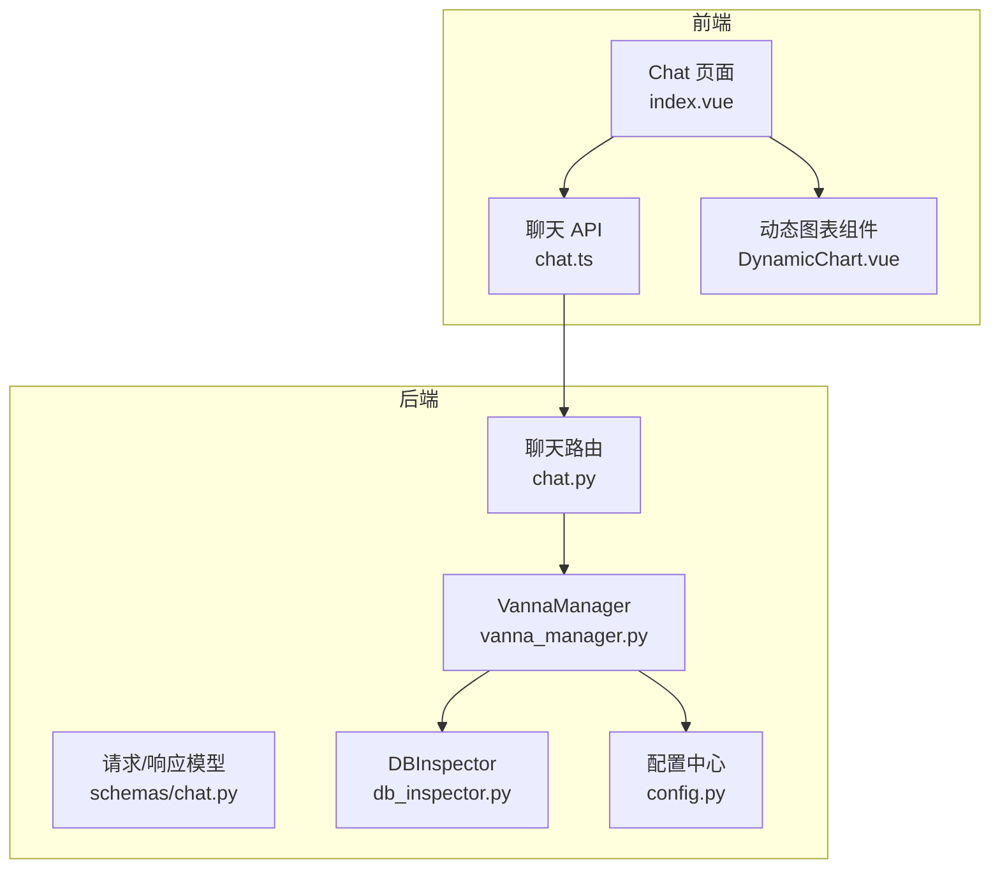
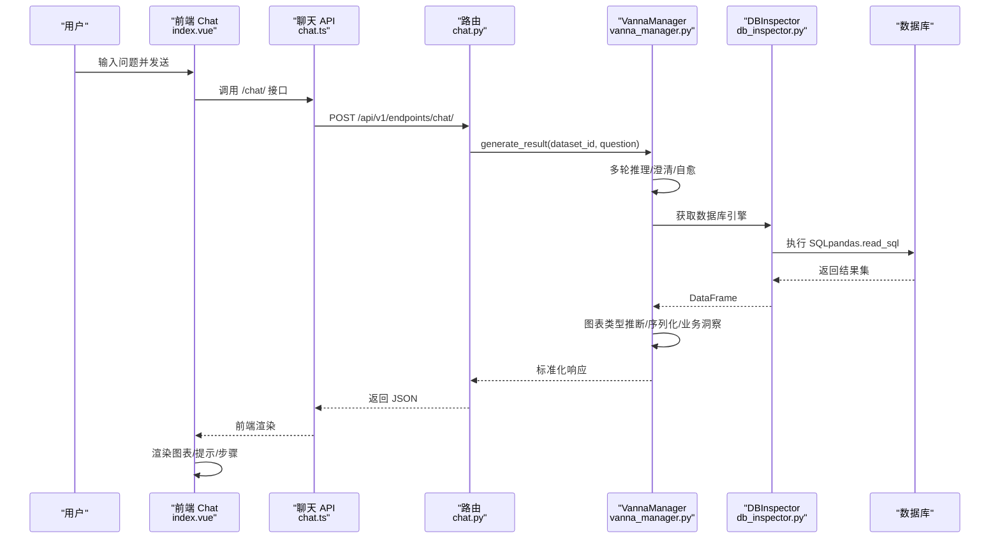
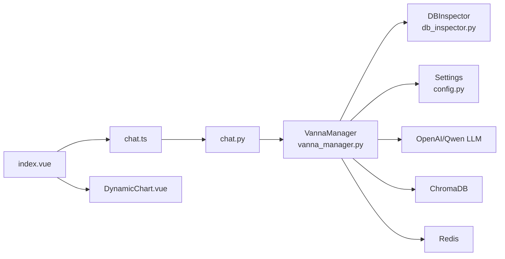
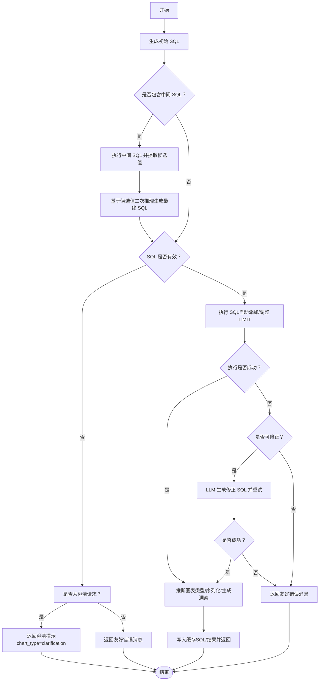

# 自然语言查询

<cite>
**本文引用的文件**
- [chat.py](file://backend/app/api/v1/endpoints/chat.py)
- [vanna_manager.py](file://backend/app/services/vanna_manager.py)
- [db_inspector.py](file://backend/app/services/db_inspector.py)
- [chat.py](file://backend/app/schemas/chat.py)
- [index.vue](file://frontend/src/views/Chat/index.vue)
- [chat.ts](file://frontend/src/api/chat.ts)
- [DynamicChart.vue](file://frontend/src/components/Charts/DynamicChart.vue)
- [config.py](file://backend/app/core/config.py)
- [MULTI_ROUND_REASONING.md](file://docs/backend/MULTI_ROUND_REASONING.md)
- [REDIS_CACHE.md](file://docs/backend/REDIS_CACHE.md)
</cite>

## 目录
1. [简介](#简介)
2. [项目结构](#项目结构)
3. [核心组件](#核心组件)
4. [架构总览](#架构总览)
5. [详细组件分析](#详细组件分析)
6. [依赖关系分析](#依赖关系分析)
7. [性能考量](#性能考量)
8. [故障排查指南](#故障排查指南)
9. [结论](#结论)
10. [附录](#附录)

## 简介
本文件全面解析自然语言查询功能的实现原理，涵盖从前端用户输入到后端生成 SQL、执行查询、结果可视化与缓存加速的完整链路。重点说明：
- chat.py 如何接收用户问题，调用 VannaManager 根据指定数据集上下文生成 SQL，并通过 DBInspector 执行查询；
- 多轮推理机制如何通过对话历史实现澄清与修正；
- SQL 自愈流程如何处理语法错误；
- 结果如何被格式化为图表数据并返回前端；
- 前端 Chat 界面组件的消息流管理与错误处理策略；
- 缓存机制（Redis）在提升响应速度中的作用。

## 项目结构
自然语言查询涉及后端 FastAPI 路由、服务层 VannaManager、数据库引擎封装 DBInspector、前端聊天界面与图表组件，以及配置中心 Settings。

图表来源
- [chat.py](file://backend/app/api/v1/endpoints/chat.py#L1-L156)
- [vanna_manager.py](file://backend/app/services/vanna_manager.py#L868-L1332)
- [db_inspector.py](file://backend/app/services/db_inspector.py#L1-L152)
- [chat.ts](file://frontend/src/api/chat.ts#L1-L65)
- [index.vue](file://frontend/src/views/Chat/index.vue#L1-L1052)
- [DynamicChart.vue](file://frontend/src/components/Charts/DynamicChart.vue#L1-L346)
- [config.py](file://backend/app/core/config.py#L1-L51)

章节来源
- [chat.py](file://backend/app/api/v1/endpoints/chat.py#L1-L156)
- [vanna_manager.py](file://backend/app/services/vanna_manager.py#L868-L1332)
- [db_inspector.py](file://backend/app/services/db_inspector.py#L1-L152)
- [chat.ts](file://frontend/src/api/chat.ts#L1-L65)
- [index.vue](file://frontend/src/views/Chat/index.vue#L1-L1052)
- [DynamicChart.vue](file://frontend/src/components/Charts/DynamicChart.vue#L1-L346)
- [config.py](file://backend/app/core/config.py#L1-L51)

## 核心组件
- 后端路由 chat.py：负责鉴权与数据集访问校验，调用 VannaManager 生成结果并返回标准化响应。
- 服务层 VannaManager：核心逻辑，包含多轮推理、SQL 自愈、图表类型推断、缓存与序列化、业务洞察生成等。
- 数据库引擎封装 DBInspector：构建数据库引擎、连接池配置、DDL/数据查询。
- 前端 Chat 页面 index.vue：消息流管理、加载动画、澄清提示、快捷回复、图表渲染、保存看板、反馈提交。
- 图表组件 DynamicChart.vue：根据 chart_type 渲染表格、柱状图、折线图、饼图。
- 配置中心 config.py：统一读取 .env，提供 Redis、向量库、模型等配置。

章节来源
- [chat.py](file://backend/app/api/v1/endpoints/chat.py#L1-L156)
- [vanna_manager.py](file://backend/app/services/vanna_manager.py#L868-L1332)
- [db_inspector.py](file://backend/app/services/db_inspector.py#L1-L152)
- [index.vue](file://frontend/src/views/Chat/index.vue#L1-L1052)
- [DynamicChart.vue](file://frontend/src/components/Charts/DynamicChart.vue#L1-L346)
- [config.py](file://backend/app/core/config.py#L1-L51)

## 架构总览
自然语言查询的端到端流程如下：

图表来源
- [chat.py](file://backend/app/api/v1/endpoints/chat.py#L13-L42)
- [vanna_manager.py](file://backend/app/services/vanna_manager.py#L868-L1332)
- [db_inspector.py](file://backend/app/services/db_inspector.py#L52-L99)
- [chat.ts](file://frontend/src/api/chat.ts#L42-L56)
- [index.vue](file://frontend/src/views/Chat/index.vue#L558-L637)

## 详细组件分析

### 后端路由：chat.py
- 数据集访问校验：通过 ownership 过滤确保用户只能访问其拥有或公开的数据集。
- 调用 VannaManager.generate_result 生成 SQL 与结果；捕获 ValueError/Exception 并映射为 HTTP 400/500。
- 提供反馈接口 /feedback 与摘要接口 /summary，分别用于训练与生成业务总结。

章节来源
- [chat.py](file://backend/app/api/v1/endpoints/chat.py#L13-L42)
- [chat.py](file://backend/app/api/v1/endpoints/chat.py#L44-L111)
- [chat.py](file://backend/app/api/v1/endpoints/chat.py#L113-L155)

### 服务层：VannaManager（核心）
- 多轮推理与澄清
  - 从 LLM 响应中提取中间 SQL（显式/隐式模式），执行中间查询，基于返回值进行二次推理，必要时生成澄清提示。
  - 通过关键词识别澄清请求，返回 chart_type=clarification。
- SQL 自愈
  - 执行失败时尝试 LLM 修正，最多 3 次尝试；对超时错误直接返回友好建议。
- 缓存机制（Redis）
  - SQL 级缓存（7 天）与结果级缓存（5 分钟）双通道；命中时直接返回并标注 from_cache。
  - 缓存键生成、序列化/反序列化、异常降级（Redis 不可用时优雅回退）。
- 图表类型推断与数据序列化
  - 基于列数、列名含日期、数值/字符串类型推断图表类型（line/bar/pie/table）。
  - DataFrame 序列化为 JSON 兼容格式，处理日期/Decimal 等类型。
- 业务洞察（分析师 Agent）
  - 在有数据时生成业务洞察，附加到响应中，前端展示“智能分析”区域。

章节来源
- [vanna_manager.py](file://backend/app/services/vanna_manager.py#L868-L1332)
- [vanna_manager.py](file://backend/app/services/vanna_manager.py#L1334-L1394)
- [vanna_manager.py](file://backend/app/services/vanna_manager.py#L1477-L1586)
- [vanna_manager.py](file://backend/app/services/vanna_manager.py#L1177-L1210)
- [MULTI_ROUND_REASONING.md](file://docs/backend/MULTI_ROUND_REASONING.md#L51-L331)
- [REDIS_CACHE.md](file://docs/backend/REDIS_CACHE.md#L161-L254)

### 数据库引擎封装：DBInspector
- 构建数据库 URL（支持 sqlite/mysql/postgresql），解密密码，配置连接池与超时参数。
- 提供表名/DDL/数据预览等工具方法，保证查询执行的稳定性与安全性。

章节来源
- [db_inspector.py](file://backend/app/services/db_inspector.py#L13-L99)
- [db_inspector.py](file://backend/app/services/db_inspector.py#L101-L152)

### 前端：Chat 页面与图表组件
- 消息流管理
  - 用户发送问题 → 添加用户消息 → 添加 AI 加载占位 → 调用 API → 更新 AI 消息（含 SQL、图表数据、步骤、洞察）。
  - 区分系统错误与业务澄清（chart_type=clarification），分别渲染红色系统错误框与黄色澄清提示。
- 多轮澄清与快捷回复
  - 从 AI 回复中提取“还是/或”分隔的建议，生成快捷标签；点击后自动拼接增强问题并聚焦输入框。
- 图表渲染
  - DynamicChart 根据 chart_type 渲染表格/柱状/折线/饼图；空状态与无数据状态分别提示。
- 保存看板与反馈
  - 支持保存卡片到看板；提交点赞/踩反馈，触发后端训练。

章节来源
- [index.vue](file://frontend/src/views/Chat/index.vue#L558-L637)
- [index.vue](file://frontend/src/views/Chat/index.vue#L764-L879)
- [index.vue](file://frontend/src/views/Chat/index.vue#L195-L226)
- [DynamicChart.vue](file://frontend/src/components/Charts/DynamicChart.vue#L1-L346)
- [chat.ts](file://frontend/src/api/chat.ts#L42-L64)

### 请求/响应模型
- ChatRequest/ChatResponse/FeedbackRequest/SummaryRequest 等 Pydantic 模型，约束前后端数据结构，便于类型安全与文档化。

章节来源
- [chat.py](file://backend/app/schemas/chat.py#L1-L38)

## 依赖关系分析

图表来源
- [vanna_manager.py](file://backend/app/services/vanna_manager.py#L1-L50)
- [db_inspector.py](file://backend/app/services/db_inspector.py#L1-L152)
- [config.py](file://backend/app/core/config.py#L1-L51)
- [chat.py](file://backend/app/api/v1/endpoints/chat.py#L1-L156)
- [chat.ts](file://frontend/src/api/chat.ts#L1-L65)
- [index.vue](file://frontend/src/views/Chat/index.vue#L1-L1052)
- [DynamicChart.vue](file://frontend/src/components/Charts/DynamicChart.vue#L1-L346)

## 性能考量
- Redis 缓存
  - SQL 级缓存（7 天）与结果级缓存（5 分钟）双通道，命中时直接返回并标注 from_cache，显著降低重复查询成本。
  - 缓存键采用 dataset_id+问题哈希，避免重复计算；异常降级保证 Redis 不可用不影响主流程。
- 连接池与超时
  - DBInspector 配置连接池大小、超时与回收策略，减少连接抖动与超时风险。
- 限流与保护
  - 自动生成 LIMIT 1000 防止大数据量查询；对超大 LIMIT 自动调整至 1000；对超时错误直接返回优化建议。
- 前端体验
  - 加载动画与步骤面板，提升感知性能；空状态与无数据状态提示，避免无效渲染。

章节来源
- [REDIS_CACHE.md](file://docs/backend/REDIS_CACHE.md#L161-L254)
- [vanna_manager.py](file://backend/app/services/vanna_manager.py#L1177-L1210)
- [vanna_manager.py](file://backend/app/services/vanna_manager.py#L1114-L1133)
- [db_inspector.py](file://backend/app/services/db_inspector.py#L73-L99)
- [index.vue](file://frontend/src/views/Chat/index.vue#L526-L545)

## 故障排查指南
- 后端错误
  - 404：数据集不存在或访问被拒绝；检查数据集权限与 ownership 过滤。
  - 400/500：VannaManager 抛出 ValueError 或未捕获异常；查看日志定位具体环节。
  - SQL 执行失败：查看 steps 中“SQL 执行失败”与“LLM 生成友好错误消息”节点；确认数据库连通性与 SQL 正确性。
  - 超时错误：系统自动返回优化建议，建议缩小时间范围或增加筛选条件。
- 前端错误
  - 系统错误：红色错误框，区分 HTTP 500 与业务澄清（chart_type=clarification）。
  - 无数据/空状态：DynamicChart 显示“暂无数据”或“需要更多信息”，检查 columns/rows 与 chart_type。
- 缓存问题
  - Redis 不可用：自动降级，功能不受影响；可通过日志确认降级。
  - 缓存未命中：检查 SQL/结果缓存键生成与 TTL；必要时清理特定数据集缓存。

章节来源
- [chat.py](file://backend/app/api/v1/endpoints/chat.py#L23-L42)
- [vanna_manager.py](file://backend/app/services/vanna_manager.py#L1212-L1296)
- [index.vue](file://frontend/src/views/Chat/index.vue#L618-L636)
- [DynamicChart.vue](file://frontend/src/components/Charts/DynamicChart.vue#L3-L23)
- [REDIS_CACHE.md](file://docs/backend/REDIS_CACHE.md#L235-L254)

## 结论
该自然语言查询系统通过“多轮推理 + SQL 自愈 + 缓存加速”的组合，实现了对模糊问题的智能澄清与稳健执行。后端以 VannaManager 为核心，结合 Redis 与连接池优化，显著提升响应速度与稳定性；前端以消息流与图表组件提供直观的交互体验。整体设计兼顾易用性与可维护性，适合在企业级 BI 场景中推广使用。

## 附录

### 多轮推理与 SQL 自愈流程（算法流程图）

图表来源
- [vanna_manager.py](file://backend/app/services/vanna_manager.py#L1035-L1307)
- [MULTI_ROUND_REASONING.md](file://docs/backend/MULTI_ROUND_REASONING.md#L51-L331)