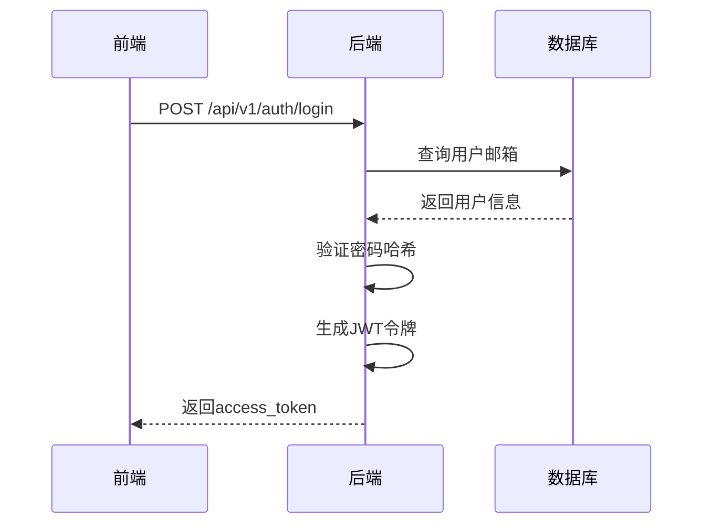
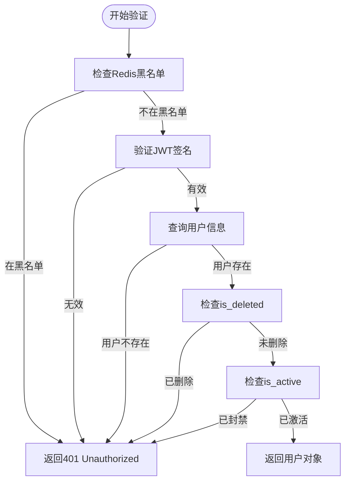
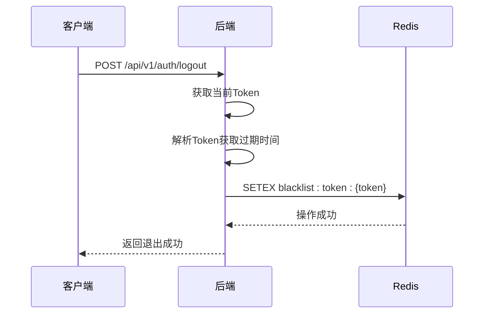
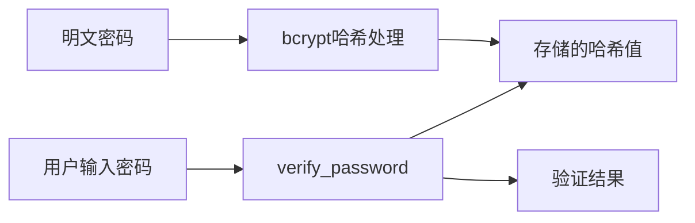
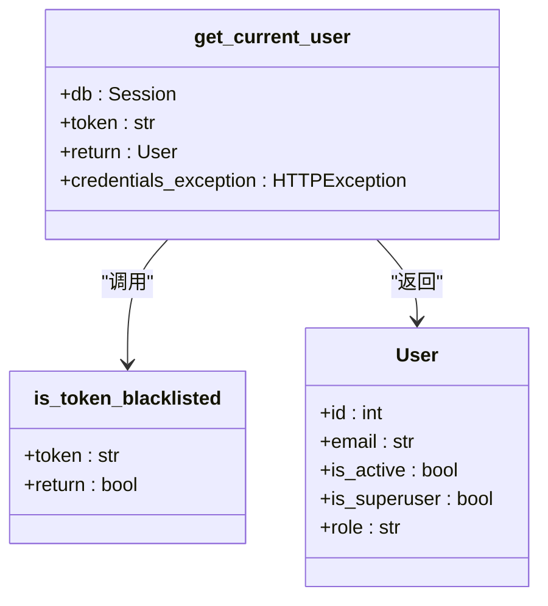
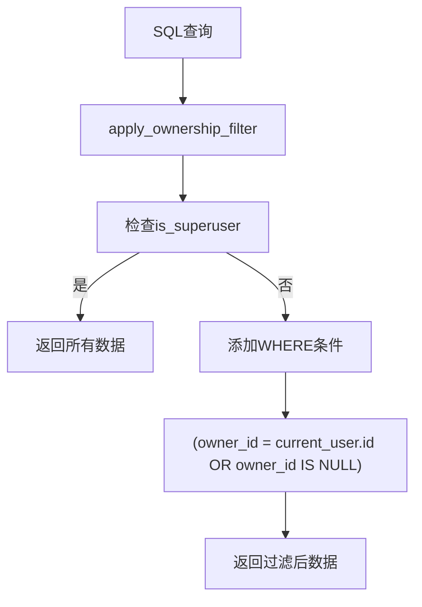
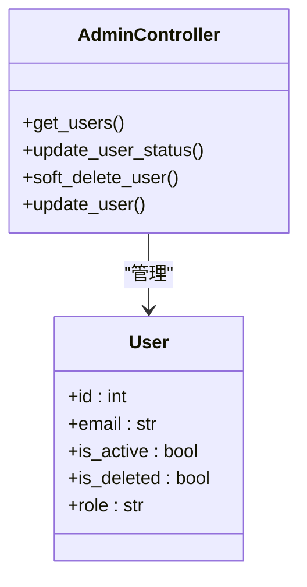
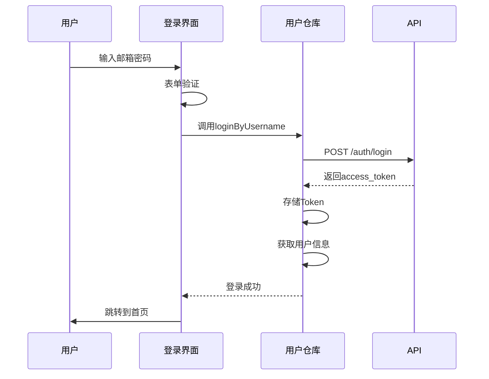
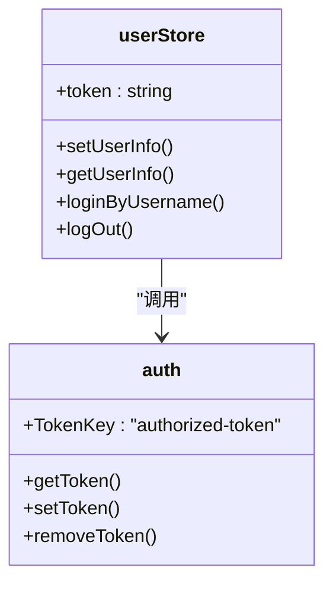

# 认证与权限管理

<cite>
**本文档引用的文件**   
- [security.py](file://backend/app/core/security.py)
- [auth.py](file://backend/app/api/v1/endpoints/auth.py)
- [deps.py](file://backend/app/api/deps.py)
- [admin.py](file://backend/app/api/v1/endpoints/admin.py)
- [metadata.py](file://backend/app/models/metadata.py)
- [config.py](file://backend/app/core/config.py)
- [auth.ts](file://frontend/src/utils/auth.ts)
- [user.ts](file://frontend/src/store/modules/user.ts)
- [index.vue](file://frontend/src/views/Login/index.vue)
- [user.ts](file://frontend/src/api/user.ts)
- [dataset.py](file://backend/app/api/v1/endpoints/dataset.py)
</cite>

## 目录
1. [系统认证架构概述](#系统认证架构概述)
2. [JWT令牌管理机制](#jwt令牌管理机制)
3. [密码加密与安全存储](#密码加密与安全存储)
4. [用户身份解析与权限验证](#用户身份解析与权限验证)
5. [数据行级隔离与所有权控制](#数据行级隔离与所有权控制)
6. [管理员权限管理体系](#管理员权限管理体系)
7. [前端认证流程与Token存储](#前端认证流程与token存储)

## 系统认证架构概述

本系统采用基于JWT（JSON Web Token）的无状态认证机制，结合Redis黑名单管理实现安全的用户会话控制。认证流程从用户登录开始，通过OAuth2密码模式获取访问令牌，并在整个API请求中使用Bearer Token进行身份验证。

系统权限体系包含普通用户、管理员和超级管理员三个层级，通过`is_superuser`字段和角色字段实现权限分级。数据访问控制采用行级隔离策略，确保用户只能访问自有或公开资源。

**Section sources**
- [auth.py](file://backend/app/api/v1/endpoints/auth.py#L1-L147)
- [deps.py](file://backend/app/api/deps.py#L1-L124)
- [metadata.py](file://backend/app/models/metadata.py#L6-L16)

## JWT令牌管理机制

### 令牌生成与签发

系统使用`security.py`中的`create_access_token`函数生成JWT令牌。令牌的载荷包含用户邮箱（作为主体标识）和过期时间，使用HS256算法和预设密钥进行签名。



**Diagram sources**
- [auth.py](file://backend/app/api/v1/endpoints/auth.py#L17-L55)
- [security.py](file://backend/app/core/security.py#L73-L80)

### 令牌验证流程

`get_current_user`依赖项负责解析和验证JWT令牌，执行以下安全检查：
1. 检查令牌是否在Redis黑名单中（已退出登录）
2. 验证JWT签名的有效性
3. 检查用户是否存在且未被软删除
4. 验证用户账户是否处于激活状态



**Diagram sources**
- [deps.py](file://backend/app/api/deps.py#L17-L80)
- [security.py](file://backend/app/core/security.py#L136-L160)

### 令牌注销与黑名单

用户退出登录时，系统调用`logout`接口将当前令牌加入Redis黑名单。黑名单的过期时间设置为令牌剩余有效期，确保已注销的令牌无法继续使用。



**Diagram sources**
- [auth.py](file://backend/app/api/v1/endpoints/auth.py#L101-L133)
- [security.py](file://backend/app/core/security.py#L83-L133)

## 密码加密与安全存储

### 密码哈希处理

系统使用`passlib`库的`bcrypt`算法对用户密码进行单向哈希处理。`get_password_hash`函数生成安全的密码哈希值，`verify_password`函数用于验证用户输入的密码。



**Diagram sources**
- [security.py](file://backend/app/core/security.py#L67-L71)

### 敏感信息加密

对于数据库连接密码等敏感信息，系统使用`cryptography`库的`Fernet`对称加密算法进行加密存储。`encrypt_password`和`decrypt_password`函数分别处理加密和解密操作。

**Section sources**
- [security.py](file://backend/app/core/security.py#L59-L65)
- [metadata.py](file://backend/app/models/metadata.py#L27)

## 用户身份解析与权限验证

### 当前用户依赖项

`get_current_user`函数作为FastAPI依赖项，为需要身份验证的端点提供当前用户信息。该函数整合了令牌验证、黑名单检查和用户状态验证的完整流程。



**Diagram sources**
- [deps.py](file://backend/app/api/deps.py#L17-L80)
- [metadata.py](file://backend/app/models/metadata.py#L6-L16)

### 超级管理员权限

`get_current_superuser`依赖项在`get_current_user`的基础上增加超级管理员权限检查。只有`is_superuser`字段为`True`的用户才能通过此验证。

**Section sources**
- [deps.py](file://backend/app/api/deps.py#L83-L94)

## 数据行级隔离与所有权控制

### 所有权过滤机制

`apply_ownership_filter`函数实现数据行级隔离，根据用户角色决定数据访问范围：
- 普通用户：只能访问`owner_id`等于自身ID或`owner_id`为NULL（公共资源）的数据
- 超级管理员：可以访问所有数据



**Diagram sources**
- [deps.py](file://backend/app/api/deps.py#L97-L123)
- [dataset.py](file://backend/app/api/v1/endpoints/dataset.py#L64-L78)

### 实际应用示例

在数据集管理接口中，`list_datasets`函数调用`apply_ownership_filter`确保用户只能看到自己的数据集：

```python
query = db.query(Dataset)
query = apply_ownership_filter(query, Dataset, current_user)
datasets = query.offset(skip).limit(limit).all()
```

**Section sources**
- [dataset.py](file://backend/app/api/v1/endpoints/dataset.py#L64-L78)

## 管理员权限管理体系

### 用户管理接口

管理员通过`admin.py`中的接口管理用户状态和权限，主要功能包括：
- 获取用户列表（支持分页和搜索）
- 修改用户状态（封禁/解封）
- 软删除用户账户
- 更新用户信息（昵称、密码、角色）



**Diagram sources**
- [admin.py](file://backend/app/api/v1/endpoints/admin.py#L1-L232)

### 权限控制规则

管理员操作遵循严格的安全规则：
- 不能修改或删除自己的账户
- 软删除用户时同时禁用账户访问
- 所有操作都有详细的日志记录
- 只有超级管理员才能执行管理操作

**Section sources**
- [admin.py](file://backend/app/api/v1/endpoints/admin.py#L63-L232)

## 前端认证流程与Token存储

### 登录组件实现

前端登录界面`Login/index.vue`提供邮箱密码登录功能，包含表单验证、登录请求和错误处理。



**Diagram sources**
- [index.vue](file://frontend/src/views/Login/index.vue#L1-L143)
- [user.ts](file://frontend/src/store/modules/user.ts#L42-L61)

### Token存储机制

前端使用`auth.ts`工具类管理Token的本地存储，通过localStorage实现持久化：



**Diagram sources**
- [auth.ts](file://frontend/src/utils/auth.ts#L1-L24)
- [user.ts](file://frontend/src/store/modules/user.ts#L6-L14)

### 认证流程整合

用户仓库（user store）整合了认证相关逻辑，包括登录、获取用户信息和登出操作，为整个应用提供统一的认证状态管理。

**Section sources**
- [user.ts](file://frontend/src/store/modules/user.ts#L1-L81)
- [user.ts](file://frontend/src/api/user.ts#L35-L68)