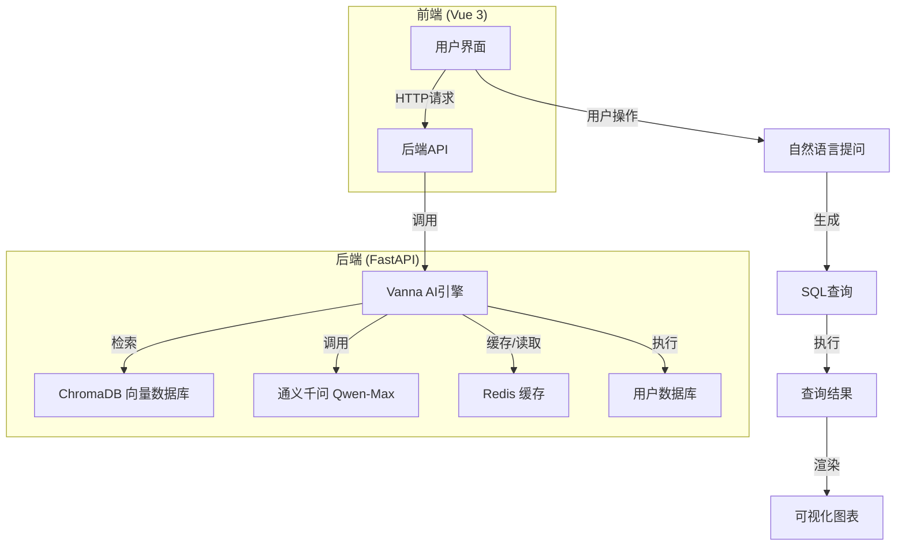
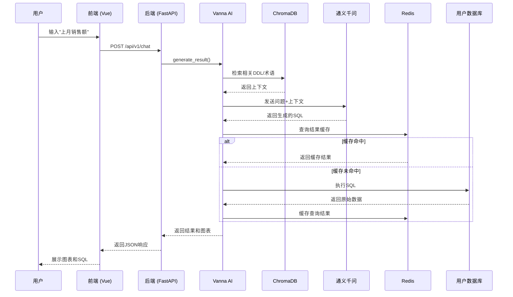

# 系统概述

<cite>
**本文档引用文件**   
- [README.md](file://README.md)
- [1_prd.md](file://docs/general/1_prd.md)
- [2_tech_stack.md](file://docs/general/2_tech_stack.md)
- [main.py](file://backend/app/main.py)
- [vanna_manager.py](file://backend/app/services/vanna_manager.py)
- [metadata.py](file://backend/app/models/metadata.py)
- [chat.py](file://backend/app/api/v1/endpoints/chat.py)
- [dashboard.py](file://backend/app/api/v1/endpoints/dashboard.py)
- [config.py](file://backend/app/core/config.py)
- [index.vue](file://frontend/src/views/Chat/index.vue)
- [index.vue](file://frontend/src/views/Dashboard/index.vue)
</cite>

## 目录
1. [项目愿景与定位](#项目愿景与定位)
2. [核心功能与用户工作流](#核心功能与用户工作流)
3. [系统架构与技术选型](#系统架构与技术选型)
4. [关键组件协同机制](#关键组件协同机制)
5. [SaaS多租户支持](#saas多租户支持)
6. [实际应用场景](#实际应用场景)
7. [系统优势总结](#系统优势总结)

## 项目愿景与定位

Universal BI 是一个全栈式自然语言数据分析平台，其核心愿景是构建一个跨行业、通用的商业智能解决方案。该平台基于“元数据驱动（Metadata Driven）”的理念，不包含任何特定业务逻辑（如进销存），而是通过动态理解用户的数据库结构，让用户能够通过自然语言与数据库进行对话，从而实现数据分析的民主化。

平台的目标是让任何用户，无论其技术背景如何，都能轻松地连接数据库、提出问题，并获得可视化的分析结果。其定位是成为一个AI驱动的智能数据分析助手，将复杂的SQL查询和数据可视化过程自动化，极大地降低了数据访问的门槛。

**Section sources**
- [README.md](file://README.md#L14-L27)
- [1_prd.md](file://docs/general/1_prd.md#L3-L5)

## 核心功能与用户工作流

Universal BI 的核心功能围绕一个清晰的用户工作流展开，从数据源连接到最终的仪表盘展示，形成一个完整的分析闭环。

### 核心功能模块
平台的核心功能模块包括：
- **数据源管理 (Data Connection Hub)**：支持添加和管理 MySQL、PostgreSQL 等主流数据库连接。
- **语义建模层 (Dataset Builder)**：用户通过可视化界面选择需要分析的表，系统自动同步其元数据（字段、注释等），并训练AI模型，从而定义AI的“知识边界”。
- **智能问答 (Chat BI)**：用户在选定的数据集上下文中，用自然语言提问，系统自动生成SQL、执行查询，并将结果以图表形式展示。
- **仪表盘 (Dashboard)**：用户可以将有价值的查询结果保存为卡片，构建个性化的数据驾驶舱，实现数据洞察的固化和共享。

### 典型用户工作流
一个典型的用户工作流如下：
1.  **连接数据源**：用户进入“数据连接中心”，输入数据库的主机、端口、用户名、密码等信息，建立与外部数据库的连接。
2.  **创建并训练数据集**：用户新建一个数据集（如“Q1销售分析”），选择已连接的数据源，并勾选需要分析的表（如`orders`, `users`）。点击“开始训练”后，系统会自动提取这些表的DDL（数据定义语言）和元数据，并将其注入向量数据库（ChromaDB），完成AI模型的训练。
3.  **进行聊天查询**：在“Chat BI”页面，用户选择已训练好的数据集，然后输入自然语言问题，例如“查询上个月的销售额”。系统会调用AI模型生成SQL，执行查询，并将结果以柱状图或表格的形式展示。
4.  **构建仪表盘**：用户可以将满意的查询结果一键“保存到看板”，该图表卡片会被添加到指定的仪表盘中，形成一个可随时刷新的数据视图。

**Section sources**
- [README.md](file://README.md#L206-L241)
- [1_prd.md](file://docs/general/1_prd.md#L12-L42)

## 系统架构与技术选型

Universal BI 采用现代化的前后端分离架构，技术选型兼顾了性能、可维护性和开发效率。

### 前后端技术栈
- **前端**：采用 **Vue 3 + TypeScript** 作为核心框架，结合 **Vite** 构建工具，确保了快速的开发体验。UI组件库选用 **Element Plus**，并使用 **Tailwind CSS** 进行原子化样式开发，提供了现代化且美观的用户界面。图表渲染依赖于强大的 **ECharts** 库。
- **后端**：采用 **FastAPI** 框架，利用其高性能和自动生成API文档的特性。数据库交互使用 **SQLAlchemy**，并通过反射（Reflection）机制读取用户连接的外部数据库结构。

### 关键技术选型
- **AI引擎 (Vanna AI)**：平台的核心是Vanna AI框架，它负责将自然语言转换为SQL。项目通过自定义的 `VannaLegacy` 类，集成了通义千问（Qwen-Max）大模型，确保了生成SQL的准确性和稳定性。
- **向量数据库 (ChromaDB)**：用于存储和检索训练数据（如DDL、业务术语、QA对）。当用户提问时，系统会从ChromaDB中检索出最相关的上下文信息，注入到大模型的提示词（Prompt）中，从而指导AI生成正确的SQL。
- **缓存服务 (Redis)**：用于缓存频繁查询的SQL结果，显著提升系统响应速度，避免对底层数据库造成不必要的压力。

**Diagram sources **
- [README.md](file://README.md#L28-L46)
- [2_tech_stack.md](file://docs/general/2_tech_stack.md#L1-L28)
- [main.py](file://backend/app/main.py#L1-L35)
- [vanna_manager.py](file://backend/app/services/vanna_manager.py#L42-L94)

## 关键组件协同机制

系统各组件通过精巧的设计协同工作，共同完成从自然语言到可视化结果的转换。

### 数据流与控制流
1.  **请求入口**：用户的自然语言查询通过前端发送到后端 `/chat` API 接口。
2.  **权限与上下文验证**：后端API首先验证用户对指定数据集的访问权限，并获取该数据集关联的数据库连接信息。
3.  **AI查询生成**：`VannaManager` 组件被调用。它会根据数据集ID，初始化一个对应的 `VannaLegacy` 实例。该实例会从ChromaDB中检索与当前问题最相关的DDL和业务术语，并将这些上下文与用户问题一起发送给通义千问大模型。
4.  **SQL执行与缓存**：大模型返回生成的SQL后，系统会先检查Redis缓存中是否存在该查询的结果。如果不存在，则使用SQLAlchemy连接到用户数据库执行查询，并将结果缓存到Redis中。
5.  **结果处理与可视化**：查询结果返回后，系统会根据数据特征（如行数、列数）自动推荐最佳的图表类型（柱状图、折线图、表格等），并将结果和图表类型一并返回给前端。

### 反馈式学习优化
系统支持反馈式学习，以持续优化AI的准确性。当用户对生成的SQL不满意时，可以提供正确的SQL进行修正。后端的 `/feedback` 接口会接收这个“问题-正确SQL”的配对，并将其作为新的训练数据（QA对）存入ChromaDB。这样，当未来遇到类似问题时，AI就能生成更准确的SQL。

**Diagram sources **
- [vanna_manager.py](file://backend/app/services/vanna_manager.py#L222-L255)
- [chat.py](file://backend/app/api/v1/endpoints/chat.py#L13-L43)
- [config.py](file://backend/app/core/config.py#L26-L30)

## SaaS多租户支持

Universal BI 平台设计时就考虑了SaaS（软件即服务）多租户的需求，确保了不同用户和资源之间的隔离与安全。

### 数据隔离与权限控制
系统通过数据库模型中的 `owner_id` 字段实现了细粒度的权限控制。每个数据源、数据集、仪表盘等资源都可以归属于一个特定的用户（`owner_id`）。当普通用户访问资源时，系统会通过 `apply_ownership_filter` 函数自动过滤查询，确保用户只能看到自己的资源或被标记为“公共资源”（`owner_id` 为 `None`）的资源。

### 安全性与隔离性
- **密码加密**：用户连接外部数据库时输入的密码，会使用Fernet对称加密算法进行加密存储，保障了敏感信息的安全。
- **向量库隔离**：不同数据集的训练数据存储在ChromaDB中不同的集合（Collection）里，集合名称为 `vec_ds_{dataset_id}`。这种物理隔离的设计，有效防止了AI在不同业务场景间产生“幻觉”或混淆。
- **公共资源管理**：只有平台超级管理员才能创建、修改或删除公共资源，普通用户只能使用，这保证了核心共享资源的稳定性和权威性。

**Section sources**
- [1_prd.md](file://docs/general/1_prd.md#L44-L46)
- [metadata.py](file://backend/app/models/metadata.py#L29-L49)
- [dashboard.py](file://backend/app/api/v1/endpoints/dashboard.py#L101-L104)

## 实际应用场景

Universal BI 可以广泛应用于各种需要数据分析的场景，尤其适合作为企业内部的数据分析助手。

### 企业内部数据分析助手
在一个典型的零售企业中，Universal BI 可以赋能不同角色的员工：
- **销售经理**：无需学习SQL，可以直接提问“上个月华东区的销售额是多少？”，系统会立即生成图表，帮助其快速掌握业绩情况。
- **市场专员**：可以提问“统计各产品类别的销售占比”，系统自动生成饼图，为市场活动提供数据支持。
- **数据管理员**：负责连接公司的订单、用户、库存等数据库，创建“销售分析”、“用户画像”等数据集并进行训练，为业务部门提供数据服务。

通过这种方式，Universal BI 打破了数据壁垒，让一线业务人员能够直接与数据对话，加速了数据驱动决策的进程。

## 系统优势总结

Universal BI 平台凭借其创新的设计和强大的技术栈，具备以下核心优势：

- **低门槛访问数据**：用户无需掌握SQL或数据分析工具，只需使用自然语言即可获取数据洞察，极大地扩大了数据使用者的范围。
- **AI驱动SQL生成**：基于Vanna AI和通义千问大模型，能够准确地将复杂的自然语言问题转化为可执行的SQL查询，解决了传统BI工具需要专业人员编写查询的痛点。
- **反馈式学习优化**：通过用户反馈机制，系统能够持续学习和进化，随着时间的推移，AI生成SQL的准确率会越来越高，形成一个正向循环。
- **现代化用户体验**：基于Vue 3和Element Plus的前端提供了流畅、美观的交互体验，暗色/亮色主题切换和现代化UI设计提升了用户的使用愉悦感。

综上所述，Universal BI 不仅仅是一个工具，更是一个将AI能力与数据分析深度融合的平台，为组织实现数据民主化提供了强有力的支持。