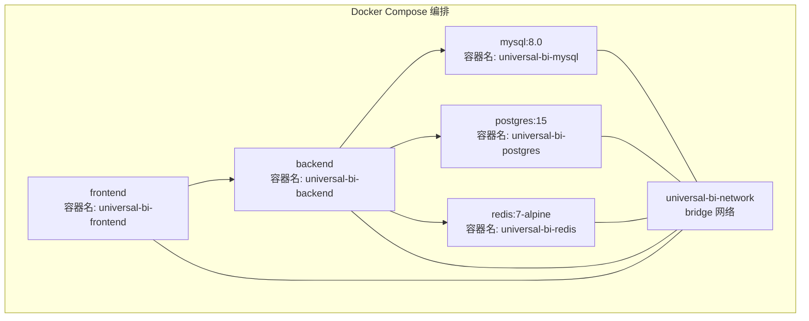
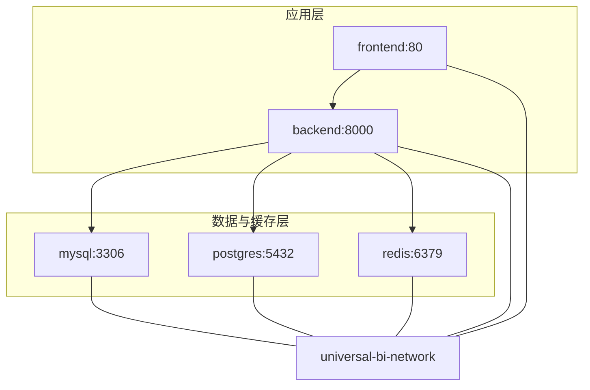
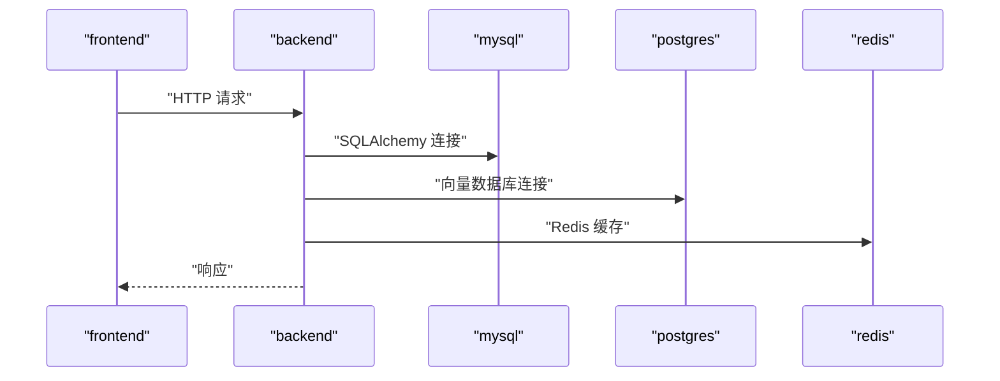
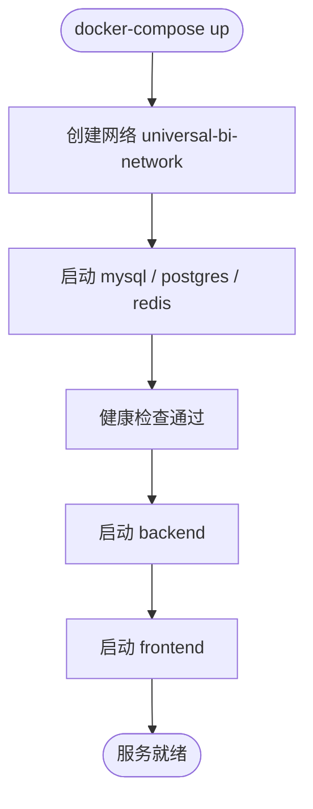

# Docker Compose 部署

<cite>
**本文引用的文件**
- [docker-compose.yml](file://docker-compose.yml)
- [.env.example](file://.env.example)
- [Dockerfile.backend](file://Dockerfile.backend)
- [Dockerfile.frontend](file://Dockerfile.frontend)
- [README.md](file://README.md)
- [backend/requirements.txt](file://backend/requirements.txt)
- [frontend/package.json](file://frontend/package.json)
- [setup.sh](file://setup.sh)
</cite>

## 目录
1. [简介](#简介)
2. [项目结构](#项目结构)
3. [核心组件](#核心组件)
4. [架构总览](#架构总览)
5. [详细组件分析](#详细组件分析)
6. [依赖关系分析](#依赖关系分析)
7. [性能与资源考虑](#性能与资源考虑)
8. [故障排查指南](#故障排查指南)
9. [结论](#结论)
10. [附录](#附录)

## 简介
本指南面向希望使用 Docker Compose 部署 Universal BI 的用户，系统解析 docker-compose.yml 中 mysql、postgres、redis、backend、frontend 五个服务的配置细节，涵盖镜像版本、环境变量、端口映射、数据卷挂载、健康检查、服务间通信、依赖与启动顺序、容器命名与重启策略，并给出常见部署问题的排查方法。同时，结合 .env.example 与 Dockerfile.backend/ frontend，说明如何通过环境变量实现服务间连接（如 backend 通过服务名连接 mysql）。

## 项目结构
该仓库采用前后端分离的微服务式容器编排，使用单个 docker-compose.yml 定义所有服务与网络，配合 .env.example 提供默认环境变量模板，Dockerfile.backend/ frontend 分别构建后端与前端镜像。

**图表来源**
- [docker-compose.yml](file://docker-compose.yml#L7-L27)
- [docker-compose.yml](file://docker-compose.yml#L32-L50)
- [docker-compose.yml](file://docker-compose.yml#L55-L70)
- [docker-compose.yml](file://docker-compose.yml#L75-L104)
- [docker-compose.yml](file://docker-compose.yml#L109-L120)
- [docker-compose.yml](file://docker-compose.yml#L138-L141)

**章节来源**
- [docker-compose.yml](file://docker-compose.yml#L1-L141)
- [.env.example](file://.env.example#L1-L72)

## 核心组件
- mysql:8.0
  - 容器名: universal-bi-mysql
  - 环境变量: ROOT 密码、数据库名、时区
  - 端口映射: ${MYSQL_PORT:-3306}:3306
  - 数据卷: mysql_data、迁移脚本挂载
  - 命令: 指定认证插件与字符集
  - 健康检查: mysqladmin ping
- postgres:15
  - 容器名: universal-bi-postgres
  - 环境变量: 密码、数据库名、时区
  - 端口映射: ${POSTGRES_PORT:-5432}:5432
  - 数据卷: postgres_data
  - 健康检查: pg_isready
- redis:7-alpine
  - 容器名: universal-bi-redis
  - 环境变量: 可选密码
  - 端口映射: ${REDIS_PORT:-6379}:6379
  - 数据卷: redis_data
  - 健康检查: redis-cli ping
- backend
  - 构建: Dockerfile.backend
  - 容器名: universal-bi-backend
  - 端口映射: ${BACKEND_PORT:-8000}:8000
  - 环境: 从 .env 加载；设置数据库、Redis、向量数据库连接参数
  - 依赖: mysql、postgres、redis 健康后才启动
  - 数据卷: backend 源码挂载、chroma_db
  - 健康检查: 访问 /api/v1/health
- frontend
  - 构建: Dockerfile.frontend
  - 容器名: universal-bi-frontend
  - 端口映射: ${FRONTEND_PORT:-3000}:80
  - 依赖: backend 启动后
  - 网络: 与 backend 共享网络

**章节来源**
- [docker-compose.yml](file://docker-compose.yml#L7-L27)
- [docker-compose.yml](file://docker-compose.yml#L32-L50)
- [docker-compose.yml](file://docker-compose.yml#L55-L70)
- [docker-compose.yml](file://docker-compose.yml#L75-L104)
- [docker-compose.yml](file://docker-compose.yml#L109-L120)

## 架构总览
下图展示了服务间的依赖与通信路径，以及网络拓扑。

**图表来源**
- [docker-compose.yml](file://docker-compose.yml#L7-L27)
- [docker-compose.yml](file://docker-compose.yml#L32-L50)
- [docker-compose.yml](file://docker-compose.yml#L55-L70)
- [docker-compose.yml](file://docker-compose.yml#L75-L104)
- [docker-compose.yml](file://docker-compose.yml#L109-L120)
- [docker-compose.yml](file://docker-compose.yml#L138-L141)

## 详细组件分析

### MySQL 服务（数据持久化与初始化）
- 镜像与版本: mysql:8.0
- 容器名: universal-bi-mysql
- 重启策略: always
- 环境变量
  - ROOT 密码: 来自环境变量或默认值
  - 数据库名: 默认 universal_bi
  - 时区: Asia/Shanghai
- 端口映射: ${MYSQL_PORT:-3306}:3306
- 数据卷
  - mysql_data: 持久化 /var/lib/mysql
  - 将 backend/migrations 挂载到 /docker-entrypoint-initdb.d，实现首次启动自动执行 SQL 初始化
- 命令: 指定认证插件与字符集
- 健康检查: 使用 mysqladmin ping，周期 10s，超时 5s，重试 5 次
- 网络: 加入 universal-bi-network

**章节来源**
- [docker-compose.yml](file://docker-compose.yml#L7-L27)

### PostgreSQL 服务（向量数据库）
- 镜像与版本: postgres:15
- 容器名: universal-bi-postgres
- 重启策略: always
- 环境变量
  - 密码: 来自环境变量或默认值
  - 数据库名: 默认 universal_bi_vector
  - 时区: Asia/Shanghai
- 端口映射: ${POSTGRES_PORT:-5432}:5432
- 数据卷: postgres_data
- 健康检查: 使用 pg_isready -U postgres
- 网络: 加入 universal-bi-network

**章节来源**
- [docker-compose.yml](file://docker-compose.yml#L32-L50)

### Redis 服务（缓存）
- 镜像与版本: redis:7-alpine
- 容器名: universal-bi-redis
- 重启策略: always
- 命令: 启用 AOF；若设置密码则强制认证
- 端口映射: ${REDIS_PORT:-6379}:6379
- 数据卷: redis_data
- 健康检查: redis-cli ping
- 网络: 加入 universal-bi-network

**章节来源**
- [docker-compose.yml](file://docker-compose.yml#L55-L70)

### Backend 服务（后端 API）
- 构建上下文与 Dockerfile: Dockerfile.backend
- 容器名: universal-bi-backend
- 重启策略: always
- 端口映射: ${BACKEND_PORT:-8000}:8000
- 环境
  - 从 .env 加载
  - 数据库连接: 通过 mysql 服务名与端口连接
  - Redis 连接: 通过 redis 服务名与端口连接
  - 向量数据库连接: 通过 postgres 服务名与端口连接
- 依赖
  - depends_on: mysql、postgres、redis 健康后启动
- 数据卷
  - backend 源码挂载，便于热更新
  - chroma_data: 持久化向量存储目录
- 健康检查: 访问 /api/v1/health
- 网络: 加入 universal-bi-network

**图表来源**
- [docker-compose.yml](file://docker-compose.yml#L75-L104)

**章节来源**
- [docker-compose.yml](file://docker-compose.yml#L75-L104)
- [Dockerfile.backend](file://Dockerfile.backend#L1-L40)
- [.env.example](file://.env.example#L54-L72)

### Frontend 服务（静态站点）
- 构建上下文与 Dockerfile: Dockerfile.frontend
- 容器名: universal-bi-frontend
- 重启策略: always
- 端口映射: ${FRONTEND_PORT:-3000}:80
- 依赖: 仅依赖 backend 启动
- 网络: 加入 universal-bi-network

**章节来源**
- [docker-compose.yml](file://docker-compose.yml#L109-L120)
- [Dockerfile.frontend](file://Dockerfile.frontend#L1-L38)

### 数据卷与网络
- 数据卷
  - mysql_data: 持久化 MySQL 数据
  - postgres_data: 持久化 PostgreSQL 数据
  - redis_data: 持久化 Redis 数据
  - chroma_data: 持久化向量存储
- 网络
  - universal-bi-network: bridge 类型，所有服务加入同一网络以便通过服务名互相发现与通信

**章节来源**
- [docker-compose.yml](file://docker-compose.yml#L125-L141)

## 依赖关系分析

### 启动顺序与依赖
- mysql、postgres、redis: 作为基础设施先于 backend 启动，且通过健康检查确保可用
- backend: 在 mysql、postgres、redis 健康后启动，同时依赖其提供数据库与缓存能力
- frontend: 在 backend 启动后启动，用于提供静态资源与代理后端 API

**图表来源**
- [docker-compose.yml](file://docker-compose.yml#L93-L99)
- [docker-compose.yml](file://docker-compose.yml#L117-L118)

**章节来源**
- [docker-compose.yml](file://docker-compose.yml#L93-L99)
- [docker-compose.yml](file://docker-compose.yml#L117-L118)

### 服务间通信与连接
- backend 通过服务名连接其他服务
  - MySQL: 使用 mysql 服务名与 3306 端口
  - PostgreSQL: 使用 postgres 服务名与 5432 端口
  - Redis: 使用 redis 服务名与 6379 端口
- 环境变量驱动连接字符串
  - 数据库连接: 通过 SQLALCHEMY_DATABASE_URI 指定
  - Redis 连接: 通过 REDIS_URL 指定
  - 向量数据库连接: 通过 VN_PG_* 环境变量指定

**章节来源**
- [docker-compose.yml](file://docker-compose.yml#L85-L92)
- [.env.example](file://.env.example#L22-L47)

## 性能与资源考虑
- 端口映射
  - 建议在生产中固定端口映射，避免冲突
- 数据卷
  - 使用 named volumes（如 mysql_data）确保数据持久化
- 健康检查
  - 合理的间隔与超时有助于快速发现异常
- 镜像与构建
  - 后端与前端镜像分别构建，减少不必要的变更影响
- 资源隔离
  - 可在 docker-compose.yml 中增加 deploy.resources 限制 CPU/内存（如需）

[本节为通用建议，无需具体文件引用]

## 故障排查指南

### 服务启动失败
- 检查容器状态与日志
  - docker-compose ps
  - docker-compose logs -f backend
  - docker-compose logs -f mysql
  - docker-compose logs -f postgres
  - docker-compose logs -f redis
- 重启服务
  - docker-compose restart
- 完全重建
  - docker-compose down
  - docker-compose up -d --build

**章节来源**
- [README.md](file://README.md#L284-L325)

### 网络连接超时
- 确认服务均加入同一网络
  - universal-bi-network 为 bridge 网络
- 确认 backend 使用服务名连接
  - mysql、postgres、redis 服务名必须与 docker-compose.yml 中一致
- 检查防火墙与端口占用
  - 本地端口映射冲突会导致外部无法访问

**章节来源**
- [docker-compose.yml](file://docker-compose.yml#L138-L141)
- [docker-compose.yml](file://docker-compose.yml#L85-L92)

### 数据库连接失败
- 检查 .env 中数据库连接配置
  - SQLALCHEMY_DATABASE_URI 是否正确
- 确认 mysql 与 postgres 健康
  - docker-compose ps mysql
  - docker-compose ps postgres
- 首次启动是否执行了初始化脚本
  - backend/migrations 是否正确挂载

**章节来源**
- [.env.example](file://.env.example#L22-L27)
- [docker-compose.yml](file://docker-compose.yml#L17-L19)

### Redis 连接问题
- 检查 Redis 服务
  - docker-compose exec redis redis-cli ping
- 检查 REDIS_URL 配置
  - 若设置了密码，需在 URL 中体现

**章节来源**
- [README.md](file://README.md#L327-L337)
- [.env.example](file://.env.example#L35-L39)

### 前端访问 404
- 确认前端使用 Nginx 提供静态资源
- 确认后端支持 SPA 路由回退（后端需处理前端路由）

**章节来源**
- [Dockerfile.frontend](file://Dockerfile.frontend#L25-L37)
- [README.md](file://README.md#L339-L344)

### 性能问题
- 查看系统资源使用
  - docker stats
- 清理 Docker 缓存
  - docker system prune -a
- 清理向量数据（谨慎）
  - 删除 backend/chroma_db

**章节来源**
- [README.md](file://README.md#L345-L356)

## 结论
通过 docker-compose.yml 的统一编排，Universal BI 将 MySQL、PostgreSQL、Redis 与后端、前端服务整合在一个可复现的环境中。利用服务名与共享网络实现服务间通信，借助健康检查保障启动顺序与可用性，配合 .env.example 的环境变量模板，用户可在本地快速完成部署与调试。遇到问题时，可依据本指南的排查步骤定位并解决。

## 附录

### 环境变量与默认值对照
- 数据库与缓存
  - MYSQL_ROOT_PASSWORD、MYSQL_DATABASE、MYSQL_PORT
  - POSTGRES_PASSWORD、POSTGRES_DB、POSTGRES_PORT
  - REDIS_PORT、REDIS_PASSWORD
- 应用端口
  - BACKEND_PORT、FRONTEND_PORT
- 后端连接参数
  - SQLALCHEMY_DATABASE_URI（指向 mysql 服务名）
  - REDIS_URL（指向 redis 服务名）
  - VN_PG_*（指向 postgres 服务名）

**章节来源**
- [.env.example](file://.env.example#L54-L72)
- [docker-compose.yml](file://docker-compose.yml#L85-L92)

### 一键部署脚本（可选）
- setup.sh 支持 dev 与 docker 两种模式
  - docker 模式会自动安装 Docker、构建镜像并启动服务
  - 提供常用命令与访问地址提示

**章节来源**
- [setup.sh](file://setup.sh#L241-L287)
- [README.md](file://README.md#L79-L98)