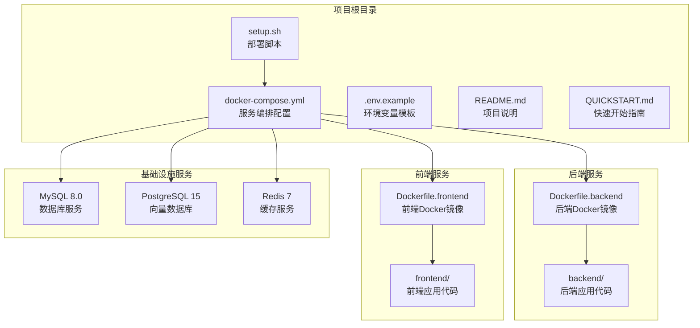
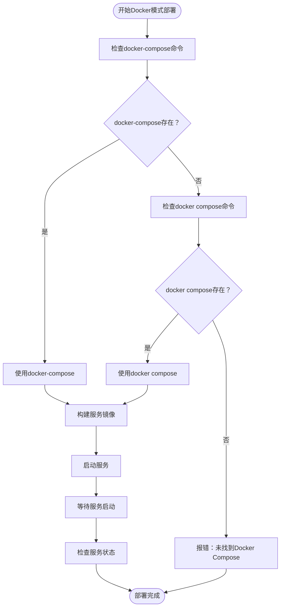
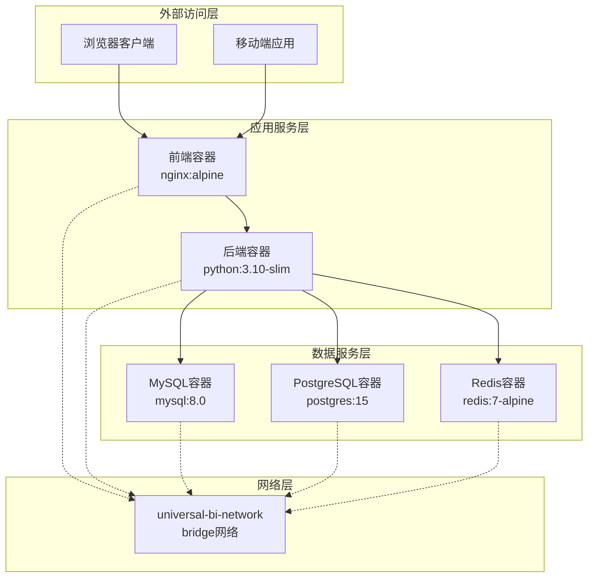
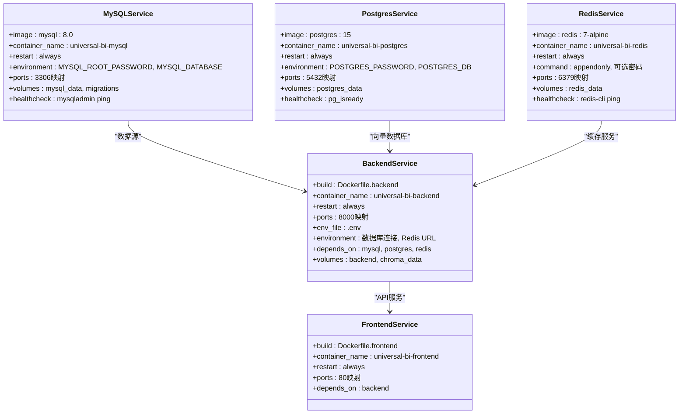
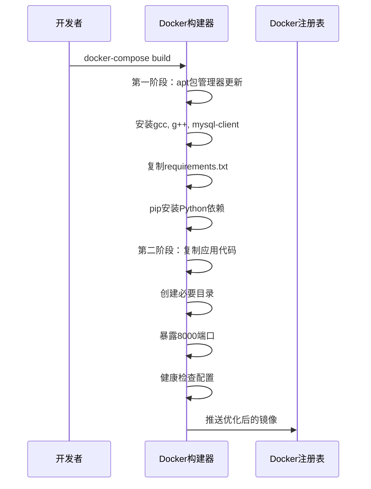
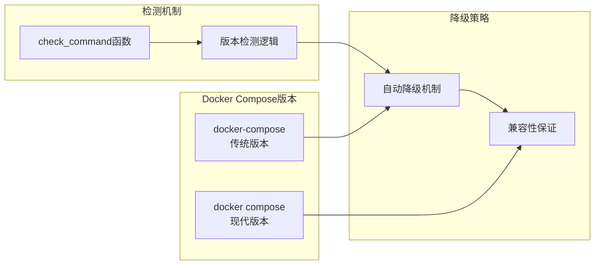

# Docker兼容性处理

<cite>
**本文档引用的文件**
- [setup.sh](file://setup.sh)
- [docker-compose.yml](file://docker-compose.yml)
- [Dockerfile.backend](file://Dockerfile.backend)
- [Dockerfile.frontend](file://Dockerfile.frontend)
- [.env.example](file://.env.example)
- [QUICKSTART.md](file://QUICKSTART.md)
- [README.md](file://README.md)
- [setup.bat](file://setup.bat)
</cite>

## 目录
1. [引言](#引言)
2. [项目结构概览](#项目结构概览)
3. [核心组件分析](#核心组件分析)
4. [架构总览](#架构总览)
5. [详细组件分析](#详细组件分析)
6. [依赖关系分析](#依赖关系分析)
7. [性能考虑](#性能考虑)
8. [故障排除指南](#故障排除指南)
9. [结论](#结论)

## 引言

本文档深入分析了Universal BI项目中Docker模式的兼容性处理机制，重点阐述了如何在不同Linux发行版上实现Docker Compose的自动兼容处理，包括从传统`docker-compose`命令到现代`docker compose`子命令的无缝降级机制。同时，文档详细说明了Docker服务安装流程在Ubuntu、Debian、CentOS等不同Linux发行版上的差异化处理策略，以及Docker组权限配置的重要注意事项。此外，还提供了docker-compose版本冲突的解决方案和容器网络配置的最佳实践指导。

## 项目结构概览

该项目采用前后端分离的微服务架构，通过Docker容器化技术实现服务的隔离和统一管理。整体项目结构包含后端API服务、前端Web应用、数据库服务以及辅助的缓存和向量数据库服务。

**图表来源**
- [setup.sh](file://setup.sh#L1-L318)
- [docker-compose.yml](file://docker-compose.yml#L1-L141)
- [Dockerfile.backend](file://Dockerfile.backend#L1-L40)
- [Dockerfile.frontend](file://Dockerfile.frontend#L1-L38)

**章节来源**
- [setup.sh](file://setup.sh#L1-L318)
- [docker-compose.yml](file://docker-compose.yml#L1-L141)
- [README.md](file://README.md#L1-L200)

## 核心组件分析

### Docker Compose兼容性处理机制

项目实现了智能的Docker Compose版本兼容性检测和降级机制，确保在不同环境中都能稳定运行。

#### 核心兼容性逻辑

**图表来源**
- [setup.sh](file://setup.sh#L251-L257)

#### 关键实现细节

在Docker模式部署函数中，系统首先检查`docker-compose`命令的存在性，如果不存在则自动降级到`docker compose`命令。这种设计充分考虑了不同Docker版本和安装方式的差异。

**章节来源**
- [setup.sh](file://setup.sh#L241-L287)

### 多Linux发行版兼容性处理

项目针对不同的Linux发行版实现了差异化的Docker安装策略，确保在各种环境下都能成功安装和配置Docker服务。

#### 发行版差异化处理

| 发行版 | 安装方式 | 包管理器 | Docker服务控制 |
|--------|----------|----------|----------------|
| Ubuntu/Debian | 脚本安装 | apt | usermod加入docker组 |
| CentOS/RHEL | yum安装 | yum | systemctl启动和启用 |
| macOS | 手动安装 | Homebrew | Docker Desktop |

**章节来源**
- [setup.sh](file://setup.sh#L123-L146)

### Docker组权限配置

Docker组权限配置是确保用户无需sudo权限即可使用Docker命令的关键步骤。项目在安装过程中自动将用户添加到docker组，并提供重新登录以使权限生效的提示。

**章节来源**
- [setup.sh](file://setup.sh#L137-L145)

## 架构总览

项目的Docker架构采用多容器微服务设计，所有服务都在独立的容器中运行，通过自定义网络进行通信。

**图表来源**
- [docker-compose.yml](file://docker-compose.yml#L138-L141)
- [docker-compose.yml](file://docker-compose.yml#L7-L22)
- [docker-compose.yml](file://docker-compose.yml#L32-L50)
- [docker-compose.yml](file://docker-compose.yml#L55-L70)

## 详细组件分析

### Docker Compose配置详解

#### 服务定义分析

项目使用YAML格式定义了完整的微服务架构，每个服务都有明确的功能定位和资源配置。

**图表来源**
- [docker-compose.yml](file://docker-compose.yml#L7-L27)
- [docker-compose.yml](file://docker-compose.yml#L32-L50)
- [docker-compose.yml](file://docker-compose.yml#L55-L70)
- [docker-compose.yml](file://docker-compose.yml#L75-L104)
- [docker-compose.yml](file://docker-compose.yml#L109-L120)

#### 网络配置最佳实践

项目定义了一个专用的bridge网络`universal-bi-network`，所有服务都连接到该网络，实现了服务间的安全通信和隔离。

**章节来源**
- [docker-compose.yml](file://docker-compose.yml#L138-L141)

### Dockerfile构建优化

#### 后端Dockerfile优化策略

后端服务使用多阶段构建策略，第一阶段安装系统依赖，第二阶段仅包含运行时必需的文件，显著减小镜像体积。

**图表来源**
- [Dockerfile.backend](file://Dockerfile.backend#L10-L17)
- [Dockerfile.backend](file://Dockerfile.backend#L19-L26)
- [Dockerfile.backend](file://Dockerfile.backend#L34-L36)

#### 前端Dockerfile多阶段构建

前端服务采用Nginx作为生产环境容器，构建过程分为开发依赖安装和静态资源构建两个阶段。

**章节来源**
- [Dockerfile.frontend](file://Dockerfile.frontend#L1-L38)

### 环境变量配置管理

项目使用`.env.example`文件提供完整的环境变量配置模板，支持多种数据库配置和端口定制。

**章节来源**
- [.env.example](file://.env.example#L1-L72)

## 依赖关系分析

### Docker Compose版本兼容性依赖

项目在部署脚本中实现了对不同Docker Compose版本的兼容性处理，确保在各种环境中都能正常工作。

**图表来源**
- [setup.sh](file://setup.sh#L71-L80)
- [setup.sh](file://setup.sh#L251-L257)

### Linux发行版依赖差异

不同Linux发行版在包管理器、服务管理器和权限配置方面存在显著差异，项目通过条件判断实现适配。

**章节来源**
- [setup.sh](file://setup.sh#L123-L146)

## 性能考虑

### 镜像构建优化

项目采用了多阶段构建策略，有效减少了最终镜像的大小和启动时间。

### 健康检查机制

所有关键服务都配置了健康检查，确保容器能够自动重启异常的服务，提高系统的稳定性。

**章节来源**
- [docker-compose.yml](file://docker-compose.yml#L23-L27)
- [docker-compose.yml](file://docker-compose.yml#L46-L50)
- [docker-compose.yml](file://docker-compose.yml#L66-L70)
- [Dockerfile.backend](file://Dockerfile.backend#L34-L36)

## 故障排除指南

### Docker Compose版本冲突解决方案

当遇到docker-compose版本冲突时，可以采用以下解决方案：

1. **检查当前版本**：使用`docker-compose --version`和`docker compose version`分别检查两个命令的版本
2. **统一使用方式**：在项目中统一使用一种命令风格，避免混用
3. **环境变量配置**：通过设置环境变量确保使用正确的Docker Compose版本

### Docker组权限问题

如果遇到Docker权限问题，需要：

1. **确认用户已加入docker组**：使用`groups $USER`检查用户所属组
2. **重新登录系统**：使组权限变更生效
3. **检查Docker服务状态**：使用`systemctl status docker`检查服务状态

### 容器网络连接问题

如果出现容器间无法通信的问题：

1. **检查网络配置**：确认所有服务都连接到相同的网络
2. **验证服务依赖**：使用`docker-compose depends_on`检查服务启动顺序
3. **查看网络详情**：使用`docker network ls`和`docker network inspect`查看网络状态

**章节来源**
- [setup.sh](file://setup.sh#L144-L145)
- [docker-compose.yml](file://docker-compose.yml#L93-L99)

## 结论

Universal BI项目在Docker兼容性处理方面展现了高度的工程化水平，通过智能的版本检测和自动降级机制，确保了在不同环境和Docker版本下的稳定运行。项目不仅实现了对传统`docker-compose`和现代`docker compose`命令的无缝兼容，还在多Linux发行版的差异化处理、Docker组权限配置、容器网络设计等方面体现了专业的实践经验。

这些设计决策为类似项目的容器化部署提供了宝贵的参考，特别是在处理版本兼容性和跨平台部署方面的最佳实践值得其他项目借鉴。通过合理的架构设计和完善的错误处理机制，项目实现了高可用性和易维护性的平衡。