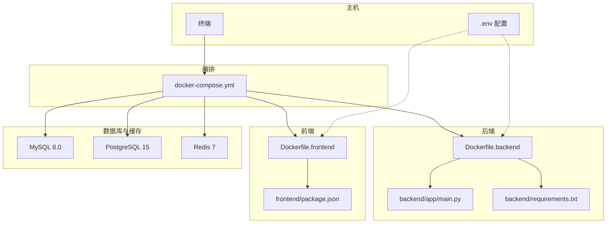
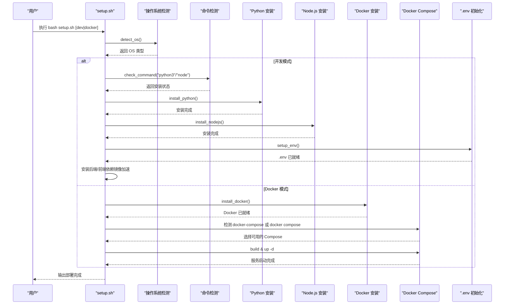
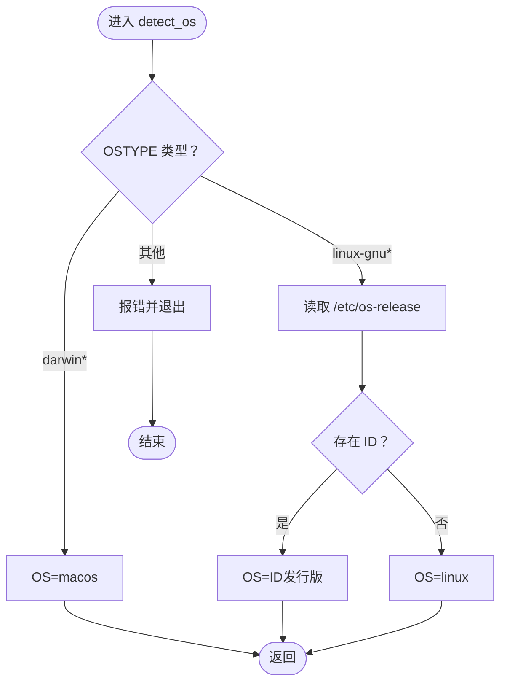
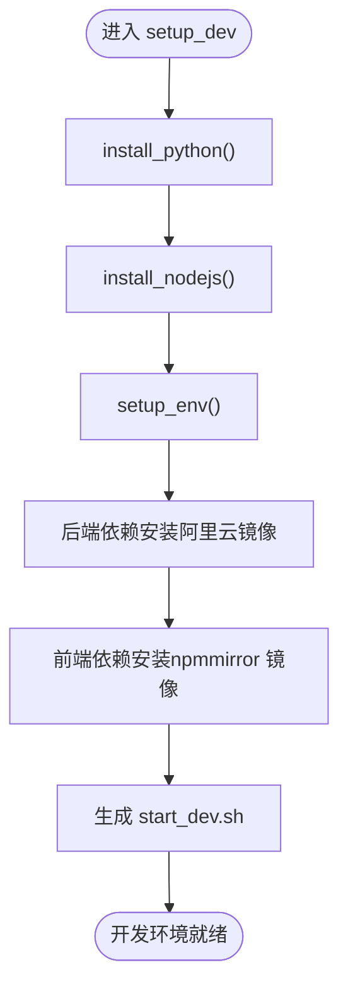
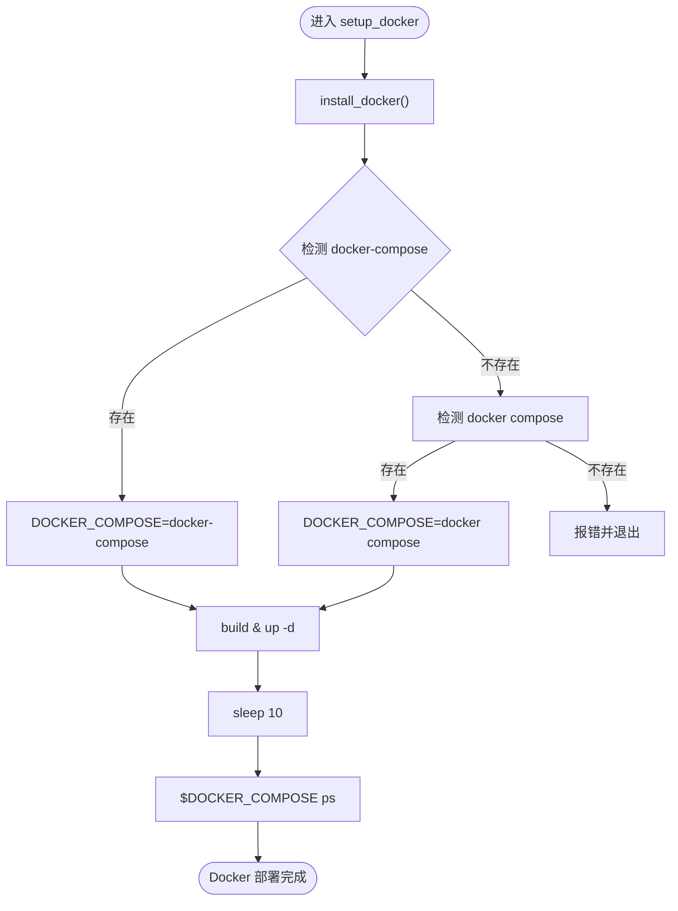
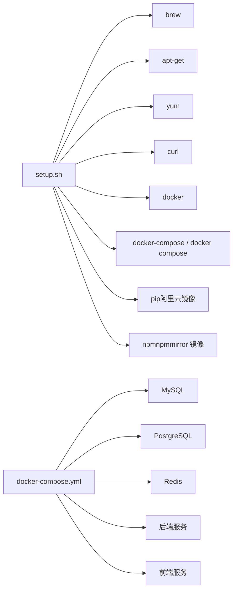

# Linux/macOS 部署指南

<cite>
**本文引用的文件列表**
- [setup.sh](file://setup.sh)
- [setup.bat](file://setup.bat)
- [README.md](file://README.md)
- [QUICKSTART.md](file://QUICKSTART.md)
- [.env.example](file://.env.example)
- [docker-compose.yml](file://docker-compose.yml)
- [Dockerfile.backend](file://Dockerfile.backend)
- [Dockerfile.frontend](file://Dockerfile.frontend)
- [requirements.txt](file://requirements.txt)
- [package.json](file://package.json)
- [backend/app/main.py](file://backend/app/main.py)
</cite>

## 目录
1. [简介](#简介)
2. [项目结构](#项目结构)
3. [核心组件](#核心组件)
4. [架构总览](#架构总览)
5. [详细组件分析](#详细组件分析)
6. [依赖关系分析](#依赖关系分析)
7. [性能考虑](#性能考虑)
8. [故障排查指南](#故障排查指南)
9. [结论](#结论)
10. [附录](#附录)

## 简介
本指南面向 Linux/macOS 用户，提供 Universal BI 项目的“一键部署”完整流程说明，重点解析 setup.sh 脚本的架构与执行路径，涵盖：
- 跨平台检测机制（通过 OSTYPE 识别 macOS 与各类 Linux 发行版）
- 环境检测函数（detect_os、check_command）的工作原理
- 开发模式（dev）下 Python 3.10 与 Node.js 18 的自动化安装流程及包管理器适配逻辑
- Docker 模式下 docker-compose 兼容性处理（优先使用 docker-compose，降级到 docker compose）
- .env 文件初始化流程与依赖安装的国内镜像加速配置（阿里云 PyPI 与 npmmirror）
- 预期输出示例、常见错误（权限不足、网络超时）的解决方案，以及 Docker 组权限注意事项

## 项目结构
该项目采用前后端分离架构，包含后端（FastAPI）、前端（Vue 3 + Vite）、数据库（MySQL/PostgreSQL）、缓存（Redis）与向量数据库（ChromaDB/PGVector），并通过 Docker Compose 进行编排。

**图表来源**
- [docker-compose.yml](file://docker-compose.yml#L1-L141)
- [Dockerfile.backend](file://Dockerfile.backend#L1-L40)
- [Dockerfile.frontend](file://Dockerfile.frontend#L1-L38)
- [backend/app/main.py](file://backend/app/main.py#L1-L35)
- [.env.example](file://.env.example#L1-L72)

**章节来源**
- [README.md](file://README.md#L1-L507)
- [docker-compose.yml](file://docker-compose.yml#L1-L141)

## 核心组件
- 跨平台检测与环境检测：通过 OSTYPE 识别系统类型，并对命令可用性进行检测，决定后续安装策略。
- 开发模式安装：自动安装 Python 3.10、Node.js 18；安装后端 Python 依赖（使用阿里云 PyPI 镜像）与前端 Node.js 依赖（使用 npmmirror 镜像）。
- Docker 模式安装：安装 Docker（macOS 提示手动安装 Docker Desktop），随后检测 docker-compose 或 docker compose 的可用性，构建并启动服务。
- .env 初始化：若不存在则复制 .env.example 并提示用户编辑关键配置项（如 DASHSCOPE_API_KEY）。
- 国内镜像加速：pip 安装指定阿里云 PyPI 镜像，npm 安装指定 npmmirror 镜像。

**章节来源**
- [setup.sh](file://setup.sh#L51-L80)
- [setup.sh](file://setup.sh#L82-L121)
- [setup.sh](file://setup.sh#L123-L146)
- [setup.sh](file://setup.sh#L148-L168)
- [setup.sh](file://setup.sh#L170-L239)
- [setup.sh](file://setup.sh#L241-L287)
- [Dockerfile.backend](file://Dockerfile.backend#L23)
- [Dockerfile.frontend](file://Dockerfile.frontend#L14)

## 架构总览
下面的序列图展示了脚本在不同模式下的执行流程与关键步骤。

**图表来源**
- [setup.sh](file://setup.sh#L289-L317)
- [setup.sh](file://setup.sh#L51-L69)
- [setup.sh](file://setup.sh#L71-L80)
- [setup.sh](file://setup.sh#L82-L121)
- [setup.sh](file://setup.sh#L123-L146)
- [setup.sh](file://setup.sh#L241-L287)

## 详细组件分析

### 跨平台检测机制（OSTYPE 与 /etc/os-release）
- 通过 OSTYPE 判断是否为 macOS 或 Linux。
- 在 Linux 下进一步读取 /etc/os-release，获取 ID（如 ubuntu、debian、centos、rhel）以区分发行版。
- 若无法识别发行版，则回退为通用 linux。

**图表来源**
- [setup.sh](file://setup.sh#L51-L69)

**章节来源**
- [setup.sh](file://setup.sh#L51-L69)

### 环境检测函数（check_command）
- 通过 command -v 检查命令是否存在，存在则记录版本信息，否则提示未安装。
- 该函数贯穿 Python、Node.js、Docker、docker-compose/docker compose 的检测流程。

**章节来源**
- [setup.sh](file://setup.sh#L71-L80)

### 开发模式（dev）安装流程
- Python 3.10 安装：
  - macOS：使用 Homebrew 安装 python@3.10。
  - Ubuntu/Debian：更新 apt 并安装 python3、python3-pip、python3-venv。
  - CentOS/RHEL：安装 python3、python3-pip。
- Node.js 18 安装：
  - macOS：使用 Homebrew 安装 node@18。
  - Ubuntu/Debian：使用 nodesource 的 18.x 安装脚本并安装 nodejs。
  - CentOS/RHEL：使用 nodesource 的 18.x 安装脚本并安装 nodejs。
- 后端依赖安装：创建虚拟环境并使用阿里云 PyPI 镜像安装 requirements.txt。
- 前端依赖安装：使用 npmmirror 镜像安装前端依赖。
- 生成启动脚本：start_dev.sh，分别启动后端（uvicorn）与前端（npm run dev）。

**图表来源**
- [setup.sh](file://setup.sh#L170-L239)
- [Dockerfile.backend](file://Dockerfile.backend#L23)
- [Dockerfile.frontend](file://Dockerfile.frontend#L14)

**章节来源**
- [setup.sh](file://setup.sh#L82-L121)
- [setup.sh](file://setup.sh#L170-L239)
- [Dockerfile.backend](file://Dockerfile.backend#L23)
- [Dockerfile.frontend](file://Dockerfile.frontend#L14)

### Docker 模式安装流程
- Docker 安装：
  - macOS：提示手动安装 Docker Desktop。
  - Ubuntu/Debian：使用官方安装脚本安装 Docker，并将当前用户加入 docker 组。
  - CentOS/RHEL：安装 docker，启用 systemd 并加入 docker 组。
- Compose 兼容性处理：
  - 优先检测 docker-compose，若不存在则尝试 docker compose。
  - 将可用的命令赋值给 DOCKER_COMPOSE 变量，后续统一使用该变量执行构建与启动。
- 构建与启动：调用 $DOCKER_COMPOSE build 与 up -d，等待 10 秒后列出服务状态。

**图表来源**
- [setup.sh](file://setup.sh#L241-L287)

**章节来源**
- [setup.sh](file://setup.sh#L123-L146)
- [setup.sh](file://setup.sh#L241-L287)

### .env 文件初始化流程
- 若 .env 不存在，复制 .env.example 并提示用户编辑关键配置项（如 DASHSCOPE_API_KEY、数据库连接、Redis 连接等）。
- 若 .env 已存在，则跳过创建。

**章节来源**
- [setup.sh](file://setup.sh#L148-L168)
- [.env.example](file://.env.example#L1-L72)

### 国内镜像加速配置
- 后端依赖安装：pip install -r requirements.txt -i https://mirrors.aliyun.com/pypi/simple/
- 前端依赖安装：npm install --registry=https://registry.npmmirror.com
- Dockerfile.backend 与 Dockerfile.frontend 中同样使用了对应的镜像源。

**章节来源**
- [setup.sh](file://setup.sh#L188)
- [setup.sh](file://setup.sh#L195)
- [Dockerfile.backend](file://Dockerfile.backend#L23)
- [Dockerfile.frontend](file://Dockerfile.frontend#L14)

### 预期输出示例
- 开发模式：脚本会输出 INFO/SUCCESS/WARNING 等日志，最终提示启动开发服务的方式（start_dev.sh 或分别启动后端/前端）。
- Docker 模式：脚本会输出 INFO/SUCCESS/WARNING 等日志，最终提示服务访问地址与常用命令（logs/restart/down/ps）。

**章节来源**
- [setup.sh](file://setup.sh#L170-L239)
- [setup.sh](file://setup.sh#L241-L287)

## 依赖关系分析
- 脚本与系统命令：setup.sh 依赖 bash、command -v、brew/apt/yum/curl 等命令。
- 脚本与 Docker：Docker 模式依赖 docker、docker-compose 或 docker compose。
- 脚本与镜像源：pip 与 npm 安装均使用国内镜像加速。
- Compose 与服务：docker-compose.yml 定义了 MySQL、PostgreSQL、Redis、后端与前端服务之间的依赖与网络。

**图表来源**
- [setup.sh](file://setup.sh#L82-L146)
- [setup.sh](file://setup.sh#L241-L287)
- [docker-compose.yml](file://docker-compose.yml#L1-L141)

**章节来源**
- [setup.sh](file://setup.sh#L82-L146)
- [setup.sh](file://setup.sh#L241-L287)
- [docker-compose.yml](file://docker-compose.yml#L1-L141)

## 性能考虑
- 使用国内镜像源可显著降低依赖下载时间，尤其在受限网络环境下。
- Docker 模式下，Compose 会并行启动多个服务，建议预留足够 CPU/内存资源。
- 后端健康检查与前端静态资源由 Nginx 提供，有利于减少后端压力。

[本节为通用指导，无需具体文件分析]

## 故障排查指南
- 权限不足（Docker 组）：
  - 现象：docker 命令报权限错误。
  - 解决：CentOS/RHEL 会在安装 Docker 时将用户加入 docker 组；macOS 需手动安装 Docker Desktop 并重新登录以使组权限生效。
- 网络超时（镜像源）：
  - 现象：pip/npm 安装失败。
  - 解决：检查网络连通性，必要时更换镜像源或代理；确认阿里云 PyPI 与 npmmirror 可访问。
- Compose 命令缺失：
  - 现象：提示未安装 docker-compose 或 docker compose。
  - 解决：Docker 模式下优先使用 docker-compose，若不存在则使用 docker compose；若两者都不存在则安装相应组件。
- .env 配置缺失：
  - 现象：后端启动失败或 API Key 未生效。
  - 解决：复制 .env.example 为 .env，配置 DASHSCOPE_API_KEY、数据库连接、Redis 连接等关键项。

**章节来源**
- [setup.sh](file://setup.sh#L137)
- [setup.sh](file://setup.sh#L145)
- [setup.sh](file://setup.sh#L252-L257)
- [setup.sh](file://setup.sh#L150-L167)
- [.env.example](file://.env.example#L29-L40)

## 结论
setup.sh 提供了 Linux/macOS 平台下的一键部署能力，覆盖开发模式与 Docker 模式的完整生命周期。其通过 OSTYPE 与 /etc/os-release 实现跨平台识别，结合包管理器适配与国内镜像加速，显著提升了部署效率与成功率。Docker 模式下的 Compose 兼容性处理与 .env 初始化流程，进一步降低了用户的配置成本。建议在生产环境中优先使用 Docker 模式，并在首次部署后完善 .env 配置与安全设置。

[本节为总结性内容，无需具体文件分析]

## 附录

### 常用命令与访问地址
- 开发模式启动：bash start_dev.sh
- Docker 模式启动：docker-compose up -d
- 访问地址：
  - 前端：http://localhost:3000
  - 后端：http://localhost:8000
  - API 文档：http://localhost:8000/docs

**章节来源**
- [setup.sh](file://setup.sh#L232-L238)
- [setup.sh](file://setup.sh#L276-L279)

### .env 关键配置说明
- 必填项：DASHSCOPE_API_KEY（通义千问 API Key）
- 数据库连接：SQLALCHEMY_DATABASE_URI（支持 MySQL/PostgreSQL/SQLite）
- Redis 连接：REDIS_URL
- 向量数据库：VN_PG_*（PGVector）
- ChromaDB：CHROMA_PERSIST_DIR、CHROMA_N_RESULTS
- 端口映射：BACKEND_PORT、FRONTEND_PORT

**章节来源**
- [.env.example](file://.env.example#L29-L72)

### 后端与前端依赖清单
- 后端依赖：requirements.txt 中包含 FastAPI、Uvicorn、SQLAlchemy、Pydantic、数据库驱动、Cryptography、dotenv、Vanna、OpenAI、ChromaDB、Redis 等。
- 前端依赖：package.json 中包含 Vue Flow 等组件库。

**章节来源**
- [requirements.txt](file://requirements.txt#L1-L15)
- [package.json](file://package.json#L1-L8)