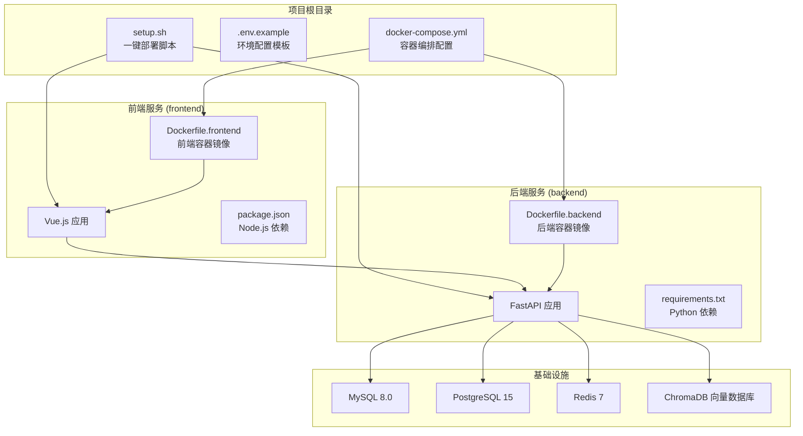
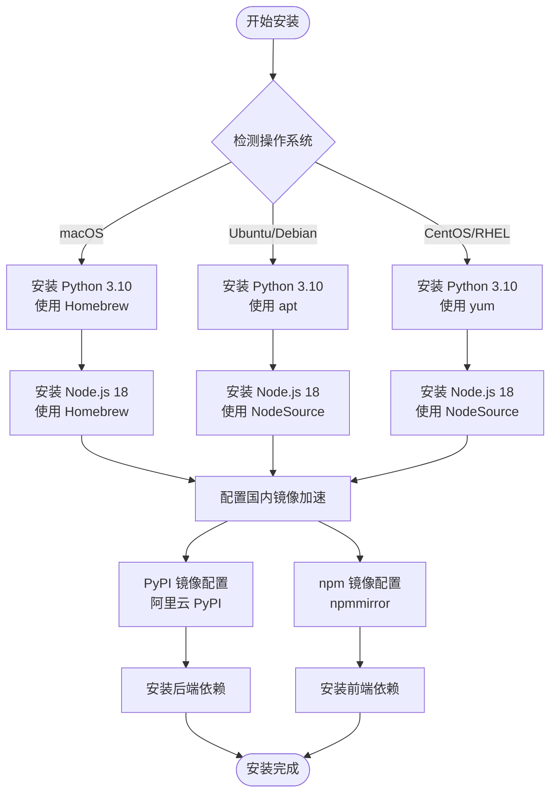
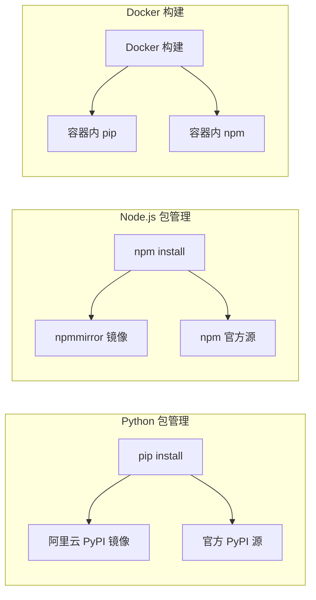
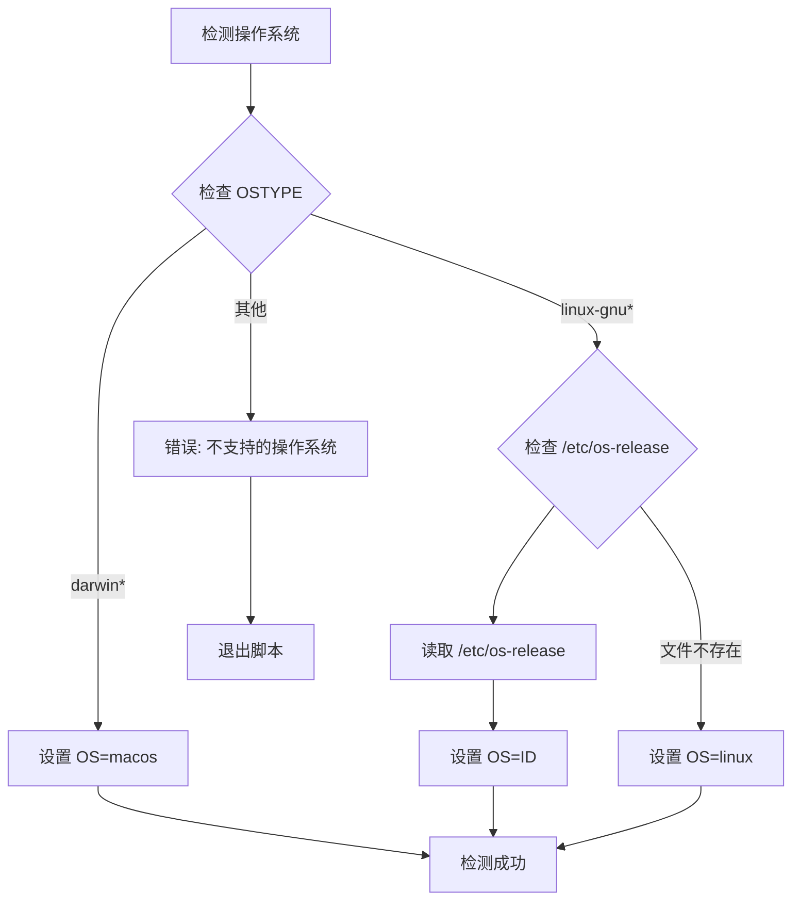
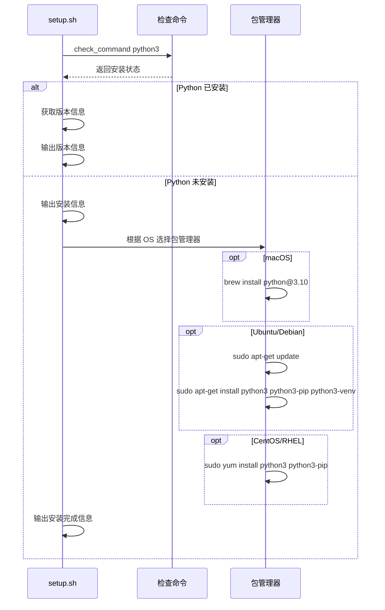
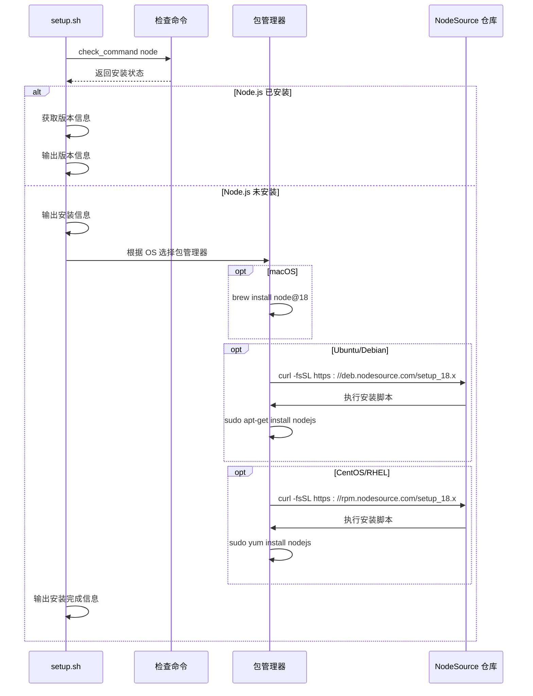
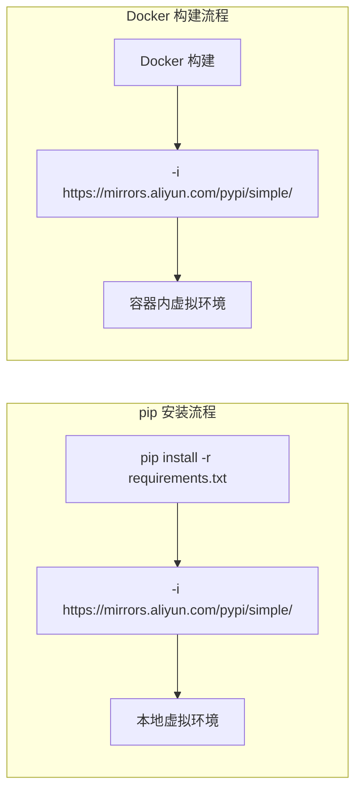
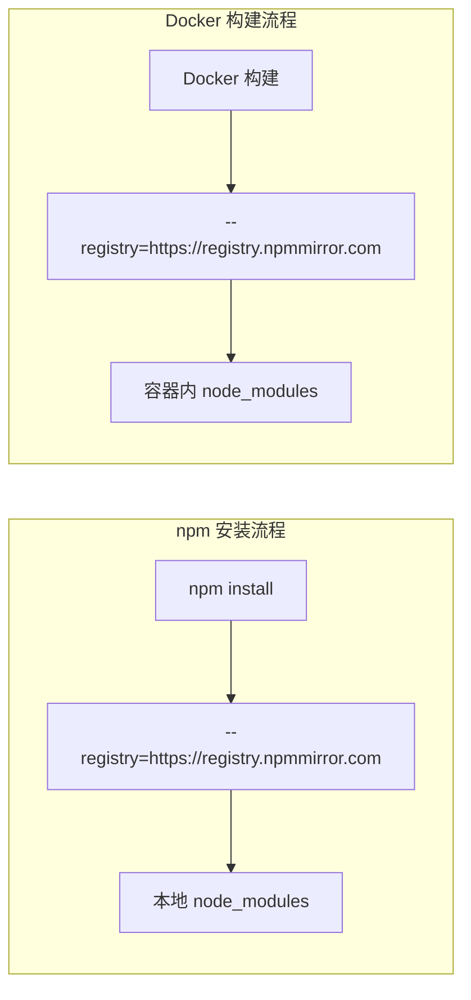
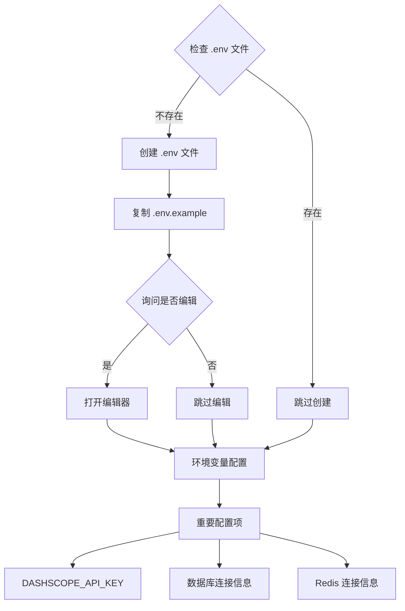
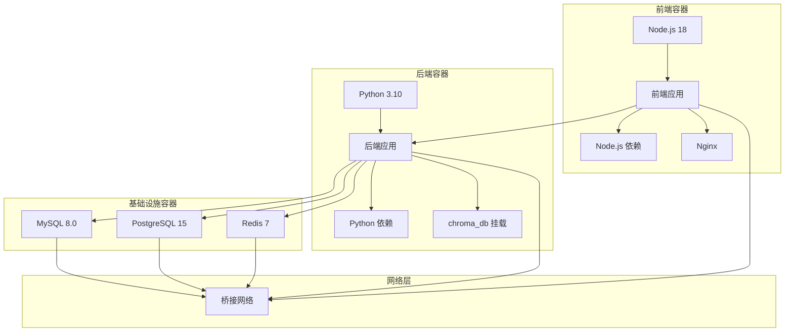

# 依赖安装流程

<cite>
**本文档引用的文件**
- [setup.sh](file://setup.sh)
- [README.md](file://README.md)
- [QUICKSTART.md](file://QUICKSTART.md)
- [backend/requirements.txt](file://backend/requirements.txt)
- [frontend/package.json](file://frontend/package.json)
- [.env.example](file://.env.example)
- [docker-compose.yml](file://docker-compose.yml)
- [Dockerfile.backend](file://Dockerfile.backend)
- [Dockerfile.frontend](file://Dockerfile.frontend)
</cite>

## 目录
1. [简介](#简介)
2. [项目结构](#项目结构)
3. [核心组件](#核心组件)
4. [架构概览](#架构概览)
5. [详细组件分析](#详细组件分析)
6. [依赖关系分析](#依赖关系分析)
7. [性能考虑](#性能考虑)
8. [故障排除指南](#故障排除指南)
9. [结论](#结论)

## 简介

本文档详细说明了 Universal BI 项目中 setup.sh 脚本的依赖安装流程，重点涵盖 Python 3.10 和 Node.js 18 的自动化安装过程，以及针对不同操作系统的包管理器适配逻辑。同时，文档解释了国内镜像加速配置（阿里云 PyPI 和 npmmirror）的实现方式，并提供了安装过程中可能遇到的各种错误的解决方案。

Universal BI 是一个基于 AI 的智能数据分析平台，支持自然语言与数据库对话，提供完整的数据可视化解决方案。项目采用前后端分离架构，后端使用 Python 3.8+ 和 FastAPI，前端使用 Vue.js 3.0+ 和 TypeScript。

## 项目结构

该项目采用现代化的全栈架构设计，包含以下主要组件：



**图表来源**
- [setup.sh](file://setup.sh#L1-L318)
- [docker-compose.yml](file://docker-compose.yml#L1-L141)
- [Dockerfile.backend](file://Dockerfile.backend#L1-L40)
- [Dockerfile.frontend](file://Dockerfile.frontend#L1-L38)

**章节来源**
- [setup.sh](file://setup.sh#L1-L318)
- [README.md](file://README.md#L1-L507)

## 核心组件

### Python 3.10 安装组件

setup.sh 脚本实现了跨平台的 Python 3.10 自动安装功能，支持以下操作系统：

- **macOS**: 使用 Homebrew 包管理器安装 Python 3.10
- **Ubuntu/Debian**: 使用 apt 包管理器安装 python3、python3-pip、python3-venv
- **CentOS/RHEL**: 使用 yum 包管理器安装 python3、python3-pip

### Node.js 18 安装组件

同样支持跨平台的 Node.js 18 自动安装：

- **macOS**: 使用 Homebrew 安装 Node.js 18
- **Ubuntu/Debian**: 使用 NodeSource 仓库安装 Node.js 18
- **CentOS/RHEL**: 使用 NodeSource 仓库安装 Node.js 18

### 国内镜像加速组件

项目实现了双镜像加速策略：

- **Python 包**: 使用阿里云 PyPI 镜像源 `https://mirrors.aliyun.com/pypi/simple/`
- **Node.js 包**: 使用 npmmirror 镜像源 `https://registry.npmmirror.com`

**章节来源**
- [setup.sh](file://setup.sh#L82-L121)
- [Dockerfile.backend](file://Dockerfile.backend#L23)
- [Dockerfile.frontend](file://Dockerfile.frontend#L14)

## 架构概览

### 依赖安装架构



**图表来源**
- [setup.sh](file://setup.sh#L51-L121)
- [setup.sh](file://setup.sh#L188-L196)

### 镜像加速架构



**图表来源**
- [setup.sh](file://setup.sh#L188)
- [setup.sh](file://setup.sh#L195)
- [Dockerfile.backend](file://Dockerfile.backend#L23)
- [Dockerfile.frontend](file://Dockerfile.frontend#L14)

## 详细组件分析

### 操作系统检测组件

setup.sh 脚本实现了智能的操作系统检测机制：



**图表来源**
- [setup.sh](file://setup.sh#L51-L69)

该组件支持以下操作系统：
- **macOS**: `darwin*` 系统类型
- **Linux**: `linux-gnu*` 系统类型，进一步检测具体发行版
- **不支持**: 其他系统类型

**章节来源**
- [setup.sh](file://setup.sh#L51-L69)

### Python 3.10 安装组件

Python 安装组件实现了条件检查和自动安装功能：



**图表来源**
- [setup.sh](file://setup.sh#L82-L100)

安装特点：
- **版本控制**: 明确指定 Python 3.10 版本
- **依赖包**: Ubuntu/Debian 发行版额外安装虚拟环境支持
- **权限处理**: 使用 sudo 权限进行系统级安装

**章节来源**
- [setup.sh](file://setup.sh#L82-L100)

### Node.js 18 安装组件

Node.js 安装组件同样实现了跨平台支持：



**图表来源**
- [setup.sh](file://setup.sh#L102-L121)

安装特点：
- **版本控制**: 明确指定 Node.js 18.x 版本
- **仓库配置**: 使用 NodeSource 提供的官方安装脚本
- **权限处理**: 使用 sudo 权限进行系统级安装

**章节来源**
- [setup.sh](file://setup.sh#L102-L121)

### 国内镜像加速组件

项目实现了双重镜像加速策略：

#### Python 镜像加速



**图表来源**
- [setup.sh](file://setup.sh#L188)
- [Dockerfile.backend](file://Dockerfile.backend#L23)

#### Node.js 镜像加速



**图表来源**
- [setup.sh](file://setup.sh#L195)
- [Dockerfile.frontend](file://Dockerfile.frontend#L14)

**章节来源**
- [setup.sh](file://setup.sh#L188-L196)
- [Dockerfile.backend](file://Dockerfile.backend#L23)
- [Dockerfile.frontend](file://Dockerfile.frontend#L14)

### 环境变量配置组件

setup.sh 脚本提供了智能的环境变量配置功能：



**图表来源**
- [setup.sh](file://setup.sh#L148-L168)
- [.env.example](file://.env.example#L29-L40)

**章节来源**
- [setup.sh](file://setup.sh#L148-L168)
- [.env.example](file://.env.example#L1-L72)

## 依赖关系分析

### Python 依赖关系

项目后端使用了丰富的 Python 生态系统依赖：

```mermaid
graph TB
subgraph "核心框架"
FastAPI[FastAPI >= 0.109.0]
Uvicorn[Uvicorn]
SQLAlchemy[SQLAlchemy]
Pydantic[Pydantic]
end
subgraph "数据库连接"
PyMySQL[PyMySQL]
Psycopg2[psycopg2-binary]
end
subgraph "安全认证"
Cryptography[Cryptography]
PythonJWSTools[python-jose[cryptography]]
Passlib[passlib[bcrypt]]
Bcrypt[bcrypt == 4.0.1]
end
subgraph "AI 功能"
Vanna[Vanna >= 2.0.0]
OpenAI[OpenAI]
ChromaDB[ChromaDB]
end
subgraph "缓存系统"
Redis[Redis >= 5.0.0]
end
subgraph "开发工具"
Faker[Faker]
Pandas[Pandas]
PythonMultipart[python-multipart]
end
FastAPI --> Uvicorn
FastAPI --> SQLAlchemy
FastAPI --> Pydantic
SQLAlchemy --> PyMySQL
SQLAlchemy --> Psycopg2
FastAPI --> Cryptography
FastAPI --> PythonJWSTools
FastAPI --> Passlib
FastAPI --> Bcrypt
FastAPI --> Vanna
Vanna --> OpenAI
Vanna --> ChromaDB
FastAPI --> Redis
FastAPI --> Faker
FastAPI --> Pandas
FastAPI --> PythonMultipart
```

**图表来源**
- [backend/requirements.txt](file://backend/requirements.txt#L1-L19)

**章节来源**
- [backend/requirements.txt](file://backend/requirements.txt#L1-L19)

### Node.js 依赖关系

前端项目使用了现代化的 Vue.js 生态系统：

```mermaid
graph TB
subgraph "核心框架"
Vue[Vue 3.4.0]
VueRouter[Vue Router 4.6.4]
Pinia[Pinia 2.1.7]
end
subgraph "UI 组件库"
ElementPlus[Element Plus 2.7.0]
Icons[图标库]
end
subgraph "图表可视化"
ECharts[ECharts 5.5.0]
VueECharts[vue-echarts 6.6.3]
end
subgraph "开发工具"
Vite[Vite 5.2.0]
TypeScript[TypeScript 5.4.0]
TailwindCSS[Tailwind CSS 3.4.0]
PostCSS[PostCSS 8.4.32]
end
subgraph "HTTP 客户端"
Axios[Axios 1.13.2]
end
subgraph "Vue Flow 图形"
VueFlowCore[@vue-flow/core 1.48.1]
VueFlowBackground[@vue-flow/background 1.3.2]
VueFlowControls[@vue-flow/controls 1.1.3]
VueFlowMinimap[@vue-flow/minimap 1.5.4]
end
subgraph "VueUse 工具"
VueUseCore[@vueuse/core 10.9.0]
end
subgraph "NProgress 加载"
NProgress[@types/nprogress 0.2.3]
end
Vue --> VueRouter
Vue --> Pinia
Vue --> ElementPlus
Vue --> ECharts
Vue --> Axios
Vue --> VueFlowCore
Vue --> VueUseCore
Vue --> NProgress
ElementPlus --> Icons
ECharts --> VueECharts
VueFlowCore --> VueFlowBackground
VueFlowCore --> VueFlowControls
VueFlowCore --> VueFlowMinimap
```

**图表来源**
- [frontend/package.json](file://frontend/package.json#L11-L38)

**章节来源**
- [frontend/package.json](file://frontend/package.json#L1-L40)

### Docker 依赖关系

容器化部署提供了完整的环境隔离：



**图表来源**
- [docker-compose.yml](file://docker-compose.yml#L1-L141)
- [Dockerfile.backend](file://Dockerfile.backend#L1-L40)
- [Dockerfile.frontend](file://Dockerfile.frontend#L1-L38)

**章节来源**
- [docker-compose.yml](file://docker-compose.yml#L1-L141)
- [Dockerfile.backend](file://Dockerfile.backend#L1-L40)
- [Dockerfile.frontend](file://Dockerfile.frontend#L1-L38)

## 性能考虑

### 镜像加速性能优势

国内镜像加速显著提升了依赖安装速度：

- **阿里云 PyPI**: 提供稳定的 CDN 加速，减少网络延迟
- **npmmirror**: 专门针对中国用户的 npm 镜像源，提供更好的网络稳定性

### 容器化部署性能

Docker 容器化部署具有以下性能优势：

- **资源隔离**: 每个服务独立运行，互不干扰
- **缓存优化**: Docker 层缓存机制减少重复构建时间
- **依赖复用**: 共享底层镜像层，节省存储空间

### 内存和 CPU 优化

- **Python 3.10**: 使用最新稳定版本，提供更好的性能表现
- **Node.js 18**: LTS 版本，平衡稳定性和性能
- **Redis 缓存**: 提升查询响应速度

## 故障排除指南

### 权限问题解决方案

#### Python 安装权限问题

**问题描述**: 使用 apt/yum 安装 Python 时出现权限错误

**解决方案**:
1. 确保使用 sudo 权限执行安装命令
2. 检查系统包管理器的可用性
3. 在 macOS 上使用 Homebrew 替代方案

#### Node.js 安装权限问题

**问题描述**: Node.js 安装过程中权限不足

**解决方案**:
1. 使用 sudo 权限执行安装
2. 检查网络连接和防火墙设置
3. 验证 NodeSource 仓库的可用性

#### Docker 权限问题

**问题描述**: Docker 服务启动失败或权限不足

**解决方案**:
1. 将当前用户添加到 docker 组
2. 重新登录系统使组权限生效
3. 检查 Docker 服务状态

**章节来源**
- [setup.sh](file://setup.sh#L137-L142)
- [setup.sh](file://setup.sh#L145)

### 网络超时问题解决方案

#### PyPI 镜像连接问题

**问题描述**: pip 安装时连接阿里云 PyPI 超时

**解决方案**:
1. 检查网络连接和代理设置
2. 尝试使用其他镜像源
3. 配置 pip.conf 文件使用镜像源

#### npm 镜像连接问题

**问题描述**: npm 安装时连接 npmmirror 超时

**解决方案**:
1. 检查网络连接和 DNS 解析
2. 验证 npm registry 配置
3. 清理 npm 缓存

#### NodeSource 仓库问题

**问题描述**: NodeSource 仓库下载失败

**解决方案**:
1. 检查系统时间和时区设置
2. 验证 GPG 密钥导入
3. 使用备用安装方法

**章节来源**
- [setup.sh](file://setup.sh#L114-L118)
- [setup.sh](file://setup.sh#L188)
- [setup.sh](file://setup.sh#L195)

### 磁盘空间问题

#### 容器镜像占用空间

**问题描述**: Docker 镜像和容器占用大量磁盘空间

**解决方案**:
1. 清理未使用的 Docker 镜像和容器
2. 删除不必要的数据卷
3. 定期维护 Docker 环境

#### 依赖包缓存清理

**问题描述**: 本地缓存占用磁盘空间

**解决方案**:
1. 清理 pip 缓存
2. 删除 node_modules 目录
3. 清理 npm 缓存

### 环境变量配置问题

#### API Key 配置错误

**问题描述**: DASHSCOPE_API_KEY 配置不正确导致服务异常

**解决方案**:
1. 从阿里云控制台获取有效的 API Key
2. 确保 API Key 格式正确
3. 重启相关服务使配置生效

#### 数据库连接问题

**问题描述**: 数据库连接字符串配置错误

**解决方案**:
1. 检查数据库主机、端口、凭据
2. 验证数据库服务状态
3. 确认网络连通性

**章节来源**
- [.env.example](file://.env.example#L29-L40)
- [.env.example](file://.env.example#L20-L28)

### 版本兼容性问题

#### Python 版本不兼容

**问题描述**: 使用不兼容的 Python 版本

**解决方案**:
1. 确保使用 Python 3.8+ 版本
2. 使用虚拟环境隔离依赖
3. 检查第三方库的 Python 版本要求

#### Node.js 版本不兼容

**问题描述**: Node.js 版本过低或过高

**解决方案**:
1. 使用 Node.js 16+ 版本
2. 检查 package.json 中的 engines 字段
3. 使用 nvm 管理 Node.js 版本

**章节来源**
- [README.md](file://README.md#L49-L56)
- [frontend/package.json](file://frontend/package.json#L1-L40)

## 结论

Universal BI 项目的依赖安装流程展现了现代全栈应用部署的最佳实践。通过智能的操作系统检测、跨平台包管理器适配、国内镜像加速和完善的错误处理机制，项目实现了高度自动化和用户友好的安装体验。

关键优势包括：

1. **跨平台兼容性**: 支持 macOS、Ubuntu/Debian、CentOS/RHEL 三大主流操作系统
2. **智能镜像加速**: 双重镜像源配置显著提升安装速度
3. **完善的错误处理**: 提供详细的错误诊断和解决方案
4. **容器化部署**: Docker Compose 提供一致的生产环境
5. **自动化程度高**: 一键部署脚本简化复杂安装流程

对于开发者而言，这套安装流程不仅降低了部署门槛，还提供了清晰的故障排除路径。无论是开发环境还是生产环境，都能通过统一的脚本实现快速、可靠的部署。

未来可以考虑的改进方向包括：
- 更详细的日志记录和调试信息
- 更灵活的配置选项
- 更完善的健康检查机制
- 更好的性能监控和优化建议